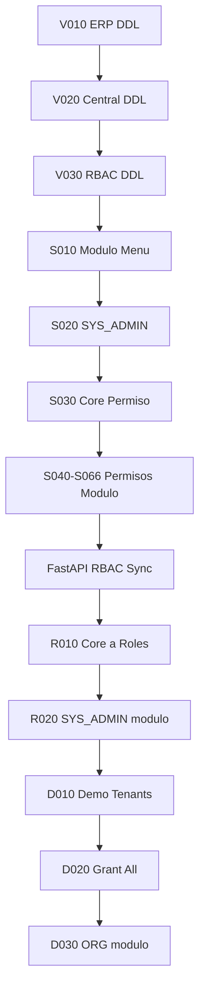

# BOOTSTRAP_ORDER — Orden oficial de ejecución (bootstrap_v2)

Ruta base: `app/bootstrap_v2/`

Convenciones:

- `V*` = schema (DDL)
- `S*` = catalog seed (global)
- `R*` = runtime seed (post-catalog, pre-或 con app)
- `D*` = QA/demo only

**Base de datos:** una BD shared (ej. `bd_sistema`, `bd_hybrid_sistema_central`) salvo pasos en `05_dedicated/`.

---

## Fase 0 — Preparación

| Paso | Acción |
|------|--------|
| 0.1 | `CREATE DATABASE` + collation acordada |
| 0.2 | Opcional: `USE <database>;` en cada script (descomentar en legacy) |

---

## Fase 1 — Schema (`01_schema/`) — PROD + DEV

> **Crítico (G-001):** ejecutar `V010` **antes** de `V020`.

| Orden | Archivo | Legacy source |
|------:|---------|---------------|
| 1 | `01_schema/V010__tablas_bd_erp_completo.sql` | `3.- TABLAS_BD_ERP_COMPLETO.sql` |
| 2 | `01_schema/V020__tablas_bd_central.sql` | `1.- TABLAS_BD_CENTRAL.sql` |
| 3 | `01_schema/V030__rbac_tablas_central.sql` | `5.- SCRIPT_RBAC_TABLAS_CENTRAL.sql` |

---

## Fase 2 — Catálogo global (`02_catalog/`) — PROD + DEV

| Orden | Archivo | Legacy source |
|------:|---------|---------------|
| 4 | `02_catalog/S010__seed_modulo_menu_completo.sql` | `4.- SEED_MODULO_MENU_COMPLETO.sql` |
| 5 | `02_catalog/S020__seed_admin_menu.sql` | `6.- SEED_ADMIN_MENU.sql` |
| 6 | `02_catalog/S030__seed_permisos_core.sql` | `7.- SEED_PERMISOS_CORE.sql` |

### Fase 2b — Permisos por módulo (`02_catalog/permisos_rbac/`)

Ejecutar en orden numérico **S040 → S066** (ver lista en `BOOTSTRAP_MANIFEST.md`).
Omitir **S067** salvo verificación de dependencias legacy.

| Orden | Archivo |
|------:|---------|
| 7–33 | `S040__permisos_rbac_org.sql` … `S066__permisos_rbac_fase4-candidatos.sql` |
| — | `S067__permisos_rbac__legacy_empty_stub.sql` (**skip** en prod) |

---

## Fase 3 — Aplicación (runtime support)

| Orden | Acción |
|------|--------|
| 34 | Arrancar FastAPI → `permission_sync_service.sync()` (tabla `permiso`) |
| 35 | Verificar logs `[RBAC] Permission synced` |

> Los seeds `S040–S066` pueden solaparse con el sync; ver G-032.

---

## Fase 4 — Runtime SQL (`03_runtime/`) — PROD (hasta onboarding completo)

| Orden | Archivo | Legacy source |
|------:|---------|---------------|
| 36 | `03_runtime/R010__asignar_core_app_a_roles.sql` | `8.- SEED_ASIGNAR_CORE_APP_A_ROLES.sql` |
| 37 | `03_runtime/R020__relacion_sys_admin_cliente_modulo.sql` | `10.- RELACION_SYS_ADMIN_CLIENTE_MODULO.sql` |

**Requisito:** deben existir filas en `rol` (creadas por onboarding API o QA `D010`).

---

## Fase 5 — QA / Demo (`04_qa/`) — **NO PRODUCCIÓN**

| Orden | Archivo | Legacy source |
|------:|---------|---------------|
| 38 | `04_qa/D010__seed_bd_central.sql` | `2.- SEED_BD_CENTRAL.sql` |
| 39 | `04_qa/D020__rol_permiso_administrador.sql` | `9.- SEED_ROL_PERMISO_ADMINISTRADOR.sql` |
| 40 | `04_qa/D030__cliente_modulo_activar_org.sql` | `SEED_CLIENTE_MODULO_ACTIVAR_ORG.sql` |

### Fase 5b — QA manual adicional (fuera de bootstrap_v2)

- Crear `org_empresa` y `usuario_rol.empresa_id` para escenarios JWT (ver `app/docs/pruebas/PRUEBAS_AUTH_MULTIEMPRESA.md`)

---

## Fase 6 — Dedicated tenants (`05_dedicated/`)

Por cada BD dedicada (`tipo_instalacion = dedicated`):

| Orden | Archivo | Dónde ejecutar |
|------:|---------|----------------|
| A1 | Repetir `V010` (ERP completo) en BD dedicada | BD dedicada |
| A2 | `05_dedicated/V010__rbac_tablas_dedicated.sql` | BD dedicada |
| A3 | Metadata `cliente_conexion` en central | BD central |

> Seeds `SEED_BD_DEDICADA_*` no forman parte de bootstrap_v2 (ver G-042).

---

## Perfiles de ejecución

### PROD mínimo (sin demo)

```
Fase 0 → Fase 1 (V010,V020,V030) → Fase 2 (S010,S020,S030,S040–S066 sin S067)
→ Fase 3 (app) → Fase 4 (R010,R020)
→ Onboarding API por cada tenant nuevo
```

### DEV / QA completo

```
PROD mínimo + Fase 5 (D010,D020,D030) + SQL manual multiempresa
```

### Dedicated

```
PROD central (sin D010 usuarios duplicados en dedicada) + Fase 6
```

---

## Diagrama de dependencias


