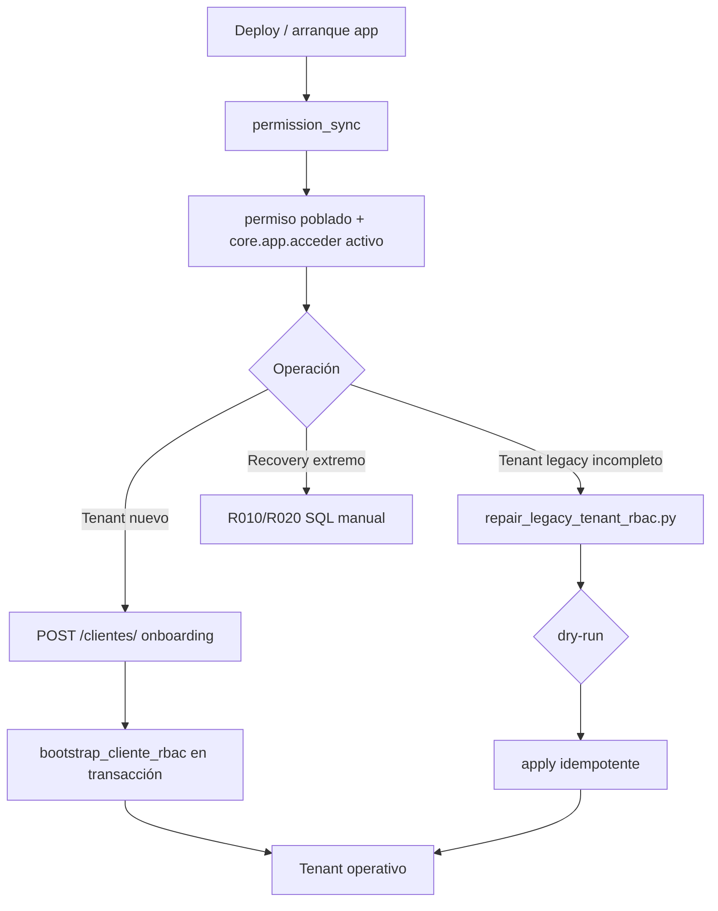

# Estado final runtime RBAC — Release candidate estable

**Fecha congelación:** 2026-05-21  
**Veredicto:** **RC1 cerrado** — ver [`RC1_FINAL_SIGNOFF.md`](RC1_FINAL_SIGNOFF.md) (2026-05-21, `bd_sistema_saas`, smoke consolidado PASS)

Evidencia tenant `prueba`: [`evidence/PRUEBA_REPAIR_EVIDENCE.json`](evidence/PRUEBA_REPAIR_EVIDENCE.json)

---

## 1. Qué queda activo (fuente de verdad)

| Capa | Componente | Rol |
|------|------------|-----|
| Startup | `register_core_permissions()` + `permission_sync_service` | Catálogo `permiso` desde rutas + `core.app.acceder` protegido |
| Tenant nuevo | `ClienteOnboardingService` + `OnboardingRbacService` | Cliente, roles, admin, `cliente_modulo`, `rol_permiso` (misma transacción) |
| Legacy incompleto | `LegacyTenantRbacService` + `scripts/repair_legacy_tenant_rbac.py` | Reparación idempotente (equivalente R010+R020 runtime) |
| Auth sesión | JWT multiempresa, refresh, `empresa_selection_pending` | Sin cambios estructurales en RC |
| API | `require_permission` + Permission Resolver | Autorización por `rol_permiso` |
| Menú | `GET /auth/menu` + `as_tenant_admin` / `cliente_modulo` | Navegación por módulos contratados |

**Scripts SQL bootstrap_v2 que siguen siendo necesarios en instalación:**

| Script | Uso |
|--------|-----|
| `01_schema/V010`, `V020`, `V030` | Esquema BD central |
| `02_catalog/S010`, `S020` | Catálogo `modulo`, menús |

---

## 2. Qué queda deprecated (mantener en repo, no pipeline tenant nuevo)

| Script / grupo | Sustituido por | Uso permitido |
|----------------|----------------|---------------|
| **R010** `asignar_core_app_a_roles.sql` | `bootstrap_cliente_rbac` / repair job | Recovery manual, tenants muy antiguos |
| **R020** `relacion_sys_admin_cliente_modulo.sql` | `activar_modulos_base_cliente` | Recovery manual (solo SYS_ADMIN global) |
| **S030** (solo `core.app.acceder`) | `core_permissions` + sync | Histórico |
| **S040–S066** grants masivos | `permission_sync` + onboarding/repair prefijos | **No usar** en tenants nuevos; legacy seeds |
| `MenuPermissionBinder` (no invocado) | `menu_resolver` + `rol_permiso` | No activar sin diseño |

---

## 3. Qué ya no se usa en tenants nuevos (PROD)

Para cada tenant creado vía `POST /api/v1/clientes/` después de este RC:

- No ejecutar **R010**, **R020**, **S030**, **S040–S066**
- No depender de seeds SQL para `rol_permiso` del ADMIN_TENANT
- Requisito previo: **un arranque de app** (permission_sync) antes del primer onboarding

---

## 4. Flujo oficial bootstrap 2025



**Orden onboarding (transacción única):**

1. `cliente` → `rol` → `usuario` + `usuario_rol`
2. `bootstrap_cliente_rbac` (ORG, SYS_ADMIN + grants ADMIN_TENANT)
3. `cliente_auth_config`, `cfg_codigo_secuencia`
4. `commit`

---

## 5. Estrategia legacy

| Tipo | Tenants | Acción |
|------|---------|--------|
| A — Referencia runtime | Creados post-RC con onboarding | Ninguna |
| B — Legacy completo | acme, innova (S040 histórico) | Opcional limpiar `tenant.cliente.crear`; no bloqueante |
| C — Incompleto | **prueba** (reparado), techcorp, global | `repair_legacy_tenant_rbac.py`; global/techcorp sin ADMIN_TENANT → roles manuales |
| Plataforma | platform / SYSTEM | Excluido del repair job |

**Comandos operativos:**

```bash
python scripts/repair_legacy_tenant_rbac.py --audit-only
python scripts/repair_legacy_tenant_rbac.py --dry-run --cliente-id <UUID>
python scripts/repair_legacy_tenant_rbac.py --apply --cliente-id <UUID>
```

---

## 6. Estrategia rollback

| Ámbito | Rollback |
|--------|----------|
| Repair job | Solo INSERT idempotente; rollback = DELETE filas `cliente_modulo`/`rol_permiso` por `fecha_creacion` o restore tabla backup |
| Onboarding runtime | Transacción atómica; fallo = rollback completo del tenant |
| permission_sync | Reversible reactivando permisos (`es_activo=1`); no borrar filas en caliente |
| Scripts R010/R020 | Re-ejecutar no duplica si `NOT EXISTS`; deshacer = DELETE manual acotado |

**No rollback recomendado:** eliminar scripts legacy del repositorio (congelados pero disponibles).

---

## 7. Validación controlada — tenant `prueba`

### 7.1 Dry-run (staging/dev)

| Métrica | Antes |
|---------|-------|
| `cliente_modulo` | 0 |
| `rol_permiso` ADMIN | 0 |
| Candidato | Sí (`NO_CLIENTE_MODULO`, `NO_ROL_PERMISO_ADMIN`) |

### 7.2 Apply

| Métrica | Antes → Después |
|---------|-----------------|
| `cliente_modulo` | 0 → **2** (ORG, SYS_ADMIN) |
| `rol_permiso` ADMIN | 0 → **44** |
| `core.app.acceder` | no → **sí** |
| `tenant.cliente.crear` | — → **no** (exclusión runtime OK) |

### 7.3 Idempotencia

Segunda ejecución `--apply`: tenant **ALREADY_HEALTHY** (sin inserts adicionales).

### 7.4 Smoke manual HTTP

| Prueba | Resultado |
|--------|-----------|
| Login `admin` | Pendiente — contraseña onboarding original no disponible |
| Impersonate → prueba | 403 validación tenant (validar en staging con equipo FE) |
| BD + repair JSON | **PASS** |

Recomendación operativa: tras repair, reset controlado de contraseña admin o smoke con credenciales documentadas en alta.

---

## 8. Arquitectura congelada — no tocar en RC1

Salvo **bugs críticos**, **seguridad**, **corrupción de permisos** o **inconsistencias multiempresa**:

- No refactor auth / RBAC amplio
- No eliminar scripts legacy
- No MenuPermissionBinder masivo
- No cambiar contrato JWT
- No nuevas fuentes de permisos (S040–S066)

### Fix crítico incluido en estabilización

- Import circular repair job: `CORE_APP_ACCEDER` literal en `onboarding_rbac_service.py` (permite `--apply` del CLI legacy).

---

## 9. Documentación de referencia

| Documento | Contenido |
|-----------|-----------|
| `RUNTIME_BOOTSTRAP_FLOW.md` | Flujo runtime |
| `E2E_RUNTIME_VALIDATION.md` | Validación E2E |
| `LEGACY_TENANT_REPAIR_PLAN.md` | Plan + CLI repair |
| `RELEASE_CANDIDATE_CHECKLIST.md` | Checklist deploy |
| `OPERATIONAL_HARDENING.md` | Monitoreo y backups |
| `LOGIN_SERIALIZATION_FIX.md` | Fix login tenant nuevo |
| `RUNTIME_DEPENDENCY_MATRIX.md` | Matriz dependencias |

---

## 10. Smoke tests automatizados (CI mínimo + staging)

| Artefacto | Uso |
|-----------|-----|
| `scripts/run_rc_validation_pipeline.py` | `--unit-only` (CI), `--http-smoke`, `--full-staging --create-tenant` |
| `scripts/http_smoke_tenant_rbac.py` | Smoke HTTP reutilizable (login → org → menu → permisos) |
| `scripts/staging_reset_tenant_admin.py` | Reset bcrypt admin staging |
| `scripts/bootstrap_v2_sql_apply.{sh,ps1}` | Fase A SQL (V010–V030, S010–S030) |
| `STAGING_VALIDATION_PIPELINE.md` | Runbook BD vacía → PASS |

```bash
python scripts/run_rc_validation_pipeline.py --unit-only
```

Opcional staging: `repair_legacy_tenant_rbac.py --audit-only` + smoke HTTP tras reset admin.

---

## 11. Declaración RC

El sistema se declara **release candidate estable** para:

- Creación de tenants vía API sin R010/R020
- Catálogo permisos por startup sync
- Reparación legacy idempotente (`prueba` validado en BD)
- Multiempresa, menú y refresh (validado en tenants de referencia acme / e2evalid01)

**Pendientes no bloqueantes RC1:** smoke HTTP completo en `prueba` (credencial), impersonación cross-tenant en dev local, tenants sin rol ADMIN_TENANT (techcorp/global).
