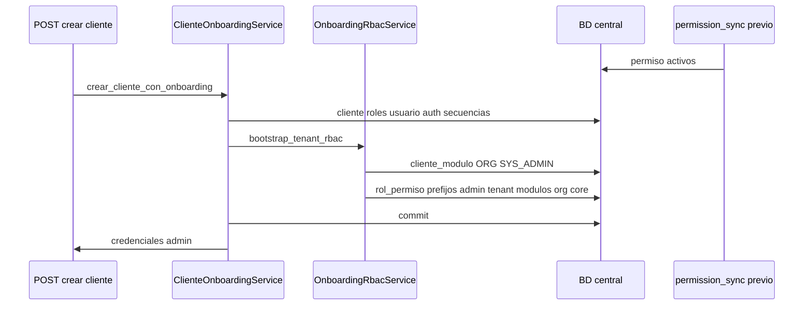

# IMPLEMENTATION PLAN — Fase 2 Runtime (Onboarding RBAC + Módulos base)

**Estado:** planificación — **sin cambios de código aplicados**  
**Referencia:** `RUNTIME_MIGRATION_PLAN.md` (Fases 2 y 3), `RUNTIME_RBAC_AUDIT.md`  
**Restricciones:** no modificar `bootstrap_v2/`, SQL legacy, V010/V020/V030.

**Objetivo:** tras `POST` crear cliente (onboarding), el tenant queda operable **solo con backend**, sin ejecutar `R010`, `R020`, `S030`, ni `S040–S066`.

---

## 1. Auditoría actual — `ClienteOnboardingService`

**Archivo:** `app/modules/tenant/application/services/cliente_onboarding_service.py`  
**Entrypoint:** `ClienteService.crear_cliente` → `crear_cliente_con_onboarding`.

### 1.1 Flujo y transacción

| Paso | Método | Tablas | Conexión |
|------|--------|--------|----------|
| 1 | `_insertar_cliente` | `cliente` | `AsyncSession` ADMIN, `session.begin()` |
| 2 | `_insertar_roles_base` | `rol` ×3 (`ADMIN_TENANT`, `MANAGER_TENANT`, `USER_TENANT`) | misma sesión |
| 3 | `_insertar_usuario_admin` | `usuario`, `usuario_rol` | misma sesión |
| 4 | `_insertar_auth_config_si_no_existe` | `cliente_auth_config` | misma sesión |
| 5 | `_insertar_secuencias_codigo` | `cfg_codigo_secuencia` | misma sesión (repo acepta `session`) |

**Commit:** al salir de `async with session.begin()` (una sola transacción atómica hoy).

### 1.2 Detalle por entidad

| Entidad | Comportamiento verificado |
|---------|---------------------------|
| **cliente** | INSERT con todos los campos de `ClienteCreate`; OUTPUT completo |
| **roles** | `empresa_id=NULL`, `es_admin_cliente` solo en `ADMIN_TENANT`, `codigo_rol` fijo |
| **usuario admin** | `nombre_usuario=admin`, `empresa_default_id=NULL`, `usuario_rol` con `empresa_id=NULL`, `es_empresa_default=0` |
| **cliente_auth_config** | INSERT mínimo si no existe |
| **cfg_codigo_secuencia** | 9 entidades (`org_*`, `inv_*`); `empresa_id=NULL` |

### 1.3 Ausencias confirmadas (gap)

| Recurso | Estado |
|---------|--------|
| `cliente_modulo` | ❌ no inserta |
| `rol_permiso` | ❌ no inserta |
| `rol_menu_permiso` | ❌ no inserta |
| Llamada a `ClienteModuloService` | ❌ |
| Llamada a `permisos_negocio_service` | ❌ |
| `aplicar_plantillas_roles` | ❌ |
| Invalidación `PermissionResolver` cache | ❌ |

---

## 2. Servicios existentes reutilizables (y límites)

| Servicio | ¿Reutilizar en Fase 2? | Motivo |
|----------|------------------------|--------|
| **`ClienteModuloService.activar_modulo_cliente`** | ⚠️ **No dentro de la misma transacción** | Usa `execute_query` / `execute_insert` con conexión propia, no `AsyncSession`. Valida cliente vía `ClienteService.obtener_cliente_por_id` (otra conexión). Riesgo de no ver cliente no commiteado. |
| **`aplicar_plantillas_roles`** | ⚠️ **Post-commit opcional** | Escribe `rol_menu_permiso` (menú), no `rol_permiso` (API). En catálogo S010/S020 **no hay** seeds `modulo_rol_plantilla` → suele retornar `[]`. |
| **`permisos_negocio_service.set_permisos_negocio_rol`** | ❌ | **Reemplaza** todos los `rol_permiso` del rol (`DELETE` + INSERT). Destructivo para onboarding. |
| **`permisos_negocio_service.listar_catalogo_permisos`** | ✅ referencia | Lee `permiso` activos; patrón de filtro por prefijo/módulo. |
| **`ModuloService.obtener_modulo_por_codigo`** | ✅ lectura | Resuelve `ORG` / `SYS_ADMIN` por código (SYS_ADMIN no tiene UUID fijo en S010). |
| **`permission_sync_service.sync`** | ❌ no en onboarding | Población global en startup; prerequisito de entorno. |
| **`permisos_usuario_service`** | ✅ validación | Comprueba efecto de grants en tests/login. |

**Conclusión de diseño:** nuevo módulo de servicio **`OnboardingRbacService`** con SQL vía **`AsyncSession`** (mismo patrón que onboarding), no delegar a `ClienteModuloService` en v1.

---

## 3. Arquitectura propuesta

### 3.1 Nuevo servicio (recomendado)

**Archivo nuevo:** `app/modules/tenant/application/services/onboarding_rbac_service.py`

| Función | Responsabilidad |
|---------|-----------------|
| `resolve_modulo_ids(session, codigos)` | `SELECT modulo_id FROM modulo WHERE codigo IN (...)` |
| `activar_modulos_cliente(session, cliente_id, modulo_ids, activado_por_usuario_id?)` | `INSERT cliente_modulo` idempotente (`NOT EXISTS`) — equivalente R020 por tenant |
| `resolve_permiso_ids_by_prefixes(session, prefixes)` | `SELECT permiso_id, codigo FROM permiso WHERE es_activo=1 AND (codigo LIKE ...)` |
| `grant_rol_permiso(session, cliente_id, rol_id, permiso_ids)` | `INSERT rol_permiso` con `NOT EXISTS` — equivalente R010 + S020§6 |
| `bootstrap_tenant_rbac(session, cliente_id, admin_rol_id, usuario_admin_id?)` | Orquesta módulos + permisos |

### 3.2 Integración en onboarding

**Archivo:** `cliente_onboarding_service.py` — dentro de `crear_cliente_con_onboarding`, **antes del fin de `session.begin()`**:

```text
... _insertar_secuencias_codigo(...)
await OnboardingRbacService.bootstrap_tenant_rbac(
    session,
    cliente_id=cliente_id,
    admin_rol_id=admin_rol_id,
    activado_por_usuario_id=usuario_id,  # opcional auditoría cliente_modulo
)
```

**Post-commit (opcional, misma request, fuera de transacción):**

```text
for modulo_codigo in ("ORG", "SYS_ADMIN"):
    await aplicar_plantillas_roles(cliente_id, modulo_id, ...)  # no-op si sin plantillas
get_permission_resolver().invalidate_for_tenant(cliente_id)
```

### 3.3 Constantes de negocio

**Módulos base automáticos:**

| Código | Origen catálogo | Notas |
|--------|-----------------|-------|
| `ORG` | S010 (`E1000001-...` o lookup por código) | Primera empresa / org CRUD |
| `SYS_ADMIN` | S020 (UUID dinámico) | Menú `/admin/*`; **obligatorio** lookup por `codigo` |

**Orden de activación:** `ORG` primero, luego `SYS_ADMIN` (sin `modulos_requeridos` en S010 para ORG).

**Permisos `rol_permiso` para `ADMIN_TENANT` — leer solo desde tabla `permiso` (sync):**

| Grupo | Criterio SQL | Reemplaza |
|-------|--------------|-----------|
| Core | `codigo = 'core.app.acceder'` | S030 + R010 (para admin) |
| Admin API | `codigo LIKE 'admin.%' AND es_activo=1` | S020 `admin.tenant.access` (incorrecto) |
| Tenant API | `codigo LIKE 'tenant.%' AND es_activo=1` | — |
| Módulos API | `codigo LIKE 'modulos.%' AND es_activo=1` | — |
| ORG API | `codigo LIKE 'org.%' AND es_activo=1` | no S040; solo filas que **sync** haya creado |

**Exclusión explícita recomendada:** `tenant.cliente.crear` (lo usa plataforma/superadmin al crear tenant, no el admin recién creado). Implementar filtro:

```sql
AND codigo <> 'tenant.cliente.crear'
```

**Roles `MANAGER_TENANT` / `USER_TENANT` (opcional v1):** solo `core.app.acceder` si se desea paridad con R010; **v1 mínima:** solo `ADMIN_TENANT` recibe bundle completo.

### 3.4 Lista explícita mínima (alternativa a prefijos)

Si se prefiere lista cerrada en lugar de `LIKE`:

| Código | Endpoints que lo exigen |
|--------|-------------------------|
| `core.app.acceder` | histórico R010 |
| `admin.usuario.leer/crear/actualizar/eliminar` | `users/endpoints.py` |
| `admin.rol.leer/crear/actualizar/eliminar/asignar` | `rbac/endpoints.py`, `users` |
| `modulos.menu.leer/administrar` | `modulos/*`, `menus/*` |
| `tenant.cliente.leer/actualizar/eliminar` | `tenant/endpoints_clientes.py` |
| `tenant.branding.leer` | branding |
| `org.empresa.leer/crear/actualizar/eliminar` | primera empresa |
| `org.sucursal.*`, `org.departamento.*`, … | opcional v1.1 o prefijo `org.%` |

**Recomendación:** prefijos `admin.%`, `tenant.%`, `modulos.%`, `org.%` + `core.app.acceder` + excluir `tenant.cliente.crear` — **cero hardcode de S040**, solo filas existentes post-sync.

---

## 4. Prerrequisito crítico (Fase 1 mínima embebida en el mismo PR)

Sin esto, Fase 2 falla en entornos nuevos:

| # | Cambio | Archivo | Motivo |
|---|--------|---------|--------|
| P1 | Registry estático con `core.app.acceder` | `app/core/authorization/core_permissions.py` (nuevo) + import en `permission_startup.py` antes de `sync` | R010/S030; sync hoy **no** lo crea (no hay endpoint) |
| P2 | Whitelist en sync: no desactivar códigos grant-only | `permission_sync_service.py` | Evita `es_activo=0` en `core.app.acceder` |
| P3 | Documentar orden deploy | comentario en `OnboardingRbacService` | **App debe haber arrancado al menos una vez** antes de crear tenants |

**Validación en onboarding:** si `SELECT COUNT(*) FROM permiso WHERE es_activo=1` = 0 → `DatabaseError` `ONBOARDING_PERMISSO_CATALOG_EMPTY`.

---

## 5. Archivos a modificar (listado exacto)

| # | Archivo | Acción | Impacto |
|---|---------|--------|---------|
| 1 | `app/modules/tenant/application/services/onboarding_rbac_service.py` | **CREAR** | Lógica R020+R010+grants admin/org |
| 2 | `app/modules/tenant/application/services/cliente_onboarding_service.py` | **MODIFICAR** | Invocar bootstrap RBAC en transacción |
| 3 | `app/core/authorization/core_permissions.py` | **CREAR** | Metadata `core.app.acceder` |
| 4 | `app/core/authorization/permission_startup.py` | **MODIFICAR** | Registrar CORE antes de sync |
| 5 | `app/core/authorization/permission_sync_service.py` | **MODIFICAR** | `PROTECTED_CODIGOS` skip deactivate |
| 6 | `tests/unit/test_onboarding_rbac_bootstrap.py` | **CREAR** | Contrato grants + módulos (mock DB o integración) |
| 7 | `app/modules/tenant/application/services/__init__.py` | **MODIFICAR** (si exporta servicios) | Export opcional |

**No modificar en Fase 2:**

- `ClienteModuloService` (salvo evolución futura `session`-aware)
- `bootstrap_v2/**`, `app/docs/database/**`
- Endpoints auth/org (ya correctos)

---

## 6. Impacto por archivo

### 6.1 `onboarding_rbac_service.py` (nuevo)

- SQL idempotente alineado con R020 (`cliente_modulo`) y R010 (`rol_permiso`).
- Sin INSERT en `permiso` (fuente = sync).
- Errores claros: módulo `SYS_ADMIN`/`ORG` no encontrado (S010/S020 no corridos), catálogo permiso vacío.

### 6.2 `cliente_onboarding_service.py`

- Ampliación transacción; rollback incluye `cliente_modulo` y `rol_permiso`.
- `usuario_id` debe pasarse a bootstrap (capturar return de `_insertar_usuario_admin`).

### 6.3 `core_permissions.py` + `permission_startup.py` + `permission_sync_service.py`

- Comportamiento global startup; afecta todos los entornos.
- Riesgo bajo si whitelist solo `core.app.acceder`.

### 6.4 Tests

- Verificar: tras onboarding simulado, existen 2 `cliente_modulo`, N `rol_permiso` para ADMIN, códigos `admin.usuario.leer` resolubles.

---

## 7. Riesgos de regresión

| Riesgo | Severidad | Mitigación en plan |
|--------|-----------|-------------------|
| Onboarding antes del primer startup (tabla `permiso` vacía) | Alta | Error explícito + doc deploy |
| `activar_modulo_cliente` fuera de txn crea estado parcial | Media | Todo en misma sesión en v1 |
| Sobre-asignación `org.%` (muchos permisos) | Baja | Aceptable para admin; alineado a módulo ORG activo + filtro subscription |
| `aplicar_plantillas_roles` crea roles duplicados | Baja | Solo si hay plantillas en BD; try/except post-commit; hoy catálogo vacío |
| `tenant.cliente.crear` al admin nuevo | Media | Excluir del grant |
| Tenants legacy sin grants | Media | Job reparación (Fase 2.4 migration plan, fuera de este PR) |
| Dual path menú vs API sigue | Media | Documentado; Fase 4 futura |
| `set_permisos_negocio_rol` usado por error | Alta | No usar; solo INSERT idempotente |

---

## 8. Orden recomendado de implementación

| Orden | Tarea | Verificación |
|-------|-------|--------------|
| 1 | P1–P2: `core.app.acceder` en registry + whitelist sync | Startup log + `SELECT` permiso activo |
| 2 | Esqueleto `OnboardingRbacService` + tests unitarios SQL mock | Tests verdes |
| 3 | `activar_modulos_cliente` ORG + SYS_ADMIN | 2 filas `cliente_modulo` |
| 4 | `grant_rol_permiso` por prefijos | N filas `rol_permiso`, `obtener_codigos_permiso_usuario` ≠ [] |
| 5 | Integrar en `ClienteOnboardingService` | E2E crear cliente |
| 6 | Post-commit: invalidate cache + plantillas opcional | Menú `/auth/menu` con SYS_ADMIN |
| 7 | Prueba manual: login admin, `empresa_selection_pending`, crear empresa ORG | Auth multiempresa |

---

## 9. Confirmaciones explícitas (ítems 9–10)

### 9.1 ¿Qué reemplaza R010?

| Aspecto | Reemplazo |
|---------|-----------|
| `INSERT rol_permiso` con `core.app.acceder` para roles activos | `OnboardingRbacService.grant_rol_permiso` en onboarding para **`ADMIN_TENANT`** (y opcionalmente otros roles base) |
| Ejecución batch post-hoc | **Eliminada** para tenants nuevos |

**Nota:** R010 asignaba a **todos** los roles; onboarding v1 puede limitar bundle completo a `ADMIN_TENANT` y solo `core.app.acceder` a MANAGER/USER si se requiere paridad.

### 9.2 ¿Qué reemplaza R020?

| Aspecto | Reemplazo |
|---------|-----------|
| `INSERT cliente_modulo` SYS_ADMIN para cada cliente | `activar_modulos_cliente` con `SYS_ADMIN` + **`ORG`** en onboarding |
| Batch sobre clientes existentes | Job reparación legacy (no este PR) |

### 9.3 ¿Qué sigue dependiendo de SQL bootstrap?

| Recurso | Dependencia permanente |
|---------|----------------------|
| Tablas DDL | V010, V020, V030 |
| Catálogo `modulo` / menús ERP | **S010** |
| Menús SYS_ADMIN (estructura) | **S020** §1–4 |
| Catálogo `permiso` (filas) | **Startup `permission_sync`** (no S040–S066) |
| `R010`, `R020`, `S030`, `S040–S066` | **No requeridos** para tenants nuevos tras Fase 2 |

### 9.4 ¿S030 / S040–S066 deprecables?

| Script | ¿Marcar deprecated tras Fase 2 + P1–P2? |
|--------|----------------------------------------|
| **S030** | **Sí** — `core.app.acceder` lo cubre registry + sync |
| **S040–S066** | **Sí en PROD** — sync es fuente; mantener en `_legacy/` solo cold-install sin app |
| **S020 §5–6** | **Sí** — permisos/assignments admin.tenant.* |
| **R010, R020** | **Sí** — reemplazados por onboarding |

**Condición:** manifest/documentación en PR separado (usuario pidió no tocar bootstrap_v2 aún).

---

## 10. Compatibilidad validada

| Componente | Compatibilidad | Notas |
|------------|----------------|-------|
| **`permission_sync_service`** | ✅ | Grants leen `permiso` existente; no insertan códigos nuevos |
| **`require_permission()`** | ✅ | `user.permisos` desde `rol_permiso`; admin.* existirán tras grant |
| **`menu_resolver` / `menu_permission_resolver`** | ✅ | Requiere `cliente_modulo` ORG+SYS_ADMIN; `as_tenant_admin` sigue funcionando |
| **Auth multiempresa** | ✅ | Sin cambio en `usuario`/`usuario_rol`; `org.empresa.crear` tras grant |
| **Startup FastAPI** | ✅ Prereq | Sync debe ejecutarse antes del primer tenant |
| **Onboarding actual** | ✅ extensión | Misma transacción, mismos campos existentes |

**Sin conflicto con:**

- `es_admin_cliente` en JWT (sigue desde `rol`, no desde `rol_permiso`).
- `permisos_usuario_service` filtro `cliente_modulo` (ORG activo → permisos `org.*` válidos).

---

## 11. Criterios de aceptación (Definition of Done)

Tras implementar (futuro PR de código):

1. Pipeline: V010→V020→V030, S010, S020 (menús), **sin** S030/S040/R010/R020.
2. Arrancar app (sync ≥ 113 permisos activos).
3. `POST` crear cliente (onboarding).
4. SQL: `cliente_modulo` ≥ 2 (ORG, SYS_ADMIN); `rol_permiso` ≥ 15 para ADMIN_TENANT.
5. Login `admin` / subdominio: token OK, `empresa_selection_pending` si sin empresa.
6. API: `GET` usuarios con `admin.usuario.leer` → 200 (no 403).
7. Menú: módulos SYS_ADMIN visibles (`as_tenant_admin` o `cliente_modulo`).
8. `POST org/empresas` con admin → 201 (permiso `org.empresa.crear`).

---

## 12. Diagrama de flujo objetivo



---

## 13. Fuera de alcance (Fase 2)

- Refactor `ClienteModuloService` con `AsyncSession`.
- Unificar `rol_menu_permiso` con `rol_permiso` (Fase 4).
- Job reparación tenants legacy.
- Cambios en `bootstrap_v2` manifest.
- Invocar `MenuPermissionBinder` en startup.
- Activación automática de INV u otros módulos.

---

## 14. Resumen para revisión

| Pregunta | Respuesta |
|----------|-----------|
| ¿Implementación segura? | Sí, si grants usan misma `AsyncSession` y prerequisito sync |
| ¿Duplicidad con ClienteModuloService? | Evitada en v1 con SQL dedicado; reutilizar lectura `ModuloService` solo si hace falta |
| ¿Plantillas? | Post-commit opcional; hoy probable no-op |
| ¿Sin S040? | Sí — `SELECT` dinámico sobre `permiso` post-sync |
| ¿Listo para codificar? | Sí, tras aprobación de este plan |
