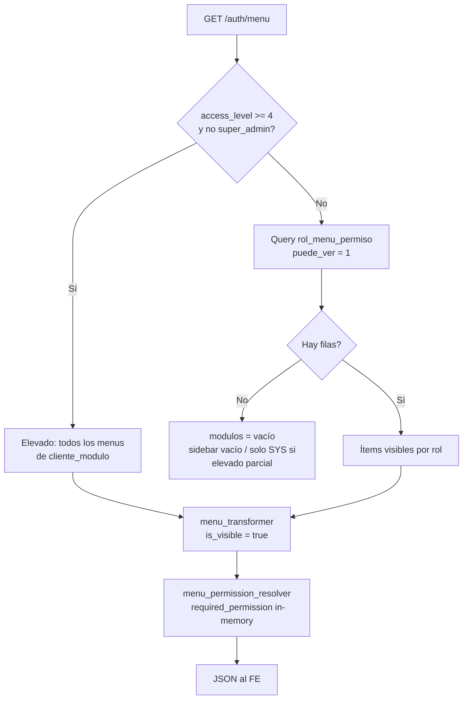

# Auditoría — Gap menú ORG en onboarding (rol_menu_permiso)

**Fecha:** 2026-05-21  
**Síntoma reportado:** tenant nuevo con `cliente_modulo`, `rol_permiso`, `org_empresa`, login y `permissions/me` OK, pero **ORG no aparece en sidebar FE**.  
**Hallazgo BD:** `rol_menu_permiso` vacío para el tenant nuevo.  
**Alcance:** auditoría + implementación mínima (2026-05-21).

**Implementado:** `OnboardingMenuBootstrapService`, hook en `cliente_onboarding_service`, `scripts/repair_tenant_menu_grants.py`, smoke `auth_menu` valida ORG+SYS_ADMIN.

---

## 1. Cómo construye el menú `GET /auth/menu`

### Cadena de llamadas

```text
GET /api/v1/auth/menu
  └─ require_erp_session (JWT con empresa_id salvo excepciones documentadas)
  └─ MenuResolverService.get_menu_for_user()
       ├─ Permission Resolver → effective_permission_codes (rol_permiso)
       └─ ModuloMenuService.obtener_menu_usuario(..., as_tenant_admin, effective_permission_codes)
            ├─ Query 1 (BD CENTRAL): modulo + modulo_menu + cliente_modulo
            └─ Query 2 (BD TENANT): rol_menu_permiso + usuario_rol  [solo si NO elevado]
  └─ menu_permission_resolver.resolve_required_permissions_for_menu_tree()  [en memoria]
```

### Filtros aplicados (orden real)

| Paso | Fuente | Qué filtra |
|------|--------|------------|
| 1 | `cliente_modulo` | Solo módulos contratados y vigentes (`esta_activo`, `fecha_vencimiento`) |
| 2 | `modulo_menu` | Ítems activos/visibles del catálogo (S010/S020) |
| 3a | **Elevación admin** (`as_tenant_admin` o `is_super_admin`) | **Omite** `rol_menu_permiso`; todos los ítems con `puede_ver=true` |
| 3b | **Usuario normal** | Solo ítems con fila en `rol_menu_permiso` y `puede_ver=1` |
| 4 | `menu_transformer` | `is_visible = permisos.ver` (derivado de 3a/3b) |
| 5 | `menu_permission_resolver` | Asigna `required_permission` por inferencia (no oculta ítems) |

### Condición de elevación (crítica)

En `endpoints.py` (`get_menu`):

```python
as_tenant_admin = access_level >= 4 and not is_super_admin
```

`access_level` sale del **JWT** (preferido) vía `get_current_active_user` → `deps.py` líneas 255–271.

`ADMIN_TENANT` en onboarding tiene `nivel_acceso = 5` → con token correcto **`as_tenant_admin=True`** → **no usa `rol_menu_permiso`**.

---

## 2. ¿Depende de `rol_menu_permiso`?

| Escenario | ¿Obligatorio `rol_menu_permiso`? |
|-----------|-----------------------------------|
| `ADMIN_TENANT` con `access_level >= 4` en JWT | **No** (atajo elevado) |
| `MANAGER_TENANT` / `USER_TENANT` | **Sí** |
| Admin con JWT sin `access_level` (fallback nivel 1) | **Sí** → menú vacío si tabla vacía |
| `GET /modulos-menus/me/` (misma lógica `obtener_menu_usuario`) | Igual que arriba |
| API HTTP (`@RequirePermission` / `rol_permiso`) | **No** usa `rol_menu_permiso` |

**Conclusión:** `rol_menu_permiso` sigue siendo **obligatorio para el subsistema de menú UI** en el camino no elevado. El onboarding actual solo puebla **`rol_permiso`** (`OnboardingRbacService`), no menú UI.

---

## 3. Resolver “híbrido” (estado real)

No es un solo resolver; son **tres capas**:

| Capa | Componente | Persistencia |
|------|------------|--------------|
| Permisos API | `PermissionResolver` + `rol_permiso` | BD tenant |
| Visibilidad ítems menú | `ModuloMenuService` + `rol_menu_permiso` **o** elevación admin | BD tenant |
| Metadata `required_permission` | `menu_permission_resolver` | Solo memoria (post-query) |

`effective_permission_codes` se pasa a `obtener_menu_usuario` pero **aún no filtra ítems** (comentario “Stage 2” en código). La unificación menú↔API (opción B del plan) **no está hecha**.

`MenuPermissionBinder` (startup, columna BD) **no** sustituye a `rol_menu_permiso`.

---

## 4. Frontend — dependencia indirecta

Repo **sin código FE**. Contrato documentado:

| Fuente | Comportamiento esperado |
|--------|-------------------------|
| `FLUJO_AUTH_MULTIEMPRESA_FE.md` | Menú = `GET /auth/menu` tras sesión con `empresa_id` |
| `menu_transformer.py` | *“el frontend NO debe recalcular permisos”* — usar `is_visible` del payload |
| `ModuloMenuService` doc | `permisos` = acciones UI desde `rol_menu_permiso`; seguridad API = `rol_permiso` |

### Dependencias indirectas probables en FE (hipótesis a validar en FE)

1. **Filtro por `required_permission`** contra lista de `permissions/me`  
   - Bug conocido backend: todos los ítems ORG reciben el mismo `required_permission` (primer `*.leer` del módulo, p. ej. `org.sucursal.leer`) por orden en `_get_required_permissions_by_modulo` / `menu_transformer`.  
   - Con grants `org.%` del onboarding esto **no** debería ocultar ORG al admin.
2. **Filtro por `modulo.categoria`**  
   - ORG = `operaciones`, SYS_ADMIN = `sistema`. Un shell que solo muestre `sistema` explicaría “veo SYS_ADMIN pero no ORG” aunque el API devuelva ambos.
3. **Endpoint distinto** (`/modulos-menus/me/` vs `/auth/menu`) o token sin `access_level`.
4. **Módulo sin ítems visibles** (`is_visible=false`) → FE oculta módulo entero.

---

## 5. Evidencia runtime (tenant RC `smokerc69929718`)

Probe local 2026-05-21 (`bd_sistema_saas`, API `:8000`):

| Check | Resultado |
|-------|-----------|
| Login admin | 200 |
| `/auth/me` → `access_level` | **5**, `user_type=tenant_admin` |
| `/auth/menu` → módulos | **`ORG` (6 ítems visibles), `SYS_ADMIN` (12 ítems)** |
| `/auth/permissions/me` | 45 códigos; incluye `org.empresa.leer`, `org.sucursal.leer`, … |
| `rol_menu_permiso` (esperado) | **0 filas** (onboarding no inserta; menú vía elevación) |

**Interpretación:** el backend **sí** entrega ORG para admin tenant con JWT nivel 5. Si el FE no lo muestra, el desvío está en **contrato FE** (filtro categoría / `required_permission` / endpoint) o en **token distinto** al del probe (refresh antiguo, usuario no admin).

---

## 6. Qué bootstrapea hoy el onboarding

| Paso | Servicio | Tablas |
|------|----------|--------|
| Módulos | `OnboardingRbacService.activar_modulos_base_cliente` | `cliente_modulo` (ORG, SYS_ADMIN) |
| API RBAC | `OnboardingRbacService.asignar_permisos_admin_tenant` | `rol_permiso` |
| ERP mínimo | `MinimalErpTenantBootstrapService` | `org_empresa`, `usuario`, `usuario_rol` |
| Menú UI | — | **`rol_menu_permiso` no** |

**No se llama** `aplicar_plantillas_roles` (requiere `modulo_rol_plantilla`; catálogo S010/S020 **no** seedea plantillas).

Legacy dedicado (`SEED_BD_DEDICADA_TECHCORP.sql`) sí inserta `rol_menu_permiso` por cada `menu_id` del módulo — por eso tenants antiguos con seed manual no reproducen el gap.

---

## 7. Menús mínimos para `ADMIN_TENANT` (onboarding RC)

Al activar **ORG + SYS_ADMIN** en `cliente_modulo`, el admin debería ver al menos:

### Módulo ORG (catálogo S010 — 6 pantallas)

| código menú | ruta | permiso API típico |
|-------------|------|-------------------|
| `ORG_MI_EMPRESA` | `/org/empresa` | `org.empresa.leer` |
| `ORG_SUCURSALES` | `/org/sucursales` | `org.sucursal.leer` |
| `ORG_DEPARTAMENTOS` | `/org/departamentos` | `org.departamento.leer` |
| `ORG_CARGOS` | `/org/cargos` | `org.cargo.leer` |
| `ORG_CENTROS_COSTO` | `/org/centros-costo` | `org.centro_costo.leer` |
| `ORG_PARAMETROS` | `/org/parametros` | `org.parametro.leer` |

### Módulo SYS_ADMIN (catálogo S020 — tenant scope)

Ítems bajo secciones Tenant (usuarios, roles, sesiones, …) — **no** ítems `SYS_ADMIN.PLATFORM.*` (reservados platform).

**Conteo esperado:** ~6 (ORG) + ~12 (SYS_ADMIN tenant) ≈ **18 filas** `rol_menu_permiso` por tenant (una por `menu_id` activo).

**Grants UI sugeridos (paridad legacy):** `puede_ver=1` mínimo; para admin completo: crear/editar/eliminar/exportar/imprimir=1, `puede_aprobar=0`.

---

## 8. Propuesta — implementación mínima idempotente (runtime)

**Nuevo servicio** (sin tocar lógica de `OnboardingRbacService`):

`OnboardingMenuBootstrapService.bootstrap_admin_menu_grants(session, cliente_id, admin_rol_id)`

### Algoritmo

1. Resolver `menu_id` desde BD central:
   - `modulo.codigo IN ('ORG','SYS_ADMIN')`
   - `modulo_menu.es_activo=1`, `es_visible=1`
   - `cliente_modulo` activo para `cliente_id`
2. `INSERT rol_menu_permiso` por cada `menu_id`:
   - `IF NOT EXISTS (cliente_id, rol_id, menu_id)`
   - `puede_ver=1`, resto según política admin (todos 1 salvo aprobar)
   - `empresa_id=NULL` (permiso menú global por rol; coherente con `usuario_rol` multi-empresa)
3. Retornar `{ inserted, skipped, menu_ids }` para logs/evidencia.

### Orquestación en `cliente_onboarding_service`

Después de `OnboardingRbacService.bootstrap_cliente_rbac`, misma transacción:

```text
roles → empresa → usuario → usuario_rol → RBAC (rol_permiso) → **menu bootstrap (rol_menu_permiso)**
```

### Script repair legacy

`scripts/repair_tenant_menu_grants.py --cliente-id ... --apply`  
(misma SQL, tenants con `cliente_modulo` ORG/SYS_ADMIN y `ADMIN_TENANT` existente).

### Criterios de aceptación

| # | Criterio |
|---|----------|
| 1 | SQL: `COUNT(rol_menu_permiso)` ≥ 15 para tenant nuevo |
| 2 | Admin con `access_level=1` forzado (test) aún ve ORG vía `rol_menu_permiso` |
| 3 | `GET /auth/menu` incluye `codigo=ORG` y `SYS_ADMIN` |
| 4 | Re-ejecutar onboarding/repair no duplica filas |
| 5 | Smoke HTTP: ampliar `auth_menu` con `modulo_codigos: ["ORG","SYS_ADMIN"]` |

### Qué NO hacer en esta fase (RC1)

- Unificar menú solo con `rol_permiso` (opción B — refactor grande)
- Seed `modulo_rol_plantilla` en bootstrap
- Corregir `required_permission` por ítem (deuda separada; afecta FE si filtra por código)

---

## 9. Diagrama de flujo



---

## 10. Veredicto auditoría

| Pregunta | Respuesta |
|----------|-----------|
| ¿`rol_menu_permiso` sigue obligatorio? | **Sí** para usuarios no elevados y como red de seguridad si el JWT no trae `access_level` |
| ¿El gap de onboarding es solo BD vacía? | **Sí** para camino no elevado; **no** explica por sí solo el síntoma si el admin tiene `access_level=5` y FE consume `/auth/menu` correctamente |
| ¿Acción RC1 recomendada? | **Bootstrap mínimo `rol_menu_permiso`** para `ADMIN_TENANT` + módulos ORG/SYS_ADMIN activos (idempotente) |
| ¿Bloquea cierre RC1? | **Sí** como último gap funcional de onboarding automático para **todos** los caminos (FE, roles futuros, tokens legacy) |

---

## 11. Referencias código

| Archivo | Rol |
|---------|-----|
| `app/core/authorization/menu_resolver.py` | Orquestación Tenant → Permissions → Menu |
| `app/modules/modulos/application/services/modulo_menu_service.py` | Queries central + `rol_menu_permiso` / elevación |
| `app/modules/auth/presentation/endpoints.py` | `GET /auth/menu`, `as_tenant_admin` |
| `app/modules/tenant/application/services/onboarding_rbac_service.py` | Solo `rol_permiso` |
| `app/modules/modulos/application/helpers/rol_plantilla_applier.py` | Patrón legacy menú (no invocado en onboarding) |
| `app/bootstrap_v2/00_manifest/RUNTIME_DEPENDENCY_MATRIX.md` | Matriz `rol_menu_permiso` vs `rol_permiso` |
