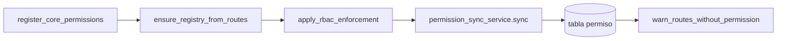
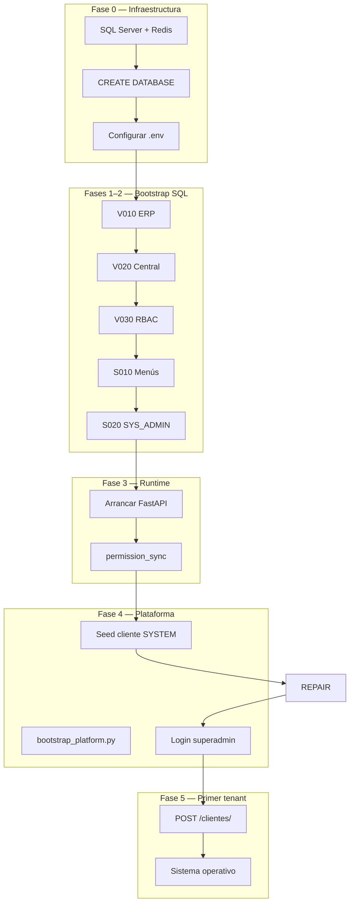

# Guía oficial — Primera instalación en servidor nuevo

**Tipo:** Auditoría exclusiva de despliegue inicial (sin cambios de código)  
**Fecha:** 2026-06-05  
**Contexto:** Backend V4 consolidado · Platform Administration implementado · Onboarding implementado  
**Alcance:** Pasar de un servidor vacío a un sistema operativo funcional

**Referencias oficiales:**

| Documento | Ruta |
|-----------|------|
| Orden bootstrap SQL | [`app/bootstrap_v2/00_manifest/BOOTSTRAP_ORDER.md`](../bootstrap_v2/00_manifest/BOOTSTRAP_ORDER.md) |
| Auditoría bootstrap | [`app/docs/auditoria/BOOTSTRAP_SYSTEM_AUDIT.md`](auditoria/BOOTSTRAP_SYSTEM_AUDIT.md) |
| Pipeline staging | [`app/bootstrap_v2/00_manifest/STAGING_VALIDATION_PIPELINE.md`](../bootstrap_v2/00_manifest/STAGING_VALIDATION_PIPELINE.md) |
| RBAC platform repair | [`app/bootstrap_v2/00_manifest/PLATFORM_RBAC_GAP_FIX.md`](../bootstrap_v2/00_manifest/PLATFORM_RBAC_GAP_FIX.md) |
| Flujo runtime RBAC | [`app/bootstrap_v2/00_manifest/RUNTIME_BOOTSTRAP_FLOW.md`](../bootstrap_v2/00_manifest/RUNTIME_BOOTSTRAP_FLOW.md) |

---

## Resumen ejecutivo

| Pregunta | Respuesta corta |
|----------|-----------------|
| 1. Primera BD | **BD central compartida** (una sola instancia SQL Server) |
| 2. ¿Quién la crea? | Contenedor vacío: **manual** (`CREATE DATABASE`). Esquema: **scripts SQL** `bootstrap_v2` |
| 3. Nombre oficial | **Configurable** vía `DB_DATABASE`; convenciones del repo: `bd_sistema`, `bd_sistema_saas`, `bd_hybrid_sistema_central` |
| 4. `.env` obligatorio | Conexión BD, JWT, `ENCRYPTION_KEY`, variables `SUPERADMIN_*`, `BASE_DOMAIN` |
| 5. ¿Bootstrap inicial? | **Sí parcial:** catálogo global SQL + sync runtime. **No** crea cliente plataforma ni tenants en prod mínimo |
| 6. Comando bootstrap | `scripts/bootstrap_v2_sql_apply.ps1` / `.sh` (o `sqlcmd` manual) |
| 7. Primer arranque backend | `docker compose up -d` o `uvicorn app.main:app --host 0.0.0.0 --port 8000` |
| 8. Primer arranque | `permission_sync` RBAC (catálogo `permiso` desde código) |
| 9. Primer tenant | `POST /api/v1/clientes/` autenticado como operador plataforma |
| 10. Onboarding y BD tenant | **Shared:** no crea BD nueva, opera en la central. **Dedicated:** solo registra `cliente_conexion`; la BD física es manual |
| 11. Primer admin | **Plataforma:** `bootstrap_platform.py --apply`. **Tenant:** onboarding API (`admin` + contraseña generada) |
| 12. Procedimiento completo | Ver §12 al final |

**Perfil oficial producción (RBAC V1 / Backend V4):**

```text
Fase 0   CREATE DATABASE (manual)
Fase 1   V010 → V020 → V030                    (schema)
Fase 2   S010 → S020                           (catálogo módulos/menús)
         [omitir S030, S040–S066, R010, R020 para tenants nuevos]
Fase 3   Arrancar FastAPI ≥1 vez               (permission_sync)
Fase 4   bootstrap_platform.py --apply (identidad + RBAC)
Fase 5   POST /api/v1/clientes/                (onboarding por tenant)
```

---

## 1. ¿Cuál es la primera base de datos que debe existir?

La **base de datos central compartida** (multi-tenant *shared*).

- Es la única BD obligatoria antes del primer arranque del backend.
- Contiene **todo el esquema ERP** (`org_*`, `inv_*`, …) **y** las tablas de administración SaaS (`cliente`, `modulo`, `usuario`, `rol`, `permiso`, …).
- En modo `tipo_instalacion = 'shared'` (por defecto), **todos los tenants operan en esta misma BD**; el aislamiento es lógico por `cliente_id`.
- Las BD dedicadas por tenant (`dedicated` / `onpremise`) son **opcionales** y se crean **después**, solo si un cliente lo requiere.

**No** se necesita ninguna BD de tenant separada para la instalación inicial en modo shared.

---

## 2. ¿Quién crea la BD central?

| Responsabilidad | Mecanismo | ¿Automático al arrancar FastAPI? |
|-----------------|-----------|:--------------------------------:|
| Crear el **contenedor** de BD (`CREATE DATABASE`) | **Manual** — DBA / `sqlcmd` / SSMS | ❌ |
| Crear **tablas y DDL** | **Scripts SQL** en `app/bootstrap_v2/01_schema/` | ❌ |
| Poblar **catálogo global** (módulos, menús) | **Scripts SQL** en `app/bootstrap_v2/02_catalog/` | ❌ |
| Poblar **catálogo permisos** | **Runtime** — `permission_sync` al startup | ✅ (tras Fase 1–2) |
| Migraciones Alembic | Existe carpeta `alembic/` en el repo, pero **no** es el pipeline oficial de instalación limpia | ❌ |

### Orden DDL obligatorio (G-001)

```text
V010__tablas_bd_erp_completo.sql   → primero (tablas ERP)
V020__tablas_bd_central.sql        → segundo (tabla cliente, auth, etc.)
V030__rbac_tablas_central.sql      → tercero (permiso, rol_permiso)
```

> `V020` tiene FK hacia tablas de `V010` (`org_empresa`). Ejecutar en orden inverso provoca fallo.

### Creación manual del contenedor

```sql
CREATE DATABASE bd_sistema_saas
  COLLATE SQL_Latin1_General_CP1_CI_AS;
```

Ajustar nombre y collation según política del servidor.

---

## 3. ¿Cuál es el nombre oficial esperado para la BD central?

**No hay un nombre único hardcodeado en la aplicación.** El nombre efectivo es el valor de:

```env
DB_DATABASE=<nombre>
DB_ADMIN_DATABASE=<mismo_nombre>
```

### Convenciones usadas en el repositorio

| Nombre | Uso |
|--------|-----|
| `bd_sistema` | Default en scripts de routing/tests y en `bootstrap_v2_sql_apply` |
| `bd_sistema_saas` | Entorno RC / staging documentado (`.env.docker` actual) |
| `bd_hybrid_sistema_central` | Legacy en scripts `app/docs/database/` y cabecera `USE` de `D010` |

**Regla operativa:** elegir un nombre, usarlo en `CREATE DATABASE`, en `DB_DATABASE` / `DB_ADMIN_DATABASE`, y sustituir cualquier `USE bd_hybrid_sistema_central;` al ejecutar seeds legacy o QA.

---

## 4. ¿Qué variables `.env` son obligatorias para el primer arranque?

La aplicación **falla al importar** si faltan o son inválidas las claves JWT (`validate_security_settings` en `app/core/config.py`).

### Obligatorias (bloqueantes)

| Variable | Propósito | Validación |
|----------|-----------|------------|
| `DB_SERVER` | Host SQL Server | Debe ser alcanzable |
| `DB_PORT` | Puerto (default `1433`) | — |
| `DB_USER` / `DB_PASSWORD` | Credenciales BD principal | — |
| `DB_DATABASE` | Nombre BD central | Debe existir con schema aplicado |
| `DB_DRIVER` | Driver ODBC | Docker: `ODBC Driver 18 for SQL Server` |
| `DB_ADMIN_SERVER` | Host BD admin | Típicamente **igual** a `DB_SERVER` |
| `DB_ADMIN_USER` / `DB_ADMIN_PASSWORD` | Credenciales admin | — |
| `DB_ADMIN_DATABASE` | Nombre BD admin | Típicamente **igual** a `DB_DATABASE` |
| `SECRET_KEY` | JWT access | ≥ 32 caracteres |
| `REFRESH_SECRET_KEY` | JWT refresh | ≥ 32 caracteres, **distinta** de `SECRET_KEY` |
| `ALGORITHM` | Algoritmo JWT | Default `HS256` |
| `ACCESS_TOKEN_EXPIRE_MINUTES` | Expiración access | ≥ 5 |
| `REFRESH_TOKEN_EXPIRE_DAYS` | Expiración refresh | ≥ 1 |
| `ENCRYPTION_KEY` | Cifrado credenciales `cliente_conexion` | Base64 de 32 bytes |
| `SUPERADMIN_CLIENTE_ID` | UUID del cliente plataforma | Debe coincidir con el seed del cliente SYSTEM |
| `SUPERADMIN_CLIENTE_CODIGO` | Código cliente plataforma | Default `SYSTEM`; D010 usa `SUPERADMIN` |
| `SUPERADMIN_SUBDOMINIO` | Subdominio plataforma | Default `platform` |
| `SUPERADMIN_USERNAME` | Usuario operador plataforma | Default `superadmin` |
| `BASE_DOMAIN` | Dominio multi-tenant | Ej. `app.local`, `tudominio.com` |

### Recomendadas en Docker / producción

| Variable | Notas |
|----------|-------|
| `REDIS_HOST` | `redis` en Docker Compose (servicio dependiente) |
| `ENVIRONMENT` | `production` en prod |
| `RBAC_PERMISSION_SYNC_ENABLED` | `true` (default) — **obligatorio** para onboarding |
| `ENABLE_REDIS_CACHE` | `true` en Docker |
| `COOKIE_DOMAIN` | Ej. `.app.local` si hay frontend en subdominios |

### Plantillas de referencia

- Desarrollo local: [`.env.example`](../../.env.example)
- Docker: [`.env.docker`](../../.env.docker)

---

## 5. ¿Existe bootstrap inicial?

**Sí**, repartido entre **SQL estático** y **runtime de aplicación**. No es un único comando que deje el sistema 100 % operativo sin pasos adicionales de plataforma.

### Qué crea cada capa

| Elemento | Fuente | ¿En prod mínimo? |
|----------|--------|:----------------:|
| Tablas DDL (~134 tablas) | `V010`, `V020`, `V030` | ✅ |
| Módulos ERP (27) + menús (~120+) | `S010` | ✅ |
| Módulo `SYS_ADMIN` + menús admin | `S020` | ✅ |
| Catálogo `permiso` (~400+) | **Startup** `permission_sync` | ✅ |
| `core.app.acceder` | Startup + `core_permissions` | ✅ |
| Permisos SQL legacy `S030`, `S040–S066` | Scripts SQL | ❌ (reemplazados por sync) |
| `rol_permiso` global legacy | `R010`, `R020` | ❌ (reemplazados por onboarding) |
| **Cliente plataforma (SYSTEM/SUPERADMIN)** | `bootstrap_platform.py --apply` | ⚠️ **Requerido** tras startup |
| **Usuario `superadmin` plataforma** | `bootstrap_platform.py --apply` | ⚠️ Requerido |
| **Roles `ADMIN_PLATFORM`** | `bootstrap_platform.py --apply` | ⚠️ Requerido |
| **Grants `rol_permiso` plataforma** | `bootstrap_platform.py --apply` | ⚠️ Incluido en mismo CLI |
| **Primer tenant + admin tenant** | Onboarding API | ✅ (Fase 5) |

### Cliente SYSTEM

- El onboarding API (`ClienteOnboardingService`) **no** crea el cliente plataforma; por diseño solo provisiona tenants (`ADMIN_TENANT`, `MANAGER_TENANT`, `USER_TENANT`).
- Sin cliente plataforma + operador `superadmin`, **no es posible** llamar a `POST /api/v1/clientes/`.

---

## 6. ¿Qué comando ejecuta el bootstrap?

### Opción A — Helper oficial (Windows)

```powershell
.\scripts\bootstrap_v2_sql_apply.ps1 `
  -Server <HOST_SQL> `
  -Database <NOMBRE_BD> `
  -User <USUARIO> `
  -Password '<CONTRASEÑA>'
```

### Opción B — Helper oficial (Linux / bash)

```bash
./scripts/bootstrap_v2_sql_apply.sh <HOST> <NOMBRE_BD> <USUARIO> '<CONTRASEÑA>'
```

### Qué ejecutan los helpers

| # | Script |
|---|--------|
| 1 | `01_schema/V010__tablas_bd_erp_completo.sql` |
| 2 | `01_schema/V020__tablas_bd_central.sql` |
| 3 | `01_schema/V030__rbac_tablas_central.sql` |
| 4 | `02_catalog/S010__seed_modulo_menu_completo.sql` |
| 5 | `02_catalog/S020__seed_admin_menu.sql` |
| 6 | `02_catalog/S030__seed_permisos_core.sql` |

> **Nota V4:** `S030` es **deprecated** en producción (el startup crea `core.app.acceder`). El helper lo incluye por compatibilidad staging; en instalación prod estricta puede omitirse.

### Opción C — Manual con `sqlcmd`

Requisito crítico: flag **`-I`** (QUOTED_IDENTIFIER ON). Sin él, `V010` falla en índices filtrados.

```powershell
sqlcmd -S <HOST> -d <BD> -U <USER> -P '<PWD>' -C -I -i app/bootstrap_v2/01_schema/V010__tablas_bd_erp_completo.sql -b
# Repetir para V020, V030, S010, S020
```

### Verificación post-bootstrap

```sql
SELECT COUNT(*) AS tablas FROM sys.tables;                    -- ~134
SELECT COUNT(*) AS modulos FROM modulo WHERE es_activo = 1;   -- ~28 (27 ERP + SYS_ADMIN)
SELECT COUNT(*) AS clientes FROM cliente;                     -- 0 (prod, antes de seed plataforma)
SELECT COUNT(*) AS permisos FROM permiso WHERE es_activo = 1; -- 0 o parcial (antes de startup)
```

---

## 7. ¿Qué comando inicia el backend por primera vez?

### Docker (recomendado en servidor con Compose)

```bash
docker compose up -d --build
```

Servicios levantados: `backend` (puerto 8000), `redis`. SQL Server puede ser externo al host o el servicio opcional `db_dev`.

### Sin Docker (servidor bare-metal / VM)

```bash
python3.12 -m venv venv
source venv/bin/activate          # Linux
# .\venv\Scripts\Activate.ps1     # Windows
pip install -r requirements.txt
uvicorn app.main:app --host 0.0.0.0 --port 8000
```

### Verificación inmediata

```bash
curl -s http://localhost:8000/health
# Esperado: HTTP 200
```

---

## 8. ¿Qué ocurre durante el primer arranque?

Al iniciar, el **lifespan RBAC** (`app/main.py` → `run_rbac_startup`) ejecuta:



| Paso | Componente | Efecto |
|------|------------|--------|
| 1 | `core_permissions.register_core_permissions()` | Registra whitelist estática (`core.app.acceder`, `admin.platform.access`, …) |
| 2 | `ensure_registry_from_routes(app)` | Escanea endpoints FastAPI con `require_permission` (~113 códigos) |
| 3 | `apply_rbac_enforcement(app)` | Aplica enforcement RBAC en rutas |
| 4 | `permission_sync_service.sync()` | Upsert en `permiso`; desactiva obsoletos (excepto protegidos) |
| 5 | Auditoría | Log `[RBAC] Permission sync summary: declared=…, db_total_activos=…` |

### Estado esperado tras el primer arranque exitoso

| Tabla / condición | Valor |
|-------------------|-------|
| `permiso` activos | **> 0** (orientativo ~400+) |
| `core.app.acceder` | `es_activo = 1` |
| `cliente` | 0 (prod) o ≥ 1 (si ya se aplicó seed plataforma) |
| Onboarding habilitado | ✅ si `permiso` > 0 |

### Si se omite este paso

Al crear un tenant:

```text
ONBOARDING_PERMISSO_CATALOG_EMPTY
"Catálogo de permisos vacío. Arranque la aplicación al menos una vez..."
```

> El sync es **no bloqueante** ante errores menores (warning en log), pero sin filas en `permiso` el onboarding **sí** falla.

---

## 9. ¿Cómo se crea el primer tenant?

### Prerrequisitos

1. Bootstrap SQL Fases 1–2 completado.
2. Backend arrancado ≥ 1 vez (sync RBAC).
3. Cliente plataforma con operador autenticado (`superadmin` / `ADMIN_PLATFORM`).
4. `bootstrap_platform.py --apply` ejecutado (identidad + grants plataforma).

### Endpoint

```http
POST /api/v1/clientes/
Authorization: Bearer <access_token_plataforma>
Origin: http://platform.<BASE_DOMAIN>
Content-Type: application/json
```

**Permiso requerido:** `tenant.cliente.crear`  
**Guard adicional:** `@require_super_admin()` (nivel acceso ≥ 5)

### Payload mínimo (ejemplo)

```json
{
  "codigo_cliente": "CLI001",
  "subdominio": "acme",
  "razon_social": "ACME Corporation S.A.C.",
  "contacto_email": "admin@acme.com",
  "tipo_instalacion": "shared",
  "plan_suscripcion": "trial"
}
```

### Respuesta

- HTTP **201**
- `data`: cliente creado
- `credenciales_iniciales`: `{ "nombre_usuario": "admin", "contrasena": "<generada>", "requiere_cambio": true }`

### Qué provisiona el onboarding (transacción única)

| Paso | Servicio | Acción |
|------|----------|--------|
| 1 | `ClienteOnboardingService` | `INSERT cliente` |
| 2 | — | `INSERT rol` (ADMIN_TENANT, MANAGER_TENANT, USER_TENANT) |
| 3 | `MinimalErpTenantBootstrapService` | `INSERT org_empresa` (EMP001) |
| 4 | — | `INSERT usuario` admin + `usuario_rol` |
| 5 | `OnboardingRbacService` | `cliente_modulo`, `rol_permiso`, menús (ORG, SYS_ADMIN, INV trial) |
| 6 | — | `cliente_auth_config`, `cfg_codigo_secuencia` |
| 7 | — | `COMMIT` |

**No ejecutar** `R010` ni `R020` para tenants nuevos.

---

## 10. ¿El onboarding crea la BD tenant o solo registra conexiones?

Depende de `tipo_instalacion`:

| Modo | ¿Crea BD física? | ¿Qué hace el onboarding? |
|------|:----------------:|----------------------------|
| **`shared`** (default) | ❌ No | Inserta filas en la **BD central** (`cliente`, `usuario`, `org_empresa`, …). Todos los tenants comparten la misma BD. |
| **`dedicated`** / **`onpremise`** | ❌ No (automático) | Inserta metadata del `cliente` en central. La BD dedicada debe existir **antes** y registrarse vía `POST /api/v1/conexiones/clientes/{cliente_id}`. |
| **`hybrid`** | ❌ No (automático) | Igual que dedicated para la parte local; requiere `cliente_conexion` + posible `servidor_api_local`. |

### Flujo tenant dedicado (adicional al onboarding)

```text
1. CREATE DATABASE <bd_tenant_dedicada>     (manual)
2. V010 en BD dedicada                      (sqlcmd)
3. 05_dedicated/V010__rbac_tablas_dedicated.sql  (sqlcmd)
4. POST /api/v1/clientes/  (tipo_instalacion: "dedicated")
5. POST /api/v1/conexiones/clientes/{id}   (servidor, nombre_bd, credenciales cifradas)
```

El servicio `ConexionService.crear_conexion` persiste credenciales **cifradas** con `ENCRYPTION_KEY`.

---

## 11. ¿Cómo se crea el primer usuario administrador?

Hay **dos administradores distintos** en la instalación inicial:

### A) Operador plataforma (`superadmin`) — consola SYSTEM

| Aspecto | Detalle |
|---------|---------|
| **Propósito** | Administrar la plataforma, crear tenants, módulos, usuarios globales |
| **Cliente** | Plataforma (`cliente_id` = `SUPERADMIN_CLIENTE_ID`) |
| **Subdominio** | `platform` (`SUPERADMIN_SUBDOMINIO`) |
| **Usuario** | `superadmin` (`SUPERADMIN_USERNAME`) |
| **Rol** | `ADMIN_PLATFORM` |
| **Creación** | **No** vía API de onboarding. CLI `bootstrap_platform.py` |

#### Producción — bootstrap plataforma

1. Tras Fases 1–2 y **primer startup** (`permission_sync` OK), verificar estado:

```powershell
docker exec -w /app -e PYTHONPATH=/app fastapi_backend python scripts/bootstrap_platform.py --audit-only
```

2. Aplicar bootstrap (identidad + RBAC idempotente):

```powershell
docker exec -w /app -e PYTHONPATH=/app `
  -e PLATFORM_BOOTSTRAP_INITIAL_PASSWORD='<segura>' `
  fastapi_backend python scripts/bootstrap_platform.py --apply
```

Variables en `.env.docker`: `SUPERADMIN_*`, `PLATFORM_BOOTSTRAP_CONTACT_EMAIL`. La contraseña inicial se pasa por `-e` en prod (one-shot).

Esto crea/reutiliza cliente plataforma, rol `ADMIN_PLATFORM`, usuario `superadmin`, activa `cliente_modulo` (SYS_ADMIN) y `rol_permiso` (incluye `tenant.cliente.crear`).

#### QA / desarrollo

Ejecutar `D010` completo (+ opcional `D020`, `D030`). Credencial documentada en D010: `superadmin` / `admin123`.

### B) Administrador del primer tenant (`admin`)

| Aspecto | Detalle |
|---------|---------|
| **Propósito** | Operar el ERP del tenant (ORG, INV, …) |
| **Creación** | **Automática** en `POST /api/v1/clientes/` |
| **Usuario** | Siempre `admin` |
| **Contraseña** | Generada aleatoriamente (12 caracteres); devuelta **una sola vez** en la respuesta |
| **Rol** | `ADMIN_TENANT` (scope tenant-wide, `usuario_rol.empresa_id = NULL`) |

---

## 12. Procedimiento completo: servidor vacío → sistema operativo

### Diagrama general



---

### Fase 0 — Infraestructura y preparación

| # | Acción | Responsable |
|---|--------|-------------|
| 0.1 | Instalar **SQL Server 2016+** (o usar instancia gestionada) | Ops |
| 0.2 | Instalar **Python 3.12** (recomendado) o preparar imagen Docker | Ops |
| 0.3 | Instalar **Redis** (requerido en Docker Compose; opcional con fallback en bare-metal) | Ops |
| 0.4 | `CREATE DATABASE <nombre>` con collation acordada | DBA — **manual** |
| 0.5 | Crear usuario SQL con permisos DDL+DML en la BD | DBA — **manual** |
| 0.6 | Copiar `.env.example` → `.env` (o `.env.docker`) y completar variables §4 | Ops |
| 0.7 | Generar claves si no existen: `python generate_encryption_key.py` | Ops |

**Checklist Fase 0:**

- [ ] `DB_DATABASE` = nombre de BD creada
- [ ] `SECRET_KEY` y `REFRESH_SECRET_KEY` ≥ 32 caracteres y distintas
- [ ] `ENCRYPTION_KEY` configurada
- [ ] `SUPERADMIN_CLIENTE_ID` definido (UUID que se usará en seed plataforma)

---

### Fase 1 — Schema DDL

```powershell
.\scripts\bootstrap_v2_sql_apply.ps1 -Server <HOST> -Database <BD> -User <USER> -Password '<PWD>'
```

O ejecutar manualmente `V010` → `V020` → `V030` con `sqlcmd -I`.

**Validar:**

```sql
SELECT COUNT(*) FROM INFORMATION_SCHEMA.TABLES
WHERE TABLE_NAME IN ('cliente','modulo','permiso','org_empresa','cfg_codigo_secuencia');
-- Esperado: 5
```

---

### Fase 2 — Catálogo global

Incluido en el helper anterior (`S010`, `S020`). Si se omite `S030` (perfil V4 estricto), ejecutar solo hasta `S020`.

**Validar:**

```sql
SELECT codigo FROM modulo WHERE es_activo = 1 AND codigo IN ('ORG','INV','SYS_ADMIN');
-- 3 filas
```

---

### Fase 3 — Primer arranque del backend

```bash
docker compose up -d --build
# o
uvicorn app.main:app --host 0.0.0.0 --port 8000
```

**Validar:**

```bash
curl http://localhost:8000/health
```

```sql
SELECT COUNT(*) FROM permiso WHERE es_activo = 1;  -- > 0
SELECT codigo, es_activo FROM permiso WHERE codigo = 'core.app.acceder';  -- activo
```

Revisar logs: `[RBAC] Permission sync summary`.

---

### Fase 4 — Cliente plataforma (Platform Administration)

> **Crítico:** sin esta fase no hay quién invoque el onboarding.

| # | Acción |
|---|--------|
| 4.1 | Ejecutar seed SQL del cliente plataforma (sección SUPERADMIN de `D010`, adaptando `USE` y UUIDs) |
| 4.2 | Confirmar coherencia `.env`: `SUPERADMIN_CLIENTE_ID`, `SUPERADMIN_SUBDOMINIO=platform`, `SUPERADMIN_USERNAME=superadmin` |
| 4.3 | `docker exec … python scripts/bootstrap_platform.py --apply` |
| 4.4 | (Opcional) `python scripts/http_smoke_platform_rbac.py` |
| 4.5 | Login: `POST /api/v1/auth/login` con `Origin: http://platform.<BASE_DOMAIN>` |

**Validar SQL:**

```sql
SELECT subdominio, codigo_cliente FROM cliente
WHERE cliente_id = '<SUPERADMIN_CLIENTE_ID>';

SELECT COUNT(*) FROM rol_permiso rp
JOIN rol r ON r.rol_id = rp.rol_id
WHERE r.codigo_rol = 'ADMIN_PLATFORM';
-- > 0 tras repair
```

---

### Fase 5 — Primer tenant operativo

| # | Acción |
|---|--------|
| 5.1 | `POST /api/v1/clientes/` con token plataforma |
| 5.2 | Guardar `credenciales_iniciales` de la respuesta |
| 5.3 | Login tenant: `POST /api/v1/auth/login` con `Origin: http://<subdominio>.<BASE_DOMAIN>` |
| 5.4 | Verificar menú: `GET /api/v1/auth/menu` |
| 5.5 | (Opcional) Smoke: `python scripts/http_smoke_tenant_rbac.py` |

**Validar SQL (reemplazar `:cid` por UUID del tenant):**

```sql
SELECT codigo_rol FROM rol WHERE cliente_id = :cid ORDER BY codigo_rol;
-- ADMIN_TENANT, MANAGER_TENANT, USER_TENANT

SELECT m.codigo FROM cliente_modulo cm
JOIN modulo m ON m.modulo_id = cm.modulo_id
WHERE cm.cliente_id = :cid AND cm.esta_activo = 1;
-- ORG, SYS_ADMIN, INV (plan trial)

SELECT codigo_empresa FROM org_empresa WHERE cliente_id = :cid;
-- EMP001
```

---

### Fase 6 — Verificación final (sistema operativo)

| Criterio | Estado esperado |
|----------|-----------------|
| Health API | `GET /health` → 200 |
| Catálogo permisos | `permiso` activos > 0 |
| Plataforma | Login `superadmin` → menú admin plataforma |
| Tenant | Login `admin` → menú ORG + INV + SYS_ADMIN.TENANT |
| Onboarding nuevo tenant | `POST /clientes/` sin R010/R020 |
| ERP mínimo | `org_empresa` EMP001 por tenant |

---

## Apéndice A — Perfiles de instalación

| Perfil | SQL adicional | Uso |
|--------|---------------|-----|
| **PROD mínimo (oficial V4)** | Solo Fases 0–5 | Servidor nuevo producción |
| **DEV / QA** | + `D010`, `D020`, `D030` | Entornos de prueba con tenants demo |
| **Dedicated tenant** | + `V010` en BD dedicada, `05_dedicated/V010`, `cliente_conexion` | Cliente con BD propia |

---

## Apéndice B — Errores operativos frecuentes

| Síntoma | Causa | Mitigación |
|---------|-------|------------|
| `V010` falla en índices | Falta `sqlcmd -I` | Añadir `-I` o `SET QUOTED_IDENTIFIER ON` |
| App no arranca | `SECRET_KEY` vacía o corta | Completar variables §4 |
| `ONBOARDING_PERMISSO_CATALOG_EMPTY` | Backend no arrancó post-SQL | Arrancar FastAPI ≥ 1 vez |
| Menú plataforma vacío | Sin `bootstrap_platform.py` | `--apply` tras startup |
| `403` en `POST /clientes/` | Sin `tenant.cliente.crear` en rol plataforma | Ejecutar repair plataforma |
| D010 inserta en BD equivocada | `USE bd_hybrid_sistema_central` | Sustituir por nombre real |
| Docker conecta BD antigua | Env cacheado en contenedor | `docker compose up -d --force-recreate` |
| Dedicated sin datos ERP | Falta `cliente_conexion` o BD dedicada sin V010 | Seguir §10 flujo dedicado |

---

## Apéndice C — Matriz de responsabilidades (resumen auditoría)

| Artefacto | Mecanismo | Prod nuevo |
|-----------|-----------|:----------:|
| Contenedor BD | Manual `CREATE DATABASE` | ✅ |
| Schema | SQL `bootstrap_v2` 01_schema | ✅ |
| Módulos/menús | SQL `S010`, `S020` | ✅ |
| Permisos | Runtime `permission_sync` | ✅ |
| Cliente plataforma | SQL seed manual (basado en D010) | ✅ |
| Grants plataforma | `bootstrap_platform.py --apply` | ✅ |
| Tenant + admin ERP | Onboarding API | ✅ |
| BD dedicada tenant | Manual + `cliente_conexion` API | Solo si `dedicated` |
| R010, R020, S040–S066 | SQL legacy | ❌ Recovery only |

---

## Apéndice D — Referencia rápida de comandos

```powershell
# 1. Bootstrap SQL
.\scripts\bootstrap_v2_sql_apply.ps1 -Server HOST -Database bd_sistema_saas -User USER -Password 'PWD'

# 2. Arranque
docker compose up -d --build

# 3. RBAC plataforma (tras seed SYSTEM)
docker exec -w /app -e PYTHONPATH=/app -e PLATFORM_BOOTSTRAP_INITIAL_PASSWORD='<segura>' fastapi_backend python scripts/bootstrap_platform.py --apply

# 4. Smoke (opcional)
python scripts/http_smoke_platform_rbac.py
python scripts/run_rc_validation_pipeline.py --full-staging --create-tenant
```

---

*Documento generado por auditoría de despliegue inicial. No modifica código ni sustituye los manifiestos en `app/bootstrap_v2/00_manifest/`.*
