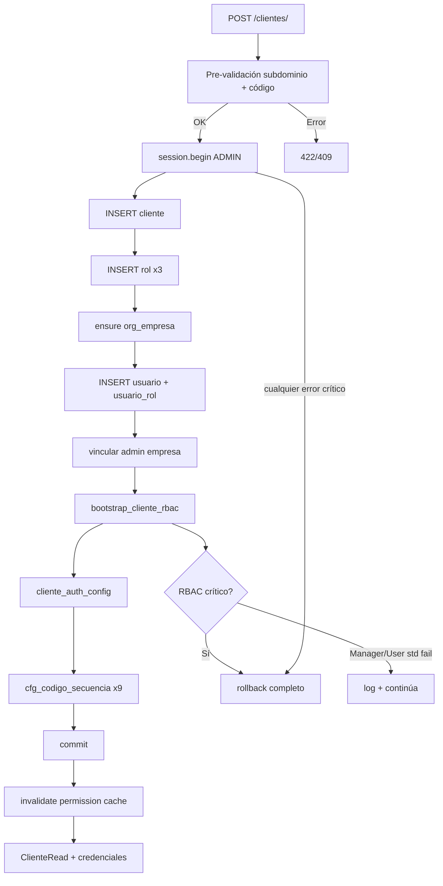

# 03 — Auditoría de Onboarding de Tenant

**Tipo:** Auditoría técnica (estado actual)  
**Fecha:** 2026-06-25  
**Alcance:** Flujo completo de creación de cliente (`POST /clientes/`) y dependencias bootstrap

---

## 1. Resumen

El onboarding de tenant es un **proceso transaccional atómico** que crea en una sola transacción SQL (sobre `DatabaseConnection.ADMIN`):

- Registro de cliente (tenant)
- Roles base (ADMIN_TENANT, MANAGER_TENANT, USER_TENANT)
- Empresa ERP inicial (`org_empresa`)
- Usuario administrador + asignación de rol
- RBAC (módulos, permisos, menú)
- Configuración de autenticación
- Secuencias de código ERP

**Conexión:** toda la transacción usa BD central compartida (`ADMIN`). Incluye escritura en tablas ERP (`org_empresa`, `cfg_codigo_secuencia`) en la misma BD.

---

## 2. Entry points

| Capa | Archivo | Función |
|------|---------|---------|
| HTTP | `app/modules/tenant/presentation/endpoints_clientes.py` | `POST /clientes/` |
| Orquestador | `app/modules/tenant/application/services/cliente_service.py` | `ClienteService.crear_cliente()` |
| Núcleo | `app/modules/tenant/application/services/cliente_onboarding_service.py` | `crear_cliente_con_onboarding()` |

**Autorización:** `require_permission("tenant.cliente.crear")` + `@require_super_admin()`.

---

## 3. Servicios participantes

| Servicio | Archivo | Rol en onboarding |
|----------|---------|-------------------|
| `ClienteService` | `cliente_service.py` | Pre-validación; delega a onboarding |
| `ClienteOnboardingService` | `cliente_onboarding_service.py` | Orquestador transaccional |
| `MinimalErpTenantBootstrapService` | `minimal_erp_tenant_bootstrap_service.py` | `org_empresa` + vínculo admin |
| `OnboardingRbacService` | `onboarding_rbac_service.py` | Módulos, grants globales, bundles |
| `OwnerSyncService` | `owner_sync_service.py` | `rol_permiso` + `rol_menu_permiso` por módulo |
| `BaseOperativeService` | `base_operative_service.py` | Grants operativos MANAGER/USER |
| `ManagerStandardService` | `manager_standard_service.py` | Grants estándar MANAGER_TENANT |
| `UserStandardService` | `user_standard_service.py` | Grants estándar USER_TENANT |
| `plan_modulo_resolver` | `plan_modulo_resolver.py` | Resuelve módulos por plan → `TRIAL_MODULES` |
| `CfgCodigoSecuenciaRepository` | `cfg_codigo_secuencia_repository.py` | Secuencias de código |

**No participa en flujo principal:**

- `OnboardingMenuBootstrapService` — usado solo en repair legacy (`scripts/repair_tenant_menu_grants.py`)

**Onboarding plataforma (separado):**

- `PlatformBootstrapService` — cliente SYSTEM + SUPER_ADMIN; equivalente idempotente a seed `D010`

---

## 4. Flujo paso a paso (orden real en código)

### Fase 0 — Pre-transacción (`ClienteService`)

Fuera de `session.begin()`:

1. `_validar_subdominio_cliente` — formato RFC 1035, unicidad en `cliente` activos
2. `_validar_codigo_cliente` — unicidad `codigo_cliente`

Errores: `ValidationError` (422) / `ConflictError` (409).

**No idempotente:** segundo POST con mismos datos falla aquí o en UNIQUE de BD.

### Fase 1 — Transacción única (`ADMIN`)

```python
async with get_db_connection(DatabaseConnection.ADMIN) as session:
    async with session.begin():
        # pasos 1-8
```

| # | Paso | Servicio / método | Tablas escritas | Tablas leídas |
|---|------|-------------------|-----------------|---------------|
| 1 | Insertar cliente | `_insertar_cliente` | `cliente` | — |
| 2 | Roles base | `_insertar_roles_base` | `rol` (×3) | — |
| 3 | Empresa inicial | `ensure_empresa_inicial` | `org_empresa` (si no existe) | `org_empresa` |
| 4 | Usuario admin | `_insertar_usuario_admin` | `usuario`, `usuario_rol` | — |
| 5 | Vínculo admin-empresa | `vincular_admin_empresa` | `UPDATE usuario`, `usuario_rol` | — |
| 6 | RBAC bootstrap | `bootstrap_cliente_rbac` | ver §5 | `permiso`, `modulo`, `rol`, … |
| 7 | Auth config | `_insertar_auth_config_si_no_existe` | `cliente_auth_config` | `cliente_auth_config` |
| 8 | Secuencias código | `_insertar_secuencias_codigo` | `cfg_codigo_secuencia` (×9) | `cfg_codigo_secuencia` |

### Fase 2 — Post-commit (no transaccional)

1. Invalidación cache permisos: `get_permission_resolver().invalidate_for_tenant(cliente_id)` — **no bloqueante** (try/except)
2. Retorno `ClienteRead` + `CredencialesInicialesRead` (contraseña en texto plano, única vez)

---

## 5. Sub-flujo RBAC (`bootstrap_cliente_rbac`)

Archivo: `onboarding_rbac_service.py`

| Sub-paso | Acción | Tablas afectadas |
|----------|--------|------------------|
| 5.1 | `_validar_catalogo_permiso` | Lee `permiso`; aborta si vacío |
| 5.2 | `activar_modulos_base_cliente` | `INSERT cliente_modulo` | Lee `modulo` |
| 5.3 | `bootstrap_global_grants_admin_tenant` | `INSERT rol_permiso` | Lee `permiso`, `rol` |
| 5.4 | `OwnerSyncService.sync_modules_for_owner` | `rol_permiso`, `rol_menu_permiso` | Lee catálogo módulo/menú |
| 5.5 | `BaseOperativeService.apply_to_operative_roles` | `rol_permiso` MANAGER/USER | Lee `rol`, `permiso` |
| 5.6 | `ManagerStandardService.apply_to_manager_role` | `rol_permiso`, `rol_menu_permiso` | — |
| 5.7 | `UserStandardService.apply_to_user_role` | `rol_permiso`, `rol_menu_permiso` | — |

**Módulos activados** (`owner_sync_constants.py`): `ORG`, `SYS_ADMIN`, `INV` (`TRIAL_MODULES`).

---

## 6. Detalle de entidades creadas

### 6.1 `cliente`

~25 campos desde `ClienteCreate`: subdominio, razón social, plan, branding, etc.

### 6.2 `rol` — tres roles sistema

| Código | Nivel | empresa_id |
|--------|-------|------------|
| ADMIN_TENANT | 5 | NULL (tenant-wide) |
| MANAGER_TENANT | 3 | NULL |
| USER_TENANT | 1 | NULL |

### 6.3 `org_empresa`

- Código fijo: `EMP001`
- RUC normalizado o sintético
- **Idempotente** a nivel sub-componente: si existe empresa activa, retorna existente

### 6.4 `usuario` admin

| Campo | Valor |
|-------|-------|
| `nombre_usuario` | `"admin"` |
| `requiere_cambio_contrasena` | `1` |
| `empresa_default_id` | empresa inicial |
| Contraseña | `generar_contrasena_segura(12)` → hash bcrypt |

### 6.5 `cfg_codigo_secuencia` — 9 entidades

```
org_empresa, org_sucursal, org_departamento, org_cargo, org_centro_costo,
inv_almacen, inv_producto, inv_categoria, inv_movimiento
```

Prefijos: EMP, SUC, DEP, CAR, CC, ALM, P, CAT, MOV.

---

## 7. Validaciones

### 7.1 Abortan transacción (rollback completo)

| Código / condición | Origen |
|--------------------|--------|
| `SUBDOMAIN_*`, `CLIENT_CODE_*` | Pre-transacción |
| `CLIENT_CREATION_FAILED` | INSERT cliente sin OUTPUT |
| `ROLE_CREATION_FAILED` | INSERT rol fallido |
| `USER_ONBOARDING_EMPRESA_DEFAULT` | Columna `empresa_default_id` no nullable |
| `ADMIN_USER_CREATION_FAILED` | INSERT usuario sin fila |
| `MINIMAL_ERP_EMPRESA_CREATE_FAILED` | Error `org_empresa` |
| `ONBOARDING_PERMISSO_CATALOG_EMPTY` | Catálogo `permiso` vacío |
| `ONBOARDING_MODULOS_BASE_NOT_FOUND` | Seeds S010/S020 no aplicados |
| `ONBOARDING_ADMIN_ROLE_NOT_FOUND` | Rol admin ausente en grants |
| `DatabaseError` / `ServiceError` | Propagación `@BaseService.handle_service_errors` |

### 7.2 Pasos idempotentes (sub-componentes)

| Componente | Mecanismo |
|------------|-----------|
| `ensure_empresa_inicial` | SELECT previo + catch UNIQUE |
| `activar_modulos_base_cliente` | `IF NOT EXISTS` en `cliente_modulo` |
| `bootstrap_global_grants_admin_tenant` | `NOT EXISTS` en `rol_permiso` |
| `OwnerSyncService` | `NOT EXISTS` en inserts |
| `BaseOperativeService` | `NOT EXISTS` en `rol_permiso` |
| `_insertar_auth_config_si_no_existe` | `IF NOT EXISTS` |
| `insert_secuencia` | `get_by_entidad` antes de insert |
| `vincular_admin_empresa` | UPDATE idempotente |

### 7.3 Pasos NO idempotentes

- `crear_cliente_con_onboarding` completo
- `_insertar_cliente`, `_insertar_roles_base`, `_insertar_usuario_admin` (primer uso)

### 7.4 Fallos no bloqueantes (dentro de transacción)

En `onboarding_rbac_service.py`, pasos **MANAGER_STANDARD** y **USER_STANDARD** envueltos en `try/except` con `logger.exception`. Si fallan, el onboarding **continúa** y hace commit.

**Implicación:** tenant puede quedar sin grants estándar completos de MANAGER/USER sin que falle el POST.

---

## 8. Qué ocurre cuando falla un paso

| Escenario | Comportamiento |
|-----------|----------------|
| Error en pasos 1-5, 7-8, o RBAC crítico (5.1-5.5) | Rollback completo; no queda `cliente` ni datos parciales |
| Error en MANAGER/USER standard (5.6-5.7) | Log + commit del resto |
| Error post-commit (cache invalidation) | Log debug; onboarding considerado exitoso |
| Pre-validación falla | Sin transacción iniciada |

---

## 9. Dependencias bootstrap previas

Orden oficial: `app/bootstrap_v2/00_manifest/BOOTSTRAP_ORDER.md`

```
V010 (ERP DDL) → V020 (central) → V030 (permiso/rol_permiso)
→ S010/S020/S030 + S040–S066 (seeds catálogo)
→ Arrancar FastAPI (permission_sync en startup)
→ POST /clientes/ por tenant
```

**Pre-requisitos críticos:**

1. Seeds `S010`/`S020` — módulos `ORG`, `SYS_ADMIN`, `INV` en catálogo
2. Startup al menos una vez — `permission_sync_service` pobla tabla `permiso`
3. DDL `V010` + `V020` aplicados

Scripts runtime `R010`/`R020` **no son necesarios** para tenants nuevos vía API.

---

## 10. Diagrama de flujo



---

## 11. Onboarding plataforma (referencia)

Flujo separado para cliente SYSTEM:

| Servicio | Rol |
|----------|-----|
| `PlatformIdentityBootstrapService` | Cliente plataforma + usuario superadmin |
| `PlatformRbacBootstrapService` | Roles/permisos plataforma |
| `PlatformBootstrapService` | Orquestador idempotente |

Usa `DatabaseConnection.ADMIN`. No crea `org_empresa` de tenant operativo.

---

## 12. Gestión de conexiones de tenant

`app/modules/tenant/application/services/conexion_service.py` gestiona registros en `cliente_conexion` (metadata para multi-DB futuro). **No forma parte** del flujo `crear_cliente_con_onboarding` actual — onboarding no crea fila en `cliente_conexion`.

Endpoint: `app/modules/tenant/presentation/endpoints_conexiones.py`.

---

## 13. Hallazgos documentales

| # | Hallazgo |
|---|----------|
| 1 | Onboarding escribe tablas ERP (`org_empresa`, `cfg_codigo_secuencia`) en conexión ADMIN (BD compartida) |
| 2 | `RUNTIME_BOOTSTRAP_FLOW.md` parcialmente desactualizado respecto al orden real |
| 3 | Errores MANAGER/USER standard se tragan — riesgo de RBAC incompleto silencioso |
| 4 | Onboarding completo no es idempotente |
| 5 | No se crea `cliente_conexion` durante onboarding |
| 6 | Credenciales admin solo en respuesta HTTP; `requiere_cambio_contrasena=1` en BD |
