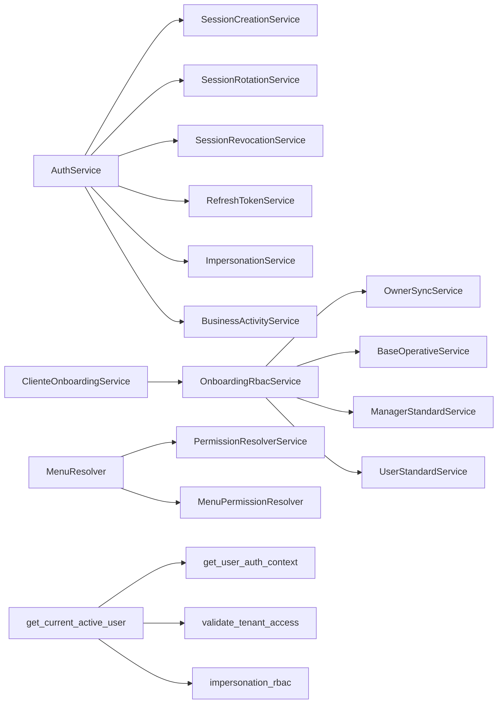
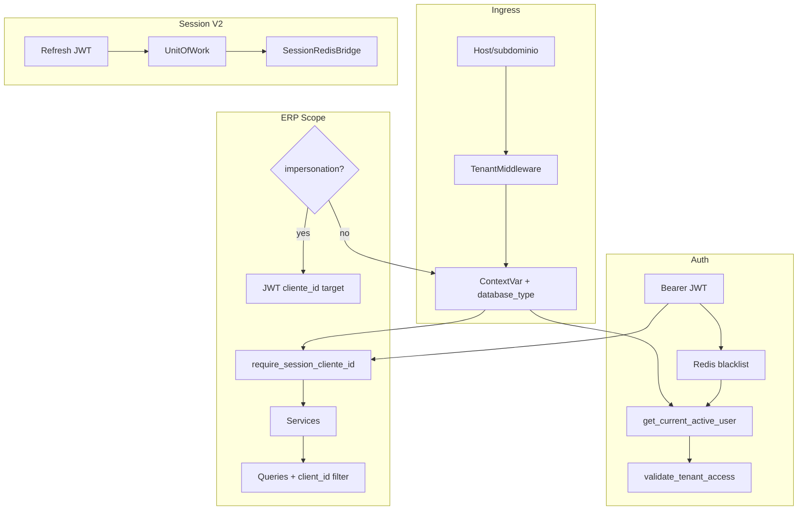

# 04 — IAM, Tenant Resolution y Dependencias Ocultas

**Tipo:** Auditoría técnica (estado actual)  
**Fecha:** 2026-06-25  
**Alcance:** Autenticación, resolución de tenant, propagación de contexto, dependencias entre servicios

---

## 1. Resumen

El sistema maneja **tres fuentes de `cliente_id`** según capa:

| Fuente | Mecanismo | Uso principal |
|--------|-----------|---------------|
| Host / subdominio | `TenantMiddleware` → `ContextVar` | Lookup usuario, validación tenant en login |
| JWT (access/refresh) | Claim `cliente_id` | Autorización, refresh/logout, impersonación |
| Session scope ERP | `require_session_cliente_id()` | Datos operativos (impersonation-safe) |

La identidad autenticada (`current_user.cliente_id`) **no siempre coincide** con el tenant operativo de datos ERP (caso impersonación: fila SYSTEM del operador).

---

## 2. Tenant resolution

### 2.1 TenantMiddleware

**Archivo:** `app/core/tenant/middleware.py`

Flujo:

1. Extraer host (producción: solo `Host`; desarrollo: fallback `Origin`/`Referer`)
2. Extraer subdominio
3. Resolver `cliente_id` desde BD central (`cliente.subdominio`)
4. Cargar metadata de conexión (`get_connection_metadata_async`)
5. Determinar `database_type` (`single` | `multi`)
6. Establecer `TenantContext` en `ContextVar`
7. Procesar request
8. `reset_tenant_context()` en finally

**Subdominios excluidos:** `api`, `www`, `admin`, `static`, `cdn`, `assets`, `backend` → cliente SYSTEM (superadmin).

**Nota:** `request.state.cliente_id` está documentado como fallback en `session_scope.py` pero **no se popula** por el middleware hoy.

### 2.2 ContextVar

**Archivo:** `app/core/tenant/context.py`

| Función | Rol |
|---------|-----|
| `set_tenant_context(TenantContext)` | Establece contexto request |
| `get_current_client_id()` | Obtiene UUID; lanza si ausente |
| `try_get_current_client_id()` | Obtiene UUID o None |
| `TenantContext.database_type` | `"single"` o `"multi"` |
| `TenantContext.is_multi_db()` | Helper booleano |

### 2.3 Session scope ERP

**Archivo:** `app/core/tenant/session_scope.py`

`resolve_session_cliente_id()` — prioridad:

1. JWT `cliente_id` si `is_impersonation` + `effective_scope=tenant`
2. `request.state.cliente_id` (hook legacy, no usado)
3. `ContextVar` (`try_get_current_client_id`)
4. `current_user.cliente_id` (fila BD del usuario)

`require_session_cliente_id()` — usado por `org_deps`, `inv_deps`, `rbac_deps`.

### 2.4 Company scope

**Archivo:** `app/core/tenant/company_scope.py`

| Función | Rol |
|---------|-----|
| `validate_erp_operational_session()` | Requiere `empresa_id` en JWT para usuarios ERP |
| `require_session_empresa_id()` | Empresa activa para services |
| `assert_row_tenant()` / `assert_row_empresa()` | Post-query → 404 cross-scope |

**Archivo:** `app/core/tenant/empresa_context.py` — `ContextVar` para `empresa_id` durante request.

---

## 3. Validación de tenant

### 3.1 `app/api/deps.py`

| Dependency | Rol |
|------------|-----|
| `get_current_user_data` | Decode JWT; Redis blacklist `jti`; touch actividad vía `sid` |
| `get_current_active_user` | Carga usuario; valida acceso tenant |

`validate_tenant_access()` (`user_context.py`):

- Superadmin → permitido (auditado)
- Usuario regular → `context.cliente_id == request_cliente_id`
- Impersonación tenant → **skip** validación; aplica RBAC impersonation

### 3.2 `app/api/deps_auth.py`

| Dependency | Valida |
|------------|--------|
| `require_selection_token_payload` | Token de selección de empresa post-login |
| `require_full_session_payload` | Rechaza selection token (409) |
| `require_erp_session` | Sesión completa + `validate_erp_operational_session` |
| `require_active_password_session_v2_for_me` | Probe sesión V2 en `/auth/me` |

### 3.3 Filtro automático en queries

**Archivo:** `app/infrastructure/database/query_helpers.py`

`apply_tenant_filter()` inyecta `WHERE cliente_id = :id` salvo tablas en `GLOBAL_TABLES`.

`execute_query()` en `queries_async.py` aplica filtro y audita con `QueryAuditor`.

---

## 4. Flujos de autenticación

### 4.1 Login — `POST /auth/login/`

**Archivo:** `app/modules/auth/presentation/endpoints.py`

```
1. cliente_id = get_current_client_id()          # Host tenant
2. Validar cliente activo
3. authenticate_user(cliente_id, user, pass)
4. AuthService.get_empresa_activa_para_login()
   ├─ multi-empresa → selection_token (empresa_selection_pending=true)
   └─ single empresa → sesión completa
5. create_access_token + create_refresh_token
6. persist_login_session (V2) o RefreshTokenService (V1)
7. V2: re-emitir access con claim sid
8. Web: refresh en HttpOnly cookie; mobile: en body
```

### 4.2 Selección empresa — `POST /auth/empresa/seleccionar/`

- Requiere `require_selection_token_payload`
- Valida `token_cliente_id == get_current_client_id()`
- `AuthService.seleccionar_empresa_post_login()` → sesión completa + refresh
- Rama impersonación → `ImpersonationService.seleccionar_empresa_impersonacion()` (solo access)

### 4.3 Cambio empresa — `POST /auth/empresa/cambiar/`

- Token access normal (no selection)
- **Bloqueado en impersonación** (403)
- `AuthService.cambiar_empresa_sesion()` → rotación atómica refresh + nuevos tokens

### 4.4 Refresh — `POST /auth/refresh/`

```
get_current_user_from_refresh()
  ├─ V2: SessionQueryService + SessionProbeService
  └─ V1: RefreshTokenService.validate_refresh_token

AuthService.rotate_refresh_session()
  ├─ V2: SessionRotationService.rotate()
  └─ V1: rotate_refresh_token_service()

cliente_id desde refresh JWT (NO desde Host)
Impersonation refresh → 403
```

### 4.5 Logout — `POST /auth/logout/`

- Idempotente 200
- `cliente_id` desde **refresh JWT**
- V2: `SessionRevocationService.revoke_current_session()`
- V1: `RefreshTokenService.revoke_token()`
- Opcional: blacklist access `jti`
- Limpia cookies web

### 4.6 Logout all — `POST /auth/logout_all/`

- V2: revoca todas las sesiones del usuario
- V1: revoca todos los refresh + blacklist JTIs activos

---

## 5. Session Management V2

### 5.1 Feature flag

**Archivo:** `app/modules/auth/application/session/session_v2_feature.py`

- `IAM_SESSION_MANAGEMENT_V2_ENABLED` (global)
- `IAM_SESSION_V2_TENANT_ALLOWLIST` (cutover por tenant)
- V1 y V2 coexisten

### 5.2 Modelo de datos

**DDL:** `app/bootstrap_v2/01_schema/V031__iam_session_management_v3.sql`

Tablas: `user_session`, `token_family`, `refresh_tokens` (extendida).

### 5.3 Servicios V2

| Servicio | Rol |
|----------|-----|
| `SessionCreationService` | Crear sesión + familia + refresh |
| `SessionRotationService` | Rotación refresh, detección replay |
| `SessionRevocationService` | Revocación individual / masiva |
| `SessionQueryService` | Lectura sesiones activas |
| `SessionProbeService` | Probe estado sesión (`/auth/me`) |
| `SessionPolicyService` | Políticas (límites, TTL) |
| `SessionRedisBridge` | Puente Redis post-commit |
| `SessionAuditEmitter` | Auditoría de eventos sesión |
| `BusinessActivityService` | Touch actividad por `sid` |

Transacciones: `UnitOfWork` + `session_transaction_core.py`.

### 5.4 JWT

**Archivo:** `app/core/security/jwt.py`

Access token claims: `sub`, `cliente_id`, `jti`, `type`, `access_level`, `empresa_id`, `empresa_selection_pending`, `sid` (V2), flags impersonación.

Refresh token: mismos claims base + `type=refresh`.

### 5.5 Redis

| Key pattern | Uso |
|-------------|-----|
| `token:blacklist:{jti}` | Access tokens revocados |
| `session:access_jti:{session_id}` | Mapeo sesión → jti actual |
| `impersonation:parent:{impersonation_jti}` | Tokens padre para restore |

**Archivo bridge:** `app/modules/auth/application/services/session_redis_bridge.py`

---

## 6. Impersonación

### 6.1 Inicio — `POST /auth/impersonate/{cliente_id}/`

**Archivo:** `impersonation_service.py`

- Operador superadmin en host plataforma
- Usuario sintético en tenant destino
- Multi-empresa → selection token (access-only)
- Parent session en Redis
- **Sin refresh token** para sesión impersonada

Claims: `is_impersonation=true`, `cliente_id=<target>`, `effective_scope=tenant`.

### 6.2 Comportamiento bajo impersonación

| Operación | Comportamiento |
|-----------|----------------|
| `require_session_cliente_id` | JWT target tenant |
| `/auth/refresh/` | 403 |
| `/auth/empresa/cambiar/` | 403 |
| `/auth/empresa/seleccionar/` | Permitido (handler impersonación) |
| RBAC | `impersonation_rbac.py` — effective tenant_admin |

### 6.3 Fin — `POST /auth/impersonate/end/`

- Blacklist jti impersonación
- Restore parent desde Redis
- Valida refresh padre activo (V2 probe)

---

## 7. Dependencias ocultas y acoplamientos

### 7.1 Servicios que dependen de otros servicios



### 7.2 Singletons y caches

| Componente | Archivo | Scope |
|------------|---------|-------|
| `get_permission_resolver()` | `permission_resolver.py` | Singleton proceso; cache permisos por usuario/tenant |
| `connection_cache` | `core/tenant/cache.py` | Metadata `cliente_conexion` |
| `_async_engines` | `connection_async.py` | Engines SQLAlchemy por proceso |
| `get_limiter()` | `rate_limiting.py` | Rate limiter slowapi |
| `_sql_server_version_cache` | `query_helpers.py` | Versión SQL Server |

**Invalidación cache permisos** tras: onboarding, activación módulos, cambios rol/usuario, repair scripts.

### 7.3 Queries reutilizadas

| Query / módulo | Consumidores |
|----------------|--------------|
| `queries/auth/session/*` | Todos los servicios Session V2 |
| `queries/rbac/rbac_queries.py` | rbac, onboarding, superadmin |
| `queries/users/user_queries.py` | users, auth, superadmin |
| `sql_constants.GET_USER_COMPLETE_*` | `user_context.py`, auth deps |
| `CfgCodigoSecuenciaRepository` | onboarding, servicios ERP con códigos autogenerados |

### 7.4 Repositorios compartidos

Solo platform/IAM — ver `01_BACKEND_AS_IS.md` §7.

### 7.5 Helpers transversales

| Helper | Ubicación | Uso |
|--------|-----------|-----|
| `@BaseService.handle_service_errors` | `core/application/base_service.py` | Decorador servicios platform |
| `require_permission` | `core/authorization/rbac.py` | Gate RBAC endpoints |
| `QueryAuditor` | `core/security/query_auditor.py` | Auditoría queries producción |
| `apply_erp_pagination/sort` | `shared/pagination/` | Listados ERP |

### 7.6 Startup dependencies

**Archivo:** `app/main.py` lifespan

| Proceso startup | Servicio |
|-----------------|----------|
| `permission_sync_service` | Sincroniza catálogo `permiso` desde código |
| RBAC startup | Carga permisos en memoria |
| Connection pool init | `connection_pool.py` (legacy sync) |

Onboarding **requiere** `permission_sync` ejecutado al menos una vez.

### 7.7 Variables globales / estado proceso

| Variable | Archivo | Riesgo |
|----------|---------|--------|
| `_async_engines` | connection_async | Engines vivos todo el ciclo worker |
| `_pools` | connection_pool | Idem sync |
| Permission cache | permission_resolver | Stale hasta invalidación |
| Tenant ContextVar | context.py | Aislado por request async |

---

## 8. Propagación cliente_id a queries

### 8.1 Camino explícito (ORG/INV — patrón correcto)

```
Endpoint: client_id = Depends(get_org_session_client_id)
Service:  await list_empresas_servicio(client_id=client_id, ...)
Query:    .where(OrgEmpresaTable.c.cliente_id == client_id)
```

### 8.2 Camino implícito (ContextVar)

```
execute_query(query)  # sin client_id
  → apply_tenant_filter usa try_get_current_client_id()
```

### 8.3 Camino ADMIN (sin filtro tenant)

```
execute_query(query, connection_type=DatabaseConnection.ADMIN)
```

Usado en: tenant, superadmin, modulos, rbac catálogo, middleware tenant lookup.

### 8.4 Bypass multi-DB en servicios legacy

`user_context.py` y `rol_service.py` consultan `tenant_context.database_type`:

- Si `database_type == "multi"` → omiten filtro `cliente_id` en algunas queries
- Preparación para BD dedicada; **no uniforme** en todos los módulos

---

## 9. Diagrama integrado IAM + tenant



---

## 10. Índice de archivos críticos

| Concern | Path |
|---------|------|
| Tenant middleware | `app/core/tenant/middleware.py` |
| ContextVar | `app/core/tenant/context.py` |
| Session scope | `app/core/tenant/session_scope.py` |
| Company scope | `app/core/tenant/company_scope.py` |
| Auth deps | `app/api/deps.py` |
| Session contract deps | `app/api/deps_auth.py` |
| User context | `app/core/auth/user_context.py` |
| JWT | `app/core/security/jwt.py` |
| Auth endpoints | `app/modules/auth/presentation/endpoints.py` |
| Auth orchestration | `app/modules/auth/application/services/auth_service.py` |
| Impersonation | `app/modules/auth/application/services/impersonation_service.py` |
| Session V2 feature | `app/modules/auth/application/session/session_v2_feature.py` |
| Permission resolver | `app/core/authorization/permission_resolver.py` |
| Menu resolver | `app/core/authorization/menu_resolver.py` |

---

## 11. Hallazgos (descriptivos)

| # | Hallazgo |
|---|----------|
| 1 | Triple modelo de `cliente_id` (Host, JWT, session scope) — intencional pero complejo |
| 2 | Solo ORG, INV, RBAC tienen `{cod}_deps` — resto ERP puede usar `current_user.cliente_id` |
| 3 | `database_type=multi` manejado parcialmente en IAM/RBAC; no generalizado |
| 4 | Permission cache requiere invalidación manual dispersa |
| 5 | V1/V2 session coexisten — bifurcación en AuthService |
| 6 | Refresh/logout correctamente usan JWT `cliente_id`, no Host |
