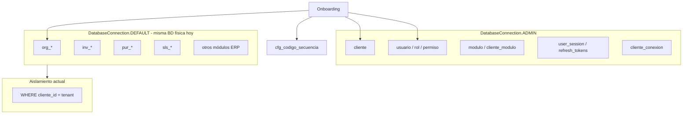

# 05 — Uso de Base de Datos por Módulo

**Tipo:** Auditoría técnica (estado actual)  
**Fecha:** 2026-06-25  
**Alcance:** Identificación de tablas por módulo, operaciones lectura/escritura, tablas críticas  
**Nota:** Sin clasificación shared/dedicated (etapa futura)

---

## 1. Modelo de datos actual

### 1.1 Bases de datos físicas (estado operativo)

| Conexión | BD física | Contenido |
|----------|-----------|-----------|
| `DatabaseConnection.ADMIN` | BD central (`DB_ADMIN_*`) | Metadata SaaS + IAM + catálogos globales + **datos ERP de todos los tenants** (modelo compartido) |
| `DatabaseConnection.DEFAULT` | Misma BD compartida (`DB_*`) | Datos ERP filtrados por `cliente_id` |

**Hoy:** ADMIN y DEFAULT apuntan conceptualmente a la misma BD compartida con distintos propósitos de routing. La infraestructura ya contempla DEFAULT → BD dedicada vía `cliente_conexion` (`database_type=multi`), pero no está activa.

### 1.2 Fuentes de definición schema

| Recurso | Ubicación |
|---------|-----------|
| DDL ERP completo | `app/bootstrap_v2/01_schema/V010__tablas_bd_erp_completo.sql` |
| DDL central | `app/bootstrap_v2/01_schema/V020__tablas_bd_central.sql` |
| DDL RBAC | `app/bootstrap_v2/01_schema/V030__rbac_tablas_central.sql` |
| DDL IAM sessions V3 | `app/bootstrap_v2/01_schema/V031__iam_session_management_v3.sql` |
| SQLAlchemy Core (central) | `app/infrastructure/database/tables.py` |
| SQLAlchemy Core (módulos SaaS) | `app/infrastructure/database/tables_modulos.py` |
| SQLAlchemy Core (ERP) | **Parcial** — tablas ERP referenciadas en `queries/{cod}/` y DDL V010 |

---

## 2. Tablas globales (sin filtro `cliente_id` automático)

Definidas en `app/infrastructure/database/query_helpers.py` → `GLOBAL_TABLES`:

| Tabla | Naturaleza |
|-------|------------|
| `cliente` | Metadata tenant |
| `cliente_modulo` | Activación módulos por tenant |
| `cliente_conexion` | Metadata conexión BD dedicada |
| `sistema_config` | Configuración plataforma |
| `modulo` | Catálogo módulos SaaS |
| `modulo_seccion` | Secciones de catálogo |
| `modulo_menu` | Menús de catálogo |
| `permiso` | Catálogo permisos RBAC |
| `cat_moneda`, `cat_pais`, `cat_departamento`, `cat_provincia`, `cat_distrito` | Catálogos geográficos/monetarios |

**Implicación:** queries sobre estas tablas no reciben `WHERE cliente_id` automático.

---

## 3. Tablas central / IAM (`tables.py`)

| Tabla | Lectura | Escritura | Módulos principales |
|-------|---------|-----------|---------------------|
| `cliente` | ✓ | ✓ | tenant, middleware, superadmin |
| `cliente_conexion` | ✓ | ✓ | tenant (conexion_service) |
| `cliente_auth_config` | ✓ | ✓ | auth, tenant (onboarding) |
| `usuario` | ✓ | ✓ | auth, users, superadmin, tenant |
| `rol` | ✓ | ✓ | rbac, tenant (onboarding), users |
| `usuario_rol` | ✓ | ✓ | users, rbac, tenant |
| `rol_permiso` | ✓ | ✓ | rbac, tenant (onboarding) |
| `rol_menu_permiso` | ✓ | ✓ | rbac, tenant (onboarding), modulos |
| `refresh_tokens` | ✓ | ✓ | auth (V1 + V2) |
| `token_family` | ✓ | ✓ | auth (V2) |
| `user_session` | ✓ | ✓ | auth (V2) |
| `auth_audit_log` | ✓ | ✓ | auth, superadmin |
| `federacion_identidad` | ✓ | ✓ | auth (SSO) |
| `log_sincronizacion_usuario` | ✓ | ✓ | auth (SSO) |
| `cfg_codigo_secuencia` | ✓ | ✓ | tenant (onboarding), ERP (secuencias) |

---

## 4. Tablas catálogo SaaS (`tables_modulos.py`)

| Tabla | Lectura | Escritura | Módulos |
|-------|---------|-----------|---------|
| `modulo` | ✓ | ✓ (superadmin) | modulos, tenant |
| `modulo_seccion` | ✓ | ✓ | modulos |
| `modulo_menu` | ✓ | ✓ | modulos, menu resolver |
| `modulo_rol_plantilla` | ✓ | ✓ | modulos |
| `cliente_modulo` | ✓ | ✓ | modulos, tenant (onboarding) |

---

## 5. Mapa módulo → tablas ERP (vía `queries/{cod}/`)

Convención: carpeta `app/infrastructure/database/queries/{cod}/` ↔ módulo `app/modules/{cod}/`.

### 5.1 ORG — Organización

| Tabla | R | W | Queries |
|-------|---|---|---------|
| `org_empresa` | ✓ | ✓ | `org/empresa_queries.py` |
| `org_sucursal` | ✓ | ✓ | `org/sucursal_queries.py` |
| `org_departamento` | ✓ | ✓ | `org/departamento_queries.py` |
| `org_cargo` | ✓ | ✓ | `org/cargo_queries.py` |
| `org_centro_costo` | ✓ | ✓ | `org/centro_costo_queries.py` |
| `org_parametro_sistema` | ✓ | ✓ | `org/parametro_queries.py` |

**Nota:** `org_empresa` también escrita en onboarding (conexión ADMIN).

### 5.2 INV — Inventario

| Tabla | R | W |
|-------|---|---|
| `inv_producto` | ✓ | ✓ |
| `inv_almacen` | ✓ | ✓ |
| `inv_stock` | ✓ | ✓ (derivada — escritura vía proceso) |
| `inv_categoria_producto` | ✓ | ✓ |
| `inv_unidad_medida` | ✓ | ✓ |
| `inv_tipo_movimiento` | ✓ | ✓ |
| `inv_movimiento` | ✓ | ✓ |
| `inv_movimiento_detalle` | ✓ | ✓ |
| `inv_inventario_fisico` | ✓ | ✓ |
| `inv_inventario_fisico_detalle` | ✓ | ✓ |

### 5.3 PUR — Compras

| Tabla | R | W |
|-------|---|---|
| `pur_proveedor` | ✓ | ✓ |
| `pur_proveedor_contacto` | ✓ | ✓ |
| `pur_producto_proveedor` | ✓ | ✓ |
| `pur_solicitud_compra` | ✓ | ✓ |
| `pur_solicitud_compra_detalle` | ✓ | ✓ |
| `pur_cotizacion` | ✓ | ✓ |
| `pur_cotizacion_detalle` | ✓ | ✓ |
| `pur_orden_compra` | ✓ | ✓ |
| `pur_orden_compra_detalle` | ✓ | ✓ |
| `pur_recepcion` | ✓ | ✓ |
| `pur_recepcion_detalle` | ✓ | ✓ |

### 5.4 SLS — Ventas

| Tabla | R | W |
|-------|---|---|
| `sls_cliente` | ✓ | ✓ |
| `sls_cliente_contacto` | ✓ | ✓ |
| `sls_cliente_direccion` | ✓ | ✓ |
| `sls_cotizacion` | ✓ | ✓ |
| `sls_cotizacion_detalle` | ✓ | ✓ |
| `sls_pedido` | ✓ | ✓ |
| `sls_pedido_detalle` | ✓ | ✓ |

### 5.5 WMS — Almacén

| Tabla | R | W |
|-------|---|---|
| `wms_zona_almacen` | ✓ | ✓ |
| `wms_ubicacion` | ✓ | ✓ |
| `wms_stock_ubicacion` | ✓ | ✓ |
| `wms_tarea` | ✓ | ✓ |

### 5.6 MFG / MRP / MPS — Manufactura

| Prefijo | Tablas principales |
|---------|-------------------|
| `mfg_*` | centros trabajo, operaciones, BOM, rutas, órdenes producción, consumos |
| `mrp_*` | plan maestro, necesidades, órdenes sugeridas, explosión |
| `mps_*` | pronósticos, plan producción |

### 5.7 Otros módulos ERP

| Módulo | Tablas (prefijo) |
|--------|------------------|
| FIN | `fin_plan_cuentas`, `fin_periodo_contable`, `fin_asiento_contable`, `fin_asiento_detalle` |
| HCM | `hcm_empleado`, `hcm_contrato`, `hcm_planilla`, `hcm_asistencia`, `hcm_vacaciones`, `hcm_prestamo` |
| CRM | `crm_campana`, `crm_lead`, `crm_oportunidad`, `crm_actividad` |
| LOG | `log_transportista`, `log_vehiculo`, `log_ruta`, `log_guia_remision`, `log_despacho` |
| POS | `pos_punto_venta`, `pos_turno_caja`, `pos_venta`, `pos_venta_detalle` |
| PRC | `prc_lista_precio`, `prc_promocion` |
| QMS | `qms_parametro_calidad`, `qms_plan_inspeccion`, `qms_inspeccion`, `qms_no_conformidad` |
| INV_BILL | `invbill_serie_comprobante`, `invbill_comprobante`, `invbill_comprobante_detalle` |
| CST | costos producto, tipos centro costo |
| TAX | `tax_libro_electronico` |
| MNT | `mnt_activo`, `mnt_orden_trabajo`, `mnt_historial_mantenimiento` |
| PM | `pm_proyecto` |
| SVC | `svc_orden_servicio` |
| TKT | tickets help desk |
| DMS | `dms_documento` |
| WFL | `wfl_flujo_trabajo` |
| BI | `bi_reporte` |
| BDG | presupuesto |
| AUD | `aud_log_auditoria` |

### 5.8 Catálogos read-only tenant

**Módulo:** `catalogos` — lee `cat_*` sin escritura desde API tenant.

---

## 6. Módulos platform — resumen lectura/escritura

| Módulo | Conexión típica | Lectura | Escritura |
|--------|-----------------|---------|-----------|
| **tenant** | ADMIN | `cliente`, catálogos | `cliente`, `org_empresa`*, `cfg_codigo_secuencia`*, RBAC seed |
| **auth** | ADMIN + DEFAULT | usuarios, sesiones | sesiones, tokens, audit |
| **users** | ADMIN | `usuario`, `rol` | `usuario`, `usuario_rol` |
| **rbac** | ADMIN | `rol`, `permiso`, asignaciones | `rol`, `rol_permiso`, `rol_menu_permiso` |
| **superadmin** | ADMIN | todo central | usuarios plataforma, auditoría |
| **modulos** | ADMIN | catálogo módulos | activación `cliente_modulo` |
| **menus** (legacy) | ADMIN | `area_menu`, `menu` | limitado |

\* Escritura ERP durante onboarding en transacción ADMIN.

---

## 7. Tablas críticas (alta sensibilidad / alto impacto)

### 7.1 Críticas plataforma

| Tabla | Motivo |
|-------|--------|
| `cliente` | Identidad tenant; subdominio routing |
| `cliente_conexion` | Futura resolución BD dedicada |
| `usuario` | Credenciales, acceso |
| `rol` / `usuario_rol` / `rol_permiso` | Autorización |
| `permiso` | Catálogo RBAC global |
| `user_session` / `token_family` / `refresh_tokens` | Sesiones IAM |
| `cliente_modulo` | Feature flags por tenant |

### 7.2 Críticas operativas ERP

| Tabla | Motivo |
|-------|--------|
| `org_empresa` | Contexto multiempresa; scope `empresa_id` |
| `inv_stock` | Saldos inventario (derivada) |
| `inv_movimiento` / `inv_movimiento_detalle` | Transacciones inventario |
| `cfg_codigo_secuencia` | Integridad códigos documento |
| `fin_asiento_contable` | Impacto contable |

### 7.3 Críticas transversales

| Tabla | Motivo |
|-------|--------|
| `auth_audit_log` | Trazabilidad seguridad |
| `aud_log_auditoria` | Trazabilidad ERP |

---

## 8. Patrones de acceso por tipo de operación

| Patrón | Conexión | Filtro tenant | Ejemplo |
|--------|----------|---------------|---------|
| ERP listado/CRUD | DEFAULT | `cliente_id` explícito + auto-filter | INV productos |
| Platform admin | ADMIN | Sin filtro / por `cliente_id` en WHERE manual | tenant clientes |
| Onboarding | ADMIN | N/A (insert con `cliente_id` en datos) | crear cliente |
| Middleware lookup | ADMIN | Query por subdominio | resolver tenant |
| Session V2 tx | DEFAULT o ADMIN según UoW | Por `cliente_id` en queries | rotación refresh |
| Catálogo global | ADMIN | Tabla en GLOBAL_TABLES | listar módulos |

---

## 9. Menús: dualidad legacy / actual

| Sistema | Tablas | Estado |
|-------|--------|--------|
| Legacy | `area_menu`, `menu` | `queries/menus/` — deprecado funcionalmente |
| Actual v2 | `modulo`, `modulo_menu`, `rol_menu_permiso` | Productivo; menu resolver |

---

## 10. Diagrama de partición lógica (estado actual)

---

## 11. Hallazgos documentales

| # | Hallazgo |
|---|----------|
| 1 | Tablas ERP no centralizadas en `tables.py` — solo en DDL V010 y queries |
| 2 | Onboarding escribe tablas ERP vía ADMIN en BD compartida |
| 3 | `permiso` es catálogo global en BD central — no por tenant |
| 4 | `inv_stock` es tabla derivada — solo escritura vía procesos internos |
| 5 | Menús legacy (`area_menu`) coexisten con `modulo_menu` |
| 6 | Catálogos `cat_*` en GLOBAL_TABLES — asumen presencia en BD tenant o central según despliegue |
