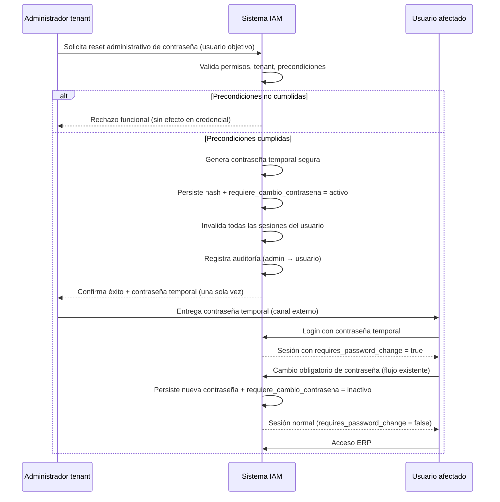

# Diseño Funcional — Reset Administrativo de Contraseña

**Documento:** `ADMIN_PASSWORD_RESET_FUNCTIONAL_SPEC.md`  
**Fecha:** 2026-06-24  
**Modo:** Diseño funcional exclusivo Backend (READ ONLY de código — sin implementación)  
**Estado:** Propuesta normativa para revisión  
**Relacionado:** FORCE PASSWORD CHANGE (`requiere_cambio_contrasena`), onboarding tenant, Gestión de Usuarios IAM

---

## 1. Objetivo

### 1.1 Problema que resuelve

El sistema permite crear usuarios, autenticarlos y forzar el cambio obligatorio de contraseña (`requiere_cambio_contrasena`), pero **no dispone hoy de un proceso HTTP productivo** mediante el cual un administrador del tenant restablezca la contraseña de un usuario existente desde Gestión de Usuarios.

Esa carencia obliga a recurrir a vías no productivas (intervención manual en base de datos, scripts operativos de staging o recreación indirecta de credenciales) cuando un usuario:

- olvidó su contraseña y no existe flujo de autoservicio,
- perdió una contraseña temporal de onboarding,
- requiere rotación forzada por política de seguridad del tenant, o
- quedó bloqueado y el administrador debe restablecer el acceso de forma controlada.

### 1.2 Objetivo funcional

Definir el **comportamiento oficial** del **Reset Administrativo de Contraseña**: un proceso iniciado por un administrador autorizado del tenant que restablece la credencial local de un usuario, activa el cambio obligatorio en el próximo acceso y reutiliza la infraestructura IAM ya existente, **sin crear un segundo mecanismo paralelo** de enforcement ni de cambio de contraseña.

### 1.3 Resultado esperado

Tras un reset administrativo exitoso:

1. El usuario afectado puede autenticarse únicamente con la **contraseña temporal** emitida en esa operación.
2. El sistema lo trata como usuario en **cambio obligatorio de contraseña** hasta completar el flujo canónico de cambio.
3. Todas las sesiones previas del usuario quedan **invalidadas**.
4. La operación queda **auditada** con trazabilidad administrador → usuario afectado.

---

## 2. Alcance

### 2.1 Incluido

| Ámbito | Descripción |
|--------|-------------|
| **Actor iniciador** | Administrador del tenant con permisos de gestión de usuarios |
| **Usuario objetivo** | Usuarios locales (`proveedor_autenticacion = local`) del mismo tenant |
| **Efecto en credencial** | Sustitución por contraseña temporal + activación de `requiere_cambio_contrasena` |
| **Post-reset** | Reutilización del flujo existente de login + cambio obligatorio + acceso ERP |
| **Sesiones** | Invalidación de todas las sesiones activas del usuario afectado |
| **Auditoría** | Registro del evento administrativo y de los efectos colaterales de sesión |

### 2.2 Excluido (explícito)

| Ámbito | Motivo |
|--------|--------|
| Autoservicio «olvidé mi contraseña» | Proceso distinto; configuración `allow_password_reset` existe pero sin flujo productivo |
| Usuarios SSO / federados | La credencial no es gestionada localmente |
| Operadores de plataforma (superadmin, ADMIN_PLATFORM) | Fuera del dominio tenant admin |
| Impersonación | No sustituye ni se confunde con acceso de soporte |
| Diseño de endpoints, schemas, servicios, queries, tablas o migraciones | Fuera de este documento |
| Comportamiento del Frontend | Este documento es exclusivamente Backend funcional |

### 2.3 Evidencia del vacío actual (auditoría)

| Capacidad existente | Estado |
|---------------------|--------|
| `requiere_cambio_contrasena` + enforcement ERP (`PASSWORD_CHANGE_REQUIRED`) | ✅ Implementado |
| `POST /auth/password/change/` (cambio con contraseña actual) | ✅ Implementado |
| Onboarding tenant con contraseña temporal autogenerada | ✅ Implementado |
| Alta de usuario `POST /usuarios/` con contraseña definida por admin | ✅ Implementado (sin forzar cambio) |
| Reset administrativo desde Gestión de Usuarios | ❌ **No existe** |
| Script ops `staging_reset_tenant_admin.py` | Existe; patrón no productivo (`requiere_cambio_contrasena = 0`) |

---

## 3. Actores

### 3.1 Administrador del tenant (iniciador)

- Usuario autenticado del mismo `cliente_id` que el usuario objetivo.
- Debe ser **administrador del tenant** (rol «Administrador» / equivalente funcional).
- Debe contar con permiso RBAC de gestión de usuarios (conceptualmente `admin.usuario.actualizar` o permiso dedicado de reset, a definir en fase de implementación).
- No puede operar sobre usuarios de otro tenant (aislamiento multi-tenant obligatorio).

**Responsabilidad funcional:** iniciar el reset, recibir la contraseña temporal **una sola vez** en la respuesta de la operación y comunicarla al usuario afectado por un canal seguro externo al Backend (proceso organizacional; no presupuesto en este documento).

### 3.2 Usuario afectado (beneficiario)

- Usuario local del tenant cuya contraseña es restablecida.
- Tras el reset, debe:
  1. Autenticarse con la contraseña temporal.
  2. Completar el cambio obligatorio de contraseña (flujo canónico existente).
  3. Acceder al ERP con su nueva contraseña definitiva.

### 3.3 Sistema IAM (orquestador)

Responsable de:

- Validar precondiciones y autorización del administrador.
- Generar y persistir la contraseña temporal (solo hash en persistencia).
- Activar `requiere_cambio_contrasena`.
- Invalidar sesiones activas del usuario.
- Emitir señales de cambio obligatorio en login, JWT y `/me` (mecanismo ya existente).
- Registrar auditoría fail-soft sin interrumpir la operación principal.

### 3.4 Actores excluidos

| Actor | Exclusión |
|-------|-----------|
| Superadmin de plataforma | No usa este flujo tenant; ámbito distinto |
| Usuario SSO | Sin credencial local gestionable |
| El propio administrador sobre sí mismo | Debe usar cambio de contraseña autenticado o requerir otro administrador (ver §7.4) |

---

## 4. Flujo funcional

### 4.1 Diagrama de secuencia

### 4.2 Fases del proceso

#### Fase A — Decisión y solicitud

El administrador identifica un usuario que requiere restablecimiento de credencial local y ejecuta la operación de reset desde el contexto de Gestión de Usuarios del tenant.

#### Fase B — Validación

El sistema verifica, como mínimo:

- Autenticación y autorización del administrador.
- Coincidencia de `cliente_id` entre administrador y usuario objetivo.
- Usuario objetivo existe, no está eliminado lógicamente y es de autenticación local.
- Restricciones de casos especiales (§7).

Si alguna validación falla, **no se modifica** la credencial ni el flag de cambio obligatorio.

#### Fase C — Aplicación del reset

En una unidad funcional atómica, el sistema:

1. Sustituye la contraseña almacenada por el hash de una **contraseña temporal nueva** (no reutiliza la anterior ni la proporcionada por el administrador en esta fase normativa).
2. Establece `requiere_cambio_contrasena` en estado **activo**.
3. Opcionalmente normaliza estado de bloqueo por intentos fallidos (§7.5).
4. **No** actualiza `fecha_ultimo_cambio_contrasena` en esta fase (ese campo refleja el cambio voluntario/definitivo del usuario en el flujo de cambio obligatorio).

#### Fase D — Invalidación de sesiones

Inmediatamente después de cambiar la credencial, el sistema invalida **todas** las sesiones activas del usuario afectado, con la misma semántica funcional que un cambio de contraseña por el propio usuario (motivo conceptual: `PASSWORD_CHANGE` / `password_reset` en el modelo de sesiones).

El usuario con sesiones abiertas pierde acceso al ERP y deberá autenticarse de nuevo con la contraseña temporal.

#### Fase E — Entrega de la contraseña temporal al administrador

El sistema devuelve al administrador la contraseña temporal en **texto plano una sola vez**, en el mismo acto de la operación exitosa. No existe recuperación posterior de esa contraseña vía Backend (paridad funcional con `credenciales_iniciales` del onboarding).

#### Fase F — Primer acceso del usuario afectado

1. **Login:** exitoso si credenciales correctas, usuario activo y tenant válido (comportamiento actual: el login **no** bloquea por `requiere_cambio_contrasena`).
2. **Señalización:** `requires_password_change = true` en `user_data`, JWT y `GET /auth/me`.
3. **Bloqueo ERP:** cualquier ruta fuera de la whitelist de cambio obligatorio responde `403` con `PASSWORD_CHANGE_REQUIRED`.
4. **Cambio obligatorio:** el usuario completa el flujo canónico de cambio de contraseña existente, proporcionando la contraseña temporal como contraseña actual.
5. **Normalización:** tras cambio exitoso, `requiere_cambio_contrasena` pasa a inactivo, se actualiza `fecha_ultimo_cambio_contrasena`, se emiten tokens sin el flag y el usuario accede al ERP con normalidad.

### 4.3 Principios del flujo

| # | Principio |
|---|-----------|
| P1 | **Un solo mecanismo de cambio obligatorio** — el reset administrativo solo activa el flag; el usuario lo resuelve con el flujo existente |
| P2 | **Login nunca bloqueado por el flag** — coherente con onboarding y FORCE PASSWORD CHANGE |
| P3 | **ERP bloqueado hasta cambio** — enforcement server-side ya implementado |
| P4 | **Contraseña temporal de un solo uso en respuesta** — nunca reconsultable |
| P5 | **Sesiones siempre invalidadas** — no coexistencia de sesiones antiguas con credencial reseteada |
| P6 | **Idempotencia funcional limitada** — un segundo reset sobre el mismo usuario es válido (genera nueva temporal e invalida de nuevo); no es error |

---

## 5. Contraseña temporal

### 5.1 Opciones evaluadas

#### Opción A — Generada automáticamente por Backend

| Aspecto | Evaluación |
|---------|------------|
| Seguridad | Alta — entropía criptográfica (`secrets`), longitud y complejidad controladas |
| Consistencia | Total con onboarding tenant (`_generar_contrasena_segura`, 12 caracteres) |
| Política de contraseña | Cumple requisitos mínimos del validador de cambio (`mayúscula`, `minúscula`, `número`, longitud ≥ 8) |
| UX administrador | Debe copiar y comunicar la contraseña generada |
| Riesgo de contraseñas débiles | Mínimo |
| Trazabilidad | Clara — cada reset produce credencial única e irrepetible en respuesta |

#### Opción B — Proporcionada externamente por el administrador

| Aspecto | Evaluación |
|---------|------------|
| Seguridad | Variable — depende del criterio humano; riesgo de contraseñas débiles o reutilizadas |
| Consistencia | Parcial — alineada con `POST /usuarios/` (admin define contraseña) pero **no** con onboarding ni reset de recuperación |
| Política de contraseña | Requiere validación explícita en el reset; rechazos frecuentes en operación de soporte |
| UX administrador | Puede elegir contraseña «memorable» para dictar por teléfono |
| Riesgo operativo | Mayor — contraseñas predecibles, reutilización entre usuarios, exposición en tickets |
| Trazabilidad | La contraseña podría conocerla el admin antes del reset (menor control de emisión única) |

### 5.2 Comparación con flujos existentes

| Flujo existente | Origen de la contraseña | `requiere_cambio_contrasena` |
|-----------------|-------------------------|------------------------------|
| Onboarding tenant (`POST /clientes/`) | **Autogenerada** Backend | Activo |
| Alta usuario (`POST /usuarios/`) | **Definida** por administrador | Inactivo (default) |
| Script ops staging | **Definida** por operador | Inactivo (anti-patrón productivo) |
| Cambio autenticado (`POST /auth/password/change/`) | **Definida** por usuario | Desactiva flag |

### 5.3 Estándar oficial recomendado

**Opción A — Contraseña temporal autogenerada por Backend.**

**Justificación:**

1. **Paridad con onboarding:** el reset administrativo es funcionalmente una «re-emisión de credenciales iniciales» para un usuario ya existente; debe comportarse igual que la primera entrega de contraseña del admin tenant.
2. **Seguridad:** elimina contraseñas débiles elegidas por administradores bajo presión de soporte.
3. **Simplicidad normativa:** una sola regla de generación (misma política de entropía que onboarding).
4. **Separación de responsabilidades:** el alta de usuario (`POST /usuarios/`) permanece como caso donde el admin define contraseña inicial **sin** forzar cambio; el reset es recuperación/rotación forzada, no alta.

**Reglas funcionales de la contraseña temporal:**

- Longitud mínima recomendada: **12 caracteres** (paridad onboarding).
- Composición: mayúsculas, minúsculas, dígitos y al menos un carácter especial.
- Generación con PRNG criptográficamente seguro.
- Persistencia: **solo hash bcrypt**; texto plano exclusivamente en la respuesta única de la operación de reset.
- La contraseña temporal **no** debe almacenarse en logs, auditoría ni metadata.

---

## 6. Reutilización de infraestructura existente

El reset administrativo **no introduce** un segundo pipeline de cambio obligatorio. Solo **prepara el estado** del usuario para que los mecanismos ya implementados actúen.

### 6.1 Mapa de reutilización

| Componente existente | Rol en el reset administrativo | ¿Modificar? |
|----------------------|--------------------------------|-------------|
| `usuario.requiere_cambio_contrasena` | Activar en `true` al resetear | No — solo escritura de estado |
| `usuario.contrasena` | Almacenar hash de temporal | No — uso estándar |
| `password_change_enforcement.py` | Bloquear ERP post-login hasta cambio | **No** |
| `POST /auth/password/change/` | Usuario completa el cambio obligatorio | **No** |
| JWT claim `requires_password_change` | Propagación en login/refresh | **No** |
| `GET /auth/me` → `requires_password_change` | Rehidratación de estado en cliente | **No** |
| `AuthService.resolve_requires_password_change()` | Lectura normalizada del flag | **No** |
| Revocación de sesiones (`PASSWORD_CHANGE` / `password_reset`) | Invalidar sesiones al resetear | **No** — misma semántica, distinto iniciador |
| `get_password_hash()` | Hash de temporal y de nueva contraseña | **No** |
| Política de contraseña tenant (`cliente_auth_config`) | Validación en cambio obligatorio del usuario | **No** |
| Exclusiones enforcement (impersonación, SSO, platform) | Siguen aplicando sin cambios | **No** |

### 6.2 Estado del usuario tras el reset (paridad onboarding)

| Campo / concepto | Valor tras reset admin | Valor tras onboarding admin |
|------------------|------------------------|----------------------------|
| `contrasena` | Hash de temporal nueva | Hash de temporal nueva |
| `requiere_cambio_contrasena` | `true` | `true` |
| `proveedor_autenticacion` | `local` (precondición) | `local` |
| Contraseña en texto plano | Una vez en respuesta al iniciador | Una vez en `credenciales_iniciales` |
| Flujo post-login | Cambio obligatorio → ERP | Cambio obligatorio → ERP |

### 6.3 Diferencia semántica con el cambio autenticado

| Aspecto | Reset administrativo | `POST /auth/password/change/` |
|---------|----------------------|-------------------------------|
| Iniciador | Administrador autorizado | El propio usuario autenticado |
| Requiere contraseña actual | No (admin no la conoce) | Sí |
| Efecto en `requiere_cambio_contrasena` | **Activa** (`true`) | **Desactiva** (`false`) |
| Emisión de tokens nuevos al iniciador | No aplica | Sí (sesión del usuario que cambia) |
| Invalidación de sesiones del afectado | Sí | Sí |

### 6.4 Anti-patrón a evitar

No replicar el comportamiento del script ops `staging_reset_tenant_admin.py` en el flujo productivo:

- Ese script establece `requiere_cambio_contrasena = 0`, permitiendo acceso ERP inmediato con contraseña conocida por el operador.
- El reset administrativo productivo **debe** activar el cambio obligatorio, alineado con onboarding y política de seguridad IAM.

---

## 7. Casos especiales

### 7.1 Usuarios SSO (`proveedor_autenticacion ≠ local`)

| Decisión | **Rechazar** el reset administrativo |
|----------|--------------------------------------|
| Motivo | La autenticación la gestiona el proveedor externo; no existe contraseña local que restablecer |
| Comportamiento | Error funcional claro: el usuario debe gestionarse en el IdP / flujo de federación |
| Coherencia | Misma exclusión que `PasswordChangeService` para cambio autenticado |

### 7.2 Usuarios inactivos (`es_activo = false`)

| Decisión | **Permitir** el reset si el usuario no está eliminado |
|----------|------------------------------------------------------|
| Motivo | El administrador puede preparar credenciales antes de reactivar la cuenta |
| Efecto en login | El login sigue rechazando usuarios inactivos (`401` «Usuario inactivo») hasta reactivación |
| Flujo recomendado | Admin resetea → admin reactiva (si aplica) → usuario inicia sesión con temporal → cambio obligatorio |
| Alternativa descartada | Exigir `es_activo = true` antes del reset — reduce utilidad en escenarios de recuperación coordinada |

### 7.3 Usuarios eliminados (`es_eliminado = true`)

| Decisión | **Rechazar** el reset |
|----------|----------------------|
| Motivo | Cuenta fuera del ciclo de vida operativo; la recuperación es reactivación explícita, no reset de credencial |
| Comportamiento | Error funcional de recurso no disponible (conceptualmente 404 cross-scope / no encontrado en tenant) |

### 7.4 Administradores

#### Reset de otro usuario por un administrador

| Decisión | **Permitido** — caso principal del proceso |

#### Reset de la propia cuenta por un administrador

| Decisión | **No permitido** vía reset administrativo |
|----------|-------------------------------------------|
| Motivo | Conflicto de control: no hay segundo factor de aprobación; riesgo de auto-emisión de temporal sin trazabilidad de segundo administrador |
| Alternativa funcional | Usar `POST /auth/password/change/` si conoce su contraseña actual, o solicitar reset a **otro** administrador del tenant |

#### Último administrador del tenant

| Decisión | **Permitido** resetear a otros; **no** auto-reset |
|----------|---------------------------------------------------|
| Riesgo | Si el único admin pierde su contraseña, la recuperación es responsabilidad de soporte de plataforma (superadmin / impersonación), fuera de este flujo |

### 7.5 Cuentas bloqueadas (`fecha_bloqueo` / `intentos_fallidos`)

| Decisión | El reset administrativo **debe** normalizar el estado de bloqueo |
|----------|-------------------------------------------------------------------|
| Efecto funcional | Reiniciar contador de intentos fallidos y limpiar `fecha_bloqueo` |
| Motivo | El reset es una vía legítima de recuperación tras bloqueo por fuerza bruta |
| Coherencia | Sin este efecto, el usuario podría seguir bloqueado pese a tener credencial nueva |

### 7.6 Usuario con `requiere_cambio_contrasena` ya activo

| Decisión | **Permitido** — nuevo reset emite nueva temporal y reinvalida sesiones |
|----------|-----------------------------------------------------------------------|
| Motivo | El administrador puede necesitar reemitir credenciales si la temporal anterior se perdió o comprometió |
| Efecto | La temporal anterior deja de ser válida inmediatamente |

### 7.7 Usuario con sesiones activas en múltiples dispositivos

| Decisión | Todas las sesiones se revocan (paridad cambio de contraseña) |
|----------|--------------------------------------------------------------|
| Motivo | Credencial anterior potencialmente comprometida; no coexistencia de sesiones pre-reset |

### 7.8 Operadores de plataforma y tenant SYSTEM

| Perfil | Tratamiento |
|--------|-------------|
| Superadmin (`cliente_id` SYSTEM) | Fuera de alcance del reset tenant admin |
| ADMIN_PLATFORM | Fuera de alcance |
| Usuarios en impersonación | No afectados; exclusiones de enforcement vigentes |

### 7.9 Resumen de matriz de decisión

| Condición del usuario objetivo | ¿Permitir reset? |
|--------------------------------|------------------|
| Local, activo o inactivo, no eliminado | ✅ Sí |
| SSO / federado | ❌ No |
| Eliminado lógicamente | ❌ No |
| Es el mismo usuario que el administrador | ❌ No |
| Plataforma / SYSTEM | ❌ No (fuera de alcance tenant) |

---

## 8. Auditoría funcional

### 8.1 Principios

- Destino: `auth_audit_log` vía `AuditService.registrar_auth_event` (patrón obligatorio IAM).
- **Fail-soft:** fallo de auditoría no revierte el reset.
- **Sin datos sensibles:** nunca incluir contraseña temporal, hash ni tokens en `metadata`.
- Trazabilidad bidireccional: quién ejecutó (admin) y sobre quién (usuario afectado).

### 8.2 Eventos conceptuales

#### Evento principal — reset administrativo

| Atributo | Valor conceptual |
|----------|------------------|
| **Nombre sugerido** | `admin_password_reset` |
| **Momento** | Tras persistir credencial y flag, antes o después de revocación de sesiones |
| **`exito`** | `true` en operación exitosa; `false` en intentos rechazados por validación (sin efecto en credencial) |
| **`usuario_id`** | Usuario **afectado** |
| **`metadata` mínima** | `admin_usuario_id`, `target_usuario_id`, `target_nombre_usuario`, `initiator=admin`, `proveedor_autenticacion=local` |
| **`descripcion`** | Texto operativo sin contraseña (ej. «Reset administrativo de contraseña ejecutado») |

#### Evento colateral — revocación de sesiones

| Atributo | Valor conceptual |
|----------|------------------|
| **Reutilización** | Mecanismo existente de revocación masiva por `PASSWORD_CHANGE` / `password_reset` |
| **Auditoría de sesión** | Evento `password_change` o equivalente de Session Audit con `sessions_revoked_count` |
| **Distinción** | El evento `admin_password_reset` identifica al **iniciador admin**; la revocación de sesiones mantiene la semántica de seguridad existente |

#### Evento posterior — cambio obligatorio completado por el usuario

| Atributo | Valor conceptual |
|----------|------------------|
| **Reutilización** | Flujo existente de cambio de contraseña (sin nuevo tipo de evento obligatorio) |
| **Relación** | Cierra el ciclo iniciado por `admin_password_reset`; opcionalmente correlacionable por `target_usuario_id` y ventana temporal |

### 8.3 Intentos fallidos auditables

| Causa de rechazo | ¿Auditar? | `exito` |
|------------------|-----------|---------|
| Sin permiso | Recomendado | `false` |
| Usuario SSO | Recomendado | `false` |
| Usuario eliminado / no encontrado en tenant | Recomendado | `false` |
| Auto-reset | Recomendado | `false` |
| Cross-tenant | Recomendado | `false` |

### 8.4 Lo que no debe auditarse

- Contraseña temporal en texto plano.
- Hash de contraseña.
- Tokens de sesión o refresh.
- Contenido de peticiones con credenciales.

---

## 9. Compatibilidad con IAM

### 9.1 Onboarding de usuarios (tenant)

| Aspecto | Compatibilidad |
|---------|----------------|
| Mecanismo de contraseña temporal | ✅ Misma política de generación (Opción A) |
| Flag `requiere_cambio_contrasena` | ✅ Mismo significado y enforcement |
| Entrega única de contraseña | ✅ Misma semántica de no recuperación |
| Diferencia | Onboarding crea usuario; reset actúa sobre usuario existente |

**Conclusión:** el reset administrativo es la **contraparte operativa** del onboarding para usuarios ya creados, sin alterar el flujo de alta de tenant.

### 9.2 Cambio obligatorio de contraseña (FORCE PASSWORD CHANGE)

| Aspecto | Compatibilidad |
|---------|----------------|
| Login con flag activo | ✅ Sin cambios |
| Bloqueo ERP `PASSWORD_CHANGE_REQUIRED` | ✅ Sin cambios |
| Whitelist de rutas auth | ✅ Sin cambios |
| `POST /auth/password/change/` | ✅ Único camino de resolución para el usuario afectado |
| Exclusiones (impersonación, SSO, platform) | ✅ Sin cambios |

**Conclusión:** el reset administrativo **solo activa** un estado que el enforcement ya sabe procesar.

### 9.3 Alta de usuarios (`POST /usuarios/`)

| Aspecto | Relación |
|---------|----------|
| Contraseña definida por admin en alta | Flujo distinto — no activa cambio obligatorio por defecto |
| Reset administrativo | No sustituye la alta; opera sobre usuarios existentes |
| Coexistencia | ✅ Sin conflico — casos de uso diferentes |

### 9.4 Gestión de ciclo de vida de usuario

| Operación existente | Interacción con reset admin |
|---------------------|----------------------------|
| Desactivar usuario (`es_activo = 0`) | Reset permitido; login bloqueado hasta reactivación |
| Eliminar usuario (`es_eliminado = 1`) | Reset rechazado |
| Reactivar usuario | Compatible — usuario puede usar temporal tras reactivación |
| Revocación de sesiones en eliminación | Semántica distinta (`USER_DELETED` vs `PASSWORD_CHANGE`) |

### 9.5 Session Management V2

| Aspecto | Compatibilidad |
|---------|----------------|
| Revocación masiva por cambio de contraseña | ✅ Reutilizar `revoke_due_to_password_change` o equivalente |
| Motivo `password_reset` en tablas de sesión | ✅ Alineado con mapeo `RevokedReason.PASSWORD_CHANGE` |
| Auditoría de sesión | ✅ Reutilizar `SessionAuditEmitter` / catálogo existente |

### 9.6 Autoservicio futuro (`allow_password_reset`)

| Aspecto | Relación |
|---------|----------|
| Config `cliente_auth_config.allow_password_reset` | Reservada para flujo self-service (email/token), **no** para reset admin |
| Coexistencia | Ambos flujos pueden coexistir; deben compartir `requiere_cambio_contrasena` y cambio obligatorio, pero con actores e iniciadores distintos |

---

## 10. Recomendaciones

### 10.1 Diseño funcional

| # | Recomendación |
|---|---------------|
| R1 | Adoptar **Opción A** (contraseña autogenerada) como estándar único |
| R2 | Activar siempre `requiere_cambio_contrasena` en el reset — nunca omitir |
| R3 | Invalidar siempre todas las sesiones del usuario afectado |
| R4 | Normalizar bloqueo por intentos fallidos como efecto colateral del reset |
| R5 | Rechazar auto-reset del administrador sobre su propia cuenta |
| R6 | Rechazar usuarios SSO y eliminados; permitir inactivos con login bloqueado hasta reactivación |
| R7 | Entregar contraseña temporal **una sola vez** — sin endpoint de recuperación |

### 10.2 Seguridad

| # | Recomendación |
|---|---------------|
| S1 | No registrar contraseña temporal en logs ni auditoría |
| S2 | Aplicar rate limiting conceptual por administrador (evitar abuso de resets masivos) |
| S3 | Auditar intentos fallidos además de éxitos |
| S4 | Mantener paridad de entropía con onboarding (12 caracteres, `secrets`) |

### 10.3 Gobernanza IAM

| # | Recomendación |
|---|---------------|
| G1 | Permiso RBAC dedicado o reutilización de `admin.usuario.actualizar` — decisión en fase de implementación, con `require_admin` |
| G2 | Documentar en contrato Frontend (futuro) la entrega única de temporal — fuera de este documento Backend |
| G3 | No modificar FORCE PASSWORD CHANGE ni onboarding al implementar |

### 10.4 Fase de implementación (fuera de alcance, orientación)

Cuando se implemente, el orden sugerido es: validación de precondiciones → persistencia de credencial y flag → revocación de sesiones → auditoría → respuesta con temporal. Todo en unidad de trabajo atómica.

---

## 11. Dictamen

### 11.1 Evaluación del diseño funcional

| Criterio | Resultado |
|----------|-----------|
| Resuelve el vacío confirmado en auditoría Backend | ✅ |
| Reutiliza infraestructura IAM sin mecanismos paralelos | ✅ |
| Coherente con onboarding y FORCE PASSWORD CHANGE | ✅ |
| Casos especiales cubiertos (SSO, inactivos, eliminados, admin, bloqueo) | ✅ |
| Auditoría definida sin datos sensibles | ✅ |
| Alcance Backend sin suposiciones de Frontend | ✅ |
| Sin diseño de endpoints/código (cumple restricción) | ✅ |

### 11.2 Observaciones menores (no bloqueantes)

| # | Observación |
|---|-------------|
| O1 | Definir en implementación si el permiso es `admin.usuario.actualizar` o uno dedicado (`admin.usuario.reset_password`) |
| O2 | Confirmar política exacta de rate limiting con equipo de seguridad |
| O3 | El flujo de autoservicio (`allow_password_reset`) queda explícitamente fuera y deberá diseñarse por separado reutilizando el mismo flag |

### 11.3 Dictamen final

## **A) Diseño funcional aprobado**

El Reset Administrativo de Contraseña, definido como: **(1)** iniciado por administrador autorizado del tenant, **(2)** con contraseña temporal autogenerada, **(3)** activación de `requiere_cambio_contrasena`, **(4)** invalidación de sesiones, **(5)** resolución por el flujo canónico de cambio obligatorio existente, y **(6)** auditoría `admin_password_reset`, es **funcionalmente sólido, compatible con la arquitectura IAM actual y listo para fase de especificación técnica / implementación**.

---

*Documento generado en modo READ ONLY. No modifica código, OpenAPI, contratos existentes ni otros documentos del repositorio.*
