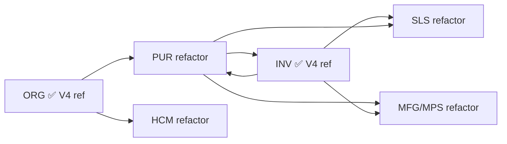

# Plan de Adopción V4 — Convergencia Final del Backend ERP

**Fecha:** 2026-06-03  
**Estado:** Auditoría de convergencia — solo documentación  
**Modo:** Sin modificación de código de aplicación  
**Documentos V4 oficiales (aprobados):**

| Documento | Rol |
|-----------|-----|
| `ERP_BACKEND_ARCHITECTURE_ALIGNMENT_AUDIT.md` | Auditoría origen |
| `ERP_BACKEND_STANDARDS_V4.md` | Estándar técnico |
| `ERP_BACKEND_RULES_V4.md` | Reglas operativas |
| `ERP_BACKEND_MASTER_PROMPT_V4.md` | Prompt de refactorización por módulo |

---

## Resumen ejecutivo

Los estándares V4 están **definidos y aprobados**, y las referencias de código (ORG + INV) **existen y funcionan**. El repositorio **no está operativamente alineado** con V4: la gobernanza activa (`.cursorrules`, prompts, reglas Cursor) sigue en v3 y contradice V4 en puntos críticos (repositories, orden de capas, checkpoints).

**Veredicto final:** el backend **NO está listo** para iniciar oficialmente la refactorización PUR hasta completar la **Fase 0 de adopción documental** (1 sprint corto, solo docs).

**Bloqueantes reales (únicos):**

1. **Gobernanza documental v3 activa** — agentes y desarrolladores siguen instruidos por reglas obsoletas que contradicen V4.

No hay bloqueantes de código en PUR, ORG o INV que impidan comenzar tras la convergencia documental. Las deudas D01–D10 son transversales; ninguna impide el inicio de PUR una vez resuelto el punto 1.

---

## 1. Archivos que deben actualizarse para adoptar V4 oficialmente

### 1.1 Prioridad P0 — Gobernanza activa (obligatorio antes de PUR)

Estos archivos son los que Cursor, agentes y desarrolladores consumen **hoy**. Deben converger a V4.

| Archivo | Estado actual | Acción requerida | Fuente V4 |
|---------|---------------|------------------|-----------|
| `.cursorrules` | v3 implícito: repositories, PROMPT_MODULO_MAESTRO_v3, sin `require_erp_session` | Reemplazar contenido por resumen operativo + enlace a `ERP_BACKEND_RULES_V4.md`, o copiar reglas R01–R81 condensadas | `ERP_BACKEND_RULES_V4.md` |
| `reglas.md` | Duplicado de `.cursorrules` (186 líneas, v3) | Sincronizar con `.cursorrules` convergido o convertir en puntero único a RULES V4 | Idem |
| `docs/prompts/PROMPT_BACKEND_MAESTRO.md` | v3 completo (383 líneas) | Reemplazar por puntero a `ERP_BACKEND_MASTER_PROMPT_V4.md` + nota de deprecación v3, **o** mover v3 a `_ANT` y copiar V4 aquí para rutas existentes | `ERP_BACKEND_MASTER_PROMPT_V4.md` |
| `docs/prompts/RULES_CURSOR_BACKEND.md` | v3, `alwaysApply: true`, repositories, PROMPT_MODULO_MAESTRO_v3 | Actualizar frontmatter y reglas; apuntar a `ERP_BACKEND_RULES_V4.md` | `ERP_BACKEND_RULES_V4.md` |

**Criterio de cierre P0:** ningún archivo de gobernanza activa menciona `schemas → repositories → services` como orden ERP ni `PROMPT_MODULO_MAESTRO_v3`.

### 1.2 Prioridad P1 — Prompts auxiliares (obligatorio antes de refactor masiva)

| Archivo | Estado actual | Acción requerida |
|---------|---------------|------------------|
| `docs/prompts/PROMPT_MODULO_MAESTRO.md` | v2: repositories, sin scope policy, sin Fase 0 V4 | Marcar **DEPRECATED**; cabecera apuntando a `ERP_BACKEND_MASTER_PROMPT_V4.md` |
| `docs/prompts/PROMPT_MAESTRO.md` | Copia v3 (293 líneas) | Marcar **DEPRECATED**; redirigir a Master Prompt V4 |
| `docs/prompts/PROMPT_BACKEND_MAESTRO_ANT.md` | Backup v3 previo | Mantener como archivo histórico; añadir nota "solo referencia histórica" |

**Futuro pendiente (fuera de alcance PUR):**

| Archivo | Acción |
|---------|--------|
| `docs/prompts/PROMPT_PLATFORM_V4.md` | Crear cuando se refactorice platform (Anexo B del Master Prompt V4) |

### 1.3 Prioridad P2 — bootstrap_v2 (referencias, no bloqueante PUR)

Bootstrap_v2 es **SQL/seeds**, no arquitectura Python. No requiere reescritura de código, pero debe **referenciar V4** para evitar confusión en onboarding.

| Archivo / área | Estado actual | Acción requerida |
|----------------|---------------|------------------|
| `app/bootstrap_v2/README_BOOTSTRAP.md` | Sin referencia V4 | Añadir sección "Estándar backend" → enlace a `ERP_BACKEND_STANDARDS_V4.md` |
| `app/bootstrap_v2/00_manifest/IMPLEMENTATION_PLAN_PHASE2.md` | Plan runtime onboarding RBAC | Nota al pie: módulos ERP siguen V4; no implica repositories |
| `app/bootstrap_v2/00_manifest/RUNTIME_MIGRATION_PLAN.md` | Plan migración runtime | Idem — referencia cruzada V4 |
| `app/bootstrap_v2/00_manifest/BOOTSTRAP_ORDER.md` | Orden SQL | Sin cambio funcional |
| `app/bootstrap_v2/02_catalog/permisos_rbac/S045__permisos_rbac_pur.sql` | Seeds PUR existentes | **No modificar** en convergencia; validar en refactor PUR |
| Evidence JSON en `00_manifest/evidence/` | Validaciones puntuales | Nuevo template opcional `{CODIGO}_V4_VALIDATION.json` referenciado en Master Prompt V4 |

**Nota:** restricción histórica "no modificar bootstrap_v2" en planes Phase 2 se refiere a **DDL/seeds en producción**, no a documentación en README/manifest.

### 1.4 Prioridad P3 — Documentación técnica relacionada (histórico, no bloqueante)

Documentos que referencian `PROMPT_MODULO_MAESTRO.md` o v3. **No requieren actualización masiva antes de PUR**; se regeneran al refactorizar cada módulo.

| Patrón | Cantidad aprox. | Acción |
|--------|-----------------|--------|
| `app/docs/modulos/AUDITORIA_*.md` | ~15 módulos | Regenerar con Master Prompt V4 al refactorizar cada módulo |
| `app/docs/modulos/*_IMPLEMENTACION.md` | ~20 módulos | Idem post-refactor |
| `app/docs/auditoria/BACKEND_EXCEPTION_*.md` | 3 archivos | Válidos; añadir nota D01 P0 tenant cerrado |
| `app/docs/arquitectura/ERP_BACKEND_*.md` | 4 archivos | **Completos — fuente de verdad** |

### 1.5 Índice documental V4 propuesto (nuevo, P1)

Crear `app/docs/arquitectura/README.md` como índice único:

```
ERP_BACKEND_STANDARDS_V4.md      ← estándar técnico
ERP_BACKEND_RULES_V4.md          ← reglas operativas
ERP_BACKEND_MASTER_PROMPT_V4.md  ← refactorización por módulo
ERP_BACKEND_ARCHITECTURE_ALIGNMENT_AUDIT.md
ERP_BACKEND_V4_ADOPTION_PLAN.md  ← este documento
```

---

## 2. Deudas técnicas transversales

Inventario completo D01–D10 del audit arquitectónico, con estado **verificado en repo** a 2026-06-03.

### 2.1 Deudas priorizadas (D01, D02, D03, D08)

| ID | Deuda | Estado verificado | Clasificación | Resolver antes de PUR |
|----|-------|-------------------|---------------|----------------------|
| **D01** | `except Exception → 500` | **Parcialmente cerrado.** Tenant P0 cerrado (`endpoints_clientes`, `endpoints_conexiones` — 0 bloques). Pendiente: auth (7 bloques), users (8), superadmin (9), rbac (16), menus (15), modulos (11). **PUR/ORG/INV: 0 bloques.** | **Recomendada** (P1 auth; P2 resto platform) | **No** — PUR no afectado |
| **D02** | Dual `AuthorizationError` | **Activo.** `app/core/exceptions.py` (CustomException 403) vs `app/core/authorization/rbac.py` (HTTPException 403). | **Recomendada** | **No** — PUR usa patrón ORG/INV con `CustomException`; unificar antes de refactor platform masiva |
| **D03** | Dual `require_super_admin` | **Activo.** LBAC decorator vs RBAC Depends; criterios difieren en `platform_admin`. | **Recomendada** | **No** — solo afecta platform/impersonation gate |
| **D08** | Unificación `cliente_id` patrón ORG | **Activo.** INV usa `current_user.cliente_id`; ORG usa `get_org_session_client_id` (impersonación-safe). PUR usa `current_user.cliente_id`. | **Recomendada** | **No como pre-requisito** — se resuelve **dentro** del refactor PUR creando `pur_deps.py` |

### 2.2 Deudas restantes D04–D10

| ID | Deuda | Clasificación | Antes de PUR |
|----|-------|---------------|--------------|
| **D04** | rbac repositories sync/async (`find_all` sin await) | **Recomendada** | No |
| **D05** | LoginUseCase no cableado | **Opcional** | No |
| **D06** | Dashboard BFF ausente | **Opcional** (platform frontend) | No |
| **D07** | ERP audit sin hooks automáticos | **Recomendada** — adoptar gradualmente en refactor PUR | No bloqueante; integrar en Fase 3 PUR |
| **D09** | Paginación 3 estilos (`skip/limit`, `page/limit`, `page/page_size`) | **Recomendada** | No — normalizar en refactor PUR |
| **D10** | Platform CRUD sin audit | **Recomendada** | No |

### 2.3 Matriz de clasificación consolidada

| Clasificación | Deudas | Acción temporal |
|---------------|--------|-----------------|
| **Bloqueante** | Ninguna deuda de código | — |
| **Bloqueante (proceso)** | Gobernanza documental v3 activa (§1.1) | Fase 0 adopción — solo docs |
| **Recomendada** | D01 (resto), D02, D03, D04, D07, D08, D09, D10 | Planificar sprints transversales paralelos o previos a platform |
| **Opcional** | D05, D06 | Backlog |

---

## 3. Estado de módulos objetivo vs V4 (sin refactorizar)

Verificación de brechas arquitectónicas **actuales** — lo que el refactor PUR/SLS/MFG/HCM debe cerrar.

| Criterio V4 | ORG | INV | PUR | SLS | MFG | HCM |
|-------------|-----|-----|-----|-----|-----|-----|
| Queries centralizadas | ✅ | ✅ | ✅ | ✅ | ✅ | ✅ |
| Services funcionales | ✅ | ✅ | ⚠ mixto | ⚠ mixto | ⚠ mixto | ⚠ mixto |
| `require_erp_session` router | ⚠ parcial | ✅ | ❌ | ❌ | ❌ | ❌ |
| `{cod}_deps.py` scope | ✅ | ❌ | ❌ | ❌ | ❌ | ❌ |
| `cliente_id` impersonación-safe | ✅ | ⚠ | ⚠ | ⚠ | ⚠ | ⚠ |
| Exception anti-patrón | ✅ | ✅ | ✅ | ✅ | ✅ | ✅ |
| Detalle embebido / deprecated | N/A | ✅ | ⚠ doble vía | ⚠ doble vía | ⚠ doble vía | ⚠ parcial |
| Paginación V4 | ❌ list completo | ❌ list completo | ⚠ page_size | ⚠ variado | ⚠ variado | ⚠ variado |
| RBAC seeds bootstrap | ✅ S040 | ✅ S041 | ✅ S045 | ✅ S044 | ✅ S047 | ✅ S055 |

**Conclusión:** PUR ya tiene **capa queries** (12 archivos en `infrastructure/database/queries/pur/`). La refactorización V4 es **convergencia de session scope, deps, deprecated detalle, paginación y ciclo de vida transaccional** — no reescritura desde cero.

---

## 4. Orden oficial de refactorización ERP

### 4.1 Secuencia aprobada

```
1. PUR   (Compras)
2. SLS   (Ventas)
3. MFG + MPS (Producción)
4. HCM   (RRHH)
```

### 4.2 Justificación por dependencias



| Orden | Módulo | Justificación de dependencias |
|-------|--------|-------------------------------|
| **1 — PUR** | Compras | **Entrada de materiales.** `pur_producto_proveedor` enlaza INV productos con proveedores. `pur_recepcion` es el puente hacia stock INV. Establecer patrón transaccional V4 (solicitud → OC → recepción) antes de ventas y producción. Seeds RBAC S045 existentes. Queries ya centralizadas — menor riesgo de arranque. |
| **2 — SLS** | Ventas | **Salida comercial.** Cotización/pedido SLS consume disponibilidad INV (stock). Patrón cabecera-detalle análogo a PUR. Beneficia del `pur_deps`/transaccional pattern ya aplicado. Depende de INV maestros (productos, precios) ya en V4 reference. |
| **3 — MFG / MPS** | Producción | **Transformación.** `mfg_lista_materiales` referencia productos INV. Órdenes de producción consumen materiales abastecidos vía PUR→INV recepciones. MPS (pronóstico/plan) secundario a MFG operativo — refactorizar juntos en un epic. |
| **4 — HCM** | RRHH | **Capital humano.** Fuerte acoplamiento a ORG (departamentos, cargos, centros costo) ya en V4. Menor acoplamiento transaccional con PUR/SLS. Planillas/asistencia son ciclos propios — pueden converger V4 sin bloquear cadena supply chain. |

### 4.3 Dependencias explícitas entre refactorizaciones

| Refactor | Requiere completado | Motivo |
|----------|---------------------|--------|
| PUR | Fase 0 adopción documental | Gobernanza V4 activa |
| PUR | ORG + INV como referencia (ya existen) | Patrones V4 demostrados |
| SLS | PUR Fase 3–4 (transaccional V4) | Reutilizar `{cod}_deps`, deprecated detalle, paginación |
| MFG/MPS | PUR recepciones V4 + INV movimientos | Flujo materiales completo |
| HCM | ORG V4 (ya existe) | Empleados ↔ estructura organizacional |

### 4.4 Alcance por módulo (recordatorio)

Cada refactor sigue `ERP_BACKEND_MASTER_PROMPT_V4.md` completo (Fases 0–4). **No iniciar código** hasta confirmación post-auditoría Fase 2.

---

## 5. Checklist de readiness V4

Evaluación **actual** del repositorio (2026-06-03).

| Área | Criterio | Estado | Notas |
|------|----------|--------|-------|
| **Arquitectura** | Estándar V4 documentado y aprobado | ✅ | 4 docs en `app/docs/arquitectura/` |
| **Arquitectura** | Referencia ORG + INV implementada | ✅ | Fase 4 operativa |
| **Arquitectura** | Gobernanza repo alineada a V4 | ❌ | `.cursorrules`, prompts en v3 |
| **Seguridad** | JWT + RBAC operativos | ✅ | — |
| **Seguridad** | LBAC platform operativo | ✅ | Dual gate en tenant |
| **Seguridad** | Dual `require_super_admin` unificado | ❌ | D03 — recomendada |
| **Multiempresa** | `company_scope` + `empresa_context` | ✅ | Core completo |
| **Multiempresa** | `require_erp_session` en módulos ERP objetivo | ❌ | Solo INV — se implementa en refactor |
| **RBAC** | Patrón `{mod}.{recurso}.{accion}` | ✅ | Universal |
| **RBAC** | Seeds bootstrap PUR/SLS/MFG/HCM | ✅ | S045, S044, S047, S055 |
| **Auditoría** | Auth audit (`AuditService`) | ✅ | Login, impersonación, cross-tenant |
| **Auditoría** | ERP business audit automático | ❌ | D07 — adoptar en refactor |
| **Exceptions** | Handler global `CustomException` | ✅ | `app/main.py` |
| **Exceptions** | Tenant P0 sin anti-patrón | ✅ | Cerrado 2026-06-02 |
| **Exceptions** | Platform/auth sin anti-patrón | ❌ | D01 P1 pendiente |
| **Exceptions** | PUR/ORG/INV sin anti-patrón | ✅ | 0 bloques `except Exception` |
| **Documentación** | STANDARDS + RULES + MASTER V4 | ✅ | Aprobados |
| **Documentación** | Índice arquitectura | ❌ | Crear README (§1.5) |
| **Prompts** | Master Prompt operativo en ruta activa | ❌ | `docs/prompts/` sigue v3 |
| **Rules** | `.cursorrules` / RULES_CURSOR convergidos | ❌ | Contradicen V4 |

**Score readiness:** 14/20 ✅ — **insuficiente para inicio oficial** por 6 ítems en gobernanza/multiempresa ERP objetivo (estos últimos se cierran en el propio refactor PUR).

**Interpretación:** El backend tiene **fundamentos técnicos listos** (ORG, INV, queries PUR, RBAC seeds, tenant exceptions P0). Falta **convergencia de gobernanza** para que el trabajo PUR sea oficial y reproducible.

---

## 6. Plan de ejecución de adopción (solo documentación)

Secuencia recomendada **sin tocar módulos ERP**:

### Sprint 0 — Convergencia documental (bloqueante)

| # | Tarea | Archivos | Esfuerzo |
|---|-------|----------|----------|
| 0.1 | Actualizar `.cursorrules` → V4 | `.cursorrules` | S |
| 0.2 | Sincronizar `reglas.md` | `reglas.md` | S |
| 0.3 | Redirigir/reemplazar Master Prompt activo | `docs/prompts/PROMPT_BACKEND_MAESTRO.md` | S |
| 0.4 | Actualizar reglas Cursor alwaysApply | `docs/prompts/RULES_CURSOR_BACKEND.md` | S |
| 0.5 | Deprecar prompts auxiliares v2/v3 | `PROMPT_MODULO_MAESTRO.md`, `PROMPT_MAESTRO.md` | S |
| 0.6 | Crear índice arquitectura | `app/docs/arquitectura/README.md` | S |

**Criterio de cierre Sprint 0:** checklist §5 — ítems "Gobernanza", "Prompts", "Rules" en ✅.

### Sprint 1 — Referencias bootstrap (recomendado, paralelo)

| # | Tarea | Archivos |
|---|-------|----------|
| 1.1 | Enlace V4 en README bootstrap | `app/bootstrap_v2/README_BOOTSTRAP.md` |
| 1.2 | Nota V4 en planes manifest | `IMPLEMENTATION_PLAN_PHASE2.md`, `RUNTIME_MIGRATION_PLAN.md` |

### Sprint 2 — Deuda transversal (recomendado, no bloqueante PUR)

| # | Deuda | Prioridad |
|---|-------|-----------|
| 2.1 | D02 — unificar `AuthorizationError` | P1 |
| 2.1 | D01 — auth presentation exceptions | P1 |
| 2.2 | D03 — unificar `require_super_admin` | P2 |
| 2.3 | D07 — definir helper `registrar_auditoria_erp` (doc + stub plan) | P2 — inicia con PUR |

---

## 7. Respuesta explícita

### ¿Está el backend listo para comenzar PUR?

## **NO**

### Bloqueantes reales (únicamente)

| # | Bloqueante | Tipo | Resolución |
|---|------------|------|------------|
| **B1** | Gobernanza documental activa en v3 (`.cursorrules`, `reglas.md`, `docs/prompts/PROMPT_BACKEND_MAESTRO.md`, `docs/prompts/RULES_CURSOR_BACKEND.md`) contradice V4 | Proceso | Completar Sprint 0 (§6) — solo documentación |

**No son bloqueantes para PUR:**

- D01 restante (auth/platform) — PUR/ORG/INV limpios
- D02 dual AuthorizationError — PUR usa patrón sano
- D03 dual require_super_admin — solo platform
- D08 client_id — se implementa como `pur_deps.py` en el refactor PUR
- Ausencia de `require_erp_session` en PUR — es el **objetivo** del refactor, no pre-requisito
- D07 ERP audit — se adopta gradualmente durante refactor PUR

### Condición de inicio PUR

Completar **Sprint 0** y verificar:

```
✅ .cursorrules apunta a ERP_BACKEND_RULES_V4.md
✅ PROMPT_BACKEND_MAESTRO.md apunta a ERP_BACKEND_MASTER_PROMPT_V4.md
✅ RULES_CURSOR_BACKEND.md convergido
✅ Prompts auxiliares marcados DEPRECATED
```

Tras B1 resuelto → **iniciar PUR Fase 0** según `ERP_BACKEND_MASTER_PROMPT_V4.md` (análisis + contraste BD, sin código).

---

## 8. Documentos relacionados

| Documento | Relación |
|-----------|----------|
| `ERP_BACKEND_STANDARDS_V4.md` | Estándar técnico de referencia |
| `ERP_BACKEND_RULES_V4.md` | Reglas para `.cursorrules` convergido |
| `ERP_BACKEND_MASTER_PROMPT_V4.md` | Flujo PUR Fase 0–4 |
| `ERP_BACKEND_ARCHITECTURE_ALIGNMENT_AUDIT.md` | Deudas D01–D10 origen |
| `app/docs/auditoria/BACKEND_EXCEPTION_REMEDIATION_STATUS.md` | D01 P0 tenant cerrado |
| `app/docs/modulos/AUDITORIA_PUR.md` | Línea base pre-refactor PUR |

---

*Plan de adopción V4 — Convergencia final — 2026-06-03. Sin modificación de código de aplicación.*
