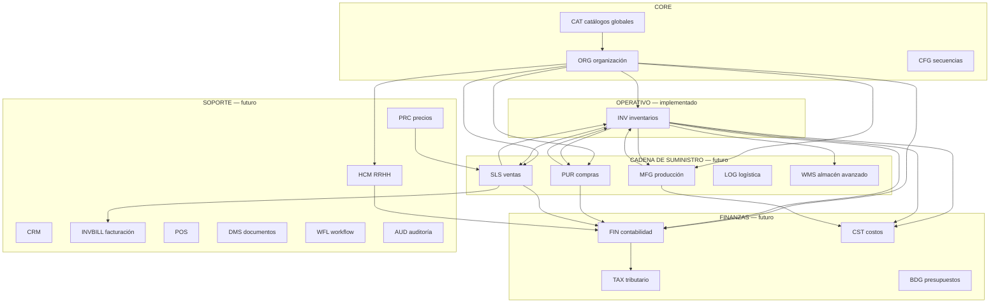
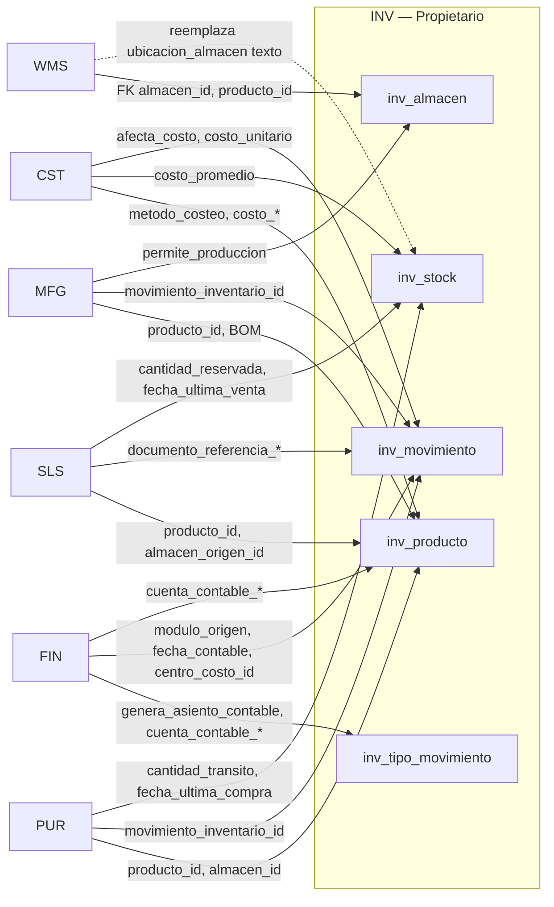

# ERP — Mapa de Dependencias y Clasificación Arquitectónica del Modelo de Datos

**Fecha:** 2026-06-12  
**Fuentes oficiales:**
- `app/bootstrap_v2/01_schema/V010__tablas_bd_erp_completo.sql` (modelo completo — **116 tablas**, ~2.962 columnas)
- `docs/bd/INV_TABLAS.sql` (extracto canónico INV — alineado con V010)

**Alcance:** Diseño ERP, modelo de datos, dependencias entre módulos, responsabilidad funcional.  
**Excluido deliberadamente:** implementación actual, contratos API, servicios, frontend.

**Propósito:** Fuente de verdad arquitectónica para decidir si campos "no usados" en INV son deuda técnica, reserva futura, derivables, auditoría u huérfanos.

---

## Convenciones de clasificación de campos

| Código | Nombre | Criterio arquitectónico |
|--------|--------|-------------------------|
| **A** | Obligatorio de negocio | Sin este dato el proceso o la entidad no tiene validez funcional |
| **B** | Auditoría | Trazabilidad histórica, usuario, timestamps de eventos |
| **C** | Derivable | Recalculable desde detalle u otras tablas; puede persistirse por rendimiento |
| **D** | Contextual | Aplica solo en escenarios, industrias o configuraciones específicas |
| **E** | Futuro confirmado | Diseñado explícitamente para integración con módulo planificado (FK, soft FK, flags) |
| **F** | Huérfano potencial | Redundante, contradictorio o sin consumidor definido en el modelo |

### Patrones transversales (aplican a ~2.100 columnas del ERP)

Estos patrones se repiten en casi todas las tablas operativas y evitan listar columnas obvias 2.962 veces:

| Patrón de columna | Clas. | Justificación |
|-------------------|-------|---------------|
| `{entidad}_id` (PK) | A | Identidad de registro |
| `cliente_id` | A | Scope tenant — obligatorio en tablas ERP |
| `empresa_id` | A | Scope multiempresa — obligatorio salvo catálogos globales |
| `codigo` / `numero_*` / correlativos | A | Identificación única de negocio |
| `nombre` / `descripcion` | A/D | Nombre obligatorio en maestros; descripción contextual |
| `estado` | A | Máquina de estados del documento o entidad |
| `es_activo` | A | Soft-delete — estándar SaaS |
| `fecha_creacion` | B | Auditoría — default BD |
| `fecha_actualizacion` | B | Auditoría — mutaciones |
| `usuario_creacion_id` | B | Auditoría — obligatoria por diseño SaaS empresarial |
| `usuario_actualizacion_id` | B | Auditoría — donde existe |
| `fecha_{evento}` (procesado, autorización, cierre…) | B | Evento de workflow |
| `*_por_usuario_id` | B | Responsable de transición |
| `*_nombre` denormalizado (responsable, supervisor, contador) | D | Snapshot legible sin JOIN a usuarios |
| `observaciones` / `motivo_*` / `glosa` | D | Texto libre contextual |
| Columnas `AS (...) PERSISTED` | C | Derivadas en BD (`diferencia`, `valor_total`, `costo_total`, etc.) |
| `total_*` / `monto_total_*` en cabeceras | C | Agregados de detalle — pueden recalcularse |
| `modulo_origen` / `documento_referencia_*` / `documento_origen_*` | E | Integración polimórfica cross-módulo |
| `movimiento_inventario_id` / `asiento_contable_id` / `movimiento_ajuste_id` | E | Puente entre módulos (soft FK) |
| `cuenta_contable_*` NVARCHAR(20) fuera de FIN | E | Integración FIN por código de cuenta, no FK |
| `centro_costo_id` | E/D | FIN/CST/HCM — FK a ORG cuando el módulo consume costos |
| `moneda_id` / `moneda_*` | A | Magnitud monetaria — FK a `cat_moneda` |

---

# 1. Mapa completo de módulos ERP

## 1.1 Módulos implementados (fase actual)

### ORG — Organización (CORE)

| Dimensión | Detalle |
|-----------|---------|
| **Propietario de datos** | `cat_*` (geografía/moneda global), `org_empresa`, `org_centro_costo`, `org_sucursal`, `org_departamento`, `org_cargo`, `org_parametro_sistema` |
| **Consumidores** | Todos los módulos ERP |
| **Dependencias de entrada** | Ninguna (módulo raíz junto con catálogos globales) |
| **Dependencias de salida** | `empresa_id`, `sucursal_id`, `centro_costo_id`, `departamento_id`, `cargo_id`, `moneda_id`, parámetros por módulo |

### INV — Inventarios

| Dimensión | Detalle |
|-----------|---------|
| **Propietario de datos** | `inv_categoria_producto`, `inv_unidad_medida`, `inv_producto`, `inv_almacen`, `inv_stock`, `inv_tipo_movimiento`, `inv_movimiento`, `inv_movimiento_detalle`, `inv_inventario_fisico`, `inv_inventario_fisico_detalle` |
| **Consumidores actuales** | INV (interno), consultas analíticas |
| **Consumidores futuros** | PUR, SLS, MFG, WMS, QMS, LOG, PRC, POS, INVBILL, CST, FIN |
| **Dependencias de entrada** | ORG (`empresa_id`, `sucursal_id`, `centro_costo_id`), `cat_moneda` |
| **Dependencias de salida** | Stock y movimientos hacia PUR/SLS/MFG; costos hacia CST; asientos hacia FIN; productos hacia PRC/TAX/INVBILL |

## 1.2 Módulos planificados — mapa resumido

| Módulo | Propietario | Dep. entrada principales | Dep. salida / consumidores |
|--------|-------------|--------------------------|----------------------------|
| **CAT** | `cat_moneda`, `cat_pais`, `cat_departamento`, `cat_provincia`, `cat_distrito` | — | ORG, FIN, INV, HCM, todos con montos |
| **WMS** | `wms_zona_almacen`, `wms_ubicacion`, `wms_stock_ubicacion`, `wms_tarea` | INV (`almacen`, `producto`, `unidad_medida`) | INV (granularidad ubicación), LOG |
| **QMS** | `qms_*` (6 tablas) | INV (`producto`, `categoria`, `almacen`), PUR/MFG (documento origen) | PUR (inspección recepción), bloqueo stock |
| **PUR** | `pur_*` (11 tablas) | INV (`producto`, `almacen`, `unidad_medida`), ORG | INV (`movimiento` entrada), FIN, QMS, CST |
| **LOG** | `log_*` (7 tablas) | INV, SLS, ORG | INV (`movimiento` traslado), INVBILL (`guia_remision`) |
| **MFG** | `mfg_*` (9 tablas) | INV (`producto`, `almacen`, `unidad_medida`), ORG | INV (consumo/producción), CST, MRP |
| **MRP** | `mrp_*` (4 tablas) | INV, MFG (BOM), SLS/MPS (demanda) | PUR (`orden_compra`), MFG (`orden_produccion`) |
| **MPS** | `mps_*` (3 tablas) | INV (`producto`), SLS/CRM (demanda) | MRP, MFG |
| **MNT** | `mnt_*` (4 tablas) | ORG, HCM (técnicos) | FIN (gastos mantenimiento) |
| **SLS** | `sls_*` (7 tablas) | INV (`producto`, `almacen`), CRM, PRC | INV (salida/reserva), LOG, INVBILL, FIN |
| **CRM** | `crm_*` (4 tablas) | ORG, SLS (conversión) | SLS, MPS (pronóstico) |
| **PRC** | `prc_*` (3 tablas) | INV (`producto`, `categoria`), SLS | SLS, POS, INVBILL |
| **INVBILL** | `invbill_*` (3 tablas) | SLS, LOG, INV (`producto`), TAX | FIN, TAX (PLE) |
| **POS** | `pos_*` (4 tablas) | INV (`producto`, `almacen`), PRC, SLS | INV (salida), INVBILL |
| **HCM** | `hcm_*` (9 tablas) | ORG (`departamento`, `cargo`, `sucursal`, `centro_costo`) | FIN (planilla), CST (MOD), MNT |
| **FIN** | `fin_*` (4 tablas) | ORG, `cat_moneda`, todos vía `modulo_origen` | TAX, BDG, reportes |
| **TAX** | `tax_libro_electronico` | FIN, INVBILL, INV (inventarios PLE) | SUNAT / cumplimiento |
| **BDG** | `bdg_*` (2 tablas) | FIN (`plan_cuentas`), ORG (`centro_costo`) | Control presupuestario FIN |
| **CST** | `cst_*` (2 tablas) | INV, MFG, HCM, ORG | INV (costo producto), FIN, decisiones |
| **PM** | `pm_proyecto` | ORG, SLS (cliente) | MFG (OP por proyecto), FIN |
| **SVC** | `svc_orden_servicio` | SLS (cliente), HCM (técnico) | FIN, INVBILL |
| **TKT** | `tkt_ticket` | ORG (usuarios) | — (soporte interno) |
| **BI** | `bi_reporte` | Todos (solo lectura) | Dashboards |
| **DMS** | `dms_documento` | Todos vía `entidad_tipo/id` polimórfico | Adjuntos cross-módulo |
| **WFL** | `wfl_flujo_trabajo` | Todos vía `modulo_aplicable` | Aprobaciones PUR/SLS/FIN/HCM |
| **AUD** | `aud_log_auditoria` | Todos | Compliance transversal |
| **CFG** | `cfg_codigo_secuencia` | ORG | Correlativos por entidad/módulo |

## 1.3 Diagrama de dependencias de alto nivel



---

# 2. Inventario de tablas ERP

**Total:** 116 tablas en V010. Estado arquitectónico:

| Estado | Significado |
|--------|-------------|
| **Core** | Prerequisito del sistema; sin esto no hay ERP |
| **Compartida** | Maestro referenciado por múltiples módulos |
| **Derivada** | No se escribe directamente; resultado de procesos |
| **Configuración** | Parametrización de comportamiento |
| **Auditoría** | Trazabilidad transversal |

## 2.1 CAT + ORG (11 tablas)

| Tabla | Módulo | Consumidores | Estado |
|-------|--------|--------------|--------|
| `cat_moneda` | CAT | Todos con montos | Compartida |
| `cat_pais` | CAT | ORG | Compartida |
| `cat_departamento` | CAT | ORG | Compartida |
| `cat_provincia` | CAT | ORG | Compartida |
| `cat_distrito` | CAT | ORG | Compartida |
| `org_empresa` | ORG | Todos | Core |
| `org_centro_costo` | ORG | FIN, CST, HCM, MFG, INV, BDG | Compartida |
| `org_sucursal` | ORG | INV, HCM, SLS, POS | Compartida |
| `org_departamento` | ORG | HCM | Compartida |
| `org_cargo` | ORG | HCM | Compartida |
| `org_parametro_sistema` | ORG | Todos | Configuración |

## 2.2 INV (10 tablas)

| Tabla | Consumidores actuales/futuros | Estado |
|-------|------------------------------|--------|
| `inv_categoria_producto` | INV, PRC, QMS, CST, FIN (cuentas) | Compartida |
| `inv_unidad_medida` | INV, PUR, SLS, MFG, WMS | Compartida |
| `inv_producto` | Todos operativos | Compartida |
| `inv_almacen` | INV, PUR, SLS, MFG, WMS, POS, LOG | Compartida |
| `inv_stock` | INV (lectura), PUR, SLS, MFG, CST, BI | **Derivada** |
| `inv_tipo_movimiento` | INV, PUR, SLS, MFG, FIN | Configuración |
| `inv_movimiento` | INV, PUR, SLS, MFG, LOG, FIN, CST | Core transaccional |
| `inv_movimiento_detalle` | INV, kardex, CST | Core transaccional |
| `inv_inventario_fisico` | INV, CST, FIN (ajustes) | Core transaccional |
| `inv_inventario_fisico_detalle` | INV | Core transaccional |

## 2.3 Módulos futuros — inventario compacto

| Módulo | Tablas | Estado predominante |
|--------|--------|---------------------|
| WMS | 4 | Extensión INV — Compartida/Derivada (`wms_stock_ubicacion`) |
| QMS | 6 | Core calidad — transaccional |
| PUR | 11 | Core compras — transaccional |
| LOG | 7 | Core logística — transaccional |
| MFG | 9 | Core producción — transaccional |
| MRP | 4 | Derivada/planificación |
| MPS | 3 | Derivada/planificación |
| MNT | 4 | Core mantenimiento |
| SLS | 7 | Core ventas — transaccional |
| CRM | 4 | Core comercial |
| PRC | 3 | Configuración precios |
| INVBILL | 3 | Core facturación |
| POS | 4 | Core POS |
| HCM | 9 | Core RRHH |
| FIN | 4 | Core contabilidad |
| TAX | 1 | Derivada/reportes |
| BDG | 2 | Configuración + seguimiento |
| CST | 2 | Derivada costos + config tipos CC |
| PM | 1 | Core proyectos |
| SVC | 1 | Core servicios |
| TKT | 1 | Core soporte |
| BI | 1 | Derivada/consulta |
| DMS | 1 | Compartida documental |
| WFL | 1 | Configuración workflow |
| AUD | 1 | Auditoría |
| CFG | 1 | Configuración |

---

# 3. Clasificación funcional de campos

## 3.1 Alcance y método

El modelo completo contiene **~2.962 columnas** en 116 tablas. Este documento provee:

1. **Patrones transversales** (sección inicial) — cubren la mayoría de columnas repetitivas.
2. **Matriz detallada ORG + CAT** — módulo implementado, base del sistema.
3. **Matriz detallada INV** — módulo auditado, fuente de la duda sobre campos "no usados".
4. **Resumen arquitectónico por módulo futuro** — clasificación dominante por tabla y campos de integración explícitos.

> Para módulos no implementados, la clasificación se infiere del diseño del script V010 (comentarios `DEPENDENCIAS`, `USADO POR`, FKs declaradas y campos polimórficos), no de código runtime.

## 3.2 CAT — Catálogos globales

| Tabla | Campo | Tipo | Clas. | Justificación |
|-------|-------|------|-------|---------------|
| `cat_moneda` | `moneda_id` | PK | A | Identidad |
| | `codigo` | NVARCHAR(3) | A | ISO 4217 — unicidad |
| | `nombre`, `simbolo`, `decimales` | diversos | D | Presentación |
| | `es_activo` | BIT | A | Soft-delete |
| `cat_pais` | `pais_id` | PK | A | Identidad |
| | `codigo_iso2`, `codigo_iso3`, `nombre` | NVARCHAR | A/D | Identificación geográfica |
| | `es_activo` | BIT | A | Soft-delete |
| `cat_departamento` | `pais_id` | FK | A | Jerarquía geográfica |
| | `codigo`, `nombre` | NVARCHAR | A | Identificación |
| `cat_provincia` | `departamento_id` | FK | A | Jerarquía |
| `cat_distrito` | `provincia_id`, `ubigeo` | FK/NVARCHAR | A | Jerarquía + SUNAT Perú |

## 3.3 ORG — Matriz completa

### `org_empresa`

| Campo | Clas. | Justificación |
|-------|-------|---------------|
| `empresa_id`, `cliente_id` | A | Identidad y scope tenant |
| `codigo_empresa`, `razon_social`, `ruc` | A | Identificación legal obligatoria |
| `nombre_comercial`, `tipo_documento_tributario` | D | Comercial/tributario |
| `actividad_economica`, `codigo_ciiu`, `rubro`, `tipo_empresa` | D | Clasificación industria |
| `direccion_fiscal`, `pais_id`…`distrito_id`, `ubigeo` | D | Dirección — obligatoria para facturación (INVBILL futuro) |
| `telefono_*`, `email_*`, `sitio_web` | D | Contacto |
| `representante_legal_*` | D | Legal — TAX/INVBILL |
| `moneda_base_id`, `maneja_multimoneda` | A/E | FIN multimoneda |
| `zona_horaria`, `idioma_sistema`, formatos | D | Configuración regional SaaS |
| `logo_*`, `favicon_url` | D | Branding |
| `es_activo` | A | Ciclo de vida |
| `fecha_constitucion`, `fecha_inicio_operaciones` | D | Legal |
| `fecha_creacion`, `fecha_actualizacion` | B | Auditoría |
| `usuario_creacion_id`, `usuario_actualizacion_id` | B | Auditoría obligatoria SaaS |

### `org_centro_costo`

| Campo | Clas. | Justificación |
|-------|-------|---------------|
| `centro_costo_id`, `cliente_id`, `empresa_id`, `codigo`, `nombre` | A | Identidad |
| `centro_costo_padre_id`, `nivel`, `ruta_jerarquica` | C/D | Jerarquía — derivable |
| `tipo_centro_costo`, `categoria` | D | Clasificación CST/BDG |
| `tiene_presupuesto`, `permite_imputacion_directa` | E | BDG/FIN |
| `responsable_usuario_id`, `responsable_nombre` | B/D | Responsable |
| `fecha_inicio_vigencia`, `fecha_fin_vigencia` | D | Vigencia |
| `es_activo`, `fecha_creacion`, `fecha_actualizacion`, `usuario_creacion_id` | A/B | Estándar |

### `org_sucursal`

| Campo | Clas. | Justificación |
|-------|-------|---------------|
| `sucursal_id`, `cliente_id`, `empresa_id`, `codigo`, `nombre` | A | Identidad |
| `tipo_sucursal` | D | Clasificación |
| Dirección completa + geo | D | Operación — LOG/INVBILL |
| `es_casa_matriz`, `es_punto_venta`, `es_almacen`, `es_planta_produccion` | E | Flags para SLS/POS/MFG/INV |
| `horario_atencion`, `zona_horaria` | D | Operación retail |
| `centro_costo_id` | E | FIN/CST |
| `responsable_*` | B/D | Responsable |
| `fecha_apertura`, `fecha_cierre` | D | Ciclo de vida sucursal |
| Auditoría estándar | A/B | — |

### `org_departamento`, `org_cargo`, `org_parametro_sistema`

Campos siguen el mismo esquema: identidad (A), jerarquía (C/D), vínculos a `centro_costo`/`sucursal` (E para HCM/FIN), rangos salariales en cargo (E HCM), parámetros tipados (Configuración para todos los módulos).

## 3.4 INV — Matriz completa (fuente: `INV_TABLAS.sql` = V010)

### `inv_categoria_producto` (16 columnas)

| Campo | Clas. | Justificación |
|-------|-------|---------------|
| `categoria_id`, `cliente_id`, `empresa_id` | A | Identidad y scope |
| `codigo`, `nombre` | A | Maestro |
| `descripcion` | D | Opcional |
| `categoria_padre_id`, `nivel`, `ruta_jerarquica` | C/D | Jerarquía — nivel/ruta derivables |
| `cuenta_contable_inventario` | **E** | FIN/CST — cuenta default |
| `cuenta_contable_costo_venta` | **E** | FIN/CST — costo ventas |
| `metodo_costeo_defecto` | **E** | CST — herencia a productos |
| `es_activo` | A | Soft-delete |
| `fecha_creacion`, `fecha_actualizacion`, `usuario_creacion_id` | B | Auditoría |

### `inv_unidad_medida` (15 columnas)

| Campo | Clas. | Justificación |
|-------|-------|---------------|
| `unidad_medida_id`, `cliente_id`, `empresa_id`, `codigo`, `nombre`, `tipo_unidad` | A | Maestro UM |
| `simbolo`, `decimales_permitidos` | D | Presentación |
| `es_unidad_base`, `factor_conversion_base` | D | Conversiones PUR/SLS/MFG |
| Auditoría + `es_activo` | A/B | Estándar |

### `inv_producto` (70 columnas) — tabla más cuestionada

| Grupo | Campos | Clas. | Justificación |
|-------|--------|-------|---------------|
| Identidad | `producto_id`, `cliente_id`, `empresa_id`, `codigo_sku`, `nombre`, `tipo_producto`, `unidad_medida_base_id`, `moneda_costo`, `moneda_venta` | A | Mínimo operativo |
| Identificación alt. | `codigo_barra`, `codigo_interno`, `codigo_fabricante` | D | Industria |
| Texto | `nombre_corto`, `descripcion*`, `marca`, `modelo`, `linea_producto` | D | Comercial |
| Clasificación | `categoria_id` | D | FK validada |
| | `subcategoria_id` | **F** | Redundante con `categoria_padre_id` en jerarquía — **único huérfano confirmado INV** |
| Multi-UM | `unidad_medida_compra_id`, `unidad_medida_venta_id`, `factor_conversion_*` | D/E | PUR/SLS conversión |
| Físico | `peso_kg`, `volumen_m3`, dimensiones, `color`, `talla` | D | LOG/WMS |
| JSON | `atributos_personalizados`, `especificaciones_tecnicas` | D | Extensibilidad industria |
| Control stock | `maneja_inventario` | A | Gate de stock |
| Trazabilidad | `maneja_lotes`, `maneja_series`, `maneja_vencimiento` | D | QMS/WMS — contextual por producto |
| Cadena frío | `dias_vida_util`, `requiere_refrigeracion`, `es_perecible` | D | Industria alimentos/farma |
| Umbrales | `stock_minimo`, `stock_maximo`, `punto_reorden` | D | Alertas — también en `inv_stock` |
| **Compras** | `es_comprable`, `tiempo_entrega_dias`, `cantidad_minima_compra`, `multiplo_compra` | **E** | PUR |
| **Ventas** | `es_vendible`, `requiere_autorizacion_venta` | **E** | SLS |
| **Producción** | `es_fabricable`, `tiene_lista_materiales` | **E** | MFG |
| **Costos** | `metodo_costeo`, `costo_estandar`, `costo_ultima_compra`, `costo_promedio` | **E** | CST — snapshot en maestro; fuente canónica futura: `cst_producto_costo` |
| **Precios** | `precio_base_venta` | **E** | PRC/SLS — coexiste con `prc_lista_precio` (diseño dual a validar) |
| **Tributario** | `afecto_igv`, `porcentaje_igv`, `codigo_sunat`, `tipo_afectacion_igv` | **E** | TAX/INVBILL |
| Assets | `imagen_*`, `ficha_tecnica_url` | D | DMS |
| **Proveedor** | `proveedor_habitual_id` | **E** | PUR — soft FK |
| Estado | `estado`, `es_activo` | A | Ciclo de vida |
| Auditoría | `fecha_*`, `usuario_*`, `observaciones` | B/D | Estándar |

### `inv_almacen` (22 columnas)

| Campo | Clas. | Justificación |
|-------|-------|---------------|
| `almacen_id`, `cliente_id`, `empresa_id`, `codigo`, `nombre`, `tipo_almacen` | A | Maestro |
| `sucursal_id` | D | ORG — ubicación |
| `direccion`, `descripcion` | D | Metadata |
| `responsable_usuario_id`, `responsable_nombre` | B/D | Responsable |
| `es_almacen_principal` | D | Configuración |
| `permite_ventas` | **E** | SLS/POS |
| `permite_compras` | **E** | PUR |
| `permite_produccion` | **E** | MFG |
| `capacidad_m3/kg/unidades` | D | WMS — planificación |
| `centro_costo_id` | **E** | FIN/CST |
| Auditoría + `es_activo` | A/B | Estándar |

### `inv_stock` (19 columnas) — **tabla derivada**

| Campo | Clas. | Justificación |
|-------|-------|---------------|
| `stock_id`, `cliente_id`, `empresa_id`, `producto_id`, `almacen_id` | A | Clave natural |
| `cantidad_actual` | A | Saldo — escrito solo vía `inv_movimiento` |
| `cantidad_reservada` | **E** | SLS/MFG reservas |
| `cantidad_disponible` | **C** | `actual − reservada` — PERSISTED |
| `cantidad_transito` | **E** | PUR órdenes en tránsito |
| `costo_promedio` | A/E | CST — valorización; actualizado por movimientos |
| `valor_total` | **C** | `actual × costo` — PERSISTED |
| `moneda_id` | A | Moneda valorización |
| `stock_minimo/maximo`, `punto_reorden` | D | Override por almacén |
| `ubicacion_almacen` | D | WMS-lite hasta `wms_ubicacion` |
| `fecha_ultimo_movimiento` | B | Trazabilidad INV |
| `fecha_ultima_compra` | **E** | PUR |
| `fecha_ultima_venta` | **E** | SLS |
| `fecha_actualizacion` | B | Auditoría |

### `inv_tipo_movimiento` (18 columnas)

| Campo | Clas. | Justificación |
|-------|-------|---------------|
| `tipo_movimiento_id`, `cliente_id`, `empresa_id`, `codigo`, `nombre`, `clase_movimiento` | A | Configuración — `clase_movimiento` dirige lógica stock |
| `afecta_costo` | A/E | CST — gate de recosteo |
| `requiere_autorizacion` | D | WFL |
| `genera_asiento_contable` | **E** | FIN |
| `cuenta_contable_debito/credito` | **E** | FIN por código |
| `requiere_documento_referencia`, `tipo_documento_referencia` | **E** | PUR/SLS/MFG |
| `es_tipo_sistema` | D | Seed/bootstrap |
| Auditoría + `es_activo` | A/B | Estándar |

### `inv_movimiento` + `inv_movimiento_detalle`

| Campo (cabecera) | Clas. | Justificación |
|------------------|-------|---------------|
| Identidad + `numero_movimiento`, `tipo_movimiento_id` | A | Documento transaccional |
| `fecha_movimiento`, `fecha_contable` | A/E | Operación / FIN |
| `almacen_origen_id`, `almacen_destino_id` | A | Según `clase_movimiento` |
| `modulo_origen` | **E** | PUR/SLS/MFG/INV |
| `documento_referencia_tipo/id/numero` | **E** | Trazabilidad polimórfica |
| `tercero_tipo/id/nombre` | E/D | PUR/SLS/HCM |
| `total_items`, `total_cantidad`, `total_costo` | C | Agregados de detalle |
| `moneda_id` | A | FK moneda |
| `estado`, `requiere_autorizacion` | A | Workflow |
| `autorizado_por_usuario_id`, `fecha_autorizacion` | B | WFL |
| `centro_costo_id` | **E** | FIN/CST |
| `fecha_procesado`, `usuario_procesado_id` | B | Workflow procesar |
| Auditoría estándar | B | — |

| Campo (detalle) | Clas. | Justificación |
|-----------------|-------|---------------|
| `producto_id`, `cantidad`, `unidad_medida_id`, `cantidad_base` | A | Línea movimiento |
| `costo_unitario`, `costo_total` (C) | A/C | Valorización CST |
| `lote`, `fecha_vencimiento`, `numero_serie` | D | QMS/trazabilidad |
| `ubicacion_almacen` | D | WMS-lite |

### `inv_inventario_fisico` + detalle

| Campo (cabecera) | Clas. | Justificación |
|------------------|-------|---------------|
| `numero_inventario`, `fecha_inventario`, `almacen_id`, `tipo_inventario` | A | Conteo |
| `categoria_id`, `ubicacion_almacen` | D | Alcance selectivo |
| `estado` | A | Workflow en_proceso→finalizado→ajustado |
| `supervisor_usuario_id/nombre` | B/D | Responsable |
| `total_productos_contados`, `total_diferencias` | C | Agregados |
| `valor_diferencias` | C | Σ valor_diferencia detalle |
| `movimiento_ajuste_id` | E | Puente a `inv_movimiento` |
| `fecha_finalizacion`, `fecha_ajuste` | B | Workflow |

| Campo (detalle) | Clas. | Justificación |
|-----------------|-------|---------------|
| `cantidad_sistema` | A | Snapshot stock al conteo — **derivable de `inv_stock`** |
| `cantidad_contada` | A | Conteo físico |
| `diferencia`, `valor_diferencia` | C | PERSISTED |
| `costo_unitario` | A | CST para ajuste |
| `estado_conteo`, `contador_*`, `fecha_conteo` | B/D | Control conteo |
| `motivo_diferencia` | D | Justificación |

## 3.5 Resumen por módulo futuro (campos de integración clave)

| Módulo | Tablas | Campos E más relevantes | Clasificación dominante |
|--------|--------|-------------------------|-------------------------|
| PUR | 11 | `producto_id`, `almacen_destino_id`, `movimiento_inventario_id` | A transaccional + E→INV |
| SLS | 7 | `producto_id`, `almacen_origen_id` | A + E→INV reservas |
| MFG | 9 | `producto_id`, `almacen_*`, `movimiento_inventario_id`, BOM | A + E→INV |
| FIN | 4 | `modulo_origen`, `documento_origen_*`, `cuenta_id`, `centro_costo_id` | A + E←todos |
| CST | 2 | `producto_id`, `orden_produccion_id`, costos desglosados | C derivada + E←MFG |
| WMS | 4 | FK directas a `inv_almacen`, `inv_producto` | Extensión INV |
| HCM | 9 | `departamento_id`, `cargo_id`, `asiento_contable_id` | A + E→FIN |
| INVBILL | 3 | `producto_id`, `pedido_id`, `guia_remision_id` | E←SLS/LOG/INV |
| PRC | 3 | `producto_id`, `categoria_id` | Configuración precios |
| TAX | 1 | `periodo_id`, consolidación FIN/INVBILL | Derivada reportes |
| DMS/WFL/AUD | 3 | Polimórficos `entidad_*`, `modulo_*` | Transversal |

---

# 4. Mapa de dependencias cruzadas

## 4.1 INV como hub central



## 4.2 Tabla de integraciones INV → otros módulos

| Origen INV | Campo(s) | Módulo destino | Contrato de integración diseñado |
|------------|----------|----------------|----------------------------------|
| `inv_producto` | `proveedor_habitual_id` | PUR | Preferencia proveedor en OC |
| | `es_comprable`, `tiempo_entrega_dias`, `cantidad_minima_compra`, `multiplo_compra` | PUR | Reglas de reorden |
| | `es_vendible`, `requiere_autorizacion_venta` | SLS | Gate de venta |
| | `es_fabricable`, `tiene_lista_materiales` | MFG | BOM / OP |
| | `metodo_costeo`, `costo_*` | CST | Valorización |
| | `precio_base_venta` | PRC/SLS | Precio referencia |
| | `codigo_sunat`, `tipo_afectacion_igv` | TAX/INVBILL | Facturación electrónica |
| `inv_almacen` | `permite_compras/ventas/produccion` | PUR/SLS/MFG | Routing de stock |
| | `centro_costo_id` | FIN/CST | Imputación |
| `inv_stock` | `cantidad_reservada` | SLS/MFG | Disponibilidad real |
| | `cantidad_transito` | PUR | Pipeline compras |
| | `fecha_ultima_compra/venta` | PUR/SLS | Analytics |
| `inv_tipo_movimiento` | `genera_asiento_contable`, `cuenta_contable_*` | FIN | Puente contable automático |
| | `requiere_documento_referencia` | PUR/SLS/MFG | Validación origen |
| `inv_movimiento` | `modulo_origen`, `documento_referencia_*` | PUR/SLS/MFG/INV | Trazabilidad |
| | `tercero_*` | PUR/SLS/HCM | Contraparte |
| | `fecha_contable`, `centro_costo_id` | FIN | Contabilización |
| `inv_categoria_producto` | `cuenta_contable_*`, `metodo_costeo_defecto` | FIN/CST | Defaults contables |

## 4.3 Integraciones otros módulos → INV (FK declaradas en V010)

| Módulo | Tabla origen | Campo → INV | Propósito |
|--------|--------------|-------------|-----------|
| PUR | `pur_*_detalle` | `producto_id` | Ítems de compra |
| PUR | `pur_orden_compra`, `pur_recepcion` | `almacen_id/destino_id` | Destino stock |
| PUR | `pur_recepcion` | `movimiento_inventario_id` | Entrada automática |
| SLS | `sls_pedido_detalle` | `producto_id`, `almacen_origen_id` | Despacho |
| MFG | `mfg_lista_materiales*` | `producto_id` | BOM |
| MFG | `mfg_consumo_materiales` | `producto_id`, `almacen_origen_id`, `movimiento_inventario_id` | Consumo |
| WMS | `wms_*` | `almacen_id`, `producto_id` | Granularidad |
| PRC | `prc_lista_precio_detalle` | `producto_id` | Precios |
| INVBILL/POS | detalle | `producto_id` | Facturación/venta |
| CST | `cst_producto_costo` | `producto_id` | Costeo analítico |

---

# 5. Análisis de campos aparentemente no utilizados (perspectiva INV)

> Reencuadre arquitectónico de hallazgos de `INV_AUDITORIA_PERSISTENCIA.md` **sin considerar implementación**.

| Campo INV | Parece no usado porque | Uso actual (diseño) | Uso futuro esperado | Módulo consumidor | ¿Mantener? | ¿Eliminar? |
|-----------|------------------------|---------------------|---------------------|-------------------|------------|------------|
| `proveedor_habitual_id` | Sin FK PUR aún | Reserva soft FK | Default proveedor en OC | PUR | **Sí** | No |
| `cuenta_contable_inventario/costo_venta` | FIN no existe | Default por categoría | Asientos automáticos | FIN/CST | **Sí** | No |
| `metodo_costeo_defecto` / `metodo_costeo` | CST no existe | Herencia costeo | Motor de costeo | CST | **Sí** | No |
| `costo_estandar/ultima_compra/promedio` | CST no existe | Snapshot en maestro | Sincronizado desde CST/movimientos | CST | **Sí** | No |
| `precio_base_venta` | PRC no existe | Precio referencia rápido | Coexiste con listas PRC | PRC/SLS | **Sí** — validar dualidad | Revisar |
| `codigo_sunat`, `tipo_afectacion_igv` | TAX/INVBILL no existen | Clasificación tributaria | Facturación electrónica | TAX/INVBILL | **Sí** | No |
| `es_comprable`, `tiempo_entrega_dias`, etc. | PUR no existe | Flags compra | Reglas MRP/PUR | PUR | **Sí** | No |
| `es_vendible`, `requiere_autorizacion_venta` | SLS no existe | Flags venta | Gate comercial | SLS | **Sí** | No |
| `es_fabricable`, `tiene_lista_materiales` | MFG no existe | Flags producción | BOM/OP | MFG | **Sí** | No |
| `cantidad_reservada` | SLS no existe | Semántica reserva | Pedidos pendientes | SLS/MFG | **Sí** | No |
| `cantidad_transito` | PUR no existe | Semántica tránsito | OC en camino | PUR | **Sí** | No |
| `fecha_ultima_compra/venta` | PUR/SLS no existen | Analytics stock | KPIs abastecimiento | PUR/SLS/BI | **Sí** | No |
| `genera_asiento_contable`, `cuenta_contable_*` | FIN no existe | Config tipo movimiento | Puente contable | FIN | **Sí** | No |
| `modulo_origen`, `documento_referencia_*` | Solo INV manual hoy | Contrato polimórfico | Trazabilidad cross-módulo | PUR/SLS/MFG | **Sí** | No |
| `tercero_*` | Sin PUR/SLS | Contraparte movimiento | Proveedor/cliente | PUR/SLS | **Sí** | No |
| `centro_costo_id` (movimiento/almacén) | FIN/CST no existen | Imputación diseñada | Costos y asientos | FIN/CST | **Sí** | No |
| `maneja_lotes/series/vencimiento` | Sin enforcement | Flags por producto | Trazabilidad QMS/WMS | QMS/WMS | **Sí** | No |
| `ubicacion_almacen` (stock/mov/detalle) | WMS no existe | WMS-lite texto | Reemplazable por `wms_ubicacion` | WMS | **Sí** — transitorio | No hasta WMS |
| `usuario_creacion_id` / `usuario_actualizacion_id` | No se llena hoy | **Auditoría obligatoria SaaS** | Compliance | AUD/todos | **Sí** | **No** — es B, no E |
| `subcategoria_id` | Duplica jerarquía | Segundo FK categoría | Ninguno claro — `categoria_padre_id` basta | — | **Revisar** | **Candidato F** |
| `valor_diferencias` (IF cabecera) | Agregado | Derivado de detalle | Cierre conteo | INV/CST | **Sí** (C) | No |
| `cantidad_disponible`, `valor_total`, `costo_total`, `diferencia` | No en ORM | **C** — PERSISTED BD | Rendimiento consultas | INV/BI | **Sí** | No |

### Veredicto sobre la auditoría INV previa

| Categoría en auditoría INV | Reclasificación arquitectónica |
|----------------------------|-------------------------------|
| "Nunca usados" (~35 campos INV) | **~34 son E (futuro confirmado) o B (auditoría)** — **no son deuda de modelo** |
| "Parcialmente usados" (~15 campos) | **C (derivables) o D (contextuales)** — diseño correcto, pendiente de módulo consumidor |
| "Sin implementación" | **Deuda de implementación**, no de modelo de datos |
| Único huérfano real detectado | `inv_producto.subcategoria_id` (**F**) |

---

# 6. Evaluación arquitectónica

## 6.1 Por dimensión

| Dimensión | Evaluación | Razón |
|-----------|------------|-------|
| Multi-tenant | **Correctamente diseñado** | `cliente_id` universal; BD dedicada por tenant |
| Multi-empresa | **Correctamente diseñado** | `empresa_id` + unicidades compuestas `(cliente_id, empresa_id, código)` |
| Modularidad | **Correctamente diseñado** | Prefijos por módulo, secciones documentadas, dependencias explícitas |
| Integración cross-módulo | **Correctamente diseñado** | Patrón `modulo_origen` + `documento_referencia_*` + soft FKs |
| Separación maestro/transaccional/derivado | **Correctamente diseñado** | `inv_stock` derivada; movimientos transaccionales |
| Extensibilidad industria | **Sobre diseñado** (aceptable) | JSON, flags, campos físicos en `inv_producto` |
| Contabilidad | **Diseño híbrido a revisar** | Cuentas NVARCHAR vs FK `fin_plan_cuentas` — acoplamiento débil intencional |
| Auditoría por registro | **Sub diseñado en consistencia** | Campos B existen pero sin estándar de obligatoriedad en comentarios V010 |
| WMS vs INV ubicación | **Inconsistente leve** | `ubicacion_almacen` texto coexistirá con WMS — transición documentada |
| Precios duales | **Inconsistente leve** | `precio_base_venta` en producto + `prc_lista_precio` — requiere regla de precedencia |
| Jerarquía categorías | **Inconsistente leve** | `subcategoria_id` vs `categoria_padre_id` — redundancia |

## 6.2 Veredicto global

| Aspecto | Veredicto |
|---------|-----------|
| **Modelo ERP global** | **Correctamente diseñado** para SaaS multi-tenant multiempresa con roadmap modular |
| **Módulo INV en el modelo** | **Sobre diseñado de forma intencional** — campos "vacíos" son reserva E, no error |
| **Riesgo principal** | Confundir **deuda de implementación** con **sobre diseño del modelo** |

---

# 7. Deuda técnica real — separación estricta

## 7.1 Deuda de modelo de datos

| ID | Ítem | Severidad | Naturaleza |
|----|------|-----------|------------|
| DM-01 | `inv_producto.subcategoria_id` redundante con jerarquía `categoria_padre_id` | Media | Posible F — validar y deprecar en modelo |
| DM-02 | Dualidad `precio_base_venta` (INV) vs `prc_lista_precio` (PRC) sin regla de precedencia documentada | Media | Inconsistencia de diseño |
| DM-03 | `cuenta_contable_*` NVARCHAR vs FK `fin_plan_cuentas` — integridad referencial débil | Baja | Decisión arquitectónica — documentar contrato |
| DM-04 | Soft FKs sin constraint (`proveedor_habitual_id`, `movimiento_inventario_id`, etc.) | Baja | Patrón polimórfico — requiere capa aplicación |
| DM-05 | `ubicacion_almacen` texto en INV coexistiendo con WMS | Baja | Migración planificada |

**Campos INV "no usados" de la auditoría funcional: NO son deuda de modelo** salvo DM-01.

## 7.2 Deuda de implementación

| ID | Ítem | Relación con modelo |
|----|------|---------------------|
| DI-01 | Campos E (PUR/SLS/MFG/FIN/CST) no poblados porque módulos no existen | Esperado en fase actual |
| DI-02 | `usuario_creacion_id` no asignado desde sesión | Modelo define B — implementación incompleta |
| DI-03 | `inv_stock.costo_promedio` no actualizado al procesar movimiento | Modelo define flujo CST — implementación incompleta |
| DI-04 | `cantidad_sistema` manual en inventario físico vs snapshot de stock | Modelo permite C — implementación simplificada |
| DI-05 | Escritura directa de `inv_stock` vía API | Viola regla derivada del modelo |

## 7.3 Deuda de contratos API

| ID | Ítem | Relación con modelo |
|----|------|---------------------|
| DC-01 | Schemas exponen campos E como editables sin módulo consumidor | Contrato adelantado al roadmap |
| DC-02 | Endpoints standalone de detalle (movimiento, IF) vs cabecera-detalle embebido | Contrato vs regla V4 transaccional |
| DC-03 | Stock POST/PUT deprecated pero presente | Contrato contradice tabla derivada |
| DC-04 | Campos B no expuestos/propagados en responses de auditoría | Contrato incompleto para compliance |

---

# 8. Recomendaciones (sin código)

## 8.1 Próximas auditorías (orden sugerido)

| Prioridad | Auditoría | Objetivo |
|-----------|-----------|----------|
| 1 | **ORG** — contratos y persistencia | Validar base multiempresa antes de expandir |
| 2 | **CFG** — `cfg_codigo_secuencia` | Correlativos (`numero_movimiento`, `numero_inventario`) |
| 3 | **PUR** — cuando se implemente | Validar cadena `pur_recepcion` → `inv_movimiento` → `inv_stock` |
| 4 | **CST** — antes de corregir costos INV | Definir fuente canónica: `inv_producto.costo_*` vs `cst_producto_costo` |
| 5 | **FIN** — antes de asientos automáticos | Mapear `inv_tipo_movimiento.genera_asiento_contable` → `fin_asiento_contable` |
| 6 | **PRC vs INV precios** | Resolver precedencia `precio_base_venta` vs listas |
| 7 | **WMS** — cuando se active | Plan migración `ubicacion_almacen` → `wms_ubicacion` |

## 8.2 Módulos que requieren revisión de diseño (no implementación)

| Módulo | Tema a validar |
|--------|----------------|
| INV | Eliminar o deprecar `subcategoria_id` (DM-01) |
| INV + PRC | Regla de precedencia de precios (DM-02) |
| INV + FIN | Contrato cuenta NVARCHAR vs FK (DM-03) |
| INV + WMS | Estrategia coexistencia ubicaciones (DM-05) |
| Transversal | Estándar obligatorio de campos B en todos los módulos |

## 8.3 Campos que requieren validación futura

| Campo | Pregunta de validación | Cuándo |
|-------|------------------------|--------|
| `inv_producto.subcategoria_id` | ¿Eliminar del modelo? | Antes de seed masivo productos |
| `inv_producto.precio_base_venta` | ¿Readonly derivado de PRC? | Al implementar PRC |
| `inv_producto.costo_promedio` | ¿Espejo de CST o canónico? | Al implementar CST |
| `inv_stock` | ¿Confirmar solo lectura externa? | Política API definitiva |
| `inv_movimiento.documento_referencia_*` | ¿Catálogo cerrado de tipos? | Al implementar PUR/SLS |
| `cuenta_contable_*` en INV | ¿Validar contra `fin_plan_cuentas`? | Al implementar FIN |

## 8.4 Decisión guía para el equipo

Antes de eliminar o ignorar un campo INV catalogado como "no usado":

```
¿Existe módulo destino en V010?
  ├─ SÍ → Clasificación E → MANTENER → Implementar con el módulo
  ├─ Es AS PERSISTED → Clasificación C → MANTENER → No escribir desde app
  ├─ Es usuario/fecha → Clasificación B → MANTENER → Completar en implementación
  ├─ Tiene consumidor FK en otra tabla V010 → E → MANTENER
  └─ Redundante sin consumidor → F → REVISAR para deprecación de modelo
```

---

## Anexos

### A. Estadísticas del modelo V010

| Métrica | Valor |
|---------|-------|
| Secciones / módulos | 27 + CFG |
| Tablas | 116 |
| Columnas (aprox.) | 2.962 |
| Tablas INV | 10 |
| Columnas INV | ~289 |
| Campos INV clasificación E (integración futura) | ~41 |
| Campos INV clasificación F (huérfano) | 1 (`subcategoria_id`) |

### B. Documentos relacionados

| Documento | Relación |
|-----------|----------|
| `docs/bd/INV_TABLAS.sql` | Extracto canónico INV |
| `app/docs/auditoria/INV_AUDITORIA_PERSISTENCIA.md` | Auditoría funcional implementación INV |
| `app/docs/arquitectura/ERP_BACKEND_RULES_V4.md` | Reglas operativas backend |

### C. Campos computados PERSISTED (clasificación C — no escribir desde aplicación)

| Tabla | Columna | Fórmula diseñada |
|-------|---------|------------------|
| `inv_stock` | `cantidad_disponible` | `cantidad_actual − cantidad_reservada` |
| `inv_stock` | `valor_total` | `cantidad_actual × costo_promedio` |
| `inv_movimiento_detalle` | `costo_total` | `cantidad × costo_unitario` |
| `inv_inventario_fisico_detalle` | `diferencia` | `cantidad_contada − cantidad_sistema` |
| `inv_inventario_fisico_detalle` | `valor_diferencia` | `diferencia × costo_unitario` |
| `fin_periodo_contable` | `nombre_periodo` | `año-mes` |
| `fin_asiento_contable` | `diferencia`, `esta_cuadrado` | Balance debe/haber |
| `bdg_presupuesto` | `porcentaje_ejecucion` | Ejecutado/presupuestado |
| `bdg_presupuesto_detalle` | `monto_disponible` | Presupuestado − ejecutado |
| `cst_producto_costo` | `costo_total`, `costo_unitario` | Suma componentes / cantidad |
| `tkt_ticket` | `tiempo_resolucion_horas` | Resolución − creación |

---

*Documento de arquitectura — fuente de verdad para decisiones de modelo antes de auditorías de contratos, servicios o frontend. No incluye propuestas de código ni cambios de esquema.*
