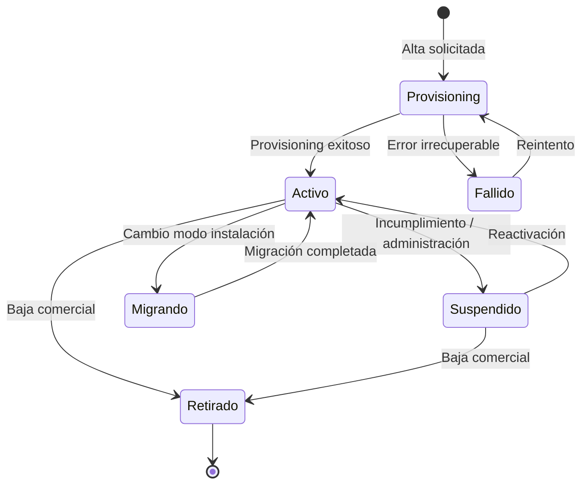
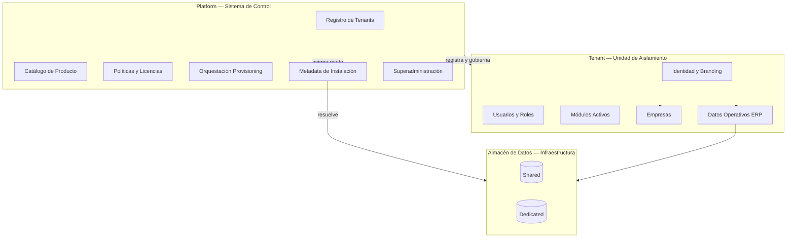
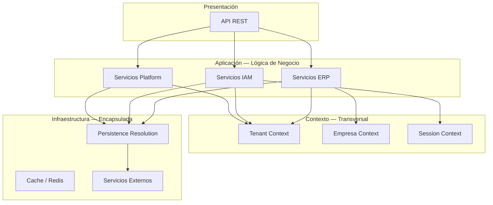

# 01 — Modelo Conceptual de la Plataforma Híbrida

**Etapa:** 1 — Diseño conceptual  
**Fecha:** 2026-06-25  
**Estado:** Borrador para revisión  
**Prerequisito:** Auditoría AS-IS (`app/docs/arquitectura/01–06_*.md`)  
**Restricción:** Sin implementación, sin tablas, sin SQL

---

## 1. Propósito del documento

Definir el **modelo conceptual oficial** de una plataforma SaaS ERP que opera con **un único código fuente** y soporta simultáneamente distintos **modos de instalación de datos** (Shared Database, Dedicated Database, y extensiones futuras).

Este documento describe **qué es** la plataforma, **qué entidades** la componen y **cómo se relacionan**. No prescribe cómo implementarlo.

---

## 2. Visión

CAXIS ERP es una plataforma SaaS empresarial multi-tenant y multiempresa. Un mismo producto sirve a clientes con distintos requisitos de aislamiento, residencia de datos y modelo operativo, sin bifurcar el código de negocio.

La variación entre modos de instalación es responsabilidad exclusiva de la **capa de infraestructura de persistencia**. La lógica de negocio opera sobre abstracciones de **contexto de tenant** y **contexto operativo ERP**, independientes del modo de almacenamiento.

---

## 3. Principios rectores (normativos)

| # | Principio | Implicación conceptual |
|---|-----------|------------------------|
| P1 | Preservar lo que funciona | Shared Database sigue siendo un modo válido y de referencia; no se diseña reemplazándolo |
| P2 | Evolución mínima disruptiva | Los dominios actuales (Platform, IAM, ERP) se refinan, no se reemplazan |
| P3 | Lógica de negocio agnóstica al modo | Servicios ERP no conocen Shared vs Dedicated |
| P4 | Diferencia solo en infraestructura | Resolución de persistencia encapsulada; invisible para reglas de negocio |
| P5 | Sin bifurcación `if shared / if dedicated` en negocio | La decisión de modo es metadata de Platform, consumida por infraestructura |
| P6 | Platform desacoplada del ERP | Platform gobierna el producto; ERP opera dentro del contexto que Platform establece |
| P7 | Extensibilidad de modos | Shared, Dedicated, On-Premise y Cloud privada son variantes del mismo contrato conceptual |

---

## 4. Entidades fundamentales

### 4.1 Platform (Plataforma)

**Definición:** El dominio que gobierna el producto SaaS como servicio. Es el **sistema de control** que existe por encima de cualquier tenant individual.

**Responsabilidades conceptuales:**

- Registro y ciclo de vida de tenants
- Definición de modos de instalación y políticas de despliegue
- Catálogo global del producto (módulos, capacidades, plantillas)
- Operaciones de superadministración y gobernanza cross-tenant
- Orquestación de provisioning (sin ejecutar lógica ERP)
- Licenciamiento, facturación y métricas de plataforma (dominios futuros o parciales hoy)
- Auditoría de acciones de plataforma

**Lo que Platform administra (conceptualmente):**

- Identidad del tenant en el ecosistema SaaS
- Contrato de suscripción y estado comercial del tenant
- Metadata de instalación (modo, región, políticas)
- Catálogos globales de producto
- Usuarios y roles de operación de plataforma (superadmin)
- Registro de conexiones / endpoints de persistencia por tenant (como metadata, no como datos operativos)

**Lo que nunca debe salir de Platform:**

- Registro canónico del tenant (quién es, si está activo, su modo de instalación)
- Políticas globales de producto y licenciamiento
- Trazabilidad de operaciones de superadmin
- Metadata de resolución de persistencia (qué almacén usa cada tenant)
- Catálogo maestro de módulos y permisos de producto

**Lo que nunca debe pertenecer a Platform:**

- Transacciones operativas ERP (movimientos de inventario, asientos contables, pedidos)
- Datos de negocio del día a día del tenant (stock, saldos, documentos operativos)
- Reglas de workflow transaccional de módulos ERP
- Estado operativo de empresas dentro del tenant

---

### 4.2 Tenant

**Definición:** Unidad de **aislamiento comercial, contractual y de identidad** en la plataforma. Representa a un cliente suscriptor del SaaS.

En el modelo actual, el Tenant se materializa como **Cliente** en el dominio existente. Este documento usa **Tenant** como término conceptual canónico.

**Qué representa exactamente:**

| Dimensión | Tenant es… |
|-----------|------------|
| Comercial | Titular de suscripción y contrato |
| Identidad | Unidad de login, subdominio, branding |
| Aislamiento | Frontera de datos y permisos respecto a otros tenants |
| Administración | Ámbito del tenant admin |
| Despliegue | Unidad a la que se asigna un modo de instalación |

**Qué NO representa:**

- No es una empresa operativa (puede contener varias)
- No es un módulo ERP
- No es una base de datos física (es una entidad lógica que *referencia* un almacén)

**Ciclo de vida conceptual:**



**Estados:**

| Estado | Significado |
|--------|-------------|
| Provisioning | Tenant registrado; recursos en creación |
| Activo | Operativo; usuarios pueden acceder según contrato |
| Suspendido | Acceso restringido; datos preservados |
| Migrando | Cambio de modo de instalación en curso |
| Retirado | Baja; retención según política; sin operación |
| Fallido | Provisioning incompleto; requiere intervención |

**Recursos que posee (conceptualmente):**

- Identidad (subdominio, branding, configuración de autenticación)
- Usuarios y roles del tenant
- Módulos activados según plan
- Uno o más modos de instalación de datos asignados
- Empresas operativas (entidades hijas)
- Políticas de sesión y seguridad del tenant
- Datos operativos ERP (en el almacén que le corresponda)

**Recursos que NO posee:**

- Catálogo global de módulos (lo consume de Platform)
- Capacidad de modificar el producto global
- Visibilidad de datos de otros tenants
- Control sobre infraestructura de Platform

---

### 4.3 Empresa

**Definición:** Unidad de **contexto operativo ERP** dentro de un Tenant. Representa una entidad legal u operativa que ejecuta procesos de negocio (inventario, compras, ventas, contabilidad, etc.).

**Papel dentro del Tenant:**

| Aspecto | Relación |
|---------|----------|
| Cardinalidad | Un Tenant tiene 1..N Empresas |
| Scope ERP | La mayoría de operaciones ERP requieren Empresa activa |
| Aislamiento | Datos de Empresa A no son visibles en contexto de Empresa B (mismo Tenant) |
| Administración | Tenant admin gestiona empresas; usuarios operan en una empresa activa por sesión |

**Relación con Dedicated Database:**

- La **Empresa no determina** el modo de instalación. El modo es propiedad del **Tenant**.
- En Dedicated Database, **todas las empresas del mismo Tenant** comparten el mismo almacén dedicado.
- La Empresa es un eje de **scope operativo**, no de **scope de persistencia**.
- Cambiar de empresa en sesión (multiempresa) no implica cambio de almacén; solo cambio de contexto operativo.

**Distinción crítica (heredada del AS-IS, refinada conceptualmente):**

```
Identidad autenticada  ≠  Contexto operativo ERP
Tenant de datos        ≠  Empresa activa en sesión
```

---

### 4.4 Modo de instalación: Shared Database

**Definición:** Modo en el que los datos operativos de múltiples tenants coexisten en un **almacén compartido**, con aislamiento lógico garantizado por la plataforma.

**Propósito:**

- Maximizar eficiencia operativa y económica
- Simplificar despliegue y mantenimiento para tenants estándar
- Servir como modo por defecto y de referencia del producto

**Ventajas:**

| Ventaja | Descripción |
|---------|-------------|
| Costo | Menor costo por tenant |
| Operaciones | Un solo almacén que mantener, respaldar y actualizar |
| Onboarding | Provisioning más rápido (sin crear almacén físico) |
| Consistencia | Schema y migraciones centralizadas |
| Madurez | Modo actual probado en el producto |

**Limitaciones:**

| Limitación | Descripción |
|------------|-------------|
| Aislamiento | Lógico, no físico; no apto para todos los requisitos regulatorios |
| Noisy neighbor | Riesgo de contención de recursos entre tenants |
| Residencia | Todos los tenants comparten ubicación del almacén |
| Personalización infra | Limitada a nivel de datos, no de almacén |
| Migración | Salida a Dedicated requiere proceso de migración |

**Responsabilidades del modo:**

- Garantizar aislamiento lógico estricto entre tenants
- Aplicar políticas de filtrado de datos de forma transparente a la lógica de negocio
- Permitir operación multiempresa dentro del tenant
- Soportar todos los módulos ERP sin excepción

---

### 4.5 Modo de instalación: Dedicated Database

**Definición:** Modo en el que los datos operativos de un Tenant residen en un **almacén exclusivo**, físicamente separado del almacén compartido y de otros tenants dedicados.

**Propósito:**

- Satisfacer requisitos de aislamiento físico, compliance y residencia de datos
- Ofrecer tier premium con mayor control y previsibilidad de rendimiento
- Habilitar despliegues enterprise y regulados

**Ventajas:**

| Ventaja | Descripción |
|---------|-------------|
| Aislamiento | Físico; sin coexistencia de datos con otros tenants |
| Compliance | Facilita auditorías, certificaciones y políticas de retención propias |
| Rendimiento | Recursos dedicados; sin contención cross-tenant |
| Residencia | Posibilidad de ubicar almacén en región específica |
| Escalabilidad | Escalar almacén por tenant sin afectar a otros |

**Limitaciones:**

| Limitación | Descripción |
|------------|-------------|
| Costo | Mayor costo operativo por tenant |
| Provisioning | Más complejo; requiere orquestación |
| Migraciones | Schema debe aplicarse por almacén |
| Operaciones | Mayor superficie de monitoreo y mantenimiento |
| Consistencia | Riesgo de drift entre almacenes si no se gobierna |

**Responsabilidades del modo:**

- Proporcionar almacén exclusivo para datos operativos del Tenant
- Mantener equivalencia funcional con Shared (mismas capacidades ERP)
- Registrar metadata de conexión en Platform (sin exponer credenciales a lógica de negocio)
- Soportar ciclo de vida: creación, migración, retiro

---

### 4.6 Extensibilidad futura: otros modos

El modelo conceptual contempla modos adicionales sin modificar lógica de negocio:

| Modo | Descripción conceptual |
|------|------------------------|
| On-Premise | Almacén operado por el cliente; Platform mantiene control de licencia y metadata |
| Cloud privada | Almacén en VPC del cliente; Platform orquesta conectividad |
| Híbrido | Combinaciones futuras (ej. ERP dedicated + analytics shared) — fuera de alcance inicial |

Todos los modos implementan el mismo **contrato de persistencia tenant-aware** visto desde la lógica de negocio.

---

## 5. Relación Platform ↔ Tenant



**Frontera conceptual:**

| Dirección | Permitido | Prohibido |
|-----------|-----------|-----------|
| Platform → Tenant | Registrar, activar, suspender, asignar modo, provisionar, auditar | Leer/modificar datos operativos ERP del día a día |
| Tenant → Platform | Consumir catálogo, reportar métricas, solicitar cambios | Modificar catálogo global, ver otros tenants |
| ERP → Platform | Ninguna dependencia directa en lógica de negocio | Consultar registry de tenants en servicios ERP |

---

## 6. Capas conceptuales del sistema



**Regla:** Las capas de Aplicación reciben **contexto** (tenant, empresa, sesión). No reciben **modo de instalación** como parámetro de negocio.

---

## 7. Modelo de contexto (contrato para lógica de negocio)

Lo que la lógica de negocio **sí conoce:**

| Contexto | Contenido | Consumidores |
|----------|-----------|--------------|
| Tenant Context | Identificador de tenant, estado, módulos activos | Platform, IAM, ERP |
| Empresa Context | Identificador de empresa activa | ERP |
| Session Context | Usuario, permisos efectivos, tipo de sesión | IAM, ERP |
| Actor Context | Operador (usuario, superadmin, impersonación) | IAM, Platform |

Lo que la lógica de negocio **no conoce:**

| Concepto | Motivo |
|----------|--------|
| Modo de instalación (shared/dedicated) | Infraestructura |
| Cadena de conexión | Infraestructura |
| Ubicación física del almacén | Infraestructura |
| Existencia de múltiples almacenes | Infraestructura |

---

## 8. Invariantes del modelo

1. **Un Tenant tiene exactamente un modo de instalación activo** en un momento dado (migración es transición, no estado estable dual).
2. **Todas las Empresas de un Tenant comparten el mismo almacén operativo.**
3. **Platform es la única autoridad** sobre qué almacén corresponde a un Tenant.
4. **La lógica ERP es idéntica** independientemente del modo de instalación.
5. **El aislamiento entre Tenants es inviolable** en cualquier modo.
6. **Superadmin opera en dominio Platform**, no en dominio ERP del tenant (salvo impersonación auditada).
7. **Impersonación** establece contexto de tenant destino sin cambiar el modo de instalación.

---

## 9. Glosario

| Término | Definición |
|---------|------------|
| Platform | Sistema de control del SaaS |
| Tenant | Cliente suscriptor; unidad de aislamiento |
| Empresa | Unidad operativa ERP dentro del tenant |
| Modo de instalación | Estrategia de almacenamiento de datos operativos |
| Almacén | Persistencia física/lógica de datos (concepto, no tecnología) |
| Provisioning | Creación y habilitación de recursos de un tenant |
| Control plane | Platform + IAM como plano de gobierno |
| Data plane | Datos operativos ERP del tenant |

---

## 10. Relación con el estado actual (AS-IS)

| Concepto actual | Concepto híbrido |
|-----------------|------------------|
| Cliente | Tenant |
| `cliente_id` | Identificador de Tenant Context |
| `empresa_id` | Identificador de Empresa Context |
| `DatabaseConnection.ADMIN` | Acceso al dominio Platform |
| `DatabaseConnection.DEFAULT` | Acceso al almacén operativo del Tenant (resuelto por infraestructura) |
| `database_type single/multi` | Metadata de modo de instalación (hoy parcialmente implementada) |
| Onboarding `POST /clientes/` | Proceso de Provisioning (hoy mezcla Platform + ERP en una unidad transaccional) |

Este mapeo es descriptivo. La evolución hacia el modelo híbrido requiere etapas posteriores.
