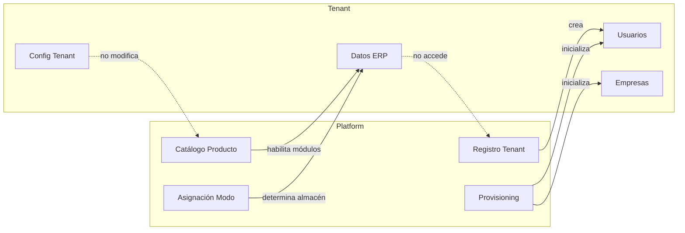
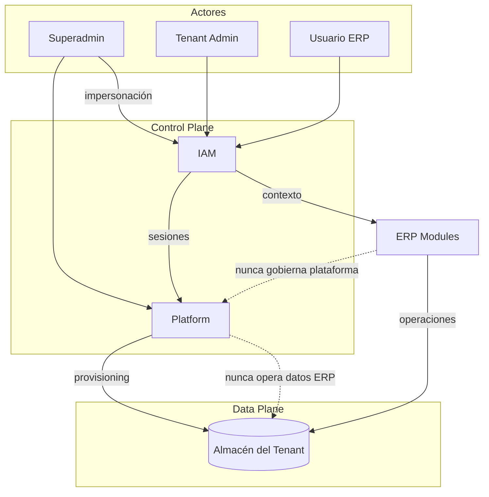

# 02 — Fronteras de Platform

**Etapa:** 1 — Diseño conceptual  
**Fecha:** 2026-06-25  
**Estado:** Borrador para revisión  
**Restricción:** Sin tablas, sin SQL, sin implementación

---

## 1. Propósito

Definir con precisión las **fronteras conceptuales** entre Platform, Tenant, IAM y ERP. Establecer qué responsabilidades pertenecen a cada lado y qué cruces están prohibidos.

---

## 2. Definición de Platform

Platform es el **plano de control (control plane)** del producto SaaS. Gobierna el ciclo de vida del producto como servicio, no las operaciones de negocio de los clientes.

### 2.1 Responsabilidades exclusivas de Platform

| Responsabilidad | Descripción |
|-----------------|-------------|
| Registro de tenants | Alta, baja, suspensión, reactivación |
| Asignación de modo de instalación | Shared, Dedicated, futuros modos |
| Catálogo de producto | Módulos, menús, plantillas de roles, permisos de producto |
| Licenciamiento | Planes, límites, feature flags comerciales |
| Provisioning | Orquestación de creación de recursos (sin ejecutar reglas ERP) |
| Superadministración | Operaciones cross-tenant auditadas |
| Metadata de instalación | Registro de almacén asignado, región, versión de schema |
| Gobernanza de migraciones | Políticas de cambio de modo de instalación |
| Auditoría de plataforma | Acciones de superadmin, cambios de configuración global |
| Resolución de tenant por identidad externa | Subdominio, routing de entrada |

### 2.2 Datos que Platform administra

| Categoría | Ejemplos conceptuales (no tablas) |
|-----------|-----------------------------------|
| Identidad del tenant | Código, subdominio, razón social, branding |
| Contrato | Plan, estado de suscripción, fechas |
| Configuración de autenticación | Modo auth, SSO, políticas |
| Catálogo global | Módulos disponibles, permisos de producto, menús maestros |
| Asignaciones tenant-catálogo | Qué módulos tiene activos cada tenant |
| Metadata de persistencia | Modo, endpoint de almacén, credenciales (como secretos de infraestructura) |
| Usuarios de plataforma | Superadmin, operadores internos |
| Auditoría de plataforma | Log de acciones de gobierno |

### 2.3 Lo que nunca debe salir de Platform

| Elemento | Razón |
|----------|-------|
| Registro canónico del tenant | Autoridad única de identidad |
| Catálogo maestro de permisos y módulos | Consistencia de producto |
| Metadata de resolución de almacén | Seguridad y gobernanza |
| Políticas de licenciamiento | Control comercial |
| Trazas de superadmin | Compliance y auditoría |
| Definición de modos de instalación | Contrato de infraestructura |

### 2.4 Lo que nunca debe pertenecer a Platform

| Elemento | Razón | Dueño correcto |
|----------|-------|----------------|
| Stock de productos | Dato operativo | ERP / Tenant almacén |
| Movimientos de inventario | Transacción de negocio | ERP |
| Asientos contables | Dato financiero operativo | ERP |
| Pedidos de venta / compra | Documento operativo | ERP |
| Saldos y kardex | Información derivada operativa | ERP |
| Workflow de aprobación de documentos | Regla de negocio | ERP |
| Parámetros operativos por empresa | Configuración de negocio | ERP (scope empresa) |
| Selección de empresa en sesión | Contexto operativo | IAM + ERP |

---

## 3. Definición de Tenant (dominio del suscriptor)

El Tenant es la **unidad de aislamiento** dentro de la plataforma. No es sinónimo de Platform ni de Empresa.

### 3.1 Responsabilidades del dominio Tenant

| Responsabilidad | Descripción |
|-----------------|-------------|
| Administración de usuarios del tenant | CRUD usuarios, asignación de roles |
| Administración de empresas | Alta de empresas operativas |
| Configuración de tenant | Branding, preferencias, auth config |
| Consumo de módulos | Activación según plan (orquestada por Platform) |
| Datos operativos ERP | Propiedad en su almacén asignado |
| Operación multiempresa | Cambio de empresa en sesión |

### 3.2 Frontera Tenant ↔ Platform

| Cruce | Dirección | Permitido |
|-------|-----------|-----------|
| Platform crea tenant | Platform → Tenant | Sí |
| Tenant modifica catálogo global | Tenant → Platform | No |
| Platform lee stock de tenant | Platform → Tenant datos | No (salvo soporte auditado) |
| Tenant consulta módulos disponibles | Tenant → Platform catálogo | Sí (lectura) |
| Platform suspende tenant | Platform → Tenant | Sí |
| Tenant elige modo de instalación | Tenant → Platform | No (solicitud comercial; Platform decide) |

---

## 4. Definición de IAM (frontera transversal)

IAM es un dominio **transversal** que autentica actores y establece contexto de sesión. No es Platform ni ERP, pero sirve a ambos.

### 4.1 Responsabilidades IAM

| Responsabilidad | Alcance |
|-----------------|---------|
| Autenticación | Login, refresh, logout |
| Gestión de sesiones | Creación, rotación, revocación |
| Emisión de tokens | Access, refresh, selection |
| Validación de identidad | Por request |
| Impersonación | Superadmin → tenant (auditada) |
| Contexto de sesión | Usuario, tenant, empresa, permisos efectivos |

### 4.2 Frontera IAM ↔ Platform

| Aspecto | Posición |
|---------|----------|
| Usuarios superadmin | Gobernados por Platform; autenticados por IAM |
| Políticas de sesión globales | Definidas por Platform; aplicadas por IAM |
| Persistencia de sesiones | **Punto de fricción AS-IS** — hoy centralizada; requiere decisión en etapa técnica |
| Catálogo de permisos | Producto de Platform; resolución en IAM |

### 4.3 Frontera IAM ↔ ERP

| Aspecto | Posición |
|---------|----------|
| RBAC en endpoints ERP | IAM provee permisos; ERP consume |
| Contexto empresa | IAM establece; ERP opera |
| Tenant operativo en impersonación | IAM resuelve; ERP confía en contexto |

**Regla:** ERP nunca autentica. ERP recibe contexto ya validado.

---

## 5. Definición de ERP (dominio operativo)

ERP es el conjunto de módulos de negocio (ORG, INV, PUR, SLS, …) que ejecutan procesos empresariales dentro del contexto de Tenant + Empresa.

### 5.1 Responsabilidades ERP

| Responsabilidad | Descripción |
|-----------------|-------------|
| Maestros operativos | Productos, proveedores, clientes comerciales, etc. |
| Documentos transaccionales | Movimientos, pedidos, asientos |
| Procesos y workflows | Procesar, autorizar, anular, estornar |
| Derivadas analíticas | Stock, kardex, saldos |
| Configuración operativa | Parámetros por empresa |
| Secuencias de documentos | Códigos autogenerados |

### 5.2 Frontera ERP ↔ Platform

| Cruce | Permitido |
|-------|-----------|
| ERP consulta si módulo está activo | Sí (vía contexto o servicio de catálogo) |
| ERP modifica registro de tenant | No |
| ERP conoce modo de instalación | **No** |
| ERP accede a catálogo de permisos | No directamente; vía IAM |

### 5.3 Frontera ERP ↔ Tenant almacén

| Principio | Descripción |
|-----------|-------------|
| Propiedad | Los datos operativos pertenecen al Tenant |
| Acceso | ERP lee/escribe en almacén resuelto por infraestructura |
| Aislamiento | ERP asume contexto de tenant; no valida modo |
| Multiempresa | ERP filtra por empresa dentro del almacén del tenant |

---

## 6. Diagrama de fronteras completo

---

## 7. Análisis de responsabilidades con frontera

| Responsabilidad | Dueño | Justificación | Impacto si mal asignada | Riesgo | Dependencias |
|-----------------|-------|---------------|-------------------------|--------|--------------|
| Registro de tenant | Platform | Autoridad única del SaaS | Duplicidad, inconsistencia de identidad | Alto | Ninguna (raíz) |
| Modo de instalación | Platform | Decisión comercial/infra | Datos en almacén incorrecto | Crítico | Provisioning |
| Catálogo de módulos | Platform | Definición de producto | Feature drift entre tenants | Alto | Licenciamiento |
| Permisos de producto | Platform | Consistencia RBAC | Agujeros de seguridad | Crítico | IAM |
| Usuarios del tenant | Tenant (admin) | Autonomía del cliente | — | Medio | IAM |
| Sesiones activas | IAM | Transversal | Sesiones inválidas cross-modo | Alto | Platform (metadata) |
| Empresa operativa | Tenant | Contexto de negocio | Scope incorrecto | Alto | ORG |
| Movimiento de inventario | ERP | Regla de negocio | Acoplamiento a Platform | Medio | INV, almacén |
| Onboarding inicial | **Hoy mixto** → debe separarse | AS-IS mezcla Platform + ERP | Transacción cross-boundary | Crítico | Provisioning, IAM, ERP seed |
| Impersonación | IAM + Platform audit | Gobernanza | Fuga de datos cross-tenant | Crítico | IAM, Platform audit |
| Branding | Tenant | Personalización | — | Bajo | Platform registro |
| Facturación | Platform (futuro) | Comercial | — | Medio | Tenant registry |
| Migración shared→dedicated | Platform | Gobernanza de modo | Pérdida de datos | Crítico | Provisioning, almacén |

---

## 8. Anti-patrones prohibidos

| Anti-patrón | Por qué está prohibido |
|-------------|------------------------|
| Servicio ERP que consulta registry de tenants | Acopla data plane a control plane |
| Platform que lee stock para lógica de gobierno | Inversión de frontera |
| Lógica de negocio que bifurca por modo de instalación | Viola principio P4/P5 |
| Onboarding que mezcla registro Platform y seed ERP en una unidad atómica indivisible | No escala a multi-almacén |
| Tenant admin que modifica catálogo global de permisos | Rompe consistencia de producto |
| Empresa que determina almacén de persistencia | Confunde scope operativo con scope de datos |
| Módulo ERP sin contexto de tenant | Rompe aislamiento |

---

## 9. Contrato de frontera para evolución

Cualquier nueva funcionalidad debe responder:

1. ¿Es gobierno del producto? → **Platform**
2. ¿Es identidad o sesión? → **IAM**
3. ¿Es operación de negocio? → **ERP**
4. ¿Es configuración del suscriptor? → **Tenant** (admin)
5. ¿Es dónde se guardan los datos? → **Infraestructura** (nunca negocio)

Si una responsabilidad no encaja claramente, es señal de **diseño incompleto** y debe resolverse antes de implementar.

---

## 10. Estado AS-IS vs frontera objetivo

| Área | AS-IS | Frontera objetivo |
|------|-------|-------------------|
| Onboarding | Platform + ERP en una transacción | Platform orquesta; ERP seed en almacén del tenant |
| Permisos | Catálogo central, grants por tenant | Mantener catálogo en Platform; grants en scope correcto |
| Sesiones IAM | Centralizadas | Decisión pendiente (ADR) |
| Queries ERP | Filtro `cliente_id` explícito | Contexto de tenant; filtro encapsulado en infraestructura |
| `DatabaseConnection.ADMIN` | Platform + datos ERP mezclados | ADMIN = solo Platform; almacén operativo separado |
| Superadmin | Opera en host plataforma | Sin cambio conceptual |
| Impersonación | Acceso a datos tenant vía JWT | Sin cambio conceptual |
