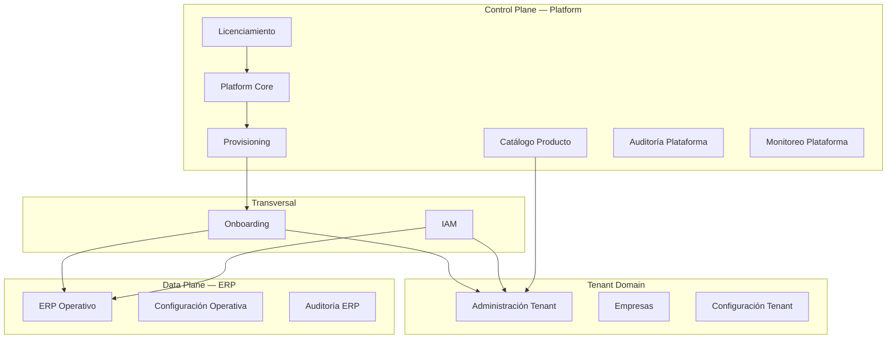
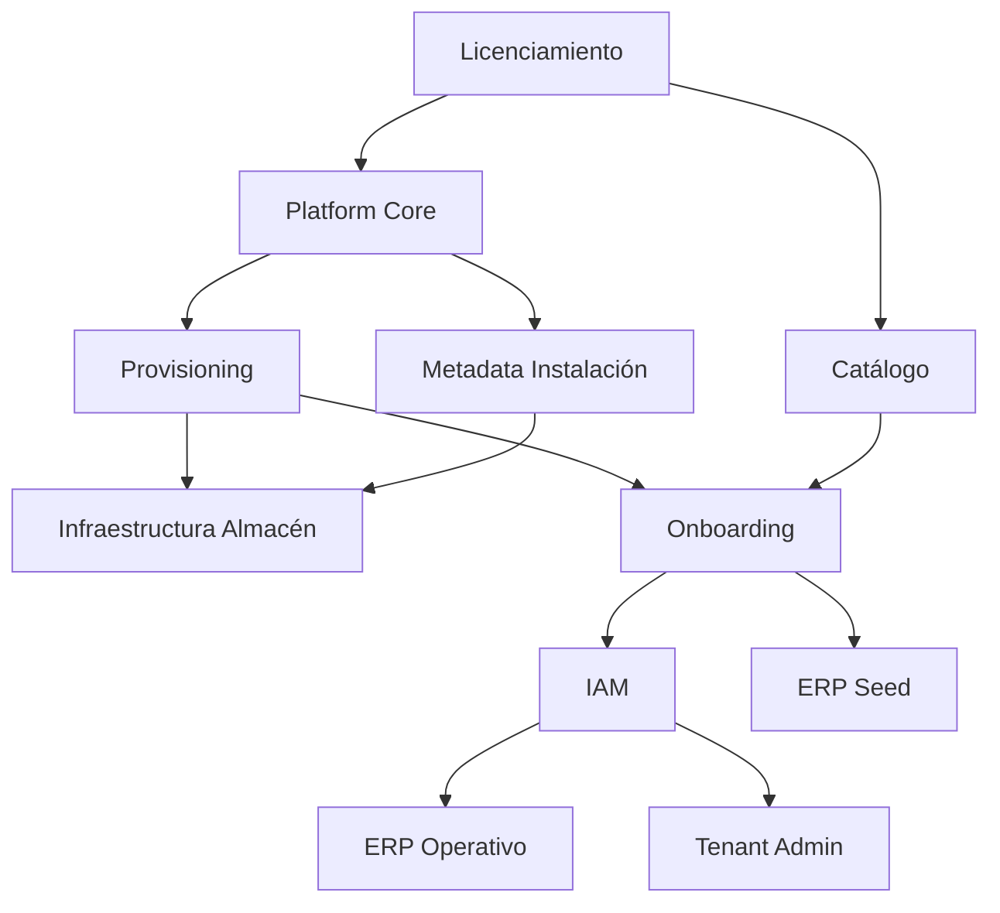

# 03 — Responsabilidades por Dominio

**Etapa:** 1 — Diseño conceptual  
**Fecha:** 2026-06-25  
**Estado:** Borrador para revisión  
**Restricción:** Sin tablas, sin SQL, sin implementación

---

## 1. Propósito

Identificar los **dominios de negocio** de la plataforma, asignar ownership (Platform vs Tenant vs Transversal), y documentar para cada responsabilidad: dueño funcional, justificación, impacto, riesgo y dependencias.

---

## 2. Mapa de dominios



---

## 3. Clasificación de dominios

| Dominio | Plano | Pertenece a |
|---------|-------|-------------|
| Platform Core | Control | Platform |
| Catálogo de Producto | Control | Platform |
| Licenciamiento | Control | Platform |
| Provisioning | Control | Platform |
| Onboarding | Transversal | Platform orquesta; Tenant recibe |
| IAM | Transversal | Platform + Tenant (usuarios) |
| Administración Tenant | Tenant | Tenant (admin) |
| Empresas | Tenant / ERP | Tenant admin crea; ERP opera |
| Configuración Tenant | Tenant | Tenant |
| ERP Operativo | Data | Tenant (datos en su almacén) |
| Configuración Operativa | Data | Tenant / Empresa |
| Auditoría Plataforma | Control | Platform |
| Auditoría ERP | Data | Tenant |
| Monitoreo | Control | Platform |
| Facturación | Control | Platform (futuro) |
| Operaciones / SRE | Control | Platform |
| Migración de modo | Control | Platform |

---

## 4. Análisis detallado por dominio

### 4.1 Platform Core

**Descripción:** Registro, ciclo de vida y gobernanza de tenants.

| Responsabilidad | Dueño | Justificación | Impacto | Riesgo | Dependencias |
|-----------------|-------|---------------|---------|--------|--------------|
| Alta de tenant | Platform | Autoridad del SaaS | Base de todo el ciclo | Crítico si falla | Provisioning |
| Suspensión / reactivación | Platform | Control comercial | Bloqueo de acceso | Alto | IAM |
| Asignación modo instalación | Platform | Contrato infra | Almacén incorrecto | Crítico | Metadata persistencia |
| Resolución subdominio → tenant | Platform | Entrada al sistema | Tenant incorrecto | Crítico | IAM |
| Metadata de almacén | Platform | Control plane | Conexión fallida | Crítico | Infraestructura |
| Superadministración | Platform | Operación del servicio | Acceso no autorizado | Crítico | IAM, Auditoría |

---

### 4.2 Catálogo de Producto

**Descripción:** Definición global de módulos, menús, permisos de producto y plantillas.

| Responsabilidad | Dueño | Justificación | Impacto | Riesgo | Dependencias |
|-----------------|-------|---------------|---------|--------|--------------|
| Definición de módulos | Platform | Producto único | Inconsistencia entre tenants | Alto | Licenciamiento |
| Permisos de producto | Platform | RBAC consistente | Agujeros de seguridad | Crítico | IAM |
| Menús maestros | Platform | UX coherente | Navegación rota | Medio | IAM |
| Plantillas de roles | Platform | Acelerar onboarding | RBAC incompleto | Medio | Onboarding |
| Activación módulo por tenant | Platform autoriza; Tenant consume | Modelo SaaS | Features no disponibles | Medio | Licenciamiento |

**Nunca en Tenant:** modificar catálogo global.

---

### 4.3 Licenciamiento

**Descripción:** Planes, límites, feature flags comerciales. Parcialmente implementado hoy (`plan_suscripcion`).

| Responsabilidad | Dueño | Justificación | Impacto | Riesgo | Dependencias |
|-----------------|-------|---------------|---------|--------|--------------|
| Definición de planes | Platform | Comercial | — | Medio | Catálogo |
| Límites por plan | Platform | Monetización | Uso no facturado | Medio | Monitoreo |
| Feature flags comerciales | Platform | Upsell | Acceso indebido | Medio | IAM |
| Estado de suscripción | Platform | Control de acceso | Tenant activo sin pago | Alto | Platform Core |

---

### 4.4 Provisioning

**Descripción:** Orquestación de creación de recursos para un tenant nuevo o en migración.

| Responsabilidad | Dueño | Justificación | Impacto | Riesgo | Dependencias |
|-----------------|-------|---------------|---------|--------|--------------|
| Orquestación de alta | Platform | Secuencia controlada | Tenant incompleto | Crítico | Onboarding, Infra |
| Creación de almacén (Dedicated) | Platform + Infra | Recurso físico | Sin datos operativos | Crítico | Metadata |
| Aplicación de schema operativo | Platform + Infra | Capacidad ERP | ERP no funcional | Crítico | Migraciones |
| Registro de metadata conexión | Platform | Resolución de almacén | Routing fallido | Crítico | Platform Core |
| Compensación ante fallos | Platform | Consistencia | Tenant huérfano | Crítico | Auditoría |
| Idempotencia de provisioning | Platform | Reintentos seguros | Duplicados | Alto | — |

**Separación conceptual crítica (vs AS-IS):**

| Fase | Dueño | Qué hace |
|------|-------|----------|
| 1. Registro Platform | Platform | Crea identidad tenant, asigna modo |
| 2. Preparación almacén | Infraestructura | Crea o asigna almacén según modo |
| 3. Seed identidad | Onboarding / IAM | Usuario admin, roles base |
| 4. Seed operativo | ERP (inicialización) | Empresa inicial, secuencias |
| 5. Activación RBAC | Onboarding | Módulos, permisos, menú |
| 6. Activación | Platform | Marca tenant Activo |

Hoy las fases 1–5 ocurren en una unidad indivisible — **debe evolucionar conceptualmente**.

---

### 4.5 Onboarding

**Descripción:** Proceso de configuración inicial de un tenant hasta estado operativo.

| Responsabilidad | Dueño | Justificación | Impacto | Riesgo | Dependencias |
|-----------------|-------|---------------|---------|--------|--------------|
| Validación pre-alta | Platform | Integridad | Duplicados | Medio | Platform Core |
| Creación usuario admin | IAM / Tenant | Primera identidad | Sin acceso | Alto | Provisioning |
| Creación empresa inicial | ERP seed | Operación multiempresa | Sin contexto ERP | Alto | Almacén operativo |
| Roles y permisos iniciales | Platform catálogo + Tenant grants | RBAC mínimo | Sin autorización | Crítico | Catálogo, IAM |
| Secuencias de documentos | ERP seed | Códigos autogenerados | Sin documentos | Medio | Almacén operativo |
| Entrega credenciales | IAM | Primera sesión | Bloqueo de acceso | Alto | — |
| Rollback de onboarding | Platform | Consistencia | Tenant parcial | Crítico | Provisioning |

**Pertenece a:** Platform orquesta; ejecutores son IAM, ERP seed y catálogo.

---

### 4.6 IAM (Identity and Access Management)

**Descripción:** Autenticación, sesiones, tokens, autorización.

| Responsabilidad | Dueño | Justificación | Impacto | Riesgo | Dependencias |
|-----------------|-------|---------------|---------|--------|--------------|
| Login / logout | IAM | Seguridad transversal | Sin acceso | Crítico | Platform (tenant activo) |
| Gestión de sesiones | IAM | Continuidad | Sesiones inválidas | Alto | **Decisión almacén sesiones** |
| Refresh y rotación | IAM | Seguridad | Tokens comprometidos | Crítico | Sesiones |
| JWT y claims | IAM | Stateless auth | Contexto incorrecto | Crítico | Tenant, Empresa |
| RBAC enforcement | IAM | Autorización | Acceso indebido | Crítico | Catálogo permisos |
| Impersonación | IAM + Platform audit | Soporte enterprise | Fuga cross-tenant | Crítico | Platform |
| Cambio de empresa | IAM | Multiempresa | Scope incorrecto | Alto | Empresas |
| SSO / federación | IAM | Enterprise auth | Identidades duplicadas | Alto | Platform config |
| Blacklist / Redis | IAM | Revocación | Tokens activos tras logout | Alto | Infra cache |

**Punto abierto:** ¿Sesiones en control plane o replicadas por tenant? → Ver ADR y Open Questions.

---

### 4.7 Administración Tenant

**Descripción:** Autogestión del tenant por su administrador.

| Responsabilidad | Dueño | Justificación | Impacto | Riesgo | Dependencias |
|-----------------|-------|---------------|---------|--------|--------------|
| CRUD usuarios | Tenant admin | Autonomía | — | Medio | IAM |
| Asignación roles | Tenant admin | RBAC local | Privilegios excesivos | Alto | Catálogo permisos |
| Gestión empresas | Tenant admin | Multiempresa | Sin contexto operativo | Alto | ERP ORG |
| Branding | Tenant admin | Personalización | — | Bajo | Platform registro |
| Config auth tenant | Tenant admin | Políticas locales | Auth roto | Alto | IAM |
| Password reset admin | Tenant admin | Operación | Bloqueo usuarios | Medio | IAM |

**Pertenece a:** Tenant. Platform no opera estos datos salvo soporte auditado.

---

### 4.8 Empresas

**Descripción:** Unidades operativas dentro del tenant.

| Responsabilidad | Dueño | Justificación | Impacto | Riesgo | Dependencias |
|-----------------|-------|---------------|---------|--------|--------------|
| Alta de empresa | Tenant admin | Expansión | — | Medio | ERP ORG |
| Empresa por defecto | Onboarding / ERP seed | Primera operación | Sin sesión ERP | Alto | Onboarding |
| Scope operativo | ERP | Aislamiento multiempresa | Datos cruzados | Crítico | IAM context |
| Parámetros por empresa | ERP | Configuración negocio | Comportamiento incorrecto | Medio | — |
| Relación con almacén | **Ninguna** | Modo es del tenant | Confusión de scope | Crítico si se viola | Platform |

---

### 4.9 ERP Operativo

**Descripción:** Módulos de negocio (ORG, INV, PUR, SLS, WMS, MFG, FIN, …).

| Responsabilidad | Dueño | Justificación | Impacto | Riesgo | Dependencias |
|-----------------|-------|---------------|---------|--------|--------------|
| Maestros | ERP | Datos de negocio | — | Medio | Almacén tenant |
| Documentos transaccionales | ERP | Core del producto | — | Alto | Workflow |
| Procesos (procesar, anular…) | ERP | Reglas de negocio | Integridad | Crítico | UoW conceptual |
| Derivadas (stock, saldos) | ERP | Consistencia | Datos incorrectos | Crítico | Transacciones |
| Listados y reportes | ERP | Operación | — | Medio | — |
| Secuencias de código | ERP | Integridad documentos | Duplicados | Alto | Seed onboarding |

**Pertenece a:** Tenant (datos en su almacén). **Nunca** a Platform.

**Invariante:** ERP no conoce modo de instalación.

---

### 4.10 Configuración

| Subdominio | Dueño | Ejemplos conceptuales |
|------------|-------|----------------------|
| Configuración Platform | Platform | Dominio base, políticas globales |
| Configuración Tenant | Tenant admin | Branding, auth mode, preferencias |
| Configuración Operativa | ERP / Empresa | Parámetros de inventario, contabilidad |

---

### 4.11 Auditoría

| Tipo | Dueño | Qué registra |
|------|-------|--------------|
| Auditoría Plataforma | Platform | Superadmin, cambios de modo, provisioning |
| Auditoría IAM | IAM | Login, logout, impersonación, revocaciones |
| Auditoría ERP | Tenant | Cambios en documentos, procesos, maestros |

**Frontera:** Auditoría de plataforma nunca sustituye auditoría ERP.

---

### 4.12 Monitoreo y Operaciones

| Responsabilidad | Dueño | Justificación |
|-----------------|-------|---------------|
| Health de plataforma | Platform / SRE | Disponibilidad del servicio |
| Health por tenant | Platform | SLA por cliente |
| Health de almacén dedicado | Platform + Infra | Modo dedicated |
| Métricas de uso | Platform | Licenciamiento, capacidad |
| Jobs de limpieza (sesiones) | IAM / Platform | Mantenimiento |

---

### 4.13 Facturación (futuro)

| Responsabilidad | Dueño | Justificación |
|-----------------|-------|---------------|
| Cálculo de uso | Platform | Comercial |
| Integración billing externo | Platform | No es ERP |
| Datos de facturación ERP | ERP (si aplica) | Documentos comerciales del tenant |

**Nunca:** mezclar facturación SaaS (Platform) con facturación electrónica del tenant (ERP/invoicing).

---

### 4.14 Migración de modo de instalación

| Responsabilidad | Dueño | Justificación | Impacto | Riesgo |
|-----------------|-------|---------------|---------|--------|
| Decisión de migración | Platform | Comercial / compliance | — | — |
| Orquestación | Platform | Gobernanza | Downtime | Crítico |
| Copia de datos | Infraestructura | Data plane | Pérdida de datos | Crítico |
| Validación post-migración | Platform | Integridad | Tenant corrupto | Crítico |
| Cambio de metadata | Platform | Routing | Doble escritura | Crítico |
| Estado Migrando | Platform | Ciclo de vida | Acceso parcial | Alto |

---

## 5. Matriz Platform vs Tenant vs Transversal

| Dominio | Platform | Tenant | IAM | ERP | Infraestructura |
|---------|:--------:|:------:|:---:|:---:|:---------------:|
| Registro tenant | ● | | | | |
| Modo instalación | ● | | | | ○ |
| Catálogo producto | ● | ○ consume | ○ usa | | |
| Licenciamiento | ● | ○ sujeto | | | |
| Provisioning | ● orquesta | ○ recibe | ○ | ○ seed | ● ejecuta |
| Onboarding | ● orquesta | ● admin | ● | ● seed | ● |
| Autenticación | | | ● | | |
| Sesiones | | | ● | | ○ cache |
| Usuarios tenant | | ● admin | ● | | |
| Empresas | | ● admin | ○ context | ● opera | |
| Datos operativos | | ● posee | | ● ejecuta | ● almacena |
| Auditoría plataforma | ● | | ○ IAM | | |
| Auditoría ERP | | ● | | ● | |
| Monitoreo | ● | ○ métricas | | | ● |
| Facturación SaaS | ● | ○ cliente | | | |
| Migración modo | ● | ○ afectado | ○ | ○ | ● |

Leyenda: ● = dueño principal; ○ = participante/colaborador

---

## 6. Dependencias críticas entre dominios



**Cadena crítica de alta de tenant:**

```
Platform Core → Provisioning → [Almacén] → Onboarding → IAM + ERP Seed → Activo
```

Cualquier ruptura en esta cadena produce tenant en estado **Fallido** o **inconsistente**.

---

## 7. Responsabilidades que hoy violan fronteras (AS-IS → objetivo)

| Responsabilidad AS-IS | Ubicación actual | Frontera objetivo |
|-----------------------|------------------|-------------------|
| Seed `org_empresa` en transacción Platform | Onboarding ADMIN | ERP seed en almacén tenant |
| Catálogo permisos en startup | Platform central | Mantener en Platform (correcto) |
| Sesiones en almacén compartido central | IAM | Decisión pendiente |
| Filtro tenant en queries ERP | Infraestructura mezclada con negocio | Encapsular en infraestructura |
| `database_type` en algunos servicios IAM | Lógica de aplicación | Solo infraestructura |

Estas observaciones orientan etapas técnicas; no son decisiones de esta etapa.
