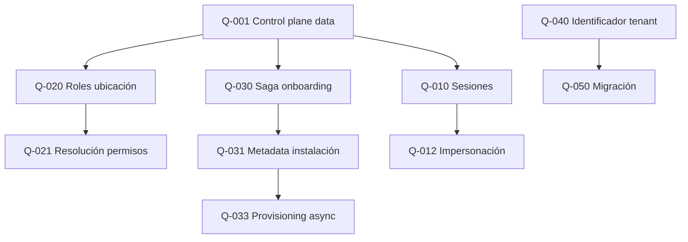

# 05 — Preguntas Abiertas

> **SUPERSEDED — BL-1.0 (2026-06-25)**  
> Este documento es **histórico** (Etapa 1). Estado oficial de preguntas:  
> **`architecture-baseline/04_OPEN_QUESTIONS_STATUS.md`**  
> No usar para implementación. Ver `architecture-baseline/07_CHANGELOG_BASELINE_FREEZE.md`.

**Etapa:** 1 — Diseño conceptual  
**Fecha:** 2026-06-25  
**Estado:** ~~Pendiente de resolución~~ **SUPERSEDED**  
**Restricción:** Sin implementación

---

## 1. Propósito

Consolidar todas las **preguntas sin respuesta** que deben resolverse antes o durante la etapa técnica. Clasificadas por dominio, prioridad y dependencias.

Las preguntas heredadas de la auditoría AS-IS (`06_RISKS_FOR_DEDICATED_DB.md` §7) se incorporan y refinan aquí.

---

## 2. Leyenda de prioridad

| Prioridad | Criterio |
|-----------|----------|
| P0 | Bloquea diseño técnico o decisión de producto |
| P1 | Debe resolverse antes de implementar Dedicated |
| P2 | Puede diferirse post-MVP dedicated |
| P3 | Exploración futura (on-premise, etc.) |

---

## 3. Preguntas de frontera Platform / Data Plane

### Q-001 [P0] ¿Qué datos pertenecen exclusivamente al control plane?

**Contexto:** Hoy ADMIN mezcla Platform e ERP.  
**Opciones conceptuales:** Solo identidad tenant + catálogo + metadata; vs incluir sesiones IAM.  
**Bloquea:** ADR-001, ADR-002, partición de almacenes.  
**Responsable sugerido:** Arquitecto + Producto.

### Q-002 [P0] ¿Qué datos pertenecen exclusivamente al data plane?

**Contexto:** Todo dato operativo ERP + grants RBAC locales + empresas.  
**Incertidumbre:** ¿Sesiones? ¿Config auth tenant?  
**Bloquea:** ADR-001, provisioning.

### Q-003 [P1] ¿El catálogo de módulos y menús vive solo en Platform?

**Contexto:** Hoy es global central. Dedicated podría requerir réplica.  
**Relacionada:** ADR-003.

### Q-004 [P1] ¿La configuración de autenticación del tenant es Platform o data plane?

**Contexto:** `cliente_auth_config` mezcla políticas (Platform-like) con datos de tenant.  
**Impacto:** Dónde se lee en login para tenant dedicated.

---

## 4. Preguntas IAM y sesiones

### Q-010 [P0] ¿Dónde persisten las sesiones IAM en modo Dedicated?

**Contexto:** ADR-002 — central vs tenant almacén.  
**Impacto:** Refresh, probe, revocación, logout.  
**Estado AS-IS:** Centralizado.

### Q-011 [P1] ¿Redis es source of truth o solo acelerador?

**Contexto:** Blacklist, session bridge, impersonación parent.  
**Impacto:** Recovery ante pérdida de Redis; dedicated con Redis aislado.

### Q-012 [P1] ¿Cómo funciona impersonación si el almacén dedicated no es accesible desde central?

**Contexto:** ADR-009 — conectividad superadmin → almacén cliente.  
**Impacto:** Soporte enterprise, auditoría.

### Q-013 [P2] ¿Sesiones V1 deben eliminarse antes de dedicated o coexistir?

**Contexto:** Cutover V2 por tenant ya existe.  
**Impacto:** Complejidad de migración.

---

## 5. Preguntas RBAC y permisos

### Q-020 [P0] ¿Dónde viven `rol`, `rol_permiso`, `usuario_rol` en Dedicated?

**Contexto:** Hoy en almacén central compartido.  
**Opciones:** Data plane del tenant vs control plane.  
**Bloquea:** ADR-003, onboarding.

### Q-021 [P1] ¿Cómo se resuelve un permiso sin join cross-almacén?

**Contexto:** Catálogo central + grant local.  
**Necesita:** Servicio de resolución abstracto (conceptual, no implementación).

### Q-022 [P2] ¿Permisos custom por tenant enterprise?

**Contexto:** Hoy solo permisos de producto.  
**Impacto:** Extensión del catálogo.

---

## 6. Preguntas onboarding y provisioning

### Q-030 [P0] ¿Cuál es el contrato de la saga de onboarding?

**Contexto:** ADR-004 — pasos, orden, compensación.  
**Subpreguntas:**
- ¿Qué pasos son idempotentes?
- ¿Cuál es el estado mínimo para marcar tenant Activo?
- ¿Qué ocurre si falla el seed ERP pero Platform ya registró el tenant?

### Q-031 [P0] ¿Cuándo se crea la metadata de instalación (modo + almacén)?

**Contexto:** AS-IS no crea metadata en onboarding estándar.  
**Bloquea:** Routing dedicated.

### Q-032 [P1] ¿El seed de empresa inicial es responsabilidad de ERP o de Platform?

**Contexto:** Frontera onboarding.  
**Recomendación conceptual:** ERP seed en almacén tenant; Platform orquesta.

### Q-033 [P1] ¿Provisioning dedicated es síncrono o asíncrono para el usuario?

**Contexto:** ADR-007 — SLA de alta.  
**Impacto:** UX, estados Provisioning.

### Q-034 [P2] ¿Existe pool de almacenes pre-creados?

**Contexto:** Velocidad de onboarding dedicated.  
**Impacto:** Costo infraestructura ociosa.

---

## 7. Preguntas modelo de datos (conceptuales, sin tablas)

### Q-040 [P1] ¿Dedicated mantiene identificador de tenant en datos operativos?

**Contexto:** ADR-006 — redundancia vs simplicidad de código único.  
**Impacto:** Migración shared↔dedicated.

### Q-041 [P1] ¿Catálogos geográficos (`cat_pais`, etc.) son globales o locales por almacén?

**Contexto:** GLOBAL_TABLES hoy.  
**Impacto:** Dedicated sin réplica de catálogos.

### Q-042 [P2] ¿Secuencias de código son siempre del data plane?

**Contexto:** Hoy seed en onboarding transaccional central.  
**Respuesta conceptual probable:** Sí, data plane.

---

## 8. Preguntas migración y ciclo de vida

### Q-050 [P1] ¿Se permitirá migración Shared → Dedicated?

**Contexto:** ADR-008 — demanda comercial.  
**Si sí:** ¿offline o online?

### Q-051 [P2] ¿Se permitirá migración Dedicated → Shared?

**Contexto:** Downgrade, fin de contrato enterprise.  
**Impacto:** Retención de datos, compliance.

### Q-052 [P1] ¿Cuál es la política de retención para tenant Retirado en cada modo?

**Contexto:** Ciclo de vida.  
**Impacto:** Borrado de almacén dedicated vs soft-delete en shared.

### Q-053 [P2] ¿Versión de schema por tenant dedicated puede divergir?

**Contexto:** Migraciones DDL por almacén.  
**Impacto:** Gobernanza de versiones.

---

## 9. Preguntas operativas y SRE

### Q-060 [P1] ¿Cómo se monitorea salud de N almacenes dedicated?

**Contexto:** Hoy health check es sobre conexión contextual.  
**Impacto:** Observabilidad, alertas.

### Q-061 [P1] ¿Quién ejecuta migraciones DDL en almacenes dedicated?

**Contexto:** V010 aplicado por tenant.  
**Opciones:** Pipeline central, agente por almacén, manual.

### Q-062 [P2] ¿Backup/restore es responsabilidad Platform o cliente (on-premise)?

**Contexto:** Modos futuros.  
**Impacto:** SLA, contrato.

### Q-063 [P1] ¿Invalidación de cache de engines al cambiar metadata de instalación?

**Contexto:** R-I08 AS-IS.  
**Impacto:** Consistencia post-migración.

---

## 10. Preguntas comerciales y producto

### Q-070 [P1] ¿Qué módulos/planes están disponibles en Dedicated vs Shared?

**Contexto:** Paridad funcional asumida; ¿hay restricciones comerciales?  
**Impacto:** Licenciamiento.

### Q-071 [P2] ¿Dedicated implica SLA distinto?

**Contexto:** Monitoreo, soporte, impersonación.  
**Impacto:** Operaciones.

### Q-072 [P3] ¿On-premise es roadmap confirmado?

**Contexto:** P7 extensibilidad.  
**Impacto:** ADR-010, conectividad.

---

## 11. Preguntas de compatibilidad AS-IS

### Q-080 [P1] ¿Shared Database sigue siendo el modo por defecto indefinidamente?

**Contexto:** P1 principio — no romper lo existente.  
**Respuesta probable:** Sí.

### Q-081 [P1] ¿Tenants existentes requieren cambio alguno para habilitar arquitectura híbrida?

**Contexto:** Backward compatibility.  
**Respuesta deseada:** Ninguno para shared existentes.

### Q-082 [P2] ¿Cuánto código con `database_type` en servicios debe eliminarse?

**Contexto:** ADR-005 — ramas en user_context, rol_service.  
**Etapa:** Técnica, no conceptual.

---

## 12. Matriz de dependencias entre preguntas

---

## 13. Preguntas resueltas conceptualmente (pendiente formalización)

Estas tienen **orientación** en el modelo conceptual pero requieren acta de aprobación:

| ID | Pregunta | Orientación en docs 01-04 |
|----|----------|---------------------------|
| — | ¿Un código fuente? | Sí (principio P3-P5) |
| — | ¿Empresa determina almacén? | No |
| — | ¿ERP conoce modo instalación? | No |
| — | ¿Platform opera datos ERP? | No |
| — | ¿Modo es propiedad del tenant? | Sí |
| — | ¿Todas las empresas comparten almacén del tenant? | Sí |

---

## 14. Criterios de cierre

Una pregunta se considera **cerrada** cuando:

1. Existe decisión documentada en ADR aprobado, o
2. Existe acta de reunión referenciada en este documento, o
3. Se marca explícitamente como "fuera de alcance" con justificación

Hasta entonces, permanece abierta y bloquea la etapa que indique su prioridad.

---

## 15. Próximos pasos sugeridos

| Orden | Acción | Preguntas |
|-------|--------|-----------|
| 1 | Workshop frontera control/data | Q-001, Q-002, Q-020 |
| 2 | Decisión sesiones IAM | Q-010, Q-011 |
| 3 | Diseño saga onboarding | Q-030, Q-031, Q-032 |
| 4 | Política migración comercial | Q-050, Q-070 |
| 5 | Operaciones dedicated | Q-060, Q-061, Q-063 |

**No avanzar a etapa técnica sin cerrar al menos todas las P0.**
