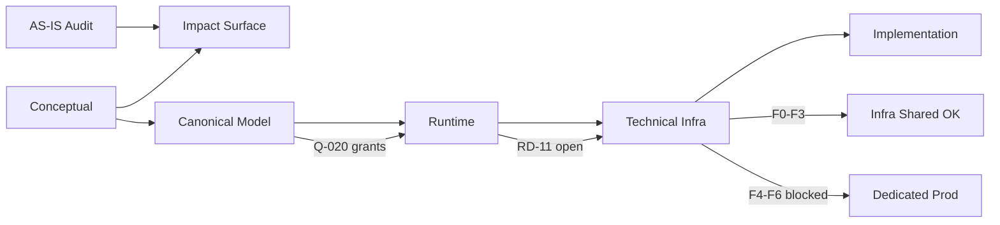

# 02 — Cross-Stage Traceability

**Etapa:** 5.5 — Architecture Validation  
**Fecha:** 2026-06-25  
**Alcance:** Trazabilidad E0→E5

---

## 1. Propósito

Construir matriz de trazabilidad: cada decisión importante debe tener origen, dependencias, documentos afectados e implicación en Etapa 6. Detectar decisiones huérfanas.

---

## 2. Leyenda

| Símbolo | Significado |
|---------|-------------|
| ✅ | Trazado completo |
| ⚠️ | Parcial / borrador |
| ❌ | Huérfana / sin cierre |

---

## 3. Decisiones arquitectónicas principales

### 3.1 Separación Platform / IAM / ERP

| Campo | Valor |
|-------|-------|
| Origen | E1 `01_CONCEPTUAL_MODEL`, `02_PLATFORM_BOUNDARIES` |
| Refuerzo | E3 CP/DP, E4 capas L0–L7 |
| Implementación futura | Sin cambio L5 ERP; gateway L6 |
| Estado | ✅ |

---

### 3.2 Infrastructure Encapsulation First

| Campo | Valor |
|-------|-------|
| Origen | E1 P5; E2 `01_ARCHITECTURAL_IMPACT` |
| Dependencias | G-01–G-10 |
| Documentos | E5 01, 12 Fase 1 |
| Implementación | `connection_async`, `routing`, `queries_async` |
| Estado | ✅ |

---

### 3.3 Shared/Dedicated invisible L5

| Campo | Valor |
|-------|-------|
| Origen | E1 P5; E2 G-05 |
| Runtime | E4 RD-03, RI-32 |
| Infra | E5 03, TD-08 |
| Gap AS-IS | E0 `user_context`, `rol_service`, middleware |
| Implementación | E5 Fase 3 |
| Estado | ⚠️ Target ✅; AS-IS gap pendiente |

---

### 3.4 Resolución per-op + cache intra-request

| Campo | Valor |
|-------|-------|
| Origen | E0 AS-IS (per execute_*) |
| Runtime | E4 RD-01, RR-80 |
| Infra | E5 TD-01, TD-05, 10 L-A |
| Implementación | Fase 1 |
| Estado | ✅ |

---

### 3.5 Persistence Gateway único (RD-06)

| Campo | Valor |
|-------|-------|
| Origen | E4 RD-06 |
| Infra | E5 01, TD-11 |
| Dependencias | execute_*, UoW, routing |
| Implementación | Fase 1 (evolución, no rewrite) |
| Estado | ✅ |

---

### 3.6 Operation class control_plane \| tenant_data (RD-07)

| Campo | Valor |
|-------|-------|
| Origen | E4 RD-07 |
| Infra | E5 01, 03 |
| Dependencias | E3 ownership por dato |
| Gap | auth_audit_log, sesiones IAM |
| Estado | ⚠️ Parcial |

---

### 3.7 Fallback Shared metadata ausente (RD-08)

| Campo | Valor |
|-------|-------|
| Origen | E2 G-13; E4 RD-08 |
| Infra | E5 02 §5, 03 §4.2 |
| Implementación | Fase 1 |
| Estado | ✅ |

---

### 3.8 Session store location (RD-11)

| Campo | Valor |
|-------|-------|
| Origen | E1 Q-010, ADR-002 |
| E3 | Q-010 🟡 parcial |
| E4 | RD-11 **abierta** |
| E5 | TD-13 gate Fase 5 |
| Implementación | **Bloqueada** dedicated IAM prod |
| Estado | ❌ **Huérfana funcional** |

---

### 3.9 Onboarding saga (RD-12)

| Campo | Valor |
|-------|-------|
| Origen | E0 R-C01; E1 ADR-004; E1 Q-030 |
| E4 | RD-12 |
| E5 | 07 TB T5, TD-12, Fase 4 |
| Dependencias | Q-031 metadata, Q-032 ✅ |
| Implementación | Fase 4 |
| Estado | ⚠️ Behavioral OK; pasos/compensación no trazados a Q-030 |

---

### 3.10 Migration offline block ERP (RD-13)

| Campo | Valor |
|-------|-------|
| Origen | E1 ADR-008; E0 |
| E4 | RD-13, RI-14 |
| E5 | Fase 7, 11 F5 |
| Estado | ✅ |

---

### 3.11 Grants RBAC en DP (Q-020)

| Campo | Valor |
|-------|-------|
| Origen | E1 Q-020 |
| E3 | ✅ Resuelto ownership |
| E4 | RD-15 resolution service |
| E5 | Permission resolution L4 — **no diseño técnico detallado** |
| Implementación | Implícito IAM; no en roadmap explícito |
| Estado | ⚠️ Ownership ✅; servicio resolución **huérfano técnico** |

---

### 3.12 Impersonation JWT target tenant (RD-05)

| Campo | Valor |
|-------|-------|
| Origen | E0 session scope audit |
| E4 | RD-05, RI-18 |
| Gap | E0 R-I03 — solo 3 módulos `{cod}_deps` |
| Implementación | **No en roadmap E5** |
| Estado | ⚠️ Decisión runtime ✅; cobertura ERP **huérfana** |

---

## 4. Preguntas P0 — trazabilidad

| ID | E1 | E3 | E4/E5 | Etapa 6 | Estado |
|----|----|----|-------|---------|--------|
| Q-001 | P0 | ✅ E3 | — | — | ✅ Cerrada ownership |
| Q-002 | P0 | ✅ E3 | — | — | ✅ |
| Q-010 | P0 | 🟡 | RD-11 | Fase 5 | ❌ Abierta |
| Q-020 | P0 | ✅ | RD-15 | IAM impl | ⚠️ Parcial |
| Q-030 | P0 | — | RD-12 | Fase 4 | ⚠️ Parcial |
| Q-031 | P0 | — | Fase 4 | Fase 4 | ❌ Abierta |

---

## 5. Riesgos AS-IS → mitigación diseño

| Riesgo E0 | Mitigación documentada | Trazado |
|-----------|------------------------|---------|
| R-C01 onboarding cross-TX | RD-12, Fase 4 | ✅ |
| R-C02 ADMIN=DEFAULT físico | Gateway resolution | ✅ |
| R-C03 no cliente_conexion | Fase 4 | ⚠️ Q-031 abierta |
| R-C04 permiso global | E3 ownership + RD-15 | ⚠️ |
| R-C05 IAM sessions central | RD-11 | ❌ |
| R-I01 tenant filter dedicated | TD-08 | ✅ |
| R-I03 deps parcial | — | ❌ **Huérfano** |
| R-I04 GLOBAL_TABLES | C-03 | ❌ |

---

## 6. Guardrails → verificación implementación

| Guardrail | Documento verificación | Fase |
|-----------|------------------------|------|
| G-01 mínimo impacto | E2 03, E5 12 | Todas |
| G-02 backward compat | Fase 2 | Fase 2 |
| G-05 encapsulation | Fase 1, 3 | F1, F3 |
| G-09 no resolve L5 | Fase 1 grep | F1 |
| G-17 no SessionLocal | E5 TD-05 | F1 |
| G-20 tenant isolation | Fase 0 tests | F0 |

---

## 7. Decisiones huérfanas (sin trazado completo)

| # | Decisión / Tema | Gap |
|---|-----------------|-----|
| H-01 | RD-11 Session store | Sin ADR aprobado |
| H-02 | Q-031 Metadata creation timing | Sin spec pasos |
| H-03 | Catálogos CP en dedicated ERP queries | Sin routing rule |
| H-04 | auth_audit_log operation class | Sin decisión |
| H-05 | Permission resolution service técnico | Solo RD-15 behavioral |
| H-06 | Session scope ERP todos módulos | E0 riesgo no en roadmap |
| H-07 | ADR-001 a ADR-010 formal approval | Permanecen borrador E1 |
| H-08 | Tenant export/import/archive/delete | Mencionado escalabilidad; sin diseño |
| H-09 | Redis source of truth (Q-011) | Abierta E1 |
| H-10 | Impersonation dedicated unreachable (Q-012) | Abierta E1 |

---

## 8. Matriz origen → implementación

---

## 9. Conclusión

**Decisiones trazadas completamente:** ~70%  
**Parciales:** ~20%  
**Huérfanas críticas:** ~10% (RD-11, Q-031, catálogos, deps ERP)

Ninguna decisión **core de infra shared** quedó huérfana. Decisiones **dedicated production** tienen huecos traceability significativos.
