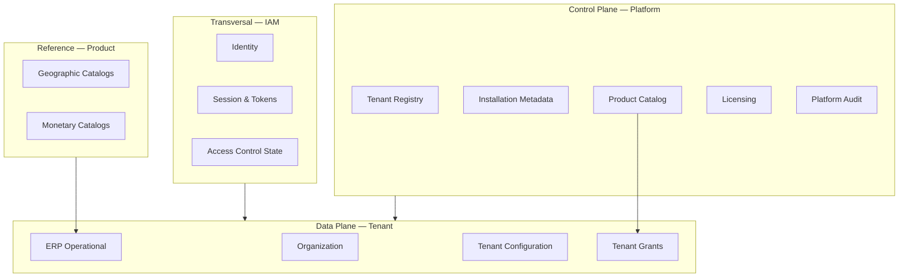
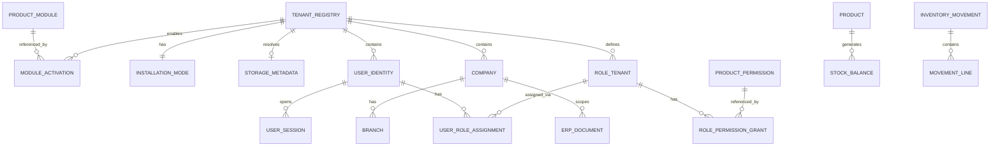

# 01 — Modelo Canónico de Datos

**Etapa:** 3 — Canonical Data Model & Data Ownership  
**Fecha:** 2026-06-25  
**Estado:** Borrador para revisión  
**Prerequisitos:** AS-IS audit, Modelo conceptual Etapa 1, Impact Assessment Etapa 2  
**Restricción:** Datos de negocio únicamente. Sin tablas, sin SQL, sin implementación.

---

## 1. Propósito

Definir el **modelo canónico de datos** de la plataforma híbrida: qué datos existen, cómo se relacionan conceptualmente, y bajo qué reglas de ownership operan.

Este modelo es **independiente de SQL Server**, de modos de instalación (Shared/Dedicated), y de decisiones de persistencia física.

---

## 2. Principios del modelo

| # | Principio | Regla |
|---|-----------|-------|
| D1 | Single Source of Truth | Cada dato tiene un único dueño funcional |
| D2 | Platform ≠ ERP | Sin ownership cruzado entre planos |
| D3 | IAM = identidad y acceso | IAM no es dueño de datos operativos |
| D4 | Modo no cambia ownership | Shared/Dedicated solo cambia dónde persiste |
| D5 | Agnosticismo tecnológico | Modelo válido para cualquier almacén |
| D6 | Extensibilidad | On-Premise/Cloud privada sin redefinir dueños |

---

## 3. Dominios de datos

El modelo organiza datos en **cuatro dominios canónicos**:

---

## 4. Inventario de datos de negocio (Sección A)

### 4.1 Platform / Control Plane

| ID | Dato de negocio | Descripción breve |
|----|-----------------|-------------------|
| P-01 | **Tenant Registry** | Registro canónico del tenant (identidad SaaS, subdominio, estado comercial) |
| P-02 | **Installation Mode** | Modo de instalación asignado (Shared, Dedicated, On-Premise, …) |
| P-03 | **Storage Endpoint Metadata** | Metadata de resolución de almacén (no credenciales en modelo lógico) |
| P-04 | **Subscription / License** | Plan, límites, estado de suscripción |
| P-05 | **Product Module** | Definición de módulo del producto |
| P-06 | **Product Menu** | Menú maestro del producto |
| P-07 | **Product Permission** | Definición canónica de permiso (`modulo.recurso.accion`) |
| P-08 | **Role Template** | Plantilla de rol por módulo (referencia producto) |
| P-09 | **Platform Operator Identity** | Usuarios superadmin / operadores de plataforma |
| P-10 | **Platform Audit Record** | Trazas de acciones de gobierno cross-tenant |
| P-11 | **Provisioning State** | Estado del ciclo de vida de provisioning (conceptual) |
| P-12 | **Global System Configuration** | Parámetros globales del SaaS |

### 4.2 IAM / Transversal

| ID | Dato | Descripción |
|----|------|-------------|
| I-01 | **User Identity** | Credenciales, perfil, estado de cuenta |
| I-02 | **Authentication Configuration** | Políticas auth del tenant (modo local/SSO, etc.) |
| I-03 | **User Session** | Sesión activa de usuario |
| I-04 | **Refresh Token** | Token de renovación (familia, rotación) |
| I-05 | **Token Family** | Agrupación de tokens para detección replay |
| I-06 | **Access Token State** | Estado de revocación (blacklist conceptual) |
| I-07 | **Federated Identity Link** | Vínculo identidad externa ↔ usuario tenant |
| I-08 | **Impersonation Context** | Contexto temporal superadmin → tenant |
| I-09 | **IAM Audit Record** | Login, logout, revocación, impersonación |
| I-10 | **Effective Permission Set** | Conjunto resuelto de permisos (derivado, cacheable) |

### 4.3 Tenant Administration / Data Plane (no ERP)

| ID | Dato | Descripción |
|----|------|-------------|
| T-01 | **Tenant Branding** | Logo, colores, favicon |
| T-02 | **Module Activation** | Módulos habilitados para el tenant |
| T-03 | **Role (Tenant)** | Rol definido en ámbito tenant |
| T-04 | **Role-Permission Grant** | Asignación permiso de producto → rol |
| T-05 | **Role-Menu Grant** | Asignación menú → rol |
| T-06 | **User-Role Assignment** | Usuario ↔ rol (con scope empresa opcional) |
| T-07 | **Company (Empresa)** | Entidad legal/operativa dentro del tenant |
| T-08 | **User Default Company** | Empresa por defecto del usuario |
| T-09 | **Document Sequence** | Secuencia de códigos autogenerados ERP |

### 4.4 Organization (ERP — maestros estructura)

| ID | Dato | Descripción |
|----|------|-------------|
| O-01 | **Branch (Sucursal)** | Sucursal de empresa |
| O-02 | **Department** | Departamento organizacional |
| O-03 | **Job Position (Cargo)** | Cargo |
| O-04 | **Cost Center** | Centro de costo |
| O-05 | **System Parameter (Org)** | Parámetro operativo por empresa |

### 4.5 ERP Operacional — Inventario (INV)

| ID | Dato | Descripción |
|----|------|-------------|
| E-01 | **Product** | Producto |
| E-02 | **Product Category** | Categoría |
| E-03 | **Unit of Measure** | Unidad de medida |
| E-04 | **Warehouse** | Almacén |
| E-05 | **Stock Balance** | Saldo de stock (derivado) |
| E-06 | **Movement Type** | Tipo de movimiento |
| E-07 | **Inventory Movement** | Documento movimiento |
| E-08 | **Movement Line** | Línea de movimiento |
| E-09 | **Physical Inventory** | Inventario físico |
| E-10 | **Kardex Record** | Trazabilidad stock (derivado/analítico) |

### 4.6 ERP Operacional — Compras (PUR)

| ID | Dato |
|----|------|
| E-11 | **Supplier (Proveedor)** |
| E-12 | **Purchase Request** |
| E-13 | **Purchase Quotation** |
| E-14 | **Purchase Order** |
| E-15 | **Goods Receipt** |

### 4.7 ERP Operacional — Ventas (SLS)

| ID | Dato |
|----|------|
| E-16 | **Customer (Cliente comercial)** |
| E-17 | **Sales Quotation** |
| E-18 | **Sales Order** |

### 4.8 ERP Operacional — Otros módulos (agrupados)

| Dominio | Datos representativos |
|---------|---------------------|
| WMS | Zone, Location, Warehouse Task, Location Stock |
| MFG | BOM, Production Order, Work Center, Routing |
| FIN | Chart of Accounts, Accounting Period, Journal Entry |
| HCM | Employee, Payroll, Attendance |
| CRM | Lead, Opportunity, Campaign |
| POS | POS Terminal, Cash Shift, Sale |
| QMS | Inspection, Non-conformance |
| … | (patrón: maestro + documento transaccional + derivada) |

### 4.9 Reference / Catálogos

| ID | Dato | Descripción |
|----|------|-------------|
| R-01 | **Country** | País |
| R-02 | **Region / Department / District** | División geográfica |
| R-03 | **Currency** | Moneda |
| R-04 | **Read-only Product Catalog Snapshot** | Copia de referencia (si aplica) |

### 4.10 Auditoría y observabilidad

| ID | Dato | Dueño conceptual |
|----|------|------------------|
| A-01 | **ERP Audit Record** | Tenant / ERP |
| A-02 | **Platform Audit Record** | Platform |
| A-03 | **IAM Audit Record** | IAM |
| A-04 | **Operational Metric** | Platform ( agregado ) |

---

## 5. Entidades nucleares y relaciones

---

## 6. Taxonomía de tipos de dato

| Tipo | Definición | Ejemplos |
|------|------------|----------|
| **Registry** | Identidad única en Platform | Tenant Registry |
| **Catalog** | Definición de producto global | Product Permission, Module |
| **Assignment** | Vínculo tenant ↔ catálogo | Module Activation, Role Grant |
| **Master** | Maestro operativo ERP | Product, Supplier, Customer |
| **Document** | Transacción con workflow | Movement, Order, Journal Entry |
| **Derived** | Calculado desde documentos | Stock, Kardex, Balances |
| **Configuration** | Parámetros de comportamiento | Auth Config, Org Parameter |
| **Session State** | Estado transitorio autenticación | Session, Refresh Token |
| **Audit** | Trazabilidad inmutable append-only | IAM Audit, ERP Audit |
| **Metadata** | Datos sobre datos / infra | Storage Endpoint, Installation Mode |

---

## 7. Invariantes del modelo canónico

1. **Tenant Registry** es la raíz de identidad SaaS; todo dato tenant-scoped referencia un tenant.
2. **Product Permission** solo es definido por Platform; tenants solo asignan (grant).
3. **Company** pertenece a un tenant; no determina almacén.
4. **ERP Document** nunca es dueño Platform.
5. **Session State** es responsabilidad IAM; no contiene datos operativos ERP.
6. **Derived** data solo se escribe vía procesos ERP autorizados.
7. **Installation Mode** no altera schema lógico del dato.

---

## 8. Mapeo terminológico AS-IS → Canónico

| Término AS-IS | Dato canónico |
|---------------|---------------|
| Cliente | Tenant Registry |
| cliente_id | Tenant Identifier (contexto) |
| empresa_id | Company Identifier (contexto operativo) |
| usuario | User Identity |
| rol | Role (Tenant) |
| permiso | Product Permission |
| rol_permiso | Role-Permission Grant |
| cliente_modulo | Module Activation |
| cliente_conexion | Storage Endpoint Metadata |
| org_empresa | Company |
| inv_producto | Product |
| cfg_codigo_secuencia | Document Sequence |

---

## 9. Alcance explícito fuera del modelo

| Elemento | Motivo |
|----------|--------|
| Connection strings / passwords | Secreto de infraestructura, no dato de negocio |
| SQLAlchemy Engine | Infraestructura |
| Redis key structure | Infraestructura |
| Physical table names | Etapa posterior |
| API DTO field names | Contrato presentación, no modelo de dominio |

---

## 10. Documentos relacionados

| Documento | Contenido |
|-----------|-----------|
| `02_DATA_OWNERSHIP.md` | Dueño, consumidores, ciclo de vida por dato |
| `03_SINGLE_SOURCE_OF_TRUTH.md` | SSOT y réplicas |
| `04_CONTROL_PLANE_DATA_PLANE.md` | Clasificación por plano |
| `07_DATA_OWNERSHIP_MATRIX.md` | Matriz consolidada |
