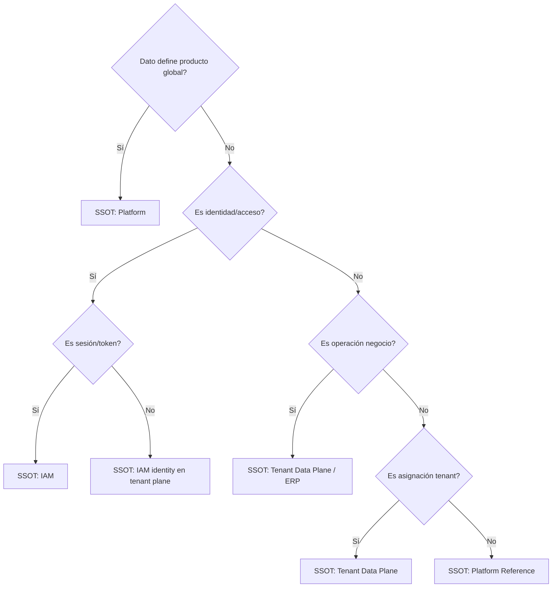

# 03 — Single Source of Truth (SSOT)

**Etapa:** 3 — Canonical Data Model  
**Fecha:** 2026-06-25  
**Estado:** Borrador para revisión

---

## 1. Propósito

Para cada dato canónico, definir la **única fuente oficial de verdad**, reglas de réplica, autoridad en conflicto, y responsable de sincronización.

**Principio:** Shared y Dedicated no crean SSOT duplicados; solo pueden crear **réplicas read-only** o **cachés** con reglas explícitas.

---

## 2. Leyenda de réplicas

| Tipo | Definición |
|------|------------|
| **Ninguna** | Solo existe una copia |
| **Cache** | Copia volátil; SSOT prevalece siempre |
| **Read Replica** | Copia durable read-only; SSOT en Platform |
| **Derived** | Calculado desde SSOT; no es copia independiente |
| **Forbidden** | Prohibido duplicar como writable |

---

## 3. SSOT por dato — Control Plane

| Dato | SSOT | ¿Copia permitida? | Autoridad en conflicto | Sincronizador |
|------|------|-------------------|------------------------|---------------|
| Tenant Registry | Platform | Forbidden writable | Platform | — |
| Installation Mode | Platform | Cache infra | Platform | Platform |
| Storage Endpoint Metadata | Platform | Cache infra (TTL) | Platform | Platform / Provisioning |
| Subscription / License | Platform | Cache IAM | Platform | Platform |
| Product Module | Platform | Read Replica en data plane (opcional) | Platform | Platform release pipeline |
| Product Menu | Platform | Read Replica (opcional) | Platform | Platform release |
| Product Permission | Platform | Read Replica (opcional) | Platform | permission_sync (startup) |
| Role Template | Platform | Ninguna (consulta central) | Platform | Platform |
| Platform Operator Identity | Platform | Ninguna | Platform | — |
| Platform Audit | Platform | Ninguna | Platform | — |
| Global System Config | Platform | Ninguna | Platform | — |

---

## 4. SSOT por dato — IAM

| Dato | SSOT | ¿Copia? | Autoridad | Sincronizador |
|------|------|---------|-----------|---------------|
| User Identity | **Tenant data plane** (per tenant) | Forbidden cross-tenant | IAM + Tenant Admin | — |
| Authentication Configuration | Tenant data plane | Ninguna | Tenant Admin | — |
| User Session | **IAM** | Cache Redis (no SSOT) | IAM | IAM |
| Refresh Token | **IAM** | Ninguna writable | IAM | IAM |
| Token Family | **IAM** | Ninguna | IAM | IAM |
| Access Token Blacklist | IAM | Redis cache | IAM | TTL expiry |
| Federated Identity Link | IAM | Ninguna | IAM | SSO sync |
| Impersonation Context | IAM | Redis ephemeral | IAM | IAM |
| IAM Audit | IAM | Ninguna | IAM | — |
| Effective Permission Set | **Derived** | Cache permission_resolver | Recalc from grants | IAM invalidation |

**Nota P0 (Q-010):** SSOT de Session/Token es **IAM** independientemente del almacén físico. La **ubicación de persistencia** es decisión técnica posterior; no define SSOT.

---

## 5. SSOT por dato — Tenant Grants & Org

| Dato | SSOT | ¿Copia? | Autoridad | Sincronizador |
|------|------|---------|-----------|---------------|
| Tenant Branding | Tenant data plane | Ninguna | Tenant Admin | — |
| Module Activation | Tenant data plane | Ninguna | Platform (alta) / Admin | Onboarding |
| Role (Tenant) | Tenant data plane | Ninguna | Tenant Admin | — |
| Role-Permission Grant | Tenant data plane | Ninguna | Tenant Admin | — |
| Role-Menu Grant | Tenant data plane | Ninguna | Tenant Admin | — |
| User-Role Assignment | Tenant data plane | Ninguna | Tenant Admin | — |
| Company | Tenant data plane | Ninguna | Tenant Admin | — |
| User Default Company | Tenant data plane (User Identity) | Ninguna | Tenant Admin | — |
| Document Sequence | Tenant data plane | Ninguna | ERP | ERP increment |

---

## 6. SSOT por dato — ERP

| Dato | SSOT | ¿Copia? | Autoridad | Sincronizador |
|------|------|---------|-----------|---------------|
| Todos maestros ERP | Tenant data plane | Forbidden en Platform | ERP / Tenant users | — |
| Todos documentos ERP | Tenant data plane | Forbidden | ERP workflow | — |
| Derivados (Stock, etc.) | **Derived from documents** | Ninguna independent | ERP pipeline | ERP process |
| Org Parameter | Tenant data plane (company scope) | Ninguna | ERP admin | — |
| ERP Audit | Tenant data plane | Ninguna append-only | ERP | — |

**Regla:** Platform **nunca** mantiene copia autoritativa de datos ERP, ni siquiera para reporting (salvo export bajo demanda = snapshot no SSOT).

---

## 7. SSOT por dato — Reference

| Dato | SSOT | ¿Copia? | Autoridad | Sincronizador |
|------|------|---------|-----------|---------------|
| Country, Region, Currency | Platform (Product Reference) | **Read Replica** permitida en data plane dedicated | Platform | Platform release / provisioning seed |
| Product catalog snapshot | Platform | Read Replica | Platform | Versioned sync |

**Regla dedicated:** Réplica geográfica/monetaria es **read-only**; actualizaciones vienen solo de Platform.

---

## 8. Matriz de decisión SSOT

---

## 9. Conflictos SSOT conocidos (AS-IS vs canónico)

| Dato | AS-IS | Canónico | Resolución |
|------|-------|----------|------------|
| Product Permission | Platform central | Platform | ✅ Alineado |
| Role-Permission Grant | Central shared BD | Tenant data plane | ⚠️ Migrar SSOT lógico a data plane |
| Company | Central (onboarding ADMIN) | Tenant data plane | ⚠️ Seed en data plane |
| User Identity | Central | Tenant data plane | ⚠️ Per-tenant store |
| Session | Central | IAM (ubicación TBD) | ⚠️ Ownership IAM claro; persistencia abierta |
| Document Sequence | Central (onboarding) | Tenant data plane | ⚠️ Mover seed |
| Geographic catalogs | Global en shared | Platform + optional replica | ⚠️ Definir réplica dedicated |

---

## 10. Reglas de réplica

1. **Writable replica forbidden** para cualquier dato con SSOT definido.
2. **Cache** debe invalidarse ante cambio SSOT (evento o TTL).
3. **Read replica** se refresca en release de producto o provisioning; nunca editada localmente.
4. **Derived** data nunca se sincroniza; se recalcula.
5. En migración Shared→Dedicated, **SSOT no cambia**; solo se mueve la copia autoritativa del data plane.

---

## 11. Autoridad en escenarios de conflicto

| Escenario | Prevalece |
|-----------|-----------|
| Cache permisos vs grants actualizados | Grants (SSOT) tras invalidación |
| Read replica catálogo vs Platform release | Platform |
| Stock manual vs movimiento procesado | Movimiento (SSOT transaccional) |
| JWT claims vs sesión revocada | Sesión IAM (SSOT) |
| Metadata instalación vs engine cache | Metadata Platform |

---

## 12. Conclusión SSOT

El modelo define **tres SSOT primarios**:

1. **Platform** — registro, catálogo producto, licencia, metadata instalación
2. **IAM** — sesión, tokens; identidad gobernada en data plane del tenant
3. **Tenant Data Plane (ERP)** — todo lo operativo + grants + org + secuencias

Shared vs Dedicated **no altera** esta tríada; solo el **número de almacenes físicos** que contienen copias autoritativas del data plane por tenant.
