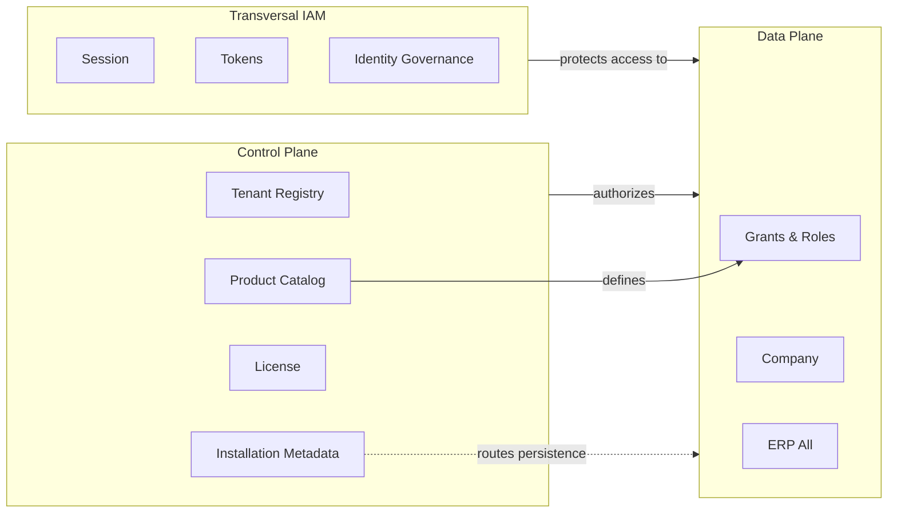

# 04 — Control Plane vs Data Plane

**Etapa:** 3 — Canonical Data Model  
**Fecha:** 2026-06-25  
**Estado:** Borrador para revisión

---

## 1. Definiciones

| Plano | Definición | Analogía |
|-------|------------|----------|
| **Control Plane** | Datos que gobiernan el SaaS como producto y servicio | "Sistema nervioso central" |
| **Data Plane** | Datos que pertenecen al tenant y su operación | "Datos del cliente" |
| **Transversal** | Datos de identidad/acceso que cruzan planos sin ser ERP | "Capa de confianza" |

**Regla:** Un dato pertenece a **un plano primario**. Transversal es subtipo con reglas IAM especiales.

---

## 2. Clasificación completa

### 2.1 Control Plane

| Dato | Justificación |
|------|---------------|
| Tenant Registry | Autoridad única del SaaS |
| Installation Mode | Política de despliegue |
| Storage Endpoint Metadata | Gobernanza infra (no datos negocio) |
| Subscription / License | Comercial Platform |
| Product Module, Menu, Permission | Definición de producto |
| Role Template | Plantilla producto |
| Platform Operator Identity | Operadores internos |
| Platform Audit | Gobernanza |
| Provisioning State | Orquestación |
| Global System Configuration | Parámetros SaaS |
| Product Reference (Country, Currency) | Catálogo maestro producto |

**Criterio:** Si afecta **más de un tenant** o define **qué es el producto**, es Control Plane.

---

### 2.2 Data Plane

| Dato | Justificación |
|------|---------------|
| Tenant Branding | Personalización del suscriptor |
| Module Activation | Asignación tenant (no definición) |
| Role (Tenant) | Configuración del tenant |
| Role-Permission Grant | Asignación local |
| Role-Menu Grant | Asignación local |
| User-Role Assignment | Configuración tenant |
| Company | Estructura operativa tenant |
| User Identity (perfil) | Pertenece al tenant |
| Authentication Configuration | Política del tenant |
| Document Sequence | Operación ERP |
| Todos maestros ERP | Negocio del tenant |
| Todos documentos ERP | Negocio del tenant |
| Derivados ERP | Negocio del tenant |
| Org Parameter | Config operativa |
| ERP Audit | Trazabilidad operativa |

**Criterio:** Si es **propiedad del tenant** y **no define el producto global**, es Data Plane.

---

### 2.3 Transversal (IAM)

| Dato | Justificación |
|------|---------------|
| User Session | Cruza requests; no es dato ERP |
| Refresh Token / Token Family | Estado auth |
| Access Token Blacklist | Revocación |
| Federated Identity Link | Puente auth |
| Impersonation Context | Operación cross-tenant auditada |
| IAM Audit | Seguridad transversal |
| Effective Permission Set (cache) | Derivado IAM |

**Criterio:** Gobierna **acceso** sin ser **operación de negocio**.

**Nota:** User Identity tiene componente Data Plane (perfil) + gobierno IAM (credenciales). Clasificación primaria: **Transversal con persistencia en Data Plane del tenant**.

---

## 3. Diagrama de clasificación

---

## 4. Datos con clasificación dual (desambiguados)

| Dato | Plano primario | Componente secundario | Resolución |
|------|----------------|----------------------|------------|
| User Identity | Transversal (IAM) | Data Plane (perfil) | IAM gobierna; persiste en data plane tenant |
| Module Activation | Data Plane | Control (autorización Platform) | Platform autoriza; registro en data plane |
| Authentication Config | Data Plane | Transversal (IAM consume) | Tenant dueño; IAM valida |
| Product Permission | Control Plane | — | Solo definición; grants en DP |
| Document Sequence | Data Plane (ERP) | — | Puramente operativo |
| Geographic Catalog | Control Plane (REF) | Data Plane (réplica read-only) | SSOT Platform |

---

## 5. Respuesta a Q-001 y Q-002 (Etapa 1)

### Q-001: ¿Qué datos pertenecen exclusivamente al Control Plane?

**Respuesta canónica (ownership definido):**

- Tenant Registry, Installation Mode, Storage Metadata
- Product Catalog completo (Module, Menu, Permission, Role Template)
- Subscription / License
- Platform Operator Identity
- Platform Audit
- Global System Configuration
- Product Reference maestros (Country, Currency)

**Excluidos explícitamente del Control Plane:**

- Sesiones y tokens (Transversal IAM)
- User Identity perfiles (Data Plane + IAM)
- Grants, roles tenant, company, todo ERP

### Q-002: ¿Qué datos pertenecen exclusivamente al Data Plane?

**Respuesta canónica:**

- Company y estructura organizacional
- Roles tenant, grants, user-role assignments
- Module Activation (asignación)
- Tenant Branding
- Authentication Configuration (políticas tenant)
- Document Sequences
- **100% datos ERP** (maestros, documentos, derivados)
- ERP Audit

**Excluidos del Data Plane puro:**

- Definiciones de producto (Control Plane)
- Sesiones IAM (Transversal — aunque persistan físicamente en algún almacén)

---

## 6. Impacto Shared vs Dedicated en clasificación

| Plano | Shared | Dedicated | Cambia clasificación |
|-------|--------|-----------|---------------------|
| Control Plane | Almacén central | Almacén central | **No** |
| Data Plane | Almacén compartido lógico | Almacén exclusivo | **No** |
| Transversal IAM | Persistencia TBD | Persistencia TBD | **No** |

**Principio D4 confirmado:** Solo cambia **ubicación**, no **plano**.

---

## 7. Fronteras prohibidas

| Cruce | Permitido |
|-------|-----------|
| Control Plane lee Data Plane ERP operativo | **No** (salvo export auditado) |
| Data Plane modifica Product Permission | **No** |
| ERP escribe Tenant Registry | **No** |
| Platform escribe Stock | **No** |
| IAM escribe Purchase Order | **No** |

---

## 8. Consolidado por plano (conteo)

| Plano | Familias de datos | ~% modelo |
|-------|-------------------|-----------|
| Control Plane | 12 familias P-* | ~15% |
| Transversal IAM | 10 familias I-* | ~10% |
| Data Plane | T-*, O-*, E-*, A-01 | ~75% |

El **volumen** de datos vive en Data Plane; el **control** vive en Control Plane + IAM.

---

## 9. Conclusión

La clasificación Control Plane / Data Plane / Transversal es **estable** para todos los modos de instalación. Resuelve conceptualmente Q-001 y Q-002. La **ubicación física de sesiones IAM** (Q-010) no redefine el plano — permanece Transversal.
