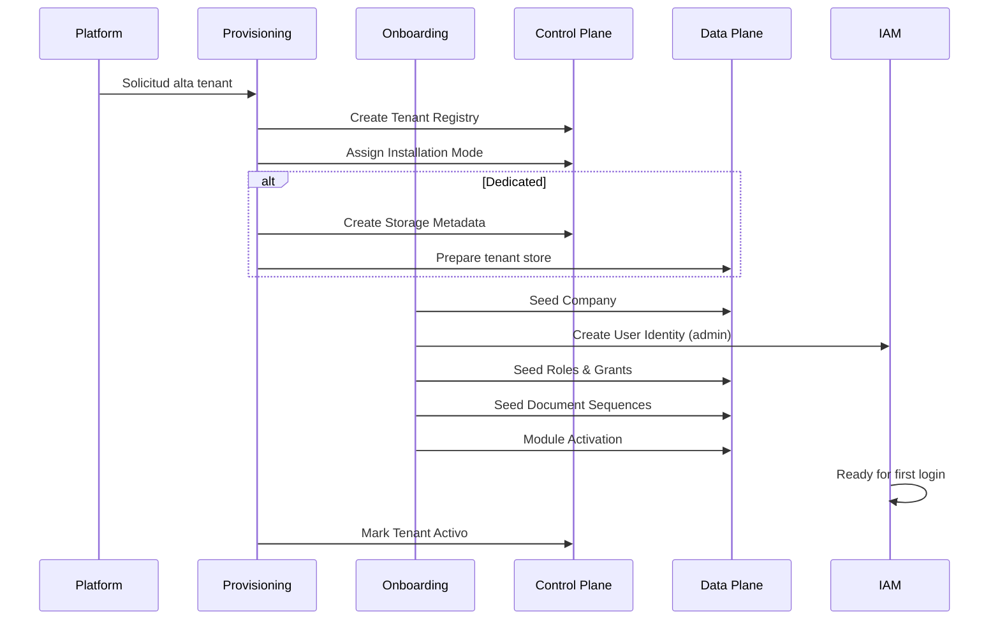

# 05 — Ciclo de Vida de Datos (Data Lifecycle)

**Etapa:** 3 — Canonical Data Model  
**Fecha:** 2026-06-25  
**Estado:** Borrador para revisión

---

## 1. Propósito

Documentar **quién crea, actualiza, elimina y consulta** cada familia de datos, y qué ocurre en eventos clave: onboarding, baja de tenant, migración Shared→Dedicated.

---

## 2. Leyenda de actores

| Actor | Descripción |
|-------|-------------|
| **PLT** | Platform / Superadmin |
| **PROV** | Provisioning (orquestado por Platform) |
| **ONB** | Onboarding |
| **TADM** | Tenant Administrator |
| **USER** | Usuario ERP estándar |
| **IAM** | Servicios IAM |
| **ERP** | Servicios ERP |
| **SYS** | Jobs sistema / cleanup |

---

## 3. Lifecycle por familia de datos

### 3.1 Tenant Registry (P-01)

| Fase | Actor | Acción |
|------|-------|--------|
| Create | PROV / PLT | Alta tenant |
| Read | PLT, IAM, TADM (limitado), FE |
| Update | PLT | Plan, estado, branding metadata |
| Delete | PLT | Soft retire → hard delete post-retención |
| Onboarding | PROV crea registro inicial |
| Baja tenant | PLT marca Retirado; datos data plane en retención |
| Migración | PLT actualiza Installation Mode + Metadata |

### 3.2 Installation Mode & Storage Metadata (P-02, P-03)

| Fase | Actor | Acción |
|------|-------|--------|
| Create | PROV | Al alta dedicated; default Shared en shared |
| Read | Infra (interno), PLT |
| Update | PLT | Solo migración gobernada |
| Delete | PLT | Al retiro tenant |
| Onboarding Shared | PROV asigna Shared (implícito) |
| Onboarding Dedicated | PROV crea metadata + almacén |
| Migración | PLT orquesta; estado Migrando |

### 3.3 Product Catalog (P-05..P-08)

| Fase | Actor | Acción |
|------|-------|--------|
| Create | PLT (release) | permission_sync, seeds |
| Read | Todos los tenants (read-only) |
| Update | PLT | Versionado producto |
| Delete | PLT | Deprecate, nunca hard delete permisos activos |
| Onboarding | ONB consume catálogo existente |
| Baja tenant | Sin impacto catálogo |
| Migración | Sin impacto |

### 3.4 User Identity (I-01)

| Fase | Actor | Acción |
|------|-------|--------|
| Create | ONB (admin), TADM |
| Read | TADM, IAM, USER (self) |
| Update | TADM, USER (perfil), IAM (password) |
| Delete | TADM | Soft deactivate (es_activo) |
| Onboarding | ONB crea admin |
| Baja tenant | Retención; luego purge con data plane |
| Migración | **Copia** data plane tenant a nuevo almacén |

### 3.5 Session & Tokens (I-03..I-05)

| Fase | Actor | Acción |
|------|-------|--------|
| Create | IAM (login) |
| Read | IAM, TADM (sesiones activas) |
| Update | IAM (rotation, touch activity) |
| Delete | IAM (logout, revoke, expiry) |
| Onboarding | N/A hasta primer login |
| Baja tenant | IAM revoca todas; SYS cleanup |
| Migración | **Invalidar todas**; re-login requerido |

### 3.6 Roles & Grants (T-03..T-06)

| Fase | Actor | Acción |
|------|-------|--------|
| Create | ONB (seed), TADM |
| Read | TADM, IAM |
| Update | TADM |
| Delete | TADM | Soft en roles custom; sistema no delete |
| Onboarding | ONB seed ADMIN/MANAGER/USER + grants |
| Baja tenant | Retención / purge |
| Migración | Copia con data plane |

### 3.7 Company (T-07)

| Fase | Actor | Acción |
|------|-------|--------|
| Create | ONB (EMP001), TADM |
| Read | USER, ERP |
| Update | TADM |
| Delete | TADM | Soft |
| Onboarding | ONB seed empresa inicial |
| Baja tenant | Retención |
| Migración | Copia data plane |

### 3.8 Document Sequence (T-09)

| Fase | Actor | Acción |
|------|-------|--------|
| Create | ONB (seed), ERP (auto) |
| Read | ERP |
| Update | ERP (increment atómico) |
| Delete | Prohibido en operación |
| Onboarding | ONB seed 9 entidades |
| Migración | Copia; verificar contadores post-migración |

### 3.9 ERP Masters & Documents (E-*)

| Fase | Actor | Acción |
|------|-------|--------|
| Create | USER autorizado vía ERP |
| Read | USER autorizado |
| Update | USER / workflow |
| Delete | Soft (es_activo) / anulación workflow |
| Onboarding | Vacío (salvo seeds mínimos) |
| Baja tenant | Retención legal → purge |
| Migración | Bulk copy data plane |

### 3.10 ERP Derived (Stock, Kardex)

| Fase | Actor | Acción |
|------|-------|--------|
| Create/Update | ERP pipeline only |
| Read | USER |
| Delete | Solo vía reversión proceso |
| Migración | Recalcular o copiar; validar consistencia |

---

## 4. Evento: Onboarding

**Datos creados por plano en onboarding:**

| Plano | Datos creados |
|-------|---------------|
| Control Plane | Tenant Registry, Mode, Metadata (si dedicated), License |
| Data Plane | Company, Roles, Grants, Sequences, Module Activation, Auth Config |
| IAM | User Identity |
| ERP | Ninguno operativo (vacío) |

---

## 5. Evento: Baja de tenant (Retirado)

| Plano | Acción |
|-------|--------|
| Control Plane | Tenant Registry → Retirado; revocar License |
| IAM | Revocar todas las sesiones; desactivar identidades |
| Data Plane | Retención según política → purge |
| Dedicated store | Drop o archive post-retención (decisión ops) |
| Control Plane audit | Registrar baja |

**Orden:** Suspender acceso (IAM) → retener datos → purge gobernado.

---

## 6. Evento: Migración Shared → Dedicated

| Fase | Datos afectados | Acción |
|------|-----------------|--------|
| Pre | Tenant Registry | Estado → Migrando |
| 1 | IAM Sessions | Invalidar todas |
| 2 | Data Plane completo | Copy/export → import dedicated store |
| 3 | Storage Metadata | Crear/activar dedicated endpoint |
| 4 | Installation Mode | Shared → Dedicated |
| 5 | Control Plane | Tenant → Activo |
| Post | Document Sequences | Validar contadores |
| Post | Derived ERP | Validar o recalcular stock |

**Control Plane catálogo:** Sin migración (permanece central).

**SSOT:** No cambia; solo se **mueve** copia autoritativa data plane.

---

## 7. Evento: Suspensión

| Dato | Acción |
|------|--------|
| Tenant Registry | estado_suscripcion → suspendido |
| IAM | Bloquear login nuevos; opcional revocar sesiones |
| Data Plane | Preservado intacto |
| ERP | Solo lectura o bloqueo total (política producto) |

---

## 8. Retención conceptual

| Modo | Data Plane post-retiro |
|------|------------------------|
| Shared | Soft-delete lógico; filas permanecen en almacén compartido |
| Dedicated | Almacén archivado o eliminado tras periodo retención |

**Decisión comercial pendiente:** duración retención (Q-052).

---

## 9. Soft delete universal

| Dato | Mecanismo |
|------|-----------|
| ERP entities | es_activo = 0 |
| User Identity | es_activo = 0 |
| Company | es_activo = 0 |
| Roles custom | es_activo = 0 |
| Tenant Registry | estado Retirado (no DELETE físico inmediato) |

**Prohibido:** DELETE físico ERP en operación normal.

---

## 10. Conclusión lifecycle

- **Onboarding** es el evento más crítico — crea datos en ambos planos
- **Migración** mueve data plane; invalida sesiones; no toca catálogo producto
- **Baja** revoca acceso primero; preserva datos según compliance
- Lifecycle es **independiente del modo** salvo purge físico dedicated
