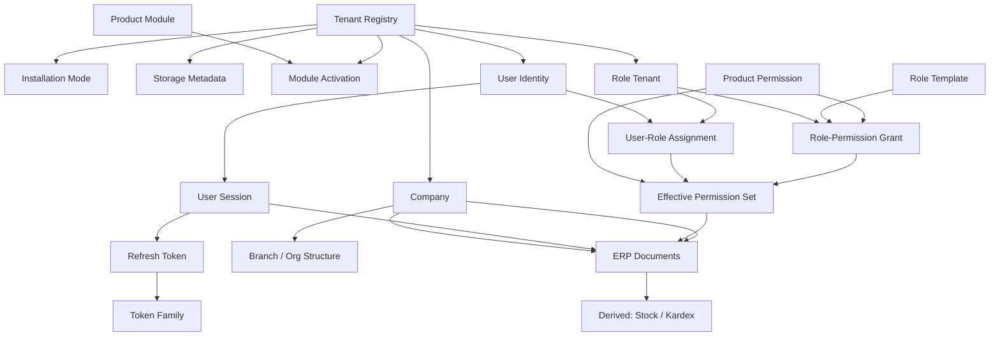

# 06 — Mapa de Dependencias entre Datos

**Etapa:** 3 — Canonical Data Model  
**Fecha:** 2026-06-25  
**Estado:** Borrador para revisión

---

## 1. Propósito

Identificar **dependencias fuertes** (bloqueantes) y **débiles** (referenciales) entre datos canónicos.

---

## 2. Leyenda

| Tipo | Símbolo | Significado |
|------|---------|-------------|
| Fuerte | `──▶` | B no puede existir sin A |
| Débil | `- - ▶` | B referencia A; A puede cambiar |
| Deriva | `⇢` | B calculado desde A |

---

## 3. Cadena principal (cadena crítica)



---

## 4. Dependencias por capa

### 4.1 Control Plane (raíz)

```
Tenant Registry
  ├── Installation Mode
  ├── Storage Endpoint Metadata
  ├── Subscription / License
  └── Module Activation (autorización)
        └── requiere Product Module (catálogo)

Product Module
  ├── Product Menu
  └── Product Permission
        └── Role Template
```

**Fuertes:** Tenant → Mode, Tenant → Module Activation  
**Débiles:** License → Module Activation (límites)

---

### 4.2 IAM / Transversal

```
Tenant Registry ──▶ User Identity
User Identity ──▶ User Session ──▶ Refresh Token ──▶ Token Family
User Identity ──▶ User-Role Assignment
Product Permission ──▶ Role-Permission Grant ──▶ Effective Permission Set
User Session ──▶ Access Token State (blacklist)
Platform Operator ──▶ Impersonation Context ──▶ User Session (target)
```

**Fuertes:** Identity → Session; Session → Refresh  
**Débiles:** Blacklist → Session (revocación)

---

### 4.3 Tenant Admin / Data Plane

```
Tenant Registry ──▶ Company
Company ──▶ User Default Company (on User Identity)
Role Tenant ──▶ Role-Permission Grant
Role Tenant ──▶ Role-Menu Grant
Role Tenant ──▶ User-Role Assignment
Company ──▶ Document Sequence (scope tenant)
```

---

### 4.4 ERP

```
Company ──▶ Org Structure (Branch, Department, …)
Company ──▶ ERP Masters (scoped)
ERP Masters ──▶ ERP Documents
ERP Documents ──⇢ Derived (Stock, Balances)
Document Sequence ──▶ ERP Documents (códigos)
Effective Permission Set ──▶ ERP Documents (autorización)
Company ──▶ ERP Documents (scope operativo)
```

**Fuerte crítica:** Company → ERP Documents (multiempresa)

---

## 5. Matriz de dependencias fuertes

| Dato dependiente | Requiere | Tipo |
|------------------|----------|------|
| Module Activation | Tenant Registry + Product Module | Fuerte |
| User Identity | Tenant Registry | Fuerte |
| User Session | User Identity | Fuerte |
| Refresh Token | User Session | Fuerte |
| Role (Tenant) | Tenant Registry | Fuerte |
| Role-Permission Grant | Role + Product Permission | Fuerte |
| User-Role Assignment | User + Role | Fuerte |
| Company | Tenant Registry | Fuerte |
| ERP Document | Company + Tenant context | Fuerte |
| Stock (derived) | Movement (processed) | Fuerte (derivación) |
| Storage Metadata | Tenant Registry + Installation Mode | Fuerte (dedicated) |
| Effective Permission Set | Grants + Assignments | Fuerte (derivación) |

---

## 6. Matriz de dependencias débiles

| Dato | Referencia | Impacto si cambia |
|------|------------|-------------------|
| Role-Menu Grant | Product Menu | Menú obsoleto; no break seguridad |
| ERP Master | Geographic Catalog | Actualización catálogo Platform |
| User Identity | Company (default) | Reasignar default |
| Module Activation | License | Feature gate |
| Document Sequence | Company | Scope por tenant, no por empresa |

---

## 7. Dependencias cross-plano

| Desde | Hacia | Tipo | Notas |
|-------|-------|------|-------|
| Control Plane (Product Permission) | Data Plane (Grant) | Referencia ID | SSOT Platform |
| Control Plane (Tenant Registry) | Data Plane (todo) | Scope | tenant_id |
| Transversal (Session) | Data Plane (ERP) | Autorización | No datos |
| Transversal (Effective Permissions) | Data Plane (ERP) | Gate | Cache |
| Control Plane (Storage Metadata) | Infra → Data Plane | Routing | No negocio |

**Prohibido:** Data Plane → Control Plane write dependency.

---

## 8. Orden de creación (onboarding)

| Orden | Dato | Plano |
|-------|------|-------|
| 1 | Tenant Registry | CP |
| 2 | Installation Mode + Storage Metadata | CP |
| 3 | Product catalog (pre-existente) | CP |
| 4 | Company | DP |
| 5 | Role (Tenant) | DP |
| 6 | User Identity | IAM/DP |
| 7 | User-Role Assignment | DP |
| 8 | Role-Permission Grant | DP |
| 9 | Module Activation | DP |
| 10 | Auth Configuration | DP |
| 11 | Document Sequence | DP |
| 12 | User Session | IAM (post login) |

Violación de orden produce dependencias rotas (ej. Grant sin Role).

---

## 9. Orden de eliminación (baja tenant)

| Orden | Acción |
|-------|--------|
| 1 | Revocar Sessions (IAM) |
| 2 | Desactivar User Identities |
| 3 | Marcar Tenant Retirado (CP) |
| 4 | Retener Data Plane (compliance) |
| 5 | Purge Data Plane (post-retención) |
| 6 | Eliminar Storage Metadata |
| 7 | Archive/drop dedicated store |

---

## 10. Dependencias críticas para Dedicated

| Dependencia | Riesgo si mal resuelta |
|-------------|------------------------|
| Storage Metadata → Data Plane access | Tenant inaccesible |
| Product Permission (CP) → Grant (DP) cross-store | RBAC roto |
| Session (IAM) → User Identity (DP) cross-store | Login fallido |
| Company (DP) → ERP (DP) same store | OK si mismo almacén tenant |
| Reference catalog replica → ERP forms | Campos vacíos |

---

## 11. Grafo simplificado (texto)

```
Platform Catalog (independiente)
        │
Tenant Registry ─────────────────────────────┐
        │                                    │
        ├─▶ Installation / Storage           │
        ├─▶ Module Activation ◀── Product Module
        │                                    │
        ├─▶ Company ──▶ ERP (all) ◀──────────┤
        │         ▲                          │
        ├─▶ Roles/Grants ◀── Product Permission
        │         │                          │
        └─▶ User Identity ──▶ Session ──▶ ERP access
```

---

## 12. Conclusión

- **Raíz absoluta:** Tenant Registry
- **Cadena auth:** Identity → Session → Permissions → ERP
- **Cadena operativa:** Company → ERP Documents → Derived
- **Dependencia cross-plano más sensible:** Product Permission → Grants (CP→DP)
- **Dedicated amplifica:** dependencias cross-almacén en IAM y RBAC — no cambia el grafo lógico
