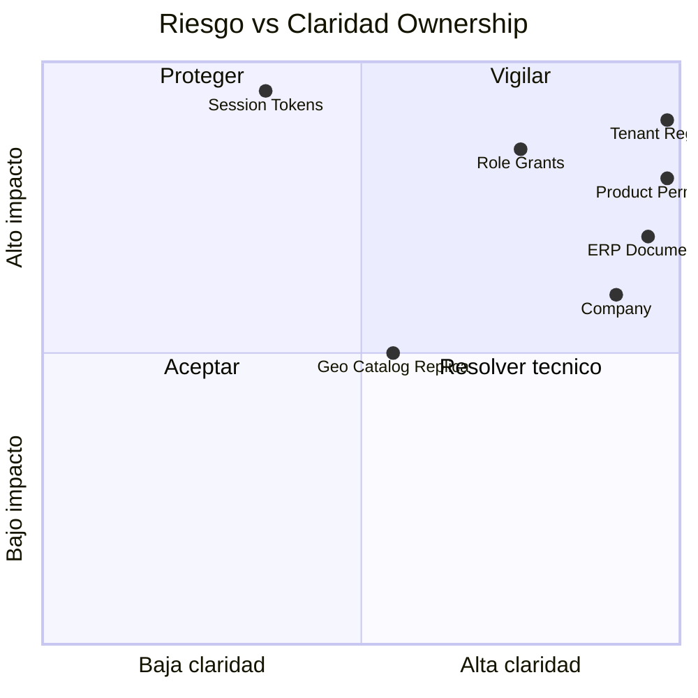

# 08 — Riesgos del Modelo de Datos

**Etapa:** 3 — Canonical Data Model  
**Fecha:** 2026-06-25  
**Estado:** Borrador para revisión

---

## 1. Propósito

Identificar riesgos derivados del modelo canónico y del **gap AS-IS → canónico**, sin proponer implementación.

---

## 2. Datos con ownership ambiguo

| ID | Dato | Ambigüedad | Estado canónico | Riesgo |
|----|------|------------|-----------------|--------|
| A-01 | User Session / Refresh Token | Dueño IAM claro; **persistencia** no definida | Ownership ✅ / Store ❌ | Alto |
| A-02 | User Identity | IAM vs Tenant Admin | Resuelto: IAM gobierna, TNT administra | Bajo |
| A-03 | Module Activation | Platform autoriza vs Tenant posee | Resuelto: assignment en DP | Bajo |
| A-04 | Authentication Configuration | Platform-like vs tenant policy | Resuelto: Tenant DP | Bajo |
| A-05 | Company | Tenant vs ERP-ORG | Resuelto: Tenant dueño, ERP opera | Bajo |
| A-06 | Geographic Catalog | Global vs local dedicated | Parcial: Platform SSOT + réplica | Medio |

---

## 3. Datos compartidos (multi-consumer)

| Dato | Consumidores | Riesgo | Mitigación conceptual |
|------|--------------|--------|----------------------|
| Product Permission | IAM, Onboarding, Menu, FE | Drift si copia writable | SSOT Platform; read-only refs |
| Tenant Registry | Middleware, IAM, Platform, FE | SPOF | Alta disponibilidad central |
| Effective Permission Set | IAM, ERP gates | Stale cache | Invalidación en grant change |
| Company | IAM context, todo ERP | Scope leak | assert_row_empresa |
| Document Sequence | Múltiples módulos ERP | Contention | Incremento atómico |
| Reference Catalog | ERP forms, validaciones | Dedicated sin réplica | Provisioning seed réplica |

---

## 4. Datos con doble responsabilidad (AS-IS)

| Dato | Responsabilidad 1 | Responsabilidad 2 | Gap AS-IS | Riesgo Dedicated |
|------|-------------------|---------------------|-----------|------------------|
| Almacén central actual | Control Plane | Data Plane ERP | Mezclados | Escritura ERP en store incorrecto |
| Onboarding TX | Platform registry | ERP seed | Una transacción | TX imposible cross-store |
| User Identity + Session | IAM | Central store compartido | Co-ubicados | Split store en dedicated |
| Role Grant + Product Permission | Tenant + Platform | Join en query | Cross-store join | RBAC resolution |
| cfg_codigo_secuencia | ERP domain | Central onboarding | Ubicación | Seed en wrong store |

---

## 5. Datos que generan acoplamiento

| Acoplamiento | Datos involucrados | Tipo | Severidad |
|--------------|-------------------|------|-----------|
| CP → DP join runtime | Product Permission ↔ Grant | Referencial | Alta |
| IAM → DP runtime | Session ↔ User Identity | Identidad | Alta |
| Middleware → CP | Host → Tenant Registry | Routing | Crítica |
| ERP → IAM | Document → Effective Permission | Autorización | Media |
| Platform → Infra | Storage Metadata → Engine | Técnico (fuera modelo) | Alta |
| Onboarding → CP+DP | Todos seed data | Orquestación | Crítica |

**Regla:** Acoplamientos **referenciales read-only** (Permission ID) son aceptables. Acoplamientos **join transaccional** cross-plano son deuda.

---

## 6. Datos que podrían romper Dedicated

| ID | Escenario | Dato | Impacto |
|----|-----------|------|---------|
| D-01 | Grant en central; ERP en dedicated | Role-Permission Grant | Permisos no resueltos |
| D-02 | Session central; user dedicated | User Session | Refresh fallido |
| D-03 | Onboarding seed ERP en central | Company, Sequence | Datos en almacén wrong |
| D-04 | Sin réplica catálogo geo | Reference Catalog | Forms incompletos |
| D-05 | Product Permission solo central sin servicio resolución | Permission | 403 masivo |
| D-06 | Tenant filter omitido en dedicated | ERP data | Fuga si shared pattern copy |
| D-07 | Metadata ausente post-alta | Storage Metadata | Fallback Shared incorrecto |
| D-08 | Migración parcial data plane | All DP | Tenant corrupto |

---

## 7. Riesgos por categoría

### 7.1 Frontera CP/DP

| Riesgo | Probabilidad | Impacto |
|--------|--------------|---------|
| Platform lee ERP para reporting | Media | Alto compliance |
| ERP escribe Tenant Registry | Baja | Crítico |
| Catálogo producto editable por tenant | Baja | Crítico producto |

### 7.2 IAM

| Riesgo | Probabilidad | Impacto |
|--------|--------------|---------|
| Session split across stores | Alta (si mal decidido) | Crítico auth |
| Stale permission cache post-grant | Media | Alto seguridad |
| Impersonation sin acceso dedicated store | Media | Alto soporte |

### 7.3 ERP

| Riesgo | Probabilidad | Impacto |
|--------|--------------|---------|
| Modificar queries por modo | Media (si viola guardrails) | Fork lógico |
| Derived data edit directo | Baja | Crítico integridad |
| Sequence gap post-migración | Media | Alto operación |

### 7.4 Lifecycle

| Riesgo | Probabilidad | Impacto |
|--------|--------------|---------|
| Onboarding orden incorrecto | Media | Tenant incompleto |
| Migración sin invalidar sesiones | Alta | Tokens inválidos confusos |
| Purge dedicated prematuro | Baja | Compliance/legal |

---

## 8. Mapa riesgo × ownership

---

## 9. Deuda AS-IS → Canónico (priorizada)

| Prioridad | Gap | Datos |
|-----------|-----|-------|
| P0 | TX cross-plane onboarding | Company, Sequences, Grants, Identity |
| P0 | Session/User store decision | Session, Token, Identity |
| P1 | Grants SSOT en data plane | Role-Permission Grant |
| P1 | Reference réplica dedicated | Geographic, Currency |
| P2 | Permission resolver abstract | Effective Permission Set |

---

## 10. Señales de alerta en implementación futura

| Señal | Indica |
|-------|--------|
| Nuevo `if dedicated` en ERP service | Violación ownership |
| JOIN cross-almacén en query ERP | Acoplamiento |
| Platform endpoint lee stock | Violación frontera |
| Writable réplica catálogo | SSOT corruption |
| Dos SSOT para mismo dato | Modelo roto |
| Session en ERP module | Violación IAM |

---

## 11. Conclusión de riesgos

| Categoría | Count | Estado |
|-----------|-------|--------|
| Ownership ambiguo | 1 alto (session store) | Parcialmente resuelto |
| Datos compartidos | 6 | Gestionables con SSOT |
| Doble responsabilidad AS-IS | 5 | Requiere alineación persistencia |
| Acoplamiento cross-plano | 6 | 2 críticos (RBAC, onboarding) |
| Break dedicated scenarios | 8 | Mitigables con modelo canónico |

El modelo canónico **reduce** ambigüedad de ~10 datos a **1 decisión técnica pendiente** (persistencia sesiones IAM).
