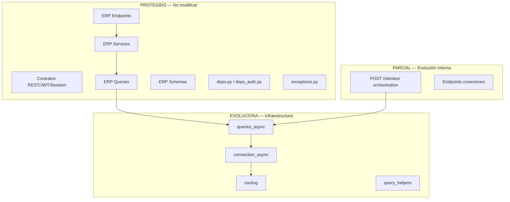

# 02 — Componentes Protegidos

**Etapa:** 2 — Architectural Impact Assessment  
**Fecha:** 2026-06-25  
**Estado:** Borrador para revisión  
**Principio:** Todo cambio fuera de esta lista requiere justificación técnica y ADR.

---

## 1. Propósito

Identificar componentes que **deben permanecer sin modificaciones** (o con cambios mínimos no observables) al incorporar Dedicated Database, para preservar:

- Funcionamiento actual de tenants Shared
- Compatibilidad con Frontend
- Contratos REST y OpenAPI
- Inversión en lógica ERP

---

## 2. Criterios de protección

Un componente es **protegido** si cumple alguna de:

1. No participa en resolución de persistencia
2. Su contrato externo está consumido por Frontend
3. Modificarlo implica riesgo de regresión en Shared sin beneficio
4. Contiene lógica de negocio ERP validada en producción/staging
5. Es normativamente estable (JWT, session contract certificado)

---

## 3. Frontend y contratos API

### 3.1 Protección absoluta

| Componente | Motivo | Modificación permitida |
|------------|--------|------------------------|
| Rutas HTTP (`/api/v1/*`) | Frontend acoplado a paths | Ninguna |
| Métodos HTTP por endpoint | Contrato REST | Ninguna |
| Códigos de status por operación | UX Frontend | Ninguna |
| Envelopes de paginación ERP | Contrato v1 ORG/INV | Ninguna |
| Prefijos de módulo (`/org`, `/inv`, …) | Routing FE | Ninguna |
| Tags OpenAPI por grupo | Documentación FE/dev | Solo aditivo |

### 3.2 Schemas / DTOs protegidos

| Área | Archivos | Regla |
|------|----------|-------|
| ERP Read/Create/Update | `modules/*/presentation/schemas*.py` | Sin campos nuevos obligatorios; sin eliminar campos |
| Auth request/response | `auth/presentation/schemas*.py` | Estables |
| Session schemas | `schemas_sessions.py` | Certificados IAM V2 |
| Error detail shape | `CustomException` → handler | Formato estable |
| Paginated responses | `shared/pagination/` | Sin cambio de envelope |

**Excepción documentada:** endpoints **nuevos** aditivos (ej. metadata provisioning) no rompen FE si son opt-in Platform Admin.

---

## 4. Contratos IAM

### 4.1 JWT Contract (protegido)

Documentos de referencia: `AUTH_FRONTEND_CONTRACT_CERTIFICATION.md`, `jwt.py`.

| Elemento | Proteger |
|----------|----------|
| Claims access token | `sub`, `cliente_id`, `jti`, `type`, `empresa_id`, `empresa_selection_pending`, `access_level`, `sid`, flags impersonación |
| Claims refresh token | Misma base + `type=refresh` |
| TTL access / refresh | Valores actuales salvo ADR explícito |
| Formato Bearer | Header `Authorization: Bearer` |
| Cookie refresh (web) | HttpOnly, nombres actuales |
| Selection token flow | Multiempresa post-login |
| Códigos 403/409 en auth | Semántica actual |

### 4.2 Session Contract (protegido)

| Endpoint | Proteger |
|----------|----------|
| `POST /auth/login/` | Request/response |
| `POST /auth/refresh/` | Rotación, cookies |
| `POST /auth/logout/` | Idempotente 200 |
| `POST /auth/logout_all/` | Semántica |
| `POST /auth/empresa/seleccionar/` | Selection flow |
| `POST /auth/empresa/cambiar/` | Cambio empresa |
| `GET /auth/me` | Payload sesión + probe V2 |
| `POST /auth/impersonate/*` | Superadmin |
| Active sessions admin | Listado/revocación |

**Impacto dedicated:** Debe ser **transparente** — mismo contrato, distinto almacén detrás.

---

## 5. Lógica ERP protegida

### 5.1 Services ERP (~120 archivos)

**Protección: TOTAL** para lógica de negocio.

Incluye sin modificación:

- Reglas de workflow (`inv_workflow_enforcement`, procesos PUR, etc.)
- Validaciones transaccionales
- Cálculos (totales, stock, asientos)
- Soft delete (`es_activo = 0`)
- Scope `cliente_id` + `empresa_id` como parámetros
- Servicios de listado paginado

**Única excepción futura:** si un servicio contiene ramas `database_type` (no identificadas en ERP hoy) — eliminar rama, no añadir.

### 5.2 Queries ERP (~140 archivos)

**Protección: TOTAL** para SQL y filtros.

- Sentencias SQLAlchemy Core
- Whitelist sort/pagination
- Filtros `cliente_id` / `empresa_id` explícitos
- Joins y locking (INV UPDLOCK)

La infraestructura debe adaptarse al query, no al revés.

### 5.3 Endpoints ERP (~130+ archivos endpoints)

**Protección: TOTAL.**

- Dependencies `require_erp_session`, `require_permission`
- `response_model`
- Rutas de proceso (`/procesar`, `/anular`, etc.)
- Deprecations marcadas — no tocar lógica

### 5.4 Domain helpers ERP

| Componente | Proteger |
|------------|----------|
| `shared/pagination/` | Sí |
| `shared/validators.py` | Sí |
| `inv_deps`, `org_deps`, `rbac_deps` | Sí |
| Exception mapping por módulo | Sí |

---

## 6. Platform Admin — mayormente protegido

| Componente | Protección | Nota |
|------------|------------|------|
| Superadmin usuarios CRUD | Total | ADMIN central |
| Superadmin auditoría | Total | |
| Catálogo módulos v2 | Total | |
| `GET/PUT /clientes/{id}` | Total | |
| `POST /clientes/` | **Parcial** | Response shape protegido; orchestration internal evoluciona |
| Endpoints conexiones | Parcial | Pueden extenderse aditivamente |

---

## 7. Tenant Admin — protegido

| Área | Proteger |
|------|----------|
| Users CRUD | Sí |
| Roles / permisos asignación | Sí |
| ORG empresas, sucursales, etc. | Sí |
| Auth config tenant | Sí |
| Admin password reset | Sí |

---

## 8. Componentes transversales protegidos

| Componente | Protección | Justificación |
|------------|------------|---------------|
| `core/exceptions.py` | Total | Mapeo HTTP estable |
| `require_permission` | Total | RBAC gate |
| `ERP_BACKEND_STANDARDS_V4` patterns | Total | Norma |
| Rate limiting | Total | |
| Query auditor (prod) | Total | Seguridad |
| Permission resolver API pública | Total | Cache interface |
| Menu resolver | Total | FE depende de árbol |

---

## 9. Componentes NO protegidos (explícitamente excluidos)

Estos **pueden y deben** evolucionar (ver `03_CHANGE_SURFACE.md`):

| Componente | Por qué no está protegido |
|------------|---------------------------|
| `connection_async.py` | Core de resolución |
| `routing.py` | Router tenant |
| `queries_async.py` | Executor central |
| `query_helpers.py` | Filtro tenant |
| `cliente_onboarding_service.py` | Cross-boundary AS-IS |
| `minimal_erp_tenant_bootstrap_service.py` | Seed en almacén incorrecto hoy |
| `user_context.py` (ramas multi) | Violación P5 |
| `rol_service.py` (ramas multi) | Violación P5 |
| Engine cache / shutdown | Operacional |
| Bootstrap apply pipeline | Dedicated provisioning |
| Tests integration dedicated | Nuevos |

---

## 10. Matriz de protección por capa

---

## 11. Regla de excepción

Cualquier modificación a un componente **protegido** requiere:

1. **ADR aprobado** con justificación de por qué la infraestructura no puede absorber el cambio
2. Evidencia de que Shared tenants no regresionan
3. Confirmación de compatibilidad Frontend (o versión FE coordinada — último recurso)
4. Entrada en changelog arquitectónico

**Default:** Si hay duda, proteger el componente y mover el cambio a infraestructura.

---

## 12. Resumen

| Categoría | % estimado codebase | Acción |
|-----------|---------------------|--------|
| ERP completo (presentation + application + queries) | ~65–70% | **Intacto** |
| Contratos IAM / FE | ~5% | **Intacto** |
| Platform admin (excepto onboarding) | ~8% | **Intacto** |
| IAM orquestación | ~7% | **Mayormente intacto** |
| Infraestructura persistencia | ~3% | **Evoluciona** |
| Onboarding / provisioning | ~2% | **Evoluciona** |
| Deuda `database_type` en services | <1% | **Refactor mínimo** (eliminar ramas) |
