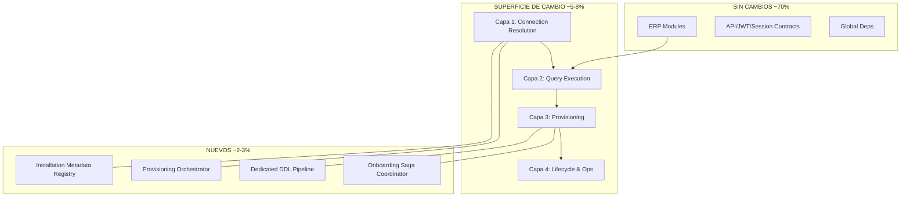

# 03 — Superficie de Cambio

**Etapa:** 2 — Architectural Impact Assessment  
**Fecha:** 2026-06-25  
**Estado:** Borrador para revisión  
**Principio:** Concentrar cambios en la mínima superficie posible.

---

## 1. Propósito

Identificar **exactamente dónde** deben concentrarse los cambios para soportar Dedicated Database, delimitar alcance esperado, y evitar dispersión de modificaciones en ERP o contratos FE.

---

## 2. Diagrama de superficie de cambio

---

## 3. Capa 1 — Resolución de conexiones (CRÍTICA)

### 3.1 Componentes afectados

| Componente | Archivo | Alcance esperado |
|------------|---------|------------------|
| Async engine factory | `connection_async.py` | Refinar cache keys, metadata injection, invalidación |
| Tenant connection router | `routing.py` | Completar path multi-DB; fallback policy |
| Connection metadata cache | `core/tenant/cache.py` | TTL, invalidación post-migración |
| Metadata query | `routing._query_connection_metadata_*` | Robustez, error handling |

### 3.2 Qué NO cambia en esta capa

- Enum `DatabaseConnection` (ADMIN vs DEFAULT) — semántica preservada
- Firma pública de `get_db_connection()` — consumidores existentes
- Driver (`aioodbc`) — sin cambio

### 3.3 Alcance cualitativo

| Aspecto | Extensión |
|---------|-----------|
| Líneas de código estimadas | Medio (centenas, no miles) |
| Riesgo | Crítico — punto único de fallo |
| Tenants Shared afectados | Solo si regresión; debe ser transparente |
| Tests requeridos | Integration multi-engine, cache invalidation |

### 3.4 Responsabilidad

Encapsular **toda** decisión Shared vs Dedicated. Ningún otro módulo elige almacén.

---

## 4. Capa 2 — Ejecución de queries (ALTA)

### 4.1 Componentes afectados

| Componente | Archivo | Alcance esperado |
|------------|---------|------------------|
| Query executor | `queries_async.py` | `_get_connection_context` — sin cambio de firma pública |
| Tenant filter | `query_helpers.py` | Encapsular comportamiento por modo sin filtrar en negocio |
| Global tables whitelist | `query_helpers.GLOBAL_TABLES` | Revisar catálogos en dedicated |
| Query auditor | `query_auditor.py` | Alinear reglas producción |

### 4.2 Principio de cambio

`execute_query()`, `execute_insert()`, `execute_update()` mantienen **misma firma**. El caller (ERP service) no sabe si el tenant es dedicated.

### 4.3 UnitOfWork

| Componente | Impacto |
|------------|---------|
| `unit_of_work.py` | **Sin cambio de API** — ya delega a `get_db_connection` |

UoW permanece fuera de la superficie de cambio activa.

### 4.4 Alcance cualitativo

| Aspecto | Extensión |
|---------|-----------|
| Cambios | Internos al executor y helpers |
| Queries ERP individuales | **Cero** |
| Riesgo | Alto — afecta 100% de acceso a datos |

---

## 5. Capa 3 — Provisioning & Onboarding (CRÍTICA)

### 5.1 Componentes afectados

| Componente | Archivo | Alcance |
|------------|---------|---------|
| Onboarding transaccional | `cliente_onboarding_service.py` | **Reestructuración orchestration** — no lógica RBAC |
| ERP seed | `minimal_erp_tenant_bootstrap_service.py` | Ejecutar contra almacén tenant resuelto |
| Conexiones CRUD | `conexion_service.py` | Integrar en flujo alta dedicated |
| Cliente service | `cliente_service.py` | Mínimo — delegación a saga |
| Onboarding RBAC | `onboarding_rbac_service.py` | Reutilizar; cambiar solo sesión/almacén |
| Owner sync / bundles | `owner_sync_service.py`, etc. | **Intactos** en lógica |

### 5.2 Componentes nuevos esperados (conceptuales)

| Componente nuevo | Rol | Nota |
|------------------|-----|------|
| Provisioning Orchestrator | Coordina pasos saga | No es Connection Resolver |
| Onboarding Saga Coordinator | Estados, compensación, idempotencia | ADR-004 |
| Installation Metadata Writer | Registra modo + almacén en Platform | Cierra Q-031 |
| Dedicated Schema Applicator | Aplica V010 a almacén nuevo | Pipeline ops |

### 5.3 Alcance cualitativo

| Aspecto | Extensión |
|---------|-----------|
| Cambio en response `POST /clientes/` | **Ninguno** (protegido) |
| Cambio en pasos internos | Alto |
| Estados tenant `Provisioning` | Nuevo (conceptual) |
| Shared onboarding path | Debe seguir funcionando idéntico externamente |

### 5.4 Separación de flujos (sin fork de código)

Un solo orchestrator con **pasos condicionales en infraestructura**, no dos servicios de onboarding paralelos.

---

## 6. Capa 4 — Lifecycle & operaciones (MEDIA)

### 6.1 Componentes afectados

| Componente | Alcance |
|------------|---------|
| `main.py` shutdown | Invocar `close_all_async_engines()` |
| Engine cache invalidation | Hook post-cambio metadata |
| Health check | Opcional: verificar almacén dedicated |
| Bootstrap scripts | Extensión `bootstrap_v2_sql_apply` per-tenant |
| Integration test harness | `conftest` dedicated |

### 6.2 Background jobs

| Job | Alcance |
|-----|---------|
| `refresh_token_cleanup_job` | Muy bajo — likely sin cambio |
| Permission sync | Nulo |

---

## 7. Capa 5 — Deuda a eliminar (BAJA, dispersa)

Servicios con ramas `database_type` en lógica de aplicación:

| Archivo | Cambio |
|---------|--------|
| `core/auth/user_context.py` | Eliminar ramas multi; delegar a infra |
| `modules/rbac/application/services/rol_service.py` | Idem |

**Alcance:** Refactor localizado (<5 funciones). No justifica tocar queries ni endpoints.

---

## 8. Mapa de concentración vs dispersión

| Zona | % cambio estimado | Riesgo regresión Shared |
|------|-------------------|-------------------------|
| `infrastructure/database/` + `core/tenant/routing` | 45% | Medio-Alto |
| `modules/tenant/` (onboarding) | 30% | Alto |
| `core/auth/user_context`, `rol_service` | 5% | Bajo |
| `main.py`, scripts, tests | 15% | Bajo |
| `modules/inv|org|pur|...` (ERP) | **0%** | Nulo |
| `modules/auth/presentation` | **0%** | Nulo |

---

## 9. Lo que explícitamente queda FUERA de la superficie

| Elemento | Motivo |
|----------|--------|
| Connection Resolver como clase nueva | Etapa técnica posterior — no diseñar aquí |
| Nuevo middleware | TenantMiddleware suficiente con metadata |
| Fork `execute_query_shared` / `execute_query_dedicated` | Violaría single codebase |
| Cambios OpenAPI | Frontend transparency |
| Nuevo `DatabaseConnection.DEDICATED` enum | DEFAULT + metadata es suficiente |
| Modificar 153 query files | Infrastructure encapsulation |
| Session factory global (`SessionLocal`) | No existe; no introducir |

---

## 10. Orden sugerido de intervención (impacto, no implementación)

| Fase | Superficie | Objetivo |
|------|------------|----------|
| 0 | Tests harness dedicated | Red de seguridad |
| 1 | Capa 1 + 2 | Resolución transparente |
| 2 | Verificar Shared sin regresión | Gate obligatorio |
| 3 | Capa 3 provisioning | Alta tenant dedicated |
| 4 | Capa 4 lifecycle | Operaciones |
| 5 | Capa 5 deuda | Limpieza ramas multi |
| 6 | Migración shared→dedicated | Fuera MVP |

---

## 11. Métricas de superficie

| Métrica | Valor estimado |
|---------|----------------|
| Archivos a modificar (existentes) | 12–18 |
| Archivos nuevos (conceptuales) | 4–6 |
| Archivos ERP a modificar | **0** |
| Endpoints a modificar | **0** (aditivos opcionales Platform) |
| Contratos JWT/Session a modificar | **0** |
| % codebase tocado | **< 8%** |

---

## 12. Conclusión

La superficie de cambio **debe** concentrarse en:

1. **Resolución de conexión** (`connection_async` + `routing`)
2. **Executor de queries** (`queries_async` + `query_helpers`)
3. **Orquestación onboarding/provisioning** (`tenant/` services)

Todo lo demás es **fuera de alcance** salvo deuda menor en 2 servicios IAM/RBAC.

Esta concentración es coherente con el principio de **Infrastructure Encapsulation** del modelo conceptual Etapa 1.
