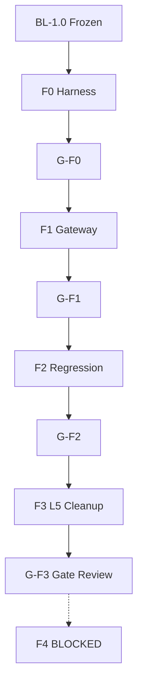

# 01 — Implementation Execution Plan

**Etapa:** 5.7 — Implementation Planning  
**Versión plan:** IP-1.0  
**Fecha:** 2026-06-25  
**Baseline:** BL-1.0 (FROZEN)  
**Alcance autorizado:** Fases **F0–F3** únicamente  
**Restricción:** Planificación. Sin implementación en esta etapa.

---

## 1. Propósito

Transformar la Architecture Baseline BL-1.0 en un **plan de ejecución secuencial, verificable y sin improvisación** para Etapa 6.

**Fuente única de verdad arquitectónica:** `architecture-baseline/`

---

## 2. Resumen ejecutivo del plan

| Aspecto | Valor |
|---------|-------|
| Fases en scope | F0, F1, F2, F3 |
| Work packages | 22 (ver `02_WORK_PACKAGES.md`) |
| Pull Requests planificados | 18 |
| Duración estimada | 6–10 semanas (equipo 2–3 devs) |
| Merge strategy | Trunk-based con feature branches cortas |
| Gate final | G-F3 → Gate Review (F4 bloqueado) |

---

## 3. Mapa de fases

```
┌──────────────────────────────────────────────────────────────────┐
│ F0 — Test Harness & Safety Net          │ ~1–2 sem │ 5 PRs      │
├──────────────────────────────────────────────────────────────────┤
│ F1 — Persistence Gateway Consolidation  │ ~3–4 sem │ 9 PRs      │
├──────────────────────────────────────────────────────────────────┤
│ F2 — Shared Regression & Benchmarks     │ ~1 sem   │ 2 PRs      │
├──────────────────────────────────────────────────────────────────┤
│ F3 — L5 database_type Cleanup           │ ~1 sem   │ 4 PRs      │
├──────────────────────────────────────────────────────────────────┤
│ CHECKPOINT: tag hybrid-bl10-f0-f3-complete                       │
│ GATE REVIEW → autorización F4 (fuera scope IP-1.0)               │
└──────────────────────────────────────────────────────────────────┘
```

---

## 4. Orden exacto de implementación

| Orden | ID | Entregable | Gate previo |
|-------|-----|------------|-------------|
| 1 | F0-WP01 | Harness conftest dedicated mock | BL-1.0 ack |
| 2 | F0-WP02 | Tests wrong-route adversarial | WP01 |
| 3 | F0-WP03 | Tests tenant isolation harness | WP01 |
| 4 | F0-WP04 | Tests impersonation harness | WP01 |
| 5 | F0-WP05 | CI baseline artifact + metrics stub | WP01–04 |
| 6 | — | **G-F0** checkpoint | F0 complete |
| 7 | F1-WP01 | Shutdown async engines | G-F0 |
| 8 | F1-WP02 | Metadata cache TTL formal | G-F0 |
| 9 | F1-WP03 | Intra-request route cache L-A | WP02 |
| 10 | F1-WP04 | Connection resolution hardening | WP02–03 |
| 11 | F1-WP05 | query_helpers defensive filter | WP04 |
| 12 | F1-WP06 | queries_async pipeline alignment | WP03–05 |
| 13 | F1-WP07 | Fallback shared logging/metrics | WP04 |
| 14 | F1-WP08 | routing dedicated mock path | WP04–06 |
| 15 | F1-WP09 | Repository delegation audit fixes | WP06 |
| 16 | — | **G-F1** checkpoint | F1 complete |
| 17 | F2-WP01 | Benchmark execute_* baseline | G-F1 |
| 18 | F2-WP02 | G-02 CI gate formalization | G-F1 |
| 19 | — | **G-F2** checkpoint | F2 complete |
| 20 | F3-WP01 | Middleware mode not exposed L5 | G-F2 |
| 21 | F3-WP02 | user_context cleanup | WP01 |
| 22 | F3-WP03 | rol_service cleanup | WP01 |
| 23 | F3-WP04 | CI grep gate database_type | WP01–03 |
| 24 | — | **G-F3** checkpoint | F3 complete |

---

## 5. Matriz de dependencias (fases)



**Regla:** Ningún PR F1+ merge sin G-F0 pasado. Ningún PR F3+ sin G-F2.

---

## 6. Roles y responsabilidades

| Rol | Responsabilidad |
|-----|-----------------|
| **Implementador** | PR según `03_PULL_REQUEST_PLAN.md`; DoD `04` |
| **Reviewer infra** | Guardrails G-01, G-05, G-09, G-10 |
| **Reviewer arquitecto** | ADR/RD traceability `09`; pre-merge checklist `08` |
| **QA** | Validation matrix `05`; regression F2 |
| **Tech Lead** | Merge order; conflict resolution |
| **SRE** | Rollback `06`; staging smoke F2 |

---

## 7. Principios de ejecución

| # | Principio |
|---|-----------|
| EP-01 | **Un PR = una intención** — max ~400 LOC diff infra |
| EP-02 | **Tests antes o con** cambio infra F1 |
| EP-03 | **Shared regression** en cada PR F1+ |
| EP-04 | **No batch** F1 en mega-PR |
| EP-05 | **Revert-friendly** — cada PR documenta rollback |
| EP-06 | **OpenAPI diff** obligatorio todo PR |
| EP-07 | **ERP modules/** = zero diff |

---

## 8. Entregables por fase

| Fase | Entregables código | Entregables verificación |
|------|-------------------|-------------------------|
| F0 | tests/integration hybrid harness | G-F0 pass; baseline CI artifact |
| F1 | 6 archivos infra whitelist | Dedicated mock tests green; shared identical |
| F2 | benchmarks + CI config | Latency doc; G-02 checklist |
| F3 | middleware + 2 services | grep gate; RI-32 satisfied AS-IS |

---

## 9. Riesgos de ejecución (plan-level)

| ID | Riesgo | Mitigación plan |
|----|--------|-----------------|
| EP-R01 | F1 mega-PR | Max 9 PRs enforced |
| EP-R02 | F0 insufficient | Adversarial tests WP02–04 |
| EP-R03 | Shared regression miss | F2 dedicated gate |
| EP-R04 | Scope creep F4 | Architect review every PR |
| EP-R05 | database_type grep false negative | Whitelist explicit in F3-WP04 |

---

## 10. Documentos del plan IP-1.0

| # | Documento |
|---|-----------|
| 01 | Este documento |
| 02 | WORK_PACKAGES |
| 03 | PULL_REQUEST_PLAN |
| 04 | DEFINITION_OF_DONE |
| 05 | VALIDATION_MATRIX |
| 06 | ROLLBACK_STRATEGY |
| 07 | GIT_BRANCHING_STRATEGY |
| 08 | PHASE_CHECKLISTS |
| 09 | IMPLEMENTATION_TRACEABILITY |
| 10 | EXECUTIVE_SUMMARY |

---

## 11. Inicio Etapa 6

Etapa 6 **puede comenzar** cuando:

1. Equipo ack `08_PHASE_CHECKLISTS.md` §Pre-flight
2. Branch `hybrid/f0-harness` creada per `07_GIT_BRANCHING_STRATEGY.md`
3. PR-F0-01 ready for review

**No requiere** cambio arquitectónico adicional.

---

## 12. Conclusión

Plan IP-1.0 convierte BL-1.0 F0–F3 en **24 pasos ordenados**, **18 PRs**, **4 gates**. Implementación puede proceder **sin improvisación**.
