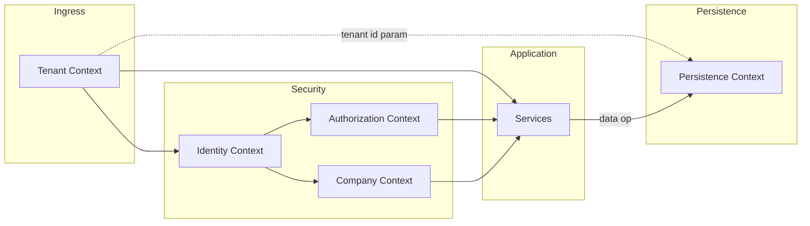

# 03 — Context Propagation

**Etapa:** 4 — Runtime Architecture  
**Fecha:** 2026-06-25  
**Estado:** Borrador para revisión  
**Restricción:** Conceptos únicamente. Sin clases, código ni tipos de implementación.

---

## 1. Propósito

Definir el **contexto canónico de ejecución**: qué información existe durante una request, quién la crea, cómo se propaga, cuándo se destruye, y qué capas pueden leerla.

---

## 2. Modelo de contextos

El runtime opera con **seis contextos lógicos** + **Request Context** meta:

```
Request Context (meta)
├── Tenant Context
├── Identity Context
├── Company Context
├── Authorization Context
├── Persistence Context (por operación de datos)
└── [opcional] Impersonation Overlay
```

---

## 3. Tenant Context

### 3.1 Definición

Información que identifica **qué tenant** recibe la request, derivada de la entrada (Host), validada contra Control Plane.

### 3.2 Contenido conceptual

| Elemento | Descripción |
|----------|-------------|
| Tenant identifier | UUID canónico del tenant |
| Subdomain binding | Subdominio resuelto |
| Tenant commercial state | Activo, Suspendido, Provisioning, Migrando, Retirado |
| Tenant registry reference | Handle lógico al registro SSOT |

### 3.3 Excluido explícitamente

- Installation Mode (no visible L5)
- Storage endpoint credentials
- SQL connection details

### 3.4 Lifecycle

| Fase | Acción |
|------|--------|
| **Creación** | Tras Tenant Resolution (middleware), antes de auth |
| **Propagación** | Readable por L3–L6; writable solo por ingress (no handler) |
| **Destrucción** | Middleware finally al completar request |

### 3.5 Reglas

- Una request → un Tenant Context
- Host es fuente primaria en producción
- JWT tenant solo override bajo impersonation (ver overlay)
- Sin Tenant Context no hay operación tenant-scoped

---

## 4. Identity Context

### 4.1 Definición

Información del **actor autenticado** (o ausencia en endpoints públicos).

### 4.2 Contenido conceptual

| Elemento | Descripción |
|----------|-------------|
| User identifier | UUID usuario |
| Username | Identificador login |
| User type | Platform operator / tenant user |
| Authentication method | Password / SSO / impersonation |
| Session identifier | Referencia sesión IAM (sid) |
| Token identifier | jti access token |
| Tenant row identifier | Tenant al que pertenece fila usuario (puede diferir en impersonation) |

### 4.3 Lifecycle

| Fase | Acción |
|------|--------|
| **Creación** | Security gate post Tenant Context |
| **Propagación** | L4–L5; IAM audit |
| **Destrucción** | Request teardown |
| **Actualización** | Refresh flow genera nuevo Identity Context en nueva request |

### 4.4 Reglas

- Endpoints protegidos requieren Identity Context
- Identity Context no reemplaza Tenant Context
- Logout invalida sesión; Identity Context de tokens previos rechazado

---

## 5. Company Context

### 5.1 Definición

**Contexto operativo ERP**: empresa activa en la sesión.

### 5.2 Contenido conceptual

| Elemento | Descripción |
|----------|-------------|
| Company identifier | UUID empresa activa |
| Selection pending flag | Si requiere selección post-login |
| Company scope class | TENANT / COMPANY / HYBRID (clasificación recurso) |

### 5.3 Lifecycle

| Fase | Acción |
|------|--------|
| **Creación** | ERP session gate o selection flow |
| **Propagación** | L5 ERP; queries con scope empresa |
| **Destrucción** | Request teardown |
| **Cambio** | Company switch → nueva request con nuevo JWT |

### 5.4 Reglas

- ERP operativo requiere Company Context (except platform operator patterns)
- Company Context no implica cambio de Tenant Data Store
- Impersonation puede tener selection pending

---

## 6. Authorization Context

### 6.1 Definición

Conjunto **efectivo** de permisos y flags de acceso para la request.

### 6.2 Contenido conceptual

| Elemento | Descripción |
|----------|-------------|
| Effective permission set | Permisos resueltos (derivado) |
| Access level | Nivel LBAC |
| Is super admin | Flag platform |
| Is tenant admin | Flag tenant |
| Is impersonation | Flag |
| Impersonation effective scope | tenant / platform |
| Required permission satisfied | Resultado gate actual |

### 6.3 Lifecycle

| Fase | Acción |
|------|--------|
| **Creación** | Permission gate; puede usar cache proceso |
| **Propagación** | L4–L5 |
| **Destrucción** | Request teardown |
| **Invalidación** | Grant change → cache invalidate (evento async) |

### 6.4 Reglas

- Derivado de Product Permission (CP) + Grants (DP)
- ERP no recalcula permisos; consume gate result
- Impersonation aplica RBAC efectivo tenant_admin

---

## 7. Persistence Context

### 7.1 Definición

Contexto **infraestructura** que vincula una operación de datos a un almacén concreto. **Invisible para L5.**

### 7.2 Contenido conceptual

| Elemento | Descripción |
|----------|-------------|
| Store class | control_plane \| tenant_data_plane |
| Tenant binding | Tenant identifier (tenant data ops) |
| Installation mode reference | Solo L6 internal |
| Operation id | Correlación op (opcional) |

### 7.3 Lifecycle

| Fase | Acción |
|------|--------|
| **Creación** | Al iniciar operación de datos en L6 |
| **Propagación** | Solo L6 → store |
| **Destrucción** | Al completar operación de datos |
| **Scope** | Por operación (canónico); ver nota AS-IS |

### 7.4 Reglas

- L5 nunca lee Persistence Context
- Control plane ops nunca usan tenant data route por error
- Dedicated y Shared producen Persistence Context distinto; mismo contrato L5

---

## 8. Request Context (meta)

### 8.1 Definición

Metadatos de la request HTTP sin valor de negocio.

### 8.2 Contenido conceptual

| Elemento | Descripción |
|----------|-------------|
| Correlation identifier | Trazabilidad logs |
| HTTP method / path | Routing |
| Client IP (trusted) | Rate limit, audit |
| Request start timestamp | Latency |

### 8.3 Lifecycle

Creación al ingress; destrucción al teardown.

---

## 9. Impersonation Overlay

Extensión temporal sobre Identity + Authorization Context:

| Elemento | Descripción |
|----------|-------------|
| Impersonator identifier | Superadmin actor |
| Target tenant identifier | Tenant impersonado |
| Parent session reference | Restore post-impersonation |
| Access-only flag | Sin refresh en impersonation |

**Regla:** Tenant Context (Host) puede ser platform; Identity Context lleva target tenant.

---

## 10. Propagación entre capas



**Flecha sólida:** lectura permitida  
**Flecha punteada:** parámetro explícito; no lectura de Persistence Context

---

## 11. Context propagation rules (normativas)

| # | Regla |
|---|-------|
| CP-01 | Tenant Context precede Identity Context |
| CP-02 | Identity Context precede Authorization Context |
| CP-03 | Company Context solo tras contrato sesión ERP |
| CP-04 | Persistence Context no sube a L5 |
| CP-05 | Contextos no sobreviven request |
| CP-06 | Async tasks hijos deben re-hidratar contexto explícitamente |
| CP-07 | Background jobs usan contexto sintético declarado |
| CP-08 | Cache de permisos ≠ Authorization Context request |
| CP-09 | Impersonation overlay no muta Tenant Registry |
| CP-10 | Request Context correlaciona logs cross-layer |

---

## 12. Destrucción y leak prevention

| Riesgo | Prevención conceptual |
|--------|----------------------|
| Context leak entre requests | Teardown obligatorio en finally |
| Tenant bleed async | Prohibido share context sin copy |
| Stale Identity tras logout | Blacklist check en gate |
| Company stale tras switch | JWT re-issue obligatorio |
| Persistence Context reuse wrong tenant | Bind tenant id per op |

---

## 13. Relación con Canonical Data Model (E3)

| Contexto | Datos canónicos referenciados |
|----------|------------------------------|
| Tenant Context | Tenant Registry |
| Identity Context | User Identity, Session |
| Company Context | Company |
| Authorization Context | Effective Permission Set, Grants |
| Persistence Context | Storage Metadata, Installation Mode |

---

## 14. Conclusión

Los contextos lógicos (Tenant, Identity, Company, Authorization) forman el **contrato de ejecución** para application layer. Persistence Context permanece encapsulado en L6.

La propagación es **unidireccional hacia abajo** y **efímera** (request-scoped).
