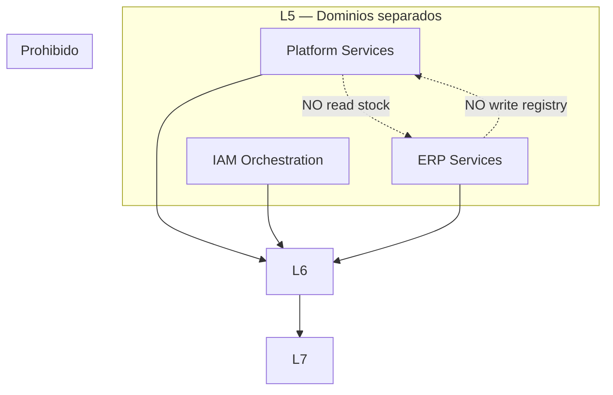

# 05 — Runtime Boundaries

**Etapa:** 4 — Runtime Architecture  
**Fecha:** 2026-06-25  
**Estado:** Borrador para revisión

---

## 1. Propósito

Definir qué capa del runtime conoce a cuál, dependencias permitidas y prohibidas, y reglas de acoplamiento.

---

## 2. Mapa de capas

| ID | Capa | Alias |
|----|------|-------|
| L0 | Edge | Nginx |
| L1 | HTTP Ingress | FastAPI router |
| L2 | Cross-Cutting Pipeline | Middleware |
| L3 | Context Establishment | Tenant + meta |
| L4 | Security Gates | Authn/Authz |
| L5 | Application | Platform, IAM orch, ERP |
| L6 | Persistence Gateway | Data access |
| L7 | Stores | CP / DP / Cache |

---

## 3. Matriz de conocimiento permitido

| Conoce → | L0 | L1 | L2 | L3 | L4 | L5 | L6 | L7 |
|------------|:--:|:--:|:--:|:--:|:--:|:--:|:--:|:--:|
| **L0 Edge** | — | ✓ | | | | | | |
| **L1 Ingress** | ✓ | — | ✓ | | | | | |
| **L2 Pipeline** | | ✓ | — | ✓ | | | | |
| **L3 Context** | | | ✓ | — | ✓ | | | |
| **L4 Security** | | | | ✓ | — | ✓ | | |
| **L5 Application** | | | | ✓ | ✓ | — | ✓* | |
| **L6 Persistence** | | | ✓** | | | | — | ✓ |
| **L7 Stores** | | | | | | | | — |

\* L5 invoca L6; no lee Persistence Context internals  
\*\* L6 lee Tenant Context only; not Identity details beyond tenant id

---

## 4. Dependencias permitidas (detalle)

### 4.1 L5 Application PUEDE

- Leer Tenant Context, Identity Context, Company Context, Authorization Context
- Invocar operaciones de datos **a través de** L6 abstraction
- Invocar otros servicios L5 (mismo dominio)
- Emitir excepciones de negocio mapeadas

### 4.2 L5 Application NO PUEDE

- Leer Installation Mode
- Invocar L7 directamente
- Leer Storage Metadata
- Decidir Shared vs Dedicated
- Modificar Tenant Registry (salvo Platform domain services)

### 4.3 L6 Persistence Gateway PUEDE

- Leer Tenant Context (identifier)
- Leer Storage Metadata (Control Plane lookup)
- Abrir conexión L7
- Aplicar tenant filter policy

### 4.4 L6 NO PUEDE

- Ejecutar reglas ERP workflow
- Validar RBAC (ya validado L4)
- Exponer route details a L5

### 4.5 L4 Security PUEDE

- Leer/escribir Identity, Authorization, Company Context
- Consultar L6 para identity/session lookups
- Consultar Cache

### 4.6 L2 Pipeline PUEDE

- Establecer Tenant Context
- Consultar Control Plane para resolution
- Registrar teardown

---

## 5. Dependencias prohibidas (explícitas)

| # | Prohibición |
|---|-------------|
| B-01 | ERP (L5) → L7 direct |
| B-02 | ERP (L5) → Storage Metadata |
| B-03 | ERP (L5) → Installation Mode |
| B-04 | Platform ERP endpoints mezclados sin gate |
| B-05 | L6 → L5 callback con business rules |
| B-06 | Frontend → Installation Mode |
| B-07 | Tenant Context desde body/query para authz |
| B-08 | Company Context sin Identity Context |
| B-09 | Persistence Context visible L5 |
| B-10 | Cross-tenant data access sin superadmin gate |
| B-11 | IAM session create en ERP module |
| B-12 | ERP audit write en Platform handler |
| B-13 | Grant modification desde ERP inventory service |
| B-14 | Product Permission edit desde Tenant Admin |
| B-15 | Skip tenant filter L6 tenant data (sin bypass flag) |

---

## 6. Fronteras de dominio en runtime

| Cruce | Runtime permitido |
|-------|-------------------|
| Platform → Control Plane data | Sí |
| Platform → Tenant ERP data | **No** |
| ERP → Tenant data via L6 | Sí |
| ERP → Control Plane catalog read | Sí (via L6 control route) |
| IAM → Session store | Sí |
| IAM → ERP documents | **No** |

---

## 7. Reglas de acoplamiento

| Regla | Descripción |
|-------|-------------|
| AC-01 | Downward dependency only (L5→L6→L7) |
| AC-02 | Context flows down, never Persistence Context up |
| AC-03 | Security gates centralizados L4 |
| AC-04 | Un dominio L5 no importa internals otro dominio L5 storage |
| AC-05 | Cache es L7 adjunct; invalidation por evento dominio |
| AC-06 | Background jobs re-declare context; no HTTP coupling |

---

## 8. Shared vs Dedicated boundary

| Capa | ¿Diferencia runtime? |
|------|---------------------|
| L0–L5 | **No** |
| L6 | **Sí** (route selection) |
| L7 | **Sí** (physical store) |

**Regla:** Única bifurcación permitida en runtime: **L6 route selection**.

---

## 9. Contradicción AS-IS documentada

| AS-IS | Canónico | Doc |
|-------|----------|-----|
| Some IAM services read database_type | L5 no mode | RD-02, RR-03 |
| Middleware sets installation metadata in TenantContext | Mode not L5 visible | RD-03 |
| Each execute_* resolves independently | Per-op resolution OK | RD-01 |

---

## 10. Conclusión

El runtime mantiene **frontera estricta L5/L6**: application conoce contextos lógicos; persistence conoce almacén. Violaciones documentadas en AS-IS se tratan como deuda hacia modelo canónico.
