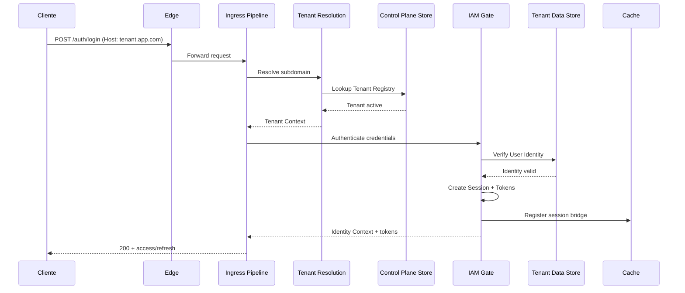
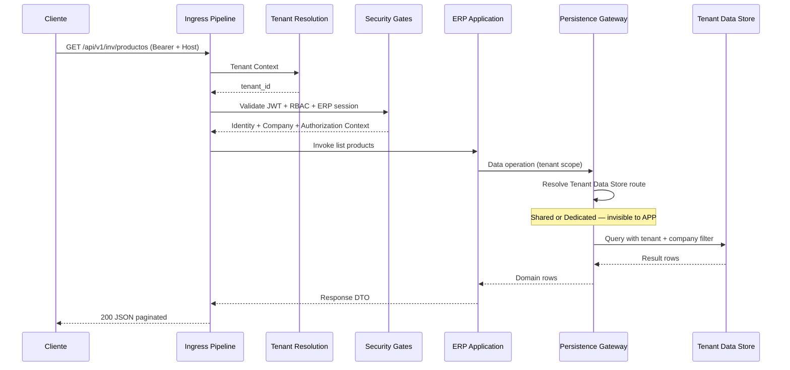
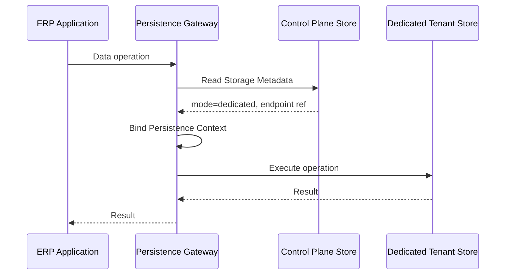
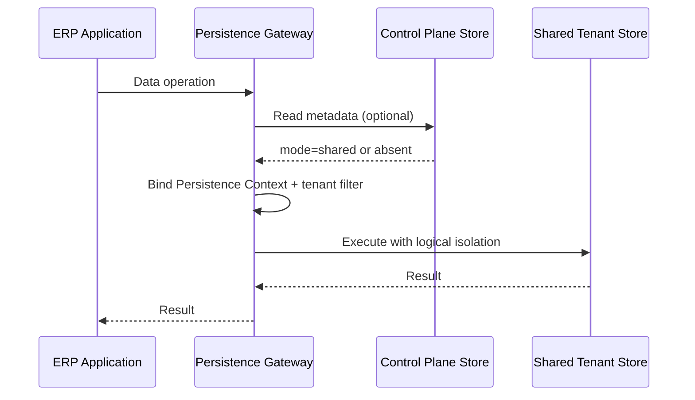
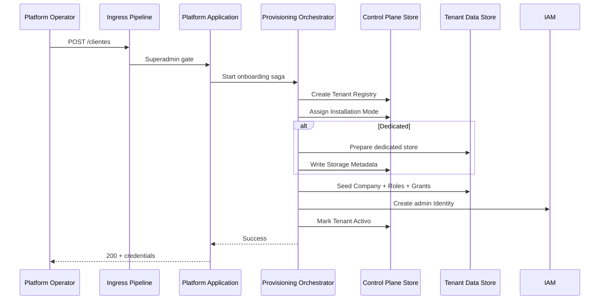
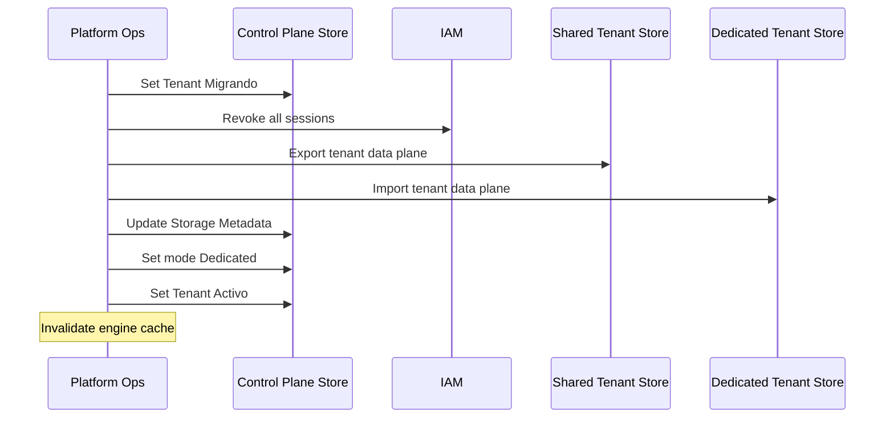
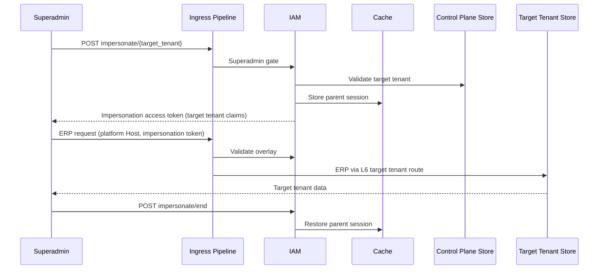
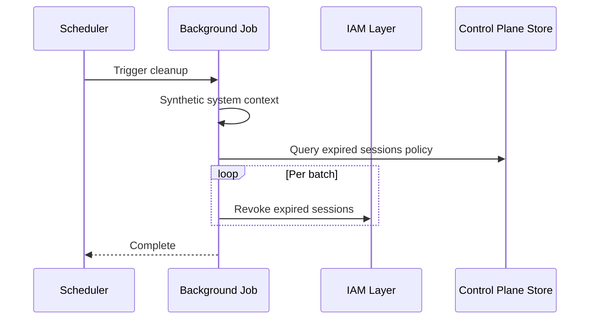
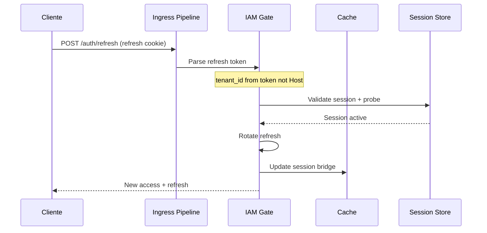
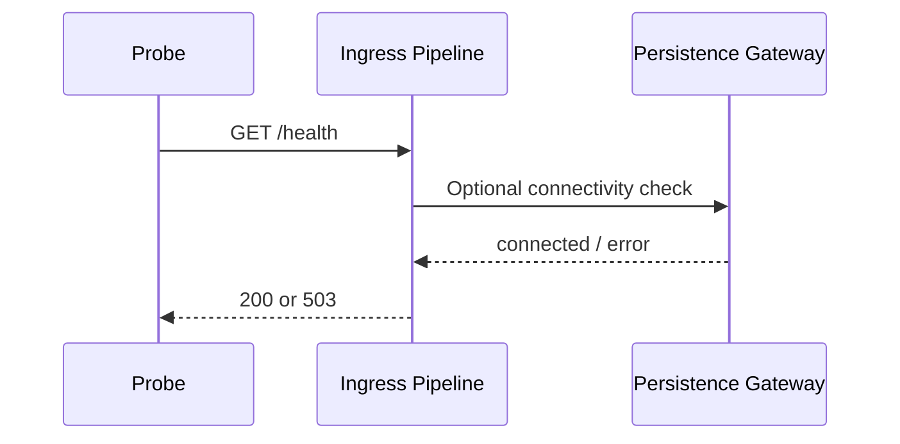

# 07 — Runtime Sequence Diagrams (Conceptuales)

**Etapa:** 4 — Runtime Architecture  
**Fecha:** 2026-06-25  
**Estado:** Borrador para revisión  
**Restricción:** Diagramas conceptuales. Sin clases, métodos ni implementación.

---

## 1. Login

---

## 2. ERP Request (Shared o Dedicated — mismo diagrama L5)

---

## 3. Dedicated Request (énfasis L6)

**Nota:** L5 idéntico a Shared request.

---

## 4. Shared Request (énfasis L6)

---

## 5. Onboarding

---

## 6. Migration Shared to Dedicated

---

## 7. Impersonation

---

## 8. Background Job (session cleanup)

---

## 9. Refresh Token

---

## 10. Health Check

---

## 11. Notas sobre diagramas

- Participantes son **roles arquitectónicos**, no componentes de código.
- "Persistence Gateway" = L6 abstracto.
- Dedicated vs Shared difiere solo en diagramas 3 y 4 (L6).
- Contradicciones AS-IS (per-op resolution) no alteran diagramas L5.

---

## 12. Conclusión

Los diagramas confirman: **mismo pipeline L0–L5** para Shared y Dedicated; bifurcación solo en **Persistence Gateway → Store**.
