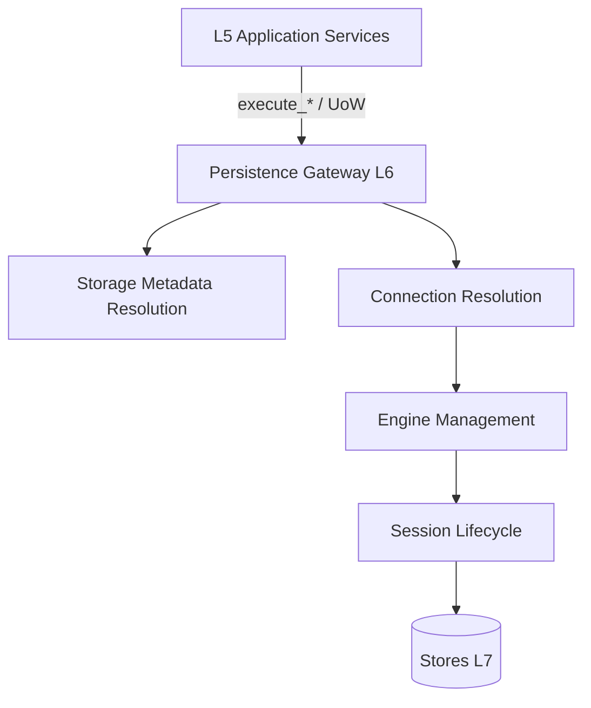

# 01 — Persistence Gateway

**Etapa:** 5 — Technical Infrastructure Design  
**Fecha:** 2026-06-25  
**Estado:** Borrador para revisión  
**Prerequisitos:** Etapas 0–4 aprobadas  
**Restricción:** Diseño técnico de infraestructura. Sin código, clases, SQL ni pseudocódigo.

---

## 1. Propósito

Definir la **capa técnica L6** que materializa el Persistence Gateway aprobado en Runtime Architecture (RD-06). Este documento especifica **qué hace** la infraestructura de persistencia, **cómo se organiza**, y **qué contratos técnicos** expone hacia L5 — sin prescribir implementación concreta.

---

## 2. Relación con runtime aprobado

| Decisión runtime | Implicación técnica |
|------------------|---------------------|
| RD-01 | Resolución de almacén **por operación de datos** |
| RD-06 | Gateway único; ningún acceso directo a stores desde L5 |
| RD-07 | Clasificación explícita `control_plane` \| `tenant_data` en cada operación |
| RD-08 | Fallback Shared si metadata ausente (no dedicated explícito) |
| RI-31, RI-32 | L5 no resuelve conexiones ni conoce Installation Mode |

---

## 3. Definición

El **Persistence Gateway** es la **facade técnica unificada** mediante la cual toda operación de lectura/escritura alcanza el almacén correcto. En el estado AS-IS, sus responsabilidades están **distribuidas** entre:

| Capacidad AS-IS | Ubicación actual | Rol en gateway canónico |
|-----------------|------------------|-------------------------|
| Ejecución de queries | `queries_async.py` | Facilitador principal tenant-data |
| Contexto de conexión | `routing.py` + `connection_async.py` | Resolución y checkout |
| Transacciones multi-paso | `unit_of_work.py` | Agrupación atómica |
| Acceso directo ADMIN | Servicios platform/onboarding | Ruta control_plane |
| Repositories legacy | `infrastructure/database/repositories/` | Segunda vía hacia mismo gateway |

**Objetivo Etapa 5:** formalizar estas piezas como **un modelo coherente** sin duplicar APIs ni bifurcar por modo.

---

## 4. Responsabilidades del gateway

### 4.1 Responsabilidades incluidas

| # | Responsabilidad | Descripción |
|---|-----------------|-------------|
| R-01 | Clasificar operación | Determinar si es `control_plane` o `tenant_data` |
| R-02 | Resolver tenant operativo | Obtener identificador tenant desde parámetro explícito o contexto request |
| R-03 | Resolver ruta de almacén | Consultar Storage Metadata; producir binding almacén |
| R-04 | Obtener engine | Delegar a Engine Management (cache proceso) |
| R-05 | Abrir sesión SQL | Crear AsyncSession sobre engine resuelto |
| R-06 | Aplicar políticas transversales | Tenant filter, auditoría, whitelist tablas globales |
| R-07 | Ejecutar operación | SELECT / INSERT / UPDATE / DELETE vía SQLAlchemy Core |
| R-08 | Gestionar commit/rollback | Según tipo operación y boundary transaccional |
| R-09 | Cerrar sesión | Liberar conexión al pool |
| R-10 | Propagar errores mapeados | Sin exponer detalle SQL al cliente HTTP |

### 4.2 Responsabilidades excluidas

| # | Excluido | Motivo |
|---|----------|--------|
| E-01 | Reglas de negocio ERP | L5 |
| E-02 | RBAC / JWT validation | L4 |
| E-03 | Resolución Host → tenant | L3 (Tenant Middleware) |
| E-04 | Cache Redis sesión IAM | Capa transversal IAM |
| E-05 | Orquestación saga onboarding | Capa provisioning (fuera gateway core) |

---

## 5. Puntos de entrada técnicos (facades)

El gateway expone **tres vías de entrada** hacia el mismo pipeline interno:

| Vía | Uso principal | Semántica transaccional |
|-----|---------------|--------------------------|
| **Operaciones atómicas** | `execute_query`, `execute_insert`, `execute_update` | Una sesión por llamada; commit automático en mutaciones |
| **Unit of Work** | Procesos multi-paso (IAM V2, INV transaccional) | Una sesión; commit al finalizar scope UoW |
| **Conexión explícita** | Onboarding, bootstrap, scripts ops | Caller controla transacción; gateway provee sesión |

**Invariante:** Las tres vías convergen en el **mismo pipeline de resolución** (metadata → engine → session). No existen pipelines paralelos Shared/Dedicated.

---

## 6. Pipeline interno (conceptual)

```
Entrada (execute_* | UoW | conexión explícita)
  → [1] Validar parámetros (client_id, operation_class)
  → [2] Resolver Storage Metadata (ver 02)
  → [3] Resolver Connection Binding (ver 03)
  → [4] Obtener Engine (ver 04, 10)
  → [5] Abrir AsyncSession (ver 05)
  → [6] Aplicar tenant filter / auditor (si tenant_data)
  → [7] Ejecutar SQL
  → [8] Commit | Rollback | No-op (ver 07)
  → [9] Cerrar sesión
  → Salida (resultado | excepción mapeada)
```

**Cache intra-request (RD-01):** Entre pasos [2]–[4], el binding `(tenant_id, operation_class) → route` puede reutilizarse dentro del mismo request HTTP sin reconsultar metadata ni recrear engine.

---

## 7. Clasificación de operaciones (RD-07)

| Clase | Destino almacén | Parámetro tenant | Ejemplos |
|-------|-----------------|------------------|----------|
| `control_plane` | Control Plane Store (ADMIN) | Opcional / SYSTEM | Lookup subdominio, catálogo módulos, provisioning metadata |
| `tenant_data` | Tenant Data Store (DEFAULT resuelto) | **Obligatorio** | Queries ERP, usuarios tenant, grants, sesiones IAM (según RD-11) |

**Regla:** La clasificación la determina el **tipo de dato accedido** (Canonical Data Model E3), no el módulo caller. Un servicio IAM que escribe sesión tenant-data invoca gateway con `tenant_data`.

---

## 8. Contrato hacia Application Layer (L5)

### 8.1 Lo que L5 conoce

| Elemento | Visible |
|----------|---------|
| Funciones `execute_*` con `client_id` | Sí |
| `UnitOfWork(client_id=...)` | Sí |
| `DatabaseConnection.ADMIN` / `DEFAULT` enum | Sí (semántica plano) |
| Tabla / query SQLAlchemy Core | Sí (capa queries) |

### 8.2 Lo que L5 NO conoce

| Elemento | Visible |
|----------|---------|
| Installation Mode (single/multi) | **No** |
| Connection string dedicada | **No** |
| Engine cache key | **No** |
| Storage Metadata raw | **No** |
| Decisión fallback Shared | **No** |

---

## 9. Integración con capas adyacentes



---

## 10. Gap AS-IS documentado

| Gap | Descripción | Tratamiento Etapa 6 |
|-----|-------------|---------------------|
| G-01 | Gateway no es módulo único; responsabilidades dispersas | Consolidación conceptual; sin fork API |
| G-02 | Servicios llaman `get_db_connection(ADMIN)` directamente | Permanece para control_plane; documentado como vía válida |
| G-03 | `database_type` en TenantContext consumido por L5 (IAM/RBAC) | Violación RD-03; remediación Capa 5 change surface |
| G-04 | Repositories legacy bypass parcial de políticas | Ver 09_REPOSITORY_INTERACTION |
| G-05 | `close_all_async_engines()` no invocado en shutdown | Ver 04_ENGINE_MANAGEMENT |

**No se corrige en esta etapa** — queda registrado para implementación.

---

## 11. Extensiones futuras (sin diseño ahora)

| Extensión | Gateway debe soportar |
|-----------|----------------------|
| Multi-Region | Metadata con región; engine key incluye región |
| Read replica | Operation hint read-only; ruta alternativa |
| On-Premise | Metadata endpoint externo; mismas facades |
| DR failover | Metadata secondary endpoint; ver 11_FAILURE_RECOVERY |

---

## 12. Criterios de aceptación (Etapa 6)

| # | Criterio |
|---|----------|
| AC-01 | 100% acceso SQL pasa por pipeline gateway (directo o vía execute_*) |
| AC-02 | Ningún módulo ERP importa routing o connection_async |
| AC-03 | Firma pública execute_* / UoW sin cambio |
| AC-04 | Dedicated tenant accede datos sin branch en L5 |
| AC-05 | Shared regression suite pasa sin modificación queries ERP |

---

## 13. Conclusión

El Persistence Gateway es la **única frontera técnica** entre lógica de aplicación y almacenes físicos. Su diseño preserva el patrón AS-IS (`execute_*` + UoW + context managers) mientras encapsula Shared/Dedicated de forma transparente para L5.

Documentos relacionados: `02` (metadata), `03` (conexión), `08` (ejecución queries).
