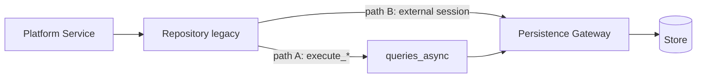

# 09 — Repository Interaction

**Etapa:** 5 — Technical Infrastructure Design  
**Fecha:** 2026-06-25  
**Estado:** Borrador para revisión  
**Prerequisitos:** AS-IS audit dualidad queries/repositories, G-04  
**Restricción:** Convivencia legacy repositories con gateway. Sin código.

---

## 1. Propósito

Definir cómo la capa **repositories legacy** (Platform) interactúa con el Persistence Gateway y cuál es la estrategia de convergencia sin duplicar lógica Shared/Dedicated.

---

## 2. Estado AS-IS

| Vía | Ubicación | Módulos |
|-----|-----------|---------|
| **Queries (canónico ERP)** | `queries/{cod}/` + `queries_async.py` | ORG, INV, PUR, HCM, etc. |
| **Repositories (legacy Platform)** | `infrastructure/database/repositories/` | Platform, algunos SaaS |

**Hallazgo E0:** Dualidad arquitectónica convive. Repositories eventualmente delegan a SQLAlchemy session directa o queries_async.

---

## 3. Principio rector

| # | Principio |
|---|-----------|
| RI-01 | Nuevo código **no** crea repositories adicionales |
| RI-02 | Repositories existentes **deben** enrutar vía gateway |
| RI-03 | Misma resolución Shared/Dedicated que execute_* |
| RI-04 | Repositories no contienen branch installation mode |
| RI-05 | Migración repositories → queries es deuda, no blocker MVP |

---

## 4. Modelo de interacción

### 4.1 Path A — Repository delega execute_*

| Aspecto | Comportamiento |
|---------|----------------|
| Resolución | Automática vía execute_* pipeline |
| Tenant filter | Aplicado |
| Recomendado | **Preferido** para migración incremental |

### 4.2 Path B — Repository con sesión externa

| Aspecto | Comportamiento |
|---------|----------------|
| Resolución | Caller abre get_db_connection / UoW |
| Repository | Recibe sesión; ejecuta SQL directo |
| Reglas | SR-01 a SR-04 (doc 05) |
| Riesgo | Bypass auditor/filter si no coordinado |

---

## 5. Política por módulo

| Módulo | Vía actual | Policy Etapa 6 |
|--------|------------|----------------|
| ERP (ORG, INV, …) | Queries only | **No repositories** |
| Platform tenant | Repositories + services | Delegar gateway |
| Auth IAM | Services + queries session | Gateway path |
| Modulos SaaS | Mixed | Audit per file |

---

## 6. Repository + Dedicated

| Escenario | Comportamiento |
|-----------|----------------|
| Repository llama execute_* con client_id | Dedicated resuelto automáticamente |
| Repository abre ADMIN directo | Control plane — sin impacto mode |
| Repository asume shared físico | **Bug** si tenant dedicated |

**Acción Etapa 6:** grep repositories con SQL raw sin client_id.

---

## 7. Convergencia (roadmap de deuda)

| Fase | Acción |
|------|--------|
| MVP | Garantizar repositories usan gateway paths |
| Fase 2 | Migrar repositories críticos a queries pattern |
| Fase 3 | Deprecar repositories restantes |
| Final | Single vía queries_async |

**No eliminar** repositories en MVP — G-01 mínimo impacto.

---

## 8. CfgCodigoSecuenciaRepository (caso especial)

AS-IS: acepta sesión externa para participar en UoW transaccional.

| Regla | Descripción |
|-------|-------------|
| Documentado como patrón válido | Path B |
| Debe usar sesión de UoW mismo tenant store | Obligatorio |
| No crear variantes dedicated | Prohibido |

---

## 9. Anti-patterns

| Anti-pattern | Violación |
|--------------|-----------|
| Repository construye connection string | G-09 |
| Repository importa routing.py | G-08 |
| Repository duplicate ERP logic | G-06 |
| Nuevo Repository en módulo ERP | Arquitectura V4 |

---

## 10. Gap AS-IS

| ID | Gap |
|----|-----|
| RP-G01 | Dualidad queries/repositories sin policy formal previa |
| RP-G02 | Algunos repositories pueden bypass QueryAuditor |
| RP-G03 | auth/endpoints Azure AD usa connection deprecated |

---

## 11. Conclusión

Repositories legacy **conviven** con el gateway en MVP mediante delegación obligatoria a execute_* o sesiones coordinadas con UoW. Convergencia a queries es deuda planificada, no requisito dedicated day-1.

Documentos relacionados: `08_QUERY_EXECUTION_MODEL`, `01_PERSISTENCE_GATEWAY`.
