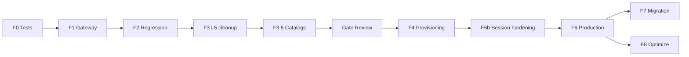

# 12 — Implementation Roadmap

> **BL-1.0 (2026-06-25):** Fases autorizadas Etapa 6 y gates oficiales →  
> **`architecture-baseline/05_IMPLEMENTATION_BASELINE.md`** §6.  
> Este documento conserva detalle E5; §3–4 fases **superseded** por baseline.

**Etapa:** 5 — Technical Infrastructure Design  
**Fecha:** 2026-06-25 (actualizado BL-1.0)  
**Estado:** Referencia E5; roadmap operativo en baseline 05  
**Prerequisitos:** E2 change surface, E4 runtime, docs 01–11, **BL-1.0**  
**Restricción:** Etapa 6 solo F0–F3 hasta Gate Review

---

## 1. Propósito

Traducir el diseño técnico de infraestructura en **fases implementables** con gates, dependencias y criterios de salida — preparando Etapa 6 (Implementación).

---

## 2. Principios del roadmap

| # | Principio |
|---|-----------|
| IR-01 | Shared regression gate en cada fase |
| IR-02 | Infraestructura antes que provisioning |
| IR-03 | Cero cambios queries ERP |
| IR-04 | ADR obligatorio fuera change surface |
| IR-05 | Feature flag per-tenant dedicated enable |

---

## 3. Fases

### Fase 0 — Test harness & observability baseline

| Item | Descripción |
|------|-------------|
| Objetivo | Red de seguridad pre-cambios |
| Entregables | Integration tests dedicated mock; metrics cache/engine |
| Archivos | `tests/integration/conftest` extension; métricas |
| Gate | Shared suite 100% pass |
| Duración estimada | S |

---

### Fase 1 — Persistence Gateway consolidation (Capa 1–2)

| Item | Descripción |
|------|-------------|
| Objetivo | Resolución transparente shared; metadata cache formal |
| Componentes | `connection_async`, `routing`, `queries_async`, `query_helpers`, `cache.py` |
| Decisiones | TD-01 L-A cache; TD-02 TTL; TD-08 tenant filter dedicated |
| Gate | Shared tenants idéntico comportamiento; auditor pass |
| Riesgo | Crítico — punto único fallo |
| Duración estimada | M |

**Criterios salida:**
- [ ] Dedicated tenant resuelve engine correcto en test harness
- [ ] L5 sin acceso database_type
- [ ] `close_all_async_engines()` en shutdown

---

### Fase 2 — Shared regression & performance baseline

| Item | Descripción |
|------|-------------|
| Objetivo | Validar cero regresión |
| Entregables | Benchmark execute_* latency; pool metrics |
| Gate | G-02 checklist completo |
| Duración estimada | S |

---

### Fase 3 — Deuda L5 multi branches (Capa 5) — **ANTES de F4 (BL-1.0)**

| Item | Descripción |
|------|-------------|
| Objetivo | Eliminar database_type en IAM/RBAC services |
| Componentes | `user_context.py`, `rol_service.py`, middleware context cleanup |
| Gate | Grep database_type solo whitelist |
| Duración estimada | S |
| **BL-1.0** | **Obligatoria pre-F4** |

---

### Fase 3.5 — Catalog policy validation (BL-1.0 NUEVA)

| Item | Descripción |
|------|-------------|
| Objetivo | Validar lista catálogos ADR-011-A para provisioning dedicated |
| Prerequisito | F3 completa |
| Gate | Gate Review pre-F4 |
| Duración estimada | S |

---

### Fase 4 — Provisioning saga (Capa 3) — **BLOCKED hasta Gate Review**

| Item | Descripción |
|------|-------------|
| Objetivo | Onboarding cross-plane vía saga |
| Componentes | `cliente_onboarding_service`, orchestrator nuevo, metadata writer |
| Prerequisito | F1 + F2 + F3 + F3.5; Q-030 spec aprobada |
| Gate | POST /clientes/ response unchanged; dedicated E2E |
| Duración estimada | L |

**Sub-pasos:**
1. Provisioning state machine CP
2. Dedicated DDL pipeline ops
3. Seed DP contra resolved store
4. Activation + cache invalidation

---

### Fase 5b — Session route hardening (BL-1.0 — reemplaza F5)

| Item | Descripción |
|------|-------------|
| Objetivo | Alinear IAM V2 routing con ADR-002-A (sesiones CP) |
| Prerequisito | RD-11 **cerrada** BL-1.0; F4 en progreso o completa |
| Gate | IAM V2 tests pass |
| Duración estimada | S–M |

**Nota:** Decisión session store cerrada en BL-1.0 (ADR-002-A). No requiere workshop F5a.

---

### Fase 6 — Dedicated production enablement

| Item | Descripción |
|------|-------------|
| Objetivo | Primer tenant dedicated real |
| Entregables | Runbooks; invalidation hooks; monitoring |
| Gate | Staging dedicated 72h soak |
| Duración estimada | M |

---

### Fase 7 — Migration tooling (post-MVP)

| Item | Descripción |
|------|-------------|
| Objetivo | Shared → Dedicated offline migration |
| Prerequisito | Fase 6 stable |
| Gate | RD-13 Migrando state enforced |
| Duración estimada | L |

---

### Fase 8 — Optimizations (post-MVP)

| Item | Descripción |
|------|-------------|
| Engine key consolidation TD-03 | Reduce memory |
| Redis metadata invalidation TD-09 | Multi-worker strong consistency |
| Repository → queries migration | Deuda 09 |

---

## 4. Dependencias entre fases

---

## 5. Decisiones bloqueantes pre-implementación

| ID | Decisión | Fase afectada |
|----|----------|---------------|
| RD-11 | ~~Session store~~ | **Cerrada BL-1.0** ADR-002-A |
| TD-03 | Engine key shared consolidation | F8 (MVP usa AS-IS) |
| O-E5-04 | Saga compensation auto vs manual | F4 |
| Q-030 | Saga spec detalle | **Gate F4** |

---

## 6. Checklist pre-Etapa 6

| # | Item |
|---|------|
| 1 | Aprobación formal Etapa 5 |
| 2 | Cierre RD-11 o plan parallel CP-only sessions |
| 3 | Guardrails G-01–G-20 revisados con equipo |
| 4 | Test harness F0 especificado |
| 5 | Runbook template failure recovery |

---

## 7. Estimación global

| Fase | Esfuerzo | Riesgo |
|------|----------|--------|
| F0–F2 | M | Medio |
| F3 | S | Bajo |
| F4 | L | Alto |
| F5 | M | Medio |
| F6 | M | Alto |
| F7–F8 | L | Medio |

**Total MVP dedicated:** ~M–L (equipo 2–3 devs, varias sprints).

---

## 8. Fuera de alcance Etapa 6 MVP

| Item | Fase futura |
|------|-------------|
| Online migration dual-write | F7+ |
| Multi-Region | Extension |
| Read replicas | F8+ |
| On-Premise tunnel | Extension |
| Request-scoped session | Rejected TD-05 |

---

## 9. Conclusión

El roadmap implementa **Infrastructure Encapsulation First** (E2): Fases 0–2 entregan valor sin dedicated tenants; Fases 4–6 habilitan dedicated production; Fase 7 migration.

Documentos relacionados: `13_TECHNICAL_DECISIONS`, `14_EXECUTIVE_SUMMARY`.
