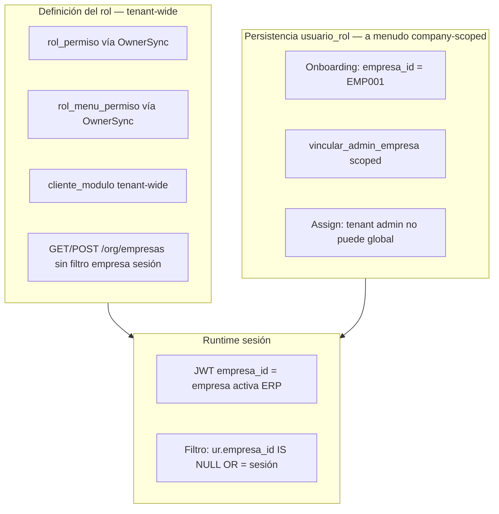
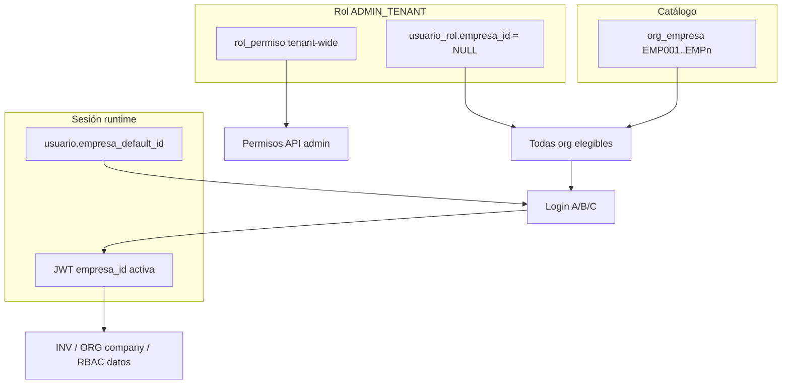

# Modelo oficial — Alcance de `ADMIN_TENANT` en CAXIS SaaS

**Tipo:** Auditoría conceptual (sin cambios de código)  
**Fecha:** 2026-05-31  
**Referencias:** [MULTIEMPRESA_OFFICIAL_MODEL.md](./MULTIEMPRESA_OFFICIAL_MODEL.md), [MULTIEMPRESA_ROLE_ASSIGNMENT_MODEL.md](./MULTIEMPRESA_ROLE_ASSIGNMENT_MODEL.md), [TENANT_ROLE_PERMISSION_MODEL_AUDIT.md](./TENANT_ROLE_PERMISSION_MODEL_AUDIT.md), [MULTIEMPRESA_M1_IMPLEMENTATION.md](./MULTIEMPRESA_M1_IMPLEMENTATION.md)  
**Alcance:** Definir qué significa `ADMIN_TENANT` en CAXIS y cuál debe ser su scope oficial.

---

## 1. Resumen ejecutivo

| Pregunta | Respuesta |
|----------|-----------|
| ¿`ADMIN_TENANT` es admin de **empresa** o de **tenant**? | **Hoy: ambos a la vez, de forma inconsistente.** El rol está **definido y granteado** como tenant-wide; en onboarding se **persiste** scoped a la primera empresa. |
| ¿Qué modelo recomienda CAXIS? | **Modelo B — `ADMIN_TENANT` tenant-wide** (`usuario_rol.empresa_id IS NULL`), con **sesión ERP** que sigue exigiendo `empresa_id` activo para datos operativos. |
| ¿Por qué? | Alinea nombre, grants (`OwnerSync`), ORG tenant-wide y multiempresa; elimina la brecha “creo EMP002 pero no puedo entrar”. |

**Estado:** recomendación arquitectónica — **sin implementación**.

---

## 2. Significado actual de `ADMIN_TENANT`

### 2.1 Definición en catálogo

Fuente: `cliente_onboarding_service.ROLES_BASE`

| Atributo | Valor | Interpretación |
|----------|-------|----------------|
| `codigo_rol` | `ADMIN_TENANT` | Rol sistema del tenant |
| `nombre` | Administrador | UI |
| `descripcion` | *"Rol de administrador del tenant"* | **Semántica tenant-wide** |
| `nivel_acceso` | 5 | Máximo dentro del tenant |
| `es_admin_cliente` | 1 | Flag admin en JWT |
| `user_type` JWT | `tenant_admin` si `access_level >= 4` | Pipeline auth |

### 2.2 Paradoja actual: tenant en nombre, empresa en persistencia



| Capa | Scope efectivo para ADMIN | Evidencia |
|------|----------------------------|-----------|
| **Grants API** (`rol_permiso`) | **Tenant** — no hay filas por empresa | `OwnerSyncService` sincroniza por `rol_id` + módulo |
| **Grants UI** (`rol_menu_permiso`) | **Tenant** | Idem OwnerSync |
| **Contrato comercial** (`cliente_modulo`) | **Tenant** | Compartido por todos los roles |
| **Catálogo org** (`org_empresa` CRUD) | **Tenant** | `require_org_tenant_erp_session` — no exige `empresa_id` |
| **Fila `usuario_rol`** (onboarding) | **Empresa** — `empresa_id = EMP001` | `_insertar_usuario_admin`, `vincular_admin_empresa` |
| **Elegibilidad login** | **Empresa** (scoped) o **Todas org** (global NULL) | `get_empresa_activa_para_login` |
| **Datos ERP** (INV, sucursales, etc.) | **Empresa de sesión** | `require_org_company_erp_session`, queries company-scoped |

**Conclusión §2:** en CAXIS hoy, `ADMIN_TENANT` **no es** claramente “admin de empresa” **ni** claramente “admin de tenant”. Es un **rol tenant-wide mal anclado** a una empresa en `usuario_rol` durante onboarding.

### 2.3 ¿Administrador de empresa vs administrador de tenant?

| Criterio | Si fuera admin **de empresa** | Si fuera admin **de tenant** | Comportamiento **actual** |
|----------|------------------------------|------------------------------|---------------------------|
| Grants del rol | Distintos por empresa | Únicos por tenant | ✅ Únicos (tenant) |
| Crear/listar empresas | Solo “su” empresa | Todas del tenant | ✅ Todas (`org_empresa`) |
| Acceso post-crear EMP002 | Solo si scoped a EMP002 | Automático | ❌ Scoped: **no** accede |
| Assign usuarios en EMP002 | Solo con rol en EMP002 | Con sesión en EMP002 | ⚠️ Requiere sesión + scope |
| OwnerSync | N/A por empresa | Por rol tenant | ✅ Tenant |
| Sesión ERP | Siempre su empresa | Elige empresa activa | ✅ Elige (JWT) |

**Veredicto:** el **comportamiento deseado de producto** es **administrador del tenant**; la **persistencia onboarding** trata al admin como **scoped a EMP001**.

---

## 3. Reglas que dependen de `empresa_id` (inventario)

Todas las reglas abajo aplican a `ADMIN_TENANT` cuando su fila `usuario_rol` tiene `empresa_id` **NOT NULL** o cuando el runtime evalúa scope de sesión.

### 3.1 Persistencia y provisión

| ID | Regla | Campo / condición | Efecto en ADMIN scoped | Efecto en ADMIN global (NULL) |
|----|-------|-------------------|------------------------|-------------------------------|
| P-01 | Onboarding vincula admin a EMP001 | `usuario_rol.empresa_id = EMP001` | Scope fijado a primera empresa | Fallback insert NULL si DDL falla |
| P-02 | `vincular_admin_empresa` | UPDATE/INSERT scoped + `empresa_default_id` | Migra scope a una empresa | N/A |
| P-03 | Assign rol tenant admin | `resolve_role_assign_target` → sesión | No puede `scope_global`; body ≠ sesión → 403 | Solo platform puede NULL |
| P-04 | UQ `(usuario_id, rol_id)` | Un solo ADMIN por usuario | No puede segundo scope EMP002 | Una fila global |
| P-05 | `empresa_default_id` (M1) | Preferencia login | Set en seleccionar/cambiar/assign mono | Igual |

### 3.2 Login y sesión

| ID | Regla | Dependencia `empresa_id` | ADMIN scoped | ADMIN global |
|----|-------|--------------------------|--------------|--------------|
| L-01 | Elegibles login | `DISTINCT ur.empresa_id` ∩ org activas | Solo empresas del scope | Fallback: **todas** `org_empresa` (M1) |
| L-02 | `es_admin_sin_empresa` | `COUNT(ur WHERE empresa_id IS NULL)` | **false** | **true** |
| L-03 | Casos A/B/C login | N elegibles + default | 1 scope → Caso A | N org → B/C |
| L-04 | R-LOGIN-05 onboarding | 0 org + admin global | N/A | Login sin `empresa_id` OK |
| L-05 | JWT `empresa_id` | Empresa **activa** sesión | Una empresa | Elige entre org |
| L-06 | `es_admin_cliente` JWT | `ur.empresa_id IS NULL OR = :empresa_id` | true solo si sesión = scope | true en cualquier sesión |
| L-07 | `user_type=tenant_admin` | `MAX(nivel_acceso)` filtrado por sesión | **Pierde tenant_admin** si sesión ≠ scope | Siempre nivel 5 |

**Riesgo L-07 (crítico):** admin scoped a EMP001 con sesión en EMP002 (si lograra elegibilidad) **dejaría de contar** su rol ADMIN en RBAC → caída a `user_type=user`, pérdida de permisos admin.

### 3.3 Cambio de empresa

| ID | Regla | Dependencia |
|----|-------|-------------|
| C-01 | Validar elegibles | `get_empresa_activa_para_login` |
| C-02 | Persistir default (M1) | `empresa_id` elegida → `empresa_default_id` |
| C-03 | Rotar JWT | Nuevo `empresa_id` en access/refresh |
| C-04 | Recalcular roles/level | Filtro `sql_empresa_filter_usuario_rol` |

### 3.4 `usuario_rol` — lecturas y mutaciones

| ID | Regla | Filtro |
|----|-------|--------|
| U-01 | Listar asignaciones usuario | `RoleListScope`: globales + sesión |
| U-02 | Revocar rol | Global → 409 para tenant admin |
| U-03 | Assign operativo | `target_empresa_id` = sesión admin |
| U-04 | Visibilidad assign cross-empresa | 404/403 según scope |

### 3.5 Permisos API (`rol_permiso`)

| ID | Regla | SQL / servicio |
|----|-------|----------------|
| R-01 | Permisos efectivos | `permisos_usuario_service` + `sql_empresa_filter_usuario_rol("ur")` |
| R-02 | Sin `empresa_id` en token | **Sin filtro** — unión cross-empresa (riesgo) |
| R-03 | Cache permisos | Key incluye `resolved_empresa_id` |
| R-04 | Grants del rol ADMIN | **No filtran por empresa** — son del `rol_id` |

**Nota R-04 vs R-01:** los permisos están en el rol (tenant-wide); el filtro `usuario_rol` decide **si el usuario “lleva” ese rol** en la sesión actual.

### 3.6 Menú UI (`rol_menu_permiso`)

| ID | Regla | Filtro |
|----|-------|--------|
| M-01 | QUERY 2 menú | `usuario_rol` + `sql_empresa_filter_usuario_rol_qmark` |
| M-02 | Modelo Owner | `as_tenant_admin` ignorado — usa RMP |
| M-03 | Impersonación | Menú del `ADMIN_TENANT` del tenant (sin `usuario_rol`) |

### 3.7 ORG y módulos

| ID | Recurso | Política scope | ADMIN |
|----|---------|----------------|-------|
| O-01 | `/org/empresas` | **TENANT** — no exige sesión empresa | Lista/crea todas |
| O-02 | `/org/sucursales`, deptos, etc. | **COMPANY** — exige sesión | Datos de empresa activa |
| O-03 | `/org/parametros` | **HYBRID** | Global + override por empresa |
| O-04 | INV, WMS, etc. | Company-scoped | Filtran por JWT `empresa_id` |

### 3.8 Onboarding y OwnerSync

| ID | Regla | Scope |
|----|-------|-------|
| S-01 | Crear roles base | Tenant |
| S-02 | OwnerSync al activar módulo | Solo `ADMIN_TENANT` — grants al **rol**, no por empresa |
| S-03 | Bootstrap RBAC | `rol_permiso` + `rol_menu_permiso` tenant-wide |
| S-04 | Primera empresa + admin | Scoped EMP001 (inconsistente con S-02) |

### 3.9 Fragmento SQL transversal

```sql
-- sql_empresa_filter_usuario_rol (empresa_context.py)
AND (ur.empresa_id IS NULL OR ur.empresa_id = :empresa_id)
```

Usado en: permisos, menú, `get_user_role_names`, `get_user_access_level_info`, refresh auth queries.

**Semántica:** rol **global** (NULL) aplica en **cualquier** sesión; rol **scoped** solo cuando JWT `empresa_id` coincide.

---

## 4. Impacto de convertir `ADMIN_TENANT` en rol tenant-wide (Modelo B)

**Definición Modelo B:** toda asignación `ADMIN_TENANT` tiene `usuario_rol.empresa_id IS NULL`. La empresa activa **solo** vive en JWT / sesión, no en el scope del rol admin.

### 4.1 Por dominio

| Dominio | Modelo A (scoped) hoy | Modelo B (tenant-wide) | Delta |
|---------|----------------------|------------------------|-------|
| **Login** | Elegibles = scope(s) en UR | Elegibles = todas `org_empresa` activas | ✅ Acceso a todas las empresas creadas |
| **empresa/cambiar** | Solo empresas en UR | Todas org activas | ✅ Selector coherente con ORG |
| **usuario_rol** | 1 fila scoped EMP001 | 1 fila NULL | ✅ Sin 409 al “expandir” |
| **Menú** | ADMIN cuenta solo si sesión = scope | ADMIN siempre cuenta | ✅ Menú estable al cambiar empresa |
| **Permisos** | Idem filtro UR | ADMIN siempre en union | ✅ Permisos admin estables |
| **Onboarding** | Scoped EMP001 | NULL desde día 1 | Cambio en bootstrap |
| **Multiempresa** | Brecha crear EMP002 | Resuelta para admin | ✅ Alineado con MULTIEMPRESA_ROLE_ASSIGNMENT |
| **Datos ERP** | Filtrados por sesión | **Igual** — sesión obligatoria | Sin relajación de aislamiento |
| **Assign MANAGER/USER** | Por sesión | **Igual** — scoped operativos | Sin cambio |
| **Seguridad** | Aislamiento admin por empresa (teórico) | Admin ve todo el tenant; aislamiento en **datos** por sesión | Ver §5 |

### 4.2 Diagrama Modelo B (oficial propuesto)



**Principio:** `ADMIN_TENANT` autoriza **capacidades de administración del tenant**; `empresa_id` en JWT delimita **contexto operativo ERP**.

---

## 5. Comparación Modelo A vs Modelo B

### 5.1 Definiciones

| | **Modelo A — Scoped por empresa** | **Modelo B — Tenant-wide** |
|---|-----------------------------------|----------------------------|
| **Persistencia** | `usuario_rol.empresa_id = EMP00x` | `usuario_rol.empresa_id IS NULL` |
| **Semántica** | Admin **de esa** empresa | Admin **del tenant** |
| **Elegibilidad** | Solo empresa(s) en UR | Todas `org_empresa` activas |
| **Grants rol** | Tenant-wide (sin cambio) | Tenant-wide |
| **Sesión ERP** | `empresa_id` JWT obligatorio | `empresa_id` JWT obligatorio |

### 5.2 Matriz comparativa

| Criterio | Modelo A | Modelo B | Ganador |
|----------|:--------:|:--------:|:-------:|
| **Simplicidad conceptual** | Baja — dualidad grants vs scope | Alta — un concepto claro | **B** |
| **Simplicidad implementación** | Ya parcialmente implementado | Cambio onboarding + migración scoped→NULL | A (corto plazo) |
| **Seguridad — admin** | Admin no opera fuera de scope | Admin puede operar **cualquier** empresa del tenant | **A** si multi-admin por empresa; **B** si un admin por tenant |
| **Seguridad — datos ERP** | Aislamiento por sesión + scope UR | Aislamiento **solo** por sesión | Empate (si sesión obligatoria) |
| **UX — crear EMP002** | Bloqueo admin scoped | Acceso inmediato vía selector | **B** |
| **UX — selector** | Puede divergir de listado ORG | Coherente | **B** |
| **UX — cambiar empresa** | Solo si pre-asignado | Natural para admin | **B** |
| **Admin multiempresa** | Requiere global promotion / platform | Nativo | **B** |
| **Creación empresas** | Catálogo sí; operación no | Catálogo + operación | **B** |
| **Coherencia OwnerSync** | ❌ Grants tenant, scope empresa | ✅ Alineado | **B** |
| **Coherencia nombre rol** | ❌ “Administrador del tenant” scoped | ✅ | **B** |
| **Multi-admin por empresa** | Posible (distintos usuarios scoped) | Todos los ADMIN ven todo el tenant | **A** (nicho) |

### 5.3 Casos límite

| Escenario | Modelo A | Modelo B |
|-----------|----------|----------|
| Tenant con 2 admins, uno por empresa | ✅ Posible (2 usuarios scoped distintos) | ⚠️ Ambos ven ambas empresas |
| Tenant SaaS típico (1 admin cliente) | Fricción multiempresa | ✅ Fluido |
| Admin cambia sesión a EMP002 sin UR scoped | Pierde rol admin (L-07) | ✅ Mantiene admin |
| Auditoría “quién administra EMP002” | Explícito en UR | Inferido por acciones + sesión |

---

## 6. Recomendación arquitectónica oficial — CAXIS SaaS

### 6.1 Decisión

**Modelo oficial propuesto: Modelo B — `ADMIN_TENANT` tenant-wide.**

| Rol | Scope `usuario_rol.empresa_id` | Elegibilidad login |
|-----|-------------------------------|-------------------|
| `ADMIN_TENANT` | **NULL** (tenant-wide) | Todas `org_empresa` activas |
| `MANAGER_TENANT` | **NOT NULL** (scoped) | Solo empresas asignadas |
| `USER_TENANT` | **NOT NULL** (scoped) | Solo empresas asignadas |

### 6.2 Principios R-ADMIN (oficiales propuestos)

| ID | Regla |
|----|-------|
| **R-ADMIN-01** | `ADMIN_TENANT` representa administración del **tenant**, no de una sola empresa. |
| **R-ADMIN-02** | Toda asignación `ADMIN_TENANT` debe persistirse con `usuario_rol.empresa_id IS NULL`. |
| **R-ADMIN-03** | Grants (`rol_permiso`, `rol_menu_permiso`, OwnerSync) permanecen **tenant-wide** (sin cambio). |
| **R-ADMIN-04** | La **sesión ERP** sigue exigiendo `empresa_id` activo para datos company-scoped (INV, sucursales, etc.). |
| **R-ADMIN-05** | ORG `/empresas` permanece tenant-scoped; crear empresa **no** requiere assign adicional para admin. |
| **R-ADMIN-06** | `MANAGER_TENANT` / `USER_TENANT` permanecen **scoped** — assign explícito por empresa (Option B). |
| **R-ADMIN-07** | Solo **platform operator** puede crear/revocar assign global; tenant admin no promueve otros usuarios a ADMIN global (ya NULL). |
| **R-ADMIN-08** | `empresa_default_id` sigue siendo **preferencia de login**, no scope de autorización (M1). |

### 6.3 Qué **no** implica Modelo B

- **No** elimina multiempresa operativa — el admin **elige** empresa activa en login/selector.
- **No** fusiona datos entre empresas — queries ERP siguen filtrando por JWT `empresa_id`.
- **No** convierte MANAGER/USER en tenant-wide.
- **No** sustituye platform admin / superadmin.

### 6.4 Roadmap propuesto (documental)

| Fase | Entregable | Notas |
|------|------------|-------|
| **M4** | Onboarding: insert `usuario_rol` ADMIN con `empresa_id NULL` | Alinear con R-ADMIN-02 |
| **M4** | Migración/repair: scoped ADMIN existentes → NULL | Script idempotente |
| **M4** | Post-create empresa: sin hook assign (innecesario en B) | Simplifica MULTIEMPRESA_ROLE_ASSIGNMENT |
| **M3** | UQ DDL vs servicio | Independiente del scope admin |

### 6.5 Cuándo considerar Modelo A

Modelo A (ADMIN scoped) solo sería oficial si CAXIS adoptara **deliberadamente**:

- Varios administradores **independientes por empresa** (franquicias con admins aislados), **y**
- Grants/admin UI **distintos por empresa** (hoy **no** existen — grants son del rol tenant).

Esa arquitectura **no está soportada** hoy (mismo `rol_id`, grants únicos). Modelo A hereda la paradoja sin beneficio real.

---

## 7. Estado actual vs objetivo

| Aspecto | Hoy (híbrido inconsistente) | Objetivo CAXIS (Modelo B) |
|---------|----------------------------|---------------------------|
| Descripción rol | Administrador del tenant | Igual |
| Onboarding UR | Scoped EMP001 | NULL |
| OwnerSync | Tenant-wide | Igual |
| Login admin | 1 org o fallback org si global | Todas org |
| Crear EMP002 | Bloqueo admin scoped | Acceso vía selector |
| MANAGER/USER | Scoped | Scoped |
| Sesión ERP | `empresa_id` JWT | Igual |

---

## 8. Referencias de código

| Tema | Ubicación |
|------|-----------|
| Definición rol | `cliente_onboarding_service.ROLES_BASE` |
| Onboarding scoped | `_insertar_usuario_admin`, `vincular_admin_empresa` |
| Filtro UR por sesión | `empresa_context.sql_empresa_filter_usuario_rol` |
| Login elegibles | `AuthService.get_empresa_activa_para_login` |
| OwnerSync | `owner_sync_service.py` |
| ORG tenant vs company | `session_scope.resolve_org_scope_policy`, `org_deps` |
| Assign scope | `company_scope.resolve_role_assign_target` |

---

## 9. Conclusión

`ADMIN_TENANT` en CAXIS debe definirse oficialmente como **administrador del tenant (Modelo B)**, no como administrador de una empresa concreta. El código actual mezcla ambos mundos: **grants y ORG son tenant-wide**, pero **onboarding ancla el admin a EMP001**, generando brechas multiempresa y riesgo L-07 (pérdida de `tenant_admin` al cambiar sesión).

La sesión `empresa_id` **sigue siendo necesaria** para operación ERP — Modelo B separa limpiamente **autorización administrativa** (tenant) de **contexto operativo** (empresa).

**Estado:** auditoría conceptual completa — **sin cambios de código, sin PR**.
