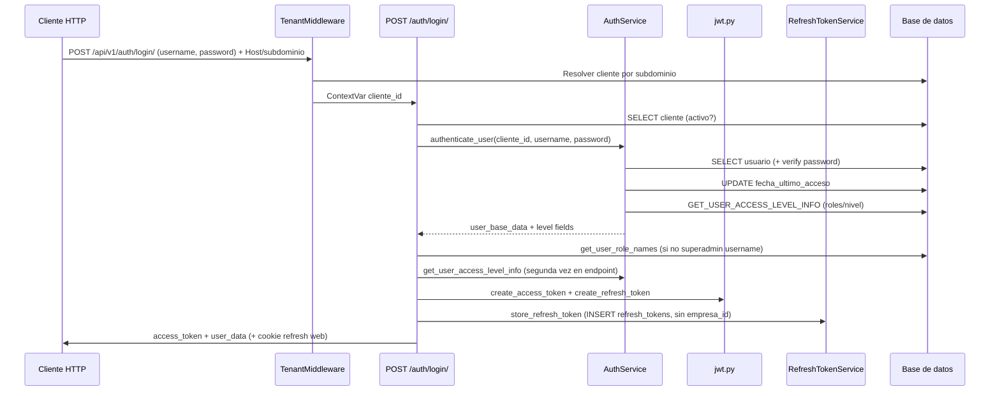

# AUDITORÍA PUNTO 1 — JWT Y PROCESO DE LOGIN

**Fecha:** 2026-05-17  
**Alcance:** Solo análisis y documentación. Sin cambios en código de aplicación.  
**Archivos principales revisados:**
- `app/modules/auth/presentation/endpoints.py`
- `app/modules/auth/application/services/auth_service.py`
- `app/core/security/jwt.py`
- `app/core/auth/__init__.py`
- `app/api/deps.py`
- `app/core/auth/user_builder.py`
- `app/core/authorization/rbac.py`
- `app/modules/auth/application/services/refresh_token_service.py`
- `app/infrastructure/database/queries/auth/refresh_token_queries_core.py`
- `app/infrastructure/database/queries/auth/auth_queries.py`
- `app/modules/users/application/services/user_service.py`
- `app/modules/rbac/application/services/permisos_usuario_service.py`
- `app/core/config.py`
- `app/docs/database/1.- TABLAS_BD_CENTRAL.sql`

---

## PASO 1 — Proceso de login actual

### Ubicación del endpoint

| Campo | Valor |
|-------|--------|
| **Archivo** | `app/modules/auth/presentation/endpoints.py` |
| **Función** | `login()` (línea ~105) |
| **Ruta completa** | `POST /api/v1/auth/login/` |
| **Prefijo API** | `settings.API_V1_STR` = `/api/v1` + router `/auth` + `/login/` |

### Body de la solicitud

El endpoint usa **`OAuth2PasswordRequestForm`** (`application/x-www-form-urlencoded`), no JSON:

| Campo | Obligatorio | Descripción |
|-------|-------------|-------------|
| `username` | Sí | Nombre de usuario |
| `password` | Sí | Contraseña |
| `grant_type` | No* | Valor por defecto OAuth2 (`password`) |
| `scope` | No | Opcional |
| `client_id` / `client_secret` | No | Opcionales en el form |

\* FastAPI/OAuth2 pueden exigir `grant_type` según configuración del cliente.

**No se envía `cliente_id` en el body.** El tenant se resuelve por **subdominio / middleware** (`TenantMiddleware` → `get_current_client_id()`).

**Header opcional:** `X-Client-Type: web` | `mobile` (afecta dónde va el refresh token: cookie vs JSON).

### Queries SQL ejecutadas (en orden)

| # | Momento | Query / operación | Propósito | Archivo |
|---|---------|-------------------|-----------|---------|
| 1 | Middleware (antes del handler) | `SELECT ... FROM cliente WHERE subdominio = ...` (vía `TenantMiddleware` / routing) | Resolver `cliente_id` del host | `app/core/tenant/middleware.py` |
| 2 | Login paso 2 | `SELECT ... FROM cliente WHERE cliente_id = :cliente_id` | Validar que el cliente existe y `es_activo` | `ClienteService.obtener_cliente_por_id` → BD ADMIN |
| 3 | Autenticación | `SELECT usuario_id, cliente_id, nombre_usuario, correo, contrasena, nombre, apellido, es_activo FROM usuario WHERE ...` | Buscar usuario y validar credenciales | `AuthService.authenticate_user` |
| 4 | Autenticación | `UPDATE usuario SET fecha_ultimo_acceso = GETDATE() WHERE usuario_id = ...` | Actualizar último acceso | `AuthService.authenticate_user` |
| 5 | Autenticación | `GET_USER_ACCESS_LEVEL_INFO_COMPLETE` o variante multi-DB sin `cliente_id` en JOIN | Calcular `access_level`, `is_super_admin`, `user_type` | `AuthService.get_user_access_level_info` |
| 6 | Login paso 5 | `SELECT r.nombre FROM rol r INNER JOIN usuario_rol ur ... WHERE ur.usuario_id = ? AND ur.cliente_id = ?` | Nombres de roles para la respuesta (no superadmin: rol implícito) | `UsuarioService.get_user_role_names` |
| 7 | Post-login | `INSERT INTO refresh_tokens (...)` | Persistir hash del refresh token | `insert_refresh_token_core` |
| 8 | Auditoría (opcional) | Evento `login_success` / `login_failed` | `AuditService.registrar_auth_event` | No bloquea el flujo |

**Variante superadmin:** si `username == settings.SUPERADMIN_USERNAME`, la búsqueda de usuario usa **BD ADMIN** con `cliente_id = SUPERADMIN_CLIENTE_ID`, pero el token lleva `cliente_id` del tenant destino (`target_cliente_id`).

**Variante BD dedicada (`database_type == "multi"`):** la query de usuario **no filtra por `cliente_id`**; se usa el contexto del tenant para `cliente_id` efectivo.

### Validación de `cliente_id`

| Pregunta | Respuesta |
|----------|-----------|
| ¿Valida `cliente_id`? | **Sí** |
| ¿Cómo? | 1) `get_current_client_id()` desde `TenantMiddleware` (subdominio → BD). 2) `ClienteService.obtener_cliente_por_id(cliente_id)` y rechazo si no existe o `es_activo == false` (401). 3) En login de usuario regular, `authenticate_user(cliente_id, ...)` filtra por `cliente_id` en BD compartida. 4) Opcionalmente `ENABLE_TENANT_TOKEN_VALIDATION` al usar el access token (no en login). |

### Validación de `empresa_id`

| Pregunta | Respuesta |
|----------|-----------|
| ¿Valida `empresa_id` en login? | **No** |
| Detalle | No se recibe `empresa_id` en el request, no se consulta `usuario.empresa_default_id` ni `usuario_rol.empresa_id` durante el login. |

### Response (campos exactos)

Modelo: `Token` (`app/modules/auth/presentation/schemas.py`).

**Web (`X-Client-Type: web`):**

```json
{
  "access_token": "<JWT>",
  "token_type": "bearer",
  "user_data": { ... }
}
```

+ cookie HttpOnly `refresh_token` (nombre: `settings.REFRESH_COOKIE_NAME`).

**Mobile (`X-Client-Type: mobile`):**

```json
{
  "access_token": "<JWT>",
  "token_type": "bearer",
  "refresh_token": "<JWT refresh>",
  "user_data": { ... }
}
```

**`user_data`** (dict construido en login; no siempre cumple todos los campos del schema `UserDataWithRoles`):

| Campo | Origen |
|-------|--------|
| `usuario_id` | BD `usuario` |
| `cliente_id` | BD o contexto (multi-DB) |
| `nombre_usuario` | BD |
| `correo` | BD |
| `nombre` | BD |
| `apellido` | BD |
| `es_activo` | BD |
| `access_level` | Query niveles |
| `is_super_admin` | Query niveles |
| `user_type` | Derivado (`super_admin` / `tenant_admin` / `user`) |
| `target_cliente_id` | Superadmin: tenant destino; regular: `cliente_id` |
| `es_superadmin` | Solo si login con `SUPERADMIN_USERNAME` |
| `roles` | Lista de strings (nombres de rol) o `["Super Administrador"]` para superadmin |

**No se devuelven en login:** lista de permisos RBAC, `empresa_id`, `empresa_default_id`.

---

## PASO 2 — Generación del JWT

### Ubicación

`app/core/security/jwt.py` — funciones `create_access_token` y `create_refresh_token`.

Invocadas desde `app/modules/auth/presentation/endpoints.py` (login y refresh).

### Payload del access token

Construcción previa en login (`token_data`):

```python
{
  "sub": "<username>",
  "cliente_id": "<UUID string target_cliente_id>",
  "level_info": { "access_level", "is_super_admin", "user_type" },
  # opcional si superadmin por username:
  "es_superadmin": True
}
```

`create_access_token` añade y **elimina `level_info`** del payload final:

| Campo en JWT | Nombre exacto | Origen |
|--------------|---------------|--------|
| Subject | `sub` | `form_data.username` |
| Tenant | `cliente_id` | `str(target_cliente_id)` — tenant destino |
| Superadmin plataforma | `es_superadmin` | Solo si `user_base_data['es_superadmin']` (login username reservado) |
| Nivel LBAC | `access_level` | `level_info['access_level']` ← query `usuario_rol`/`rol` |
| Flag super admin | `is_super_admin` | `level_info['is_super_admin']` ← rol `SUPER_ADMIN` nivel 5 |
| Tipo usuario | `user_type` | `level_info['user_type']` — `super_admin` \| `tenant_admin` \| `user` |
| Tipo token | `type` | `"access"` (fijo) |
| Emisión / expiración | `iat`, `exp` | `datetime.utcnow()` + `settings.ACCESS_TOKEN_EXPIRE_MINUTES` |
| Revocación | `jti` | `uuid4()` |

**Firma:** `settings.SECRET_KEY`, algoritmo `settings.ALGORITHM` (HS256).

### Payload del refresh token

Mismos campos de negocio que access (`sub`, `cliente_id`, `access_level`, `is_super_admin`, `user_type`, `es_superadmin` si aplica), más:

| Campo | Valor |
|-------|--------|
| `type` | `"refresh"` |
| `exp` | `utcnow + settings.REFRESH_TOKEN_EXPIRE_DAYS` |
| `jti` | UUID único |

**Firma:** `settings.REFRESH_SECRET_KEY`.

### Checklist JWT

| Pregunta | Respuesta |
|----------|-----------|
| ¿Incluye `empresa_id` en access? | ❌ |
| ¿Incluye `empresa_id` en refresh? | ❌ |
| ¿Flag tipo de usuario? | ✅ — `user_type`, `is_super_admin`, y opcionalmente `es_superadmin` |
| ¿`es_admin_cliente`? | ❌ — existe en tabla `rol.es_admin_cliente` (BD), no en JWT |

### Expiración access token

| Aspecto | Detalle |
|---------|---------|
| **Dónde** | `app/core/security/jwt.py` línea ~37 |
| **Valor** | `timedelta(minutes=settings.ACCESS_TOKEN_EXPIRE_MINUTES)` |
| **Default** | `15` minutos (`app/core/config.py`, env `ACCESS_TOKEN_EXPIRE_MINUTES`) |
| ¿Lee `cliente_auth_config.access_token_minutes`? | **No** — hardcodeado vía `settings` / `.env`, no por tenant |

### Expiración refresh token

| Aspecto | Detalle |
|---------|---------|
| **JWT `exp`** | `settings.REFRESH_TOKEN_EXPIRE_DAYS` (default **7** días) en `jwt.py` |
| **BD `expires_at`** | `RefreshTokenService.store_refresh_token` usa el mismo `REFRESH_TOKEN_EXPIRE_DAYS` |
| **Cookie max-age** | `settings.REFRESH_COOKIE_MAX_AGE` derivado de esos días |
| ¿Lee `cliente_auth_config.refresh_token_days`? | **No** |

> La tabla `cliente_auth_config` y `AuthConfigService` existen (`access_token_minutes`, `refresh_token_days`), pero **no participan** en `create_access_token` / `create_refresh_token` ni en `store_refresh_token`.

---

## PASO 3 — Roles y permisos en login

### ¿Cuándo se cargan los permisos?

| Fase | Roles | Permisos RBAC |
|------|-------|----------------|
| **Durante login** | Solo **nombres** (`get_user_role_names`) para `user_data.roles` | **No** |
| **En cada request autenticado** | Sí — `build_user_with_roles` → query `usuario_rol` + `rol` | Sí — si `USE_PERMISSION_RESOLVER=true` vía `PermissionResolver`, si no `obtener_codigos_permiso_usuario` |
| **Lazy / endpoint dedicado** | `/auth/me/` recarga usuario completo | `GET /auth/permissions/me` usa Permission Resolver bajo demanda |

Los permisos **no van en el JWT**. Se resuelven al construir `UsuarioReadWithRoles` en `get_current_active_user` (`app/api/deps.py`).

### Query de roles del usuario

**En login (solo nombres):**

```sql
SELECT r.nombre
FROM dbo.rol r
INNER JOIN dbo.usuario_rol ur ON r.rol_id = ur.rol_id
WHERE ur.usuario_id = ? AND ur.cliente_id = ? AND ur.es_activo = 1 AND r.es_activo = 1;
```

Método: `UsuarioService.get_user_role_names` — `app/modules/users/application/services/user_service.py`.

**En cada request (roles completos):** SQLAlchemy `select` en `build_user_with_roles` — filtra por `usuario_id`, `es_activo`; en BD compartida también `rol.cliente_id = request_cliente_id OR NULL`.

**Nivel de acceso (login + refresh):**

```sql
-- BD compartida (GET_USER_ACCESS_LEVEL_INFO_COMPLETE)
SELECT 
    ISNULL(MAX(r.nivel_acceso), 1) as max_level,
    COUNT(CASE WHEN r.codigo_rol = 'SUPER_ADMIN' AND r.nivel_acceso = 5 THEN 1 END) as super_admin_count,
    COUNT(*) as total_roles
FROM usuario_rol ur
INNER JOIN rol r ON ur.rol_id = r.rol_id
WHERE ur.usuario_id = :usuario_id 
  AND ur.es_activo = 1
  AND r.es_activo = 1
  AND (r.cliente_id = :cliente_id OR r.cliente_id IS NULL)
```

En BD dedicada (`multi`): misma query **sin** filtro `(r.cliente_id = :cliente_id OR ...)`.

### ¿La query de roles filtra por `empresa_id`?

| Query | Filtra `empresa_id` |
|-------|---------------------|
| `get_user_role_names` | ❌ |
| `GET_USER_ACCESS_LEVEL_INFO_COMPLETE` | ❌ |
| `build_user_with_roles` (roles) | ❌ |
| `obtener_codigos_permiso_usuario` | ❌ |

**Problema crítico (multi-empresa):** `usuario_rol.empresa_id` y `rol.empresa_id` existen en `1.- TABLAS_BD_CENTRAL.sql`, pero ninguna query de auth/RBAC los usa. Un usuario con roles distintos por empresa recibiría la unión de todos los roles/permisos del tenant.

### Permisos en JWT vs request

| Ubicación | ¿Permisos? |
|-----------|------------|
| JWT access/refresh | ❌ |
| Objeto `current_user` en endpoints | ✅ lista `permisos` (códigos string) vía `build_user_with_roles` |
| `GET /auth/permissions/me` | ✅ lista plana desde Permission Resolver |

### Verificación RBAC en endpoints

Patrón principal (módulos ERP, ej. ORG):

```python
from app.core.authorization.rbac import require_permission

current_user: UsuarioReadWithRoles = Depends(require_permission("org.empresa.leer"))
```

Alternativas en `app/core/authorization/rbac.py`:

- `RequirePermission({ "codigo": "...", ... })` — code-first + registro en startup
- `require_super_admin()`, `require_tenant_admin()`
- `require_any_permission([...])`, `require_any_role([...])`
- `RoleChecker(["Administrador"])` en `app/api/deps.py` — comparación por **nivel LBAC**, no por código de permiso

Función interna: `has_permission(user, permission)` — super_admin bypass; resto compara `user.permisos` (cargados en cada request, no en JWT).

---

## PASO 4 — Manejo de refresh token

### Endpoint

| Campo | Valor |
|-------|--------|
| **Ruta** | `POST /api/v1/auth/refresh/` |
| **Archivo** | `app/modules/auth/presentation/endpoints.py` → `refresh_access_token` |
| **Dependencia** | `get_current_user_from_refresh` → `AuthService.get_current_user_from_refresh` |

### Query SQL para validar refresh token

1. **JWT:** `decode_refresh_token` (firma + `type == refresh` + campos de nivel).
2. **BD:**

```sql
-- Equivalente lógico (refresh_token_queries_core / get_refresh_token_by_hash_core)
SELECT token_id, usuario_id, token_hash, expires_at, is_revoked, created_at, client_type, cliente_id
FROM refresh_tokens
WHERE token_hash = :token_hash
  AND cliente_id = :cliente_id
  AND is_revoked = 0
  AND expires_at > GETDATE();
```

`cliente_id` para el filtro: `get_current_client_id()` del contexto del request (middleware).

3. **Usuario activo:**

```sql
SELECT usuario_id, cliente_id, nombre_usuario, correo, nombre, apellido, es_activo
FROM usuario
WHERE nombre_usuario = ? AND es_eliminado = 0
```

### ¿Consulta `empresa_id` en refresh?

| Aspecto | Respuesta |
|---------|-----------|
| Validación BD refresh | ❌ — solo `token_hash` + `cliente_id` |
| Regeneración access token | ❌ — no relee `empresa_id` |
| Reconsulta niveles | ✅ — `get_user_access_level_info(usuario_id, cliente_id)` **sin** `empresa_id` |

### ¿Regenera token con mismos campos o relee BD?

| Dato | Comportamiento en refresh |
|------|---------------------------|
| `sub`, `cliente_id` del JWT previo | Reutiliza vía `current_user` / payload |
| `access_level`, `is_super_admin`, `user_type` | **Reconsulta BD** con `get_user_access_level_info` y vuelve a codificar en el nuevo JWT |
| Roles / permisos | **No** se incluyen en respuesta refresh (`user_data: null`) |
| Roles en BD del usuario | Sí — query usuario por `nombre_usuario` |

### ¿`empresa_id` en tabla `refresh_tokens`?

| Capa | `empresa_id` |
|------|----------------|
| **SQL diseño** (`1.- TABLAS_BD_CENTRAL.sql`) | ✅ columna `empresa_id UNIQUEIDENTIFIER NULL` + FK + índice |
| **SQLAlchemy** `RefreshTokensTable` (`tables.py`) | ❌ **no definida** |
| **`insert_refresh_token_core`** | ❌ no inserta `empresa_id` |

**Conclusión:** el campo existe en script de BD; la aplicación **no lo persiste ni lo valida**.

---

## PASO 5 — Detección del tipo de usuario

### Super Admin CAXIS (plataforma)

| Aspecto | Detalle |
|---------|---------|
| **¿Existe flag dedicado en JWT?** | Parcial: `es_superadmin` (login por username reservado) + `is_super_admin` + `user_type == 'super_admin'` |
| **Detección en login** | `username == settings.SUPERADMIN_USERNAME` → busca en BD ADMIN, `es_superadmin: True` en token |
| **Detección por rol** | `codigo_rol = 'SUPER_ADMIN'` y `nivel_acceso = 5` → `is_super_admin: True` |
| **Almacenamiento** | Usuario en cliente SYSTEM (`SUPERADMIN_CLIENTE_ID`); no hay columna `es_super_admin` en tabla `usuario` |
| **En `/me/`** | También infiere por `codigo_rol` `ADMIN_PLATFORM` o `SUPER_ADMIN` → `platform_admin` |

No hay campo único `es_super_admin_caxis` en BD; es **combinación** de username reservado + rol `SUPER_ADMIN` + flags JWT.

### Admin del cliente

| Aspecto | Detalle |
|---------|---------|
| **Campo BD** | `rol.es_admin_cliente BIT` — **no se lee en flujo de login/JWT** |
| **Códigos de rol** | `ADMIN_TENANT`, `Administrador` (alias en rbac) |
| **JWT** | `user_type == 'tenant_admin'` si `access_level >= 4` (sin mirar `es_admin_cliente`) |
| **`es_admin_cliente` en JWT** | ❌ **Faltante** |

### Usuario normal

`user_type == 'user'`, `access_level < 4`, sin rol `SUPER_ADMIN`.

### Decisión de nivel de acceso en login

```
1. Resolver cliente_id (middleware)
2. authenticate_user → usuario + level_info (query MAX(nivel_acceso), SUPER_ADMIN count)
3. get_user_access_level_info:
   - is_super_admin = super_admin_count > 0
   - user_type = super_admin | tenant_admin (level>=4) | user
4. create_access_token / create_refresh_token aplana level_info al payload
5. Superadmin por username: es_superadmin=True además de lo anterior
```

---

## PASO 6 — Diagrama del flujo actual



**Validaciones:** tenant activo, credenciales, usuario activo, (opcional) rate limit login.

**Token final (access):** `sub`, `cliente_id`, `access_level`, `is_super_admin`, `user_type`, `es_superadmin?`, `type`, `iat`, `exp`, `jti`.

**Respuesta cliente:** `access_token`, `token_type`, `user_data` (sin permisos, sin `empresa_id`).

---

## PASO 7 — Diagnóstico

| Aspecto | Estado | Problema detectado |
|---------|--------|-------------------|
| Validación de `cliente_id` en login | 🟢 | Resuelto por middleware + validación cliente activo + filtro usuario en BD shared. Riesgo menor en multi-DB sin filtro por `cliente_id` en SELECT usuario (mitigado por BD dedicada por tenant). |
| `empresa_id` en JWT | 🔴 | No existe en access ni refresh. Imposible scope multi-empresa desde token. |
| Flag tipo de usuario en JWT | 🟡 | Existen `user_type`, `is_super_admin`, `es_superadmin`; falta `es_admin_cliente` / `empresa_id` / selección explícita de empresa activa. |
| Roles filtrados por `empresa_id` | 🔴 | Ninguna query de auth/RBAC filtra `usuario_rol.empresa_id` ni `rol.empresa_id`. |
| `empresa_id` en `refresh_tokens` | 🔴 | Columna en SQL de diseño; ORM e `insert_refresh_token_core` no la usan. |
| Expiración desde `cliente_auth_config` | 🔴 | Tokens usan `settings` globales; config por cliente no aplicada en runtime. |
| Distinción Super Admin vs Admin cliente | 🟡 | Funciona por username reservado + rol `SUPER_ADMIN` + `access_level`; `es_admin_cliente` en BD ignorado; mezcla `user_type` con `platform_admin` solo en `/me/`. |

### Preguntas concretas

#### 1. ¿Qué campos hay que agregar al JWT que actualmente no están?

Recomendación mínima para multi-empresa:

| Campo propuesto | Motivo |
|-----------------|--------|
| `empresa_id` | Empresa activa de la sesión (scope ERP) |
| `empresa_default_id` (opcional) | Referencia del usuario si no envía empresa en login |
| `es_admin_cliente` (opcional) | Alinear con `rol.es_admin_cliente` sin recalcular por nivel |
| `permisos_version` o `roles_hash` (opcional) | Invalidar cache cliente cuando cambien roles |

No se recomienda meter la lista completa de permisos en el JWT (tamaño y stale data); mantener resolución en request o endpoint `/permissions/me`.

#### 2. ¿Qué queries hay que modificar para considerar `empresa_id`?

| Query / componente | Cambio |
|--------------------|--------|
| `UsuarioService.get_user_role_names` | `AND (ur.empresa_id = :empresa_id OR ur.empresa_id IS NULL)` |
| `GET_USER_ACCESS_LEVEL_INFO_COMPLETE` / rama multi-DB | Filtrar por `ur.empresa_id` / `r.empresa_id` |
| `build_user_with_roles` (select roles) | Filtro `empresa_id` |
| `obtener_codigos_permiso_usuario` / `_permisos_single` | Join con `usuario_rol.empresa_id` |
| `insert_refresh_token_core` | Persistir `empresa_id` de sesión |
| `get_refresh_token_by_hash_core` | Validar coherencia `empresa_id` si aplica |
| Login: nueva query o parámetro | Resolver empresa (body, header `X-Empresa-Id`, o `usuario.empresa_default_id`) |

#### 3. ¿Qué falta implementar completamente desde cero?

| Ítem | Estado actual |
|------|----------------|
| Selección de empresa en login (request + validación usuario-empresa) | ❌ No existe |
| Propagación `empresa_id` en JWT, refresh y contexto de request | ❌ |
| Persistencia `empresa_id` en `refresh_tokens` (código alineado con BD) | ❌ Parcial en SQL solo |
| Expiración JWT/refresh leyendo `cliente_auth_config` por tenant | ❌ Config existe, no cableada |
| SSO Azure/Google | ❌ `NotImplementedError` |
| Uso de `rol.es_admin_cliente` en auth | ❌ Columna BD sin uso en código |
| Permission resolver filtrado por empresa | ❌ |
| Middleware/dependency `get_current_empresa_id()` | ❌ (patrón análogo a `cliente_id`) |

---

## Referencias rápidas de código

| Tema | Ruta |
|------|------|
| Login endpoint | `app/modules/auth/presentation/endpoints.py` |
| Autenticación | `app/modules/auth/application/services/auth_service.py` |
| JWT | `app/core/security/jwt.py` |
| Config expiración global | `app/core/config.py` |
| RBAC deps | `app/core/authorization/rbac.py` |
| Usuario + permisos por request | `app/api/deps.py`, `app/core/auth/user_builder.py` |
| Refresh persistencia | `app/infrastructure/database/queries/auth/refresh_token_queries_core.py` |
| Diseño BD `empresa_id` | `app/docs/database/1.- TABLAS_BD_CENTRAL.sql` (tablas `usuario`, `rol`, `usuario_rol`, `refresh_tokens`) |

---

*Documento generado por auditoría estática del repositorio. No se modificó código de aplicación.*
