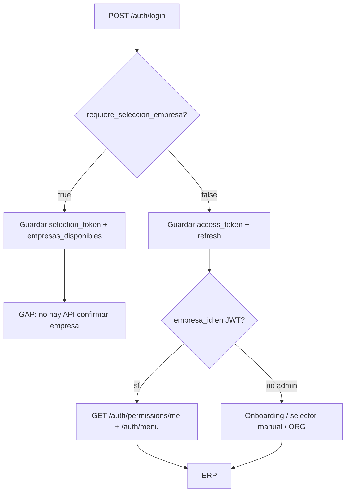

# Auditoría — Empresa activa y JWT

**Fecha:** 2026-05-18  
**Alcance:** Solo análisis (sin cambios de código).  
**Contexto:** Punto 1 implementado — `empresa_id` / `es_admin_cliente` en JWT, roles y permisos filtrados por empresa, `refresh_tokens.empresa_id` persistido.

---

## Archivos Python de referencia

| Área | Rutas |
|------|--------|
| JWT | `app/core/security/jwt.py` |
| Login / me / permisos / menú | `app/modules/auth/presentation/endpoints.py` |
| Schemas auth | `app/modules/auth/presentation/schemas.py` |
| Resolución empresa en login | `app/modules/auth/application/services/auth_service.py` (`get_empresa_activa_para_login`, `usuario_tiene_es_admin_cliente`, `get_user_access_level_info`, `get_current_user_from_refresh`) |
| Contexto request | `app/core/tenant/empresa_context.py`, `app/api/deps.py` |
| Usuario + roles | `app/core/auth/user_builder.py` |
| Permisos | `app/core/authorization/permission_resolver.py`, `app/modules/rbac/application/services/permisos_usuario_service.py` |
| Menú | `app/core/authorization/menu_resolver.py`, `app/modules/auth/presentation/endpoints.py` (`GET /auth/menu`) |
| Refresh BD | `app/infrastructure/database/queries/auth/refresh_token_queries_core.py`, `app/modules/auth/application/services/refresh_token_service.py` |
| Refresh endpoint | `app/modules/auth/presentation/endpoints.py` (`POST /auth/refresh/`) |
| Auditoría auth | `app/modules/superadmin/application/services/audit_service.py` (`auth_audit_log`) |

---

## 1. JWT access token — claims

### Claims estándar (siempre en access y refresh)

Generados en `create_access_token` / `create_refresh_token` (`jwt.py`):

| Claim | Origen | Notas |
|-------|--------|--------|
| `sub` | `token_data` | Nombre de usuario |
| `cliente_id` | `token_data` | UUID del tenant (string) |
| `exp`, `iat` | Automático | Expiración según tenant (`cliente_auth_config`) o `settings` |
| `type` | Automático | `"access"` o `"refresh"` |
| `jti` | Automático | Revocación vía Redis blacklist |
| `access_level` | `level_info` → aplanado | 1–5, max de roles activos |
| `is_super_admin` | `level_info` | `true` si existe rol `SUPER_ADMIN` nivel 5 |
| `user_type` | `level_info` | `super_admin` \| `tenant_admin` (nivel ≥ 4) \| `user` |
| `es_admin_cliente` | Parámetro explícito o `false` | Siempre presente (bool) |

### Claims opcionales (multi-empresa)

| Claim | Cuándo aparece |
|-------|----------------|
| `empresa_id` | Solo si hay empresa activa resuelta (string UUID). **Omitido** del payload si es `None` (`_apply_empresa_claims`). |
| `es_superadmin` | Solo en login de superadmin cross-tenant (`endpoints.py` añade `es_superadmin: true` al `token_data`; no se elimina antes del encode). |
| `empresa_selection_pending` | Solo en **selection token** (login multi-empresa), valor `true`. |

Refresh usa **misma forma** de claims (`REFRESH_SECRET_KEY`), incluyendo `empresa_id` y `es_admin_cliente` cuando aplican.

### Valores por escenario

| Escenario | `empresa_id` | `es_admin_cliente` | Refresh en login |
|-----------|--------------|-------------------|------------------|
| Una empresa (o default válido) | UUID empresa | Según roles filtrados por esa empresa | Sí |
| Varias empresas, sin `empresa_default_id` | **Ausente** | Calculado sin empresa activa (roles globales `ur.empresa_id IS NULL`) | **No** — `LoginEmpresaSelectionResponse` |
| Selection token | **Ausente** | Sí (en token) | No |
| Admin cliente sin filas en `usuario_rol` con empresa | **Ausente** | `true` si rol con `es_admin_cliente=1` y `ur.empresa_id IS NULL` | Sí (flujo normal `Token`) |
| Superadmin en tenant | Según resolución (suele sin empresa) | Según roles del tenant destino | Sí |

Lógica de resolución: `AuthService.get_empresa_activa_para_login` (`auth_service.py`).

---

## 2. `GET /auth/me` y respuesta de login

### Login — dos respuestas posibles

**A) `Token`** (`POST /api/v1/auth/login/`) — sesión completa

```json
{
  "access_token": "<JWT>",
  "token_type": "bearer",
  "refresh_token": "<solo mobile>",
  "user_data": { ... }
}
```

`user_data` = `UserDataWithRoles` (`schemas.py`):

| Campo | Presente en login |
|-------|-------------------|
| `usuario_id`, `nombre_usuario`, `correo`, `nombre`, `apellido`, `es_activo` | Sí |
| `roles` | Sí (nombres, filtrados por `empresa_activa` si existe) |
| `access_level`, `is_super_admin`, `user_type`, `cliente_id` | Sí |
| `es_admin_cliente` | Sí |
| `empresa_activa` | Sí (string UUID o `null`) |
| `empresas_disponibles` | **No** |
| `requiere_seleccion_empresa` | **No** (solo en respuesta B) |

**B) `LoginEmpresaSelectionResponse`** — debe elegir empresa

| Campo | Valor |
|-------|--------|
| `requiere_seleccion_empresa` | `true` |
| `empresas_disponibles` | `UUID[]` (distinct `usuario_rol.empresa_id`) |
| `selection_token` | JWT access temporal |
| `token_type` | `"bearer"` |
| `user_data` | Igual que arriba (sin `empresa_activa` típicamente) |
| `access_token` / `refresh_token` | **Ausentes** |

### `GET /api/v1/auth/me/`

- **Schema declarado:** `UserDataWithRoles`
- **Implementación real:** dict manual (`endpoints.py` ~436–453), **no** alineado 1:1 con login.

| Campo útil FE | En login `user_data` | En `/me` |
|---------------|----------------------|----------|
| `empresa_activa` / `empresa_id` | `empresa_activa` | **No** — no se lee del JWT ni BD |
| `empresas_asignadas` | No (solo en selection: `empresas_disponibles`) | **No** |
| `requiere_seleccion_empresa` | Solo respuesta selection | **No** |
| `empresa_selection_pending` | Solo claim JWT selection | **No** |
| `es_admin_cliente` | Sí | **No** |
| `access_level`, `user_type`, `is_super_admin` | Sí | Sí (token + recálculo por `codigo_rol`) |
| `tipo_usuario`, `es_tenant_admin`, `cliente`, `modulos_activos` | Parcial | **Sí** (extras en `/me`) |

**Conclusión:** el contrato FE para multi-empresa debe tomarse del **login** y del **JWT decodificado**; `/me` no replica flags de empresa.

---

## 3. Endpoints de selección / cambio de empresa

**No existe** en el código actual ninguno de:

- `POST /auth/empresa`
- `POST /auth/select-empresa`
- `PATCH /usuarios/me/empresa`
- Endpoint que emita nuevo access/refresh tras elegir empresa

**Gap funcional:** tras `LoginEmpresaSelectionResponse`, el frontend solo tiene `selection_token` (`empresa_selection_pending: true`) pero **no hay API** para confirmar empresa y recibir tokens de sesión.

Módulo ORG (`app/modules/org/presentation/endpoints.py`, prefijo `/empresa`) gestiona **maestro** `org_empresa`, no sesión del usuario.

---

## 4. Refresh token

### Persistencia

- `RefreshTokenService.store_refresh_token` → `insert_refresh_token_core` (`refresh_token_queries_core.py`)
- Columna `refresh_tokens.empresa_id` (nullable FK `org_empresa`)
- Mismo valor que `empresa_activa` en login/refresh rotate

### Validación (`get_current_user_from_refresh`)

1. Valida JWT refresh (`REFRESH_SECRET_KEY`), blacklist `jti`
2. Carga fila por hash: `get_refresh_token_by_hash_core` (incluye `empresa_id`)
3. Carga usuario; arma contexto con claims del JWT
4. **`empresa_id` efectivo:** `refresh_tokens.empresa_id` (BD) **prioritario**; fallback claim JWT legacy (`auth_service.py` ~1055–1058)

### Rotación (`POST /api/v1/auth/refresh/`)

- Nuevo access + refresh con mismo `empresa_id`
- `level_info` y `es_admin_cliente` recalculados con esa empresa
- Nuevo registro en `refresh_tokens` con `empresa_id`; revoca el anterior si rotación OK

---

## 5. Permisos y menú

### `GET /api/v1/auth/permissions/me`

- Depende de `get_current_active_user` → establece `current_empresa_id` desde claim `empresa_id` (`deps.py`)
- `PermissionResolver.get_effective_permissions` → `resolve_empresa_id()` → filtro en `permisos_usuario_service`:

```sql
AND (ur.empresa_id IS NULL OR ur.empresa_id = :empresa_id)
```

(solo si hay `empresa_id` en contexto)

### `GET /api/v1/auth/menu`

- Misma cadena: Permission Resolver + `ModuloMenuService.obtener_menu_usuario`
- Permisos efectivos ya filtrados por empresa cuando el token trae `empresa_id`

### Si `empresa_id` es null en el token

| Componente | Comportamiento |
|------------|----------------|
| Filtro `usuario_rol` en permisos | **No se aplica** — entran **todos** los roles del usuario en el tenant |
| Roles en `build_user_with_roles` | Sin filtro por empresa |
| `get_user_access_level_info` en login | Sin filtro empresa |
| Menú / permisos | Unión de permisos de **todas** las empresas + roles globales |

**Riesgo:** usuario multi-empresa con token sin `empresa_id` ve permisos agregados cross-empresa dentro del mismo cliente.

Superadmin: bypass — todos los permisos activos en BD central.

---

## 6. Reglas de negocio

### Cantidad de empresas (`get_empresa_activa_para_login`)

| Caso | `empresas_disponibles` | `requiere_seleccion` | `empresa_activa` |
|------|------------------------|----------------------|------------------|
| 0 empresas en `usuario_rol` | `[]` | `false` | `null` (admin onboarding sin empresa sigue con `Token`) |
| 1 empresa | `[E1]` | `false` | `E1` |
| N > 1, sin `usuario.empresa_default_id` | `[E1..En]` | **`true`** | `null` → selection |
| N > 1, con default ∈ lista | `[E1..En]` | `false` | `empresa_default_id` |
| N > 1, default ∉ lista | `[E1..En]` | `false` | **Primera** (orden UUID string) |

`es_admin_sin_empresa`: existe rol activo con `ur.empresa_id IS NULL` (no fuerza selección por sí solo).

### Tipos de usuario (`user_type` en JWT)

| Tipo | Criterio (access level query) | Notas |
|------|-------------------------------|--------|
| `super_admin` | Rol `SUPER_ADMIN` nivel 5 | Plataforma |
| `tenant_admin` | `access_level >= 4` | Admin tenant |
| `user` | Resto | Operativo |

`/me` puede mostrar `platform_admin` por `codigo_rol` (`ADMIN_PLATFORM`) — **distinto** del `user_type` del JWT.

### `es_admin_cliente`

- **Cálculo:** `AuthService.usuario_tiene_es_admin_cliente` — algún `rol.es_admin_cliente = 1` activo, con filtro `(ur.empresa_id IS NULL OR ur.empresa_id = :empresa_id)` si hay empresa activa.
- **En JWT:** claim booleano para el FE.
- **En código backend:** no hay middleware que bloquee rutas solo por este flag; la autorización efectiva sigue siendo **RBAC** (`require_permission`, roles, permisos). El flag es **informativo** para UI (onboarding, pantallas admin cliente sin empresa).

---

## 7. Auditoría / seguridad

### ¿Se registra cambio de empresa?

- **No.** No hay evento ni endpoint de cambio.
- `auth_audit_log` admite columna `empresa_id` (schema central), pero `registrar_auth_event` en login/refresh **no** envía `empresa_id` en metadata de forma sistemática (solo `login_success`, `login_failed`, `refresh_success`, etc.).

### Riesgos cross-empresa (mismo `cliente_id`)

| Riesgo | Severidad | Detalle |
|--------|-----------|---------|
| Token sin `empresa_id` | Alta | Permisos y roles sin acotar por empresa |
| Selection token sin endpoint de cierre | Alta | FE no puede fijar empresa en sesión |
| `/me` sin `empresa_id` | Media | UI no puede refrescar contexto empresa desde API |
| Refresh hereda empresa de BD | Baja (mitiga) | Rotación consistente si login fue correcto |
| Admin sin empresa | Esperado | Diseño onboarding; debe combinarse con RBAC global (`ur.empresa_id IS NULL`) |
| Cache permisos | Media | Key incluye `empresa_id` (`permission_cache.py`) — correcto si hay empresa; si `null`, cache compartida para “sin empresa” |

Mitigación actual parcial: validación `cliente_id` token vs subdominio; **no** validación “usuario pertenece a empresa X” en cada request (no hay claim o check explícito más allá del filtro RBAC cuando `empresa_id` está presente).

---

## 8. Recomendación para frontend

### Flujo mínimo viable (estado actual)



1. Login con `Origin` del subdominio (`TenantMiddleware`).
2. Si `requiere_seleccion_empresa` → pantalla selector con `empresas_disponibles`; usar `selection_token` solo para llamadas que acepten JWT (limitado hasta exista API de confirmación).
3. Si `Token` normal → decodificar JWT: `empresa_id`, `es_admin_cliente`, `user_type`, `access_level`.
4. Cargar permisos: `GET /api/v1/auth/permissions/me` (Bearer access).
5. Cargar menú: `GET /api/v1/auth/menu`.
6. No confiar en `/me` para empresa; opcional para módulos/cliente (`modulos_activos`).

### Contrato exacto FE (implementado hoy)

| Paso | Método | Path | Headers | Body | Campos respuesta clave |
|------|--------|------|---------|------|------------------------|
| Login | `POST` | `/api/v1/auth/login/` | `Origin: http://{sub}.app.local:8000`, `X-Client-Type: web\|mobile` | `application/x-www-form-urlencoded`: `username`, `password`, `grant_type=password` | Ver A o B abajo |
| Permisos | `GET` | `/api/v1/auth/permissions/me` | `Authorization: Bearer {access}`, `Origin` | — | `{ "permissions": ["codigo", ...] }` |
| Menú | `GET` | `/api/v1/auth/menu` | Igual | — | Estructura menú (`ModuloMenuService`) |
| Refresh | `POST` | `/api/v1/auth/refresh/` | `Origin`, `X-Client-Type` | Web: cookie `refresh_token`; Mobile: `{ "refresh_token": "..." }` | `{ "access_token", "token_type", "refresh_token"? }` |
| Perfil extendido | `GET` | `/api/v1/auth/me/` | Bearer | — | Sin campos empresa |

**Respuesta login A — `Token`:**

- `access_token`, `token_type`
- `user_data.empresa_activa` (string \| null)
- `user_data.es_admin_cliente` (bool)
- `user_data.roles`, `user_data.access_level`, `user_data.user_type`

**Respuesta login B — selección:**

- `requiere_seleccion_empresa: true`
- `empresas_disponibles: UUID[]`
- `selection_token` (JWT con `empresa_selection_pending: true`, sin `empresa_id`)
- `user_data` (sin refresh)

**JWT decodificado (sesión normal):**

- `cliente_id`, `sub`, `access_level`, `is_super_admin`, `user_type`, `es_admin_cliente`
- `empresa_id` (opcional)
- `empresa_selection_pending` (solo selection token)

### Próximo incremento backend (fuera de esta auditoría)

Para cerrar el flujo FE: implementar p. ej. `POST /api/v1/auth/empresa/seleccionar` con `empresa_id`, validar pertenencia vía `usuario_rol`, devolver `Token` completo y auditar el evento.

---

## Resumen ejecutivo

| Tema | Estado |
|------|--------|
| JWT con `empresa_id` / `es_admin_cliente` | Implementado |
| Login multi-empresa (selection) | Parcial — falta endpoint confirmación |
| `/me` alineado con empresa | No |
| Refresh con `empresa_id` | Implementado (BD + rotación) |
| Permisos/menú por empresa | Sí, si JWT trae `empresa_id`; **no** si es null |
| Auditoría cambio empresa | No |
| API cambio de empresa | **No existe** |
