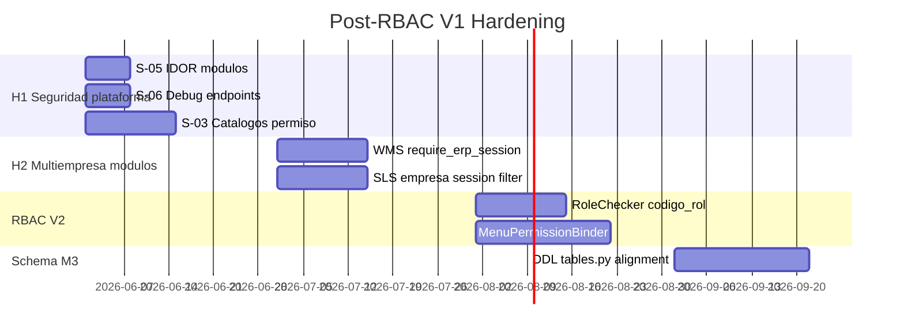

# Backlog post-RBAC V1 — Deuda técnica

**Referencia:** [`RBAC_SECURITY_HARDENING_AUDIT.md`](./RBAC_SECURITY_HARDENING_AUDIT.md)  
**Estado RBAC V1:** **STABLE** (`RBAC_V1_STABLE`) — alcance ORG+INV trial congelado  
**Fecha registro:** 2026-05-31

Este documento consolida hallazgos **P0/P1/P2/P3** identificados en la auditoría de hardening. **No bloquean** el alcance validado RBAC V1. Priorizar en fases posteriores según activación comercial de módulos.

---

## Leyenda de severidad

| Nivel | Criterio |
|-------|----------|
| **P0** | Explotable cross-tenant o bypass auth evidente |
| **P1** | Fuga cross-company o exposición sensible en prod |
| **P2** | Inconsistencia RBAC/schema; deuda arquitectónica |
| **P3** | Limpieza, deprecación, optimización |

---

## P0 — Crítico

| ID | Área | Hallazgo | Endpoint / componente | Acción propuesta | Fase sugerida |
|----|------|----------|----------------------|------------------|---------------|
| **S-05** | Seguridad | IDOR cross-tenant: path acepta cualquier `cliente_id` sin validar sesión | `GET /modulos/disponibles/{cliente_id}/` | Validar `cliente_id == session cliente_id`; restringir a `@require_super_admin` si aplica solo plataforma | Hardening H1 |

**Detalle S-05:**

- Servicio: `ModuloService.obtener_modulos_disponibles_cliente(cliente_id)`
- Cualquier usuario autenticado puede consultar módulos disponibles de **otro tenant**
- Mitigación temporal: restringir ruta a rol plataforma o validar tenant en path

---

## P1 — Alto

| ID | Área | Hallazgo | Componente | Acción propuesta | Fase sugerida |
|----|------|----------|------------|------------------|---------------|
| **S-06** | Seguridad | Endpoints debug expuestos con solo JWT | `GET /clientes/debug/user-info`, `GET /clientes/debug/access-levels` | Deshabilitar en prod (`ENVIRONMENT != development`) o eliminar | Hardening H1 |
| **M-02** | Multiempresa | WMS acepta `empresa_id` por query sin validar sesión | `endpoints_zonas.py`, `endpoints_stock.py`, … | Router `require_erp_session` + `reject_client_empresa_scope_override` | Hardening H2 (al activar WMS) |
| **M-03** | Multiempresa | SLS list sin `empresa_id` retorna datos de **todas** las empresas del tenant | `sls/pedido_queries.py`, `endpoints_pedidos.py` | Obligar filtro `empresa_id` desde sesión; prohibir listado tenant-wide | Hardening H2 (al activar SLS) |

**Detalle M-02:**

```python
# Patrón actual (riesgo)
empresa_id: UUID = Query(...)  # cliente elige empresa arbitraria
```

**Patrón objetivo (referencia INV):**

```python
router = APIRouter(dependencies=[Depends(require_erp_session)])
# empresa_id desde ContextVar/JWT, no query
```

**Detalle M-03:**

```python
# pedido_queries.py — si empresa_id is None, no filtra por empresa
if empresa_id:
    query = query.where(SlsPedidoTable.c.empresa_id == empresa_id)
```

---

## P2 — Medio

| ID | Área | Hallazgo | Acción propuesta | Fase sugerida |
|----|------|----------|------------------|---------------|
| **S-03** | Seguridad | Catálogos geo/moneda sin `require_permission` | Definir permiso `catalogos.*.leer` o equivalente | Hardening H1 |
| **S-04** | Seguridad | `GET /modulos/{id}/dependencias/` solo autenticación | Añadir `modulos.menu.leer` o restringir superadmin | Hardening H1 |
| **C-01** | Consistencia RBAC | Dual-path `rol_permiso` vs `rol_menu_permiso` | Evaluar sync determinista RP→RMP o documentar contrato FE | RBAC V2 |
| **C-03** | Consistencia RBAC | `MenuPermissionBinder` no invocado en startup | Activar en startup o retirar columna `permiso_codigo_requerido` | RBAC V2 |
| **C-04** | Schema | Divergencia DDL `V020` (`rol_menu_permiso.empresa_id`) vs `tables.py` | Migración alineación DDL ↔ SQLAlchemy | Schema M3 |
| **C-05** | Consistencia RBAC | `RoleChecker(["Administrador"])` por nombre, no `codigo_rol` | Migrar a check por `ADMIN_TENANT` / `user_type` | RBAC V2 |
| **M-04** | Multiempresa | Módulos fuera INV/ORG sin gate `require_erp_session` | Hardening progresivo al activar cada módulo comercial | Por módulo |

### Bootstrap gaps relacionados (G-xxx)

| ID | Gap | Acción |
|----|-----|--------|
| **G-022** | `cfg_codigo_secuencia` sin DDL en bootstrap SQL | Añadir a V020 o migración |
| **G-023** | `modulo_menu.permiso_codigo_requerido` no en DDL | Añadir columna o retirar binder |
| **G-010–G-012** | Errores sintaxis DDL legacy central | Corregir en fuente legacy + refresh bootstrap_v2 |
| **G-032** | Doble fuente permiso SQL vs sync | Deprecar S040–S066 en prod |

---

## P3 — Bajo

| ID | Área | Hallazgo | Acción propuesta |
|----|------|----------|------------------|
| **C-02** | Consistencia | ~284 permisos solo-SQL desactivados por sync | Deprecar seeds `S040–S066`; documentar sync como única fuente |
| **S-01** | Seguridad | `GET /auth/me` sin `require_permission` | Mantener by design; documentar |
| **S-02** | Seguridad | `/auth/menu`, `/auth/permissions/me` sin RP explícito | Mantener; protegidos por `require_erp_session` |
| **M-01** | Multiempresa | Manager scoped con sesión otra empresa | Mitigado por filtro RBAC; monitorear |
| **M-05** | Multiempresa | Admin tenant-wide cambia sesión | By design M4 |
| **M-06** | Multiempresa | Query legacy ORG empresa | Mitigado `reject_legacy_empresa_query` |
| **M-07** | Multiempresa | Query legacy ORG cliente | Mitigado `reject_legacy_cliente_query` |

---

## Fuera de alcance RBAC V1 (registrado)

| Tema | Notas |
|------|-------|
| M2 / M3 multiempresa | UQ `usuario_rol`, multi-rol multi-empresa |
| Frontend PermissionGuard | Alinear con `/auth/permissions/me` |
| Bundles MANAGER/USER para SLS, FIN, HCM, … | Al activar módulo comercial |
| MenuPermissionBinder masivo | Requiere diseño |
| Migraciones Flyway/Alembic automatizadas | bootstrap_v2 → pipeline CI |
| Deprecación física R010/R020/S040–S066 | Mantener como recovery |

---

## Roadmap sugerido



---

## Criterios de cierre por ítem

| ID | Done when |
|----|-----------|
| S-05 | Test integración: user tenant A → 403 al consultar disponibles tenant B |
| S-06 | Endpoints debug retornan 404 en `ENVIRONMENT=production` |
| M-02 | WMS zonas/stock rechazan `empresa_id` query ≠ sesión |
| M-03 | SLS list sin sesión empresa → 403 o filtro automático sesión |
| C-04 | DDL y SQLAlchemy `rol_menu_permiso` idénticos; T2/T3 inserts OK en BD V020 |
| C-05 | Admin endpoints usan `codigo_rol` o `user_type`, no nombre rol |

---

## Referencias

- [`RBAC_SECURITY_HARDENING_AUDIT.md`](./RBAC_SECURITY_HARDENING_AUDIT.md) — auditoría completa
- [`RBAC_V1_FINAL.md`](./RBAC_V1_FINAL.md) — modelo congelado V1
- [`RELEASE_NOTES_RBAC_V1.md`](./RELEASE_NOTES_RBAC_V1.md) — notas de release
- [`BOOTSTRAP_GAPS.md`](../../bootstrap_v2/00_manifest/BOOTSTRAP_GAPS.md) — gaps bootstrap SQL

---

**Fin backlog post-RBAC V1**
