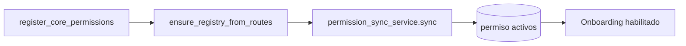
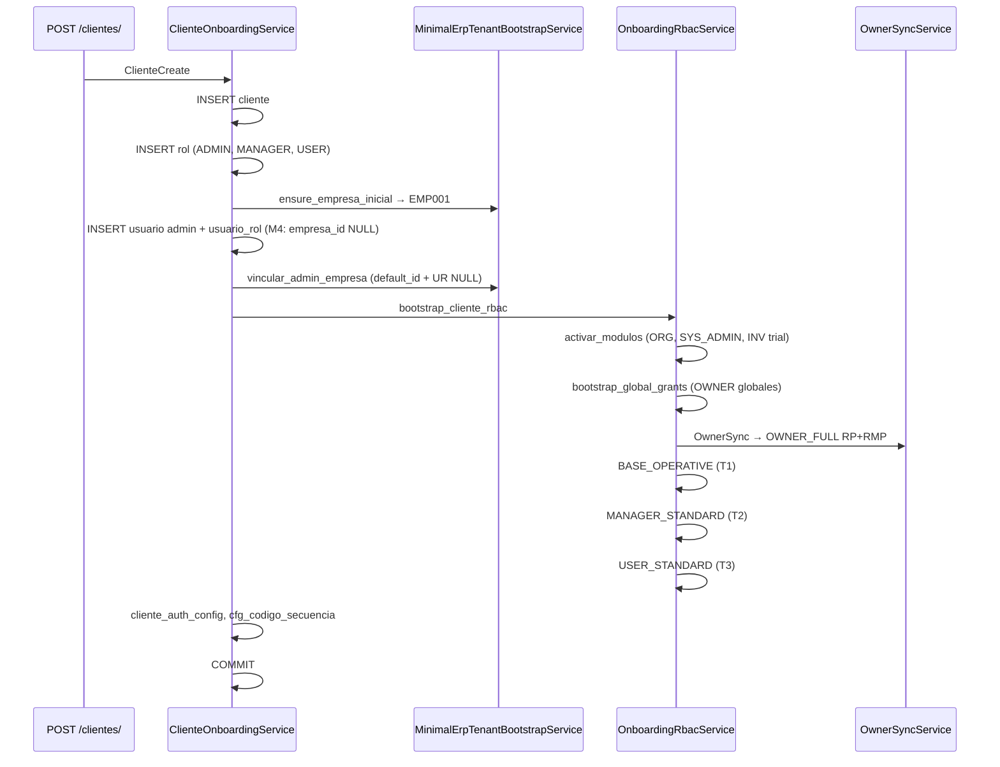
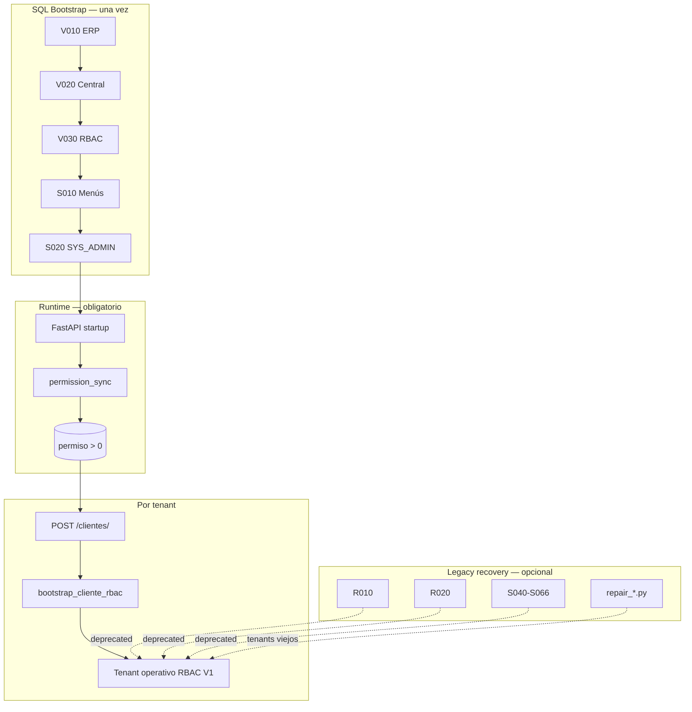

# Auditoría — Bootstrap completo del sistema (BD vacía)

**Tipo:** Auditoría de instalación limpia (sin cambios de código)  
**Fecha:** 2026-05-31  
**Contexto:** Cierre RBAC V1 (M1, M4, T1, T2, T3). Objetivo: validar qué debe existir en BD y runtime antes de declarar **RBAC_V1_STABLE**.  
**Referencias:**

- [`app/bootstrap_v2/README_BOOTSTRAP.md`](../../bootstrap_v2/README_BOOTSTRAP.md)
- [`app/bootstrap_v2/00_manifest/BOOTSTRAP_ORDER.md`](../../bootstrap_v2/00_manifest/BOOTSTRAP_ORDER.md)
- [`app/bootstrap_v2/00_manifest/BOOTSTRAP_MANIFEST.md`](../../bootstrap_v2/00_manifest/BOOTSTRAP_MANIFEST.md)
- [`app/bootstrap_v2/00_manifest/BOOTSTRAP_GAPS.md`](../../bootstrap_v2/00_manifest/BOOTSTRAP_GAPS.md)
- [`app/bootstrap_v2/00_manifest/RUNTIME_DEPENDENCY_MATRIX.md`](../../bootstrap_v2/00_manifest/RUNTIME_DEPENDENCY_MATRIX.md)
- [`RBAC_V1_FINAL.md`](./RBAC_V1_FINAL.md)

---

## 1. Resumen ejecutivo

| Pregunta | Respuesta |
|----------|-----------|
| ¿Qué es una instalación limpia válida? | Schema (V010→V020→V030) + catálogo menú (S010→S020) + **arranque FastAPI** (permission_sync) + onboarding API por tenant |
| ¿Son obligatorios S030, S040–S066, R010, R020 en prod? | **No** para tenants nuevos post-RBAC V1; **sí** el schema y S010/S020; sync reemplaza seeds de permisos |
| ¿Qué datos mínimos debe tener BD antes del primer tenant? | Tablas DDL + `modulo`/`modulo_menu` + catálogo `permiso` poblado por startup |
| ¿Qué crea onboarding vs SQL? | SQL: catálogo global. Onboarding: `cliente`, roles, admin, `org_empresa`, `cliente_modulo`, grants RBAC |
| ¿Estado general? | **Instalable** con perfil PROD mínimo + runtime; gaps documentados (G-001…G-052) no bloquean RC si se sigue el flujo oficial |

**Veredicto auditoría:** La instalación limpia es **viable y reproducible** siguiendo el perfil PROD mínimo + arranque app. Los scripts legacy R010/R020/S040–S066 quedan como recovery, no como pipeline obligatorio.

---

## 2. Perfiles de instalación

### 2.1 PROD mínimo (instalación limpia oficial)

```text
Fase 0   CREATE DATABASE
Fase 1   V010 → V020 → V030                    (schema)
Fase 2   S010 → S020                           (catálogo módulos/menús)
         [omitir S030, S040–S066 en tenants nuevos]
Fase 3   Arrancar FastAPI ≥1 vez               (permission_sync)
Fase 4   [omitir R010, R020 para tenants nuevos]
         POST /api/v1/clientes/                (onboarding por tenant)
```

### 2.2 DEV / QA completo

```text
PROD mínimo
+ D010 → D020 → D030                           (clientes demo, grants QA)
+ repair_platform_rbac.py                      (ADMIN_PLATFORM)
+ SQL manual multiempresa (opcional)
```

### 2.3 Dedicated tenant

```text
PROD central (sin duplicar usuarios D010 en dedicada)
+ V010 en BD dedicada
+ 05_dedicated/V010__rbac_tablas_dedicated.sql
+ cliente_conexion metadata en central
```

---

## 3. Fase por fase — BD vacía → sistema operativo

### Fase 0 — Preparación

| Paso | Acción | Resultado esperado |
|------|--------|-------------------|
| 0.1 | `CREATE DATABASE` con collation acordada | BD vacía |
| 0.2 | Configurar `.env` / Docker (`DATABASE_URL`, `SUPERADMIN_CLIENTE_ID`) | App puede conectar |

**Datos mínimos:** ninguno.

---

### Fase 1 — Schema (`01_schema/`)

| Orden | Script | Tablas principales | Notas |
|:-----:|--------|-------------------|-------|
| **1** | `V010__tablas_bd_erp_completo.sql` | ~100 tablas ERP: `org_*`, `inv_*`, … | **Ejecutar primero** (G-001) |
| **2** | `V020__tablas_bd_central.sql` | `cliente`, `modulo*`, `usuario`, `rol`, `usuario_rol`, `rol_menu_permiso`, auth | FK a `org_empresa` requiere V010 |
| **3** | `V030__rbac_tablas_central.sql` | `permiso`, `rol_permiso` | RBAC API |

**Estado tras Fase 1:**

| Tabla | Filas esperadas |
|-------|:---------------:|
| `modulo` | 0 |
| `modulo_menu` | 0 |
| `permiso` | 0 |
| `cliente` | 0 |
| `rol` | 0 |
| `org_empresa` | 0 |

**Gaps DDL conocidos (no corregidos en v2):**

| ID | Impacto en instalación limpia |
|----|------------------------------|
| G-010–G-012 | Errores sintaxis en DDL legacy central — verificar que copia v2 compila en SQL Server |
| G-022 | `cfg_codigo_secuencia` usada en onboarding Python **sin DDL en scripts auditados** — onboarding falla si no existe |
| G-023 | `modulo_menu.permiso_codigo_requerido` no en DDL — MenuPermissionBinder no persiste |

**Validación SQL post-Fase 1:**

```sql
-- Tablas críticas existen
SELECT COUNT(*) FROM INFORMATION_SCHEMA.TABLES
WHERE TABLE_NAME IN ('cliente','modulo','modulo_menu','permiso','rol_permiso','org_empresa');
-- Esperado: 6

-- Catálogo vacío
SELECT COUNT(*) AS modulos FROM modulo;
SELECT COUNT(*) AS permisos FROM permiso;
-- Esperado: 0, 0
```

---

### Fase 2 — Catálogo global (`02_catalog/`)

#### 2a. Obligatorio PROD

| Orden | Script | Contenido | Conteos esperados |
|:-----:|--------|-----------|:-----------------:|
| 4 | `S010__seed_modulo_menu_completo.sql` | 27 módulos ERP + SYS_ADMIN implícito en S020 | **27** `modulo`, **27** `modulo_seccion`, **~120+** `modulo_menu` |
| 5 | `S020__seed_admin_menu.sql` | Módulo `SYS_ADMIN`, menús PLATFORM/TENANT/CATALOGOS, permisos admin parciales | +1 `modulo`, menús admin |

**Módulos ERP en S010 (27 códigos):**

```
ORG, INV, WMS, QMS, PUR, LOG, MFG, MRP, MPS, MNT, SLS, CRM, PRC,
INV_BILL, POS, HCM, FIN, TAX, BDG, CST, PM, SVC, TKT, BI, DMS, WFL, AUD
```

**Menús trial relevantes RBAC V1 (ORG + INV):**

| Módulo | Menús clave | UUID prefijo |
|--------|-------------|--------------|
| ORG | Mi Empresa, Sucursales, Departamentos, Cargos, Centros Costo, Parámetros | `E3010001`…`E3010006` |
| INV | Productos, Categorías, Unidades, Almacenes, Stock, Tipos Mov., Movimientos, Inv. Físico | `E3020001`…`E3020008` |
| SYS_ADMIN | TENANT.* (onboarding); excluye PLATFORM/CATALOGOS para tenant | vía S020 |

#### 2b. Opcional / deprecated en prod

| Scripts | Estado RBAC V1 | Motivo |
|---------|----------------|--------|
| `S030__seed_permisos_core.sql` | Deprecated | `core.app.acceder` lo crea `permission_sync` + `core_permissions` |
| `S040`…`S066` permisos_rbac | Deprecated prod | 377 códigos SQL solapan sync; sync desactiva ~284 no presentes en API |
| `S067` | **SKIP** | Stub vacío legacy |

**Estado tras Fase 2 (solo S010+S020):**

| Tabla | Filas mínimas |
|-------|:-------------:|
| `modulo` | ≥ 28 (27 + SYS_ADMIN) |
| `modulo_menu` | ≥ 120 |
| `permiso` | 0–N (S020 puede insertar admin.* parcial) |
| `cliente` | 0 |
| `cliente_modulo` | 0 |

**Validación SQL post-Fase 2:**

```sql
SELECT codigo FROM modulo WHERE es_activo = 1 ORDER BY codigo;
-- Debe incluir: ORG, INV, SYS_ADMIN

SELECT COUNT(*) AS menus FROM modulo_menu WHERE es_activo = 1 AND cliente_id IS NULL;
-- > 0

SELECT COUNT(*) AS permisos_activos FROM permiso WHERE es_activo = 1;
-- Puede ser 0 (OK antes de startup) o parcial (S020)
```

---

### Fase 3 — Arranque aplicación (runtime crítico)

| Orden | Acción | Componente | Resultado |
|:-----:|--------|------------|-----------|
| 34 | Arrancar FastAPI | `permission_startup.py` | Registry + sync |
| 35 | Verificar logs | `[RBAC] Permission synced: …` | Catálogo `permiso` poblado |

**Pipeline startup RBAC:**



| Paso | Servicio | Efecto |
|------|----------|--------|
| 1 | `core_permissions.register_core_permissions()` | Whitelist estática; protege `core.app.acceder` |
| 2 | `permission_registry` desde rutas FastAPI | ~113 códigos únicos en API |
| 3 | `permission_sync_service.sync()` | Upsert `permiso`; desactiva obsoletos excepto protegidos |

**Conteos observados (E2E 2026-05-21):**

| Métrica | Valor orientativo |
|---------|:-----------------:|
| `permiso` activos post-sync | ~413 |
| Códigos en API (`require_permission`) | ~113 |
| Códigos solo SQL (sync desactiva) | ~284 |
| Intersección API ∩ SQL | ~93 |

**Estado tras Fase 3 (pre-onboarding):**

| Tabla | Condición mínima |
|-------|------------------|
| `permiso` | `COUNT(*) WHERE es_activo=1` **> 0** |
| `permiso` | `core.app.acceder` activo |
| `cliente` | 0 (prod) o ≥1 (QA D010) |
| `cliente_modulo` | 0 |

**Validación:**

```sql
SELECT COUNT(*) AS total FROM permiso WHERE es_activo = 1;
-- > 0 (bloqueante para onboarding)

SELECT codigo, es_activo FROM permiso WHERE codigo = 'core.app.acceder';
-- es_activo = 1

SELECT codigo FROM permiso WHERE es_activo = 1
  AND codigo IN ('org.empresa.leer','tenant.branding.leer','admin.usuario.leer');
-- Debe existir (sync desde rutas)
```

**Error si se omite Fase 3:**

```
ONBOARDING_PERMISSO_CATALOG_EMPTY
"Catálogo de permisos vacío. Arranque la aplicación al menos una vez..."
```

---

### Fase 4 — Runtime SQL (`03_runtime/`) — **Deprecated para tenants nuevos**

| Script | Acción legacy | Reemplazo runtime |
|--------|---------------|-------------------|
| `R010__asignar_core_app_a_roles.sql` | `core.app.acceder` → todos los roles | `BaseOperativeService` + onboarding |
| `R020__relacion_sys_admin_cliente_modulo.sql` | `cliente_modulo` SYS_ADMIN | `OnboardingRbacService.activar_modulos_base_cliente` |

**Requisito legacy R010/R020:** deben existir filas en `rol` (creadas por D010 o onboarding).

**Estado tras Fase 4 (solo si se ejecuta en legacy):**

- `rol_permiso` con `core.app.acceder` por rol existente
- `cliente_modulo` SYS_ADMIN para clientes demo

**Para instalación limpia RBAC V1:** **omitir** Fase 4; onboarding provisiona todo.

---

### Fase 5 — QA (`04_qa/`) — **NO producción**

| Script | Contenido activo |
|--------|------------------|
| `D010__seed_bd_central.sql` | 5 clientes demo + usuarios/roles (bloques legacy comentados) |
| `D020__rol_permiso_administrador.sql` | Grant masivo todos permisos → rol "Administrador" |
| `D030__cliente_modulo_activar_org.sql` | `cliente_modulo` ORG para UUIDs demo |

**Cliente plataforma (D010):**

| Campo | Valor |
|-------|-------|
| `cliente_id` | `00000000-0000-0000-0000-000000000001` |
| `subdominio` | `platform` |
| Rol sistema | `ADMIN_PLATFORM` |

**Gaps QA:**

| ID | Detalle |
|----|---------|
| G-021 | D010 no inserta `org_empresa` ni `usuario_rol.empresa_id` — login multiempresa requiere SQL adicional |
| G-033 | Bloques comentados masivos en D010 |
| G-034 | D020 incompatible con RBAC explícito prod |

---

### Fase 6 — Onboarding API (primer tenant operativo)

**Endpoint:** `POST /api/v1/clientes/`  
**Servicio:** `ClienteOnboardingService.crear_cliente_con_onboarding`



**Estado esperado post-onboarding (tenant trial ORG+INV+SYS_ADMIN):**

| Entidad | ADMIN_TENANT | MANAGER_TENANT | USER_TENANT |
|---------|:------------:|:--------------:|:-----------:|
| Rol existe | ✅ | ✅ | ✅ |
| `usuario_rol.empresa_id` (admin) | **NULL** (M4) | N/A hasta assign | N/A hasta assign |
| `rol_permiso` bundle | OWNER_FULL (~70–75) | MANAGER_STANDARD (47) | USER_STANDARD (16) |
| `rol_menu_permiso` ver | ~18 | 14 | 14 |
| BASE_OPERATIVE (3 códigos) | ✅ incluido | ✅ | ✅ |

| Tabla tenant | Esperado |
|--------------|----------|
| `cliente_modulo` | ORG + SYS_ADMIN + INV (según plan) |
| `org_empresa` | EMP001 mínimo |
| `usuario.empresa_default_id` | EMP001 (admin) |
| `cfg_codigo_secuencia` | Secuencias ORG/INV del tenant |

**Validación SQL post-onboarding:**

```sql
-- Roles sistema
SELECT codigo_rol FROM rol
WHERE cliente_id = :cid AND es_activo = 1
ORDER BY codigo_rol;
-- ADMIN_TENANT, MANAGER_TENANT, USER_TENANT

-- Admin tenant-wide M4
SELECT ur.empresa_id
FROM usuario_rol ur
JOIN rol r ON r.rol_id = ur.rol_id
WHERE ur.cliente_id = :cid AND r.codigo_rol = 'ADMIN_TENANT';
-- NULL

-- Módulos activos
SELECT m.codigo FROM cliente_modulo cm
JOIN modulo m ON m.modulo_id = cm.modulo_id
WHERE cm.cliente_id = :cid AND cm.esta_activo = 1;
-- ORG, SYS_ADMIN, INV (trial)

-- Bundles operativos T1/T2/T3
SELECT r.codigo_rol, COUNT(DISTINCT p.codigo) AS rp_count
FROM rol r
JOIN rol_permiso rp ON rp.rol_id = r.rol_id AND rp.cliente_id = r.cliente_id
JOIN permiso p ON p.permiso_id = rp.permiso_id AND p.es_activo = 1
WHERE r.cliente_id = :cid
GROUP BY r.codigo_rol;
-- MANAGER_TENANT: 47, USER_TENANT: 16, ADMIN_TENANT: ~70+
```

---

## 4. Matriz bootstrap SQL ↔ onboarding runtime

| Concern | Fuente SQL (legacy) | Fuente runtime (oficial RBAC V1) | ¿Necesario SQL en tenant nuevo? |
|---------|---------------------|----------------------------------|:-------------------------------:|
| Schema BD | V010, V020, V030 | — | **SÍ** |
| Catálogo módulos/menús | S010, S020 | — | **SÍ** |
| Catálogo `permiso` | S030, S040–S066 | `permission_sync` @ startup | **NO** (startup) |
| `core.app.acceder` en roles | R010 | `BaseOperativeService` | **NO** |
| `cliente_modulo` SYS_ADMIN | R020 | `activar_modulos_base_cliente` | **NO** |
| OWNER_FULL (ADMIN) | S020 parcial + S040 | `OwnerSyncService` + global grants | **NO** |
| BASE_OPERATIVE | — | `BaseOperativeService` (T1) | **NO** |
| MANAGER_STANDARD | — | `ManagerStandardService` (T2) | **NO** |
| USER_STANDARD | — | `UserStandardService` (T3) | **NO** |
| Tenant + admin + EMP001 | D010 (QA) | `ClienteOnboardingService` | **NO** (API) |
| ADMIN tenant-wide | — | M4 en onboarding + repair | **NO** |
| Platform RBAC | D010 parcial | `PlatformRbacBootstrapService` + repair | QA only |

---

## 5. Datos mínimos requeridos — checklist instalación limpia

### 5.1 Pre-requisitos globales (una sola vez)

| # | Check | Criterio PASS | Bloqueante |
|:-:|-------|---------------|:----------:|
| G1 | BD creada | Conexión OK | ✅ |
| G2 | V010 ejecutado | `org_empresa` existe | ✅ |
| G3 | V020 ejecutado | `cliente`, `rol`, `usuario_rol` existen | ✅ |
| G4 | V030 ejecutado | `permiso`, `rol_permiso` existen | ✅ |
| G5 | S010 ejecutado | `modulo` incluye ORG, INV | ✅ |
| G6 | S020 ejecutado | `modulo` incluye SYS_ADMIN | ✅ |
| G7 | App arrancada ≥1 | `permiso` activos > 0 | ✅ |
| G8 | `core.app.acceder` | Activo en `permiso` | ✅ |
| G9 | `cfg_codigo_secuencia` | Tabla existe (G-022) | ⚠️ Ver gap |

### 5.2 Post-onboarding (por tenant)

| # | Check | Criterio PASS |
|:-:|-------|---------------|
| T1 | 3 roles sistema | ADMIN, MANAGER, USER |
| T2 | Admin UR scope | `empresa_id IS NULL` |
| T3 | `cliente_modulo` | ≥ ORG + SYS_ADMIN |
| T4 | ADMIN grants | OWNER_FULL; sin `tenant.cliente.crear` |
| T5 | MANAGER RP | 47 códigos |
| T6 | USER RP | 16 códigos |
| T7 | MANAGER/USER RMP | 14 `puede_ver=1` cada uno |
| T8 | `org_empresa` | ≥ EMP001 |
| T9 | Login admin | 200 o selection_token |
| T10 | `GET /auth/menu` admin | ORG + INV + SYS_ADMIN.TENANT |

---

## 6. Dependencias y orden crítico



### 6.1 Dependencias duras (fallo si no se cumplen)

| Dependencia | Consecuencia |
|-------------|--------------|
| V010 antes V020 | FK `org_empresa` falla |
| S010 antes onboarding | `modulo_id` no encontrado → `ONBOARDING_MODULOS_BASE_NOT_FOUND` |
| Startup antes onboarding | `ONBOARDING_PERMISSO_CATALOG_EMPTY` |
| `cfg_codigo_secuencia` ausente | Fallo al insertar secuencias código |
| S010/S020 antes OwnerSync | Menús SYS_ADMIN/ORG no resuelven |

### 6.2 Dependencias blandas (degradación)

| Gap | Efecto |
|-----|--------|
| Sin D010 en dev | No hay cliente plataforma hasta repair |
| Sin org_empresa en demo D010 | Login multiempresa incompleto |
| S040–S066 no ejecutados | OK si sync activo; permisos solo-API disponibles |
| Tenants legacy sin repair | Menú vacío, grants faltantes |

---

## 7. Gaps conocidos — impacto instalación limpia

| ID | Gap | ¿Bloquea instalación limpia? | Mitigación |
|----|-----|:-----------------------------:|------------|
| G-001 | Orden V010→V020 | ✅ si orden incorrecto | `BOOTSTRAP_ORDER.md` |
| G-022 | `cfg_codigo_secuencia` sin DDL | ⚠️ posible | Crear tabla manual o migración |
| G-032 | Doble fuente permiso SQL vs sync | ❌ | Usar solo sync en prod |
| G-040 | RP vs RMP separados | ❌ | T2/T3 provisionan RMP |
| G-041 | `cliente_modulo` vacío sin onboarding | ❌ | Onboarding API |
| G-050 | R020 termina con SELECT * | ❌ | No usar en pipeline auto |
| G-051 | Seeds no idempotentes S010/S020 | ⚠️ re-ejecución | Ejecutar una sola vez |

---

## 8. Comparativa: BD vacía vs tenant operativo

| Capa | Tras schema (Fase 1) | Tras catálogo (Fase 2) | Tras startup (Fase 3) | Tras onboarding (Fase 6) |
|------|:--------------------:|:----------------------:|:---------------------:|:------------------------:|
| Tablas ERP | ✅ ~100 | ✅ | ✅ | ✅ + EMP001 |
| `modulo` | 0 | ~28 | ~28 | ~28 |
| `modulo_menu` | 0 | ~120+ | ~120+ | ~120+ |
| `permiso` | 0 | 0–parcial | ~413 | ~413 |
| `cliente` | 0 | 0 | 0 | 1 |
| `rol` | 0 | 0 | 0 | 3 |
| `usuario` | 0 | 0 | 0 | 1+ |
| `cliente_modulo` | 0 | 0 | 0 | 3 (trial) |
| `rol_permiso` | 0 | 0 | 0 | ADMIN+MANAGER+USER |
| `rol_menu_permiso` | 0 | 0 | 0 | ADMIN+MANAGER+USER |
| Login posible | ❌ | ❌ | ❌ | ✅ |
| ERP operativo | ❌ | ❌ | ❌ | ✅ |

---

## 9. Procedimiento de validación recomendado

### 9.1 Instalación limpia (staging)

```bash
# 1. Ejecutar SQL Fase 1 + Fase 2 (S010, S020) en BD vacía
# 2. Arrancar backend
docker compose up -d --build backend

# 3. Verificar sync en logs
# [RBAC] Permission synced: core.app.acceder

# 4. Crear tenant vía API (platform admin)
# POST /api/v1/clientes/

# 5. Integración RBAC V1
python scripts/run_t1_base_operative_integration.py
python scripts/run_t2_manager_standard_integration.py
python scripts/run_t3_user_standard_integration.py
```

### 9.2 Queries de auditoría rápida

```sql
-- Estado global pre-tenants
SELECT 'modulo' AS t, COUNT(*) AS n FROM modulo
UNION ALL SELECT 'modulo_menu', COUNT(*) FROM modulo_menu
UNION ALL SELECT 'permiso_activo', COUNT(*) FROM permiso WHERE es_activo=1
UNION ALL SELECT 'cliente', COUNT(*) FROM cliente;

-- Por tenant
SELECT c.subdominio,
       (SELECT COUNT(*) FROM cliente_modulo cm WHERE cm.cliente_id=c.cliente_id AND cm.esta_activo=1) AS modulos,
       (SELECT COUNT(*) FROM rol_permiso rp WHERE rp.cliente_id=c.cliente_id) AS grants_rp
FROM cliente c WHERE c.es_activo=1;
```

---

## 10. Conclusión

| Aspecto | Veredicto |
|---------|-----------|
| Instalación desde BD vacía | **Viable** con V010→V020→V030→S010→S020→startup→onboarding |
| Scripts legacy R010/R020/S040–S066 | **No requeridos** para tenants nuevos RBAC V1 |
| Catálogo menú/módulos | **Requerido** vía SQL (S010/S020) |
| Catálogo permisos | **Requerido** vía startup (`permission_sync`) |
| Roles y grants tenant | **Requerido** vía onboarding API (incluye T1/T2/T3/M4) |
| Gaps DDL (cfg_codigo_secuencia) | **Verificar** antes de primer onboarding en entorno nuevo |
| Alineación bootstrap ↔ RBAC V1 | **Confirmada** — onboarding reemplaza runtime SQL legacy |

**Recomendación para RBAC_V1_STABLE:** Adoptar perfil PROD mínimo documentado en §2.1 como pipeline oficial de instalación; mantener scripts legacy como recovery documentado en `CHANGELOG_RBAC_V1.md`.

---

## Apéndice — Inventario scripts bootstrap_v2

| Carpeta | Archivos | Entorno |
|---------|----------|---------|
| `01_schema/` | V010, V020, V030 | PROD |
| `02_catalog/` | S010, S020, S030, S040–S067 | PROD (S030/S040–S067 deprecated) |
| `03_runtime/` | R010, R020 | Recovery |
| `04_qa/` | D010, D020, D030 | QA only |
| `05_dedicated/` | V010 rbac dedicada | PROD dedicated |

Ver inventario completo: [`BOOTSTRAP_MANIFEST.md`](../../bootstrap_v2/00_manifest/BOOTSTRAP_MANIFEST.md).
