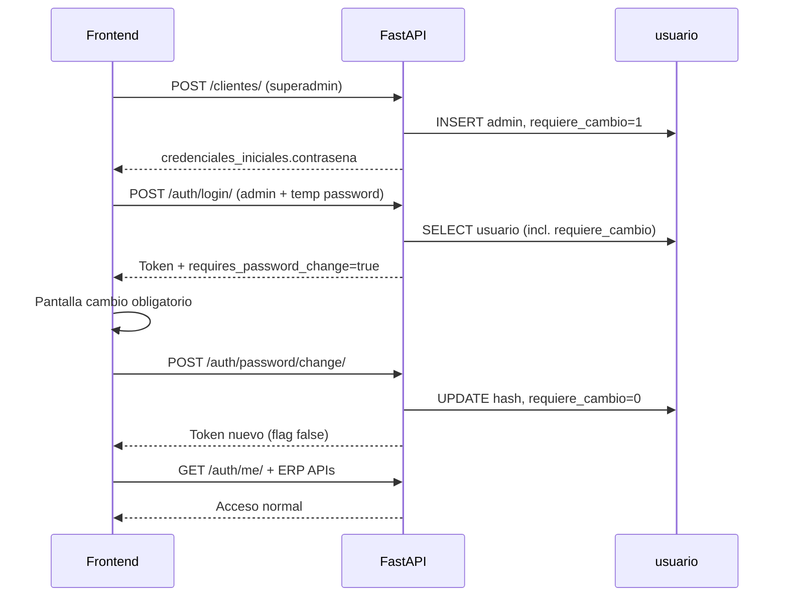

# Auditoría — Enforcement de `requiere_cambio_contrasena` (onboarding tenant)

**Tipo:** Auditoría técnica + plan de implementación (sin código)  
**Fecha:** 2026-06-08  
**Objetivo funcional futuro:** Tras onboarding, el admin tenant con contraseña temporal debe poder autenticarse, recibir señal explícita de cambio obligatorio, cambiar contraseña y solo entonces acceder al ERP.

**Contexto confirmado (auditoría onboarding previa):**

| Hecho | Estado |
|-------|--------|
| `ClienteOnboardingService` genera contraseña temporal (12 chars, `secrets`) | ✅ |
| Persiste solo hash bcrypt en `usuario.contrasena` | ✅ |
| Inserta `requiere_cambio_contrasena = 1` para usuario `admin` | ✅ |
| Devuelve contraseña en `POST /api/v1/clientes/` → `credenciales_iniciales.contrasena` | ✅ |
| Login valida credenciales pero **no** lee ni propaga el flag | ❌ |
| JWT no transporta el flag | ❌ |
| Frontend no tiene señal en login/`/me` | ❌ |
| No existe endpoint API de cambio de contraseña | ❌ |

**Referencias de código:**

| Área | Archivo principal |
|------|-------------------|
| Onboarding | `app/modules/tenant/application/services/cliente_onboarding_service.py` |
| Login | `app/modules/auth/presentation/endpoints.py` |
| Autenticación | `app/modules/auth/application/services/auth_service.py` |
| JWT | `app/core/security/jwt.py` |
| Sesión ERP | `app/api/deps_auth.py`, `app/core/tenant/company_scope.py` |
| Impersonación | `app/modules/auth/application/services/impersonation_service.py` |
| Password utils | `app/core/security/password.py` |

---

## 1. Estado actual del onboarding (resumen)

```
POST /api/v1/clientes/
  → ClienteOnboardingService.crear_cliente_con_onboarding()
       contrasena_plana = _generar_contrasena_segura(12)
       contrasena_hash = get_password_hash(contrasena_plana)
       INSERT usuario (nombre_usuario='admin', contrasena=hash, requiere_cambio_contrasena=1)
  → Response: credenciales_iniciales { nombre_usuario, contrasena, requiere_cambio: true }
```

El flag en BD (`usuario.requiere_cambio_contrasena`) y el flag en la respuesta de creación (`CredencialesInicialesRead.requiere_cambio`) **no están conectados** al flujo de autenticación posterior.

---

## A. Login

### A.1 Endpoint exacto

| Campo | Valor |
|-------|-------|
| **Método / ruta** | `POST /api/v1/auth/login/` |
| **Router** | `app/modules/auth/presentation/endpoints.py` → `@router.post("/login/")` |
| **Prefijo API** | `/api/v1/auth` (`app/api/v1/api.py`) |
| **Response model** | `Union[Token, LoginEmpresaSelectionResponse]` |
| **Rate limit** | `@get_rate_limit_decorator("login")` |

### A.2 Request

| Aspecto | Detalle |
|---------|---------|
| **Formato** | `application/x-www-form-urlencoded` (`OAuth2PasswordRequestForm`) |
| **Campos** | `username`, `password` |
| **Tenant** | **No** va en el body. `cliente_id` se resuelve en **middleware** (`TenantMiddleware`) desde `Host` / `X-Forwarded-Host` / fallback desarrollo |
| **Headers relevantes** | `Host` (subdominio tenant), `X-Client-Type: web\|mobile` |

### A.3 Ruta de ejecución (orden real)

```
POST /api/v1/auth/login/
  1. TenantMiddleware → get_current_client_id()
  2. ClienteService.obtener_cliente_por_id() — validar cliente activo
  3. authenticate_user(cliente_id, username, password)
       → AuthService.authenticate_user()  [auth_service.py:777]
  4. AuthService.get_empresa_activa_para_login()
  5. AuthService.assert_operational_login_allowed()
  6. UsuarioService.get_user_role_names()
  7. get_user_access_level_info()
  8. build_user_data_with_roles_dict()  → user_profile (Token.user_data)
  9. token_data = { sub, cliente_id, level_info [, es_superadmin] }
 10. create_access_token(token_data, empresa_id, es_admin_cliente)
 11. create_refresh_token(token_data, empresa_id, es_admin_cliente)
 12. RefreshTokenService.store_refresh_token()
 13. Response Token { access_token, token_type, user_data [, refresh_token] }
```

**Rama alternativa:** Si `requiere_seleccion_empresa=True` → `LoginEmpresaSelectionResponse` con `selection_token` (sin refresh).

### A.4 `authenticate_user()` — comportamiento actual

**Ubicación:** `AuthService.authenticate_user()` — `auth_service.py:777-1011`

**Query de usuario (BD compartida):**

```sql
SELECT usuario_id, cliente_id, nombre_usuario, correo, contrasena,
       nombre, apellido, es_activo
FROM usuario
WHERE cliente_id = :cliente_id AND nombre_usuario = :nombre_usuario AND es_eliminado = 0
```

**Hallazgos críticos:**

| Comportamiento | Estado |
|----------------|--------|
| Lee `requiere_cambio_contrasena` | **No** — columna ausente en SELECT |
| Valida `verify_password(plain, hash)` | ✅ |
| Elimina `contrasena` del dict retornado | ✅ (`user.pop('contrasena')`) |
| Calcula `level_info`, `target_cliente_id` | ✅ |
| Bloquea login si `requiere_cambio_contrasena=1` | **No** |
| Propaga flag al caller | **No** |

**Retorno hacia el endpoint:** `dict` con `usuario_id`, `correo`, `nombre`, `apellido`, `es_activo`, `access_level`, `is_super_admin`, `user_type`, `target_cliente_id`, opcionalmente `es_superadmin`.

### A.5 Generación JWT en login

**Construcción:** `create_access_token()` / `create_refresh_token()` — `app/core/security/jwt.py`

**`token_data` base (antes de firmar):**

```python
{
  "sub": "<username>",
  "cliente_id": "<uuid string>",
  "level_info": { "access_level", "is_super_admin", "user_type" },  # removido del payload final
  # opcional: "es_superadmin": True
}
```

**Claims finales en access y refresh** (añadidos por `create_*_token`):

| Claim | Origen |
|-------|--------|
| `exp`, `iat`, `type` (`access` / `refresh`) | Automático |
| `jti` | UUID único (revocación) |
| `access_level` | `level_info.access_level` |
| `is_super_admin` | `level_info.is_super_admin` |
| `user_type` | `level_info.user_type` |
| `es_superadmin` | Si superadmin plataforma |
| `empresa_id` | Opcional, sesión multi-empresa |
| `es_admin_cliente` | Bool, rol admin cliente |
| `empresa_selection_pending` | Solo `selection_token` |

**Ausente hoy:** `requires_password_change` / `requiere_cambio_contrasena`.

### A.6 DTOs de respuesta login

**`Token`** (`auth/presentation/schemas.py:762`):

```python
access_token: str
token_type: str = "bearer"
user_data: Optional[UserDataWithRoles]  # sin requires_password_change
refresh_token: Optional[str]              # solo mobile
```

**`UserDataWithRoles`** (`schemas.py:439`): `usuario_id`, `nombre_usuario`, `correo`, `nombre`, `apellido`, `es_activo`, `roles`, `access_level`, `is_super_admin`, `user_type`, `cliente_id`, `es_admin_cliente`, `empresa_activa`.

**`build_user_data_with_roles_dict()`** (`schemas.py:643`): **no** incluye `requiere_cambio_contrasena`.

**`LoginEmpresaSelectionResponse`** (`schemas.py:735`): `requiere_seleccion_empresa`, `empresas_disponibles`, `selection_token`, `user_data` — tampoco incluye flag de contraseña.

---

## B. JWT

### B.1 Dónde se construye

| Operación | Función | Archivo |
|-----------|---------|---------|
| Access token | `create_access_token()` | `app/core/security/jwt.py:112` |
| Refresh token | `create_refresh_token()` | `app/core/security/jwt.py:178` |
| Decodificación access | `get_current_user_data()` | `app/api/deps.py:41` |
| Decodificación refresh | `decode_refresh_token()` | `jwt.py:308` |
| SSO payload | `build_token_payload_for_sso()` | `jwt.py:244` |

**Puntos de emisión de tokens:**

- `POST /auth/login/`
- `POST /auth/refresh/`
- `POST /auth/empresa/seleccionar/`
- `POST /auth/empresa/cambiar/`
- SSO endpoints
- `POST /auth/impersonate/{cliente_id}/` (solo access, TTL 120 min)

### B.2 Claims actuales (access token)

```
sub, cliente_id, exp, iat, type, jti,
access_level, is_super_admin, user_type,
[es_superadmin], [empresa_id], [es_admin_cliente],
[empresa_selection_pending],  # selection token
[is_impersonation, impersonated_by, impersonated_by_username]  # impersonación
```

### B.3 Viabilidad de agregar `requires_password_change`

| Criterio | Evaluación |
|----------|------------|
| **Compatibilidad hacia atrás** | ✅ Claim opcional `bool`; clientes que ignoran claims desconocidos no se rompen |
| **Tamaño payload** | ✅ +1 campo booleano |
| **Refresh / access parity** | Recomendado en **ambos** para coherencia en rotación |
| **Riesgo de desincronización** | ⚠️ Si solo se copia del login y el usuario cambia password, el claim queda `true` hasta próximo refresh/login — ver sección C |
| **Nombre recomendado** | `requires_password_change` (inglés, alineado a claims JWT existentes en inglés: `is_super_admin`, `user_type`) |

**Alternativa sin claim JWT:** Solo señal en `user_data` / `/me`. Insuficiente para enforcement server-side en `require_erp_session` sin consulta BD por request.

**Recomendación:** Claim JWT **+** campo en DTOs HTTP **+** re-lectura de BD en refresh y post-cambio.

---

## C. Refresh Token

### C.1 Endpoint

| Campo | Valor |
|-------|-------|
| **Ruta** | `POST /api/v1/auth/refresh/` |
| **Dependencia** | `get_current_user_from_refresh` → `AuthService.get_current_user_from_refresh()` |
| **Response** | `Token` (access nuevo; refresh rotado; `user_data: null` hoy) |

### C.2 Flujo refresh

```
POST /auth/refresh/
  1. decode_refresh_token(old_refresh_token)
  2. RefreshTokenService.validate_refresh_token() — BD
  3. AuthService._fetch_user_row_for_refresh() — recarga usuario
  4. AuthService.resolve_level_info_for_token_refresh() — preserva claims LBAC del refresh JWT
  5. build_token_data_from_level_info()
  6. create_access_token() + create_refresh_token() — nuevos tokens
  7. RefreshTokenService.store_refresh_token(is_rotation=True)
  8. RefreshTokenService.revoke_token(old)
```

### C.3 Query usuario en refresh

`_fetch_user_row_for_refresh()` — `auth_service.py:249-319`:

```sql
SELECT usuario_id, cliente_id, nombre_usuario, correo, nombre, apellido, es_activo
FROM usuario WHERE ...
```

**No lee `requiere_cambio_contrasena`.**

### C.4 Reconstrucción de claims

`resolve_level_info_for_token_refresh()` **prioriza claims del refresh JWT anterior** (`user_type`, `access_level`, `is_super_admin`) para no degradar `platform_admin` → `tenant_admin`. No recalcula flags de seguridad de usuario desde BD.

`build_token_data_from_level_info()` arma `{ sub, cliente_id, level_info [, es_superadmin] }` — sin password change.

### C.5 ¿Qué ocurre si `requires_password_change` cambia entre login y refresh?

**Escenario:** Usuario hace login con flag `true` → cambia contraseña (flag BD → `0`) → llama `/auth/refresh/` con refresh emitido en login.

| Estrategia de implementación | Resultado |
|----------------------------|-----------|
| **Solo claim copiado del refresh anterior** | ❌ Access nuevo seguiría con `requires_password_change=true` hasta expiración del refresh chain o re-login |
| **Re-leer BD en cada refresh** | ✅ Access/refresh nuevos reflejan `false` inmediatamente |
| **Invalidar refresh al cambiar password** | ✅ Máxima seguridad; fuerza re-login o emisión de tokens nuevos en el mismo endpoint de cambio |

**Respuesta directa:** Con el diseño actual (claims preservados del refresh), un claim estático **quedaría obsoleto** tras el cambio de contraseña. La implementación debe **reconsultar `requiere_cambio_contrasena` en BD** al rotar tokens, o **emitir tokens nuevos en el endpoint de cambio** y revocar los anteriores.

**Impersonación:** `POST /auth/refresh/` rechaza tokens con `is_impersonation=true` (403). No aplica.

---

## D. `GET /auth/me/`

### D.1 Endpoint

| Campo | Valor |
|-------|-------|
| **Ruta** | `GET /api/v1/auth/me/` |
| **Auth** | Bearer access token |
| **Deps** | `reject_selection_token_for_me`, `get_current_active_user` |
| **Response model** | `MeResponse` |

### D.2 Construcción de respuesta

```
GET /auth/me/
  1. Payload JWT (niveles desde token, no recalculados agresivamente)
  2. UsuarioService.obtener_usuario_completo_por_id() — roles, datos extendidos
  3. build_user_data_with_roles_dict() — perfil plano
  4. MeResponse(**user_profile, requiere_seleccion_empresa, empresas_disponibles,
                 is_impersonation, impersonated_by, ...)
```

**`obtener_usuario_completo_por_id()`** — query **no** incluye `requiere_cambio_contrasena` en el SELECT de `/me` (solo campos básicos + roles).

**`MeResponse`** extiende `UserDataWithRoles` con:

- `requiere_seleccion_empresa`
- `empresas_disponibles`
- `is_impersonation`, `impersonated_by`, `impersonated_by_username`

**No incluye** `requires_password_change`.

### D.3 ¿Dónde exponer el flag?

| Canal | Pros | Contras |
|-------|------|---------|
| **Solo login `user_data`** | Mínimo cambio | Se pierde tras refresh (`user_data=null` en refresh); SPA que re-hidrata con `/me` no ve el flag |
| **Solo `/me`** | Fuente estable post-login | Primera pantalla post-login antes de `/me` no tiene señal; enforcement server-side débil sin JWT |
| **Login + `/me` + JWT claim** | ✅ UX inmediata + rehidratación + enforcement backend | Ligero trabajo en 3 puntos; patrón ya usado con `requiere_seleccion_empresa` en `/me` |

**Recomendación:** **Los tres**. Paridad con el patrón existente de `requiere_seleccion_empresa` (señal en login + estado en `/me` + bloqueo de ERP vía deps).

---

## E. Cambio de contraseña

### E.1 Endpoints existentes

| Búsqueda | Resultado |
|----------|-----------|
| `/change-password`, `/cambiar-contrasena`, `/reset-password`, `/forgot` | **Ninguno** en API |
| `UsuarioUpdate.contrasena` | **No existe** — actualización de usuario no permite cambiar password |
| `AuthConfigService.allow_password_reset` | Config en BD (default `1`), **sin endpoint** que lo implemente |
| `password_expiry_days` | Config en `cliente_auth_config`, **sin enforcement** en login |

### E.2 Utilidades reutilizables

| Componente | Ubicación | Reutilizable |
|------------|-----------|--------------|
| `get_password_hash()` | `app/core/security/password.py` | ✅ |
| `verify_password()` | `app/core/security/password.py` | ✅ |
| Política password tenant | `cliente_auth_config` + `AuthConfigService` | ✅ lectura; validación a implementar |
| Reset ops CLI | `scripts/staging_reset_tenant_admin.py` | Patrón SQL `UPDATE usuario SET contrasena=:hash, requiere_cambio_contrasena=0` |
| Auditoría auth | `AuditService.registrar_auth_event()` | ✅ para evento `password_changed` |

### E.3 Tablas relacionadas

| Tabla / columna | Uso |
|-----------------|-----|
| `usuario.contrasena` | Hash bcrypt |
| `usuario.requiere_cambio_contrasena` | Flag objetivo |
| `usuario.fecha_ultimo_cambio_contrasena` | Existe; **no se actualiza** hoy en ningún flujo API |
| `cliente_auth_config.password_*` | Política (longitud, mayúsculas, expiración, historial) |
| Tabla historial contraseñas | **No existe** en esquema |

### E.4 Respuesta

**No existe flujo API reutilizable.** Debe crearse un endpoint nuevo (p. ej. `POST /api/v1/auth/password/change/`).

**Elementos mínimos del nuevo flujo:**

1. Autenticación: access token válido (permitir también `selection_token` si el admin aún no eligió empresa).
2. Body: `current_password`, `new_password` (y confirmación en frontend, no obligatoria en API).
3. Validar `verify_password(current, hash)`.
4. Validar política contra `cliente_auth_config` (opcional fase 1: longitud mínima 8).
5. `UPDATE usuario SET contrasena=:hash, requiere_cambio_contrasena=0, fecha_ultimo_cambio_contrasena=GETDATE()`.
6. Emitir nuevos access+refresh **sin** `requires_password_change`, o forzar re-login.
7. Revocar refresh tokens previos del usuario (opcional pero recomendado).

---

## F. Impersonación

### F.1 Endpoints

| Acción | Ruta |
|--------|------|
| Iniciar | `POST /api/v1/auth/impersonate/{cliente_id}/` |
| Finalizar | `POST /api/v1/auth/impersonate/end/` |

### F.2 Comportamiento

- Operador: usuario plataforma (`SUPERADMIN_USERNAME`) autenticado con sesión normal.
- Identidad en tenant: usuario SYSTEM vía `_resolver_operador_superadmin()`.
- Token: **solo access**, TTL 120 min, **sin refresh**.
- Claims: `is_impersonation=true`, `impersonated_by`, `impersonated_by_username`.
- `impersonation_effective_level_info()` → `user_type=tenant_admin`, `access_level=4`.
- `suppress_platform_privileges()` en RBAC/menu durante impersonación.

### F.3 ¿Debe ignorar `requires_password_change`?

| Caso | Recomendación |
|------|---------------|
| **Operador plataforma impersonando** | ✅ **Ignorar** — el flag aplica al usuario tenant `admin`, no al operador SYSTEM |
| **Usuario tenant `admin` real con flag=1** | ❌ **No ignorar** — debe cambiar contraseña propia |

**Riesgo:** Si el operador impersona un tenant cuyo usuario `admin` tiene `requiere_cambio_contrasena=1`, el sistema podría bloquear operaciones de soporte.

**Mitigación:** En sesiones con `is_impersonation=true`, **excluir** el check de `requires_password_change` en deps ERP y en evaluación del flag (el operador no es el `admin` onboarded).

### F.4 ¿Puede bloquear operaciones administrativas?

Sí, si el enforcement se implementa de forma global en `require_erp_session` **sin** excepción de impersonación. Debe documentarse y codificarse la exención explícita para `is_impersonation`.

---

## G. Usuarios afectados

| Perfil | `requiere_cambio_contrasena` hoy | Comportamiento recomendado |
|--------|----------------------------------|----------------------------|
| **SUPERADMIN plataforma** (`superadmin`) | `0` (bootstrap no lo setea) | **Excluir** — sin cambio obligatorio por este mecanismo |
| **ADMIN_PLATFORM** | `0` (creado en bootstrap plataforma) | **Excluir** |
| **ADMIN_TENANT** (`admin` post-onboarding) | `1` | **Objetivo principal** — enforcement completo |
| **Usuarios normales** | `0` por defecto (`server_default='0'`) | Aplicar flag solo si se activa manualmente o por futuro “reset forzado”; mismo flujo genérico |
| **Impersonación soporte** | N/A (sesión operador) | **Excluir** del enforcement |

**Detección en runtime:**

```python
requires_password_change = bool(user_row["requiere_cambio_contrasena"])
and not is_impersonation_payload(payload)
and not is_platform_operator(payload)
```

Opcional: restringir enforcement a `proveedor_autenticacion == 'local'` (excluir SSO).

---

## H. Estrategia recomendada (mínima y segura)

### H.1 Principios

1. **Login siempre exitoso** con credenciales válidas (no bloquear autenticación).
2. **Bloqueo ERP server-side** para sesiones con `requires_password_change=true`.
3. **Whitelist** de rutas permitidas sin cambio: cambio de contraseña, `/me`, logout, refresh (opcional), selección de empresa.
4. **Señal triple:** JWT claim + `user_data` + `/me`.
5. **Fuente de verdad:** columna `usuario.requiere_cambio_contrasena`; refresh re-lee BD.

### H.2 Flujo objetivo



### H.3 Cambios backend necesarios

#### 1. Lectura del flag

| Ubicación | Cambio |
|-----------|--------|
| `AuthService.authenticate_user()` | Añadir `requiere_cambio_contrasena` al SELECT; propagar en dict retorno |
| `AuthService._fetch_user_row_for_refresh()` | Idem |
| Helper nuevo (opcional) | `AuthService.get_requires_password_change(usuario_id, cliente_id) -> bool` |

#### 2. JWT

| Archivo | Cambio |
|---------|--------|
| `jwt.py` `create_access_token` / `create_refresh_token` | Aceptar `requires_password_change: bool` en `data`; serializar en payload |
| Todos los emisores de tokens | Pasar flag desde fila usuario o helper |

#### 3. DTOs

| Schema | Campo nuevo |
|--------|-------------|
| `UserDataWithRoles` | `requires_password_change: bool = False` |
| `MeResponse` | Hereda del padre o explícito |
| `build_user_data_with_roles_dict()` | Parámetro opcional |
| `CredencialesInicialesRead` | Ya tiene `requiere_cambio` — mantener; alinear nombre documentado |

#### 4. Endpoints a modificar

| Endpoint | Modificación |
|----------|--------------|
| `POST /auth/login/` | Poblar flag en `user_data` y JWT |
| `POST /auth/refresh/` | Re-leer BD; propagar en JWT; opcional `user_data` |
| `POST /auth/empresa/seleccionar/` | Propagar flag al emitir sesión completa |
| `POST /auth/empresa/cambiar/` | Idem |
| `GET /auth/me/` | Incluir `requires_password_change` (desde BD o JWT) |
| **Nuevo** `POST /auth/password/change/` | Cambio + clear flag + re-emisión tokens |

#### 5. Enforcement ERP

| Ubicación | Cambio |
|-----------|--------|
| `require_erp_session()` o nuevo `require_password_change_cleared()` | Si `requires_password_change` en payload y no impersonación → `403` con `internal_code=PASSWORD_CHANGE_REQUIRED` |
| `validate_erp_operational_session()` | O capa anterior en deps |
| Whitelist global (middleware o dependency tree) | `/auth/password/change/`, `/auth/me/`, `/auth/logout/`, `/auth/refresh/`, `/auth/empresa/seleccionar/` |

**Nota:** Módulos ERP que usan `require_erp_session` quedarían protegidos automáticamente. Rutas solo con `get_current_active_user` seguirían accesibles — inventario gradual recomendado.

#### 6. Nuevo servicio

`PasswordChangeService` o método en `AuthService`:

- `change_password(usuario_id, cliente_id, current, new) -> SessionTokens`
- Reutiliza `verify_password`, `get_password_hash`, `AuthConfigService.obtener_config_cliente()` para política.

### H.4 Compatibilidad con frontend actual

| Aspecto | Impacto |
|---------|---------|
| Claims JWT nuevos | Ignorados por clientes antiguos → sin rotura |
| Campo nuevo en `user_data` / `/me` | Opcional en Pydantic → clientes que no lo lean siguen funcionando |
| HTTP 403 nuevo en ERP | Frontend debe manejar `PASSWORD_CHANGE_REQUIRED` — **cambio coordinado** |
| Login response sin cambios estructurales | Solo campo adicional |

**Contrato sugerido para frontend:**

```json
{
  "access_token": "...",
  "user_data": {
    "requires_password_change": true,
    ...
  }
}
```

```json
// GET /auth/me/
{
  "requires_password_change": true,
  "requiere_seleccion_empresa": false,
  ...
}
```

### H.5 Interacción con selección de empresa

Orden recomendado para admin tenant onboarded:

1. Login → `requires_password_change=true`
2. **Cambio de contraseña primero** (endpoint accesible con access token recién emitido, sin `require_erp_session`)
3. Si `requiere_seleccion_empresa` → `POST /auth/empresa/seleccionar/`
4. Acceso ERP

Alternativa: permitir selección de empresa antes del cambio (ambos flags en `/me`). El enforcement ERP debe bloquear hasta que **ambas** condiciones se resuelvan.

### H.6 Riesgos

| Riesgo | Mitigación |
|--------|------------|
| Claim JWT obsoleto tras cambio | Re-leer BD en refresh; emitir tokens nuevos en change endpoint |
| Bloqueo de impersonación soporte | Excluir `is_impersonation` |
| Rutas ERP sin `require_erp_session` | Auditoría de routers; migración gradual |
| Política password no validada | Fase 1: mínimo 8 chars; fase 2: `cliente_auth_config` |
| Sin historial de contraseñas | `password_history_count` en config sin tabla — documentar limitación |
| SSO users | Excluir si `proveedor_autenticacion != 'local'` |
| Mobile refresh sin `user_data` | Frontend debe llamar `/me` tras refresh o incluir `user_data` en refresh response |

### H.7 Fuera de alcance (fase 1)

- `password_expiry_days` enforcement
- Forgot password / email reset
- Resend credenciales onboarding
- Tabla historial contraseñas
- Bloqueo de login (solo bloqueo ERP post-login)

---

## I. Inventario de archivos a tocar (implementación futura)

| Prioridad | Archivo |
|-----------|---------|
| P0 | `app/modules/auth/application/services/auth_service.py` |
| P0 | `app/core/security/jwt.py` |
| P0 | `app/modules/auth/presentation/endpoints.py` |
| P0 | `app/modules/auth/presentation/schemas.py` |
| P0 | `app/api/deps_auth.py` (enforcement) |
| P1 | Nuevo `app/modules/auth/application/services/password_change_service.py` (o método en AuthService) |
| P1 | `app/core/tenant/company_scope.py` (opcional, error tipado) |
| P2 | Tests: `tests/unit/test_force_password_change.py` |
| P2 | Docs contrato frontend |

---

## J. Conclusión

El backend **persiste correctamente** `requiere_cambio_contrasena=1` en onboarding pero el pipeline de autenticación **no lo lee, no lo transporta ni lo enforcea**. La solución mínima viable requiere:

1. Extender queries de login/refresh con el flag.
2. Añadir claim JWT `requires_password_change` y campos en `UserDataWithRoles` / `MeResponse`.
3. Crear `POST /auth/password/change/`.
4. Bloquear `require_erp_session` cuando el flag esté activo (con excepciones: impersonación, plataforma, whitelist auth).

Sin estos cambios, el frontend **no puede** implementar de forma fiable el flujo “obligar cambio antes del ERP”, aunque el dato exista en base de datos.
