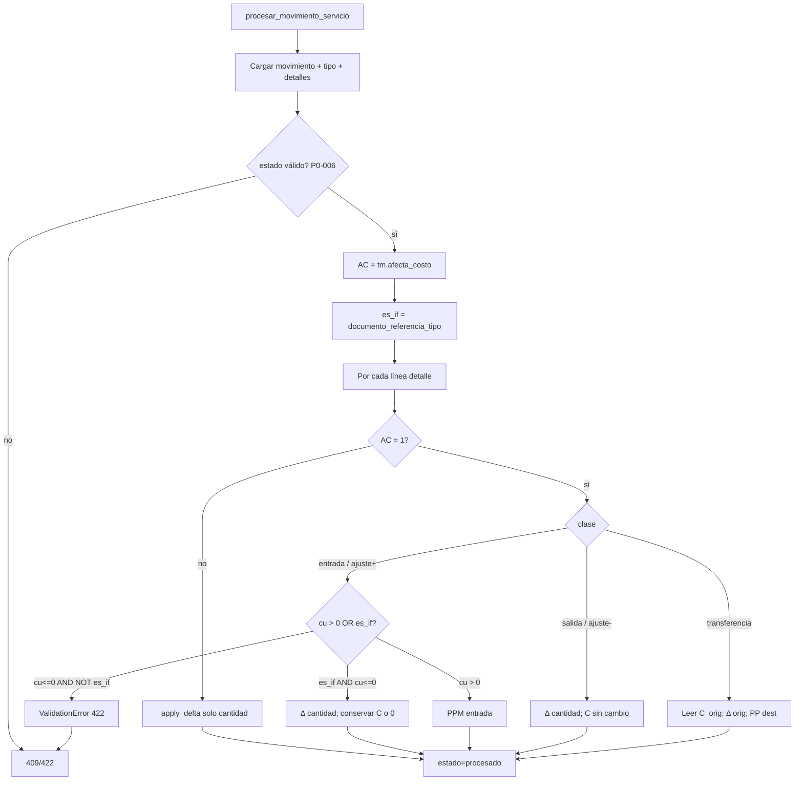

# INV-P0-001 + INV-P0-005 — Diseño Técnico de Implementación

**IDs:** INV-P0-001 (costo stock al procesar) + INV-P0-005 (`afecta_costo` sin efecto)  
**Fecha:** 2026-06-12  
**Modo:** Implementación — **sin código en este documento**  
**Prerequisitos:** INV-P0-006 ✅ COMPLETADO; INV-P0-004 ✅ COMPLETADO; auditoría previa P0-001/P0-005 aprobada  
**Fuentes de código analizadas:**
- `app/modules/inv/application/services/movimiento_proceso_service.py`
- `app/modules/inv/application/services/inventario_fisico_aprobacion_service.py` (consumidor IF)
- `app/modules/pur/application/services/recepcion_service.py` (consumidor PUR)
- `app/infrastructure/database/tables_erp/tables_inv.py`
- `docs/bd/INV_TABLAS.sql`
- `app/docs/auditoria/INV_PLAN_IMPLEMENTACION_P0.md` §2, §6
- `app/docs/auditoria/INV_AUDITORIA_PERSISTENCIA.md` §5–7

**Objetivo:** Al procesar un movimiento, aplicar **Promedio Ponderado Móvil (PPM)** en `inv_stock.costo_promedio` cuando `inv_tipo_movimiento.afecta_costo = 1`, respetando el gate de configuración (P0-005). **Sin modificar BD, schemas OpenAPI ni queries obligatorias.**

---

## 1. Resumen del hallazgo

| ID | Problema | Severidad |
|----|----------|-----------|
| **P0-001** | `procesar_movimiento` solo muta `cantidad_actual`; ignora `costo_unitario` del detalle | R1 — Crítico |
| **P0-005** | `afecta_costo` existe en catálogo pero no se consulta en runtime | R1 — Crítico |

**Relación:** P0-005 es el **gate** de P0-001. Se implementan **en el mismo PR/cambio**. No desplegar uno sin el otro.

### Evidencia estado actual

En `movimiento_proceso_service.py`, función interna `_apply_delta` (L177–235):

- Alta automática de stock: `costo_promedio = Decimal("0")` fijo.
- Update de stock existente: solo `cantidad_actual`, `fecha_ultimo_movimiento`, `fecha_actualizacion`.
- Lectura de tipo: solo `clase_movimiento`; **`afecta_costo` no se lee**.
- Iteración de detalle: solo `cantidad_base`; **`costo_unitario` no se usa**.

---

## 2. Decisiones de negocio aprobadas (acta)

| ID | Decisión | Valor aprobado |
|----|----------|----------------|
| **D1** | Método de costeo Fase 0 | **Promedio Ponderado Móvil (PPM)** |
| **D2** | Entradas PUR y normales con `afecta_costo=1` y `costo_unitario ≤ 0` | **Rechazar `ValidationError` (422)** |
| **D2** | Ajustes de inventario físico (`documento_referencia_tipo = inventario_fisico`) con `costo_unitario ≤ 0` | **Permitido** — ver §5.4 |
| **D3** | Feature flag `INV_COSTEO_EN_PROCESAR` | **No implementar** — alcance mínimo P0 |
| **D4** | Backfill histórico | **No** — stock legacy con `costo_promedio = 0` aceptado |

---

## 3. Alcance exacto

### 3.1 Dentro de alcance

| Ámbito | Detalle |
|--------|---------|
| **Servicio principal** | `procesar_movimiento_servicio` — refactor `_apply_delta` + lectura `afecta_costo` |
| **Helpers** | Nuevo módulo `inv_costeo_proceso.py` (recomendado, patrón P0-006) |
| **Clases soportadas** | `entrada`, `salida`, `transferencia`, `ajuste` |
| **Columnas escritas** | `inv_stock.cantidad_actual`, `costo_promedio`, `fecha_ultimo_movimiento`, `fecha_actualizacion` |
| **Columnas leídas** | `inv_movimiento_detalle.costo_unitario`, `cantidad_base`; `inv_tipo_movimiento.afecta_costo`, `clase_movimiento`; cabecera movimiento para excepción IF |
| **Tests** | Nuevo `test_movimiento_proceso_costo.py` + gate regresión INV |
| **Excepción D2 IF** | Detección por `documento_referencia_tipo == "inventario_fisico"` en cabecera del movimiento |

### 3.2 Fuera de alcance (explícito)

| Ítem | Motivo |
|------|--------|
| Cambios BD / migraciones | Payload dinámico ya acepta campos |
| `schemas.py` Create/Update | Sin breaking change Fase 0 |
| `inv_producto.costo_promedio` | Sync maestro — CST/P1 |
| FIFO / LIFO / `metodo_costeo` por producto | Módulo CST futuro |
| Backfill stock histórico | D4 |
| Feature flag costeo | D3 |
| `total_costo` cabecera movimiento IF | P1 |
| `inventario_fisico_aprobacion_service.py` | Consumidor indirecto — sin cambio código |
| `recepcion_service.py` | Consumidor indirecto — sin cambio código |
| `kardex_queries.py` | Solo lectura — sin cambio |
| `stock_service.py` POST/PUT directo | P0-002 |
| Estorno / reversión costo | P0-003 |
| Endpoints HTTP | Sin cambio de contrato |

---

## 4. Archivos exactos a modificar

| # | Archivo | Acción |
|---|---------|--------|
| 1 | `app/modules/inv/application/services/inv_costeo_proceso.py` | **CREAR** — helpers PPM, validación D2, detección IF |
| 2 | `app/modules/inv/application/services/movimiento_proceso_service.py` | **Modificar** — `procesar_movimiento_servicio` / `_apply_delta` |
| 3 | `tests/unit/test_movimiento_proceso_costo.py` | **CREAR** — suite costeo P0-001/005 |

### Archivos explícitamente fuera de alcance

| Archivo | Motivo |
|---------|--------|
| `inventario_fisico_aprobacion_service.py` | Ya marca `documento_referencia_tipo=inventario_fisico`; llama `procesar` en UoW |
| `pur/recepcion_service.py` | Ya pasa `costo_unitario=precio_unitario` |
| `queries/inv/*.py` | Lógica en servicio con SQLAlchemy/UoW existente |
| `endpoints_movimientos_proceso.py` | Sin cambio — delega a servicio |

---

## 5. Reglas de negocio y fórmulas exactas

### 5.1 Notación

| Símbolo | Significado |
|---------|-------------|
| Q | `cantidad_actual` del stock **antes** del delta de la línea |
| C | `costo_promedio` del stock **antes** del delta de la línea |
| δ | `cantidad_base` de la línea de detalle (siempre positiva en valor absoluto; signo según clase) |
| cu | `costo_unitario` de la línea de detalle |
| AC | `afecta_costo` del tipo de movimiento (`1` = true, `0` = false) |
| Δ | Delta con signo aplicado al almacén: positivo = entrada, negativo = salida |

**Tipo numérico:** `Decimal` en todo el cálculo. **Precisión completa** en operaciones y fórmulas intermedias. Redondeo `ROUND_HALF_UP` a **4 decimales** **únicamente al persistir** `costo_promedio` en INSERT/UPDATE (véase §15.3 / AD-03).

**Procesamiento:** Por cada línea de detalle, en orden `fecha_creacion` ASC (orden ya existente en servicio). Múltiples líneas mismo producto×almacén se acumulan secuencialmente.

### 5.2 Gate `afecta_costo` (P0-005)

```text
SI AC = 0 (false):
    Solo mutar cantidad_actual (+ fechas).
    costo_promedio NO cambia.
    FIN línea.

SI AC = 1 (true):
    Aplicar reglas de clase (§5.3–5.7).
```

### 5.3 Validación D2 — costo unitario requerido

**Movimiento de inventario físico** (excepción IF):

```text
es_movimiento_if :=
    lower(mov.documento_referencia_tipo) == "inventario_fisico"
```

**Regla de rechazo 422** — aplica cuando **todas** las condiciones son verdaderas:

```text
AC = 1
AND cu <= 0
AND NOT es_movimiento_if
AND la línea es de tipo "entrada costeable" (ver abajo)
```

**Línea de tipo "entrada costeable":**

| `clase_movimiento` | Condición |
|------------------|-----------|
| `entrada` | Siempre costeable si AC=1 |
| `ajuste` | Costeable solo si Δ > 0 (ajuste positivo) |
| `salida` | No costeable (no requiere cu) |
| `transferencia` | No valida cu en origen; destino usa C_origen |

**Mensaje 422 sugerido:**

```text
No se puede procesar: la línea requiere costo_unitario > 0 cuando el tipo de movimiento afecta costo.
```

**Clase excepción:** `ValidationError` (`app/core/exceptions.py`, status 422).

### 5.4 Excepción D2 — Inventario físico con `cu ≤ 0`

Cuando `es_movimiento_if = true` y `AC = 1` y `cu ≤ 0`:

```text
NO rechazar.
NO aplicar fórmula PPM.
Mutar solo cantidad_actual.
costo_promedio resultante:
    SI existe stock previo con C > 0  →  C_new = C (conservar)
    SI Q = 0 o stock no existe        →  C_new = 0
```

### 5.5 Fórmula PPM — Entrada (`clase_movimiento = entrada`)

**Precondición:** AC = 1, cu > 0 (o excepción IF §5.4 si cu ≤ 0).

**Condición primera entrada costeable** (véase §15.2 / AD-02):

```text
es_primera_entrada_costeable :=
    stock no existe
    OR Q <= 0
```

```text
Δ = +δ

SI es_primera_entrada_costeable:
    Q_new = Q + δ        (si stock no existe, Q implícito = 0)
    C_new = cu           (sin fórmula PPM — incluye legacy Q <= 0)

SI stock existe Y Q > 0:
    Q_new = Q + δ
    C_new = (Q × C + δ × cu) / Q_new
```

**Si AC = 0:** solo `Q_new = Q + δ`; `C_new = C`.

### 5.6 Fórmula — Salida (`clase_movimiento = salida`)

```text
Δ = -δ

Q_new = Q - δ
(validar Q_new >= 0; si no → 409 stock insuficiente)

C_new = C   (sin cambio, independiente de AC)
```

**Nota:** Con AC = 1 o AC = 0, la salida **nunca** altera `costo_promedio`. El costo de las unidades que salen es C (para uso futuro en CST/FIN), pero el promedio del saldo remanente no cambia bajo PPM.

### 5.7 Fórmula — Transferencia (`clase_movimiento = transferencia`)

**Estrategia:** Leer `C_origen` **antes** de aplicar el delta negativo en el almacén origen.

```text
Para cada línea (producto_id, δ):

PASO A — Almacén origen:
    Leer (Q_orig, C_orig) del stock origen.
    Δ_orig = -δ
    Q_orig_new = Q_orig - δ
    C_orig_new = C_orig   (sin cambio)

PASO B — Almacén destino:
    cu_eff = C_orig   (promedio del origen ANTES del decremento — siempre se lee)

    SI stock destino no existe:
        Q_dest_new = δ
        C_dest_new = cu_eff   (propagación — aplica con AC=0 y AC=1; véase §15.1 / AD-01)

    SI stock destino existe (Q_dest, C_dest):
        Q_dest_new = Q_dest + δ

        SI AC = 0:
            C_dest_new = C_dest   (solo cantidad; sin recálculo PP en mezcla)

        SI AC = 1:
            SI Q_dest <= 0:
                C_dest_new = cu_eff   (modo primera entrada costeable en destino — AD-02)
            SI Q_dest > 0:
                C_dest_new = (Q_dest × C_dest + δ × cu_eff) / Q_dest_new
```

**Orden obligatorio en código:** origen primero, destino segundo (mismo orden que hoy L263–264).

**Caso origen sin stock:** 409 (ya existe — "Stock insuficiente").

**Caso C_origen = 0:** Permitido — `cu_eff = 0`; destino sin stock recibe `C_dest_new = 0`; destino con stock y AC=1 aplica PP con cu_eff=0 (resultado numérico coherente).

### 5.8 Fórmula — Ajuste positivo (`clase_movimiento = ajuste`, δ > 0 en detalle)

El signo del ajuste viene del signo de `cantidad_base` en el detalle (IF aprobación usa `diferencia` con signo).

```text
target_almacen = almacen_destino_id OR almacen_origen_id  (lógica actual)
Δ = cantidad_base con signo (positivo = ajuste+)

SI Δ > 0  (ajuste positivo — equivalente a entrada):
    Aplicar misma regla que §5.5 (entrada), incluyendo:
        - Validación D2 si NOT es_movimiento_if y AC=1 y cu<=0 → 422
        - Excepción IF §5.4 si es_movimiento_if y cu<=0
        - PPM si AC=1 y cu>0

SI Δ < 0  (ajuste negativo — equivalente a salida):
    Aplicar misma regla que §5.6 (salida): |Δ| como δ, C sin cambio

SI Δ = 0:
    Omitir línea (comportamiento actual)
```

### 5.9 Fórmula — Ajuste negativo (`clase_movimiento = ajuste`, δ < 0)

```text
Δ = cantidad_base  (negativo)
δ_abs = |Δ|

Q_new = Q - δ_abs
C_new = C   (sin cambio)

Validar Q_new >= 0 → si no, 409.
```

Equivalente semántico a **salida** (§5.6). No requiere `costo_unitario`.

### 5.10 Resumen matricial

| Clase | Δ | AC=0 | AC=1, cu>0 | AC=1, cu≤0 (normal/PUR) | AC=1, cu≤0 (IF) |
|-------|---|------|------------|-------------------------|-----------------|
| entrada | +δ | Q+=δ, C sin cambio | PPM §5.5 | **422** | Q+=δ, conservar C o 0 §5.4 |
| salida | -δ | Q-=δ, C sin cambio | Q-=δ, C sin cambio | idem | idem |
| transferencia | -δ orig, +δ dest | dest sin stock: Q+=δ, **C=C_orig**; dest con stock: Q+=δ, C sin cambio | PP dest con cu_eff=C_orig §5.7 | N/A (no usa cu) | N/A |
| ajuste+ | +δ | Q+=δ, C sin cambio | PPM §5.5 | **422** | excepción IF §5.4 |
| ajuste- | -δ | Q-=δ, C sin cambio | Q-=δ, C sin cambio | idem | idem |

---

## 6. Ejemplos numéricos completos

### 6.1 Entrada — primera entrada (stock nuevo)

| Campo | Valor |
|-------|-------|
| AC | 1 |
| Q (previo) | — (sin stock) |
| C (previo) | — |
| δ | 10 |
| cu | 5.00 |

**Resultado:**

```text
Q_new = 10
C_new = 5.0000   (primera entrada: C_new = cu)
valor_total = 10 × 5.0000 = 50.0000
```

### 6.2 Entrada — PPM sobre stock existente

| Campo | Valor |
|-------|-------|
| AC | 1 |
| Q | 10 |
| C | 5.0000 |
| δ | 10 |
| cu | 8.00 |

**Cálculo:**

```text
C_new = (10 × 5.0000 + 10 × 8.0000) / (10 + 10)
      = (50.0000 + 80.0000) / 20
      = 6.5000

Q_new = 20
valor_total = 20 × 6.5000 = 130.0000
```

### 6.3 Entrada — rechazo PUR/normal (D2)

| Campo | Valor |
|-------|-------|
| AC | 1 |
| clase | entrada |
| cu | 0 |
| documento_referencia_tipo | RECEPCION (PUR) |

**Resultado:** `ValidationError` 422 — no muta stock.

### 6.4 Salida — costo sin cambio

| Campo | Valor |
|-------|-------|
| AC | 1 |
| Q | 20 |
| C | 6.5000 |
| δ | 3 |

**Resultado:**

```text
Q_new = 17
C_new = 6.5000   (sin cambio)
valor_total = 17 × 6.5000 = 110.5000
```

### 6.5 Transferencia — origen con costo, destino vacío

| Campo | Valor |
|-------|-------|
| AC | 1 |
| Q_orig | 14 |
| C_orig | 6.5000 |
| Q_dest | 0 (sin stock) |
| C_dest | — |
| δ | 4 |

**Paso A — Origen:**

```text
Q_orig_new = 14 - 4 = 10
C_orig_new = 6.5000
```

**Paso B — Destino** (cu_eff = C_orig = 6.5000):

```text
Q_dest_new = 4
C_dest_new = 6.5000   (primera entrada en destino con cu_eff)
```

### 6.6 Transferencia — destino con stock existente

| Campo | Valor |
|-------|-------|
| AC | 1 |
| Q_orig | 10 |
| C_orig | 6.5000 |
| Q_dest | 5 |
| C_dest | 4.0000 |
| δ | 4 |

**Paso A — Origen:**

```text
Q_orig_new = 6
C_orig_new = 6.5000
```

**Paso B — Destino** (cu_eff = 6.5000):

```text
C_dest_new = (5 × 4.0000 + 4 × 6.5000) / (5 + 4)
           = (20.0000 + 26.0000) / 9
           = 5.1111   (redondeo 4 decimales)

Q_dest_new = 9
```

### 6.7 Ajuste positivo — entrada costeable

| Campo | Valor |
|-------|-------|
| AC | 1 |
| clase | ajuste |
| cantidad_base | +3 |
| Q | 10 |
| C | 5.0000 |
| cu | 7.00 |

**Equivalente a entrada:**

```text
C_new = (10 × 5.0000 + 3 × 7.0000) / 13
      = (50.0000 + 21.0000) / 13
      = 5.4615

Q_new = 13
```

### 6.8 Ajuste negativo — salida costeable

| Campo | Valor |
|-------|-------|
| AC | 1 |
| clase | ajuste |
| cantidad_base | -3 |
| Q | 10 |
| C | 5.0000 |

**Equivalente a salida:**

```text
Q_new = 7
C_new = 5.0000
```

### 6.9 Inventario físico — ajuste con cu = 0, stock con costo previo (D2 excepción)

| Campo | Valor |
|-------|-------|
| AC | 1 |
| es_movimiento_if | true |
| clase | ajuste |
| cantidad_base | +5 |
| cu | 0 |
| Q | 10 |
| C | 4.0000 |

**Resultado:**

```text
Q_new = 15
C_new = 4.0000   (conservado — NO recalcular PPM)
```

### 6.10 Inventario físico — ajuste con cu = 0, stock nuevo (D2 excepción)

| Campo | Valor |
|-------|-------|
| AC | 1 |
| es_movimiento_if | true |
| cantidad_base | +5 |
| cu | 0 |
| Q | 0 (sin stock) |

**Resultado:**

```text
Q_new = 5
C_new = 0.0000
```

### 6.11 `afecta_costo = 0` — solo cantidad

| Campo | Valor |
|-------|-------|
| AC | 0 |
| clase | entrada |
| Q | 10 |
| C | 4.0000 |
| δ | 5 |
| cu | 100.00 (ignorado) |

**Resultado:**

```text
Q_new = 15
C_new = 4.0000   (sin cambio — AC=0)
```

### 6.12 Transferencia AC=0 — destino sin stock (AD-01)

| Campo | Valor |
|-------|-------|
| AC | 0 |
| Q_orig | 20 |
| C_orig | 6.5000 |
| destino | sin stock |
| δ | 4 |

**Resultado:**

```text
Origen:  Q_orig_new = 16,  C_orig_new = 6.5000
Destino: Q_dest_new = 4,   C_dest_new = 6.5000   (hereda C_orig — NO 0)
```

### 6.13 Entrada — stock legacy Q=0, C=0 (AD-02)

| Campo | Valor |
|-------|-------|
| AC | 1 |
| Q | 0 |
| C | 0.0000 |
| δ | 10 |
| cu | 5.00 |

**Resultado:**

```text
es_primera_entrada_costeable = true  (Q <= 0)
Q_new = 10
C_new = 5.0000   (= cu, sin fórmula PPM)
```

### 6.14 Transferencia AC=0 — destino con stock existente (AD-01 trade-off)

| Campo | Valor |
|-------|-------|
| AC | 0 |
| C_orig | 6.5000 |
| Q_dest | 5 |
| C_dest | 4.0000 |
| δ | 4 |

**Resultado:**

```text
Origen:  Q-=4, C sin cambio
Destino: Q_dest_new = 9, C_dest_new = 4.0000   (sin PP — AC=0 en mezcla)
```

> **Nota:** La mezcla física 5 u @ 4 + 4 u @ 6.5 no recalcula promedio cuando AC=0. Si se requiere PP en mezcla, el tipo debe tener `afecta_costo=1`.

---

## 7. Diseño técnico — módulo `inv_costeo_proceso.py`

### 7.1 Funciones propuestas

| Función | Responsabilidad |
|---------|-----------------|
| `is_movimiento_inventario_fisico(mov: dict) -> bool` | `documento_referencia_tipo == "inventario_fisico"` |
| `requires_costo_unitario_line(clase: str, delta: Decimal) -> bool` | True si línea es entrada costeable (§5.3) |
| `validate_costo_unitario_for_process(...)` | Lanza `ValidationError` 422 según D2 |
| `apply_if_zero_costo_policy(q, c, delta) -> Decimal` | Retorna C_new para excepción IF §5.4 |
| `calc_ppm_entrada(q, c, delta, cu) -> Decimal` | Fórmula §5.5 |
| `calc_ppm_transferencia_destino(q_dest, c_dest, delta, cu_eff) -> Decimal` | Fórmula §5.7 paso B |
| `round_costo(val: Decimal) -> Decimal` | 4 decimales HALF_UP — **solo al persistir** (§15.3) |
| `is_primera_entrada_costeable(q: Decimal, stock_exists: bool) -> bool` | `not stock_exists OR q <= 0` (§15.2) |

### 7.2 Punto de inyección en `movimiento_proceso_service.py`

**Firma objetivo de `_apply_delta`:**

```text
async def _apply_delta(
    almacen_id: UUID,
    producto_id: UUID,
    delta: Decimal,
    *,
    costo_unitario: Decimal,
    afecta_costo: bool,
    clase: str,
    es_movimiento_if: bool,
) -> None:
```

**Flujo por invocación desde el loop de detalles:**

```text
1. Leer tm.afecta_costo una vez por movimiento (fuera del loop).
2. Leer es_movimiento_if una vez por movimiento.
3. Por cada detalle:
   a. cu = det.costo_unitario or 0
   b. δ = det.cantidad_base
   c. Según clase, invocar _apply_delta con Δ y cu apropiados.
   d. Dentro de _apply_delta: validar D2 → aplicar cantidad + costo.
```

**Transferencia — invocación:**

```text
# Leer C_orig antes de decrementar
C_orig = stock_origen.costo_promedio or 0
await _apply_delta(origen, producto, -δ, costo_unitario=C_orig, ..., clase="transferencia_origen")
await _apply_delta(destino, producto, +δ, costo_unitario=C_orig, ..., clase="transferencia_destino")
```

Alternativa: parámetro `cu_eff: Optional[Decimal]` en `_apply_delta` para destino de transferencia.

### 7.3 Transaccionalidad

- Mantener el `unit_of_work` existente en `procesar_movimiento_servicio`.
- Cantidad + costo en la **misma** sentencia `UPDATE` de `inv_stock` (o mismo `INSERT` en alta).
- `inventario_fisico_aprobacion_service` pasa `uow` a `procesar` — **sin cambio**; el costeo participa del mismo UoW.

---

## 8. Impacto por capa

### 8.1 Tablas

| Tabla | Operación | Columnas |
|-------|-----------|----------|
| `inv_stock` | WRITE | `cantidad_actual`, `costo_promedio`, `fecha_ultimo_movimiento`, `fecha_actualizacion` |
| `inv_stock` | READ (computada BD) | `valor_total` — efecto automático |
| `inv_movimiento_detalle` | READ | `costo_unitario`, `cantidad_base` |
| `inv_tipo_movimiento` | READ | `afecta_costo`, `clase_movimiento` |
| `inv_movimiento` | READ | `documento_referencia_tipo` (excepción IF) |

### 8.2 Servicios

| Servicio | Cambio |
|----------|--------|
| `procesar_movimiento_servicio` | **Principal** |
| `aprobar_inventario_fisico_servicio` | Indirecto — sin cambio código |
| `recepcion_service` (PUR) | Indirecto — sin cambio código |
| `kardex_service` | Sin cambio |
| `autorizar_movimiento_servicio` | Sin cambio |
| `anular_movimiento_servicio` | Sin cambio |

### 8.3 Queries

| Query | Cambio |
|-------|--------|
| Todas `queries/inv/*` | **Sin cambio obligatorio** |

### 8.4 Endpoints

| Endpoint | Cambio contrato |
|----------|-----------------|
| `POST /movimientos/{id}/procesar` | Sin cambio schema; puede retornar 422 nuevo (D2) |
| `POST /inventario-fisico/{id}/aprobar` | Sin cambio |
| PUR procesar recepción | Sin cambio; puede fallar 422 si precio=0 |

### 8.5 Procesos INV impactados

| Proceso | Impacto |
|---------|---------|
| Procesar movimiento manual | **Costeo activo** |
| Aprobar IF → procesar ajuste | Beneficiario; excepción D2 IF |
| Kardex (lectura) | Sin cambio; mejor alineación stock↔detalle |
| GET stock / alertas | `costo_promedio` y `valor_total` poblados |

### 8.6 Procesos PUR impactados

| Proceso | Impacto |
|---------|---------|
| Procesar recepción | `precio_unitario` → PP en stock si AC=1 |
| Recepción sin precio | **422** al procesar si AC=1 en tipo entrada |

---

## 9. Riesgos y mitigación

| Riesgo | Prob. | Impacto | Mitigación |
|--------|-------|---------|------------|
| Stock legacy C=0 distorsiona primer PP | Alta | Alto | D4 aceptado; primer entrada con cu corrige |
| Error orden transferencia (C_orig) | Media | Alto | Leer origen antes de decrementar; test T-20 |
| Múltiples líneas mismo producto×almacén | Media | Medio | Procesar secuencial (orden existente) |
| División por cero Q_new=0 | Baja | Medio | Guard §5.5 |
| PUR recepción precio 0 | Media | Medio | 422 explícito; validar datos seed |
| IF aprobación con cu=0 | Esperado | Bajo | Excepción D2 documentada; tests T-30–T-32 |
| Regresión P0-006 phantom | Baja | Alto | Gate `test_movimiento_workflow_enforcement.py` |
| POST stock deprecated desincroniza costo | Media | Alto | P0-002 posterior |

---

## 10. Plan de pruebas

### 10.1 Archivo nuevo: `tests/unit/test_movimiento_proceso_costo.py`

#### Tests de helpers (unitarios puros)

| ID | Caso |
|----|------|
| C-01 | `calc_ppm_entrada(10, 5, 10, 8)` → `6.5000` |
| C-02 | `calc_ppm_entrada(0, 0, 10, 5)` → `5.0000` (primera entrada) |
| C-03 | `calc_ppm_transferencia_destino(5, 4, 4, 6.5)` → `5.1111` |
| C-04 | `apply_if_zero_costo_policy(10, 4, 5)` → `4.0000` (IF) |
| C-05 | `apply_if_zero_costo_policy(0, 0, 5)` → `0` (IF stock nuevo) |
| C-06 | `validate_costo_unitario` PUR entrada cu=0 → `ValidationError` |
| C-07 | `validate_costo_unitario` IF cu=0 → no lanza |
| C-08 | `requires_costo_unitario_line` ajuste+ true, ajuste- false |

#### Tests de servicio (integración ligera con mocks UoW)

| ID | Caso |
|----|------|
| C-10 | `procesar` entrada AC=1 cu=5 → stock `costo_promedio=5` |
| C-11 | `procesar` segunda entrada PPM → `costo_promedio=6.5` (ej. §6.2) |
| C-12 | `procesar` salida AC=1 → `costo_promedio` sin cambio |
| C-13 | `procesar` transferencia AC=1 → destino PP con C_orig (ej. §6.6) |
| C-14 | `procesar` ajuste+ AC=1 → PPM |
| C-15 | `procesar` ajuste- AC=1 → solo cantidad |
| C-16 | `procesar` AC=0 → solo cantidad, costo intacto |
| C-17 | `procesar` entrada cu=0 PUR → 422 |
| C-18 | `procesar` movimiento IF cu=0 → conserva C (ej. §6.9) |
| C-19 | `procesar` movimiento IF cu=0 stock nuevo → C=0 (ej. §6.10) |
| C-20 | `procesar` transferencia: verificar lectura C_orig pre-decremento |
| C-21 | `procesar` transferencia AC=0 destino sin stock → `C_dest = C_orig` (§6.12) |
| C-22 | `procesar` entrada legacy Q=0 → `C_new = cu` (§6.13) |
| C-23 | `calc_ppm_entrada` intermedio sin redondeo; persist con 4 decimales |

### 10.2 Mapa requisito → test

| Requisito | Test(s) |
|-----------|---------|
| R-01 PPM en entrada | C-01, C-02, C-10, C-11 |
| R-02 Salida no altera C | C-12, C-15 |
| R-03 Transferencia C_orig → destino | C-03, C-13, C-20 |
| R-04 Ajuste± | C-14, C-15 |
| R-05 Gate `afecta_costo=0` | C-16 |
| R-06 Gate `afecta_costo=1` | C-10–C-15 |
| R-07 D2 rechazo PUR/normal cu≤0 | C-06, C-17 |
| R-08 D2 excepción IF cu≤0 | C-04, C-05, C-07, C-18, C-19 |
| R-09 Sin cambio BD/contrato | Gate regresión §10.4 |
| R-10 P0-006 intacto | Gate workflow |
| R-11 PUR/IF consumidores | C-17, C-18 + regresión aprobación |
| R-12 Transferencia AC=0 propaga C_orig (destino vacío) | C-21, §6.12 |
| R-13 Stock legacy Q<=0 → primera entrada costeable | C-22, §6.13 |
| R-14 Redondeo solo al persistir | C-23, §15.3 |

### 10.3 Cobertura mínima obligatoria para cerrar P0-001/005

**11 casos mínimos:** C-01, C-10, C-11, C-12, C-13, C-16, C-17, C-18, C-20, C-21, C-22

### 10.4 Gate regresión (Etapa cierre)

```text
pytest tests/unit/test_movimiento_proceso_costo.py
     tests/unit/test_movimiento_workflow_enforcement.py
     tests/unit/test_inv_company_isolation.py
     tests/unit/test_inventario_fisico_aprobacion.py
     tests/unit/test_inventario_fisico_finalizar_f4.py
     tests/unit/test_inventario_fisico_update_con_detalle.py
     tests/unit/test_inv_audit_usuario.py
```

**Gate:** 100% verde (baseline post-P0-004: 124 passed + nuevos tests costo).

---

## 11. Estrategia de implementación incremental

| Etapa | Entregable | Archivos | Tests |
|-------|------------|----------|-------|
| **1** | Módulo `inv_costeo_proceso.py` + tests helpers | crear módulo | C-01–C-08 |
| **2** | Refactor `_apply_delta` + lectura `afecta_costo` | `movimiento_proceso_service.py` | C-10, C-16 |
| **3** | Entrada + salida + validación D2 | ídem | C-11, C-12, C-17 |
| **4** | Transferencia (C_orig) | ídem | C-13, C-20 |
| **5** | Ajuste± + excepción IF D2 | ídem | C-14, C-15, C-18, C-19 |
| **6** | Gate regresión completo | — | §10.4 100% verde |

```
Etapa 1 (helpers)
    → Etapa 2 (apply_delta + AC)
        → Etapa 3 (entrada/salida/D2)
            → Etapa 4 (transferencia)
                → Etapa 5 (ajuste + IF)
                    → Etapa 6 (gate)
```

**No iniciar Etapa 1 de código hasta aprobación explícita de este documento.**

---

## 12. Criterios de aceptación

| ID | Criterio | Verificación |
|----|----------|--------------|
| CA-01 | Entrada AC=1 con cu>0 actualiza PPM | C-10, C-11 |
| CA-02 | Salida AC=1 no altera costo_promedio | C-12 |
| CA-03 | Transferencia destino usa C_orig | C-13, C-20 |
| CA-04 | AC=0 solo muta cantidad | C-16 |
| CA-05 | PUR/normal cu≤0 con AC=1 → 422 | C-17 |
| CA-06 | IF cu≤0 permitido; conserva C o 0 | C-18, C-19 |
| CA-07 | P0-006 workflow intacto | Gate workflow 29/29 |
| CA-08 | Sin cambio BD/schemas | Checklist |
| CA-09 | Aprobación IF sin regresión funcional | `test_inventario_fisico_aprobacion.py` |
| CA-10 | Stock legacy C=0 aceptado (D4) | Documentado; primer movimiento corrige |
| CA-11 | Transferencia AC=0 destino vacío hereda C_orig | C-21, §6.12 |
| CA-12 | Stock legacy Q<=0 entrada costeable → C=cu | C-22, §6.13 |
| CA-13 | Redondeo solo al persistir | C-23, §15.3 |

---

## 15. Adenda de diseño — validación arquitectónica (2026-06-12)

Respuesta a observaciones previas a Etapa 1. **Sin cambio de alcance P0** — precisiones normativas.

### 15.1 AD-01 — Transferencias con `afecta_costo = 0`

#### Problema

El borrador §5.7 original indicaba que con AC=0 la transferencia solo movía cantidades. En destino **sin stock previo**, el INSERT heredaría `costo_promedio = 0` (comportamiento actual de `_apply_delta`), **perdiendo la valorización** transportada desde el origen.

#### Análisis

| Escenario | Comportamiento anterior (riesgo) | ¿Pérdida de valor? |
|-----------|----------------------------------|--------------------|
| AC=0, destino sin stock | INSERT `C_dest=0` | **Sí** — unidades llegan sin costo |
| AC=0, destino con stock | UPDATE solo cantidad, `C` intacto | No en C_dest; mezcla física sin PP |
| AC=1, destino sin stock | `C_dest = C_orig` | No |
| AC=1, destino con stock | PP con `cu_eff = C_orig` | No |

Una transferencia es **redistribución interna** entre almacenes del mismo tenant. El costo unitario económico de las unidades no cambia por el traslado. El flag `afecta_costo` distingue movimientos que **recalculan** promedio (entradas de compra, ajustes valorizados) de movimientos que solo **reubican** existencias.

#### Decisión explícita — **APROBADA**

| Condición | Comportamiento |
|-----------|----------------|
| **Transferencia, destino SIN stock** (AC=0 **o** AC=1) | `C_dest_new = C_origen` (propagación obligatoria). **Nunca** INSERT con `costo_promedio=0` si `C_origen` es conocido. |
| **Transferencia, destino CON stock, AC=1** | PP en destino: `(Q_dest × C_dest + δ × C_orig) / (Q_dest + δ)`; si `Q_dest <= 0` → `C_dest_new = C_orig` (AD-02). |
| **Transferencia, destino CON stock, AC=0** | Solo cantidad: `C_dest_new = C_dest` (sin PP). **Trade-off aceptado:** mezcla física sin recálculo; administrador debe usar `afecta_costo=1` si desea PP en mezcla. |
| **Origen** | Siempre: `C_orig_new = C_orig` (sin cambio). |

**Resumen:** La transferencia **siempre hereda `C_origen` al destino vacío**, independientemente de AC. AC=0 solo suprime el **recálculo PP** cuando el destino ya tenía stock.

#### Impacto en tests

- Nuevo **C-21** (§6.12).
- Actualizar **C-13** si mock asumía `C=0` en transferencia AC=0.

---

### 15.2 AD-02 — Stock legacy con `cantidad_actual <= 0`

#### Problema

Datos legacy o estados degenerados pueden presentar fila de stock con `Q = 0` y `C = 0`, o incluso `Q < 0` (inconsistencia histórica). La fórmula PPM `(Q × C + δ × cu) / (Q + δ)` con `Q=0` degenera a `cu` (correcto), pero el guard original `Q_new = 0 → C_new = C` podía perpetuar `C=0` en casos límite.

#### Recomendación del stakeholder

> Si `Q <= 0`, tratar la siguiente entrada costeable como primera entrada y asignar `C_new = costo_unitario`.

#### Decisión explícita — **APROBADA**

```text
es_primera_entrada_costeable :=
    stock no existe
    OR Q <= 0

SI AC = 1 AND cu > 0 AND es_primera_entrada_costeable:
    C_new = cu
    Q_new = Q + δ
    (NO aplicar fórmula PPM)

SI AC = 1 AND cu > 0 AND Q > 0:
    C_new = (Q × C + δ × cu) / (Q + δ)
    Q_new = Q + δ
```

**Alcance:**

| Clase | Aplica AD-02 |
|-------|--------------|
| `entrada` | Sí |
| `ajuste+` (cu > 0, no IF excepción) | Sí |
| `transferencia` destino (AC=1) | Sí — si `Q_dest <= 0`, `C_dest_new = C_orig` |
| `salida` / `ajuste-` | No — no alteran C |
| Excepción IF (cu ≤ 0) | No — regla §5.4 prevalece |

**Cantidad:** Se mantiene aritmética `Q_new = Q + δ` (no se resetea Q negativo a δ). La política solo afecta **cómo se asigna C**, no la lógica de cantidad.

#### Caso límite — stock legacy `Q < 0` y entrada insuficiente (§15.5)

Véase §15.5 para el comportamiento cuando `Q + δ <= 0` tras una entrada costeable.

#### Ejemplo

Véase §6.13: legacy `Q=0, C=0`, entrada `δ=10, cu=5` → `Q_new=10, C_new=5`.

#### Impacto en tests

- Nuevo **C-22** (§6.13).
- Actualizar **C-02** helper: `calc_ppm_entrada(0, 0, 10, 5)` → `5` sin división explícita.

---

### 15.3 AD-03 — Política de redondeo

#### Recomendación del stakeholder

> `ROUND_HALF_UP` a 4 decimales **únicamente al persistir**. Precisión `Decimal` completa en cálculos intermedios.

#### Decisión explícita — **APROBADA**

| Fase | Redondeo |
|------|----------|
| Lectura BD (`Q`, `C`, `cu`) | Sin transformación — valor exacto del row |
| Fórmulas PPM y propagación (`calc_ppm_*`) | **Sin** `quantize` — resultado `Decimal` libre |
| Acumulación multi-línea en mismo movimiento | Línea N+1 lee `C` ya **persistido redondeado** de línea N (mismo UoW) |
| `INSERT` / `UPDATE inv_stock.costo_promedio` | **Único punto de redondeo:** `round_costo(val)` → 4 decimales `ROUND_HALF_UP` |
| `valor_total` (columna PERSISTED BD) | Calculada por SQL Server desde `costo_promedio` ya redondeado |

**Implementación `round_costo`:**

```python
from decimal import Decimal, ROUND_HALF_UP
COSTO_QUANT = Decimal("0.0001")

def round_costo(val: Decimal) -> Decimal:
    return val.quantize(COSTO_QUANT, rounding=ROUND_HALF_UP)
```

**Prohibido en Fase 0:** redondear `cu`, `cu_eff`, o resultados intermedios de `(Q×C + δ×cu)` antes de dividir.

#### Impacto en tests

- Nuevo **C-23**: verificar que helper intermedio conserva precisión (>4 decimales) y que el valor persistido tiene exactamente 4 decimales.
- Ejemplo §6.6: cálculo interno `46/9 = 5.111111...`; persistido `5.1111`.

---

### 15.4 Resumen de adendas

| ID | Tema | Decisión | Secciones actualizadas |
|----|------|----------|------------------------|
| **AD-01** | Transferencia AC=0, destino vacío | **Heredar siempre `C_origen`** | §5.7, §5.10, §6.12–6.14, §10, §12 |
| **AD-02** | Stock legacy `Q <= 0` | **Primera entrada costeable → `C_new = cu`** | §5.5, §5.7, §6.13, §7.1, §10, §12 |
| **AD-03** | Redondeo | **Solo al persistir; Decimal pleno en intermedios** | §5.1, §7.1, §15.3, §10, §12 |
| **AD-04** | Legacy `Q < 0`, entrada no restaura saldo positivo | **§15.5** — permitido; C=cu; Q puede seguir ≤ 0 | §5.5, §15.2, §15.5 |

### 15.5 AD-04 — Stock legacy `Q < 0` y entrada con `Q + δ <= 0`

#### Contexto

Datos históricos corruptos o inconsistentes pueden dejar `inv_stock.cantidad_actual < 0`. Una entrada costeable con `δ` pequeña puede no bastar para llevar el saldo a positivo.

#### Decisión explícita — **APROBADA (Etapa 1)**

| Condición | Comportamiento |
|-----------|----------------|
| `Q < 0`, entrada/ajuste+ costeable, `AC=1`, `cu > 0` | AD-02 aplica: `es_primera_entrada_costeable = true` → **`C_new = cu`** |
| Cantidad | `Q_new = Q + δ` (aritmética estándar; **no** se resetea a δ) |
| `Q_new <= 0` tras la entrada | **Operación permitida** — no lanzar 409 ni 422 |
| `costo_promedio` | Queda en `cu` asignado por AD-02, listo para cuando el saldo vuelva a positivo |
| `Q_new > 0` | Comportamiento normal; próximas entradas usan PPM si `Q > 0` |

#### Ejemplos

| Q previo | δ | cu | Q_new | C_new | Notas |
|----------|---|-----|-------|-------|-------|
| -5 | 3 | 10 | -2 | 10 | Saldo sigue negativo; C asignado |
| -5 | 10 | 10 | 5 | 10 | Saldo restaurado a positivo |
| -2 | 2 | 7 | 0 | 7 | Saldo exactamente cero; C=7 |

#### Fuera de alcance Fase 0

- Script de reparación masiva de filas con `Q < 0`
- Rechazo automático de entradas que no restauran saldo positivo
- Sincronización con kardex acumulado

**Implementación Etapa 1:** documentado; lógica cubierta por `is_primera_entrada_costeable` + `calc_ppm_entrada` (test `test_c02b`).

---

**Estado Etapa 1:** helpers en `inv_costeo_proceso.py` + tests C-01–C-08. **Etapa 2+ pendiente** (wiring en `movimiento_proceso_service.py`).

---

## 13. Diagrama de flujo objetivo



---

## 14. Referencias

| Documento | Uso |
|-----------|-----|
| `INV_PLAN_IMPLEMENTACION_P0.md` | §2 P0-001, §6 P0-005 |
| `INV_PLAN_CORRECCION.md` | Hallazgos R1 |
| `INV_AUDITORIA_PERSISTENCIA.md` | Evidencia costo ignorado |
| `INV_IMPLEMENTACION_P0-006.md` | Patrón etapas / helpers |
| `INV_IMPLEMENTACION_P0-004.md` | Prerequisito completado |
| `inventario_fisico_aprobacion_service.py` L223–224 | `documento_referencia_tipo=inventario_fisico` |
| `recepcion_service.py` L216 | `costo_unitario=precio_unitario` |

---

*Documento listo para ejecución por etapas 1–6 (incl. adenda §15). Etapa 1: `inv_costeo_proceso.py` + tests C-01–C-08. Esperar aprobación explícita antes de Etapa 2.*
