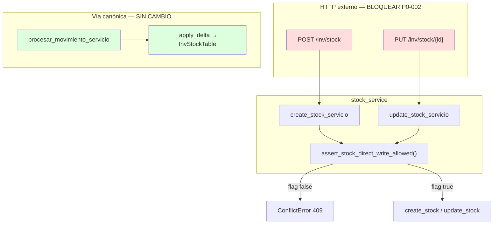

# INV-P0-002 — Diseño Técnico de Implementación

**ID:** INV-P0-002  
**Fecha:** 2026-06-12  
**Modo:** **COMPLETADO** — Gate cierre 160/160 (2026-06-12)  
**Prerequisito:** INV-P0-006, P0-004, P0-001 y P0-005 COMPLETADOS; auditoría previa P0-002 aprobada  
**Fuentes de código analizadas:**
- `app/modules/inv/application/services/stock_service.py`
- `app/modules/inv/application/services/movimiento_proceso_service.py` (vía canónica `_apply_delta`)
- `app/modules/inv/presentation/endpoints_stock.py`
- `app/infrastructure/database/queries/inv/stock_queries.py`
- `app/modules/inv/presentation/schemas.py` (BC-05, BC-06)
- `app/core/config.py`
- `app/core/exceptions.py`
- `app/modules/inv/application/services/inventario_fisico_aprobacion_service.py` (consumidor indirecto)
- `app/modules/pur/application/services/recepcion_service.py` (consumidor indirecto)
- `tests/unit/test_inv_company_isolation.py` (tests existentes stock)

**Objetivo:** Prohibir en runtime la escritura externa directa sobre `inv_stock` (tabla derivada), preservando la única vía canónica de mutación vía `procesar_movimiento_servicio`. **Sin modificar BD, OpenAPI, RBAC ni lógica de costeo P0-001/005.**

---

## 0. Verificaciones de diseño (pre-Etapa 1)

### 0.1 Handler global `ConflictError` → HTTP 409

| Verificación | Resultado |
|--------------|-----------|
| `configure_exception_handlers(app)` en `app/main.py` L62 | ✅ Registrado al startup |
| Handler `@app.exception_handler(CustomException)` en `app/core/exceptions.py` L161–180 | ✅ Mapea `exc.status_code` (409 para `ConflictError`) |
| Payload JSON | `{"detail": "...", "error_code": "STOCK_DERIVED_WRITE_FORBIDDEN"}` |
| `endpoints_stock.py` POST/PUT | **No captura** `ConflictError` — la excepción **propaga** al handler global |

**Decisión:** **`endpoints_stock.py` fuera de alcance.** No añadir `except ConflictError` en handlers; preferir propagación al mecanismo global (R52 ERP V4).

> Nota: `endpoints_productos.py` captura `ConflictError` explícitamente por patrón legacy; stock no lo requiere.

### 0.2 Singleton `settings` en `config.py`

| Verificación | Resultado |
|--------------|-----------|
| Instancia | `settings = Settings()` — módulo `app/core/config.py` L280 |
| Momento de carga | Una vez al import del módulo (`load_dotenv()` L11 previo a clase) |
| Lectura flag | `settings.INV_ALLOW_STOCK_DIRECT_WRITE` — atributo de instancia cacheada |
| Reconstrucción por request | **No** — sin factory ni `Settings()` por llamada |

**Decisión:** `is_stock_direct_write_allowed()` lee `settings.INV_ALLOW_STOCK_DIRECT_WRITE` del singleton importado en `inv_stock_write_policy.py`.

### 0.3 CA-002-13 — No regresión vía canónica

| ID | Criterio | Verificación |
|----|----------|--------------|
| **CA-002-13** | El guard de escritura directa **no afecta** `procesar_movimiento_servicio` ni `_apply_delta` | Gate `test_movimiento_proceso_costo.py` completo (26/26) en Etapa 5 |

El guard se aplica **exclusivamente** en `stock_service.create_*` / `update_*`. `movimiento_proceso_service` no importa `inv_stock_write_policy`.

---

## 1. Resumen del hallazgo

| Atributo | Valor |
|----------|-------|
| **Problema** | `POST /inv/stock` y `PUT /inv/stock/{id}` ejecutan INSERT/UPDATE directo sobre tabla derivada, bypassando workflow de movimientos y costeo PPM |
| **Severidad** | P0 — integridad stock↔kardex↔valorización |
| **Riesgo** | R2 (tabla derivada mutable) |
| **Estrategia** | Guard en capa **servicio** (`stock_service`) + flag de configuración |
| **Decisión de negocio** | **Opción A** — bloqueo total de `create_stock_servicio` y `update_stock_servicio`; sin excepciones para `stock_minimo`, `stock_maximo` ni `punto_reorden` |

### Contexto post-P0-001/005

Tras el cierre de costeo en `procesar_movimiento`, mantener escritura directa permite desincronizar:

| Campo | Efecto del bypass |
|-------|-------------------|
| `cantidad_actual` | Stock ≠ suma de movimientos procesados |
| `costo_promedio` | Valor distinto al calculado por PPM / AD-01/02/03 |
| `valor_total` (PERSISTED) | `cantidad_actual × costo_promedio` incorrecto en reportes |
| Kardex | Secuencia de movimientos no refleja saldos GET stock |

---

## 2. Alcance exacto

### 2.1 Dentro de alcance

| Ámbito | Detalle |
|--------|---------|
| **Política runtime** | Rechazar `create_stock_servicio` y `update_stock_servicio` cuando política activa |
| **Flag configuración** | `INV_ALLOW_STOCK_DIRECT_WRITE` (default `false`) en `config.py` |
| **Helper centralizado** | Nuevo módulo `inv_stock_write_policy.py` (patrón `inv_workflow_enforcement.py`) |
| **Propagación HTTP** | `ConflictError` → handler global `CustomException` (409) — **sin modificar** `endpoints_stock.py` |
| **Tests** | Nuevo `test_stock_write_policy.py` + ajuste tests isolation si aplica |
| **Documentación env** | Anotar variable en `.env.example` (sin secretos) |
| **Logging** | Warning estructurado en intento bloqueado (Etapa 6) |

### 2.2 Fuera de alcance (explícito)

| Ítem | Motivo |
|------|--------|
| Cambios BD / schema `inv_stock` | Restricción Fase 0 |
| Cambios OpenAPI (`deprecated`, schemas, rutas) | BC-05/06 permanecen visibles |
| Revocación permisos RBAC `inv.stock.crear` / `inv.stock.actualizar` | Auditoría contratos posterior (BC-27) |
| Eliminación endpoints POST/PUT | Backlog Fase contratos |
| HTTP 410 Gone | Post-telemetría consumidores |
| Modificación `movimiento_proceso_service.py` | Vía canónica; sin cambio |
| Modificación `inv_costeo_proceso.py` / P0-001/005 | Prerequisito cerrado |
| Modificación `stock_queries.py` | Guard en servicio, no en query |
| Modificación `endpoints_stock.py` | Handler global cubre `ConflictError` — ver §0.1 |
| PUT parcial solo umbrales (`stock_minimo`, etc.) | **Opción A rechazada** — futuro endpoint dedicado |
| WMS `stock_ubicacion` | Tabla distinta |
| INV-P0-003 (estorno) | Ítem siguiente en orden P0 |

---

## 3. Archivos exactos a modificar

| # | Archivo | Acción |
|---|---------|--------|
| 1 | `app/modules/inv/application/services/inv_stock_write_policy.py` | **CREAR** — política y helper |
| 2 | `app/core/config.py` | Añadir flag `INV_ALLOW_STOCK_DIRECT_WRITE` |
| 3 | `app/modules/inv/application/services/stock_service.py` | Modificar 2 funciones (Etapa 2) |
| 4 | `.env.example` | Documentar variable (comentario) |
| 5 | `tests/unit/test_stock_write_policy.py` | **CREAR** |
| 6 | `tests/unit/test_inv_company_isolation.py` | Ajustar 2 tests si guard precede validación scope (Etapa 3) |

### Archivos explícitamente fuera de alcance

| Archivo | Motivo |
|---------|--------|
| `app/modules/inv/application/services/movimiento_proceso_service.py` | Única vía canónica — **sin cambio** |
| `app/modules/inv/application/services/inv_costeo_proceso.py` | P0-001/005 cerrado |
| `app/infrastructure/database/queries/inv/stock_queries.py` | Sin guard en capa query |
| `app/modules/inv/presentation/schemas.py` | Sin cambio `StockCreate`/`StockUpdate` |
| `app/bootstrap_v2/02_catalog/permisos_rbac/S041__*.sql` | RBAC intacto |
| `inventario_fisico_aprobacion_service.py` | Usa `procesar_movimiento`, no stock_service |
| `pur/recepcion_service.py` | Ídem |
| `kardex_service.py` / `kardex_queries.py` | Solo lectura |
| `endpoints_stock.py` | Handler global; propagación sin cambio |

---

## 4. Funciones exactas a modificar

### 4.1 Nuevo módulo `inv_stock_write_policy.py`

| Función / constante | Responsabilidad |
|---------------------|-----------------|
| `STOCK_DERIVED_WRITE_FORBIDDEN_CODE` | Constante: `"STOCK_DERIVED_WRITE_FORBIDDEN"` |
| `_MSG_STOCK_DERIVED_WRITE` | Mensaje accionable en español |
| `is_stock_direct_write_allowed() -> bool` | Lee `settings.INV_ALLOW_STOCK_DIRECT_WRITE` |
| `assert_stock_direct_write_allowed() -> None` | Si política activa → `ConflictError` 409 |

**Mensaje propuesto:**

```text
La escritura directa de stock está deshabilitada. Use movimientos de inventario procesados.
```

**Clase de excepción:** `ConflictError` (409) — política de negocio sobre estado derivado; coherente con ERP V4 (`app/core/exceptions.py`).

**No usar** `AuthorizationError` (403): el usuario puede tener permiso RBAC válido; la operación está prohibida por política de integridad, no por autorización.

**Propagación HTTP:** `ConflictError` hereda de `CustomException`; el handler global en `configure_exception_handlers` retorna HTTP 409 con `error_code`. Los handlers POST/PUT en `endpoints_stock.py` **no requieren** bloque `except` adicional (§0.1).

### 4.2 `stock_service.py`

| Función | Punto de inyección |
|---------|-------------------|
| `create_stock_servicio` | **Primera línea** del cuerpo (antes de `enforce_body_empresa_matches_session`) → `assert_stock_direct_write_allowed()` |
| `update_stock_servicio` | **Primera línea** del cuerpo (antes de `get_stock_by_id`) → `assert_stock_direct_write_allowed()` |

**Orden deliberado:** el guard precede validaciones de scope/empresa para:

1. Rechazar cualquier intento de escritura directa con mensaje de política unificado.
2. Evitar ejecutar queries de validación en operaciones ya prohibidas.
3. Simplificar tests de política (no requieren mocks de producto/almacén).

**Funciones sin cambio:**

| Función | Motivo |
|---------|--------|
| `list_stocks_servicio` | Lectura |
| `get_stock_servicio` | Lectura |
| `get_stock_by_producto_almacen_servicio` | Lectura |
| `list_stock_alertas_servicio` | Lectura |

### 4.3 `config.py`

| Atributo | Valor default | Env |
|----------|---------------|-----|
| `INV_ALLOW_STOCK_DIRECT_WRITE` | `false` | `INV_ALLOW_STOCK_DIRECT_WRITE` |

**Política de entorno (recomendada, no obligatoria en código Fase 0):**

| Entorno | Flag |
|---------|------|
| `production` | `false` (hard default operativo) |
| `staging` | `false` |
| `development` | `false` en CI; `true` solo local si tests legacy lo requieren |

> Opcional post-MVP: `model_validator` que fuerce `false` en `ENVIRONMENT=production` (patrón `ENABLE_TENANT_TOKEN_VALIDATION`). **No obligatorio** en Fase 0 si documentación y `.env` son suficientes.

---

## 5. Flujo actual vs flujo objetivo

### 5.1 Flujo actual — escritura externa (anti-patrón)

```
POST /inv/stock
  → require_permission(inv.stock.crear)
  → create_stock_servicio
    → validaciones empresa/producto/almacén
    → create_stock(payload) → INSERT inv_stock
```

```
PUT /inv/stock/{id}
  → require_permission(inv.stock.actualizar)
  → update_stock_servicio
    → get_stock_by_id
    → update_stock(payload) → UPDATE inv_stock
```

**Brecha:** cualquier campo de `StockCreate`/`StockUpdate` — incluidos `cantidad_actual`, `costo_promedio`, `stock_minimo` — persiste sin movimiento procesado.

### 5.2 Flujo objetivo — escritura externa bloqueada

```
POST /inv/stock
  → require_permission(inv.stock.crear)     # RBAC sin cambio
  → create_stock_servicio
    → assert_stock_direct_write_allowed()   # ConflictError 409
    → (no alcanzado) validaciones + INSERT
```

```
PUT /inv/stock/{id}
  → require_permission(inv.stock.actualizar)
  → update_stock_servicio
    → assert_stock_direct_write_allowed()   # ConflictError 409
    → (no alcanzado) validaciones + UPDATE
```

### 5.3 Flujo canónico — sin cambio (P0-001/005)

```
POST /movimientos/{id}/procesar
  → procesar_movimiento_servicio
    → _apply_delta (InvStockTable INSERT/UPDATE directo en UoW)
      → cantidad_actual + costo_promedio (PPM, AD-01/02/03)
```

**Cadena indirecta intacta:**

```
aprobar_inventario_fisico → procesar_movimiento_servicio(uow=…)
pur/recepcion procesar    → procesar_movimiento_servicio
```

### 5.4 Diagrama de rutas de mutación



---

## 6. Decisión de negocio — Opción A

| Decisión | Detalle |
|----------|---------|
| **Bloqueo total** | `create_stock_servicio` y `update_stock_servicio` rechazan **cualquier** payload |
| **Sin excepción umbrales** | PUT con solo `stock_minimo` / `stock_maximo` / `punto_reorden` también bloqueado |
| **Alternativa futura** | Endpoint dedicado de parámetros operativos por producto×almacén (fuera P0-002) |
| **Saldo inicial / apertura** | Movimiento de entrada + `procesar` — no POST stock |
| **Corrección de errores** | INV-P0-003 estorno (siguiente ítem); no PUT stock |

---

## 7. Impacto por capa

### 7.1 Tablas

| Tabla | Impacto |
|-------|---------|
| `inv_stock` | Solo mutación vía `_apply_delta` en `procesar_movimiento` |
| `inv_movimiento` / detalle | Sin cambio |
| `inv_producto` | Sin cambio (umbrales a nivel producto siguen editables vía PUT producto) |

### 7.2 Servicios

| Servicio | Cambio |
|----------|--------|
| `create_stock_servicio` | Guard → `ConflictError` |
| `update_stock_servicio` | Guard → `ConflictError` |
| `procesar_movimiento_servicio` | **Sin cambio** |
| `list_*` / `get_*` stock | **Sin cambio** |
| `kardex_service` | **Sin cambio** (solo lectura movimientos) |

### 7.3 Contratos HTTP (BC-05, BC-06)

| Contrato | Comportamiento actual | Comportamiento objetivo |
|----------|----------------------|-------------------------|
| `POST /inv/stock` | 201 si datos válidos | **409** con política activa (flag `false`) |
| `PUT /inv/stock/{id}` | 200 si existe | **409** con política activa |
| `GET /inv/stock*` | 200 | **Sin cambio** |
| OpenAPI `deprecated=True` | Presente | **Sin cambio** |
| `StockCreate` / `StockUpdate` | Sin cambio schema | **Sin cambio** |

### 7.4 RBAC

| Permiso | Estado Fase 0 |
|---------|---------------|
| `inv.stock.crear` | **Mantenido** — request llega al servicio y recibe 409 |
| `inv.stock.actualizar` | **Mantenido** |
| `inv.stock.leer` | Sin cambio |

---

## 8. Dependencias con P0 cerrados

| Ítem cerrado | Relación con P0-002 |
|--------------|---------------------|
| **P0-006** | Sin interferencia — campos distintos (workflow vs stock derivado) |
| **P0-004** | Sin interferencia — `inv_stock` sin columnas usuario |
| **P0-001/005** | P0-002 **protege** integridad del costeo implementado; gate debe incluir `test_movimiento_proceso_costo.py` |
| **P0-003** | Complementario — sin estorno, operadores podrían intentar PUT stock; P0-002 cierra ese bypass |

---

## 9. Plan de pruebas

### 9.1 Archivo nuevo: `tests/unit/test_stock_write_policy.py`

#### Tests de helper (unitarios puros)

| ID | Caso |
|----|------|
| S-01 | `is_stock_direct_write_allowed()` con flag `false` → `False` |
| S-02 | `is_stock_direct_write_allowed()` con flag `true` → `True` |
| S-03 | `assert_stock_direct_write_allowed()` flag `false` → `ConflictError` 409, `internal_code=STOCK_DERIVED_WRITE_FORBIDDEN` |
| S-04 | `assert_stock_direct_write_allowed()` flag `true` → no lanza |

#### Tests de servicio (mocks, sin BD)

| ID | Caso |
|----|------|
| S-05 | `create_stock_servicio` flag `false` → `ConflictError` **sin** llamar `create_stock` query |
| S-06 | `update_stock_servicio` flag `false` → `ConflictError` **sin** llamar `update_stock` query |
| S-07 | `create_stock_servicio` flag `true` → delega a `create_stock` (mock retorna fila) |
| S-08 | `update_stock_servicio` flag `true` → delega a `update_stock` |
| S-09 | PUT con solo `stock_minimo` flag `false` → `ConflictError` (Opción A) |
| S-10 | `list_stocks_servicio` flag `false` → sin guard; ejecuta lectura normal |

#### Tests HTTP (opcional Etapa 5 — integración E2E)

| ID | Caso |
|----|------|
| S-11 | POST `/inv/stock` flag `false` → HTTP 409 vía handler global (TestClient) |
| S-12 | PUT `/inv/stock/{id}` flag `false` → HTTP 409 vía handler global |

> S-11/S-12 validan propagación end-to-end; no requieren cambio en `endpoints_stock.py`.

### 9.2 Mapa requisito → test

| Requisito | Test(s) |
|-----------|---------|
| R-002-01 Política escritura prohibida prod | S-03, S-05, S-06 |
| R-002-02 Flag dev override | S-04, S-07, S-08 |
| R-002-03 Bloqueo total Opción A (umbrales incluidos) | S-09 |
| R-002-04 Lecturas intactas | S-10 + gate isolation lectura |
| R-002-05 Vía canónica `procesar` intacta | Gate `test_movimiento_proceso_costo.py` |
| R-002-06 Sin cambio BD/OpenAPI/RBAC | Checklist §16 |
| R-002-07 P0-006 workflow intacto | Gate `test_movimiento_workflow_enforcement.py` |
| R-002-08 P0-004 audit intacto | Gate `test_inv_audit_usuario.py` |
| R-002-09 IF aprobación intacta | Gate `test_inventario_fisico_aprobacion.py` |
| R-002-10 HTTP 409 vía handler global | S-03 (+ S-11/S-12 opcional E2E) |
| R-002-11 Vía canónica sin guard | CA-002-13 + gate costo 26/26 |

### 9.3 Cobertura mínima obligatoria para cerrar P0-002

**7 casos mínimos:** S-03, S-05, S-06, S-07, S-09, S-10 + gate regresión §9.4 verde.

### 9.4 Gate regresión (Etapa cierre)

```text
pytest tests/unit/test_stock_write_policy.py
     tests/unit/test_movimiento_proceso_costo.py
     tests/unit/test_movimiento_workflow_enforcement.py
     tests/unit/test_inv_company_isolation.py
     tests/unit/test_inventario_fisico_aprobacion.py
     tests/unit/test_inventario_fisico_finalizar_f4.py
     tests/unit/test_inventario_fisico_update_con_detalle.py
     tests/unit/test_inv_audit_usuario.py
```

**Gate:** 100% verde (baseline post-P0-001/005: **150 passed** + nuevos tests S-xx).

### 9.5 Ajuste tests existentes (`test_inv_company_isolation.py`)

| Test actual | Comportamiento post-guard | Acción |
|-------------|---------------------------|--------|
| `test_create_stock_producto_e1_almacen_e2_rejected` | Espera `NotFoundError` por almacén cross-empresa | **Opción 1 (recomendada):** patch `INV_ALLOW_STOCK_DIRECT_WRITE=true` para preservar test de scope. **Opción 2:** cambiar expectativa a `ConflictError` si flag default `false` — pierde cobertura scope en create. |
| `test_create_stock_body_empresa_mismatch_403` | Espera `AuthorizationError` por empresa mismatch | Patch flag `true` — guard no debe enmascarar validación empresa cuando escritura permitida. |

---

## 10. Estrategia de implementación incremental

### Etapa 1 — Política + configuración ✅

| Atributo | Valor |
|----------|-------|
| **Entregable** | `inv_stock_write_policy.py` + flag en `config.py` + `.env.example` |
| **Archivos** | crear módulo; modificar `config.py`, `.env.example` |
| **Tests** | S-01 a S-04 |
| **Riesgo** | Nulo — sin wiring en servicio |
| **Validación** | `pytest tests/unit/test_stock_write_policy.py -k "s0"` → 4 passed |

### Etapa 2 — Guard en `stock_service` ✅

| Atributo | Valor |
|----------|-------|
| **Entregable** | Guard en `create_stock_servicio` y `update_stock_servicio` (primera instrucción) |
| **Archivos** | `stock_service.py`, `test_stock_write_policy.py` (S-05 a S-10) |
| **Tests** | S-05, S-06, S-07, S-08, S-09, S-10 |
| **Riesgo** | Bajo |
| **Validación** | `pytest tests/unit/test_stock_write_policy.py` → 10 passed |

**Auditoría escritura directa (pre-implementación Etapa 2):**

| Verificación | Resultado |
|--------------|-----------|
| Únicas funciones en `stock_service` que llaman `create_stock`/`update_stock` | `create_stock_servicio`, `update_stock_servicio` |
| Helpers internos que bypass guard | **Ninguno** (`_validate_*`, `_row_to_read` solo lectura) |
| Otros consumidores `stock_queries.create_stock` en repo INV | **Ninguno** |
| `movimiento_proceso_service` → `inv_stock_write_policy` | **Sin referencia** (muta vía `_apply_delta` / `InvStockTable`) |
| WMS `create_stock_ubicacion` | Tabla distinta — fuera alcance |

### Etapa 3 — Tests isolation ✅

| Atributo | Valor |
|----------|-------|
| **Entregable** | Patch `INV_ALLOW_STOCK_DIRECT_WRITE=true` en 2 tests scope |
| **Archivos** | `test_inv_company_isolation.py` |
| **Tests afectados** | `test_create_stock_producto_e1_almacen_e2_rejected`, `test_create_stock_body_empresa_mismatch_403` |
| **Validación** | `test_inv_company_isolation.py` 62/62 verde |

### Etapa 4 — Tests dedicados completos

| Atributo | Valor |
|----------|-------|
| **Entregable** | `test_stock_write_policy.py` completo (S-01 a S-12) |
| **Validación** | 7 casos mínimos §9.3 en verde |

### Etapa 5 — Gate regresión (cierre funcional) ✅

| Atributo | Valor |
|----------|-------|
| **Comando** | Gate §9.4 |
| **Resultado** | **160/160 passed** (2026-06-12) |
| **Estado** | **INV-P0-002 COMPLETADO** |

### Etapa 6 — Monitoreo y comunicación (post-deploy)

| Atributo | Valor |
|----------|-------|
| **Entregable** | Log warning en `assert_stock_direct_write_allowed` con `client_id`/`empresa_id` si disponible en contexto |
| **Duración** | 2 semanas monitoreo intentos bloqueados |
| **Acción** | Inventario consumidores FE; actualizar backlog BC-05/06 |

```
Etapa 1 (policy + config) ✅
    → Etapa 2 (guard stock_service) ✅
        → Etapa 3 (isolation tests) ✅
            → Etapa 4 (tests completos S-05–S-10)
                → Etapa 5 (gate)
                    → Etapa 6 (monitoreo post-deploy)
```

**No iniciar Etapa 1 de código hasta aprobación explícita de este documento.**

---

## 11. Riesgos y rollback

### 11.1 Riesgos de regresión

| Riesgo | Prob. | Impacto | Mitigación |
|--------|-------|---------|------------|
| Frontend usa POST stock para apertura | Media | Alto | Flag staging; guía movimiento apertura; telemetría Etapa 6 |
| Operador corrige stock vía PUT (pre-P0-003) | Media | Medio | Comunicación; acelerar P0-003 |
| Tests isolation fallan por guard primero | Alta | Bajo | Patch flag `true` en tests de scope |
| Confusión 403 vs 409 | Baja | Bajo | `ConflictError` documentado; mensaje accionable |
| `_apply_delta` bloqueado por error | Nula | Crítico | Guard **solo** en `stock_service` — verificar en code review |
| Regresión costeo P0-001/005 | Baja | Crítico | Gate incluye 26 tests costo |

### 11.2 Estrategia de rollback

| Nivel | Acción |
|-------|--------|
| **Runtime** | `INV_ALLOW_STOCK_DIRECT_WRITE=true` en env (restaura comportamiento legacy) |
| **Por etapa** | Revertir commit de etapa afectada |
| **BD** | No aplica — sin migración |
| **OpenAPI** | No aplica — sin cambio contrato |
| **RBAC** | No aplica — permisos intactos |

**Rollback seguro:** flag `true` o revertir capa servicio + policy; `procesar_movimiento` y costeo intactos.

---

## 12. Estrategia de migración segura

| Fase | Acción | Entorno |
|------|--------|---------|
| **0a** | Auditoría previa + este documento | Todos |
| **0b** | Deploy con flag `false` + guard activo | Prod/staging |
| **0c** | Monitoreo 2 semanas — logs `STOCK_DERIVED_WRITE_FORBIDDEN` | Prod |
| **0d** | Inventario consumidores FE (fuera repo) | Prod |
| **1 contratos** | BC-27: evaluar 410 Gone si cero consumidores | Post-monitoreo |

### Alternativa operativa — saldo inicial

```text
1. POST /movimientos (entrada apertura, estado borrador — P0-006)
2. POST /movimientos/{id}/procesar
3. GET /stock → cantidad y costo derivados con PPM
```

### Entornos y flag

| Entorno | `INV_ALLOW_STOCK_DIRECT_WRITE` |
|---------|-------------------------------|
| Producción | `false` |
| Staging | `false` |
| Dev / CI | `false` (tests usan patch explícito `true` cuando necesario) |

---

## 13. Criterios de aceptación

| ID | Criterio | Verificación |
|----|----------|--------------|
| CA-002-01 | POST `/inv/stock` rechazado con flag `false` | S-05 (+ S-11 opcional E2E) |
| CA-002-02 | PUT `/inv/stock/{id}` rechazado con flag `false` | S-06 (+ S-12 opcional E2E) |
| CA-002-03 | Flag `true` permite escritura (dev override) | S-07, S-08 |
| CA-002-04 | PUT solo umbrales también rechazado (Opción A) | S-09 |
| CA-002-05 | `procesar_movimiento` muta stock sin regresión | Gate costo 26/26 |
| CA-002-06 | Aprobación IF → procesar sin regresión | `test_inventario_fisico_aprobacion.py` 10/10 |
| CA-002-07 | GET stock y alertas sin cambio | S-10 + isolation lectura |
| CA-002-08 | P0-006 workflow intacto | `test_movimiento_workflow_enforcement.py` 29/29 |
| CA-002-09 | P0-004 audit intacto | `test_inv_audit_usuario.py` 14/14 |
| CA-002-10 | Sin cambio BD / OpenAPI / RBAC | Checklist §14 |
| CA-002-11 | Mensaje HTTP accionable (409) con `error_code` | S-03 (handler global) |
| CA-002-12 | Gate regresión 150+ verde | §9.4 |
| CA-002-13 | Guard **no afecta** `procesar_movimiento_servicio` ni `_apply_delta` | `test_movimiento_proceso_costo.py` 26/26 |

---

## 14. Checklist de validación post-implementación

### 14.1 Funcional — bloqueo escritura

- [ ] POST `/inv/stock` con flag `false` → 409, mensaje política
- [ ] PUT `/inv/stock/{id}` con flag `false` → 409
- [ ] PUT con solo `stock_minimo` → 409 (Opción A)
- [ ] Flag `true` → POST/PUT ejecutan flujo legacy (dev)

### 14.2 Funcional — lecturas intactas

- [ ] GET `/inv/stock` → 200
- [ ] GET `/inv/stock/{id}` → 200
- [ ] GET `/inv/stock/producto/{pid}/almacen/{aid}` → 200 o null
- [ ] GET `/inv/stock/alertas` → 200

### 14.3 Integridad — vía canónica

- [ ] `procesar` entrada → stock actualizado con costo (P0-001)
- [ ] IF aprobar → procesar ajuste OK
- [ ] PUR recepción → procesar OK
- [ ] Kardex coherente con movimientos procesados (smoke manual)

### 14.4 No-regresión P0 cerrados

- [ ] `test_movimiento_proceso_costo.py` — 26/26
- [ ] `test_movimiento_workflow_enforcement.py` — 29/29
- [ ] `test_inv_audit_usuario.py` — 14/14
- [ ] `test_inv_company_isolation.py` — 62/62 (con ajustes flag)
- [ ] Suite IF — 17/17

### 14.5 No-regresión de contrato

- [ ] OpenAPI: POST/PUT stock siguen `deprecated=True`
- [ ] Schemas `StockCreate`/`StockUpdate` sin modificación
- [ ] Permisos `inv.stock.crear` / `inv.stock.actualizar` sin revocar

### 14.6 Cierre P0-002

- [ ] Tests S-03, S-05, S-06, S-07, S-09, S-10 en verde
- [ ] Gate §9.4 100% verde
- [ ] CA-002-13: `test_movimiento_proceso_costo.py` 26/26
- [ ] Variable documentada en `.env.example`
- [ ] Etapas 1–5 completadas; Etapa 6 planificada post-deploy

---

## 15. Orden definitivo P0 (contexto)

```
INV-P0-006  ✅ COMPLETADO
INV-P0-004  ✅ COMPLETADO
INV-P0-001  ✅ COMPLETADO
INV-P0-005  ✅ COMPLETADO
INV-P0-002  ✅ COMPLETADO (gate 160/160)
INV-P0-003  ← siguiente (auditoría previa)
```

---

## 16. Referencias

| Documento | Sección |
|-----------|---------|
| `INV_PLAN_IMPLEMENTACION_P0.md` | §3 INV-P0-002 |
| `INV_PLAN_CORRECCION.md` | INV-P0-002, BC-05, BC-06 |
| `INV_AUDITORIA_CONTRATOS_API.md` | §2.5 stock, BC-05/06/27 |
| `INV_AUDITORIA_PERSISTENCIA.md` | §7.3 tabla derivada |
| `INV_IMPLEMENTACION_P0-001_P0-005.md` | Dependencia costeo |
| `app/core/exceptions.py` | `ConflictError`, `configure_exception_handlers` |
| `app/main.py` | L62 `configure_exception_handlers(app)` |
| `inv_workflow_enforcement.py` | Patrón helper INV |

---

*INV-P0-002 COMPLETADO — Gate 160/160. Siguiente hito: auditoría previa INV-P0-003.*
