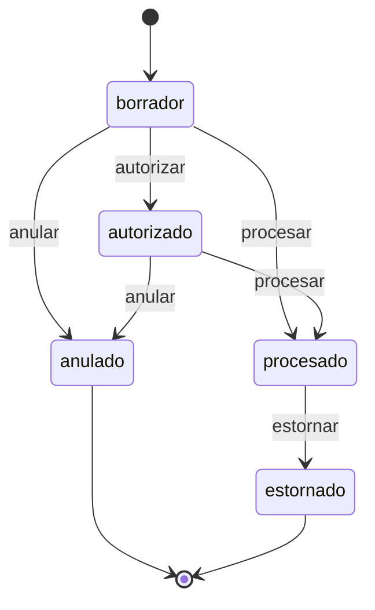

# INV-P0-003 — Diseño Técnico de Implementación

**ID:** INV-P0-003  
**Fecha:** 2026-06-12  
**Modo:** Diseño técnico — **sin código en este documento**  
**Prerequisito:** INV-P0-006, P0-004, P0-001/005 y **P0-002 COMPLETADOS**; auditoría previa P0-003 y validación UoW aprobadas  
**Fuentes de código analizadas:**
- `app/modules/inv/application/services/movimiento_proceso_service.py`
- `app/modules/inv/application/services/inventario_fisico_aprobacion_service.py` (patrón UoW + `procesar(uow=…)`)
- `app/modules/inv/application/services/inv_workflow_enforcement.py`
- `app/modules/inv/application/services/inv_costeo_proceso.py`
- `app/modules/inv/application/services/movimiento_service.py` (referencia anti-patrón UoW)
- `app/modules/inv/presentation/endpoints_movimientos_proceso.py`
- `app/modules/inv/presentation/schemas_proceso.py`
- `app/modules/pur/application/services/recepcion_service.py` (consumidor bloqueado MVP)
- `app/core/application/unit_of_work.py`
- `app/bootstrap_v2/01_schema/V010__tablas_bd_erp_completo.sql` (`inv_movimiento`)
- `app/bootstrap_v2/02_catalog/permisos_rbac/S042__permisos_rbac_inv-lifecycle.sql`

**Objetivo:** Implementar **estorno de movimientos procesados** mediante movimiento compensatorio procesado en UoW atómica, estado terminal `estornado` en el original, y trazabilidad `movimiento_estorno`. **Sin modificar BD ni eliminar contratos existentes.**

---

## 1. Resumen del hallazgo

| Atributo | Valor |
|----------|-------|
| **Problema** | `anular_movimiento_servicio` rechaza `estado=procesado` (409); no existe reversión de stock vía API |
| **Severidad** | P0 — R6 (operaciones bloqueadas; corrección imposible post-P0-002) |
| **Estrategia** | Movimiento compensatorio + `procesar_movimiento_servicio(uow=…)` en **único UoW** |
| **Versión** | **Extendida** (endpoint `estornar` + tests; no solo política documentada) |

### Contexto post-P0 cerrados

| P0 | Relación |
|----|----------|
| **P0-002** | PUT/POST stock bloqueado → estorno es la **única** corrección legítima de saldos |
| **P0-001/005** | Compensatorio reutiliza `procesar` / PPM; reversión de **cantidad** operativa; costo **no exacto** |
| **P0-006** | Compensatorio nace `borrador`; original pasa a `estornado` solo vía servicio estorno |
| **P0-004** | `usuario_creacion_id` en compensatorio desde sesión |

---

## 2. Decisiones de negocio confirmadas

| # | Decisión | Valor aprobado |
|---|----------|----------------|
| DN-01 | Alcance | **Extendida** — endpoint + servicio + tests |
| DN-02 | Estado original | **`estornado`** (app-level); **no** reutilizar `anulado` |
| DN-03 | MVP integraciones | Solo movimientos **manuales INV**; bloquear `documento_referencia_tipo` ∈ `{inventario_fisico, RECEPCION}` |
| DN-04 | Tipo compensatorio | **Mismo `tipo_movimiento_id`**; sin catálogo nuevo |
| DN-05 | Trazabilidad | `documento_referencia_tipo='movimiento_estorno'`, `documento_referencia_id=<original_id>` |
| DN-06 | Costo PPM | Limitación matemática **aceptada**; objetivo = cantidad + trazabilidad |

---

## 3. Alcance exacto

### 3.1 Dentro de alcance

| Ámbito | Detalle |
|--------|---------|
| **Nuevo servicio** | `estornar_movimiento_servicio` |
| **Nuevo endpoint** | `POST /inv/{movimiento_id}/estornar` (patrón BC-31 vigente) |
| **Nuevo schema** | `MotivoEstorno` en `schemas_proceso.py` |
| **Helpers** | `inv_estorno_proceso.py` — espejo, idempotencia, gates MVP |
| **Estado `estornado`** | Terminal; guards en `procesar`, `autorizar`, `anular`, `estornar` |
| **RBAC** | Nuevo permiso `inv.movimiento.estornar` (seed S042 o extensión) |
| **Tests** | `test_movimiento_estorno.py` |
| **Atomicidad** | Requisitos **D-01 a D-10** (§8) |

### 3.2 Fuera de alcance (explícito)

| Ítem | Motivo |
|------|--------|
| Cambios BD / CHECK `estado` / UNIQUE referencia | Restricción Fase 0 |
| Estorno movimientos `inventario_fisico` / `RECEPCION` | MVP — orquestación cross-módulo Etapa futura |
| Orquestación PUR (`movimiento_inventario_id`) | Fuera MVP |
| Orquestación IF (`movimiento_ajuste_id`) | Fuera MVP |
| Reversión directa `inv_stock` | Viola P0-002 |
| Nuevo `tipo_movimiento` catálogo "Estorno" | DN-04 |
| Estorno parcial por línea | Solo estorno **total** Fase 0 |
| Reconstrucción exacta `costo_promedio` histórico | DN-06 |
| Modificación funcional de `procesar_movimiento_servicio` (ramas costo/cantidad) | Reutilización vía espejo §7 |
| Eliminación / cambio de `POST …/anular` | Contrato preservado |

---

## 4. Estado `estornado` — terminal y no reentrante

### 4.1 Definición

| Atributo | Valor |
|----------|-------|
| **Valor** | `estornado` (NVARCHAR existente; sin migración BD) |
| **Semántica** | Movimiento procesado cuya operación de stock fue **revertida** por compensatorio vinculado |
| **Distinguible de `anulado`** | `anulado` = pre-proceso sin mutación stock; `estornado` = post-proceso con compensatorio |

### 4.2 Matriz de operaciones sobre `estornado`

| Operación | Permitido | Comportamiento |
|-----------|-----------|----------------|
| **Autorizar** | ❌ | 409 — `No se puede autorizar un movimiento en estado 'estornado'` |
| **Procesar** | ❌ | 409 — `No se puede procesar un movimiento estornado` |
| **Anular** | ❌ | 409 — `No se puede anular un movimiento estornado` (no idempotente como `anulado`) |
| **Estornar** | ❌ | 409 — `MOVIMIENTO_YA_ESTORNADO` |
| **GET / listar** | ✅ | Lectura; aparece en kardex e historial |
| **UPDATE API** | ❌ | P0-006 rechaza `estado` en UPDATE |

### 4.3 Puntos de inyección de guards (post-implementación)

| Función | Cambio |
|---------|--------|
| `procesar_movimiento_servicio` | Tras leer `estado`, antes de ramas: `if estado == "estornado":` → 409 |
| `autorizar_movimiento_servicio` | Añadir `estornado` al bloque `if estado in ("procesado", "anulado")` |
| `anular_movimiento_servicio` | Tras `anulado` idempotente: `if estado == "estornado":` → 409 |
| `estornar_movimiento_servicio` | `if estado == "estornado":` → 409; solo `procesado` continúa |

### 4.4 Diagrama de estados (movimiento manual INV)



---

## 5. Trazabilidad obligatoria

### 5.1 Enlace compensatorio → original

| Campo compensatorio | Valor |
|---------------------|-------|
| `documento_referencia_tipo` | `'movimiento_estorno'` (literal fijo, minúsculas en runtime) |
| `documento_referencia_id` | `movimiento_id` del **original** |
| `documento_referencia_numero` | `numero_movimiento` del original (auditoría humana) |
| `modulo_origen` | `'INV'` |
| `observaciones` | Prefijo `Estorno de {numero_movimiento}` + motivo usuario |
| `tipo_movimiento_id` | **Igual al original** (DN-04) |
| `requiere_autorizacion` | **Copia del original** (cabecera `inv_movimiento`; alineado con gate L174 de `procesar`) |
| `estado` inicial | Ver **X-07** §7.4: `borrador` por defecto; `autorizado` si `requiere_autorizacion=1` |
| `fecha_autorizacion` | Solo si X-07: `datetime.utcnow()` al INSERT |
| `autorizado_por_usuario_id` | Solo si X-07: `usuario_estorno` (usuario de sesión que invoca estorno) |

### 5.2 Enlace original → compensatorio

| Campo original (post-estorno) | Valor |
|-------------------------------|-------|
| `estado` | `estornado` |
| `motivo_anulacion` | Reutilizado Fase 0 para motivo estorno (sin columna nueva) |
| `fecha_actualizacion` | `utcnow()` |

> **Nota diseño:** no existe columna `movimiento_estorno_id` en BD. La relación inversa se resuelve por query:

```sql
SELECT movimiento_id FROM inv_movimiento
WHERE documento_referencia_tipo = 'movimiento_estorno'
  AND documento_referencia_id = :original_id
  AND cliente_id = :client_id
  AND empresa_id = :empresa_id
```

### 5.3 Idempotencia

| Condición | Acción |
|-----------|--------|
| Original ya `estornado` | 409 `MOVIMIENTO_YA_ESTORNADO` |
| Existe compensatorio `procesado` (query §5.2) | 409 `MOVIMIENTO_YA_ESTORNADO` |
| Existe compensatorio `borrador` huérfano | 409 accionable (no debería ocurrir con D-01) |

### 5.4 Auditoría / kardex

- Kardex lista **ambos** movimientos (original `procesado` histórico + compensatorio `procesado`).
- GET movimiento original muestra `estado=estornado`.
- Trazabilidad FIN futura: `documento_referencia_*` en compensatorio.

---

## 6. Flujo atómico — `estornar_movimiento_servicio`

### 6.1 Patrón de referencia

`inventario_fisico_aprobacion_service.aprobar_inventario_fisico_servicio`:

- `INSERT` movimiento en UoW
- `INSERT` detalles en UoW
- `procesar_movimiento_servicio(..., uow=uow)`
- `UPDATE` entidad relacionada en UoW
- **Un commit**

### 6.2 Secuencia obligatoria (D-01 a D-07)

```text
async with unit_of_work(client_id) as uow:

  P0  SELECT original WITH (UPDLOCK, ROWLOCK)
      WHERE movimiento_id=:id AND estado='procesado'
      → 404 si no existe; 409 si no procesado

  P0b Gates MVP:
      documento_referencia_tipo NOT IN ('inventario_fisico','recepcion')
      (comparación case-insensitive)

  P1  SELECT compensatorio existente por documento_referencia_id=original_id
      → 409 si existe

  P0c assert_entrada_espejo_ppm_viable (X-08 §7.6)
      → 409 ESTORNO_ENTRADA_PPM_QNEW_CERO si entrada AC=1 y q_new=0

  P2  INSERT inv_movimiento (compensatorio, borrador|autorizado X-07, refs §5.1)
  P3  INSERT inv_movimiento_detalle (líneas espejo §7)

  P4  procesar_movimiento_servicio(comp_id, usuario_id, uow=uow)
      → stock mutado; compensatorio → procesado

  P5  UPDATE original SET estado='estornado', motivo_anulacion=:motivo
      WHERE movimiento_id=:id AND estado='procesado'
      → si rows_affected≠1: excepción → rollback total

  COMMIT
```

### 6.3 Invariantes prohibidos

| Estado prohibido | Prevención |
|------------------|------------|
| Compensatorio sin original `estornado` | P4→P5 orden + UoW única |
| Original `estornado` sin compensatorio procesado | P5 solo tras P4 exitoso |
| Doble compensatorio | P1 + UPDLOCK + P5 condicional |

### 6.4 Anti-patrones prohibidos

| Anti-patrón | Motivo |
|-------------|--------|
| `create_movimiento_con_detalles_servicio` | Abre y commitea UoW propia (L373 `movimiento_service`) |
| `create_movimiento` / `update_movimiento` queries | Transacción independiente |
| Marcar `estornado` antes de `procesar` compensatorio | Invariante §6.3 |
| Dos UoW secuenciales | Ventana inconsistencia / doble estorno |

---

## 7. Validación de reglas espejo por `clase_movimiento`

**Objetivo:** confirmar que el compensatorio puede procesarse con **`procesar_movimiento_servicio` sin modificaciones funcionales**, reutilizando el mismo `tipo_movimiento_id` y la lógica existente en `movimiento_proceso_service.py` L352–423.

### 7.1 Reglas de construcción del compensatorio

| Clase original | Cabecera compensatorio | Detalle `cantidad_base` | `costo_unitario` |
|----------------|------------------------|-------------------------|------------------|
| **entrada** | Igual `almacen_destino_id` | **Negada** (`-cantidad_original`) | Copia del original |
| **salida** | Igual `almacen_origen_id` | **Negada** | Copia del original |
| **transferencia** | **Swap** `almacen_origen_id` ↔ `almacen_destino_id` | Igual (positiva) | Copia del original |
| **ajuste** | Igual target (`destino` o `origen` del original) | **Negada** | Copia del original |

### 7.2 Auditoría de compatibilidad funcional (código real)

**Fuente:** `movimiento_proceso_service.py` L139–423, `inv_costeo_proceso.py`.  
**Filtro previo común (L345–350):** líneas con `qty == 0` se omiten; **cantidades negativas no se rechazan** en ninguna clase.

**Notación espejo:** compensatorio con mismo `tipo_movimiento_id` / `clase_movimiento`; detalle según §7.1.

#### 7.2.1 Entrada — espejo: mismo `almacen_destino_id`, `cantidad_base` negada

| # | Pregunta | Original (+10 → D) | Compensatorio espejo (entrada, qty=**-10**, dest D) |
|---|----------|-------------------|------------------------------------------------------|
| 1 | **Rama ejecutada** | `clase == "entrada"` L352 → `_apply_entrada_o_ajuste_positivo(D, +10, cu)` | Misma rama L352–360 → `_apply_entrada_o_ajuste_positivo(D, -10, cu)` |
| 2 | **¿Acepta qty negativa?** | Sí (no hay `if qty > 0`; solo `qty == 0` → skip) | Sí — la rama entrada **no bifurca por signo** (a diferencia de `ajuste`) |
| 3 | **Helper final invocado** | `validate_costo_unitario_for_process` → `_resolve_costo_entrada_line` → `_apply_delta(D, +10, costo_obj)` | Misma cadena → `_apply_delta(D, -10, costo_obj)` |
| 4 | **Delta final `inv_stock` (D)** | `cantidad_actual += +10` | `cantidad_actual += -10` → **reversión cantidad ✅** |
| 5 | **Validaciones que bloquean espejo** | — | Ver tabla inferior |

| Validación | Condición | Efecto en espejo |
|------------|-----------|------------------|
| D2 costo | `afecta_costo=1`, `cu≤0`, no IF | `ValidationError` 422 — mitigar copiando `cu` original (X-01) |
| Stock insuficiente | `q_actual + (-10) < 0` | 409 en `_apply_delta` L288–293 (X-03) |
| **PPM q_new=0** | `afecta_costo=1`, `q_actual == \|qty_espejo\|` | `calc_ppm_entrada` → `DivisionByZero` **sin catch** (X-08) |
| IF | `documento_referencia_tipo=inventario_fisico` | Bloqueado MVP P0b; no aplica compensatorio manual |

**X-08 (hallazgo auditoría código):** reversión **total** de entrada con `afecta_costo=1` cuando el stock actual en D iguala exactamente la cantidad a revertir provoca `decimal.DivisionByZero` en `calc_ppm_entrada` L79–80 (`q_new = q + delta = 0`). Verificado en runtime. Con `afecta_costo=0`, `_resolve_costo_entrada_line` retorna `None` y el espejo **sí** revierte cantidad sin tocar costo. **No requiere cambiar ramas de `procesar`** para casos `afecta_costo=0` o reversión parcial (`q_actual > \|qty_espejo\|`); el escenario AC=1 reversión total expone defecto preexistente en helper de costeo.

#### 7.2.2 Salida — espejo: mismo `almacen_origen_id`, `cantidad_base` negada

| # | Pregunta | Original (+5, orig O) | Compensatorio espejo (salida, qty=**-5**, orig O) |
|---|----------|----------------------|---------------------------------------------------|
| 1 | **Rama ejecutada** | `clase == "salida"` L361 → `_apply_delta(O, -5)` | Misma rama L361–367 → `_apply_delta(O, -(-5))` |
| 2 | **¿Acepta qty negativa?** | Sí | Sí |
| 3 | **Helper final invocado** | `_apply_delta` (sin costeo) | `_apply_delta(O, +5)` — **sin** `validate_costo` ni `_resolve_costo_*` |
| 4 | **Delta final `inv_stock` (O)** | `cantidad_actual -= 5` | `cantidad_actual += 5` → **reversión cantidad ✅** |
| 5 | **Validaciones que bloquean espejo** | Stock insuficiente en original | **Ninguna** en estorno típico (estorno **incrementa** stock). Si `qty` en detalle fuera 0 → línea omitida |

#### 7.2.3 Transferencia — espejo: swap `almacen_origen_id` ↔ `almacen_destino_id`, qty positiva

| # | Pregunta | Original (A→B, +5) | Compensatorio espejo (B→A swap, +5) |
|---|----------|-------------------|-------------------------------------|
| 1 | **Rama ejecutada** | `clase == "transferencia"` L368–405 | Misma rama |
| 2 | **¿Acepta qty negativa?** | Sí en código, pero **espejo usa qty positiva** | Espejo: qty **positiva** (no negar) |
| 3 | **Helpers finales invocados** | `_apply_delta(A,-5)` → `_resolve_costo_transferencia_destino` → `_apply_delta(B,+5,costo_dest)` | `_apply_delta(B,-5)` → `_resolve_costo_transferencia_destino(cu_eff=C_B)` → `_apply_delta(A,+5,costo_dest)` |
| 4 | **Delta final `inv_stock`** | A: `-5`; B: `+5` | B: `-5`; A: `+5` → **reversión cantidad ✅** |
| 5 | **Validaciones que bloquean espejo** | Stock A ≥ 5 | Stock B ≥ 5 tras original; si B=0 → 409 (X-04). PPM destino no restaura C exacto (X-06, DN-06) |

#### 7.2.4 Ajuste positivo — espejo: mismo target, `cantidad_base` negada

| # | Pregunta | Original (ajuste +3, target T) | Compensatorio espejo (ajuste, qty=**-3**, target T) |
|---|----------|-------------------------------|-----------------------------------------------------|
| 1 | **Rama ejecutada** | `clase == "ajuste"`, `qty > 0` L413–416 → `_apply_entrada_o_ajuste_positivo` | `qty < 0` L417–418 → `_apply_delta(T, qty)` pasa **delta = qty** (no `-qty`) |
| 2 | **¿Acepta qty negativa?** | N/A (original positivo) | Sí — rama `else` explícita para `qty < 0` |
| 3 | **Helper final invocado** | `validate_costo_*` → `_resolve_costo_entrada_line` → `_apply_delta(T,+3,costo)` | Solo `_apply_delta(T, -3)` — **sin** recálculo PPM |
| 4 | **Delta final `inv_stock` (T)** | `+3` | `-3` → **reversión cantidad ✅** (test C-15 confirma ajuste− no altera costo) |
| 5 | **Validaciones que bloquean espejo** | D2 si `afecta_costo=1` y `cu≤0` | Stock insuficiente si `q_actual < 3` (X-03). Sin validación D2 en rama negativa |

#### 7.2.5 Ajuste negativo — espejo: mismo target, `cantidad_base` positiva (signo invertido)

| # | Pregunta | Original (ajuste -3, target T) | Compensatorio espejo (ajuste, qty=**+3**, target T) |
|---|----------|-------------------------------|-----------------------------------------------------|
| 1 | **Rama ejecutada** | `qty < 0` L417–418 → `_apply_delta(T, -3)` | `qty > 0` L413–416 → `_apply_entrada_o_ajuste_positivo(T, +3, cu)` |
| 2 | **¿Acepta qty negativa?** | Sí (rama `else`) | Compensatorio usa qty positiva |
| 3 | **Helper final invocado** | `_apply_delta` directo | `validate_costo_*` → `_resolve_costo_entrada_line` → `_apply_delta(T,+3,costo)` |
| 4 | **Delta final `inv_stock` (T)** | `-3` | `+3` → **reversión cantidad ✅** |
| 5 | **Validaciones que bloquean espejo** | Stock ≥ 3 | D2 si `afecta_costo=1` y `cu≤0` — copiar `cu` original. PPM imperfecto aceptado (DN-06) |

### 7.3 Tabla de excepciones identificadas (pre-implementación)

| ID | Clase / condición | Excepción | Mitigación diseño |
|----|-------------------|-----------|-------------------|
| **X-01** | Entrada + `afecta_costo=1` + `cu≤0` | 422 en P4 (`ValidationError`) | Copiar `cu` original; MVP bloquea IF |
| **X-02** | Salida estorno con stock ya consumido | N/A — estorno **aumenta** stock | — |
| **X-03** | Entrada estorno / ajuste− con stock insuficiente | 409 stock insuficiente en P4 | Mensaje accionable; rollback total |
| **X-04** | Transferencia estorno con stock destino=0 | 409 en P4 | Operador debe resolver stock |
| **X-05** | `documento_referencia_tipo` IF/RECEPCION | Bloqueo P0b antes de escritura | 409 `ESTORNO_INTEGRACION_NO_MVP` |
| **X-06** | PPM no restaura C exacto | Comportamiento esperado | DN-06; documentar en response/README |
| **X-07** | `requiere_autorizacion=1` en compensatorio | `procesar` L174 exige `estado='autorizado'` si cabecera `requiere_autorizacion=1`; compensatorio solo `borrador` → 409 en P4 | **Cierre definitivo §7.4** — lógica solo en `build_compensatorio_cabecera`, no en `procesar` |
| **X-08** | Entrada espejo AC=1, `q_actual == \|qty_espejo\|` | `DivisionByZero` en `calc_ppm_entrada` si no se intercepta | **Regla obligatoria §7.6** — gate explícito en `inv_estorno_proceso` **antes** de P4; 409 `ESTORNO_ENTRADA_PPM_QNEW_CERO` |

### 7.4 X-07 — Especificación cerrada (autorización compensatorio)

**Gate en `procesar` (código real L174–178):**

```python
if bool(mov.get("requiere_autorizacion")) and estado != "autorizado":
    raise HTTPException(409, "Movimiento requiere autorización previa …")
```

El gate lee **`inv_movimiento.requiere_autorizacion`** (cabecera), no el catálogo `inv_tipo_movimiento` en runtime. El builder **debe copiar** `requiere_autorizacion` del movimiento original (que refleja el tipo al crear el movimiento).

**Condición de activación X-07:**

```text
bool(original.get("requiere_autorizacion")) is True
```

Equivalente operativo: el tipo del movimiento exigía autorización y el original llegó a `procesado` vía `autorizado`.

**Campos obligatorios en INSERT cabecera compensatorio (P2) cuando X-07 aplica:**

| Campo | Valor |
|-------|-------|
| `estado` | `'autorizado'` |
| `fecha_autorizacion` | `datetime.utcnow()` |
| `autorizado_por_usuario_id` | `usuario_estorno` (UUID sesión — parámetro de `estornar_movimiento_servicio`) |
| `requiere_autorizacion` | Copia del original (`1` / `True`) |

**Cuando X-07 NO aplica** (`requiere_autorizacion=0`):

| Campo | Valor |
|-------|-------|
| `estado` | `'borrador'` |
| `fecha_autorizacion` | `NULL` |
| `autorizado_por_usuario_id` | `NULL` |

**Flujo P4 sin llamar `autorizar_movimiento_servicio`:** `procesar_movimiento_servicio` acepta compensatorio en `autorizado` y lo procesa directamente (misma semántica que original autorizado→procesado).

**Pseudocódigo `build_compensatorio_cabecera` (fragmento):**

```python
now = datetime.utcnow()
cab = {..., "requiere_autorizacion": original.get("requiere_autorizacion")}
if bool(original.get("requiere_autorizacion")):
    cab["estado"] = "autorizado"
    cab["fecha_autorizacion"] = now
    cab["autorizado_por_usuario_id"] = usuario_estorno
else:
    cab["estado"] = "borrador"
    cab["fecha_autorizacion"] = None
    cab["autorizado_por_usuario_id"] = None
```

**Fuera de alcance X-07:** no invocar `autorizar_movimiento_servicio` (UoW separada / transición redundante). No modificar gate L174 de `procesar`.

### 7.6 X-08 — Regla obligatoria (gate pre-PPM en estorno)

**Problema:** si `clase_movimiento='entrada'`, `afecta_costo=1` y el espejo de cantidad deja `q_new = q_actual + qty_espejo = 0`, `calc_ppm_entrada` lanza `DivisionByZero` dentro de `procesar` (defecto preexistente en helper de costeo).

**Regla de implementación (obligatoria, no backlog):** `estornar_movimiento_servicio` debe invocar `assert_entrada_espejo_ppm_viable` en **P0c** (después de gates MVP/idempotencia, **antes** de INSERT compensatorio y **antes** de `procesar`), detectando explícitamente la condición y respondiendo con error controlado.

**Condición de detección (por línea de detalle):**

```text
clase_movimiento == 'entrada'
AND afecta_costo == 1
AND almacen_destino_id IS NOT NULL
AND qty_espejo = -cantidad_base_original  (≠ 0)
AND existe stock (producto_id, almacen_destino_id)
AND q_actual + qty_espejo == 0
```

Equivalente operativo: stock actual en destino **iguala exactamente** la cantidad que el espejo revertiría (reversión total de la cantidad disponible).

**Respuesta HTTP:**

| Atributo | Valor |
|----------|-------|
| Status | `409 Conflict` |
| `error_code` | `ESTORNO_ENTRADA_PPM_QNEW_CERO` |
| Mensaje | Accionable; indica que la reversión total dejaría stock en cero con tipo costeable y no puede procesarse por estorno automático |

**Ubicación:** `inv_estorno_proceso.py` — función `assert_entrada_espejo_ppm_viable`. **No** modificar `procesar_movimiento_servicio` ni `inv_costeo_proceso.py`.

**Secuencia actualizada (fragmento §6.2):**

```text
P0b  Gates MVP
P1   Idempotencia compensatorio
P0c  assert_entrada_espejo_ppm_viable  ← X-08 (nuevo)
P2   INSERT compensatorio
P3   INSERT detalle espejo
P4   procesar_movimiento_servicio
P5   UPDATE original estornado
```

**Test:** E-08b (Etapa 1 o 5).

### 7.5 Conclusión reglas espejo

| Clase | ¿Procesable sin cambiar `procesar`? | Condición |
|-------|-------------------------------------|-----------|
| entrada | ✅ / ⚠️ | qty negada; cu copiado; X-07 si `requiere_autorizacion`; **X-08** si AC=1 y reversión total deja `q_new=0` en PPM |
| salida | ✅ | qty negada |
| transferencia | ✅ | swap almacenes; qty positiva; stock suficiente en almacén origen compensatorio |
| ajuste (+) | ✅ | qty negada en compensatorio → rama `_apply_delta` directa |
| ajuste (−) | ✅ | qty positiva en compensatorio → rama `_apply_entrada_o_ajuste_positivo` |

**Veredicto:** las reglas espejo §7.1 **no requieren modificar ramas funcionales** de `procesar_movimiento_servicio` (L352–423). Únicas extensiones fuera de `procesar`:

1. **X-07** — estado inicial `autorizado` + campos de autorización en INSERT cabecera (`build_compensatorio_cabecera`).
2. **X-08** — gate `assert_entrada_espejo_ppm_viable` en P0c (§7.6); error 409 controlado, sin `DivisionByZero` esperado.
3. **Guards `estornado`** — D-10 (workflow, no lógica stock/costo).

**X-08:** el escenario `q_new=0` queda **bloqueado explícitamente** en el flujo de estorno; no forma parte del comportamiento esperado del sistema.

---

## 8. Requisitos atómicos obligatorios (D-01 a D-10)

| ID | Requisito | Verificación |
|----|-----------|--------------|
| **D-01** | Un solo `async with unit_of_work` por estorno | Code review + test E-20 rollback |
| **D-02** | Inserts vía `uow.execute`; no `create_movimiento*` | Code review |
| **D-03** | `procesar_movimiento_servicio(comp_id, uow=uow)` | Test E-01 |
| **D-04** | `UPDATE estornado` **después** de `procesar` | Code review + test E-21 |
| **D-05** | `UPDLOCK`/`ROWLOCK` en lectura original | Code review |
| **D-06** | `UPDATE estornado WHERE estado='procesado'` + `rows_affected=1` | Test E-22 |
| **D-07** | Pre-check `movimiento_estorno` por `documento_referencia_id` | Test E-02 |
| **D-08** | Bloqueo MVP IF/RECEPCION antes de escritura | Test E-03, E-04 |
| **D-09** | Reglas espejo §7 aplicadas en builder | Tests E-05–E-08 |
| **D-10** | Sin modificar ramas funcionales de `procesar` (solo guards `estornado`) | Gate costo 26/26 |

---

## 9. Archivos exactos a modificar

| # | Archivo | Acción |
|---|---------|--------|
| 1 | `app/modules/inv/application/services/inv_estorno_proceso.py` | **CREAR** — espejo, gates, idempotencia |
| 2 | `app/modules/inv/application/services/movimiento_proceso_service.py` | Añadir `estornar_movimiento_servicio`; guards `estornado` en 3 funciones |
| 3 | `app/modules/inv/presentation/endpoints_movimientos_proceso.py` | Añadir `POST /{id}/estornar` |
| 4 | `app/modules/inv/presentation/schemas_proceso.py` | Añadir `MotivoEstorno` |
| 5 | `app/modules/inv/application/services/__init__.py` | Export `estornar_movimiento_servicio` |
| 6 | `app/bootstrap_v2/02_catalog/permisos_rbac/S042__permisos_rbac_inv-lifecycle.sql` | Añadir `inv.movimiento.estornar` |
| 7 | `tests/unit/test_movimiento_estorno.py` | **CREAR** |

### Archivos explícitamente fuera de alcance

| Archivo | Motivo |
|---------|--------|
| `stock_service.py` / `inv_stock_write_policy.py` | P0-002 cerrado |
| `inv_costeo_proceso.py` | P0-001/005 cerrado; reutilización sin cambio |
| `stock_queries.py` | Sin bypass stock |
| `movimiento_service.py` | No usar para crear compensatorio |
| `recepcion_service.py` / `inventario_fisico_aprobacion_service.py` | MVP bloquea origen |
| `schemas.py` (MovimientoCreate) | Sin breaking |
| `V010__*.sql` | Sin cambio BD |

---

## 10. Funciones exactas a modificar / crear

### 10.1 Nuevo módulo `inv_estorno_proceso.py`

| Función / constante | Responsabilidad |
|---------------------|-----------------|
| `ESTORNO_REF_TIPO` | `'movimiento_estorno'` |
| `ESTORNO_MVP_BLOCKED_REF_TIPOS` | `frozenset({'inventario_fisico', 'recepcion'})` |
| `MOVIMIENTO_YA_ESTORNADO_CODE` | `'MOVIMIENTO_YA_ESTORNADO'` |
| `ESTORNO_INTEGRACION_NO_MVP_CODE` | `'ESTORNO_INTEGRACION_NO_MVP'` |
| `ESTORNO_ENTRADA_PPM_QNEW_CERO_CODE` | `'ESTORNO_ENTRADA_PPM_QNEW_CERO'` |
| `assert_estorno_mvp_allowed(mov: dict) -> None` | Gate P0b |
| `assert_not_already_estornado(mov: dict) -> None` | `estado != estornado` |
| `find_compensatorio_by_original(uow, …) -> Optional[dict]` | Idempotencia P1 |
| `assert_entrada_espejo_ppm_viable(…)` | Gate P0c — X-08 §7.6 |
| `build_compensatorio_cabecera(original, motivo, usuario_id) -> dict` | Espejo §7 + §5.1 + X-07 |
| `build_compensatorio_detalles(original_detalles, clase_movimiento) -> list[dict]` | Espejo §7 |

### 10.2 `movimiento_proceso_service.py`

| Función | Cambio |
|---------|--------|
| `estornar_movimiento_servicio` | **NUEVA** — orquestador §6.2 |
| `procesar_movimiento_servicio` | Guard `estornado` → 409 (D-10 mínimo) |
| `autorizar_movimiento_servicio` | Incluir `estornado` en estados bloqueados |
| `anular_movimiento_servicio` | `estornado` → 409 (no idempotente) |

### 10.3 `endpoints_movimientos_proceso.py`

| Handler | Cambio |
|---------|--------|
| `estornar_movimiento` | **NUEVO** — `MotivoEstorno`, permiso `inv.movimiento.estornar` |

---

## 11. Contratos HTTP

| Ruta | Método | Permiso | Request | Response |
|------|--------|---------|---------|----------|
| `/inv/{movimiento_id}/estornar` | POST | `inv.movimiento.estornar` | `MotivoEstorno` | `MovimientoRead` (original `estornado`) |

**OpenAPI:** endpoint **aditivo** (nuevo); sin cambio en `/anular`, `/procesar`, `/autorizar`.

**Errores:**

| Código | Caso | `error_code` |
|--------|------|--------------|
| 404 | Movimiento no encontrado / cross-empresa | `NOT_FOUND` |
| 409 | Ya estornado / doble estorno | `MOVIMIENTO_YA_ESTORNADO` |
| 409 | IF/RECEPCION en MVP | `ESTORNO_INTEGRACION_NO_MVP` |
| 409 | Stock insuficiente en P4 | mensaje `procesar` existente |
| 422 | Validación costo D2 en compensatorio | `VALIDATION_ERROR` |

Propagación: preferir handler global `CustomException`; `HTTPException` de `procesar` dentro de UoW provoca rollback (comportamiento actual).

---

## 12. Compatibilidad con P0 cerrados

| P0 | Impacto | Regresión |
|----|---------|-----------|
| P0-006 | Guards `estornado`; compensatorio `borrador`/`autorizado` | `test_movimiento_workflow_enforcement.py` 29/29 |
| P0-001/005 | Reutiliza `procesar`; PPM imperfecto aceptado | `test_movimiento_proceso_costo.py` 26/26 |
| P0-002 | Stock solo vía `procesar` en P4 | `test_stock_write_policy.py` 10/10 |
| P0-004 | `usuario_creacion_id` en INSERT compensatorio | `test_inv_audit_usuario.py` 14/14 |

---

## 13. Plan de pruebas

### 13.1 Archivo: `tests/unit/test_movimiento_estorno.py`

| ID | Caso |
|----|------|
| E-01 | Entrada +10 → procesar → estornar → qty restaurada |
| E-02 | Doble estorno → 409 `MOVIMIENTO_YA_ESTORNADO` |
| E-03 | Original `documento_referencia_tipo=inventario_fisico` → 409 MVP |
| E-04 | Original `documento_referencia_tipo=RECEPCION` → 409 MVP |
| E-05 | Espejo entrada: qty negada en builder |
| E-06 | Espejo salida: qty negada |
| E-07 | Espejo transferencia: almacenes swap |
| E-08 | Espejo ajuste: qty negada / invertida según signo original |
| E-08b | X-08: entrada AC=1, `q_actual == cantidad` → 409 `ESTORNO_ENTRADA_PPM_QNEW_CERO` |
| E-09 | `estornado` no procesable |
| E-10 | `estornado` no anulable |
| E-11 | `estornado` no re-estornable |
| E-12 | Compensatorio tiene `documento_referencia_tipo=movimiento_estorno` |
| E-13 | Salida estorno restaura cantidad (AC=0 costo opcional) |
| E-14 | X-07: `requiere_autorizacion=1` en original → compensatorio INSERT `estado='autorizado'`, `fecha_autorizacion`, `autorizado_por_usuario_id`; `procesar` OK en P4 |
| E-20 | Fallo P4 → original sigue `procesado`; sin compensatorio persistido |
| E-21 | Orden P4 antes P5 verificado (mock: update estornado no llamado si procesar falla) |
| E-22 | P5 condicional `rows_affected=1` |
| E-23 | Rollback total P4: sin compensatorio persistido, original `procesado`, stock intacto |

### 13.2 Mapa requisito → test

| Requisito | Test(s) |
|-----------|---------|
| R-003-01 Estorno entrada restaura qty | E-01 |
| R-003-02 Idempotencia / doble estorno | E-02, E-11 |
| R-003-03 Bloqueo IF MVP | E-03 |
| R-003-04 Bloqueo RECEPCION MVP | E-04 |
| R-003-05 Reglas espejo | E-05–E-08 |
| R-003-06 Estado terminal `estornado` | E-09–E-11 |
| R-003-07 Trazabilidad | E-12 |
| R-003-08 Atomicidad UoW | E-20–E-22, D-01–D-07 |
| R-003-09 Sin regresión P0 | Gate §13.4 |
| R-003-10 X-07 autorización | E-14 |

### 13.3 Cobertura mínima cierre

**8 casos mínimos:** E-01, E-02, E-03, E-04, E-09, E-12, E-20, E-21

### 13.4 Gate regresión (Etapa cierre)

```text
pytest tests/unit/test_movimiento_estorno.py
     tests/unit/test_stock_write_policy.py
     tests/unit/test_movimiento_proceso_costo.py
     tests/unit/test_movimiento_workflow_enforcement.py
     tests/unit/test_inv_company_isolation.py
     tests/unit/test_inventario_fisico_aprobacion.py
     tests/unit/test_inventario_fisico_finalizar_f4.py
     tests/unit/test_inventario_fisico_update_con_detalle.py
     tests/unit/test_inv_audit_usuario.py
```

**Gate:** 100% verde (baseline P0-002: **160** + nuevos tests E-xx).

---

## 14. Estrategia de implementación incremental

| Etapa | Entregable | Tests |
|-------|------------|-------|
| **0** | Este documento + decisiones DN-01–06 | — |
| **1** | `inv_estorno_proceso.py` (builder + gates + X-08) | E-05–E-08, E-08b ✅ |
| **2** | Guards `estornado` en procesar/autorizar/anular | E-09–E-11 ✅ |
| **3** | `estornar_movimiento_servicio` + UoW | E-01, E-20–E-23 ✅ |
| **4** | Endpoint + `MotivoEstorno` + RBAC | E-02–E-04, E-12, H-01–H-06 ✅ |
| **5** | Tests completos + X-07 | E-14 ✅ |
| **6** | Gate regresión §13.4 | **196/196 verde** — P0-003 COMPLETADO ✅ |

```
Etapa 0 (diseño) ✅
  → Etapa 1 (helpers espejo)
    → Etapa 2 (guards estornado)
      → Etapa 3 (estornar + UoW)
        → Etapa 4 (HTTP + RBAC)
          → Etapa 5 (tests)
            → Etapa 6 (gate)
```

**Etapa 6 cerrada (2026-06-12).** Gate §13.4 + HTTP: **196/196 verde**. INV-P0-003 **COMPLETADO**.

---

## 20. Reporte formal de cierre INV-P0-003

**Fecha cierre:** 2026-06-12  
**Gate §13.4:** 189/189 verde (baseline 160 + 29 tests estorno servicio)  
**Gate extendido P0-003:** 196/196 verde (+ 7 tests HTTP H-01–H-06 + OpenAPI)

### 20.1 Ejecución gate §13.4

```text
pytest tests/unit/test_movimiento_estorno.py              → 29/29
     tests/unit/test_stock_write_policy.py                → 10/10
     tests/unit/test_movimiento_proceso_costo.py          → 26/26
     tests/unit/test_movimiento_workflow_enforcement.py   → 29/29
     tests/unit/test_inv_company_isolation.py             → 62/62
     tests/unit/test_inventario_fisico_aprobacion.py     → 12/12
     tests/unit/test_inventario_fisico_finalizar_f4.py    →  6/6
     tests/unit/test_inventario_fisico_update_con_detalle.py → 1/1
     tests/unit/test_inv_audit_usuario.py                → 14/14
                                    Subtotal §13.4        189/189 ✅

pytest tests/unit/test_movimiento_estorno_http.py         →  7/7 ✅
                                    Total P0-003          196/196 ✅
```

### 20.2 Criterios CA-003-01 a CA-003-15

| ID | Criterio | Evidencia | Estado |
|----|----------|-----------|--------|
| CA-003-01 | Solo `procesado` estornable | E-01, E-02, guards P0 | ✅ |
| CA-003-02 | Original `estornado` atómico con compensatorio | E-01, E-21 | ✅ |
| CA-003-03 | `estornado` terminal | E-09–E-11 | ✅ |
| CA-003-04 | Trazabilidad `movimiento_estorno` | E-12 | ✅ |
| CA-003-05 | Doble estorno → 409 | E-02, H-02 | ✅ |
| CA-003-06 | IF/RECEPCION bloqueados MVP | E-03, E-04, H-03, H-04 | ✅ |
| CA-003-07 | Cantidad restaurada (entrada) | E-01 | ✅ |
| CA-003-08 | Sin bypass P0-002 | Gate stock policy 10/10 | ✅ |
| CA-003-09 | P0-001/005 sin regresión | Gate costo 26/26 | ✅ |
| CA-003-10 | P0-006 sin regresión | Gate workflow 29/29 | ✅ |
| CA-003-11 | D-01 a D-10 | E-20–E-23, E-22, §8 | ✅ |
| CA-003-12 | Sin cambio BD estorno | §20.4 | ✅ |
| CA-003-13 | Espejo sin tocar ramas `procesar` | §7, gate costo | ✅ |
| CA-003-14 | PPM imperfecto documentado | DN-06, X-06 | ✅ |
| CA-003-15 | Gate 160+ verde | 189/189 §13.4 | ✅ |

### 20.3 Casos de prueba obligatorios — resultado

| ID | Descripción | Archivo | Estado |
|----|-------------|---------|--------|
| E-01 | Flujo estorno entrada | `test_movimiento_estorno.py` | ✅ |
| E-02 | Doble estorno 409 | `test_movimiento_estorno.py` | ✅ |
| E-03 | IF bloqueado MVP | `test_movimiento_estorno.py` | ✅ |
| E-04 | RECEPCION bloqueado MVP | `test_movimiento_estorno.py` | ✅ |
| E-05–E-08b | Espejo + X-08 | `test_movimiento_estorno.py` | ✅ |
| E-09–E-11 | Estado terminal | `test_movimiento_estorno.py` | ✅ |
| E-12 | Trazabilidad compensatorio | `test_movimiento_estorno.py` | ✅ |
| E-14 | X-07 autorización | `test_movimiento_estorno.py` | ✅ |
| E-20–E-23 | Atomicidad / rollback | `test_movimiento_estorno.py` | ✅ |
| E-22 | P5 `rows_affected=1` | `test_movimiento_estorno.py` | ✅ |
| H-01–H-06 | Contrato HTTP | `test_movimiento_estorno_http.py` | ✅ |

### 20.4 Confirmaciones de no-regresión (alcance P0-003)

| Artefacto | ¿Modificado por P0-003? | Nota |
|-----------|-------------------------|------|
| Esquema BD (`V010`, migraciones estorno) | **No** | Sin columnas/estados nuevos para estorno |
| `inv_costeo_proceso.py` | **No** | Reutilizado; sin diff en alcance P0-003 |
| `_apply_delta` (L271–329) | **No** | Cuerpo intacto; solo guards workflow pre-ramas |
| `stock_service.py` | **No** | Cambios pertenecen a P0-002 (policy guard) |
| `inv_stock_write_policy.py` | **No** | Creado en P0-002; sin cambio en P0-003 |
| `POST …/procesar` | **No** | Handler sin cambio |
| `POST …/autorizar` | **No** | Handler sin cambio (+ `estornado` en estados bloqueados servicio) |
| `POST …/anular` | **No** | Handler sin cambio (+ guard `estornado` servicio) |

### 20.5 Diff final por archivo (alcance INV-P0-003)

**Nuevos**

| Archivo | Rol |
|---------|-----|
| `app/modules/inv/application/services/inv_estorno_proceso.py` | Espejo, gates, X-08, SQL lock, builders |
| `tests/unit/test_movimiento_estorno.py` | 29 tests E-xx |
| `tests/unit/test_movimiento_estorno_http.py` | 7 tests H-xx |

**Modificados**

| Archivo | Cambio |
|---------|--------|
| `movimiento_proceso_service.py` | Guards `estornado`; `estornar_movimiento_servicio` (P0–P5) |
| `endpoints_movimientos_proceso.py` | **Solo adición** `POST /{id}/estornar` |
| `schemas_proceso.py` | `MotivoEstorno` |
| `services/__init__.py` | Export `estornar_movimiento_servicio` |
| `S042__permisos_rbac_inv-lifecycle.sql` | Permiso `inv.movimiento.estornar` |
| `INV_IMPLEMENTACION_P0-003.md` | Diseño + cierre |

**Explícitamente no modificados (P0-003)**

`inv_costeo_proceso.py`, `stock_service.py`, `inv_stock_write_policy.py`, `V010__*.sql`, `movimiento_service.py`, `stock_queries.py`, handlers `procesar`/`autorizar`/`anular`.

### 20.6 Riesgos remanentes y backlog

| ID | Riesgo / backlog | Estado |
|----|------------------|--------|
| X-06 | PPM no restaura costo exacto post-estorno | Aceptado (DN-06) |
| X-08 | Entrada AC=1 reversión total (`q_new=0`) | **Mitigado** — gate 409 `ESTORNO_ENTRADA_PPM_QNEW_CERO` (§7.6); fix `calc_ppm_entrada` en backlog |
| — | Estorno PUR / IF cross-módulo | Backlog Etapa 7 |
| — | Kardex sin filtro `estado` | Backlog |
| — | Campo `motivo_estorno` dedicado | Backlog (reutiliza `motivo_anulacion`) |
| BC-31 | Ruta proceso en raíz `/inv/{id}/*` | Documentado; alias `/movimientos` futuro |

---

## 18. Orden definitivo P0 (contexto)

```
INV-P0-006  ✅ COMPLETADO
INV-P0-004  ✅ COMPLETADO
INV-P0-001  ✅ COMPLETADO
INV-P0-005  ✅ COMPLETADO
INV-P0-002  ✅ COMPLETADO
INV-P0-003  ✅ COMPLETADO  ← Fase 0 INV cerrada
```

---

## 15. Criterios de aceptación

| ID | Criterio | Verificación |
|----|----------|--------------|
| CA-003-01 | Solo `procesado` legítimo es estornable | E-01, guards |
| CA-003-02 | Original pasa a `estornado` atomically con compensatorio procesado | E-01, E-21 |
| CA-003-03 | `estornado` no autorizable / procesable / anulable / re-estornable | E-09–E-11 |
| CA-003-04 | Trazabilidad `movimiento_estorno` + `documento_referencia_id` | E-12 |
| CA-003-05 | Doble estorno → 409 | E-02 |
| CA-003-06 | IF y RECEPCION bloqueados MVP | E-03, E-04 |
| CA-003-07 | Cantidad restaurada operativamente (entrada) | E-01 |
| CA-003-08 | Sin bypass P0-002 | Gate stock policy |
| CA-003-09 | P0-001/005 sin regresión | Gate costo 26/26 |
| CA-003-10 | P0-006 sin regresión | Gate workflow 29/29 |
| CA-003-11 | D-01 a D-10 cumplidos | §8 + E-20–E-22 |
| CA-003-12 | Sin cambio BD | Checklist §16 |
| CA-003-13 | Reglas espejo sin modificar `procesar` (salvo guards) | §7, D-10 |
| CA-003-14 | Limitación PPM documentada | DN-06, §7.3 X-06 |
| CA-003-15 | Gate 160+ verde | §13.4 |

---

## 16. Checklist de validación post-implementación

### 16.1 Funcional — estorno

- [x] POST estornar movimiento manual entrada procesada → qty restaurada
- [x] Original `estado=estornado`; compensatorio `procesado`
- [x] Segundo estorno → 409
- [x] Movimiento IF vinculado → 409 MVP
- [x] Movimiento RECEPCION → 409 MVP

### 16.2 Estado terminal

- [x] `procesar` sobre `estornado` → 409
- [x] `autorizar` sobre `estornado` → 409
- [x] `anular` sobre `estornado` → 409

### 16.3 Atomicidad

- [x] Fallo stock en P4 → original sigue `procesado`
- [x] Sin compensatorio huérfano tras fallo

### 16.4 No-regresión

- [x] Gate §13.4 100% verde (189/189)
- [x] OpenAPI: nuevo endpoint; `/anular` intacto

### 16.5 Cierre P0-003

- [x] 8 casos mínimos §13.3 verdes
- [x] Etapas 1–6 completadas

---

## 17. Riesgos y backlog remanente

| Riesgo | Mitigación |
|--------|------------|
| PPM no exacto post-estorno | DN-06; CA-003-14 |
| Concurrencia doble estorno | D-05, D-06, D-07 |
| X-07 `requiere_autorizacion` | INSERT compensatorio `estado='autorizado'` + `fecha_autorizacion` + `autorizado_por_usuario_id=usuario_estorno` cuando cabecera original `requiere_autorizacion=1` (§7.4) |
| X-08 entrada AC=1 reversión total | Gate P0c `assert_entrada_espejo_ppm_viable` → 409 `ESTORNO_ENTRADA_PPM_QNEW_CERO` (§7.6) |
| Estorno PUR/IF futuro | Etapa 7 cross-módulo; fuera MVP |
| Kardex sin filtro estado | Backlog; no bloquea P0-003 |
| `motivo_anulacion` reutilizado para estorno | Fase 0 sin columna nueva; backlog campo `motivo_estorno` |
| BC-31 ruta `/inv/{id}/estornar` | Consistente con proceso actual |

---

## 19. Referencias

| Documento | Sección |
|-----------|---------|
| `INV_PLAN_IMPLEMENTACION_P0.md` | §4 INV-P0-003 |
| `INV_PLAN_CORRECCION.md` | INV-P0-003, R6 |
| `INV_IMPLEMENTACION_P0-002.md` | Post-002 estorno única corrección |
| `INV_IMPLEMENTACION_P0-001_P0-005.md` | PPM, `_apply_delta` |
| `INV_IMPLEMENTACION_P0-006.md` | Workflow estados |
| `INV_AUDITORIA_CONTRATOS_API.md` | BC-31, proceso movimiento |
| `inventario_fisico_aprobacion_service.py` | Patrón UoW |
| `unit_of_work.py` | Atomicidad |

---

*INV-P0-003 COMPLETADO (2026-06-12). Gate §13.4: 189/189; gate extendido P0-003: 196/196. Fase 0 INV cerrada.*
