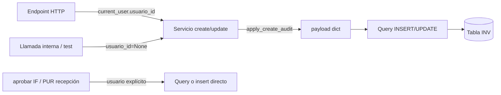

# INV-P0-004 — Diseño Técnico de Implementación

**ID:** INV-P0-004  
**Fecha:** 2026-06-12  
**Modo:** Implementación — **sin código en este documento**  
**Prerequisito:** INV-P0-006 COMPLETADO; auditoría esquema GO; auditoría funcional P0-004 aprobada  
**Fuentes de código analizadas:**
- `app/modules/inv/application/services/categoria_service.py`
- `app/modules/inv/application/services/unidad_medida_service.py`
- `app/modules/inv/application/services/producto_service.py`
- `app/modules/inv/application/services/almacen_service.py`
- `app/modules/inv/application/services/tipo_movimiento_service.py`
- `app/modules/inv/application/services/movimiento_service.py`
- `app/modules/inv/application/services/inventario_fisico_service.py`
- `app/modules/inv/presentation/endpoints_*.py` (maestros, movimientos, inventario físico)
- `app/modules/inv/application/services/inventario_fisico_aprobacion_service.py` (consumidor interno)
- `app/modules/pur/application/services/recepcion_service.py` (consumidor interno)
- `app/infrastructure/database/tables_erp/tables_inv.py`
- `docs/bd/INV_TABLAS.sql`

**Objetivo:** Poblar `usuario_creacion_id` desde sesión en CREATE de maestros y documentos INV; `usuario_actualizacion_id` en UPDATE de `inv_producto`. Usuario **nunca** desde body del cliente. **Sin modificar BD ni contratos OpenAPI.**

---

## 1. Resumen del hallazgo

| Atributo | Valor |
|----------|-------|
| **Problema** | Campos de auditoría usuario existen en BD y Read schemas pero permanecen `NULL` en altas/ediciones vía API |
| **Severidad** | P0 — trazabilidad empresarial (BC-24–26) |
| **Riesgo** | R4 (firmas servicio) — bajo con parámetro opcional |
| **Estrategia** | Inyección en capa **servicio** + propagación desde **endpoints** |
| **Piloto** | INV es primer módulo ERP con patrón; ORG no implementa aún |

### Evidencia esquema (auditoría final GO)

| Campo | Tablas | NULL | Default BD | FK | Trigger/computed |
|-------|--------|------|------------|-----|------------------|
| `usuario_creacion_id` | 7 tablas INV | Sí | Ninguno | Ninguna | Ninguno |
| `usuario_actualizacion_id` | solo `inv_producto` | Sí | Ninguno | Ninguna | Ninguno |

**Conclusión esquema:** población exclusivamente vía aplicación; sin conflicto BD.

---

## 2. Alcance exacto

### 2.1 Dentro de alcance

| Ámbito | Detalle |
|--------|---------|
| **CREATE** | Inyectar `usuario_creacion_id = usuario_id` en 7 tablas |
| **UPDATE** | Inyectar `usuario_actualizacion_id = usuario_id` **solo** en `inv_producto` |
| **Origen usuario** | `current_user.usuario_id` en endpoints HTTP con sesión |
| **Firma servicio** | `usuario_id: Optional[UUID] = None` en 18 funciones núcleo |
| **Sobrescritura body** | Eliminar del payload cualquier `usuario_creacion_id` / `usuario_actualizacion_id` residual antes de persistir |
| **Tests** | Nuevo `test_inv_audit_usuario.py` + regresión suite INV |

### 2.2 Fuera de alcance (explícito)

| Ítem | Motivo |
|------|--------|
| `inv_stock` | Sin columnas usuario |
| `inv_movimiento_detalle` / `inv_inventario_fisico_detalle` | Sin columnas usuario |
| `movimiento_detalle_service` / `inventario_fisico_detalle_service` | Tablas sin columna; endpoints deprecated |
| `stock_service` | Sin columnas usuario |
| `procesar_movimiento` / `autorizar_movimiento` | Ya poblan `usuario_procesado_id` / `autorizado_por_usuario_id` |
| `aprobar_inventario_fisico` | Ya asigna `usuario_creacion_id` en movimiento ajuste (L233) |
| `finalizar_inventario_fisico` / `anular_inventario_fisico` | Sin columna usuario en cabecera IF |
| `supervisor_usuario_id`, `contador_usuario_id`, `responsable_usuario_id` | Rol operativo manual; no auditoría B |
| Backfill histórico `NULL` | Aceptado Fase 0 |
| Readonly formal schemas (BC-20) | Fase contratos |
| Módulo ORG | INV piloto; alineación posterior |
| Cambios BD / queries estructurales | Payload dinámico ya acepta campos |

---

## 3. Archivos exactos a modificar

| # | Archivo | Acción |
|---|---------|--------|
| 1 | `app/modules/inv/application/services/inv_audit_context.py` | **CREAR** — helpers centralizados (opcional pero recomendado) |
| 2 | `app/modules/inv/application/services/categoria_service.py` | Modificar 2 funciones |
| 3 | `app/modules/inv/application/services/unidad_medida_service.py` | Modificar 2 funciones |
| 4 | `app/modules/inv/application/services/producto_service.py` | Modificar 2 funciones |
| 5 | `app/modules/inv/application/services/almacen_service.py` | Modificar 2 funciones |
| 6 | `app/modules/inv/application/services/tipo_movimiento_service.py` | Modificar 2 funciones |
| 7 | `app/modules/inv/application/services/movimiento_service.py` | Modificar 4 funciones |
| 8 | `app/modules/inv/application/services/inventario_fisico_service.py` | Modificar 4 funciones |
| 9 | `app/modules/inv/presentation/endpoints_categorias.py` | Propagar `usuario_id` en 4 handlers |
| 10 | `app/modules/inv/presentation/endpoints_unidades_medida.py` | Propagar en 4 handlers |
| 11 | `app/modules/inv/presentation/endpoints_productos.py` | Propagar en 4 handlers |
| 12 | `app/modules/inv/presentation/endpoints_almacenes.py` | Propagar en 4 handlers |
| 13 | `app/modules/inv/presentation/endpoints_tipos_movimiento.py` | Propagar en 4 handlers |
| 14 | `app/modules/inv/presentation/endpoints_movimientos.py` | Propagar en 4 handlers |
| 15 | `app/modules/inv/presentation/endpoints_inventario_fisico.py` | Propagar en 4 handlers |
| 16 | `tests/unit/test_inv_audit_usuario.py` | **CREAR** |

### Archivos explícitamente fuera de alcance

| Archivo | Motivo |
|---------|--------|
| `app/modules/inv/presentation/schemas.py` | Create/Update no exponen campos usuario; sin breaking |
| `app/infrastructure/database/queries/inv/*.py` | Payload dinámico; sin cambio |
| `app/infrastructure/database/tables_erp/tables_inv.py` | Sin cambio BD |
| `movimiento_detalle_service.py` | Sin columna usuario en BD |
| `inventario_fisico_detalle_service.py` | Ídem |
| `stock_service.py` | Sin columna usuario |
| `movimiento_proceso_service.py` | Campos proceso ya OK |
| `inventario_fisico_aprobacion_service.py` | Insert directo con `usuario_creacion_id` explícito |
| `pur/recepcion_service.py` | `create_movimiento` query con `usuario_creacion_id` explícito |
| `endpoints_movimientos_detalle.py` | Deprecated; sin columna |
| `endpoints_inventario_fisico_detalle.py` | Deprecated; sin columna |
| `endpoints_stock.py` | Sin columna usuario |
| `endpoints_movimientos_proceso.py` | Ya propaga usuario proceso |
| `endpoints_inventario_fisico_aprobar.py` | Ya propaga `usuario_id` |

---

## 4. Funciones exactas a modificar

### 4.1 Nuevo módulo `inv_audit_context.py` (recomendado)

| Función propuesta | Responsabilidad |
|-------------------|-----------------|
| `apply_create_audit(payload: dict, usuario_id: Optional[UUID]) -> dict` | `pop` `usuario_creacion_id` del payload; asignar `payload["usuario_creacion_id"] = usuario_id` |
| `apply_producto_update_audit(payload: dict, usuario_id: Optional[UUID]) -> dict` | `pop` `usuario_actualizacion_id`; asignar solo si `usuario_id` no es `None` |

**Nota:** En UPDATE de entidades sin `usuario_actualizacion_id`, el parámetro `usuario_id` se acepta por uniformidad de firma pero **no se escribe** en payload.

### 4.2 Todos los `create_*` afectados (9 funciones → 7 tablas)

| # | Servicio | Función | Tabla destino | Campo inyectado |
|---|----------|---------|---------------|-----------------|
| C-01 | `categoria_service` | `create_categoria_servicio` | `inv_categoria_producto` | `usuario_creacion_id` |
| C-02 | `unidad_medida_service` | `create_unidad_medida_servicio` | `inv_unidad_medida` | `usuario_creacion_id` |
| C-03 | `producto_service` | `create_producto_servicio` | `inv_producto` | `usuario_creacion_id` |
| C-04 | `almacen_service` | `create_almacen_servicio` | `inv_almacen` | `usuario_creacion_id` |
| C-05 | `tipo_movimiento_service` | `create_tipo_movimiento_servicio` | `inv_tipo_movimiento` | `usuario_creacion_id` |
| C-06 | `movimiento_service` | `create_movimiento_servicio` | `inv_movimiento` | `usuario_creacion_id` |
| C-07 | `movimiento_service` | `create_movimiento_con_detalles_servicio` | `inv_movimiento` (cabecera) | `usuario_creacion_id` |
| C-08 | `inventario_fisico_service` | `create_inventario_fisico_servicio` | `inv_inventario_fisico` | `usuario_creacion_id` |
| C-09 | `inventario_fisico_service` | `create_inventario_fisico_con_detalles_servicio` | `inv_inventario_fisico` (cabecera) | `usuario_creacion_id` |

**Punto de inyección uniforme:** tras `model_dump()` / `model_dump(exclude={...})`, antes de `create_*` query o `insert` UoW cabecera.

**Firma objetivo:**

```text
async def create_*_servicio(
    client_id: UUID,
    data: *Create,
    usuario_id: Optional[UUID] = None,
) -> *Read:
```

### 4.3 Todos los `update_*` afectados (9 funciones → 1 tabla con auditoría update)

| # | Servicio | Función | Tabla | Campo inyectado en UPDATE |
|---|----------|---------|-------|---------------------------|
| U-01 | `categoria_service` | `update_categoria_servicio` | `inv_categoria_producto` | — (sin columna) |
| U-02 | `unidad_medida_service` | `update_unidad_medida_servicio` | `inv_unidad_medida` | — |
| U-03 | `producto_service` | `update_producto_servicio` | `inv_producto` | **`usuario_actualizacion_id`** |
| U-04 | `almacen_service` | `update_almacen_servicio` | `inv_almacen` | — |
| U-05 | `tipo_movimiento_service` | `update_tipo_movimiento_servicio` | `inv_tipo_movimiento` | — |
| U-06 | `movimiento_service` | `update_movimiento_servicio` | `inv_movimiento` | — |
| U-07 | `movimiento_service` | `update_movimiento_con_detalles_servicio` | `inv_movimiento` | — |
| U-08 | `inventario_fisico_service` | `update_inventario_fisico_servicio` | `inv_inventario_fisico` | — |
| U-09 | `inventario_fisico_service` | `update_inventario_fisico_con_detalles_servicio` | `inv_inventario_fisico` | — |

**Firma objetivo:**

```text
async def update_*_servicio(
    client_id: UUID,
    <entity_id>: UUID,
    data: *Update,
    usuario_id: Optional[UUID] = None,
) -> *Read:
```

**Total núcleo:** 18 funciones (9 create + 9 update).

---

## 5. Endpoints que deben propagar `current_user.usuario_id`

Todos los handlers listados reciben `current_user: UsuarioReadWithRoles` y hoy solo pasan `client_id`. Deben añadir `usuario_id=current_user.usuario_id`.

### 5.1 Maestros — 20 handlers (5 archivos × 4)

| Archivo | Handler | Método | Ruta | Servicio invocado |
|---------|---------|--------|------|-------------------|
| `endpoints_categorias.py` | `crear_categoria` | POST | `""` | `create_categoria_servicio` |
| | `actualizar_categoria` | PUT | `/{categoria_id}` | `update_categoria_servicio` |
| | `eliminar_categoria` | DELETE | `/{categoria_id}` | `update_categoria_servicio` |
| | `reactivar_categoria` | POST | `/{categoria_id}/reactivar` | `update_categoria_servicio` |
| `endpoints_unidades_medida.py` | `crear_unidad_medida` | POST | `""` | `create_unidad_medida_servicio` |
| | `actualizar_unidad_medida` | PUT | `/{unidad_medida_id}` | `update_unidad_medida_servicio` |
| | `eliminar_unidad_medida` | DELETE | `/{unidad_medida_id}` | `update_unidad_medida_servicio` |
| | `reactivar_unidad_medida` | POST | `/{unidad_medida_id}/reactivar` | `update_unidad_medida_servicio` |
| `endpoints_productos.py` | `crear_producto` | POST | `""` | `create_producto_servicio` |
| | `actualizar_producto` | PUT | `/{producto_id}` | `update_producto_servicio` |
| | `eliminar_producto` | DELETE | `/{producto_id}` | `update_producto_servicio` |
| | `reactivar_producto` | POST | `/{producto_id}/reactivar` | `update_producto_servicio` |
| `endpoints_almacenes.py` | `crear_almacen` | POST | `""` | `create_almacen_servicio` |
| | `actualizar_almacen` | PUT | `/{almacen_id}` | `update_almacen_servicio` |
| | `eliminar_almacen` | DELETE | `/{almacen_id}` | `update_almacen_servicio` |
| | `reactivar_almacen` | POST | `/{almacen_id}/reactivar` | `update_almacen_servicio` |
| `endpoints_tipos_movimiento.py` | `crear_tipo_movimiento` | POST | `""` | `create_tipo_movimiento_servicio` |
| | `actualizar_tipo_movimiento` | PUT | `/{tipo_movimiento_id}` | `update_tipo_movimiento_servicio` |
| | `eliminar_tipo_movimiento` | DELETE | `/{tipo_movimiento_id}` | `update_tipo_movimiento_servicio` |
| | `reactivar_tipo_movimiento` | POST | `/{tipo_movimiento_id}/reactivar` | `update_tipo_movimiento_servicio` |

### 5.2 Documentos — 8 handlers

| Archivo | Handler | Método | Ruta | Servicio invocado |
|---------|---------|--------|------|-------------------|
| `endpoints_movimientos.py` | `crear_movimiento` | POST | `""` | `create_movimiento_servicio` |
| | `actualizar_movimiento` | PUT | `/{movimiento_id}` | `update_movimiento_servicio` |
| | `crear_movimiento_con_detalles` | POST | `/con-detalle` | `create_movimiento_con_detalles_servicio` |
| | `actualizar_movimiento_con_detalles` | PUT | `/{movimiento_id}/con-detalle` | `update_movimiento_con_detalles_servicio` |
| `endpoints_inventario_fisico.py` | `crear_inventario_fisico` | POST | `""` | `create_inventario_fisico_servicio` |
| | `actualizar_inventario_fisico` | PUT | `/{inventario_fisico_id}` | `update_inventario_fisico_servicio` |
| | `crear_inventario_fisico_con_detalles` | POST | `/con-detalle` | `create_inventario_fisico_con_detalles_servicio` |
| | `actualizar_inventario_fisico_con_detalles` | PUT | `/{inventario_fisico_id}/con-detalle` | `update_inventario_fisico_con_detalles_servicio` |

**Total handlers a modificar:** **28**

### 5.3 Endpoints con `current_user` que NO se modifican

| Archivo | Motivo |
|---------|--------|
| `endpoints_movimientos_proceso.py` | Ya pasa `usuario_procesado_id` / `autorizado_por_usuario_id` |
| `endpoints_inventario_fisico_aprobar.py` | Ya pasa `usuario_id` a `aprobar_inventario_fisico_servicio` |
| `endpoints_inventario_fisico.py` → `anular` / `finalizar` | Workflow interno; sin columna usuario cabecera |
| Todos los GET / listados | Solo lectura |

---

## 6. Llamadas internas que usarán `usuario_id=None`

El default `usuario_id=None` preserva comportamiento actual (`NULL` en BD). No requieren cambio de call site salvo tests que quieran verificar población explícita.

| Consumidor | Función invocada | Comportamiento esperado |
|------------|------------------|-------------------------|
| `tests/unit/test_inv_company_isolation.py` | Múltiples `create_*` / `update_*` | `usuario_creacion_id=NULL` — sin regresión |
| `tests/unit/test_movimiento_workflow_enforcement.py` | `create_movimiento_*`, `update_*`, `create/update_inventario_fisico_*` | NULL aceptable en tests P0-006 |
| `tests/unit/test_inventario_fisico_update_con_detalle.py` | `update_inventario_fisico_con_detalles_servicio` | NULL aceptable |
| `tests/unit/test_inventario_fisico_finalizar_f4.py` | `finalizar_inventario_fisico_servicio` | Fuera alcance (no create/update API) |
| `tests/unit/test_inventario_fisico_aprobacion.py` | `aprobar_inventario_fisico_servicio` | Movimiento ajuste con usuario explícito en servicio aprobación |

### Consumidores internos que NO pasan por servicios modificados (sin cambio)

| Consumidor | Patrón | `usuario_creacion_id` |
|------------|--------|----------------------|
| `inventario_fisico_aprobacion_service` | `insert(InvMovimientoTable)` directo L233 | `usuario_id` parámetro explícito ✓ |
| `pur/recepcion_service` | `create_movimiento()` query L198 | `usuario_procesado_id` del endpoint recepción ✓ |
| `finalizar_inventario_fisico_servicio` | `update_inventario_fisico` query directa | No aplica |
| `anular_inventario_fisico_servicio` | Ídem | No aplica |
| `anular_movimiento_servicio` | Update interno estado | No aplica |

---

## 7. Matriz servicio → endpoint → tabla

| Función servicio | Endpoint(s) HTTP | Tabla | `usuario_creacion_id` CREATE | `usuario_actualizacion_id` UPDATE |
|------------------|------------------|-------|:----------------------------:|:---------------------------------:|
| `create_categoria_servicio` | POST `/categorias` | `inv_categoria_producto` | ✓ | — |
| `update_categoria_servicio` | PUT/DELETE/POST reactivar `/categorias/{id}` | `inv_categoria_producto` | — | — |
| `create_unidad_medida_servicio` | POST `/unidades-medida` | `inv_unidad_medida` | ✓ | — |
| `update_unidad_medida_servicio` | PUT/DELETE/POST reactivar | `inv_unidad_medida` | — | — |
| `create_producto_servicio` | POST `/productos` | `inv_producto` | ✓ | — |
| `update_producto_servicio` | PUT/DELETE/POST reactivar `/productos/{id}` | `inv_producto` | — | ✓ |
| `create_almacen_servicio` | POST `/almacenes` | `inv_almacen` | ✓ | — |
| `update_almacen_servicio` | PUT/DELETE/POST reactivar | `inv_almacen` | — | — |
| `create_tipo_movimiento_servicio` | POST `/tipos-movimiento` | `inv_tipo_movimiento` | ✓ | — |
| `update_tipo_movimiento_servicio` | PUT/DELETE/POST reactivar | `inv_tipo_movimiento` | — | — |
| `create_movimiento_servicio` | POST `/movimientos` | `inv_movimiento` | ✓ | — |
| `update_movimiento_servicio` | PUT `/movimientos/{id}` | `inv_movimiento` | — | — |
| `create_movimiento_con_detalles_servicio` | POST `/movimientos/con-detalle` | `inv_movimiento` | ✓ | — |
| `update_movimiento_con_detalles_servicio` | PUT `/movimientos/{id}/con-detalle` | `inv_movimiento` | — | — |
| `create_inventario_fisico_servicio` | POST `/inventario-fisico` | `inv_inventario_fisico` | ✓ | — |
| `update_inventario_fisico_servicio` | PUT `/inventario-fisico/{id}` | `inv_inventario_fisico` | — | — |
| `create_inventario_fisico_con_detalles_servicio` | POST `/inventario-fisico/con-detalle` | `inv_inventario_fisico` | ✓ | — |
| `update_inventario_fisico_con_detalles_servicio` | PUT `/inventario-fisico/{id}/con-detalle` | `inv_inventario_fisico` | — | — |

---

## 8. Flujo actual vs flujo objetivo

### 8.1 Flujo actual (representativo — categoría)

```
POST /categorias
  → create_categoria_servicio(client_id, data)
    → payload = model_dump() + empresa_id
    → create_categoria(payload)   # usuario_creacion_id ausente → NULL
```

### 8.2 Flujo objetivo

```
POST /categorias
  → create_categoria_servicio(client_id, data, usuario_id=current_user.usuario_id)
    → payload = model_dump() + empresa_id
    → apply_create_audit(payload, usuario_id)
    → create_categoria(payload)   # usuario_creacion_id = UUID sesión
```

### 8.3 Flujo objetivo — producto UPDATE

```
PUT /productos/{id}
  → update_producto_servicio(..., usuario_id=current_user.usuario_id)
    → payload = model_dump(exclude_unset=True)
    → apply_producto_update_audit(payload, usuario_id)
    → update_producto(payload)   # usuario_actualizacion_id + fecha_actualizacion (query)
```

### 8.4 Diagrama de propagación



---

## 9. Impacto en contratos API

| Aspecto | Impacto |
|---------|---------|
| OpenAPI schemas Create/Update | **Sin cambio** — campos usuario no están en body |
| Request body | Cliente no puede enviar `usuario_creacion_id` vía schema Pydantic |
| Response body Read | `usuario_creacion_id` / `usuario_actualizacion_id` **poblados** tras POST/PUT — **no breaking** |
| Códigos HTTP | Sin cambio |
| BC-24–26 | Brecha de trazabilidad **cerrada** en runtime |
| BC-20 | Complementa P0-006; readonly formal schema pendiente |

---

## 10. Impacto en tests existentes

| Archivo | Impacto esperado |
|---------|------------------|
| `test_inv_company_isolation.py` | **Sin fallo** — `usuario_id` default `None`; asserts no verifican auditoría |
| `test_movimiento_workflow_enforcement.py` | **Sin fallo** — tests P0-006 no dependen de usuario |
| `test_inventario_fisico_aprobacion.py` | **Sin fallo** — aprobación usa insert directo |
| `test_inventario_fisico_finalizar_f4.py` | **Sin fallo** — finalizar fuera alcance |
| `test_inventario_fisico_update_con_detalle.py` | **Sin fallo** — puede añadirse assert opcional en Etapa 5 |

**Acción post-implementación:** ejecutar gate regresión P0-006 + nuevo archivo audit.

---

## 11. Plan de pruebas

### 11.1 Archivo nuevo: `tests/unit/test_inv_audit_usuario.py`

#### Tests de helpers (unitarios puros)

| ID | Caso |
|----|------|
| A-01 | `apply_create_audit` asigna `usuario_creacion_id` cuando `usuario_id` provisto |
| A-02 | `apply_create_audit` deja `None` cuando `usuario_id=None` |
| A-03 | `apply_create_audit` elimina `usuario_creacion_id` preexistente en payload |
| A-04 | `apply_producto_update_audit` asigna `usuario_actualizacion_id` |
| A-05 | `apply_producto_update_audit` con `usuario_id=None` no fuerza campo |

#### Tests de servicio (integración ligera con mocks)

| ID | Caso |
|----|------|
| A-10 | `create_categoria_servicio(..., usuario_id=UID)` → mock `create_categoria` recibe `usuario_creacion_id=UID` |
| A-11 | `create_producto_servicio(..., usuario_id=UID)` → payload con `usuario_creacion_id=UID` |
| A-12 | `update_producto_servicio(..., usuario_id=UID)` → payload con `usuario_actualizacion_id=UID` |
| A-13 | `create_movimiento_servicio(..., usuario_id=UID)` → payload con `usuario_creacion_id=UID` |
| A-14 | `create_inventario_fisico_servicio(..., usuario_id=UID)` → payload con `usuario_creacion_id=UID` |
| A-15 | `create_movimiento_con_detalles_servicio` → cabecera UoW incluye `usuario_creacion_id` |
| A-16 | `update_categoria_servicio(..., usuario_id=UID)` → payload **sin** `usuario_actualizacion_id` |
| A-17 | Servicio sin `usuario_id` → `usuario_creacion_id=None` en payload (regresión NULL) |

### 11.2 Mapa requisito → test

| Requisito P0-004 | Test(s) |
|------------------|---------|
| R-01 CREATE pobla `usuario_creacion_id` en 7 tablas | A-10, A-11, A-13, A-14, A-15 + variantes maestros |
| R-02 UPDATE pobla `usuario_actualizacion_id` solo producto | A-12, A-16 |
| R-03 Usuario nunca desde body | A-03 (strip payload) |
| R-04 Endpoints propagan sesión | A-18 (opcional: mock endpoint → servicio) o E2E manual checklist |
| R-05 Llamadas internas `None` aceptables | A-02, A-17 |
| R-06 Sin cambio BD/contrato | Gate regresión + checklist §13.4 |
| R-07 PUR/IF internos intactos | Checklist §13.3 + `test_inventario_fisico_aprobacion.py` |

### 11.3 Cobertura mínima obligatoria para cerrar P0-004

**7 casos mínimos:** A-01, A-04, A-10, A-12, A-13, A-14, A-17

### 11.4 Gate regresión Etapa 6

```text
pytest tests/unit/test_inv_company_isolation.py
     tests/unit/test_inventario_fisico_finalizar_f4.py
     tests/unit/test_inventario_fisico_aprobacion.py
     tests/unit/test_inventario_fisico_update_con_detalle.py
     tests/unit/test_movimiento_workflow_enforcement.py
     tests/unit/test_inv_audit_usuario.py
```

**Gate:** 100% verde (baseline P0-006: 110 passed + nuevos tests audit).

---

## 12. Riesgos y rollback

### 12.1 Riesgos de regresión

| Riesgo | Prob. | Impacto | Mitigación |
|--------|-------|---------|------------|
| Firmas servicio rompen call sites | Baja | Medio | Parámetro opcional último; default `None` |
| Tests existentes fallan por nueva firma | Baja | Bajo | Keyword-only o posicional final con default |
| Cliente enviaba `usuario_creacion_id` por bypass | Muy baja | Bajo | `pop` + sobrescritura en helper |
| `usuario_id` inválido en sesión | Muy baja | Bajo | Mismo origen que proceso/autorizar (ya OK) |
| PUR/IF dejan de poblar usuario en movimiento interno | Muy baja | Alto | No tocar esos servicios; test aprobación |
| P0-006 enforcement interferencia | Nula | — | Campos distintos; orden sanitize → audit |

### 12.2 Estrategia de rollback

| Nivel | Acción |
|-------|--------|
| **Por etapa** | Revertir commit de etapa afectada; helpers aislados en Etapa 1 |
| **BD** | No aplica — sin migración |
| **Datos** | Registros creados durante deploy con UUID válido; rollback código no borra datos |
| **Histórico NULL** | Permanece NULL; sin backfill |

**Rollback seguro:** revertir solo capa servicio + endpoints; queries y BD intactas.

---

## 13. Estrategia de implementación incremental

### Etapa 1 — Helpers (sin wiring runtime crítico)

| Atributo | Valor |
|----------|-------|
| **Entregable** | `inv_audit_context.py` + tests A-01 a A-05 |
| **Riesgo** | Nulo |
| **Validación** | `pytest tests/unit/test_inv_audit_usuario.py -k "apply_"` |

### Etapa 2 — Maestros (5 servicios + 5 endpoints)

| Atributo | Valor |
|----------|-------|
| **Servicios** | C-01 a C-05, U-01 a U-05 (producto U-03 con audit update) |
| **Endpoints** | 20 handlers maestros |
| **Tests** | A-10, A-11, A-12, A-16 |
| **Validación** | POST producto → mock verifica `usuario_creacion_id`; PUT → `usuario_actualizacion_id` |

### Etapa 3 — Movimiento (servicio + endpoints)

| Atributo | Valor |
|----------|-------|
| **Servicios** | C-06, C-07, U-06, U-07 |
| **Endpoints** | 4 handlers `endpoints_movimientos.py` |
| **Tests** | A-13, A-15 |
| **Validación** | Compatibilidad con P0-006 sanitize (orden: dump → workflow sanitize → audit) |

**Orden inyección en `movimiento_service` CREATE (post P0-006):**

```text
model_dump() → sanitize_movimiento_create_payload() → apply_create_audit() → persist
```

### Etapa 4 — Inventario físico (servicio + endpoints)

| Atributo | Valor |
|----------|-------|
| **Servicios** | C-08, C-09, U-08, U-09 |
| **Endpoints** | 4 handlers `endpoints_inventario_fisico.py` |
| **Tests** | A-14 |
| **Validación** | Compatibilidad P0-006 sanitize IF |

**Orden inyección en `inventario_fisico_service` CREATE:**

```text
model_dump() → sanitize_inventario_fisico_create_payload() → apply_create_audit() → persist
```

### Etapa 5 — Tests dedicados y cobertura mínima

| Atributo | Valor |
|----------|-------|
| **Entregable** | Completar `test_inv_audit_usuario.py` (A-01 a A-17) |
| **Validación** | 7 casos mínimos en verde |

### Etapa 6 — Regresión completa (gate cierre)

| Atributo | Valor |
|----------|-------|
| **Comando** | Gate §11.4 |
| **Criterio** | 100% verde; marcar P0-004 COMPLETADO |

```
Etapa 1 ──► Etapa 2 ──► Etapa 3 ──► Etapa 4
                │                      │
                └──── Etapa 5 ◄───────┘
                         │
                    Etapa 6 (regresión)
```

**Orden recomendado:** 1 → 2 → 3 → 4 → 5 → 6 (Etapas 3 y 4 pueden ejecutarse en paralelo tras Etapa 2).

---

## 14. Criterios de aceptación

| ID | Criterio | Verificación |
|----|----------|--------------|
| CA-01 | POST de cada entidad núcleo persiste `usuario_creacion_id = current_user.usuario_id` | Tests A-10–A-15 + checklist §15.1 |
| CA-02 | PUT producto persiste `usuario_actualizacion_id` | Test A-12 + checklist §15.1 |
| CA-03 | PUT otras entidades no escribe `usuario_actualizacion_id` | Test A-16 |
| CA-04 | Servicios sin `usuario_id` mantienen `NULL` | Test A-17 |
| CA-05 | PUR recepción y IF aprobar siguen poblando movimiento interno | Checklist §15.3 |
| CA-06 | P0-006 enforcement intacto | Gate regresión `test_movimiento_workflow_enforcement.py` |
| CA-07 | Sin cambio OpenAPI Create/Update | Checklist §15.4 |
| CA-08 | 7 tablas objetivo cubiertas | Matriz §7 |

---

## 15. Checklist de validación post-implementación

### 15.1 Funcional — CREATE (usuario_creacion_id)

- [ ] POST `/categorias` → GET `usuario_creacion_id` = UUID sesión
- [ ] POST `/unidades-medida` → ídem
- [ ] POST `/productos` → ídem
- [ ] POST `/almacenes` → ídem
- [ ] POST `/tipos-movimiento` → ídem
- [ ] POST `/movimientos` → ídem
- [ ] POST `/movimientos/con-detalle` → ídem (cabecera)
- [ ] POST `/inventario-fisico` → ídem
- [ ] POST `/inventario-fisico/con-detalle` → ídem (cabecera)

### 15.2 Funcional — UPDATE (usuario_actualizacion_id)

- [ ] PUT `/productos/{id}` → GET `usuario_actualizacion_id` = UUID sesión
- [ ] PUT `/categorias/{id}` → GET sin `usuario_actualizacion_id` (campo inexistente en Read)
- [ ] DELETE + reactivar producto → `usuario_actualizacion_id` actualizado en cada update

### 15.3 Integridad — consumidores internos

- [ ] PUR recepción → movimiento con `usuario_creacion_id` (sin regresión)
- [ ] IF aprobar → movimiento ajuste con `usuario_creacion_id` (sin regresión)
- [ ] Procesar / autorizar movimiento → campos proceso intactos

### 15.4 No-regresión de contrato

- [ ] OpenAPI sin cambios en Create/Update
- [ ] Schemas Read exponen campos poblados
- [ ] `test_inv_company_isolation.py` en verde
- [ ] `test_movimiento_workflow_enforcement.py` en verde (P0-006)

### 15.5 Cierre P0-004

- [ ] Tests A-01 a A-17 (mínimo 7 obligatorios) en verde
- [ ] Etapas 1–6 completadas
- [ ] Gate §11.4 100% verde
- [ ] Sin cambios BD

---

## 16. Orden definitivo P0 (contexto)

```
INV-P0-006 ✅ COMPLETADO
INV-P0-004 ← este documento (en curso)
INV-P0-001 + INV-P0-005
INV-P0-002
INV-P0-003
```

---

## 17. Referencias

| Documento | Sección |
|-----------|---------|
| `INV_PLAN_IMPLEMENTACION_P0.md` | §5 INV-P0-004 |
| `INV_PLAN_CORRECCION.md` | INV-P0-004 |
| `INV_AUDITORIA_PERSISTENCIA.md` | §4–5 auditoría usuario |
| `INV_AUDITORIA_CONTRATOS_API.md` | BC-24–26 |
| `INV_IMPLEMENTACION_P0-006.md` | Patrón etapas / gate regresión |
| `pur/recepcion_service.py` L198 | Referencia positiva `usuario_creacion_id` |
| `inventario_fisico_aprobacion_service.py` L233 | Referencia positiva IF |

---

*Documento listo para ejecución por etapas 1–6. No autoriza cambios de BD, OpenAPI ni módulos fuera de INV-P0-004. Esperar aprobación explícita antes de Etapa 1.*
