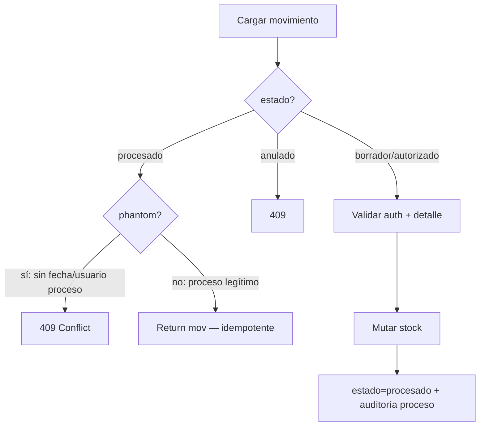

# INV-P0-006 — Diseño Técnico de Implementación

**ID:** INV-P0-006  
**Fecha:** 2026-06-12  
**Modo:** Implementación — **sin código en este documento**  
**Prerequisito:** Auditoría INV congelada; Fase 0 con ítems P0-001 a P0-006  
**Fuentes de código analizadas:**
- `app/modules/inv/application/services/movimiento_service.py`
- `app/modules/inv/application/services/inventario_fisico_service.py`
- `app/modules/inv/application/services/movimiento_proceso_service.py`
- `app/modules/inv/application/services/inventario_fisico_aprobacion_service.py` (consumidor interno)
- `app/modules/pur/application/services/recepcion_service.py` (consumidor interno)
- `app/infrastructure/database/queries/inv/movimiento_queries.py`
- `app/modules/inv/presentation/schemas.py` (BC-20)

**Objetivo:** Eliminar la posibilidad de crear o actualizar movimientos e inventarios físicos con estados de workflow inválidos o forjados por el cliente, **sin modificar contratos OpenAPI ni BD**.

---

## 1. Resumen del hallazgo

| Atributo | Valor |
|----------|-------|
| **Problema** | El body del cliente puede fijar `estado` y campos de proceso en CREATE/UPDATE. `procesar_movimiento` retorna OK si `estado=procesado` sin verificar que el stock fue mutado. |
| **Severidad** | P0 — integridad stock↔movimiento |
| **Riesgo** | R2 + R6 |
| **Estrategia** | Enforcement en capa **servicio** únicamente |
| **Excepción** | No admite excepción de negocio |

---

## 2. Archivos exactos a modificar

| # | Archivo | Acción |
|---|---------|--------|
| 1 | `app/modules/inv/application/services/inv_workflow_enforcement.py` | **CREAR** — helpers centralizados |
| 2 | `app/modules/inv/application/services/movimiento_service.py` | Modificar 4 funciones |
| 3 | `app/modules/inv/application/services/inventario_fisico_service.py` | Modificar 4 funciones |
| 4 | `app/modules/inv/application/services/movimiento_proceso_service.py` | Modificar 2 funciones |
| 5 | `tests/unit/test_movimiento_workflow_enforcement.py` | **CREAR** |

### Archivos explícitamente fuera de alcance

| Archivo | Motivo |
|---------|--------|
| `app/modules/inv/presentation/endpoints_*.py` | Sin cambio de contrato |
| `app/modules/inv/presentation/schemas.py` | BC-20 readonly formal queda para fase contratos |
| `app/infrastructure/database/queries/inv/*.py` | Payload ya viene saneado desde servicio |
| `movimiento_detalle_service.py` | Detalle standalone no tiene `estado` de cabecera |
| `inventario_fisico_detalle_service.py` | Ídem |
| `inventario_fisico_aprobacion_service.py` | Ya inserta `estado="borrador"` hardcoded (L231) |
| `pur/recepcion_service.py` | Ya usa `estado="borrador"` en `mov_data` (L197) |

---

## 3. Funciones exactas a modificar

### 3.1 Nuevo módulo `inv_workflow_enforcement.py`

| Función propuesta | Responsabilidad |
|-------------------|-----------------|
| `MOVIMIENTO_WORKFLOW_READONLY_CREATE` | Constante: frozenset de campos prohibidos en CREATE |
| `MOVIMIENTO_WORKFLOW_READONLY_UPDATE` | Constante: frozenset de campos prohibidos en UPDATE |
| `INVENTARIO_FISICO_WORKFLOW_READONLY_CREATE` | Constante |
| `INVENTARIO_FISICO_WORKFLOW_READONLY_UPDATE` | Constante |
| `sanitize_movimiento_create_payload(payload: dict) -> dict` | Forzar `estado=borrador`; eliminar campos proceso |
| `reject_movimiento_workflow_in_update(payload: dict) -> None` | Lanza `ValidationError` 422 si campos prohibidos presentes |
| `sanitize_inventario_fisico_create_payload(payload: dict) -> dict` | Forzar `estado=en_proceso`; eliminar campos cierre |
| `reject_inventario_fisico_workflow_in_update(payload: dict) -> None` | Lanza 422 si campos prohibidos presentes |
| `is_phantom_procesado(mov: dict) -> bool` | `estado=procesado` sin `fecha_procesado` o sin `usuario_procesado_id` |
| `is_phantom_autorizado(mov: dict) -> bool` | `estado=autorizado` sin `fecha_autorizacion` o sin `autorizado_por_usuario_id` |
| `assert_movimiento_procesable(mov: dict) -> None` | 409 si phantom procesado |
| `assert_movimiento_autorizable(mov: dict) -> None` | 409 si phantom autorizado |

### 3.2 `movimiento_service.py`

| Función | Punto de inyección |
|---------|-------------------|
| `create_movimiento_servicio` | Tras `model_dump()`, antes de `create_movimiento()` → `sanitize_movimiento_create_payload` |
| `create_movimiento_con_detalles_servicio` | Tras `model_dump(exclude={"detalles"})`, antes de `cab_payload.update(...)` → sanitize |
| `update_movimiento_servicio` | Tras `model_dump(exclude_unset=True)`, antes de `update_movimiento()` → `reject_movimiento_workflow_in_update` |
| `update_movimiento_con_detalles_servicio` | Tras `model_dump(exclude_unset=True, exclude={"detalles"})`, antes del UoW → reject |

### 3.3 `inventario_fisico_service.py`

| Función | Punto de inyección |
|---------|-------------------|
| `create_inventario_fisico_servicio` | Tras `model_dump()`, antes de `create_inventario_fisico()` → sanitize |
| `create_inventario_fisico_con_detalles_servicio` | Tras `model_dump(exclude={"detalles"})`, antes de `cab_payload.update(...)` → sanitize |
| `update_inventario_fisico_servicio` | Tras `model_dump(exclude_unset=True)`, antes de `update_inventario_fisico()` → reject |
| `update_inventario_fisico_con_detalles_servicio` | Tras `model_dump(exclude_unset=True, exclude={"detalles"})`, antes del UoW → reject |

### 3.4 `movimiento_proceso_service.py`

| Función | Punto de inyección |
|---------|-------------------|
| `procesar_movimiento_servicio` | Reemplazar bloque L104–106: si `estado==procesado"` → `assert_movimiento_procesable(mov)` antes de return; si phantom → 409, si legítimo → return (idempotencia OK) |
| `autorizar_movimiento_servicio` | Reemplazar bloque L325–327: si `estado==autorizado"` → `assert_movimiento_autorizable(mov)`; phantom → 409 |

---

## 4. Flujo actual de creación y actualización

### 4.1 Movimiento — CREATE (cabecera)

```
POST /movimientos
  → create_movimiento_servicio
    → model_dump() incluye estado del body (default schema "borrador", overrideable)
    → create_movimiento(payload) persiste tal cual
```

**Brecha:** Cliente envía `estado=procesado` → registro persistido sin pasar por `procesar_movimiento`.

### 4.2 Movimiento — CREATE (con-detalle)

```
POST /movimientos/con-detalle
  → create_movimiento_con_detalles_servicio
    → cab_payload = model_dump(exclude={"detalles"})  # incluye estado
    → insert InvMovimientoTable directo (UoW)
```

**Brecha:** Idéntica a 4.1; además totales se recalculan en servidor (correcto) pero `estado` no.

### 4.3 Movimiento — UPDATE

```
PUT /movimientos/{id}  [solo si estado_actual == borrador]
  → update_movimiento_servicio
    → payload = model_dump(exclude_unset=True)  # puede incluir estado=procesado
    → update_movimiento(payload)
```

**Brecha:** Documento en `borrador` puede saltar a `procesado`/`autorizado` vía PUT sin mutar stock.

### 4.4 Movimiento — UPDATE con-detalle

```
PUT /movimientos/{id}/con-detalle  [guard borrador]
  → update_movimiento_con_detalles_servicio
    → cab_payload puede incluir estado y campos proceso
```

**Brecha:** Igual a 4.3.

### 4.5 Movimiento — PROCESAR (idempotencia ciega)

```
POST /inv/{id}/procesar
  → procesar_movimiento_servicio
    → if estado == "procesado": return mov   # L105-106, sin validar stock
```

**Brecha:** Movimiento phantom `procesado` (forjado en CREATE) queda blindado permanentemente.

### 4.6 Inventario físico — CREATE

```
POST /inventario-fisico | POST .../con-detalle
  → create_inventario_fisico*_servicio
    → model_dump() incluye estado (default "en_proceso", overrideable a ajustado/finalizado)
    → insert / create_inventario_fisico
```

**Brecha:** Cliente puede crear IF ya `ajustado` sin pasar por aprobar.

### 4.7 Inventario físico — UPDATE

```
PUT /inventario-fisico/{id} | PUT .../con-detalle
  → _assert_editable_estado: bloquea solo ajustado/anulado
  → permite editar en en_proceso Y finalizado
  → payload puede incluir estado, movimiento_ajuste_id, fecha_ajuste, totales
```

**Brecha:** IF en `en_proceso` puede saltar a `finalizado` o `ajustado` vía PUT; IF en `finalizado` puede saltar a `ajustado` sin aprobar.

### 4.8 Consumidores internos (sin brecha)

| Consumidor | Patrón actual | ¿Afectado por cambio? |
|------------|---------------|----------------------|
| `inventario_fisico_aprobacion_service` | `insert` con `estado="borrador"` hardcoded | No |
| `pur/recepcion_service` | `create_movimiento` con `estado="borrador"` | No |
| `finalizar_inventario_fisico_servicio` | `update` interno `estado=finalizado` | No (no pasa por reject de API) |
| `anular_*_servicio` | `update` interno de estado | No |

---

## 5. Flujo objetivo

### 5.1 Movimiento — CREATE

```
POST → servicio
  → sanitize_movimiento_create_payload:
       estado = "borrador" (forzado)
       strip: autorizado_por_usuario_id, fecha_autorizacion,
              usuario_procesado_id, fecha_procesado, motivo_anulacion
  → persist
```

### 5.2 Movimiento — UPDATE (borrador)

```
PUT → servicio
  → guard estado_actual == borrador (existente)
  → reject_movimiento_workflow_in_update:
       si payload contiene estado o campos proceso → ValidationError 422
  → persist solo campos de negocio
```

### 5.3 Movimiento — PROCESAR

```
POST procesar
  → if estado == "procesado":
       if is_phantom_procesado(mov) → HTTP 409
       else → return mov (idempotencia legítima)
  → flujo normal → muta stock → estado=procesado + fecha + usuario
```

### 5.4 Movimiento — AUTORIZAR

```
POST autorizar
  → if estado == "autorizado":
       if is_phantom_autorizado(mov) → HTTP 409
       else → return mov (idempotencia legítima)
  → flujo normal
```

### 5.5 Inventario físico — CREATE

```
POST → servicio
  → sanitize_inventario_fisico_create_payload:
       estado = "en_proceso" (forzado)
       strip: movimiento_ajuste_id, fecha_finalizacion, fecha_ajuste,
              total_productos_contados, total_diferencias, valor_diferencias
  → persist
```

### 5.6 Inventario físico — UPDATE

```
PUT → servicio
  → _assert_editable_estado (existente: bloquea ajustado/anulado)
  → reject_inventario_fisico_workflow_in_update:
       si payload contiene estado o campos cierre → ValidationError 422
  → persist
```

### 5.7 Diagrama de decisión — `procesar_movimiento`



---

## 6. Validaciones servidor requeridas

### 6.1 Campos prohibidos en WRITE — Movimiento

| Campo | CREATE | UPDATE | Motivo |
|-------|:------:|:------:|--------|
| `estado` | Forzar `borrador` | Rechazar | Solo transiciones POST proceso |
| `autorizado_por_usuario_id` | Strip | Rechazar | Solo `autorizar_movimiento` |
| `fecha_autorizacion` | Strip | Rechazar | Ídem |
| `usuario_procesado_id` | Strip | Rechazar | Solo `procesar_movimiento` |
| `fecha_procesado` | Strip | Rechazar | Ídem |
| `motivo_anulacion` | Strip | Rechazar | Solo `anular_movimiento` |

**Nota:** `total_items`, `total_cantidad`, `total_costo` en CREATE cabecera suelta son derivados pero el servicio con-detalle ya los recalcula. **Fuera de alcance P0-006** — no bloquear en esta etapa.

### 6.2 Campos prohibidos en WRITE — Inventario físico

| Campo | CREATE | UPDATE | Motivo |
|-------|:------:|:------:|--------|
| `estado` | Forzar `en_proceso` | Rechazar | Solo finalizar/anular/aprobar |
| `movimiento_ajuste_id` | Strip | Rechazar | Solo aprobar |
| `fecha_finalizacion` | Strip | Rechazar | Solo finalizar |
| `fecha_ajuste` | Strip | Rechazar | Solo aprobar |
| `total_productos_contados` | Strip | Rechazar | Derivado (C) |
| `total_diferencias` | Strip | Rechazar | Derivado (C) |
| `valor_diferencias` | Strip | Rechazar | Derivado (C) |

### 6.3 Detección phantom — Movimiento procesado

Condición **phantom** (409):

```text
lower(estado) == "procesado"
AND (fecha_procesado IS NULL OR usuario_procesado_id IS NULL)
```

Condición **legítimo idempotente** (200, return sin mutar):

```text
lower(estado) == "procesado"
AND fecha_procesado IS NOT NULL
AND usuario_procesado_id IS NOT NULL
```

### 6.4 Detección phantom — Movimiento autorizado

```text
phantom autorizado :=
  lower(estado) == "autorizado"
  AND (fecha_autorizacion IS NULL OR autorizado_por_usuario_id IS NULL)
```

### 6.5 Códigos HTTP y mensajes

| Caso | Código | Clase excepción | Mensaje sugerido |
|------|--------|-----------------|------------------|
| UPDATE con `estado` en body | 422 | `ValidationError` | `El campo 'estado' no es editable. Use los endpoints de proceso.` |
| UPDATE con campo proceso | 422 | `ValidationError` | `El campo '[nombre]' solo se asigna vía workflow de proceso.` |
| Phantom procesado en `procesar` | 409 | `HTTPException` / `ConflictError` | `Movimiento marcado como procesado sin evidencia de proceso. Estado inconsistente.` |
| Phantom autorizado en `autorizar` | 409 | Ídem | `Movimiento marcado como autorizado sin evidencia de autorización.` |

**Convención:** Usar `ValidationError` (422) para campos write prohibidos; `ConflictError` (409) para estado inconsistente en proceso — alineado a `app/core/exceptions.py`.

### 6.6 Fuera de alcance P0-006 (no implementar ahora)

- `requiere_autorizacion` forgeable en CREATE (bypass de tipo que exige auth)
- Readonly formal de schemas (BC-20)
- Validación de `estado_conteo` en detalle IF
- Script de reparación de datos phantom históricos en BD

---

## 7. Impacto en contratos API

| Aspecto | Impacto |
|---------|---------|
| OpenAPI schemas | **Sin cambio** — campos siguen visibles en Create/Update |
| Request body | Cliente puede seguir **enviando** `estado`; servidor **ignora/rechaza** |
| Response body | Sin cambio — `estado` en Read refleja valor real persistido |
| Códigos HTTP nuevos | 422 en UPDATE con campos prohibidos (antes se aceptaba silenciosamente) |
| Breaking change | **Bajo** — solo afecta clientes que forjaban estados (anti-patrón) |
| BC-20 | Cerrado funcionalmente en Fase 0; readonly en schema queda para fase contratos |

---

## 8. Impacto en servicios internos

| Servicio | Impacto |
|----------|---------|
| `inventario_fisico_aprobacion_service` | **Ninguno** — insert directo con `estado="borrador"` |
| `pur/recepcion_service` | **Ninguno** — `create_movimiento` con `borrador` explícito |
| `movimiento_proceso_service.anular` | **Ninguno** — ya setea estado vía update interno |
| `inventario_fisico_service.finalizar` | **Ninguno** — update interno `estado=finalizado` |
| `inventario_fisico_service.anular` | **Ninguno** — update interno |
| Futuro P0-001 `procesar` con costo | **Beneficiario** — phantom bloqueado antes de costeo |

---

## 9. Impacto en tests existentes

| Archivo | Impacto esperado |
|---------|------------------|
| `test_inv_company_isolation.py` | **Sin cambio** — mocks no envían estado forjado en create |
| `test_inventario_fisico_aprobacion.py` | **Sin cambio** — mocks de estado en row, no en create servicio |
| `test_inventario_fisico_finalizar_f4.py` | **Sin cambio** — usa `finalizar_inventario_fisico_servicio` |
| `test_inventario_fisico_update_con_detalle.py` | **Verificar** — si payload incluye `estado`, ajustar test o confirmar que no lo envía |
| `test_autorizar_movimiento_passes_empresa_to_update` | **Sin cambio** — mock `estado=borrador` |
| `test_procesar_validates_producto_empresa_before_stock` | **Sin cambio** — mock `estado=borrador` |

**Acción post-implementación:** ejecutar suite INV completa; ningún test existente debería fallar si no forjaba estados en body.

---

## 10. Nuevos tests requeridos

**Archivo:** `tests/unit/test_movimiento_workflow_enforcement.py`

### 10.1 Tests de helpers (unitarios puros)

| ID | Caso |
|----|------|
| T-01 | `sanitize_movimiento_create_payload` fuerza `borrador` aunque input `procesado` |
| T-02 | sanitize elimina `usuario_procesado_id`, `fecha_procesado`, etc. |
| T-03 | `reject_movimiento_workflow_in_update` lanza 422 si `estado` presente |
| T-04 | `is_phantom_procesado` true sin `fecha_procesado` |
| T-05 | `is_phantom_procesado` false con fecha + usuario |
| T-06 | `sanitize_inventario_fisico_create_payload` fuerza `en_proceso` |
| T-07 | `reject_inventario_fisico_workflow_in_update` rechaza `movimiento_ajuste_id` |

### 10.2 Tests de servicio (integración ligera con mocks)

| ID | Caso |
|----|------|
| T-10 | `create_movimiento_servicio` con `MovimientoCreate(estado="procesado")` → Read `estado=borrador` |
| T-11 | `update_movimiento_servicio` con `MovimientoUpdate(estado="procesado")` → 422 |
| T-12 | `create_movimiento_con_detalles_servicio` con estado forjado → borrador |
| T-13 | `procesar_movimiento_servicio` con mov phantom `procesado` → 409 |
| T-14 | `procesar_movimiento_servicio` con mov legítimo `procesado` + fecha + usuario → return sin error |
| T-15 | `autorizar_movimiento_servicio` con phantom `autorizado` → 409 |
| T-16 | `create_inventario_fisico_servicio` con `estado=ajustado` → `en_proceso` |
| T-17 | `update_inventario_fisico_servicio` con `estado=finalizado` en body → 422 |
| T-18 | `update_inventario_fisico_con_detalles_servicio` con `movimiento_ajuste_id` → 422 |

### 10.3 Cobertura mínima obligatoria para cerrar P0-006

- T-01, T-03, T-10, T-11, T-13, T-16, T-17 (7 casos mínimos)

---

## 11. Riesgos de regresión

| Riesgo | Prob. | Impacto | Mitigación |
|--------|-------|---------|------------|
| Cliente enviaba `estado` en create esperando que se respetara | Baja | Medio | Documentar; servidor siempre fuerza inicial |
| Datos phantom históricos en BD | Media | Alto | Script diagnóstico pre-deploy; 409 expone casos |
| `procesar` legítimo segunda llamada deja de ser idempotente | Baja | Alto | Criterio phantom exige fecha+usuario; procesados reales pasan |
| PUR/IF internos rotos | Muy baja | Alto | Ya usan borrador hardcoded; test regresión aprobación |
| UPDATE rechaza campo que antes se ignoraba silenciosamente | Media | Bajo | 422 explícito — comportamiento más correcto |
| `ValidationError` vs `HTTPException` inconsistente en endpoints | Baja | Bajo | Endpoints ya mapean `ValidationError`; verificar IF endpoints |

---

## 12. Estrategia de implementación incremental

### Etapa 1 — Helpers (sin wiring)

**Entregable:** `inv_workflow_enforcement.py` + tests T-01 a T-07  
**Riesgo:** Nulo — sin efecto en runtime  
**Validación:** `pytest tests/unit/test_movimiento_workflow_enforcement.py -k helper`

### Etapa 2 — Movimiento CREATE

**Archivos:** `movimiento_service.py` — `create_movimiento_servicio`, `create_movimiento_con_detalles_servicio`  
**Tests:** T-10, T-12  
**Validación:** POST con body `estado=procesado` → GET retorna `borrador`

### Etapa 3 — Movimiento UPDATE

**Archivos:** `movimiento_service.py` — `update_*`  
**Tests:** T-11  
**Validación:** PUT con `estado` en body → 422

### Etapa 4 — Proceso movimiento (phantom)

**Archivos:** `movimiento_proceso_service.py` — `procesar`, `autorizar`  
**Tests:** T-13, T-14, T-15  
**Validación:** phantom → 409; legítimo → idempotente OK

### Etapa 5 — Inventario físico CREATE/UPDATE

**Archivos:** `inventario_fisico_service.py` — 4 funciones  
**Tests:** T-16, T-17, T-18  
**Validación:** CREATE `ajustado` → `en_proceso`; PUT `estado` → 422

### Etapa 6 — Regresión completa

**Comando:** `pytest tests/unit/test_inv_company_isolation.py tests/unit/test_inventario_fisico_*.py tests/unit/test_movimiento_workflow_enforcement.py`  
**Gate:** 100% verde antes de marcar P0-006 cerrado

```
Etapa 1 ──► Etapa 2 ──► Etapa 3 ──► Etapa 4
                │                      │
                └──── Etapa 5 ◄───────┘
                         │
                    Etapa 6 (regresión)
```

**Orden recomendado:** 1 → 2 → 3 → 4 → 5 → 6 (Etapa 5 puede paralelizarse con 3–4).

---

## 13. Checklist de validación post-implementación

### 13.1 Funcional — Movimiento

- [ ] POST `/movimientos` con `estado=procesado` → response `estado=borrador`
- [ ] POST `/movimientos/con-detalle` ídem
- [ ] PUT `/movimientos/{id}` con `estado=autorizado` en borrador → 422
- [ ] PUT sin campo `estado` en borrador → 200 (sin regresión)
- [ ] POST `/inv/{id}/procesar` en movimiento phantom → 409
- [ ] POST procesar en movimiento ya procesado legítimamente → 200 idempotente
- [ ] POST autorizar en phantom `autorizado` → 409
- [ ] Flujo completo: crear → procesar → stock mutado + `fecha_procesado` poblado

### 13.2 Funcional — Inventario físico

- [ ] POST `/inventario-fisico` con `estado=ajustado` → `en_proceso`
- [ ] POST `/inventario-fisico/con-detalle` ídem
- [ ] PUT con `estado=finalizado` → 422
- [ ] PUT con `movimiento_ajuste_id` → 422
- [ ] PUT con solo `descripcion` en `en_proceso` → 200
- [ ] POST `finalizar` → sigue funcionando (transición interna)
- [ ] POST `aprobar` → sigue funcionando (cadena completa)

### 13.3 Integridad

- [ ] PUR recepción procesada → movimiento `borrador` → `procesado` sin 409 phantom
- [ ] IF aprobar → movimiento ajuste `borrador` → procesar OK
- [ ] No hay regresión en `test_inv_company_isolation.py`

### 13.4 No-regresión de contrato

- [ ] OpenAPI sin cambios (`deprecated` flags intactos)
- [ ] Schemas Create/Update sin modificación
- [ ] Campos `estado` siguen en response Read

### 13.5 Cierre P0-006

- [ ] Tests T-01 a T-18 (mínimo T-01,03,10,11,13,16,17) en verde
- [ ] Etapas 1–6 completadas
- [ ] Sin datos phantom nuevos creados post-deploy en smoke test

---

## 14. Orden definitivo P0 (contexto)

INV-P0-006 es **paso 1** del plan Fase 0:

```
0. Decisiones negocio (D7: estados solo vía proceso)
1. INV-P0-006 ← este documento
2. INV-P0-004
3. INV-P0-001 + INV-P0-005
4. INV-P0-002
5. INV-P0-003
```

---

## 15. Referencias

| Documento | Sección |
|-----------|---------|
| `INV_PLAN_CORRECCION.md` | §3.1 INV-P0-006 |
| `INV_PLAN_IMPLEMENTACION_P0.md` | §7 |
| `INV_AUDITORIA_CONTRATOS_API.md` | BC-20 |
| `app/core/exceptions.py` | `ValidationError`, `ConflictError` |

---

*Documento listo para ejecución por etapas 1–6. No autoriza cambios de BD, OpenAPI ni módulos fuera de INV-P0-006.*
