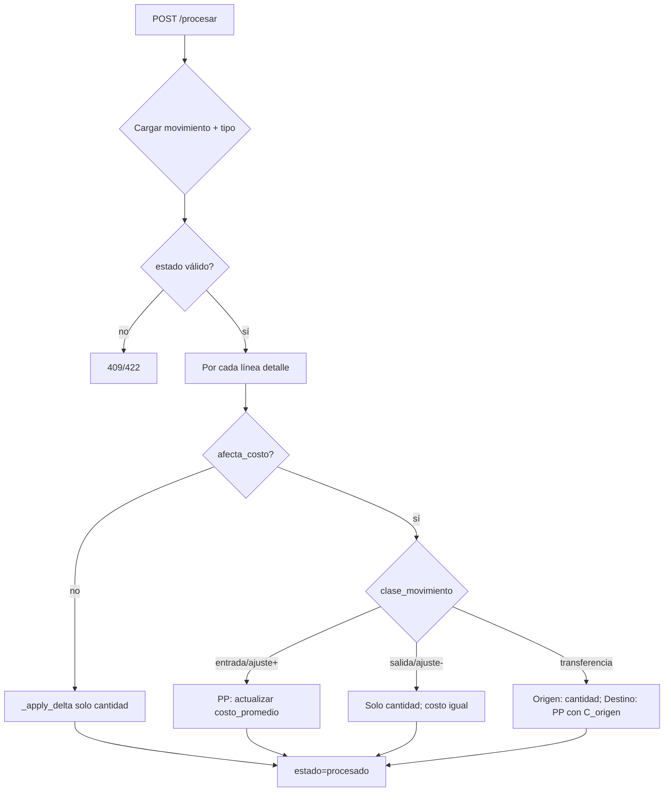

# INV — Plan Técnico de Implementación Fase 0 (P0)

**Fecha:** 2026-06-12 (rev. P0-006: 2026-06-12)  
**Estado:** Diseño técnico — **sin implementación**  
**Fuentes:**
- `app/docs/auditoria/INV_PLAN_CORRECCION.md` (hallazgos P0, incl. INV-P0-006)
- `app/docs/auditoria/INV_AUDITORIA_PERSISTENCIA.md`
- `app/docs/auditoria/INV_AUDITORIA_CONTRATOS_API.md` (BC-20 → P0-006)
- `app/docs/arquitectura/ERP_MAPA_DEPENDENCIAS.md`

**Objetivo:** Plan técnico ejecutable para cerrar **Fase 0** antes de la auditoría de contratos API.

**Restricciones de este documento:**
- No genera código, parches, cambios de BD ni de contratos API.
- No elimina campos de BD ni endpoints.
- Solo diseño técnico, estrategia de migración segura y criterios de validación.

---

## 1. Resumen ejecutivo

| ID | Hallazgo | Esfuerzo relativo | Orden impl. |
|----|----------|-------------------|-------------|
| INV-P0-006 | Estado workflow forgeable | Bajo–Medio | **0** (prerequisito) |
| INV-P0-004 | Auditoría usuario en CRUD | Medio | **1** |
| INV-P0-001 | Costo stock al procesar | Alto | **2** (con P0-005) |
| INV-P0-005 | `afecta_costo` sin efecto | — | **2** (mismo cambio) |
| INV-P0-002 | Stock derivado escribible | Bajo–Medio | **3** |
| INV-P0-003 | Sin reversión procesados | Medio–Alto | **4** (mínimo: política; opcional: estorno) |

**Criterio de cierre Fase 0:** Los **seis** ítems P0 resueltos **o** con excepción documentada y aceptada (aplica a P0-003 si solo se entrega política + diseño de estorno sin endpoint). **INV-P0-006 no admite excepción** — prerequisito de integridad stock↔movimiento.

---

## 2. INV-P0-001 — Costo de stock ignorado al procesar movimiento

### 2.1 Estado actual

- `procesar_movimiento_servicio` en `movimiento_proceso_service.py` aplica delta de cantidad en `inv_stock.cantidad_actual` según `clase_movimiento` del tipo.
- Función interna `_apply_delta` crea stock nuevo con `costo_promedio=0` o actualiza solo `cantidad_actual` y `fecha_ultimo_movimiento`.
- `inv_movimiento_detalle.costo_unitario` se persiste en alta de movimiento pero **no participa** del cálculo de stock.
- `inv_tipo_movimiento.afecta_costo` existe en BD y schemas pero **no se lee** en el proceso.
- Impacto cascada: `valor_total` (PERSISTED) = 0; kardex con costo en detalle pero stock sin valorización; aprobación IF genera ajustes sin reflejo en costo de stock.

### 2.2 Estado objetivo

- Al procesar un movimiento, si `afecta_costo = 1` (ver P0-005), recalcular `inv_stock.costo_promedio` según regla de **promedio ponderado móvil** (MVP Fase 0).
- Si `afecta_costo = 0`, comportamiento actual de cantidad se mantiene; costo de stock no cambia.
- Alta automática de fila stock (primera entrada): `costo_promedio` = `costo_unitario` de la línea (o 0 si línea sin costo y política lo permite).
- Salidas y transferencias: cantidad se reduce en origen; costo unitario del stock **no cambia** en salida (estándar promedio).
- Transferencias: destino incrementa cantidad y recalcula promedio usando el `costo_promedio` del origen como costo de la unidad transferida.
- Ajustes con cantidad positiva: como entrada; negativa: como salida (sin alterar costo unitario salvo entradas).
- Transacción única: cantidad + costo en el mismo `unit_of_work` que ya usa `procesar_movimiento`.

#### Regla de negocio MVP (promedio ponderado)

| Clase | Efecto cantidad | Efecto `costo_promedio` (si `afecta_costo`) |
|-------|-----------------|---------------------------------------------|
| `entrada` | +δ en destino | PP: `(Q·C + δ·cu) / (Q+δ)` |
| `salida` | −δ en origen | C sin cambio |
| `transferencia` | −δ origen, +δ destino | Origen: C sin cambio; Destino: PP con `cu = C_origen` |
| `ajuste` | ±δ en almacén target | δ>0: como entrada; δ<0: como salida |

Donde: Q = `cantidad_actual` antes del delta, C = `costo_promedio` actual, cu = `costo_unitario` del detalle (por línea; si múltiples líneas mismo producto×almacén, procesar línea a línea acumulando).

**Fuera de alcance Fase 0:** FIFO, LIFO, `metodo_costeo` por producto (reservado CST), actualización de `inv_producto.costo_promedio` (sincronización maestro).

### 2.3 Archivos potencialmente afectados

| Archivo | Rol |
|---------|-----|
| `app/modules/inv/application/services/movimiento_proceso_service.py` | **Principal** — lógica `_apply_delta` y lectura de tipo |
| `app/infrastructure/database/queries/inv/stock_queries.py` | Posible extracción de update stock (opcional) |
| `app/infrastructure/database/tables_erp/tables_inv.py` | Referencia; sin cambio BD |
| `app/modules/inv/application/services/inventario_fisico_aprobacion_service.py` | Consumidor indirecto vía `procesar_movimiento` |
| `tests/unit/test_movimiento_proceso_costo.py` | **Nuevo** — casos de costeo |

### 2.4 Servicios afectados

| Servicio | Cambio |
|----------|--------|
| `procesar_movimiento_servicio` | Extender `_apply_delta` con rama costo |
| `aprobar_inventario_fisico_servicio` | Sin cambio directo; validar integración |
| Futuro: `pur/recepcion_service` | Beneficiario al procesar recepciones |

### 2.5 Tablas afectadas

| Tabla | Columnas escritas al procesar |
|-------|------------------------------|
| `inv_stock` | `cantidad_actual`, `costo_promedio`, `fecha_ultimo_movimiento`, `fecha_actualizacion` |
| `inv_movimiento` | Sin cambio adicional (estado ya se actualiza) |
| `inv_movimiento_detalle` | Solo lectura (`costo_unitario`, `cantidad_base`) |
| `inv_tipo_movimiento` | Solo lectura (`afecta_costo`, `clase_movimiento`) |

### 2.6 Contratos posiblemente afectados

| Contrato | Impacto |
|----------|---------|
| `POST /movimientos/{id}/procesar` | Response `StockRead` indirecto vía consultas posteriores — `costo_promedio` y `valor_total` dejarán de ser 0 |
| `StockRead` | Sin cambio de schema; datos más completos |
| `MovimientoDetalleCreate` | Sin cambio; refuerza necesidad de `costo_unitario` en entradas |

> Pendiente de auditoría de contratos: si `costo_unitario` debe ser obligatorio en entradas cuando `afecta_costo=1`.

### 2.7 Riesgos de regresión

| Riesgo | Mitigación |
|--------|------------|
| Stock existente con `costo_promedio=0` distorsiona primer PP | Script de diagnóstico pre-deploy; primer movimiento entrada con costo corrige |
| Múltiples líneas mismo producto en un movimiento | Procesar secuencialmente línea a línea (orden `fecha_creacion`) |
| División por cero si Q+δ=0 | Guard: no recalcular PP si cantidad resultante ≤ 0 |
| Decimales / redondeo | Usar `Decimal`; política de redondeo a 4 decimales (alineado BD) |
| Tests existentes de aislamiento empresa | Re-ejecutar `test_inv_company_isolation.py` |

### 2.8 Dependencias con módulos futuros

| Módulo | Relación |
|--------|----------|
| **CST** | Fuente canónica futura de `metodo_costeo`; Fase 0 fija PP como default |
| **FIN** | Valorización de inventario en asientos depende de `costo_promedio` correcto |
| **PUR** | Recepciones con `precio_unitario` alimentarán PP |
| **PRC** | Sin impacto directo |

### 2.9 Estrategia de migración segura

1. **Especificar** regla PP en documento de negocio (este apartado) y validar con stakeholders.
2. **Implementar** solo en `procesar_movimiento` — sin tocar POST stock deprecated (P0-002).
3. **No migrar datos históricos** en Fase 0; costo 0 permanece hasta próximo movimiento con costo.
4. **Feature flag opcional** `INV_COSTEO_EN_PROCESAR=true` (config) para rollback sin revertir código.
5. **Desplegar** en entorno de prueba; validar con movimiento entrada → consulta stock → kardex.

### 2.10 Orden de implementación (dentro de P0-001)

1. Leer `afecta_costo` del tipo (P0-005).
2. Refactorizar `_apply_delta` con parámetros `(delta_qty, costo_unitario, afecta_costo, clase)`.
3. Implementar PP entrada/ajuste+.
4. Implementar salida/ajuste− (solo cantidad).
5. Implementar transferencia (costo origen → destino).
6. Tests unitarios por clase de movimiento.
7. Test integración con `aprobar_inventario_fisico` (costo en detalle IF).

---

## 3. INV-P0-002 — Tabla derivada `inv_stock` mutable fuera del workflow

### 3.1 Estado actual

- `inv_stock` es tabla **derivada** por diseño arquitectónico (actualizada por movimientos procesados).
- `POST /inv/stock` y `PUT /inv/stock/{id}` existen con `deprecated=True` en OpenAPI.
- `create_stock_servicio` / `update_stock_servicio` ejecutan INSERT/UPDATE directo vía `stock_queries`.
- Permisos RBAC activos: `inv.stock.crear`, `inv.stock.actualizar` (seed `S041__permisos_rbac_inv-fase4.sql`).
- Riesgo: cliente o script puede desincronizar stock vs. kardex.

### 3.2 Estado objetivo

- **Política explícita:** escritura externa de `inv_stock` prohibida en runtime de producción.
- **MVP Fase 0:** rechazar escrituras en capa de servicio (o endpoint) con error de negocio claro (`409` o `403`), manteniendo endpoints deprecated visibles para compatibilidad.
- Lecturas (`GET`, alertas) sin cambios.
- Escritura interna solo vía `procesar_movimiento` (y futuros integradores PUR/SLS con movimiento).
- Documentar excepción: bootstrap inicial de tenant (si existe) debe usar movimiento de apertura, no POST stock.

**No objetivo Fase 0:** eliminar endpoints, revocar permisos RBAC, ni breaking change en OpenAPI.

### 3.3 Archivos potencialmente afectados

| Archivo | Rol |
|---------|-----|
| `app/modules/inv/application/services/stock_service.py` | Guard en `create_*` / `update_*` |
| `app/modules/inv/presentation/endpoints_stock.py` | Opcional: mensaje HTTP explícito |
| `app/core/config.py` | Flag `INV_ALLOW_STOCK_DIRECT_WRITE` (default `false`) |
| `app/bootstrap_v2/02_catalog/permisos_rbac/S041__*.sql` | **No modificar** en Fase 0; anotar para auditoría contratos |
| `scripts/` bootstrap tenant | Verificar que no usen POST stock |

### 3.4 Servicios afectados

| Servicio | Cambio |
|----------|--------|
| `create_stock_servicio` | Retornar `ConflictError` o `AuthorizationError` si política activa |
| `update_stock_servicio` | Ídem |
| `procesar_movimiento_servicio` | Sin bloqueo — única vía legítima de mutación |

### 3.5 Tablas afectadas

| Tabla | Impacto |
|-------|---------|
| `inv_stock` | Solo mutación vía proceso interno |

### 3.6 Contratos posiblemente afectados

| Contrato | Impacto |
|----------|---------|
| `POST /inv/stock` | Sigue existiendo; respuesta pasa de `201` a `409/403` bajo política |
| `PUT /inv/stock/{id}` | Ídem |
| `StockCreate` / `StockUpdate` | Sin cambio de schema en Fase 0 |

> **Pendiente de auditoría de contratos (BC-05, BC-06):** confirmar consumidores antes de endurecer a `410 Gone`.

### 3.7 Riesgos de regresión

| Riesgo | Mitigación |
|--------|------------|
| Frontend o scripts usan POST stock | Inventario de consumidores pre-deploy; flag temporal `INV_ALLOW_STOCK_DIRECT_WRITE=true` en dev |
| Bootstrap histórico depende de POST stock | Auditar `minimal_erp_tenant_bootstrap` y seeds |
| Tests que crean stock directo | Actualizar tests para usar movimiento de apertura |

### 3.8 Dependencias con módulos futuros

| Módulo | Relación |
|--------|----------|
| **PUR** | Entrada solo vía `pur_recepcion` → movimiento |
| **SLS** | Salida solo vía pedido → movimiento |
| **Todos** | Confían en stock derivado consistente |

### 3.9 Estrategia de migración segura

```
Fase 0a — Política documentada (este plan)
Fase 0b — Flag default false + log warning si intento write
Fase 0c — Monitoreo 2 semanas (logs de intentos bloqueados)
Fase 1 contratos — Deprecación formal / 410 si cero consumidores
```

- **No revocar permisos** hasta auditoría de contratos.
- Entornos `dev`/`staging`: flag `true` temporal si hay dependencias descubiertas.

### 3.10 Orden de implementación

1. Auditar logs y código de consumo POST/PUT stock (manual).
2. Añadir guard en `stock_service` con flag de config.
3. Actualizar tests: expectativa de rechazo.
4. Comunicar a equipo frontend (sin cambiar contrato aún).

---

## 4. INV-P0-003 — Sin estrategia de reversión para movimientos procesados

### 4.1 Estado actual

- `anular_movimiento_servicio` permite anular solo si `estado != procesado`.
- Movimiento `procesado` tiene stock ya mutado; anulación devuelve `409 Conflict`.
- No existe endpoint `revertir`, `estornar` ni movimiento compensatorio automático.
- `motivo_anulacion` solo se usa en anulación pre-proceso.
- PUR y otros módulos futuros enlazarán `movimiento_inventario_id` — reversión será requisito operativo.

### 4.2 Estado objetivo

**Mínimo Fase 0 (obligatorio):** política de negocio documentada y diseño técnico del estorno.

**Objetivo funcional recomendado (implementación Fase 0 extendida):**

- Nuevo flujo **Estornar movimiento procesado** que:
  1. Valida `estado = procesado` y que no esté ya estornado.
  2. Crea movimiento **compensatorio** (tipo estorno o mismo tipo con referencia).
  3. Enlaza `documento_referencia_tipo = 'movimiento_estorno'`, `documento_referencia_id = movimiento_original_id`.
  4. Procesa compensatorio en el mismo UoW (revierte cantidad y costo con reglas inversas de P0-001).
  5. Marca original como `anulado` **o** nuevo estado `estornado` (decisión de negocio — ver abajo).

#### Decisión de negocio requerida (pre-implementación)

| Opción | Pros | Contras |
|--------|------|---------|
| **A) Estado `estornado` en original** | Trazabilidad clara | Nuevo valor de estado en modelo |
| **B) Original → `anulado` + mov compensatorio** | Reutiliza estado existente | `anulado` después de `procesado` rompe semántica actual |
| **C) Solo mov compensatorio; original intacto** | Auditoría completa | Dos movimientos “activos” confusos en UI |

**Recomendación diseño:** Opción **A** o **B con flag** `es_estorno` en cabecera; no modificar BD en Fase 0 — usar `motivo_anulacion` + referencia documental si no hay migración de estados.

### 4.3 Archivos potencialmente afectados

| Archivo | Rol |
|---------|-----|
| `app/modules/inv/application/services/movimiento_proceso_service.py` | `estornar_movimiento_servicio` (nuevo) |
| `app/modules/inv/presentation/endpoints_movimientos_proceso.py` | `POST /{id}/estornar` (nuevo) |
| `app/modules/inv/presentation/schemas_proceso.py` | `MotivoEstorno` (nuevo schema proceso) |
| `app/modules/inv/application/services/movimiento_service.py` | Crear cabecera+detalle espejo |
| `app/infrastructure/database/queries/inv/movimiento_queries.py` | Consultas por referencia |
| `app/bootstrap_v2/02_catalog/permisos_rbac/` | Nuevo permiso `inv.movimiento.estornar` (futuro) |

### 4.4 Servicios afectados

| Servicio | Cambio |
|----------|--------|
| `anular_movimiento_servicio` | Sin cambio o mensaje que redirija a estornar |
| `estornar_movimiento_servicio` | **Nuevo** |
| `procesar_movimiento_servicio` | Lógica inversa reutilizada o delta negativo del original |

### 4.5 Tablas afectadas

| Tabla | Impacto |
|-------|---------|
| `inv_movimiento` | Nuevo movimiento + actualización estado original |
| `inv_movimiento_detalle` | Líneas espejo (cantidades opuestas) |
| `inv_stock` | Reversión cantidad y costo (PP inverso limitado — ver riesgo) |

### 4.6 Contratos posiblemente afectados

| Contrato | Impacto |
|----------|---------|
| `POST /movimientos/{id}/anular` | Documentar que no aplica a `procesado` |
| `POST /movimientos/{id}/estornar` | **Nuevo** — pendiente auditoría de contratos |
| `MotivoAnulacion` | Reutilizar o extender |

### 4.7 Riesgos de regresión

| Riesgo | Mitigación |
|--------|------------|
| Reversión de costo PP matemáticamente imperfecta | Documentar limitación; estorno como movimiento inverso, no “deshacer” histórico |
| Doble estorno | Idempotencia: rechazar si ya existe compensatorio |
| Estorno parcial | Fuera de alcance Fase 0 — solo estorno total |
| FIN futuro: asientos duplicados | `documento_referencia_*` para enlace contable |

### 4.8 Dependencias con módulos futuros

| Módulo | Relación |
|--------|----------|
| **FIN** | Asiento reverso del asiento original |
| **PUR** | Anular recepción procesada requiere estorno de movimiento |
| **AUD** | Registro de quién estornó |

### 4.9 Estrategia de migración segura

**Fase 0 mínima (cierra gate si negocio acepta):**

1. Publicar política: “Movimiento procesado no se anula; se estorna con movimiento compensatorio”.
2. Entregar diseño de endpoint y diagrama de estados (abajo).
3. Mensaje mejorado en `anular` cuando `estado=procesado` con hint `usar estornar`.

**Fase 0 extendida (recomendada):**

4. Implementar `estornar` tras P0-001 (costo reversible).
5. Permiso RBAC `inv.movimiento.estornar`.
6. Tests: entrada → procesar → estornar → stock inicial.

```
procesado ──estornar──► [mov. compensatorio procesado] + original marcado
```

### 4.10 Orden de implementación

1. Decisión de negocio A/B/C (workshop).
2. Documento de política (1 página).
3. **Después de P0-001** — implementar estorno con lógica de costo.
4. Permiso y endpoint.
5. Tests E2E flujo estorno.

---

## 5. INV-P0-004 — Auditoría de usuario no poblada

### 5.1 Estado actual

- Campos `usuario_creacion_id` en tablas maestras y documentos INV; `usuario_actualizacion_id` solo en `inv_producto`.
- Servicios `create_*` / `update_*` hacen `model_dump()` → query sin inyectar usuario de sesión.
- Endpoints tienen `current_user.usuario_id` disponible pero **no lo pasan** a servicios (patrón: solo `client_id`).
- Excepciones parciales:
  - `procesar_movimiento`: `usuario_procesado_id` ✓
  - `autorizar_movimiento`: `autorizado_por_usuario_id` ✓
  - `aprobar_inventario_fisico`: `usuario_creacion_id` en movimiento generado ✓
- Referencia positiva en otro módulo: `pur/recepcion_service.py` asigna `usuario_creacion_id` al crear movimiento.
- ORG no implementa el patrón aún — INV puede ser **piloto**.

### 5.2 Estado objetivo

- **CREATE:** `usuario_creacion_id = current_user.usuario_id` en todas las altas INV de maestros y documentos.
- **UPDATE:** `usuario_actualizacion_id = current_user.usuario_id` donde la columna exista (`inv_producto`); en tablas sin columna de actualización, solo `fecha_actualizacion` (ya automática en queries).
- Usuario **nunca** viene del body del cliente.
- Campos Read ya expuestos en schemas — comenzarán a retornar valores reales.
- Servicios internos sin sesión (llamadas desde otros módulos) reciben `usuario_id` explícito como parámetro opcional.

### 5.3 Archivos potencialmente afectados

**Servicios (inyección `usuario_id`):**

| Archivo |
|---------|
| `categoria_service.py` |
| `unidad_medida_service.py` |
| `producto_service.py` |
| `almacen_service.py` |
| `tipo_movimiento_service.py` |
| `movimiento_service.py` |
| `inventario_fisico_service.py` |
| `movimiento_detalle_service.py` (deprecated standalone) |
| `inventario_fisico_detalle_service.py` (deprecated standalone) |

**Endpoints (pasar `current_user.usuario_id`):**

| Archivo |
|---------|
| `endpoints_categorias.py` |
| `endpoints_unidades_medida.py` |
| `endpoints_productos.py` |
| `endpoints_almacenes.py` |
| `endpoints_tipos_movimiento.py` |
| `endpoints_movimientos.py` |
| `endpoints_inventario_fisico.py` |
| `endpoints_movimientos_detalle.py` |
| `endpoints_inventario_fisico_detalle.py` |

**Queries:** Sin cambio estructural — payload dinámico ya acepta `usuario_creacion_id` si viene en `data`.

### 5.4 Servicios afectados

18 funciones `create_*` y `update_*` en módulo INV (ver lista §5.3). Patrón unificado:

```
create_*_servicio(client_id, data, usuario_id=None)
  → payload["usuario_creacion_id"] = usuario_id

update_*_servicio(client_id, id, data, usuario_id=None)
  → payload["usuario_actualizacion_id"] = usuario_id  # solo producto
```

### 5.5 Tablas afectadas

| Tabla | `usuario_creacion_id` | `usuario_actualizacion_id` |
|-------|:---------------------:|:--------------------------:|
| `inv_categoria_producto` | ✓ | — |
| `inv_unidad_medida` | ✓ | — |
| `inv_producto` | ✓ | ✓ |
| `inv_almacen` | ✓ | — |
| `inv_tipo_movimiento` | ✓ | — |
| `inv_movimiento` | ✓ | — |
| `inv_inventario_fisico` | ✓ | — |
| `inv_stock` | — | — |
| `inv_movimiento_detalle` | — | — |
| `inv_inventario_fisico_detalle` | — | — |

### 5.6 Contratos posiblemente afectados

| Contrato | Impacto |
|----------|---------|
| Todos los `*Read` con `usuario_creacion_id` | Response poblado — **no breaking** |
| `*Create` / `*Update` | Sin nuevos campos en body — **sin breaking** |

> Pendiente de auditoría de contratos: confirmar que frontend no envía `usuario_creacion_id` en body (debe ignorarse si llega).

### 5.7 Riesgos de regresión

| Riesgo | Mitigación |
|--------|------------|
| Firmas de servicio cambian (más parámetros) | Parámetro opcional con default `None`; actualizar todos los call sites en INV |
| Llamadas internas sin usuario | Bootstrap/system: `usuario_id=None` aceptable en Fase 0 |
| Tests no pasan `usuario_id` | Actualizar fixtures |

### 5.8 Dependencias con módulos futuros

| Módulo | Relación |
|--------|----------|
| **AUD** | `aud_log_auditoria` complementario; campos B son primera línea |
| **ORG** | Alinear patrón después (INV como piloto) |
| **Todos** | Estándar SaaS transversal |

### 5.9 Estrategia de migración segura

1. Implementar patrón solo en INV (no esperar ORG).
2. Añadir helper opcional `app/modules/inv/application/audit_context.py` con función `apply_create_audit(payload, usuario_id)` — diseño, no obligatorio.
3. Rechazar en schema si en futuro se agrega `usuario_creacion_id` a Create (auditoría contratos).
4. Registros históricos con `NULL` — aceptable; sin backfill en Fase 0.

### 5.10 Orden de implementación

1. Definir firma estándar `usuario_id: Optional[UUID] = None` en servicios.
2. Actualizar endpoints maestros (categoría, UM, producto, almacén, tipo mov).
3. Actualizar movimiento e inventario físico (create/update/con-detalle).
4. Tests: verificar persistencia de `usuario_creacion_id` tras POST.
5. Documentar patrón en `ERP_BACKEND_RULES_V4` o guía INV (fuera de este plan).

---

## 6. INV-P0-005 — Flag `afecta_costo` sin efecto en runtime

### 6.1 Estado actual

- Campo en `inv_tipo_movimiento` editable vía CRUD.
- `procesar_movimiento` lee `clase_movimiento` del tipo pero **no** `afecta_costo`.
- Administradores pueden configurar tipos con `afecta_costo=1` sin efecto.

### 6.2 Estado objetivo

- `procesar_movimiento` consulta `tm.afecta_costo` antes de aplicar lógica de costo (P0-001).
- Si `afecta_costo=0`: solo mutar cantidades (comportamiento actual).
- Si `afecta_costo=1`: aplicar reglas PP de P0-001.
- Si `afecta_costo=1` y `costo_unitario=0` en entrada: política — rechazar `422` o aceptar sin cambio de costo (decisión: **rechazar en entradas** salvo ajuste IF).

### 6.3–6.6 Archivos, servicios, tablas, contratos

**Idénticos a INV-P0-001** — mismo punto de código. Tabla adicional lectura: `inv_tipo_movimiento.afecta_costo`. Contrato `TipoMovimientoRead` ya expone el flag.

### 6.7 Riesgos de regresión

| Riesgo | Mitigación |
|--------|------------|
| Tipos existentes con `afecta_costo=1` y líneas sin costo | Validación al procesar; mensaje claro |
| Tipos de salida con `afecta_costo=1` | Salida no altera PP — coherente con estándar |

### 6.8 Dependencias futuras

- **CST:** `afecta_costo` alineado con motor de costeo global.
- **FIN:** Movimientos que generan asiento deben tener costo cuando `genera_asiento_contable=1` (P2).

### 6.9 Estrategia de migración

Implementar **en el mismo PR/cambio** que P0-001. No desplegar uno sin el otro.

### 6.10 Orden de implementación

Sub-paso 1 de P0-001 (lectura de flag antes de `_apply_delta`).

---

## 7. INV-P0-006 — Estado de workflow forgeable en altas/ediciones

### 7.1 Estado actual

- `create_movimiento_servicio` y `create_movimiento_con_detalles_servicio` persisten `estado` del body (`model_dump()` sin override). Default schema `borrador`, pero el cliente puede enviar `procesado`, `autorizado` u otros.
- `create_inventario_fisico_servicio` y `create_inventario_fisico_con_detalles_servicio` persisten `estado` del body (default `en_proceso`, overrideable a `ajustado`, `finalizado`, etc.).
- `update_movimiento_servicio` / `update_inventario_fisico_servicio` aceptan `estado` en body si el documento está en estado editable (borrador / pre-ajustado).
- `procesar_movimiento_servicio`: si `estado == "procesado"` → **return early** sin verificar si stock fue mutado (líneas 105–106).
- `autorizar_movimiento_servicio`: si `estado == "autorizado"` → **return early** sin validar trazabilidad (`fecha_autorizacion`, `autorizado_por_usuario_id`).
- Evidencia contrato: BC-20 en `INV_AUDITORIA_CONTRATOS_API.md`. Hallazgo identificado en cierre formal Fase 0.

### 7.2 Estado objetivo

- **CREATE movimiento:** `estado` forzado a `borrador` en servicio; campos de proceso (`autorizado_por_usuario_id`, `fecha_autorizacion`, `usuario_procesado_id`, `fecha_procesado`, `motivo_anulacion`) ignorados o rechazados en payload.
- **CREATE inventario físico:** `estado` forzado a `en_proceso`; campos de cierre (`movimiento_ajuste_id`, `fecha_finalizacion`, `fecha_ajuste`, totales derivados) ignorados en CREATE.
- **UPDATE movimiento / IF:** rechazar `estado` en body (`422` o filtrar silenciosamente — preferido: rechazar explícito). Transiciones solo vía endpoints proceso.
- **`procesar_movimiento`:** si `estado == "procesado"` sin evidencia de aplicación (`fecha_procesado` **y** `usuario_procesado_id` presentes, o verificación stock), **no** retornar OK — lanzar `409` con mensaje: *"Movimiento marcado procesado sin impacto en stock. Contacte soporte o reprocese tras corrección."*
- **`autorizar_movimiento`:** análogo para `autorizado` huérfano.
- **Sin cambio de schema API** en Fase 0 — enforcement solo en capa servicio.

### 7.3 Archivos potencialmente afectados

| Archivo | Rol |
|---------|-----|
| `app/modules/inv/application/services/movimiento_service.py` | CREATE/UPDATE — forzar/filtrar `estado` |
| `app/modules/inv/application/services/inventario_fisico_service.py` | CREATE/UPDATE — forzar/filtrar `estado` |
| `app/modules/inv/application/services/movimiento_proceso_service.py` | Idempotencia `procesar`/`autorizar` con validación |
| `tests/unit/test_movimiento_workflow_enforcement.py` | **Nuevo** — casos forge + phantom procesado |

### 7.4 Servicios afectados

| Servicio | Cambio |
|----------|--------|
| `create_movimiento_servicio` | `payload["estado"] = "borrador"`; strip campos proceso |
| `create_movimiento_con_detalles_servicio` | Ídem |
| `update_movimiento_servicio` | Rechazar `estado` en body |
| `update_movimiento_con_detalles_servicio` | Ídem |
| `create_inventario_fisico_servicio` | `payload["estado"] = "en_proceso"`; strip campos cierre |
| `create_inventario_fisico_con_detalles_servicio` | Ídem |
| `update_inventario_fisico_servicio` | Rechazar `estado` y campos cierre en body |
| `update_inventario_fisico_con_detalles_servicio` | Ídem |
| `procesar_movimiento_servicio` | Validar `procesado` huérfano → 409 |
| `autorizar_movimiento_servicio` | Validar `autorizado` huérfano → 409 |

### 7.5 Tablas afectadas

| Tabla | Columnas |
|-------|----------|
| `inv_movimiento` | `estado`, `autorizado_por_usuario_id`, `fecha_autorizacion`, `usuario_procesado_id`, `fecha_procesado`, `motivo_anulacion` |
| `inv_inventario_fisico` | `estado`, `movimiento_ajuste_id`, `fecha_finalizacion`, `fecha_ajuste`, `total_*`, `valor_diferencias` |

### 7.6 Contratos posiblemente afectados

| Contrato | Impacto |
|----------|---------|
| `MovimientoCreate` / `MovimientoUpdate` | Campo `estado` en body **ignorado** en runtime; sin breaking change de schema |
| `InventarioFisicoCreate` / `Update` | Ídem |
| `MovimientoRead` | Sin cambio |
| BC-20 | Pendiente readonly formal en Fase contratos; P0-006 cierra brecha funcional |

### 7.7 Riesgos de regresión

| Riesgo | Mitigación |
|--------|------------|
| Cliente legítimo enviaba `estado` en create | Documentar que servidor lo ignora; default siempre borrador/en_proceso |
| Movimientos históricos `procesado` huérfanos en BD | Script diagnóstico pre-deploy; corrección manual o reproceso asistido |
| PUR/IF llaman servicios internos | Verificar que no pasan `estado` terminal en create (recepción usa `borrador` ✓) |
| Tests que crean con `estado` custom | Actualizar fixtures |

### 7.8 Dependencias con módulos futuros

| Módulo | Relación |
|--------|----------|
| **PUR** | `recepcion_service` crea movimiento `borrador` — compatible |
| **FIN** | Estados terminales confiables para asientos |
| **AUD** | Workflow íntegro prerequisito de trazabilidad |

### 7.9 Estrategia de migración segura

1. Implementar **antes** de P0-001 — evita procesar movimientos phantom durante pruebas de costeo.
2. Sin migración BD; sin cambio de contrato OpenAPI.
3. Diagnóstico opcional pre-deploy: `SELECT` movimientos `procesado` sin `fecha_procesado` o sin líneas de detalle.
4. Desplegar con tests de regresión workflow.

### 7.10 Orden de implementación (dentro de P0-006)

1. Helper interno `_sanitize_movimiento_create_payload(payload)` — forzar estado + strip campos proceso.
2. Aplicar en `create_movimiento*` y `update_movimiento*` (reject estado en update).
3. Helper `_sanitize_inventario_fisico_create_payload` — ídem IF.
4. Ajustar `procesar_movimiento` y `autorizar_movimiento` — validación phantom.
5. Tests unitarios forge + phantom + regresión PUR/IF.

---

## 8. Orden global de implementación Fase 0

```mermaid
gantt
    title Fase 0 INV — Orden de implementación
    dateFormat X
    axisFormat %s

    section Fundamentos
    Decisiones negocio           :a0, 0, 1
    P0-006 Workflow enforcement  :a1, 1, 3
    P0-004 Auditoría usuario     :a2, 1, 4

    section Core stock
    P0-001 + P0-005 Costo        :b1, 4, 7

    section Protección
    P0-002 Bloqueo stock write   :c1, 7, 9

    section Reversión
    P0-003 Estorno movimiento    :d1, 7, 11
```



| Paso | Ítem | Prerequisito | Entregable |
|------|------|--------------|------------|
| **0** | Decisiones de negocio | — | Acta: regla PP, política stock, política estorno |
| **1** | **INV-P0-006** | Paso 0 | Estado forzado en CREATE; rechazo forge en UPDATE; phantom `procesado` → 409 |
| **2** | INV-P0-004 | Paso 1 | Usuario en CREATE/UPDATE INV |
| **3** | INV-P0-001 + P0-005 | Pasos 0 + 1 | Costo en `procesar` con `afecta_costo` |
| **4** | INV-P0-002 | Paso 3 estable | Guard escritura stock |
| **5** | INV-P0-003 mínimo | Paso 0 | Política + mensaje en `anular` |
| **5b** | INV-P0-003 extendido | Paso 3 | Endpoint `estornar` + tests |

**Paralelización permitida:** P0-006 (paso 1) y P0-004 (paso 2) pueden iniciar en paralelo tras decisiones (paso 0). P0-002 (paso 4) puede iniciar tras P0-001 en staging.

**Orden definitivo P0:** `006 → 004 → 001+005 → 002 → 003`

---

## 9. Matriz de impacto

| ID | Archivos | Servicios | Tablas | Contratos | Tests nuevos | Esfuerzo |
|----|----------|-----------|--------|-----------|--------------|----------|
| P0-001 | 2–4 | 1 principal + 1 indirecto | `inv_stock`, lectura detalle/tipo | Response stock enriquecido | Sí — costo por clase | **Alto** |
| P0-002 | 2–3 | 2 | `inv_stock` | POST/PUT stock comportamiento | Sí — rechazo write | **Bajo** |
| P0-003 | 3–5 | 1–2 nuevos | `inv_movimiento`, detalle, stock | Nuevo endpoint estornar | Sí — flujo estorno | **Medio–Alto** |
| P0-004 | ~18 | ~18 funciones | 7 tablas INV | Read poblado | Sí — audit fields | **Medio** |
| P0-005 | — | (incluido en P0-001) | `inv_tipo_movimiento` lectura | — | (incluido) | **Incluido** |
| P0-006 | 3–4 | 4 servicios + proceso | `inv_movimiento`, `inv_inventario_fisico` | Sin breaking schema | Sí — workflow forge | **Bajo–Medio** |

---

## 10. Matriz de riesgo

| ID | Riesgo | Prob. | Impacto | Severidad | Mitigación principal |
|----|--------|-------|---------|-----------|----------------------|
| P0-001 | Valorización incorrecta post-fix en datos legacy | Alta | Alto | **Crítica** | Primer movimiento entrada corrige; documentar |
| P0-001 | Error PP en transferencias | Media | Alto | **Alta** | Tests dedicados transferencia |
| P0-002 | Cliente activo usa POST stock | Media | Alto | **Alta** | Flag + inventario consumidores |
| P0-003 | Estorno sin reversión costo exacta | Alta | Medio | **Media** | Documentar limitación PP |
| P0-003 | Doble estorno | Baja | Alto | **Media** | Idempotencia por referencia |
| P0-004 | Registros antiguos sin usuario | Alta | Bajo | **Baja** | Aceptar NULL histórico |
| P0-004 | Inconsistencia con ORG | Media | Bajo | **Baja** | INV piloto; ORG después |
| P0-005 | Entrada sin costo con `afecta_costo=1` | Media | Medio | **Media** | Validación 422 al procesar |
| P0-006 | Movimiento `procesado` huérfono persiste tras fix | Media | Alto | **Alta** | Script diagnóstico pre-deploy |
| P0-006 | Cliente dependía de `estado` en body | Baja | Medio | **Baja** | Servidor ignora; documentar |
| P0-006 | Phantom `procesado` no detectado | Baja | Alto | **Alta** | Test + 409 en `procesar` |

---

## 11. Estrategia de pruebas

### 11.1 Tests unitarios nuevos (obligatorios Fase 0)

| Suite | Casos |
|-------|-------|
| `test_movimiento_workflow_enforcement.py` | CREATE con `estado=procesado` → persiste `borrador`; UPDATE `estado` → 422; phantom `procesado` → `procesar` 409; CREATE IF `estado=ajustado` → `en_proceso` |
| `test_movimiento_proceso_costo.py` | Entrada actualiza PP; salida no cambia C; ajuste±; transferencia; `afecta_costo=0` |
| `test_stock_write_policy.py` | POST/PUT stock rechazado con flag off; permitido con flag on (dev) |
| `test_inv_audit_usuario.py` | Create producto/almacén/movimiento persiste `usuario_creacion_id` |
| `test_movimiento_estorno.py` | (Si P0-003 extendido) procesar → estornar → stock restaurado |

### 11.2 Tests de regresión existentes (re-ejecutar)

| Archivo | Motivo |
|---------|--------|
| `test_inv_company_isolation.py` | Scope empresa tras cambios en proceso |
| `test_inventario_fisico_aprobacion.py` | Cadena aprobar → procesar con costo |
| `test_inventario_fisico_finalizar_f4.py` | Workflow IF intacto |
| `test_inventario_fisico_update_con_detalle.py` | Update con-detalle |

### 11.3 Escenarios de integración manual (checklist QA)

| # | Escenario | Resultado esperado |
|---|-----------|-------------------|
| 1 | POST movimiento con `estado=procesado` en body | GET retorna `estado=borrador`; stock sin cambio |
| 2 | Intentar `procesar` movimiento phantom `procesado` en BD | 409 con mensaje accionable |
| 3 | Crear producto → ver `usuario_creacion_id` en GET | UUID del usuario sesión |
| 4 | Movimiento entrada 10 u × costo 5 → procesar | Stock: qty=10, costo_promedio=5 |
| 5 | Movimiento salida 3 u → procesar | Stock: qty=7, costo_promedio=5 |
| 6 | POST /stock directo (prod config) | 409/403 |
| 7 | Procesar → intentar anular | 409 con mensaje estorno |
| 8 | (Opcional) Procesar → estornar | Stock y estados restaurados |

### 11.4 Datos de prueba

- Tenant con empresa, almacén, producto, tipo movimiento entrada/salida/ajuste/transferencia.
- Tipos con `afecta_costo=0` y `afecta_costo=1` para contraste.
- No requiere PUR/SLS/MFG.

---

## 12. Checklist de validación previa a implementación

### 12.1 Decisiones de negocio (bloqueantes)

- [ ] **D1:** Regla de costeo Fase 0 = promedio ponderado móvil (aceptada).
- [ ] **D2:** Entrada con `afecta_costo=1` y `costo_unitario=0` → ¿rechazar o permitir? (recomendado: rechazar).
- [ ] **D3:** Política stock derivado → escritura directa prohibida en prod (aceptada).
- [ ] **D4:** Movimiento procesado → estorno vía compensatorio, no anulación (aceptada).
- [ ] **D5:** Estado del movimiento original tras estorno (A/B/C del §4.2).
- [ ] **D6:** INV piloto de auditoría usuario sin esperar ORG (aceptada).
- [ ] **D7:** Estados terminales solo vía endpoints proceso; CREATE ignora `estado` del body (aceptada).

### 12.2 Inventario técnico pre-código

- [ ] Confirmar consumidores de `POST/PUT /stock` (logs, frontend, scripts).
- [ ] Confirmar que bootstrap tenant no depende de stock write directo.
- [ ] Listar tipos de movimiento seed con `afecta_costo` en BD de prueba.
- [ ] Verificar permisos `inv.stock.crear/actualizar` asignados a roles reales.
- [ ] Diagnóstico: movimientos `procesado` sin `fecha_procesado` o sin detalle en BD de prueba.

### 12.3 Preparación de entorno

- [ ] Variable `INV_ALLOW_STOCK_DIRECT_WRITE` documentada en `.env.example` (diseño).
- [ ] Variable `INV_COSTEO_EN_PROCESAR` para rollback (diseño).
- [ ] Base de prueba con stock en cero y en positivo (casos PP).

### 12.4 Criterios de aceptación Fase 0 (post-implementación)

- [ ] **P0-006:** CREATE movimiento/IF fuerza estado inicial; UPDATE rechaza `estado` en body; phantom `procesado` → 409 en `procesar`.
- [ ] **P0-001/005:** Procesar entrada actualiza `costo_promedio`; salida no lo cambia; `afecta_costo=0` solo cantidad.
- [ ] **P0-002:** POST/PUT stock rechazados en config producción.
- [ ] **P0-003:** Política publicada; (opcional) endpoint estornar operativo con tests.
- [ ] **P0-004:** `usuario_creacion_id` poblado en create de 7 tablas; `usuario_actualizacion_id` en update producto.
- [ ] Tests unitarios nuevos en verde; regresión INV sin fallos.
- [ ] Sin cambios de esquema BD.
- [ ] Sin eliminación de endpoints.

### 12.5 Gate para auditoría de contratos API

Fase 0 cerrada cuando checklist §12.4 completo **y**:

- [ ] Backlog BC-05/06 de `INV_PLAN_CORRECCION.md` actualizado con resultado de inventario consumidores.
- [ ] Documento de regla PP archivado en `app/docs/auditoria/`.
- [ ] (Opcional) Acta de decisión estorno archivada.

---

## 13. Diagrama de flujo objetivo — Procesar con costo (P0-001 + P0-005)



---

## 14. Referencias cruzadas

| Documento | Uso |
|-----------|-----|
| `INV_PLAN_CORRECCION.md` §3.1 | Definición hallazgos P0 (001–006) |
| `INV_PLAN_CORRECCION.md` §6 | Backlog contratos BC-05–BC-30, BC-20 → P0-006 |
| `INV_AUDITORIA_PERSISTENCIA.md` §5–7 | Evidencia estado actual |
| `INV_AUDITORIA_CONTRATOS_API.md` | BC-20, BC-31; contrato canónico |
| `ERP_MAPA_DEPENDENCIAS.md` §7.2 | Deuda implementación vs modelo |
| `pur/recepcion_service.py` | Patrón `usuario_creacion_id`; create movimiento `borrador` |

---

*Plan técnico Fase 0 — 6 ítems P0. Orden definitivo: **006 → 004 → 001+005 → 002 → 003**. Siguiente hito tras cierre operativo: refactor contratos (BC-31, BC-20 readonly formal).*
