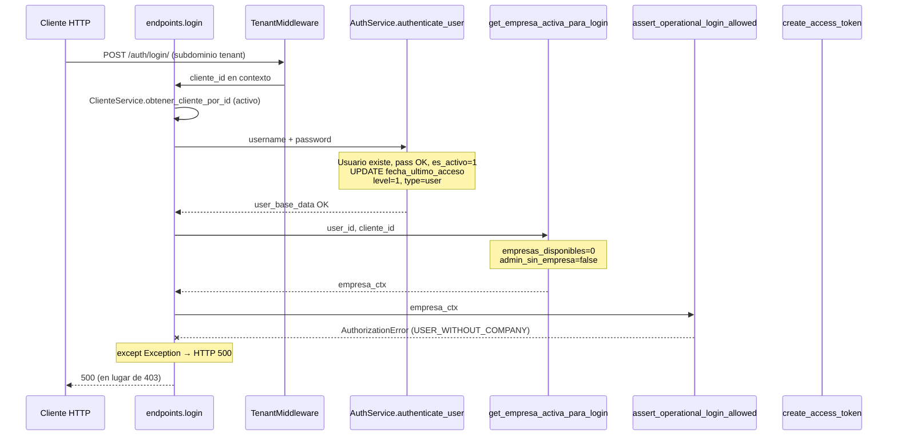

# Auditoría runtime — 500 en login de usuario sin roles asignados

**Tipo:** Evidencia runtime (logs Docker + reproducción HTTP) — sin cambios de código  
**Fecha:** 2026-06-01  
**Caso QA:** Crear usuario → no asignar rol → `POST /api/v1/auth/login/`  
**Fuente logs:** `terminals/1.txt` — contenedor `fastapi_backend`

---

## 1. Resumen ejecutivo

| Campo | Valor |
|-------|-------|
| **Síntoma** | HTTP **500** con `"Ocurrió un error inesperado durante el proceso de login."` |
| **Excepción real** | `app.core.exceptions.AuthorizationError` |
| **Mensaje interno** | `"El usuario no tiene empresas asignadas. Contacte al administrador del tenant."` |
| **Origen** | `auth_service.py` L578 — `assert_operational_login_allowed()` |
| **Propagación defectuosa** | `endpoints.py` L481–486 — `except Exception` convierte **403 esperado** en **500** |
| **Política RBAC V1** | Caso **D1** — rechazar login operativo sin empresas elegibles (`USER_WITHOUT_COMPANY`) |
| **Clasificación principal** | **Bug backend** (manejo de excepciones en login) |
| **Clasificación secundaria** | **RBAC** (regla correcta; HTTP incorrecto) |
| **¿Asume rol obligatorio?** | No en autenticación de credenciales; **sí** en fase post-auth (empresas vía `usuario_rol`) |

**Conclusión:** El sistema **no** intenta emitir tokens a un usuario sin roles. La regla M1 / R-LOGIN-04 se dispara correctamente, pero el endpoint de login **no deja propagar** `AuthorizationError` al handler global de `CustomException`, por eso el cliente ve 500 en lugar de 403.

---

## 2. Reproducción runtime

### 2.1 Pasos

1. `POST /api/v1/usuarios/` — crear `qa_norole_ffdd1f` (sin asignar rol).
2. `POST /api/v1/auth/login/` — `username=qa_norole_ffdd1f`, contraseña correcta, tenant `t3usr971acefb`.

### 2.2 Resultado HTTP

```http
POST /api/v1/auth/login/
→ 500 Internal Server Error

{
  "detail": "Ocurrió un error inesperado durante el proceso de login."
}
```

### 2.3 Usuario de prueba

| Campo | Valor |
|-------|-------|
| `nombre_usuario` | `qa_norole_ffdd1f` |
| `usuario_id` | `b3b06780-d718-47d8-86f1-49dc014cf372` |
| `cliente_id` | `e4c8e906-0e64-4f4e-a04d-8daee57dc7f8` |
| Roles en `usuario_rol` | **0** (no se llamó assign role) |
| Timestamp log | `2026-06-01 07:18:44` UTC |

---

## 3. Endpoint y servicios involucrados

| Capa | Componente | Ubicación |
|------|------------|-----------|
| **Endpoint** | `login()` | `app/modules/auth/presentation/endpoints.py` **L185–486** |
| **Ruta** | `POST /api/v1/auth/login/` | Router `auth` + `API_V1_STR` |
| **Autenticación** | `authenticate_user()` → `AuthService.authenticate_user()` | `endpoints.py` L233; `auth_service.py` **L777+** |
| **Empresa / elegibles** | `AuthService.get_empresa_activa_para_login()` | `auth_service.py` **L366–552** |
| **Gate operativo** | `AuthService.assert_operational_login_allowed()` | `auth_service.py` **L555–584** |
| **Niveles LBAC** | `get_user_access_level_info()` | `auth_service.py` L656+ (también dentro de `authenticate_user`) |
| **Roles en respuesta** | `UsuarioService.get_user_role_names()` | Solo si el flujo **no** falla antes (L296–298) |

---

## 4. Flujo completo (login → respuesta)



### 4.1 Orden de ejecución (usuario sin roles)

| Paso | Acción | Resultado en QA |
|------|--------|-----------------|
| 1 | Resolver tenant (`get_current_client_id`) | OK |
| 2 | Validar cliente activo | OK |
| 3 | `authenticate_user` — SELECT `usuario`, verify password | OK — credenciales válidas |
| 4 | `authenticate_user` — UPDATE `fecha_ultimo_acceso` | OK |
| 5 | `get_user_access_level_info` (dentro de authenticate) | `access_level=1`, `user_type=user`, `total_roles=0` implícito |
| 6 | Log engañoso `[AUTH] Login exitoso` | Se emite **antes** del gate de empresa |
| 7 | `get_empresa_activa_para_login` — JOIN `usuario_rol` + `org_empresa` | `disponibles=0`, `activa=None`, `admin_sin_empresa=False` |
| 8 | `assert_operational_login_allowed` | **`AuthorizationError`** |
| 9 | `get_user_role_names` / emisión JWT | **No alcanzados** |
| 10 | `except Exception` en `login()` | **HTTP 500** |

---

## 5. Punto exacto de la excepción y stacktrace

### 5.1 Log runtime (literal)

```text
2026-06-01 07:18:44,849 - auth_service - INFO - [AUTH] Login exitoso: username='qa_norole_ffdd1f', usuario_id=B3B06780-...
2026-06-01 07:18:44,870 - auth_service - INFO - [AUTH] Empresa login usuario=B3B06780-... disponibles=0 activa=None requiere_seleccion=False admin_sin_empresa=False
2026-06-01 07:18:44,870 - endpoints - ERROR - Error inesperado en /login/ para usuario qa_norole_ffdd1f: El usuario no tiene empresas asignadas. Contacte al administrador del tenant.
Traceback (most recent call last):
  File "/app/app/modules/auth/presentation/endpoints.py", line 285, in login
    AuthService.assert_operational_login_allowed(
  File "/app/app/modules/auth/application/services/auth_service.py", line 578, in assert_operational_login_allowed
    raise AuthorizationError(
app.core.exceptions.AuthorizationError: El usuario no tiene empresas asignadas. Contacte al administrador del tenant.
2026-06-01 07:18:44,887 - app.main - INFO - [SYSTEM] ... POST /api/v1/auth/login/ 500 299.0ms
```

### 5.2 Código que lanza la excepción

```555:584:app/modules/auth/application/services/auth_service.py
    def assert_operational_login_allowed(
        empresa_ctx: Dict[str, Any],
        *,
        es_superadmin: bool = False,
        user_type: Optional[str] = None,
    ) -> None:
        ...
        if empresas:
            return
        if empresa_ctx.get("es_admin_sin_empresa"):
            return
        raise AuthorizationError(
            detail=(
                "El usuario no tiene empresas asignadas. "
                "Contacte al administrador del tenant."
            ),
            internal_code=USER_WITHOUT_COMPANY,
        )
```

### 5.3 Código que convierte 403 en 500

```479:486:app/modules/auth/presentation/endpoints.py
    except HTTPException:
        raise
    except Exception as e:
        logger.exception(f"Error inesperado en /login/ para usuario {form_data.username}: {str(e)}")
        raise HTTPException(
            status_code=status.HTTP_500_INTERNAL_SERVER_ERROR,
            detail="Ocurrió un error inesperado durante el proceso de login."
        )
```

`AuthorizationError` hereda de `CustomException`, **no** de `HTTPException`. El handler global en `configure_exception_handlers` (L161+) devolvería **403** con `error_code`, pero **nunca se invoca** porque el `except Exception` del endpoint captura primero.

---

## 6. Estado del usuario en el escenario QA

| Condición | Valor |
|-----------|-------|
| Usuario existe en `dbo.usuario` | Sí |
| Contraseña correcta | Sí (`verify_password` OK) |
| `es_activo = 1` | Sí |
| `es_eliminado = 0` | Sí |
| Filas activas en `usuario_rol` | **0** |
| `empresas_disponibles` (login) | **0** |
| `es_admin_sin_empresa` | **false** (requiere rol global admin sin empresa) |
| `user_role_names` | No calculado (flujo cortado) |
| Tokens emitidos | **No** |

### 6.1 ¿El sistema asume que todo usuario tiene al menos un rol?

| Fase | ¿Asume rol? | Evidencia |
|------|-------------|-----------|
| Validación usuario/contraseña | **No** | `authenticate_user` solo consulta `usuario` |
| Cálculo `access_level` | **No** (degradación) | Sin filas en JOIN → `ISNULL(MAX(...),1)` → level 1 |
| Empresas elegibles | **Sí (indirecto)** | `get_empresa_activa_para_login` parte de `usuario_rol` activo |
| Login operativo permitido | **Sí** | Sin rol → sin empresa → `assert_operational_login_allowed` rechaza |

No hay comprobación explícita `if len(roles)==0`; el rechazo se modela como **“sin empresas asignadas”**, equivalente funcional para usuarios operativos sin `usuario_rol`.

---

## 7. Comportamiento esperado según RBAC V1

Referencias: `RBAC_V1_FINAL.md` §4.4 caso **D1**, `MULTIEMPRESA_OFFICIAL_MODEL.md` R-LOGIN-04, `USER_COMPANY_ROLE_OFFICIAL_MODEL.md` §7.5.

| Regla | Comportamiento oficial |
|-------|------------------------|
| **R-LOGIN-04** | Usuario operativo con **0 empresas elegibles** → **rechazar login** |
| **Código** | `USER_WITHOUT_COMPANY` |
| **HTTP esperado** | **403 Forbidden** (vía `AuthorizationError` / `CustomException`) |
| **Post-create sin rol** | Copy UX: *"Sin rol asignado, el usuario no puede iniciar sesión en el ERP."* |
| **Excepción D2** | Admin onboarding (`es_admin_sin_empresa`) puede entrar sin org — **no aplica** a usuario sin ningún rol |

Usuario recién creado sin rol cae en **D1**, no en onboarding admin.

---

## 8. Alternativas A vs B

### A) Permitir login y mostrar cuenta sin perfiles

| Aspecto | Evaluación |
|---------|------------|
| Alineación RBAC V1 | **Inconsistente** — contradice R-LOGIN-04 / M1.5 |
| JWT `empresa_id` | Operaciones ERP requieren empresa; sesión huérfana |
| Menú / permisos | `PermissionResolver` sin grants → UX vacía o errores en cadena |
| Riesgo seguridad | Usuario autenticado sin scope definido |

### B) Bloquear login con 403 y mensaje funcional

| Aspecto | Evaluación |
|---------|------------|
| Alineación RBAC V1 | **Consistente** — ya implementado en `assert_operational_login_allowed` |
| HTTP correcto | **403** + `internal_code: USER_WITHOUT_COMPANY` |
| Mensaje recomendado | Unificar con copy oficial: perfiles/roles, no solo “empresas” |
| Estado actual | Regla **B** activa; bug es solo el **500** por captura de excepción |

### Recomendación arquitectónica

**Opción B** — bloquear login con **403** y mensaje claro.

Es la opción ya definida en RBAC V1 (caso D1). La corrección no debe cambiar la política, sino:

1. Propagar `CustomException` (`AuthorizationError`) desde `login()` sin envolverla en 500.
2. (Opcional UX) Ajustar `detail` a texto orientado a perfiles: *"Su cuenta no tiene perfiles asignados. Contacte al administrador del tenant."* manteniendo `USER_WITHOUT_COMPANY`.

**No** implementar A salvo cambio explícito de especificación RBAC V2.

---

## 9. Clasificación

| Categoría | ¿Aplica? | Notas |
|-----------|----------|-------|
| **Bug backend** | **Sí (principal)** | `except Exception` en `login()` enmascara `AuthorizationError` → 500 |
| **RBAC** | **Sí (secundario)** | Política D1 correcta; contrato HTTP roto |
| **Datos** | No | Usuario válido; estado esperado post-create |
| **Configuración** | No | Mismo tenant T3 que otros flujos QA |
| **Frontend** | No | Respuesta genérica 500 es consecuencia backend |

---

## 10. Propuesta de corrección (solo diseño — sin implementar)

### 10.1 Mínima (recomendada)

En `app/modules/auth/presentation/endpoints.py`, función `login()`:

- Añadir `except CustomException: raise` **antes** de `except Exception`, **o**
- Eliminar el `except Exception` genérico y dejar que `CustomException` llegue al handler global.

Efecto: mismo escenario QA → **403** con cuerpo coherente (`detail` + `error_code: USER_WITHOUT_COMPANY` según handler).

### 10.2 Mensaje funcional (opcional)

En `assert_operational_login_allowed`, alinear texto con IAM/UX:

```text
Su cuenta no tiene perfiles asignados. Contacte al administrador del tenant.
```

Mantener `internal_code=USER_WITHOUT_COMPANY` para contrato FE.

### 10.3 Higiene de logs (opcional)

Mover o condicionar el log `[AUTH] Login exitoso` en `authenticate_user` para que no aparezca cuando el login será rechazado por empresa/roles.

### 10.4 Pruebas sugeridas (post-fix)

| Caso | Esperado |
|------|----------|
| Usuario sin `usuario_rol`, credenciales OK | **403** `USER_WITHOUT_COMPANY` |
| Usuario con rol USER en 1 empresa | **200** + tokens |
| Admin global sin org (D2) | **200** sin `empresa_id` |
| Regresión: credenciales inválidas | **401** |

---

## 11. Archivos de referencia

| Documento | Relación |
|-----------|----------|
| [USER_DEACTIVATE_500_RUNTIME_ROOT_CAUSE.md](./USER_DEACTIVATE_500_RUNTIME_ROOT_CAUSE.md) | Patrón distinto (await); mismo módulo users/auth |
| [RBAC_V1_FINAL.md](./RBAC_V1_FINAL.md) | Casos login A–D |
| [MULTIEMPRESA_M1_IMPLEMENTATION.md](./MULTIEMPRESA_M1_IMPLEMENTATION.md) | Implementación `assert_operational_login_allowed` |
| [USER_COMPANY_ROLE_OFFICIAL_MODEL.md](./USER_COMPANY_ROLE_OFFICIAL_MODEL.md) | Copy post-create sin rol |
| [AUDITORIA_AUTH_LOGIN.md](./AUDITORIA_AUTH_LOGIN.md) | Mapa histórico del flujo login |

---

## 12. Veredicto

| Pregunta | Respuesta |
|----------|-----------|
| ¿Es bug de “usuario sin rol” en SQL? | No — la consulta de auth no falla |
| ¿Falta validar roles explícitamente? | No necesario; el gate por empresas cubre el caso |
| ¿Cuál es la causa raíz del 500? | Captura genérica de `AuthorizationError` en `endpoints.py` L481–486 |
| ¿Qué debería ver el usuario? | **403** (opción B), no 500 |
| ¿Implementar A o B? | **B** (ya es la política RBAC V1) |
