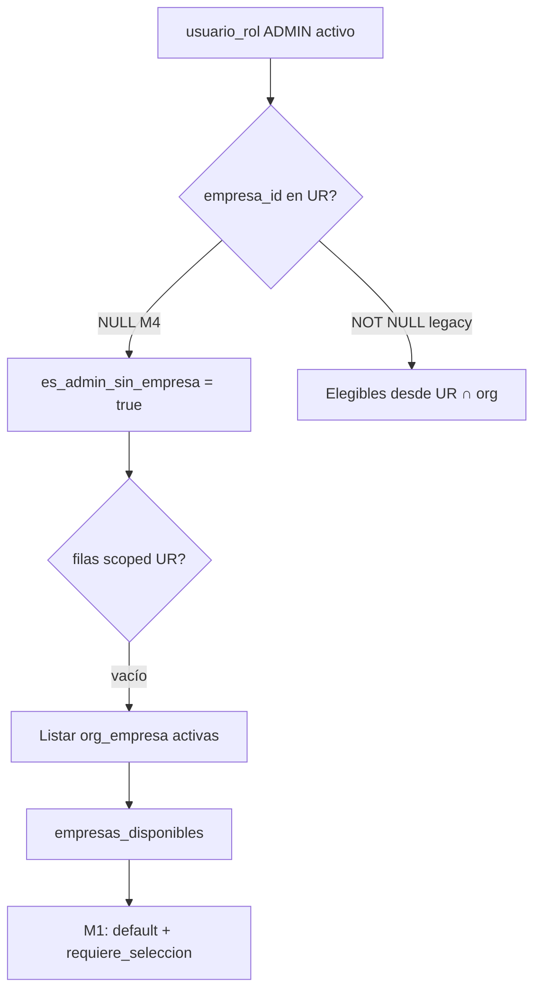

# Auditoría M4 — Contrato Frontend ↔ Backend (ADMIN_TENANT tenant-wide)

**Tipo:** Diagnóstico puntual (sin cambios de código)  
**Fecha:** 2026-05-31  
**Referencias:** [ADMIN_TENANT_SCOPE_MODEL.md](./ADMIN_TENANT_SCOPE_MODEL.md), [M4_ADMIN_TENANT_TENANT_WIDE_IMPLEMENTATION.md](./M4_ADMIN_TENANT_TENANT_WIDE_IMPLEMENTATION.md), [FLUJO_AUTH_MULTIEMPRESA_FE.md](../pruebas/FLUJO_AUTH_MULTIEMPRESA_FE.md), [MULTIEMPRESA_OFFICIAL_MODEL.md](./MULTIEMPRESA_OFFICIAL_MODEL.md)  
**Tenant de referencia:** ADMIN_TENANT post-M4 (`usuario_rol.empresa_id IS NULL`, repair aplicado o onboarding nuevo).

**Método:** trazado estático del código runtime (`endpoints.py`, `auth_service.py`, `schemas.py`) + tests M4/M1 + contrato FE documentado. No se ejecutó HTTP en staging en esta auditoría; shapes derivados del comportamiento implementado verificado en unit tests.

---

## 1. Resumen ejecutivo

| Pregunta | Respuesta |
|----------|-----------|
| ¿M4 login admin 1 org funciona? | ✅ `Token` con `access_token` y `empresa_activa` |
| ¿M4 login admin 2 org sin default? | ✅ `LoginEmpresaSelectionResponse` + `selection_token` |
| ¿`empresa_default_id` expuesto en API? | ❌ **Nunca** — solo BD interna (M1) |
| ¿`/me` lista empresas con sesión activa? | ❌ `empresas_disponibles: null` si JWT trae `empresa_id` |
| ¿Conclusión? | **C) Incompatibilidad contractual parcial** — login alineado; selector header requiere acuerdo M2 o fuente alternativa |

---

## 2. Estado del tenant post-M4 (precondiciones)

| Campo BD | Valor esperado |
|----------|----------------|
| `usuario_rol` (ADMIN_TENANT) | `empresa_id IS NULL`, `es_activo = 1` |
| `usuario.empresa_default_id` | `EMP001` (onboarding) o NULL (migrado sin repair minimal) |
| Elegibles login | Todas las filas `org_empresa` activas del tenant |
| `es_admin_sin_empresa` (runtime) | `true` |

---

## 3. POST `/api/v1/auth/login/` — ADMIN_TENANT tenant-wide

### 3.1 Algoritmo (post-M4 + M1)

```text
1. usuario_rol scoped → vacío (ADMIN NULL)
2. es_admin_sin_empresa = true
3. empresas_disponibles ← org_empresa activas (fallback admin)
4. Leer usuario.empresa_default_id; invalidar si ∉ elegibles (M1)
5. requiere_seleccion = (N > 1 AND default IS NULL)
6. empresa_activa = default válido | primera org | NULL si selección
```

### 3.2 Caso A — 1 empresa en org (`N=1`)

**Precondición:** una fila `org_empresa` activa; `empresa_default_id = EMP001` (típico onboarding M4).

**HTTP 200 — schema `Token`**

```json
{
  "access_token": "eyJhbGciOiJIUzI1NiIs...",
  "token_type": "bearer",
  "user_data": {
    "usuario_id": "550e8400-e29b-41d4-a716-446655440000",
    "nombre_usuario": "admin",
    "correo": "admin@tenant.local",
    "roles": ["Administrador"],
    "access_level": 5,
    "is_super_admin": false,
    "user_type": "tenant_admin",
    "cliente_id": "660e8400-e29b-41d4-a716-446655440001",
    "es_admin_cliente": true,
    "empresa_activa": "aaaaaaaa-bbbb-cccc-dddd-eeeeeeeeeeee"
  }
}
```

| Campo | Valor |
|-------|-------|
| `access_token` | ✅ Presente |
| `selection_token` | ❌ Ausente |
| `requiere_seleccion_empresa` | ❌ No aplica (solo en `LoginEmpresaSelectionResponse`) |
| `empresas_disponibles` | ❌ No en respuesta login (solo en selection response) |
| JWT `empresa_id` | ✅ = EMP001 |
| JWT `empresa_selection_pending` | ❌ false / ausente |
| Refresh (web) | ✅ Cookie HttpOnly |

**Nota:** con `N=1` y `empresa_default_id NULL`, `empresa_activa` = primera org por `razon_social` (mismo `Token`).

### 3.3 Caso B — 2 empresas, `empresa_default_id NULL`

**Precondición:** `org_empresa` = EMP001 + EMP002; `usuario.empresa_default_id IS NULL`.

**HTTP 200 — schema `LoginEmpresaSelectionResponse`**

```json
{
  "requiere_seleccion_empresa": true,
  "empresas_disponibles": [
    {
      "empresa_id": "aaaaaaaa-bbbb-cccc-dddd-eeeeeeeeeeee",
      "razon_social": "Empresa Uno SA",
      "nombre_comercial": "EU"
    },
    {
      "empresa_id": "bbbbbbbb-cccc-dddd-eeee-ffffffffffff",
      "razon_social": "Empresa Dos SA",
      "nombre_comercial": null
    }
  ],
  "selection_token": "eyJhbGciOiJIUzI1NiIs...",
  "token_type": "bearer",
  "user_data": {
    "nombre_usuario": "admin",
    "user_type": "tenant_admin",
    "access_level": 5,
    "es_admin_cliente": true,
    "roles": ["Administrador"],
    "cliente_id": "660e8400-e29b-41d4-a716-446655440001"
  }
}
```

| Campo | Valor |
|-------|-------|
| `access_token` | ❌ Ausente |
| `selection_token` | ✅ Presente |
| `requiere_seleccion_empresa` | ✅ `true` |
| `empresas_disponibles` | ✅ 2 ítems (desde `org_empresa`) |
| `user_data.empresa_activa` | ❌ Ausente (perfil sin sesión ERP) |
| Refresh | ❌ No emitido hasta `seleccionar` |

### 3.4 Caso C — 2 empresas + default válido (M1)

**Precondición:** `empresa_default_id = EMP002` ∈ elegibles.

**HTTP 200 — schema `Token`** (igual que Caso A pero `empresa_activa` = EMP002).

| Campo | Valor |
|-------|-------|
| `access_token` | ✅ |
| `selection_token` | ❌ |
| `requiere_seleccion_empresa` | ❌ (no aplica en `Token`) |
| `empresa_activa` en `user_data` | ✅ EMP002 |

---

## 4. AuthContext — exposición por endpoint

### 4.1 Matriz de campos

| Campo | `/auth/login` Token | `/auth/login` Selection | `/auth/me` | `/auth/empresa/seleccionar` | `/auth/empresa/cambiar` |
|-------|:-------------------:|:-----------------------:|:----------:|:---------------------------:|:-----------------------:|
| `empresa_activa` | ✅ `user_data` | ❌ en `user_data` | ✅ plano | ✅ `user_data` | ✅ `user_data` |
| `empresas_disponibles` | ❌ | ✅ raíz | ⚠️ condicional | ❌ | ❌ |
| `requiere_seleccion_empresa` | ❌ | ✅ raíz | ⚠️ condicional | ❌ | ❌ |
| `empresa_default_id` | ❌ | ❌ | ❌ | ❌ | ❌ |
| `access_token` | ✅ | ❌ | N/A | ✅ | ✅ |
| `selection_token` | ❌ | ✅ | N/A | ❌ | ❌ |

### 4.2 GET `/auth/me/` — lógica real

```python
# endpoints.py ~L903
if empresa_activa_uuid is None and es_admin_cliente_me:
    empresa_ctx = await get_empresa_activa_para_login(...)
    requiere_seleccion_me = empresa_ctx["requiere_seleccion"]
    empresas_disponibles_me = [...] if empresas_ctx else None
```

| Estado JWT | `empresa_activa` | `requiere_seleccion_empresa` | `empresas_disponibles` |
|------------|------------------|------------------------------|------------------------|
| Sin `empresa_id` (onboarding / edge) | `null` | `true` si N>1 sin default | Lista org si aplica |
| Con `empresa_id` (sesión ERP normal) | UUID string | **`false`** | **`null`** |
| Selection token | **409** — usar `seleccionar` | — | — |

**Ejemplo sesión completa (admin M4, 2 org, ya eligió EMP001):**

```json
{
  "nombre_usuario": "admin",
  "user_type": "tenant_admin",
  "access_level": 5,
  "es_admin_cliente": true,
  "empresa_activa": "aaaaaaaa-bbbb-cccc-dddd-eeeeeeeeeeee",
  "requiere_seleccion_empresa": false,
  "empresas_disponibles": null
}
```

### 4.3 POST `/auth/empresa/seleccionar/` y `/auth/empresa/cambiar/`

**Response:** `Token` (mismo shape que login exitoso).

```json
{
  "access_token": "eyJ...",
  "token_type": "bearer",
  "user_data": {
    "empresa_activa": "bbbbbbbb-cccc-dddd-eeee-ffffffffffff",
    "es_admin_cliente": true,
    "user_type": "tenant_admin",
    "roles": ["Administrador"]
  }
}
```

- **No** devuelven `empresas_disponibles` ni `requiere_seleccion_empresa`.
- **No** devuelven `empresa_default_id` (se persiste en BD vía M1, transparente al FE).
- M4 no altera estos contratos.

### 4.4 `empresa_default_id` — no expuesto

| Capa | Exposición |
|------|------------|
| BD `usuario.empresa_default_id` | ✅ M1 persist en seleccionar/cambiar |
| API login / me / cambiar | ❌ **Ningún endpoint** |
| FE doc oficial | ❌ No documentado (M2 propone `empresa_preferida`) |

---

## 5. Elegibilidad — ADMIN_TENANT `empresa_id NULL`

### 5.1 Flujo



### 5.2 Reglas

| Regla | ADMIN M4 (NULL) |
|-------|-----------------|
| Fuente primaria UR | Vacía (sin `empresa_id NOT NULL`) |
| Fallback | `_listar_empresas_activas_org(cliente_id)` |
| Incluye EMP002 recién creada | ✅ Sí, sin assign adicional |
| MANAGER/USER | ❌ No usan fallback — solo UR scoped |
| Validación cambiar/seleccionar | `empresa_id ∈ elegibles` |

### 5.3 Contraste pre-M4 vs post-M4

| Escenario | Pre-M4 (scoped EMP001) | Post-M4 (NULL) |
|-----------|------------------------|----------------|
| 2 org, admin creó EMP002 | EMP002 **no** elegible | EMP002 **elegible** |
| Login N=2 sin default | Solo 1 empresa en lista | **2** empresas en lista |
| `es_admin_sin_empresa` | false | true |

---

## 6. Compatibilidad con `FLUJO_AUTH_MULTIEMPRESA_FE.md`

### 6.1 Login — selección obligatoria

| Expectativa FE doc | Backend M4 | Match |
|--------------------|------------|:-----:|
| `requiere_seleccion_empresa` en raíz | ✅ | ✅ |
| `empresas_disponibles[]` con id + nombres | ✅ desde org | ✅ |
| Solo `selection_token`, no `access_token` | ✅ | ✅ |
| `user_data` sin campos de selección anidados | ✅ | ✅ |
| 409 en `/me` con selection token | ✅ | ✅ |

### 6.2 Login — sesión directa

| Expectativa FE doc | Backend M4 (1 org o default) | Match |
|--------------------|------------------------------|:-----:|
| `access_token` + `user_data.empresa_activa` | ✅ | ✅ |
| Refresh web en cookie | ✅ | ✅ |
| `user_type: tenant_admin` | ✅ | ✅ |

### 6.3 GET `/me`

| Expectativa FE doc | Backend M4 sesión con `empresa_id` | Match |
|--------------------|-------------------------------------|:-----:|
| Respuesta plana | ✅ | ✅ |
| `empresa_activa` = JWT `empresa_id` | ✅ | ✅ |
| `empresas_disponibles: null` en sesión normal | ✅ doc línea 107 | ✅ |
| Admin sin JWT + org: lista + `requiere_seleccion` | ✅ | ✅ |

### 6.4 Brecha documentada (pre-M4, persiste post-M4)

| Necesidad FE (R-FE-03 oficial) | Backend actual | Gap |
|--------------------------------|----------------|-----|
| `puede_cambiar_empresa` | ❌ No existe en API (M2) | M2 pendiente |
| Header selector con lista de empresas | `/me` → `null` con sesión activa | FE debe usar `GET /org/empresas` o esperar M2 |
| `empresa_preferida` / default | ❌ No expuesto | M2 pendiente |

---

## 7. ¿Qué debe activar el frontend?

### 7.1 `SeleccionarEmpresaPage`

| Condición | ¿Activar? | Evidencia |
|-----------|:---------:|-----------|
| Login → `requiere_seleccion_empresa === true` | **SÍ** | Caso B §3.3 |
| Login → `selection_token` presente | **SÍ** | Idem |
| Login → `Token` con `empresa_activa` | **NO** | Caso A §3.2 |
| Admin M4, 2 org, default válido (M1) | **NO** — auto-login | Caso C §3.4 |

**Veredicto:** FE alineado si implementa la rama documentada en `FLUJO_AUTH_MULTIEMPRESA_FE.md`.

### 7.2 `EmpresaSelector` (header)

| Condición | ¿Activar? | Fuente de datos |
|-----------|:---------:|-----------------|
| Sesión con `empresa_activa` + admin multi-org | **Debería** (R-FE-03) | ⚠️ `/me` no da lista |
| Tras login selection | N/A hasta completar seleccionar | Login ya dio lista |
| Impersonación | 403 en cambiar | No aplica |

**Opciones FE hoy (sin M2 backend):**

1. `GET /api/v1/org/empresas` (tenant-wide, admin tiene permiso) para poblar selector.
2. Cachear `empresas_disponibles` del login selection (solo si pasó por picker).
3. Esperar M2 (`puede_cambiar_empresa` + lista en `/me`).

**Veredicto:** **Backend no emite contrato completo para header selector** en sesión establecida; FE doc asume `empresas_disponibles: null` en `/me` — coherente con código pero **insuficiente** para R-FE-03 sin fuente adicional.

---

## 8. Validación auth secundaria (post-login)

| Endpoint | Requisito sesión | ADMIN M4 con `empresa_id` JWT |
|----------|------------------|-------------------------------|
| `GET /auth/permissions/me` | Sesión completa | ✅ Permisos admin (UR NULL match) |
| `GET /auth/menu` | Sesión completa | ✅ Menú vía `rol_menu_permiso` |
| Refresh | Preserva `empresa_id` | ✅ Sin re-resolver org |
| ERP INV/company | `empresa_id` obligatorio | ✅ Company-scoped sin cambio M4 |

---

## 9. Conclusión

### **C) Ambos lados tienen una incompatibilidad contractual parcial**

Desglose:

| Área | Backend M4 | FE / contrato | Veredicto |
|------|------------|---------------|-----------|
| Login 1 org | ✅ Correcto | ✅ Alineado | OK |
| Login 2 org + picker | ✅ Correcto | ✅ Alineado | OK |
| Seleccionar / cambiar | ✅ Correcto | ✅ Alineado | OK |
| `/me` post-sesión | ✅ Como documentado | ⚠️ Lista null | Gap **M2** |
| Header `EmpresaSelector` | ⚠️ Sin lista en `/me` | Necesita org o M2 | Gap **compartido** |
| `empresa_default_id` | Interno M1 | No esperado aún | OK (M2) |

**No es B)** — el backend **sí** emite el contrato de login/selección que describe `FLUJO_AUTH_MULTIEMPRESA_FE.md` para ADMIN tenant-wide post-M4.

**No es A puro)** — el backend tampoco cumple R-FE-03 completo (falta `puede_cambiar_empresa` y lista persistente en `/me`); es deuda **M2** explícita en `MULTIEMPRESA_OFFICIAL_MODEL.md`, no regresión M4.

### Acciones recomendadas (documentales, sin código en esta auditoría)

1. **FE:** activar `SeleccionarEmpresaPage` solo con `requiere_seleccion_empresa` / `selection_token`.
2. **FE:** `EmpresaSelector` → `GET /org/empresas` hasta M2, o cache post-login.
3. **Backend M2:** exponer `empresas_disponibles` + `puede_cambiar_empresa` en `/me` para tenant_admin multi-org.
4. **Staging:** validar HTTP con tenant migrado (`repair_admin_tenant_tenant_wide.py --apply`).

---

## 10. Referencias de código

| Comportamiento | Ubicación |
|----------------|-----------|
| Login branch selection | `endpoints.py` L352–387 |
| Login Token | `endpoints.py` L395–452 |
| `/me` empresas condicional | `endpoints.py` L903–943 |
| Elegibilidad admin NULL | `auth_service.py` L434–534 |
| Schemas | `schemas.py` `Token`, `LoginEmpresaSelectionResponse`, `MeResponse` |

**Evidencia JSON:** [`M4_FRONTEND_BACKEND_CONTRACT_AUDIT.json`](../bootstrap_v2/00_manifest/evidence/M4_FRONTEND_BACKEND_CONTRACT_AUDIT.json)

**Estado:** auditoría completa — sin cambios de código.
