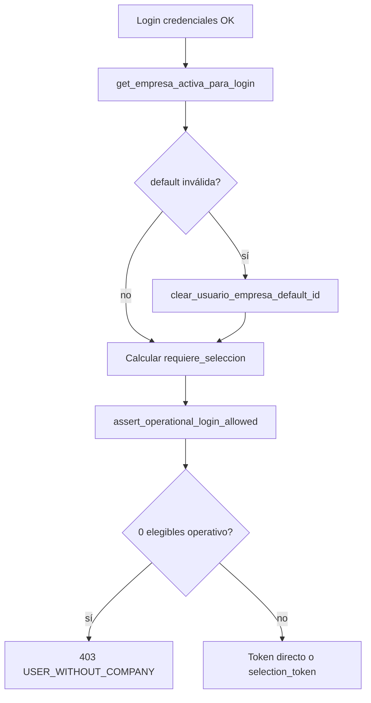

# Fase M1 — Implementación multiempresa

Implementación acotada según [MULTIEMPRESA_OFFICIAL_MODEL.md](./MULTIEMPRESA_OFFICIAL_MODEL.md).  
**Alcance:** M1.1–M1.8. **Excluido:** M2, M3, RBAC, OwnerSync, frontend.

## Resumen de cambios

| ID | Entregable | Archivo(s) | Regla |
|----|------------|------------|-------|
| M1.1 | Persistir `empresa_default_id` en seleccionar | `auth_service.py` → `seleccionar_empresa_post_login` | R-LOGIN-07 |
| M1.2 | Persistir en cambiar empresa | `auth_service.py` → `cambiar_empresa_sesion` | R-CAMBIO-03 |
| M1.3 | Auto-set default tras assign rol mono-empresa | `user_service.py` → `_maybe_set_empresa_default_after_role_assign` | R-USER-03 |
| M1.4 | Admin global: mismas reglas login A/B/C | `auth_service.py` → `get_empresa_activa_para_login` | R-LOGIN-06 |
| M1.5 | Rechazar login operativo sin empresas | `auth_service.py` → `assert_operational_login_allowed`; `endpoints.py` login | R-LOGIN-04, R-LOGIN-05 |
| M1.6 | Limpiar default inválida en login | `auth_service.py` + `empresa_preference.py` | R-DATA-02 |
| M1.7 | Tests unitarios casos A–D | `tests/unit/test_multiempresa_m1.py`, `test_empresa_sesion_auth.py` | — |
| M1.8 | Decisión UQ `usuario_rol` | Este documento § UQ | R-DATA-05 |

## Módulo nuevo

**`app/core/tenant/empresa_preference.py`**

- `persist_usuario_empresa_default_id(usuario_id, cliente_id, empresa_id)`
- `clear_usuario_empresa_default_id(usuario_id, cliente_id)`
- Constante `USER_WITHOUT_COMPANY`

Adapta SQL según `database_type` (`single` filtra por `cliente_id`; `multi` no).

## Flujo login (post-M1)



### Casos A–D

| Caso | Condición | Comportamiento |
|------|-----------|----------------|
| **A** | 1 elegible | Sesión directa; `empresa_activa` = única |
| **B** | N>1 + default ∈ elegibles | Sesión directa con default |
| **C** | N>1 + default NULL | `selection_token`; tras seleccionar → persist default (M1.1) |
| **D1** | Operativo, 0 elegibles | 403 `USER_WITHOUT_COMPANY` |
| **D2** | Admin onboarding, 0 org | Login sin `empresa_id` permitido |
| **D3** | Admin global + org | Reglas A/B/C (ya no fuerza selección siempre) |

## M1.5 — Error de dominio

- **Código:** `USER_WITHOUT_COMPANY`
- **HTTP:** 403 (`AuthorizationError`)
- **Excluidos:** `es_superadmin`, `user_type=platform_admin`, `es_admin_sin_empresa` (onboarding)

## M1.8 — Decisión UQ `usuario_rol`

| Fuente | Constraint | Columnas |
|--------|------------|----------|
| DDL bootstrap `V020__tablas_bd_central.sql` | `UQ_usuario_rol_empresa` | `(usuario_id, rol_id, empresa_id)` |
| SQLAlchemy `tables.py` | `UQ_usuario_rol` | `(usuario_id, rol_id)` |
| `UsuarioService.asignar_rol_a_usuario` | Lógica aplicación | Una fila por `(usuario_id, rol_id)`; mismo rol no en dos empresas |

**Decisión final (M1):** La **fuente de verdad operativa** es la capa de aplicación (`UQ_usuario_rol` semántico: un rol por usuario, un scope de empresa). El DDL `UQ_usuario_rol_empresa` permite teóricamente el mismo `rol_id` en dos `empresa_id` distintas, lo cual el servicio rechaza con `ROLE_ASSIGNED_OTHER_EMPRESA`.

**Acción M1:** Documentar divergencia; **no** migrar DDL en M1 (riesgo M3). Alineación DDL ↔ servicio queda para fase M3 si se confirma modelo multi-rol multi-empresa.

## Tests

```bash
pytest tests/unit/test_multiempresa_m1.py tests/unit/test_empresa_sesion_auth.py -v
```

Evidencia automatizada: `app/bootstrap_v2/00_manifest/evidence/MULTIEMPRESA_M1_VALIDATION.json`
