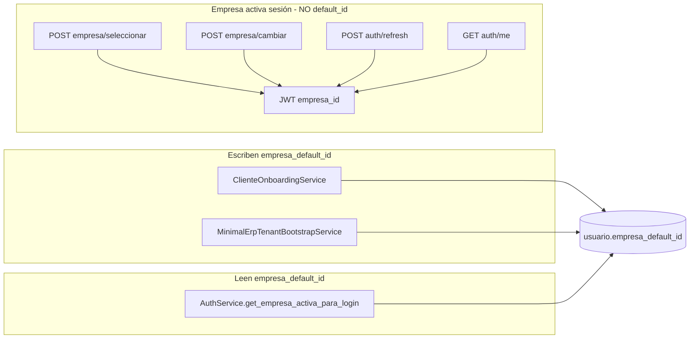
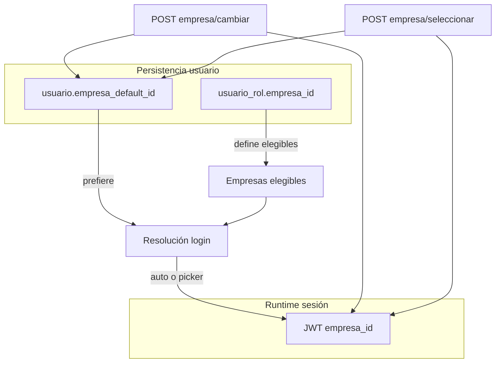

# Modelo oficial multiempresa CAXIS — Auditoría y propuesta

**Fecha:** 2026-05-31  
**Alcance:** Congelar el modelo definitivo de **empresa activa** y **`empresa_default_id`** para todo CAXIS SaaS.  
**Tipo:** Auditoría funcional — **sin cambios de código, commits ni PR**.  
**Documentos relacionados:**

- [`MULTI_EMPRESA_SESSION_AUDIT.md`](MULTI_EMPRESA_SESSION_AUDIT.md) — sesión JWT y flujo auth
- [`TENANT_ROLE_PERMISSION_MODEL_AUDIT.md`](TENANT_ROLE_PERMISSION_MODEL_AUDIT.md) — roles MANAGER/USER

---

## Resumen ejecutivo

CAXIS SaaS separa tres conceptos que hoy **no están unificados en producto**:

| Concepto | Almacenamiento | Uso runtime |
|----------|----------------|-------------|
| **Empresa activa (sesión)** | JWT `empresa_id` + ContextVar | RBAC, menú, datos ERP |
| **Empresa preferida (login)** | `usuario.empresa_default_id` | Solo resolución en login |
| **Empresa asignada (rol)** | `usuario_rol.empresa_id` | Elegibilidad multiempresa |

**Hallazgos críticos:**

1. `empresa_default_id` **solo se escribe en onboarding/repair**; login, seleccionar y cambiar **no la persisten**.
2. Crear usuario + asignar rol **no** setea `empresa_default_id`.
3. El frontend **nunca recibe** `empresa_default_id`; solo `empresa_activa` (sesión).
4. Admin global (`usuario_rol.empresa_id IS NULL`) **ignora** `empresa_default_id` y fuerza selección.
5. `usuario_rol.es_empresa_default` existe en BD pero **no participa** en auth runtime.

---

## 1. `empresa_default_id` — Inventario completo

### 1.1 Definición en esquema

**Tabla:** `usuario`  
**Columna:** `empresa_default_id UNIQUEIDENTIFIER NULL`  
**FK:** → `org_empresa(empresa_id)` ON DELETE NO ACTION  

**Esquema oficial:** `app/bootstrap_v2/01_schema/V020__tablas_bd_central.sql` (~L303–335).

**Campo relacionado (no equivalente):** `usuario_rol.es_empresa_default` — marcador onboarding; **no leído** por `get_empresa_activa_para_login`.

### 1.2 Dónde se crea

| Origen | Servicio / script | Valor | Condición |
|--------|-------------------|-------|-----------|
| Onboarding tenant admin | `ClienteOnboardingService._insertar_usuario_admin()` | `empresa_id` inicial (EMP001) | INSERT explícito en `usuario` |
| Repair ERP mínimo | `MinimalErpTenantBootstrapService.vincular_admin_empresa()` | `empresa_id` reparada | UPDATE `usuario SET empresa_default_id = :empresa_id` |
| Crear usuario operativo | `UsuarioService.crear_usuario()` | **No se inserta** | Columna ausente del INSERT → NULL |
| Asignar rol | `UsuarioService.asignar_rol_a_usuario()` | **No se actualiza** | — |

**Scripts operativos:** `scripts/repair_minimal_erp_tenant.py` audita y repara vía `vincular_admin_empresa`.

### 1.3 Dónde se actualiza (hoy)

| Origen | ¿Actualiza? | Detalle |
|--------|:-----------:|---------|
| `POST /auth/login/` | ❌ | Solo lectura |
| `POST /auth/empresa/seleccionar/` | ❌ | Emite JWT; no UPDATE usuario |
| `POST /auth/empresa/cambiar/` | ❌ | Emite JWT + rota refresh; no UPDATE usuario |
| `POST /auth/refresh/` | ❌ | Hereda `empresa_id` del refresh JWT |
| `PATCH/PUT /usuarios/{id}/` | ❌ | No hay campo en schema de usuario |
| Onboarding / repair | ✅ | Ver §1.2 |
| SQL manual / QA | ✅ | Posible en entornos de prueba |

**Conclusión:** ningún endpoint HTTP de producto modifica `empresa_default_id` tras el onboarding.

### 1.4 Dónde se consume

| Consumidor | Archivo | Uso |
|------------|---------|-----|
| Resolución login | `AuthService.get_empresa_activa_para_login()` | Lee `usuario.empresa_default_id`; si ∈ empresas disponibles y >1 empresa → evita selección; si 1 empresa → fallback si default inválido |
| Tests unitarios | `tests/unit/test_empresa_sesion_auth.py` | Casos admin global, selección |
| Scripts repair | `repair_minimal_erp_tenant.py` | Auditoría estado |
| Documentación / QA | Varios `.md`, `PRUEBAS_AUTH_MULTIEMPRESA.md` | — |

**No consume `empresa_default_id`:**

- `PermissionResolver`, `MenuResolver`
- `require_erp_session`, `company_scope`
- `GET /auth/me` (solo JWT `empresa_id` → `empresa_activa`)
- Refresh token (usa JWT, no re-lee BD)
- Frontend (campo no expuesto en API)

### 1.5 Quién la modifica hoy

| Actor | Puede modificar | Mecanismo |
|-------|-----------------|-----------|
| Sistema (onboarding) | ✅ | `ClienteOnboardingService` |
| Sistema (repair) | ✅ | `MinimalErpTenantBootstrapService` |
| Tenant Admin (UI) | ❌ | Sin endpoint |
| Usuario final | ❌ | Sin endpoint |
| Platform operator | ❌ | Sin endpoint dedicado |
| DBA / scripts | ✅ | SQL directo |

### 1.6 Endpoints y servicios — mapa de referencia



| Endpoint / servicio | Toca `empresa_default_id` | Toca `empresa_id` JWT |
|---------------------|:-------------------------:|:---------------------:|
| `POST /auth/login/` | Lee | Escribe (o selection) |
| `POST /auth/empresa/seleccionar/` | — | Escribe |
| `POST /auth/empresa/cambiar/` | — | Escribe |
| `POST /auth/refresh/` | — | Preserva |
| `GET /auth/me/` | — | Lee |
| `POST /usuarios/` | — | — |
| `POST /usuarios/{id}/roles/{rid}/` | — | — |
| `UsuarioService.crear_usuario` | — | — |
| `UsuarioService.asignar_rol_a_usuario` | — | — |
| `ClienteOnboardingService` | Escribe | — |
| `MinimalErpTenantBootstrapService.vincular_admin_empresa` | Escribe | — |

---

## 2. Login multiempresa — Casos A–D

**Función central:** `AuthService.get_empresa_activa_para_login()`  
**Endpoint:** `POST /api/v1/auth/login/`

**Regla general actual:**

```python
requiere_seleccion = len(empresas_disponibles) > 1 and empresa_default_id is None
```

**Empresas disponibles (primaria):** `DISTINCT usuario_rol.empresa_id` activos en `org_empresa` activa.

**Excepción admin global:** si `usuario_rol.empresa_id IS NULL` (rol admin) y no hay empresas por rol → lista `org_empresa` y **`requiere_seleccion = True` siempre** (ignora default).

---

### Caso A — 1 empresa

**Precondición:** una fila `usuario_rol` activa con `empresa_id = EMP001`.

| | Actual | Recomendado (oficial) |
|---|--------|----------------------|
| **Login** | `Token` directo; `empresa_activa = EMP001` | ✅ Igual |
| **Selección** | No | No |
| **JWT** | `empresa_id = EMP001` | Igual |
| **default_id** | No requerida; si NULL usa la única empresa | Si NULL, **auto-set** `empresa_default_id = EMP001` en primer login exitoso (propuesto M2) |

---

### Caso B — Múltiples empresas + `empresa_default_id` válido

**Precondición:** `usuario_rol` en EMP001 y EMP002; `usuario.empresa_default_id = EMP002`.

| | Actual | Recomendado (oficial) |
|---|--------|----------------------|
| **Login** | `Token` directo; `empresa_activa = EMP002` | ✅ Igual |
| **Selección** | No | No |
| **Orden empresas** | Default gana sobre primera por `razon_social` | Igual |
| **FE** | `user_data.empresa_activa = EMP002` | Añadir `empresa_preferida` en `/me` opcional (M2) |

---

### Caso C — Múltiples empresas + `empresa_default_id NULL`

**Precondición:** ≥2 empresas en `usuario_rol`; default NULL.

| | Actual | Recomendado (oficial) |
|---|--------|----------------------|
| **Login** | `LoginEmpresaSelectionResponse` + `selection_token` | ✅ Igual |
| **Post-selección** | JWT con empresa elegida; **default sigue NULL** | **Persistir** default = empresa seleccionada (M1) |
| **Próximo login** | Vuelve a pedir selección | Auto-login con default persistido (M1) |
| **FE** | Pantalla picker obligatoria | Igual; tras selección guardar preferencia transparente |

---

### Caso D — Sin empresa

**Subcasos:**

#### D1 — Usuario operativo sin `usuario_rol.empresa_id`

| | Actual | Recomendado |
|---|--------|-------------|
| **Login** | ✅ Exitoso sin `empresa_id` | ❌ **Rechazar** login con 403 `USER_WITHOUT_COMPANY` (operativos) |
| **ERP** | 403 en menu/permisos | N/A |

#### D2 — Admin onboarding (0 empresas `org_empresa`)

| | Actual | Recomendado |
|---|--------|-------------|
| **Login** | ✅ Token sin `empresa_id` | ✅ Igual (onboarding crear primera empresa) |
| **GET /me** | `requiere_seleccion_empresa` según org | Igual |

#### D3 — Admin global + empresas en org

| | Actual | Recomendado |
|---|--------|-------------|
| **Login** | Selección **siempre** (incluso 1 org); ignora default | Aplicar reglas A/B/C también aquí; respetar `empresa_default_id` |
| **Con default válido** | Igual que C (selección forzada) | Auto-login con default (M1) |

---

## 3. Cambio de empresa — `POST /auth/empresa/cambiar/`

**Servicio:** `AuthService.cambiar_empresa_sesion()`  
**Auth:** Access token sesión completa (409 si `empresa_selection_pending`).

### 3.1 Qué actualiza hoy

| Artefacto | Actualizado |
|-----------|:-----------:|
| JWT access (`empresa_id`, roles, level_info, `es_admin_cliente`) | ✅ |
| JWT refresh (rotación) | ✅ |
| Registro refresh en BD (`RefreshTokenService`, `empresa_id`) | ✅ |
| Revocación refresh anterior | ✅ |
| Auditoría `empresa_cambiada` | ✅ |
| Cache permisos usuario | ❌ explícito (invalidación parcial vía nuevo build user) |
| **`usuario.empresa_default_id`** | ❌ |

### 3.2 Qué NO actualiza

- Preferencia persistente de login
- `usuario_rol` (correcto: scope de rol no cambia)
- `org_empresa`

### 3.3 ¿Debería actualizar `empresa_default_id`?

**Recomendación oficial: SÍ** — en `cambiar` y en primera `seleccionar`.

| Argumento a favor | Detalle |
|-------------------|---------|
| UX coherente | “Empresa favorita” = última usada en selector header |
| Caso C resuelto | Tras primera selección, próximos logins sin picker |
| Expectativa SaaS | Comportamiento estándar en ERP multi-sucursal |

### 3.4 Riesgos de persistir en `cambiar`

| Riesgo | Mitigación propuesta |
|--------|---------------------|
| Usuario pierde acceso a empresa preferida si revocan rol | Validar default ∈ empresas disponibles en login; si no, NULL + selección |
| Admin cambia empresa “por error” para otro usuario | Solo el propio usuario cambia su default (no admin editando otro) |
| Concurrencia multi-dispositivo | Last-write-wins aceptable; sesión JWT ya es por dispositivo |
| Admin global necesita no fijar default | Flag opcional `persist_preference=false` en body (avanzado) o excluir rol global |
| Empresa inactiva posterior | Login revalida FK + `org_empresa.es_activo`; limpiar default inválido |

**Recomendación:** persistir siempre salvo impersonación (403 ya existente).

---

## 4. Usuario nuevo — Crear → asignar rol → empresa

### 4.1 Flujo actual

```text
POST /usuarios/           → INSERT usuario (empresa_default_id = NULL)
POST /usuarios/.../roles/ → INSERT usuario_rol (empresa_id = sesión admin)
```

### 4.2 Cuándo debería asignarse `empresa_default_id`

| Momento | Recomendación oficial |
|---------|----------------------|
| **Al crear usuario** | ❌ No (aún no tiene rol ni elegibilidad) |
| **Al asignar primer rol scoped** | ✅ **Sí**, si `empresa_default_id IS NULL` → `target_empresa_id` |
| **Primer login exitoso** | ✅ Fallback si sigue NULL y hay exactamente 1 empresa disponible |
| **Seleccionar / cambiar empresa** | ✅ Persistir elección del usuario |

### 4.3 ¿Automático o esperar primer login?

| Estrategia | Pros | Contras |
|------------|------|---------|
| **Auto en assign rol (recomendado M1)** | Caso A inmediato; admin no configura extra | Si luego asignan segunda empresa, default ya fijada |
| **Solo primer login** | Default refleja comportamiento real | Primer login puede pedir selección innecesaria si admin asignó 1 empresa |
| **Híbrido (oficial)** | Assign rol → set default si NULL y 1 empresa; multi → NULL hasta selección | Equilibrio UX / datos |

### 4.4 Regla propuesta assign rol

```text
IF usuario.empresa_default_id IS NULL
   AND target_empresa_id IS NOT NULL
   AND COUNT(empresas_disponibles_usuario) <= 1 después del assign
THEN SET usuario.empresa_default_id = target_empresa_id
```

Si el admin asigna segundo rol en otra empresa (otro `rol_id`), no cambiar default automáticamente.

---

## 5. Usuarios multiempresa

### 5.1 Modelo de elegibilidad

**Empresas disponibles para login** = `{ DISTINCT usuario_rol.empresa_id | activo, NOT NULL } ∩ org_empresa activas`.

**Restricción aplicación (código):** UQ efectiva `(usuario_id, rol_id)` — **un mismo rol no puede asignarse en dos empresas**. Multiempresa requiere:

- Varios **roles distintos** en distintas empresas, o
- Rol **admin global** (`empresa_id NULL`) + listado `org_empresa`.

**Nota DDL:** `V020` declara `UQ_usuario_rol_empresa (usuario_id, rol_id, empresa_id)`; SQLAlchemy `tables.py` declara `UQ_usuario_rol (usuario_id, rol_id)`. Congelar en M1 alineación esquema ↔ servicio.

### 5.2 Caso: mismo usuario en 2 empresas

**Ejemplo:** `USER_TENANT` en EMP001 + `MANAGER_TENANT` en EMP002.

| Concepto | Comportamiento |
|----------|----------------|
| Empresas disponibles | [EMP001, EMP002] |
| Login sin default | Selección (Caso C) |
| Login con default | Auto-login en default |
| Empresa activa | JWT `empresa_id` |
| Empresa preferida | `usuario.empresa_default_id` |
| Selector header | `POST /empresa/cambiar/` entre EMP001 ↔ EMP002 |
| Roles en sesión | Filtrados por empresa activa + globales |
| Permisos / menú | Recalculados por `empresa_id` sesión |

### 5.3 Caso: mismo usuario en 5 empresas

**Ejemplo:** cinco roles distintos scoped (poco habitual) o admin global con 5 filas `org_empresa`.

| N empresas | Sin default | Con default |
|:----------:|-------------|-------------|
| 5 | Picker 5 opciones | Auto-login en default |
| Cambio | Selector header lista las 5 elegibles | Cambiar actualiza sesión (+ default propuesto) |

**ADMIN_TENANT global:** ve las 5 vía `org_empresa`; selección actual forzada — unificar regla en M1.

### 5.4 Por tipo de rol

| Rol | Multiempresa típico | Empresa asignada | Selector |
|-----|---------------------|------------------|----------|
| **ADMIN_TENANT** | Global (NULL) o scoped | NULL → todas org; scoped → una | Sí si >1 org o múltiples scoped |
| **MANAGER_TENANT** | Scoped por assign | `usuario_rol.empresa_id` | Sí si >1 empresa en rol distintos |
| **USER_TENANT** | Scoped | Idem | Idem |

**Oficial:** MANAGER/USER **no** reciben rol global; multiempresa solo vía múltiples asignaciones de roles distintos o política futura de re-asignación de scope.

---

## 6. Contrato frontend (propuesta oficial)

### 6.1 Principios

1. **`empresa_activa`** = empresa de **sesión** (JWT); fuente para headers, guards, scope API.
2. **`empresa_preferida`** (nuevo campo propuesto) = `usuario.empresa_default_id`; solo informativo / picker default.
3. **`empresas_disponibles`** = empresas elegibles del usuario (login o `/me`).
4. **`requiere_seleccion_empresa`** = bloqueo ERP hasta completar selección.
5. **Nunca** confundir preferida con activa tras `cambiar` sin refrescar tokens.

### 6.2 Login exitoso — `Token` (200)

```json
{
  "access_token": "eyJ...",
  "token_type": "bearer",
  "refresh_token": "…solo mobile…",
  "user_data": {
    "usuario_id": "uuid",
    "nombre_usuario": "jperez",
    "correo": "jperez@empresa.com",
    "roles": ["Supervisor"],
    "access_level": 3,
    "user_type": "user",
    "is_super_admin": false,
    "cliente_id": "uuid-tenant",
    "es_admin_cliente": false,
    "empresa_activa": "uuid-emp001"
  }
}
```

**JWT claims espejo:** `empresa_id`, `es_admin_cliente`, `user_type`, `access_level`, sin `empresa_selection_pending`.

**Propuesto M2 — campo adicional en `user_data`:**

```json
"empresa_preferida": "uuid-emp001"
```

### 6.3 Selección requerida — `LoginEmpresaSelectionResponse` (200)

```json
{
  "requiere_seleccion_empresa": true,
  "empresas_disponibles": [
    {
      "empresa_id": "uuid-emp001",
      "razon_social": "Empresa Uno SA",
      "nombre_comercial": "EU"
    },
    {
      "empresa_id": "uuid-emp002",
      "razon_social": "Empresa Dos SA",
      "nombre_comercial": null
    }
  ],
  "selection_token": "eyJ...",
  "token_type": "bearer",
  "user_data": {
    "nombre_usuario": "jperez",
    "roles": ["Supervisor"],
    "empresa_activa": null
  }
}
```

**Reglas FE:**

- Guardar `selection_token`; **no** llamar `/me`, `/menu`, `/permissions/me` (409).
- Mostrar picker con `empresas_disponibles`.
- Pre-seleccionar ítem cuyo `empresa_id === empresa_preferida` si `/me` previo o endpoint dedicado lo expone (M2).
- Tras `POST /empresa/seleccionar/` → tratar respuesta como **login exitoso** (`Token`).

### 6.4 Cambio de empresa — `POST /auth/empresa/cambiar/` (200)

**Request:**

```json
{
  "empresa_id": "uuid-emp002",
  "refresh_token": "…mobile…"
}
```

**Response:** mismo shape que login exitoso (`Token`).

**Acciones FE obligatorias:**

1. Reemplazar access (+ refresh mobile / confiar cookie web).
2. Actualizar store `empresa_activa`.
3. Re-fetch: `GET /auth/me`, `GET /auth/permissions/me`, `GET /auth/menu`.
4. Invalidar cache local de datos scoped a empresa anterior.

**Propuesto M1:** backend persiste preferida; FE puede actualizar `empresa_preferida` local sin llamada extra.

### 6.5 Empresa actual — `GET /auth/me/` (200)

**Actual (plano, `MeResponse`):**

```json
{
  "usuario_id": "uuid",
  "nombre_usuario": "jperez",
  "empresa_activa": "uuid-emp001",
  "requiere_seleccion_empresa": false,
  "empresas_disponibles": null,
  "roles": ["Supervisor"],
  "user_type": "user",
  "es_admin_cliente": false
}
```

**Cuándo `empresas_disponibles` ≠ null:** admin sin `empresa_id` en JWT pero con org empresas → guía FE al flujo selección.

**Propuesto oficial M2:**

```json
{
  "empresa_activa": "uuid-emp001",
  "empresa_preferida": "uuid-emp001",
  "empresas_disponibles": [
    { "empresa_id": "…", "razon_social": "…", "nombre_comercial": "…" }
  ],
  "puede_cambiar_empresa": true
}
```

| Campo | Fuente | Uso FE |
|-------|--------|--------|
| `empresa_activa` | JWT | Scope datos, guards ERP |
| `empresa_preferida` | BD `empresa_default_id` | Default picker login/header |
| `empresas_disponibles` | `get_empresa_activa_para_login` | Selector; null si no aplica |
| `puede_cambiar_empresa` | `len(empresas_disponibles) > 1` | Mostrar switcher header |
| `requiere_seleccion_empresa` | lógica login/admin | Redirect selección |

### 6.6 Matriz HTTP status

| Endpoint | Selection token | Sin empresa sesión |
|----------|:-------------:|:------------------:|
| `/auth/login/` | N/A | N/A |
| `/auth/empresa/seleccionar/` | ✅ requerido | — |
| `/auth/empresa/cambiar/` | 409 | 403* |
| `/auth/me/` | 409** | ✅ (empresa_activa null) |
| `/auth/menu` | 409 | 403* |
| `/auth/permissions/me` | 409 | 403* |

\* Salvo platform_admin. \*\* Excepto impersonación documentada.

---

## 7. Modelo Oficial Multiempresa CAXIS

> Sección normativa. Implementación futura debe cumplir estas reglas.

### 7.1 Definiciones

| Término | Definición oficial |
|---------|-------------------|
| **Tenant** | Cliente SaaS (`cliente_id`); aislamiento de datos. |
| **Empresa** | Unidad operativa ERP (`org_empresa.empresa_id`) dentro del tenant. |
| **Empresa activa** | Empresa bajo la cual se ejecuta la sesión; claim JWT `empresa_id`. |
| **Empresa preferida** | Preferencia persistente del usuario; `usuario.empresa_default_id`. |
| **Empresa asignada** | Scope de una fila `usuario_rol.empresa_id`; determina elegibilidad. |
| **Empresas elegibles** | Conjunto sobre el que el usuario puede activar sesión. |

### 7.2 Reglas de datos (R-DATA)

| ID | Regla |
|----|-------|
| R-DATA-01 | `usuario.empresa_default_id` debe ser NULL o FK válida a `org_empresa` activa del mismo tenant. |
| R-DATA-02 | `empresa_default_id` ∈ empresas elegibles en login; si no, tratar como NULL. |
| R-DATA-03 | `usuario_rol.empresa_id NULL` = rol global tenant (solo ADMIN_TENANT salvo platform). |
| R-DATA-04 | MANAGER_TENANT y USER_TENANT **siempre** scoped (`empresa_id NOT NULL`). |
| R-DATA-05 | Un `(usuario_id, rol_id)` → un scope de empresa (alinear UQ DDL y servicio). |
| R-DATA-06 | `es_empresa_default` en `usuario_rol` queda **deprecated**; no usar en auth (migración documental M3). |

### 7.3 Reglas de login (R-LOGIN)

| ID | Regla |
|----|-------|
| R-LOGIN-01 | 1 empresa elegible → sesión directa con esa empresa. |
| R-LOGIN-02 | N>1 elegibles y preferida válida → sesión directa con preferida. |
| R-LOGIN-03 | N>1 elegibles y preferida NULL → `selection_token` + picker. |
| R-LOGIN-04 | 0 empresas y rol operativo → **rechazar login** (M1). |
| R-LOGIN-05 | 0 empresas y ADMIN onboarding → sesión sin `empresa_id` permitida. |
| R-LOGIN-06 | Admin global + org empresas → **mismas reglas R-LOGIN-01..03** (no forzar selección si 1 org o default válido) (M1). |
| R-LOGIN-07 | Tras selección exitosa → persistir preferida = empresa elegida (M1). |

### 7.4 Reglas de sesión (R-SESSION)

| ID | Regla |
|----|-------|
| R-SESSION-01 | ERP operativo exige JWT con `empresa_id` salvo excepciones platform/onboarding documentadas. |
| R-SESSION-02 | RBAC y menú filtran roles: `(ur.empresa_id IS NULL OR ur.empresa_id = empresa_activa)`. |
| R-SESSION-03 | Refresh preserva `empresa_id` del refresh token; no re-lee preferida BD. |
| R-SESSION-04 | Selection token no autoriza ERP (`empresa_selection_pending=true`). |

### 7.5 Reglas de cambio de empresa (R-CAMBIO)

| ID | Regla |
|----|-------|
| R-CAMBIO-01 | `POST /empresa/cambiar/` valida empresa ∈ empresas elegibles. |
| R-CAMBIO-02 | Emite nuevo access + refresh con nueva `empresa_id`. |
| R-CAMBIO-03 | **Actualiza `usuario.empresa_default_id`** = empresa elegida (M1). |
| R-CAMBIO-04 | Prohibido en impersonación (403 actual → mantener). |
| R-CAMBIO-05 | Auditar evento `empresa_cambiada` con anterior/nueva. |

### 7.6 Reglas de provisión usuario (R-USER)

| ID | Regla |
|----|-------|
| R-USER-01 | Crear usuario no asigna empresa. |
| R-USER-02 | Assign rol tenant → `usuario_rol.empresa_id` = empresa sesión admin. |
| R-USER-03 | Tras primer assign scoped, si preferida NULL y una sola elegible → set preferida (M1). |
| R-USER-04 | Tenant Admin no asigna roles globales. |

### 7.7 Reglas frontend (R-FE)

| ID | Regla |
|----|-------|
| R-FE-01 | Fuente de verdad sesión = JWT `empresa_id` / `user_data.empresa_activa`. |
| R-FE-02 | Tras login, seleccionar o cambiar empresa → recargar me + permisos + menú. |
| R-FE-03 | Selector header visible si `puede_cambiar_empresa` o `len(empresas_disponibles)>1`. |
| R-FE-04 | No navegar a módulos ERP sin `empresa_activa`. |
| R-FE-05 | Picker login pre-selecciona `empresa_preferida` cuando exista (M2). |

### 7.8 Diagrama conceptual oficial



---

## 8. Plan de implementación (sin ejecutar)

### Fase M1 — Corrección comportamiento core

**Objetivo:** Cerrar gaps que rompen UX multiempresa sin rediseñar API.

| # | Entregable | Reglas |
|---|------------|--------|
| M1.1 | Persistir `empresa_default_id` en `seleccionar_empresa_post_login` | R-LOGIN-07 |
| M1.2 | Persistir `empresa_default_id` en `cambiar_empresa_sesion` | R-CAMBIO-03 |
| M1.3 | Set preferida en `asignar_rol_a_usuario` cuando NULL + 1 elegible | R-USER-03 |
| M1.4 | Unificar admin global: aplicar R-LOGIN-01..03 sobre `org_empresa` | R-LOGIN-06 |
| M1.5 | Rechazar login operativo sin empresas elegibles | R-LOGIN-04 |
| M1.6 | Login: limpiar default si ∉ elegibles | R-DATA-02 |
| M1.7 | Tests unitarios/integración casos A–D + cambiar/seleccionar | — |
| M1.8 | Alinear UQ `usuario_rol` (DDL vs `UsuarioService`) | R-DATA-05 |

**Criterio de salida M1:** Caso C no repite picker en segundo login; cambiar empresa actualiza preferida; assign rol mono-empresa setea default.

### Fase M2 — Contrato API y UX enriquecida

**Objetivo:** Frontend consume modelo completo sin adivinar.

| # | Entregable | Reglas |
|---|------------|--------|
| M2.1 | `empresa_preferida` en `MeResponse` y opcional en `Token.user_data` | R-FE-05 |
| M2.2 | `empresas_disponibles` en `/me` para usuarios multiempresa (no solo admin sin JWT) | R-FE-03 |
| M2.3 | Campo `puede_cambiar_empresa` calculado | R-FE-03 |
| M2.4 | Auto-set preferida en login Caso A si NULL | §4.2 |
| M2.5 | Documentar OpenAPI + actualizar `FLUJO_AUTH_MULTIEMPRESA_FE.md` | §6 |
| M2.6 | Endpoint opcional `GET /auth/empresas/` (elegibles sin selection token) | — |
| M2.7 | Invalidación cache permisos explícita post-cambiar empresa | R-SESSION-02 |

**Criterio de salida M2:** FE implementa selector header y picker login solo con contrato API, sin SQL.

### Fase M3 — Hardening enterprise

**Objetivo:** Operación SaaS a escala y gobernanza.

| # | Entregable | Reglas |
|---|------------|--------|
| M3.1 | Deprecar `usuario_rol.es_empresa_default`; migración datos → `usuario.empresa_default_id` | R-DATA-06 |
| M3.2 | `PATCH /usuarios/{id}/empresa-preferida/` (admin o self-service) | — |
| M3.3 | Política multiempresa mismo rol (re-evaluar UQ triple vs doble) | R-DATA-05 |
| M3.4 | Repair script generalizado multi-tenant preferidas huérfanas | R-DATA-02 |
| M3.5 | Métricas auditoría: login selección vs auto, cambios empresa | R-CAMBIO-05 |
| M3.6 | E2E staging: matriz ADMIN/MANAGER/USER × N empresas | §5 |
| M3.7 | RC signoff documento + evidencia JSON en `bootstrap_v2/00_manifest/evidence/` | — |

**Criterio de salida M3:** Modelo congelado en RC; sin divergencia DDL/código; evidencia E2E verde.

---

## 9. Tabla comparativa — Estado actual vs modelo oficial

| Tema | Actual | Modelo oficial CAXIS |
|------|--------|----------------------|
| Preferida vs activa | Desacopladas; preferida casi sin uso | Preferida guía login; activa = JWT; cambiar sincroniza preferida |
| Caso C segundo login | Picker otra vez | Auto-login |
| Admin global + 1 org | Picker obligatorio | Sesión directa |
| Usuario sin empresa | Login ok, ERP roto | Login rechazado (operativos) |
| Nuevo usuario | default NULL | Set en assign rol mono-empresa |
| FE conoce preferida | No | `empresa_preferida` en `/me` |
| `es_empresa_default` | Columna huérfana | Deprecated |

---

## 10. Referencias de código

| Tema | Archivo |
|------|---------|
| Resolución login | `app/modules/auth/application/services/auth_service.py` → `get_empresa_activa_para_login` |
| Login endpoint | `app/modules/auth/presentation/endpoints.py` |
| Cambiar / seleccionar | `auth_service.py` → `cambiar_empresa_sesion`, `seleccionar_empresa_post_login` |
| JWT empresa | `app/core/security/jwt.py` → `_apply_empresa_claims` |
| Schemas respuesta | `app/modules/auth/presentation/schemas.py` |
| GET /me | `endpoints.py` → `get_me` |
| Crear / assign usuario | `app/modules/users/application/services/user_service.py` |
| Scope assign | `app/core/tenant/company_scope.py` → `resolve_role_assign_target` |
| Onboarding default | `app/modules/tenant/application/services/cliente_onboarding_service.py` |
| Repair vínculo | `app/modules/tenant/application/services/minimal_erp_tenant_bootstrap_service.py` |
| Contrato FE actual | `app/docs/pruebas/FLUJO_AUTH_MULTIEMPRESA_FE.md` |
| Tests sesión | `tests/unit/test_empresa_sesion_auth.py` |
| DDL usuario | `app/bootstrap_v2/01_schema/V020__tablas_bd_central.sql` |

---

## 11. Conclusión

El modelo definitivo CAXIS distingue claramente **empresa activa** (sesión efímera en JWT) de **empresa preferida** (persistente en `usuario.empresa_default_id`) y **empresa asignada** (elegibilidad en `usuario_rol`).

El código actual implementa bien la sesión JWT y el flujo selection/cambiar, pero **subutiliza `empresa_default_id`**, generando fricción en Caso C, admin global y usuarios nuevos. La Fase **M1** corrige el comportamiento sin breaking changes en contratos existentes; **M2** expone el modelo al frontend; **M3** endurece gobernanza y alineación esquema.

Este documento constituye la **propuesta oficial congelada** para implementación posterior.
