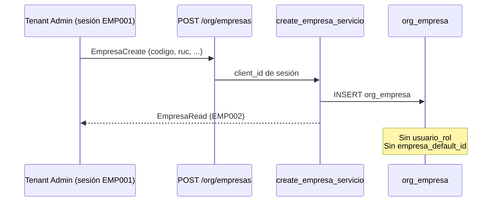
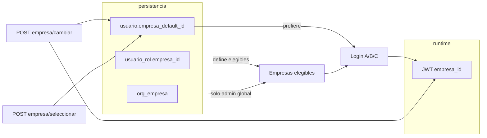
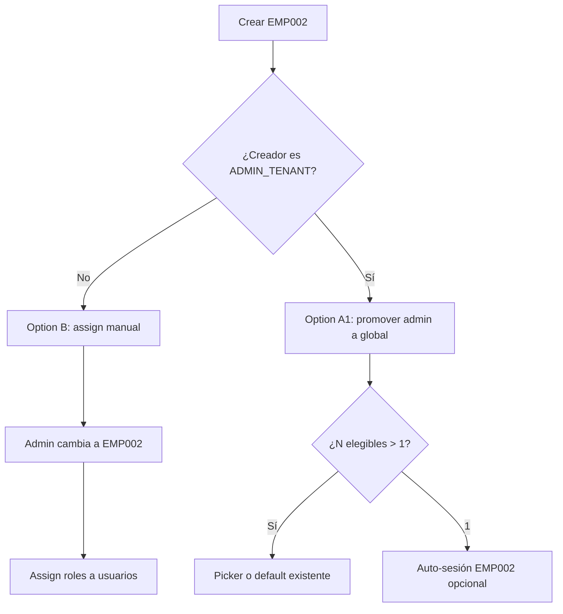

# Modelo oficial — Asignación de roles y acceso multiempresa

**Tipo:** Auditoría funcional (sin cambios de código)  
**Fecha:** 2026-05-31  
**Referencias:** [MULTIEMPRESA_OFFICIAL_MODEL.md](./MULTIEMPRESA_OFFICIAL_MODEL.md), [MULTIEMPRESA_M1_IMPLEMENTATION.md](./MULTIEMPRESA_M1_IMPLEMENTATION.md), [TENANT_ROLE_PERMISSION_MODEL_AUDIT.md](./TENANT_ROLE_PERMISSION_MODEL_AUDIT.md)  
**Alcance:** Usuario existente que debe operar en múltiples empresas del mismo tenant.

---

## 1. Resumen ejecutivo

| Pregunta | Respuesta corta |
|----------|-----------------|
| ¿Crear EMP002 asigna automáticamente `ADMIN_TENANT`? | **No** en runtime. Solo inserta `org_empresa`. |
| ¿Excepción onboarding? | **Sí** — `MinimalErpTenantBootstrapService.vincular_admin_empresa()` vincula admin a EMP001 al crear tenant. |
| ¿Admin típico post-onboarding accede a EMP002 al crearla? | **No** — tiene `ADMIN_TENANT` **scoped** a EMP001; elegibilidad de sesión no incluye EMP002. |
| ¿Admin **global** (`usuario_rol.empresa_id IS NULL`)? | **Sí** — tras M1, ve todas las `org_empresa` activas; EMP002 aparece en elegibles **sin** nueva fila `usuario_rol`. |
| ¿Usuarios operativos (MANAGER/USER)? | **Siempre asignación explícita** por empresa, vía `POST /usuarios/.../roles/`. |

**Recomendación oficial:** modelo **híbrido** — Option A adaptada para el **creador `ADMIN_TENANT`**, Option B para **MANAGER/USER** y para admins que no crearon la empresa.

---

## 2. Flujo actual — Crear EMP002

### 2.1 Secuencia runtime



**Servicio:** `empresa_service.create_empresa_servicio()`  
**Endpoint:** `POST /api/v1/org/empresas` (`org.empresa.crear`)  
**Permiso:** tenant-scoped por `cliente_id`; **no** exige cambiar `empresa_id` de sesión para crear (ORG lista/crea a nivel tenant).

### 2.2 Qué escribe hoy `create_empresa_servicio`

| Artefacto | ¿Se modifica? | Detalle |
|-----------|:-------------:|---------|
| `org_empresa` | ✅ | INSERT fila nueva (EMP002) |
| `usuario_rol` | ❌ | No hay hook post-create |
| `usuario.empresa_default_id` | ❌ | No se toca |
| `rol_permiso` / `rol_menu_permiso` | ❌ | Grants son del rol, no por empresa |
| `cliente_modulo` | ❌ | Tenant-wide, ya existente |

### 2.3 ¿Se asigna automáticamente `ADMIN_TENANT` a EMP002?

**No**, en el flujo runtime de creación de empresa.

La única vinculación automática admin↔empresa ocurre en:

| Contexto | Servicio | Acción |
|----------|----------|--------|
| Onboarding tenant | `ClienteOnboardingService.crear_cliente_con_onboarding()` | Crea EMP001 + admin scoped |
| Repair / bootstrap | `MinimalErpTenantBootstrapService.vincular_admin_empresa()` | UPDATE/INSERT `usuario_rol` + `usuario.empresa_default_id` |
| Runtime `POST /org/empresas` | — | **No invoca** `vincular_admin_empresa` |

### 2.4 Impacto según tipo de admin

#### Admin scoped (caso habitual post-onboarding)

Onboarding inserta:

```text
usuario_rol: ADMIN_TENANT, empresa_id = EMP001
usuario.empresa_default_id = EMP001
```

Tras crear EMP002:

| Capacidad | Comportamiento actual |
|-----------|----------------------|
| Listar empresas (`GET /org/empresas`) | ✅ Ve EMP001 y EMP002 (tenant-wide) |
| Elegibles login / selector sesión | ❌ Solo EMP001 (`usuario_rol.empresa_id`) |
| Cambiar sesión a EMP002 | ❌ 400 — empresa no asignada |
| Operar ERP en EMP002 | ❌ Sin sesión válida |
| Asignar roles **en** EMP002 | ❌ Requiere sesión EMP002; admin no puede llegar sin elegibilidad |

**Conclusión:** el admin puede **registrar** EMP002 en catálogo org, pero **no puede operar ni administrar usuarios** en EMP002 con el flujo actual, salvo intervención platform o cambio de scope.

#### Admin global (`usuario_rol.empresa_id IS NULL`)

| Capacidad | Comportamiento (post-M1) |
|-----------|--------------------------|
| Elegibles login | Todas las `org_empresa` activas del tenant |
| Crear EMP002 | Aparece automáticamente en elegibles **sin** assign |
| Selector | Casos A/B/C según `empresa_default_id` |
| Asignar roles en EMP002 | Debe `cambiar` sesión a EMP002; assign usa empresa de sesión |

**Nota:** el onboarding **estándar** crea admin **scoped**, no global. Admin global requiere assign platform con `scope_global=true` o fallback DDL sin `empresa_id` en `usuario_rol`.

---

## 3. Modelo de negocio — Option A vs Option B

### 3.1 Option A (tal como se plantea)

> Crear empresa → asignar automáticamente `ADMIN_TENANT` de la empresa actual a la nueva empresa.

#### Restricción técnica crítica (UQ)

La aplicación asume **una fila por `(usuario_id, rol_id)`** en `UsuarioService.asignar_rol_a_usuario()`:

- No puede existir `ADMIN_TENANT` scoped a EMP001 **y** otra fila `ADMIN_TENANT` scoped a EMP002.
- Intentarlo → `409 ROLE_ASSIGNED_OTHER_EMPRESA`.

Por tanto, **Option A literal (segundo ADMIN scoped)** es **incompatible** con el modelo actual sin cambio de esquema (fase M3 / R-DATA-05).

#### Variantes viables de Option A

| Variante | Mecanismo | Efecto |
|----------|-----------|--------|
| **A1 — Global promotion** | Tras crear EMP002, `UPDATE usuario_rol SET empresa_id = NULL` para creador admin | Admin ve **todas** las org; coherente con semántica admin global |
| **A2 — Scope migration** | `UPDATE usuario_rol SET empresa_id = EMP002` (como `vincular_admin_empresa`) | Admin **pierde** scope explícito en EMP001; default migrado a EMP002 |
| **A3 — Hook vincular creador** | Invocar `vincular_admin_empresa(creator, EMP002)` post-create | Equivalente a A2 para el creador |
| **A4 — Multi-row same rol (futuro)** | Alinear DDL `UQ_usuario_rol_empresa` + servicio | Permite A literal; requiere M3 |

### 3.2 Option B

> Crear empresa → requerir asignación explícita de roles.

| Aspecto | Evaluación |
|---------|------------|
| **Estado actual** | ✅ Es lo que hace el runtime para MANAGER/USER y admin scoped |
| **Ventajas** | Trazabilidad; principio de mínimo privilegio; sin sorpresas de scope |
| **Riesgos / fricción** | Admin creador queda **bloqueado** en EMP002; UX confusa (ve empresa en listado ORG pero no en selector); requiere platform o workaround |
| **Operativos** | Admin debe cambiar sesión a empresa destino antes de assign (regla `EMPRESA_MISMATCH`) |

### 3.3 Matriz comparativa

| Criterio | Option A (A1 global promotion) | Option A (A2 scope migrate) | Option B (actual) |
|----------|-------------------------------|----------------------------|-------------------|
| Admin creador accede a EMP002 | ✅ Inmediato | ✅ Solo EMP002 | ❌ Sin paso extra |
| Admin conserva EMP001 | ✅ | ❌ | ✅ (scoped) |
| MANAGER/USER auto | ❌ (correcto) | ❌ | ❌ |
| Seguridad / auditoría | Media — promoción implícita | Media — migración implícita | Alta — explícito |
| Compatibilidad UQ actual | ✅ | ✅ | ✅ |
| Complejidad implementación | Baja–media | Baja | Ninguna (ya existe) |

---

## 4. Multiempresa — Cómo obtiene acceso un usuario existente

### 4.1 Modelo de tres capas (oficial post-M1)



| Concepto | Fuente | Función |
|----------|--------|---------|
| **Elegibilidad** | `usuario_rol.empresa_id` (+ fallback `org_empresa` si admin global) | Qué empresas puede elegir el usuario |
| **Preferida** | `usuario.empresa_default_id` | Auto-login cuando N>1 (M1) |
| **Activa** | JWT `empresa_id` | Scope ERP, RBAC, menú |

### 4.2 Camino: usuario operativo en segunda empresa

**Precondición:** usuario ya existe; tiene rol scoped en EMP001; debe operar también en EMP002.

```text
1. org_empresa          ← EMP002 ya existe (POST /org/empresas)
2. Admin con sesión EMP002  ← requiere ser elegible en EMP002 (problema para admin scoped)
3. POST /usuarios/{id}/roles/{rol_id}
      → INSERT usuario_rol (empresa_id = EMP002, rol_id ≠ rol ya usado en EMP001 si mismo código)
4. (M1) Si empresa_default_id IS NULL y queda 1 elegible → auto-set default
5. Login → Caso A/B/C según N y default
6. POST /auth/empresa/cambiar → alternar EMP001 ↔ EMP002
```

**Restricción rol repetido:** un mismo `rol_id` no puede estar en dos empresas. Multiempresa operativa típica:

| Patrón | Ejemplo | Válido hoy |
|--------|---------|:----------:|
| Roles distintos por empresa | MANAGER EMP001 + USER EMP002 | ✅ |
| Mismo rol dos empresas | USER EMP001 + USER EMP002 | ❌ (409) |
| Admin global | ADMIN NULL + 5 org | ✅ |

### 4.3 Tablas que deben poblarse

| Tabla | Obligatoria | Cuándo | Notas |
|-------|:-----------:|--------|-------|
| `org_empresa` | ✅ | Crear empresa | Catálogo tenant |
| `usuario_rol` | ✅ | Por cada usuario×rol×scope | Elegibilidad de sesión |
| `usuario.empresa_default_id` | Opcional | M1: assign mono / seleccionar / cambiar | Preferencia, no autorización |
| `usuario_rol.es_empresa_default` | ❌ runtime | Solo onboarding legacy | **Deprecated** (R-DATA-06) |
| `rol_permiso` | Indirecta | Ya en rol | No se duplica por empresa |
| `rol_menu_permiso` | Indirecta | Ya en rol | Idem |
| `cliente_modulo` | Preexistente | Tenant-wide | No por empresa |

### 4.4 Endpoints participantes

| Fase | Método | Ruta | Rol |
|------|--------|------|-----|
| Crear empresa | POST | `/api/v1/org/empresas` | Catálogo org |
| Listar empresas | GET | `/api/v1/org/empresas` | UI admin / validaciones |
| Crear usuario | POST | `/api/v1/usuarios/` | Sin elegibilidad aún |
| Asignar rol | POST | `/api/v1/usuarios/{usuario_id}/roles/{rol_id}/` | **Grant de elegibilidad** |
| Revocar rol | DELETE | `/api/v1/usuarios/{usuario_id}/roles/{rol_id}/` | Quita elegibilidad |
| Login | POST | `/api/v1/auth/login` | Resuelve A/B/C/D |
| Seleccionar | POST | `/api/v1/auth/empresa/seleccionar/` | Post-picker; persiste default (M1) |
| Cambiar | POST | `/api/v1/auth/empresa/cambiar/` | Selector header; persiste default (M1) |
| Perfil | GET | `/api/v1/auth/me` | `empresa_activa`, flags multiempresa |

**Regla assign (tenant admin):** `resolve_role_assign_target()` — scope = **empresa de sesión**; body con otra empresa → `403 EMPRESA_MISMATCH`.

---

## 5. UX recomendada — Tenant Admin crea EMP002

### 5.1 Comportamiento deseado vs actual

| Pregunta UX | Comportamiento actual | Recomendación oficial |
|-------------|---------------------|----------------------|
| ¿Debe poder acceder automáticamente? | ❌ Admin scoped no | ✅ **Sí** para creador `ADMIN_TENANT` (vía A1 global promotion o A3 vincular) |
| ¿Debe aparecer en selector? | Solo si elegible | ✅ Tras grant; inmediato si admin global |
| ¿Debe asignarse `empresa_default_id`? | ❌ No en create | ⚠️ **No automático** al crear empresa; solo si el admin **cambia/selecciona** EMP002 (M1) o si queda 1 elegible post-promotion |
| ¿Listado ORG vs selector sesión? | Divergen hoy | FE debe distinguir “empresas del tenant” vs “empresas operables por mí” |

### 5.2 Flujo UX propuesto (post-implementación futura)



### 5.3 Mensajes FE sugeridos

| Situación | Mensaje |
|-----------|---------|
| Empresa creada, admin scoped | “Empresa registrada. Para operar en ella, solicite acceso al administrador de plataforma o cambie el alcance de su rol.” (hasta implementar A1) |
| Post A1 | “Empresa creada. Ya puede seleccionarla en el selector de empresa.” |
| Assign operativo | “Usuario asignado a {empresa}. Deberá iniciar sesión o cambiar de empresa para operar allí.” |

---

## 6. Propuesta oficial

### 6.1 Reglas R-ASSIGN (nuevas — recomendadas)

| ID | Regla |
|----|-------|
| **R-ASSIGN-01** | Crear `org_empresa` **no** concede elegibilidad de sesión por sí solo. |
| **R-ASSIGN-02** | Elegibilidad = `usuario_rol.empresa_id` activo ∩ `org_empresa` activa; admin global (`empresa_id NULL`) → todas las org activas. |
| **R-ASSIGN-03** | `MANAGER_TENANT` y `USER_TENANT`: **siempre** Option B — assign explícito por empresa de sesión. |
| **R-ASSIGN-04** | Un `(usuario_id, rol_id)` → un solo scope; multiempresa con **mismo** código de rol requiere M3 o roles distintos. |
| **R-ASSIGN-05** | Tras crear empresa, el creador `ADMIN_TENANT` scoped **debe** obtener acceso operativo — **Option A1** (promoción a global) recomendada sobre A2 (migración de scope). |
| **R-ASSIGN-06** | `empresa_default_id` **no** se modifica al crear empresa; solo por seleccionar/cambiar/assign mono-empresa (M1). |
| **R-ASSIGN-07** | Assign rol exige sesión en empresa destino (tenant admin) o `empresa_id` explícito validado (platform). |

### 6.2 Decisión Option A vs B

| Actor | Decisión oficial |
|-------|------------------|
| **ADMIN_TENANT creador de EMP002** | **Option A1** — auto-promoción a rol global (`empresa_id NULL`) al confirmar creación exitosa |
| **ADMIN_TENANT no creador** | **Option B** — assign / promoción por platform |
| **MANAGER_TENANT / USER_TENANT** | **Option B** — assign explícito en sesión de empresa destino |
| **Admin ya global** | **Ninguna acción** — EMP002 entra en elegibles vía `org_empresa` |

**No recomendar** Option A literal (segundo `ADMIN_TENANT` scoped) hasta resolver UQ en M3.

### 6.3 Fases sugeridas (sin implementar en esta auditoría)

| Fase | Entregable | Depende de |
|------|------------|------------|
| **M4** (propuesta) | Hook post-create: `promote_creator_admin_to_global()` | R-ASSIGN-05 |
| **M4** | FE: distinguir empresas tenant vs operables | UX §5 |
| **M3** | Alinear UQ DDL ↔ servicio si se desea mismo rol en N empresas | R-DATA-05 |

### 6.4 Escenario de referencia — Admin crea EMP002 hoy (sin M4)

| Paso | Estado |
|------|--------|
| 1. Login admin (EMP001) | ✅ Sesión EMP001 |
| 2. POST /org/empresas → EMP002 | ✅ Fila org creada |
| 3. GET /org/empresas | ✅ Muestra EMP002 |
| 4. GET login elegibles / selector | ❌ Solo EMP001 |
| 5. POST /empresa/cambiar EMP002 | ❌ 400 no asignada |
| 6. Assign USER a EMP002 | ❌ Requiere sesión EMP002 |
| **Desbloqueo** | Platform: assign global admin **o** script `vincular_admin_empresa` / repair |

### 6.5 Escenario objetivo — Operativo en 2 empresas (oficial)

| Paso | Acción |
|------|--------|
| 1 | EMP001 y EMP002 existen en `org_empresa` |
| 2 | Admin (global o sesión EMP002) asigna `MANAGER_TENANT` scoped EMP001 |
| 3 | Admin en sesión EMP002 asigna `USER_TENANT` scoped EMP002 *(otro rol_id)* |
| 4 | Usuario login → 2 elegibles → Caso C o B según default |
| 5 | `POST /empresa/cambiar` alterna contexto ERP |

---

## 7. Hallazgos y brechas

| # | Hallazgo | Severidad | Regla afectada |
|---|----------|-----------|----------------|
| H1 | `create_empresa_servicio` no propaga acceso al creador admin scoped | **Alta** | R-ASSIGN-05 pendiente |
| H2 | Listado ORG ≠ elegibles sesión → confusión UX | Media | R-FE (futuro) |
| H3 | UQ `(usuario_id, rol_id)` impide Option A literal | Estructural | R-DATA-05 |
| H4 | Assign cross-empresa bloqueado por sesión (`EMPRESA_MISMATCH`) | By design | R-ASSIGN-07 |
| H5 | `vincular_admin_empresa` existe pero solo onboarding/repair | Oportunidad | Reutilizable en M4 |
| H6 | Onboarding crea admin scoped, no global | By design | Coherente con mínimo privilegio inicial |

---

## 8. Referencias de código (evidencia)

| Comportamiento | Ubicación |
|----------------|-----------|
| Create empresa sin assign | `empresa_service.create_empresa_servicio()` |
| Vincular admin (onboarding) | `MinimalErpTenantBootstrapService.vincular_admin_empresa()` |
| Elegibles login | `AuthService.get_empresa_activa_para_login()` |
| Assign rol scoped | `UsuarioService.asignar_rol_a_usuario()` + `resolve_role_assign_target()` |
| UQ conflicto mismo rol | `UsuarioService._validate_assign_scope_conflict()` |
| Persist preferida M1 | `empresa_preference.persist_usuario_empresa_default_id()` |

---

## 9. Conclusión

El sistema **separa catálogo org (`org_empresa`) de elegibilidad operativa (`usuario_rol`)**. Crear EMP002 es un acto de **catálogo**, no de **autorización**.

- **Hoy:** Option B de facto para todos los admins scoped; Option A parcial solo para admin global post-M1.
- **Oficial recomendado:** **híbrido** — Option **A1** (promoción global del creador admin) + Option **B** para operativos y admins no creadores.
- **No implementado en esta auditoría** — documento de decisión para fase M4+.

**Estado:** Auditoría completa — **sin cambios de código**.
