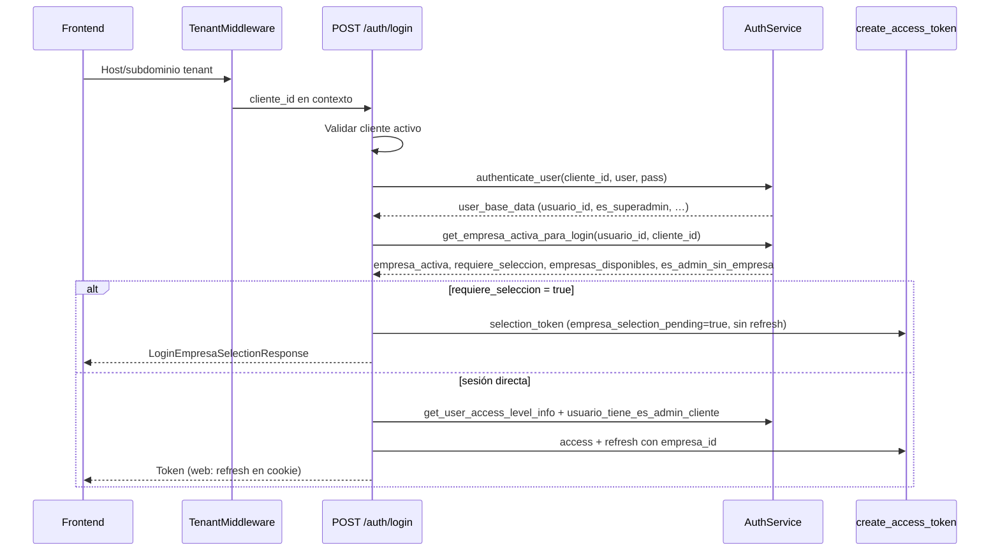
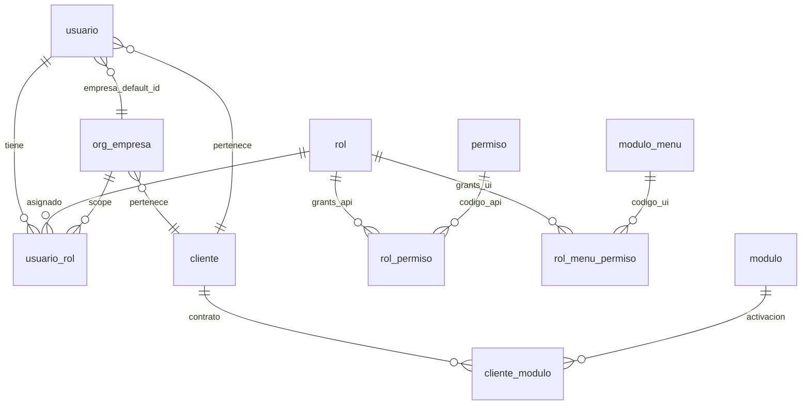
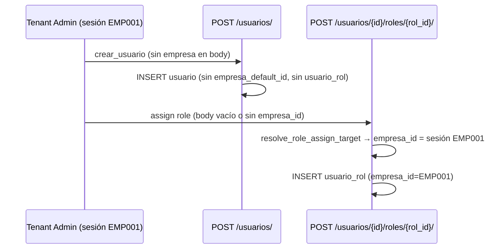

# Auditoría funcional — Sesión multiempresa (tenant)

**Fecha:** 2026-05-31  
**Alcance:** Congelar el modelo oficial de sesión multiempresa para `ADMIN_TENANT`, `MANAGER_TENANT` y `USER_TENANT`.  
**Tipo:** Auditoría funcional — **sin cambios de código**.  
**Roles excluidos del alcance operativo:** superadmin plataforma, impersonación (referenciados solo donde afectan el contrato).

---

## Resumen ejecutivo

El backend implementa un modelo **JWT-centric** de empresa activa:

| Concepto | Fuente de verdad runtime |
|----------|--------------------------|
| Empresa activa de sesión | Claim `empresa_id` en access/refresh JWT |
| Preferencia persistente de login | Columna `usuario.empresa_default_id` |
| Empresas elegibles | `usuario_rol.empresa_id` → `org_empresa` (activas) |
| Admin global sin filas por empresa | Fallback a todas las empresas de `org_empresa` del tenant |
| Permisos API | `rol_permiso` filtrado por roles en scope de empresa |
| Visibilidad menú UI | `rol_menu_permiso` filtrado por roles en scope de empresa |
| Módulos visibles | `cliente_modulo` (contrato comercial) |

**Hallazgos críticos para congelar:**

1. `usuario.empresa_default_id` evita pantalla de selección solo cuando hay **>1 empresa en `usuario_rol`**; no aplica al camino **admin global** (`usuario_rol.empresa_id IS NULL`), que **siempre** fuerza selección si existe al menos una fila en `org_empresa`.
2. `POST /auth/empresa/cambiar/` **no** persiste `empresa_default_id`.
3. `POST /usuarios/` **no** asigna empresa; la vinculación ocurre en `POST /usuarios/{id}/roles/{rol_id}/` usando la empresa de sesión del admin.
4. `usuario_rol.es_empresa_default` existe en esquema pero **no participa** en login ni resolución de sesión (solo onboarding/repair).
5. `MANAGER_TENANT` y `USER_TENANT` **no reciben** grants automáticos en onboarding; solo `ADMIN_TENANT` vía `OwnerSyncService`.
6. El menú ya **no eleva** `tenant_admin` (`as_tenant_admin=False` en producción); todos los roles tenant usan `rol_menu_permiso`.

---

## 1. Login — `POST /api/v1/auth/login/`

### 1.1 Flujo completo



**Archivos clave:**

| Paso | Ubicación |
|------|-----------|
| Endpoint | `app/modules/auth/presentation/endpoints.py` → `login()` |
| Autenticación | `AuthService.authenticate_user()` |
| Resolución empresa | `AuthService.get_empresa_activa_para_login()` |
| Nivel / user_type | `AuthService.get_user_access_level_info()` |
| Emisión JWT | `app/core/security/jwt.py` → `create_access_token()` |

**Entrada:** `OAuth2PasswordRequestForm` (username, password). El tenant se resuelve por middleware (subdominio), no por body.

**Salida posible:**

| Respuesta | Condición |
|-----------|-----------|
| `Token` (200) | Sesión completa: access (+ refresh según `X-Client-Type`) |
| `LoginEmpresaSelectionResponse` (200) | `requiere_seleccion_empresa=true` + `selection_token` (sin refresh) |

### 1.2 Cómo se determina la empresa activa

Función: `AuthService.get_empresa_activa_para_login()` (`auth_service.py` ~L366–533).

**Algoritmo (orden real):**

1. **Bypass plataforma:** si `es_superadmin` o `user_type == platform_admin` → sin empresa, sin selección.
2. **Empresas disponibles (primaria):** `DISTINCT usuario_rol.empresa_id` unido a `org_empresa` activa:
   ```sql
   SELECT DISTINCT oe.empresa_id, oe.razon_social, oe.nombre_comercial
   FROM usuario_rol ur
   INNER JOIN org_empresa oe ON oe.empresa_id = ur.empresa_id
   WHERE ur.usuario_id = :usuario_id
     AND ur.cliente_id = :cliente_id
     AND ur.es_activo = 1
     AND ur.empresa_id IS NOT NULL
     AND oe.es_activo = 1
   ORDER BY oe.razon_social
   ```
3. **Flag admin global:** `COUNT(*)` de `usuario_rol` con `empresa_id IS NULL` y activo → `es_admin_sin_empresa`.
4. **Preferencia:** leer `usuario.empresa_default_id` (query adaptada a `database_type` single/multi).
5. **Selección obligatoria (regla general):**
   ```python
   requiere_seleccion = len(empresas_disponibles) > 1 and empresa_default_id is None
   ```
6. **Fallback admin global:** si `es_admin_sin_empresa` y `empresas_disponibles` vacío:
   - Listar **todas** las empresas activas de `org_empresa` del tenant.
   - Si hay al menos una → `empresas_disponibles = org_empresa` y **`requiere_seleccion = True`** (forzado, ignora `empresa_default_id`).
7. **Resolución `empresa_activa`:**
   - Si `requiere_seleccion` → `None`.
   - Si hay empresas y no requiere selección:
     - Si `empresa_default_id ∈ empresas_disponibles` → usar default.
     - Si no → **primera empresa** de la lista (`ORDER BY razon_social`).

### 1.3 Cuándo se solicita selección de empresa

| Condición | Selección |
|-----------|-----------|
| Múltiples empresas en `usuario_rol` y `empresa_default_id IS NULL` | **Sí** |
| Múltiples empresas y `empresa_default_id` válido en el conjunto | **No** (auto-login con default) |
| Una sola empresa en `usuario_rol` | **No** (auto-login con esa empresa) |
| Admin global (`usuario_rol.empresa_id IS NULL`) y ≥1 fila en `org_empresa` | **Sí** (incluso con 1 sola empresa org) |
| Admin global y 0 empresas en `org_empresa` | **No** (onboarding sin `empresa_id`) |
| Usuario sin empresas ni rol global | **No** (login sin `empresa_id`) |
| Superadmin plataforma | **No** |

**Contrato selection token:**

- Claim `empresa_selection_pending: true`
- Sin claim `empresa_id`
- Sin refresh token
- Endpoints ERP (`/auth/menu`, `/auth/permissions/me`, INV, ORG company-scoped) → **409** hasta completar selección

### 1.4 Cuándo se usa `empresa_default_id`

| Momento | ¿Usa `usuario.empresa_default_id`? |
|---------|-------------------------------------|
| Login multi-empresa (`usuario_rol` con >1 empresa) | **Sí** — evita selección si está definido y pertenece al conjunto |
| Login admin global vía `org_empresa` | **No** — selección forzada |
| `POST /auth/empresa/seleccionar/` | **No** — no escribe en BD |
| `POST /auth/empresa/cambiar/` | **No** — no escribe en BD |
| Refresh token | **No** — hereda `empresa_id` del refresh JWT |

**Campo relacionado no usado en login:** `usuario_rol.es_empresa_default` (solo onboarding en `cliente_onboarding_service` / `minimal_erp_tenant_bootstrap_service`).

---

## 2. Usuario ↔ Empresa — Modelo de datos

### 2.1 Tablas involucradas



### 2.2 `usuario`

| Columna | Rol en multiempresa |
|---------|---------------------|
| `usuario_id` | PK |
| `cliente_id` | Tenant |
| `empresa_default_id` | FK → `org_empresa`. Preferencia de login cuando hay múltiples empresas vía `usuario_rol`. Nullable. |
| `es_activo`, `es_eliminado` | Elegibilidad de login |

**Esquema:** `app/bootstrap_v2/01_schema/V020__tablas_bd_central.sql` (~L300–337).

### 2.3 `usuario_rol`

| Columna | Rol en multiempresa |
|---------|---------------------|
| `usuario_id`, `rol_id`, `cliente_id` | Asignación rol ↔ usuario ↔ tenant |
| `empresa_id` | **Scope de empresa.** `NULL` = rol global del tenant (típico admin onboarding). |
| `es_empresa_default` | Marcador onboarding; **no usado en auth runtime** |
| `es_activo`, `fecha_expiracion` | Vigencia |

**UQ:** `(usuario_id, rol_id, empresa_id)` — una fila por rol y scope de empresa.

**Filtro RBAC/menú con empresa activa:**

```sql
AND (ur.empresa_id IS NULL OR ur.empresa_id = :empresa_id)
```

(`app/core/tenant/empresa_context.py` → `sql_empresa_filter_usuario_rol`)

Interpretación: en sesión con `empresa_id = EMP001`, aplican roles **globales** del tenant **más** roles **específicos de EMP001**.

### 2.4 `org_empresa`

| Columna | Uso |
|---------|-----|
| `empresa_id` | Identificador de empresa dentro del tenant |
| `cliente_id` | Tenant propietario |
| `razon_social`, `nombre_comercial` | Mostrados en selector de login |
| `es_activo` | Filtro en listados y validación de sesión |

Fuente secundaria de empresas disponibles para **admin global** sin filas `usuario_rol` por empresa.

### 2.5 `empresa_default_id` — resumen de responsabilidades

| Responsabilidad | Tabla/columna actual |
|-----------------|----------------------|
| Preferencia de login | `usuario.empresa_default_id` |
| Scope de rol | `usuario_rol.empresa_id` |
| Empresa activa de sesión | JWT `empresa_id` (efímero) |
| Marcador histórico onboarding | `usuario_rol.es_empresa_default` (legacy) |

---

## 3. Casos reales A–D

### Caso A — Usuario con 1 empresa

**Precondición BD:**

- Una fila `usuario_rol` activa con `empresa_id = EMP001`.
- `org_empresa` activa para EMP001.

| Aspecto | Comportamiento |
|---------|----------------|
| **Login esperado (modelo recomendado)** | Sesión directa con `empresa_id = EMP001` |
| **Login actual** | ✅ Igual: `requiere_seleccion=false`, `empresa_activa=EMP001`, JWT con `empresa_id` |
| **Endpoints** | `POST /auth/login/` → `Token` |
| **Tablas** | `usuario`, `usuario_rol`, `org_empresa` |

**JWT / user_data:** roles filtrados por EMP001; `user_type` según `nivel_acceso` del rol en scope.

---

### Caso B — Múltiples empresas + `empresa_default_id` informado

**Precondición BD:**

- `usuario_rol` activo en EMP001 y EMP002.
- `usuario.empresa_default_id = EMP002` (válido en conjunto).

| Aspecto | Comportamiento |
|---------|----------------|
| **Login esperado** | Sesión directa con EMP002 |
| **Login actual** | ✅ `requiere_seleccion=false`, `empresa_activa=EMP002` |
| **Endpoints** | `POST /auth/login/` → `Token` |
| **Tablas** | `usuario.empresa_default_id`, `usuario_rol`, `org_empresa` |

---

### Caso C — Múltiples empresas + `empresa_default_id NULL`

**Precondición BD:**

- `usuario_rol` en EMP001 y EMP002.
- `usuario.empresa_default_id IS NULL`.

| Aspecto | Comportamiento |
|---------|----------------|
| **Login esperado** | Pantalla de selección → confirmación → sesión |
| **Login actual** | ✅ `LoginEmpresaSelectionResponse` con `selection_token` |
| **Endpoints** | `POST /auth/login/` → selection; `POST /auth/empresa/seleccionar/` → `Token` |
| **Tablas** | `usuario_rol`, `org_empresa` (listado), `usuario` (default NULL) |

**Post-selección:** JWT con `empresa_id` elegido; selection token blacklisteado por `jti`.

---

### Caso D — Usuario sin empresa

**Subcasos:**

#### D1 — Usuario operativo sin `usuario_rol` con empresa

**Precondición:** ningún `usuario_rol.empresa_id` activo; no admin global.

| Aspecto | Comportamiento |
|---------|----------------|
| **Login esperado (recomendado)** | Rechazar login o forzar onboarding admin |
| **Login actual** | ⚠️ Login **exitoso** sin `empresa_id` en JWT |
| **Endpoints post-login** | `GET /auth/me/` ✅; `GET /auth/menu` ❌ 403; `GET /auth/permissions/me` ❌ 403; módulos ERP con `require_erp_session` ❌ 403 |
| **Tablas** | `usuario`, `usuario_rol` (vacío o solo roles inactivos) |

#### D2 — Admin tenant global en onboarding (0 empresas org)

**Precondición:** `usuario_rol` con `empresa_id IS NULL`, rol `ADMIN_TENANT`; `org_empresa` vacío.

| Aspecto | Comportamiento |
|---------|----------------|
| **Login esperado** | Sesión sin empresa para crear primera empresa |
| **Login actual** | ✅ Token sin `empresa_id`; log explícito "admin sin empresa (onboarding)" |
| **Endpoints** | Rutas tenant-wide ORG (`require_org_tenant_erp_session`) accesibles; company-scoped requieren empresa |
| **Tablas** | `usuario_rol`, `org_empresa` |

#### D3 — Admin global con empresas en org pero sin `usuario_rol` por empresa

**Precondición:** rol global admin; ≥1 fila `org_empresa`.

| Aspecto | Comportamiento |
|---------|----------------|
| **Login esperado** | Selección (o default si se unifica regla) |
| **Login actual** | ✅ **Siempre** `requiere_seleccion=true` aunque haya 1 sola empresa org; **ignora** `empresa_default_id` |
| **Endpoints** | Igual que Caso C |
| **Tablas** | `usuario_rol` (global), `org_empresa` |

---

## 4. Cambio de empresa

### 4.1 Endpoints

| Acción | Método | Ruta | Auth |
|--------|--------|------|------|
| Confirmar tras login multi-empresa | POST | `/api/v1/auth/empresa/seleccionar/` | `selection_token` |
| Cambiar en sesión operativa | POST | `/api/v1/auth/empresa/cambiar/` | Access token normal |

**Body común:** `{ "empresa_id": "<uuid>", "refresh_token": "..." }` (refresh solo móvil en cambiar).

### 4.2 Cómo cambia la empresa activa

Ambos flujos convergen en `AuthService.emitir_sesion_completa_con_empresa()`:

1. Validar empresa: `validar_empresa_para_sesion()` — debe estar en `empresas_disponibles` de `get_empresa_activa_para_login()` y activa en `org_empresa`.
2. Recalcular `user_data`: roles, `access_level`, `user_type`, `es_admin_cliente` **filtrados por nueva empresa**.
3. Emitir nuevo access + refresh JWT con nuevo `empresa_id`.
4. Rotar refresh (web: cookie; mobile: body).
5. Auditar (`empresa_seleccionada` / `empresa_cambiada`).

**ContextVar:** `current_empresa_id` se repuebla desde el nuevo JWT en dependencias (`deps` / I0).

### 4.3 ¿Actualiza `empresa_default_id`?

| Operación | Persiste `usuario.empresa_default_id` |
|-----------|--------------------------------------|
| `POST /auth/empresa/seleccionar/` | **No** |
| `POST /auth/empresa/cambiar/` | **No** |

La preferencia solo se escribe hoy en:

- Onboarding admin (`cliente_onboarding_service._insertar_usuario_admin`)
- Repair/bootstrap (`minimal_erp_tenant_bootstrap_service.vincular_admin_empresa`)

### 4.4 ¿Debería actualizarlo? (recomendación — sin implementar)

| Escenario | Recomendación |
|-----------|--------------|
| `seleccionar` (primera elección post-login) | **Opcional persistir** si se desea recordar elección en próximo login (Caso C) |
| `cambiar` (selector header) | **Sí, recomendado** persistir como nueva preferencia (`empresa_default_id`) para alinear UX “empresa favorita” con login |
| Admin global | Unificar regla: respetar `empresa_default_id` también en fallback `org_empresa` |

---

## 5. Menú — `GET /api/v1/auth/menu`

### 5.1 Cadena de construcción

```
GET /auth/menu
  └─ require_erp_session (empresa_id obligatorio salvo platform_admin)
  └─ MenuResolverService.get_menu_for_user()
       ├─ PermissionResolver.get_effective_permissions()  → rol_permiso
       └─ ModuloMenuService.obtener_menu_usuario()        → rol_menu_permiso
            ├─ Query 1 (BD CENTRAL): modulo + modulo_menu ⋈ cliente_modulo
            └─ Query 2 (BD TENANT): rol_menu_permiso ⋈ usuario_rol
  └─ menu_permission_resolver.resolve_required_permissions_for_menu_tree()
```

**Archivos:** `endpoints.py` `get_menu()`, `menu_resolver.py`, `modulo_menu_service.py`.

### 5.2 Dependencia de `cliente_modulo`

Query 1 exige JOIN con `cliente_modulo`:

- `esta_activo = 1`
- `fecha_vencimiento IS NULL OR > now()`

Sin fila en `cliente_modulo`, el módulo **no aparece** en el árbol de menú aunque existan grants RBAC.

### 5.3 Dependencia de `rol_menu_permiso`

Query 2 (usuarios tenant normales):

- Join `rol_menu_permiso` ↔ `usuario_rol` del usuario
- Filtro `puede_ver = 1`
- Filtro scope empresa: `(ur.empresa_id IS NULL OR ur.empresa_id = sesión)`
- Agregación `MAX()` por acción UI (ver, crear, editar, …)

**Excepciones:**

| Condición | Comportamiento menú |
|-----------|---------------------|
| `is_super_admin` plataforma (no impersonación) | Menú elevado: todos los ítems contratados con permisos UI completos |
| Impersonación | Menú del rol `ADMIN_TENANT` del tenant, filtrado por permisos impersonados |
| `as_tenant_admin=True` | **Ignorado** en runtime (Modelo Owner M2) |

### 5.4 Dependencia de `rol_permiso`

`rol_permiso` **no filtra** ítems del sidebar directamente.

Se usa para:

1. `GET /auth/permissions/me` (lista plana de códigos API).
2. Metadata `required_permission` en nodos del menú (inferencia post-árbol vía `menu_permission_resolver`).
3. Validación `require_permission(...)` en endpoints.

**Consecuencia:** un ítem puede ser **visible** en menú (`rol_menu_permiso`) pero la API subyacente **falla 403** si falta el código en `rol_permiso`.

### 5.5 Claims JWT relevantes para menú

- `empresa_id` → filtra `usuario_rol` en Query 2
- `user_type`, `is_super_admin` → elevación platform
- Impersonación → pipeline alternativo

---

## 6. Roles — `ADMIN_TENANT` vs `MANAGER_TENANT` vs `USER_TENANT`

### 6.1 Definición en bootstrap

Fuente: `cliente_onboarding_service.ROLES_BASE` y seeds `D010__seed_bd_central.sql`.

| Rol | `codigo_rol` | `nombre` UI | `nivel_acceso` | `es_admin_cliente` | `user_type` JWT* |
|-----|--------------|-------------|----------------|--------------------|------------------|
| Admin tenant | `ADMIN_TENANT` | Administrador | 5 | 1 | `tenant_admin` |
| Supervisor | `MANAGER_TENANT` | Supervisor | 3 | 0 | `user` |
| Usuario | `USER_TENANT` | Usuario | 1 | 0 | `user` |

\* `user_type` se calcula en `get_user_access_level_info()`: `>=4` → `tenant_admin`; `SUPER_ADMIN` nivel 5 → `platform_admin`; resto → `user`. **MANAGER no produce `tenant_admin`.**

### 6.2 Qué puede ver cada uno

| Capacidad | ADMIN_TENANT | MANAGER_TENANT | USER_TENANT |
|-----------|--------------|----------------|-------------|
| Grants API (`rol_permiso`) onboarding | ✅ Automático (`OwnerSyncService` + grants globales) | ❌ Manual / futuro bundle | ❌ Manual / futuro bundle |
| Grants UI (`rol_menu_permiso`) onboarding | ✅ Automático (OwnerSync) | ❌ Manual | ❌ Manual |
| Bypass menú elevado | ❌ (Modelo Owner) | ❌ | ❌ |
| `es_admin_cliente` en JWT | ✅ true (si rol en scope) | false | false |
| `require_admin` (RoleChecker "Administrador") | ✅ por nombre rol | ❌ | ❌ |
| Listar todas las empresas tenant (`GET /org/empresa`) | ✅ tenant-wide | Según permisos asignados | Según permisos asignados |
| Crear usuarios | ✅ con `admin.usuario.crear` | Solo si tiene permiso explícito | Solo si tiene permiso explícito |
| Asignar rol scoped a sesión | ✅ empresa de sesión | ✅ misma regla | ✅ misma regla |

### 6.3 Qué determina el menú (actual)

1. `cliente_modulo` (módulo contratado)
2. `modulo_menu` (catálogo activo/visible)
3. `rol_menu_permiso` del rol(es) del usuario en scope de `empresa_id` sesión
4. Elevación solo para superadmin plataforma

### 6.4 Qué determina permisos API (actual)

1. `PermissionResolver` → `obtener_codigos_permiso_usuario()`
2. Cadena: `usuario_rol` → `rol_permiso` → `permiso`
3. Filtro módulos: `permiso.modulo_id` ∈ módulos activos en `cliente_modulo`
4. Filtro empresa: `(ur.empresa_id IS NULL OR ur.empresa_id = sesión)`
5. Enforcement: `require_permission("modulo.accion")` sobre lista cargada en `build_user_with_roles`

**Cache:** opcional vía `PERMISSION_RESOLVER_CACHE_ENABLED` (clave incluye `empresa_id`).

---

## 7. Administración de usuarios — Tenant Admin crea usuario en EMP001

### 7.1 Flujo actual



### 7.2 Preguntas de negocio

| Pregunta | Respuesta actual |
|----------|------------------|
| ¿Debe asignarse automáticamente EMP001 al crear usuario? | **Recomendado sí** para UX tenant; **hoy no** en un solo paso |
| ¿El sistema lo hace hoy? | **Parcialmente:** solo al **asignar rol**, no al crear usuario |
| ¿Dónde ocurre? | `company_scope.resolve_role_assign_target()` → `UsuarioService.asignar_rol_a_usuario()` con `target_empresa_id=session_empresa` |

**Detalle `crear_usuario`:** INSERT en `usuario` **sin** `empresa_default_id` ni fila `usuario_rol` (`user_service.py` ~L779–789).

**Detalle assign:** Tenant admin **no puede** asignar rol global (`scope_global`); body con `empresa_id` distinta a sesión → 403 `EMPRESA_MISMATCH`.

### 7.3 Gap operativo

Usuario recién creado **sin rol** cae en **Caso D1** (login sin empresa) hasta que un admin asigne rol scoped.

---

## 8. `rol_permiso` vs `rol_menu_permiso`

### 8.1 ¿Existe sincronización automática?

| Mecanismo | Qué sincroniza | Roles | Cuándo |
|-----------|----------------|-------|--------|
| `OwnerSyncService.sync_module_for_owner()` | **Ambas tablas** para módulo activado | Solo `ADMIN_TENANT` | Onboarding tenant / activación módulo comercial |
| `OnboardingMenuBootstrapService` | Delega a OwnerSync | ADMIN_TENANT | Legacy repair |
| `permission_sync_service` | Catálogo `permiso` desde rutas API | No toca grants por rol | Startup app |
| Asignación manual / SQL QA (`D020`) | `rol_permiso` masivo por nombre "Administrador" | ADMIN_TENANT | Scripts QA |

**No existe** job que mantenga `rol_menu_permiso` alineado con `rol_permiso` para `MANAGER_TENANT` / `USER_TENANT` ni propagación automática entre tablas fuera de OwnerSync.

### 8.2 Divergencias posibles

| Escenario | Resultado |
|-----------|-----------|
| `rol_permiso` poblado, `rol_menu_permiso` vacío | Menú vacío / sin módulo; APIs pueden responder si permiso API existe |
| `rol_menu_permiso` poblado, `rol_permiso` vacío | Sidebar visible; APIs 403 en `require_permission` |
| Módulo desactivado en `cliente_modulo` | Permisos API filtrados; menú sin módulo (JOIN) |
| Rol scoped solo en EMP002, sesión EMP001 | Ni menú ni permisos de ese rol |

### 8.3 Matriz permisos vs menú

| Estado | ¿Menú? | ¿API? |
|--------|--------|-------|
| Solo `rol_permiso` | No / parcial | Sí |
| Solo `rol_menu_permiso` | Sí | No |
| Ambos alineados | Sí | Sí |
| Ninguno | No | No |

---

## 9. Propuesta final — Modelo oficial recomendado (sin implementar)

### 9.1 Principios

1. **Sesión:** `empresa_id` en JWT es la única fuente de verdad operativa por request.
2. **Preferencia:** `usuario.empresa_default_id` es preferencia persistente de login (no sustituye validación de asignación).
3. **Asignación:** `usuario_rol.empresa_id` define elegibilidad; NULL = rol global tenant.
4. **Separación UI/API:** menú ← `rol_menu_permiso`; API ← `rol_permiso`; sincronización owner solo garantizada para `ADMIN_TENANT`.
5. **Contrato ERP:** rutas operativas exigen `require_erp_session` (empresa presente).

### 9.2 Reglas oficiales propuestas

#### Login

| Regla | Descripción |
|-------|-------------|
| L1 | Si exactamente 1 empresa elegible vía `usuario_rol` → login directo con esa empresa |
| L2 | Si >1 empresa elegible y `empresa_default_id` válido → login directo con default |
| L3 | Si >1 empresa elegible y sin default → selection flow |
| L4 | Admin global: empresas elegibles = unión(`usuario_rol` por empresa, `org_empresa` activas); **aplicar L1–L3 también aquí** (corregir selección forzada actual) |
| L5 | Sin empresas elegibles y sin rol global admin → **rechazar login** con mensaje claro (hoy: login huérfano) |
| L6 | Admin onboarding sin empresas org → sesión sin `empresa_id` permitida |

#### Cambio de empresa

| Regla | Descripción |
|-------|-------------|
| C1 | `cambiar` valida pertenencia igual que `seleccionar` |
| C2 | **Persistir** `usuario.empresa_default_id` en `cambiar` (y opcionalmente en primera `seleccionar`) |
| C3 | Invalidar cache permisos del usuario tras cambio |

#### Administración de usuarios

| Regla | Descripción |
|-------|-------------|
| U1 | Crear usuario desde sesión EMP00x → opción A: asignar rol default scoped en mismo flujo; opción B: exigir assign rol antes de primer login |
| U2 | Tenant admin solo asigna roles en su `empresa_id` de sesión |
| U3 | Platform admin puede asignar global (`empresa_id NULL`) |

#### RBAC

| Regla | Descripción |
|-------|-------------|
| R1 | `ADMIN_TENANT`: OwnerSync mantiene paridad módulo ↔ (`rol_permiso`, `rol_menu_permiso`) |
| R2 | `MANAGER_TENANT` / `USER_TENANT`: bundles explícitos documentados; sin bypass de menú |
| R3 | Toda pantalla nueva debe registrar permiso API **y** grant de menú coherente |

### 9.3 Responsabilidades backend

| Área | Responsabilidad |
|------|-----------------|
| Auth | Resolución empresa login; emisión JWT; selection/cambiar; validación scope |
| Tenant scope | `company_scope`, `empresa_context`, `require_erp_session` |
| RBAC API | `PermissionResolver`, `require_permission`, `rol_permiso` |
| RBAC UI | `MenuResolver`, `ModuloMenuService`, `rol_menu_permiso` |
| Onboarding | OwnerSync ADMIN_TENANT; bootstrap org + admin |
| Users | CRUD usuario; assign/revoke rol scoped |
| Billing | `cliente_modulo` como gate comercial |

### 9.4 Responsabilidades frontend

| Área | Responsabilidad |
|------|-----------------|
| Login | Manejar `Token` vs `LoginEmpresaSelectionResponse`; guardar tokens |
| Selección | UI picker + `POST /empresa/seleccionar/` con selection token |
| Selector header | `POST /empresa/cambiar/`; refrescar `user_data`, permisos y menú |
| Bootstrap | Tras sesión: `GET /auth/me`, `GET /auth/permissions/me`, `GET /auth/menu` |
| Guards | No navegar a ERP sin `empresa_activa` / 409 selection pending |
| Admin usuarios | Tras crear usuario, flujo assign rol (hoy obligatorio implícito) |
| Permisos UI | Usar `required_permission` del menú + lista `permissions/me` para acciones |

### 9.5 Contrato JWT congelado (sesión completa)

```json
{
  "sub": "nombre_usuario",
  "cliente_id": "<uuid tenant>",
  "empresa_id": "<uuid empresa activa | ausente solo onboarding/platform>",
  "access_level": 1,
  "user_type": "tenant_admin | user | platform_admin",
  "is_super_admin": false,
  "es_admin_cliente": true,
  "type": "access",
  "jti": "<uuid>"
}
```

**Ausente en sesión completa:** `empresa_selection_pending`.

---

## 10. Matriz de endpoints auth multiempresa

| Endpoint | Selection token | Sesión sin empresa | Sesión con empresa |
|----------|-----------------|--------------------|--------------------|
| `POST /auth/login/` | N/A | N/A | N/A |
| `POST /auth/empresa/seleccionar/` | ✅ requerido | — | 409 |
| `POST /auth/empresa/cambiar/` | 409 | 403* | ✅ |
| `GET /auth/me/` | 409 | ✅ | ✅ |
| `GET /auth/permissions/me` | 409 | 403* | ✅ |
| `GET /auth/menu` | 409 | 403* | ✅ |
| Módulos INV (ERP) | 409 | 403* | ✅ |

\* Salvo `platform_admin` / impersonación documentada.

---

## 11. Referencias de código

| Tema | Archivo |
|------|---------|
| Login + selección/cambio | `app/modules/auth/presentation/endpoints.py` |
| Resolución empresa login | `app/modules/auth/application/services/auth_service.py` |
| JWT claims | `app/core/security/jwt.py` |
| Sesión ERP | `app/api/deps_auth.py` |
| Scope assign rol | `app/core/tenant/company_scope.py` |
| Filtro empresa RBAC | `app/core/tenant/empresa_context.py` |
| Permisos API | `app/core/authorization/permission_resolver.py` |
| Menú | `app/core/authorization/menu_resolver.py` |
| Menú + rol_menu_permiso | `app/modules/modulos/application/services/modulo_menu_service.py` |
| Owner sync RP/RMP | `app/modules/tenant/application/services/owner_sync_service.py` |
| Crear usuario | `app/modules/users/application/services/user_service.py` |
| Roles base | `app/modules/tenant/application/services/cliente_onboarding_service.py` |
| Contrato FE | `app/docs/pruebas/FLUJO_AUTH_MULTIEMPRESA_FE.md` |
| Tests unitarios sesión | `tests/unit/test_empresa_sesion_auth.py` |

---

## 12. Conclusión

El modelo runtime actual es **coherente y usable** para usuarios con asignación explícita `usuario_rol.empresa_id`, con selection flow bien delimitado. Los puntos a **congelar como deuda funcional** antes de RC producción multiempresa:

1. Admin global fuerza selección ignorando `empresa_default_id`.
2. Usuario sin empresa puede autenticarse pero no operar (Caso D1 ambiguo).
3. `cambiar` no persiste preferencia.
4. Creación de usuario no vincula empresa en un paso.
5. Divergencia estructural `rol_permiso` / `rol_menu_permiso` fuera de ADMIN_TENANT.
6. `MANAGER_TENANT` comparte `user_type=user` con operativo estándar pese a `nivel_acceso=3`.

Este documento define el **comportamiento actual verificado** y las **reglas oficiales recomendadas** para alinear producto, backend y frontend sin modificar código en esta auditoría.
