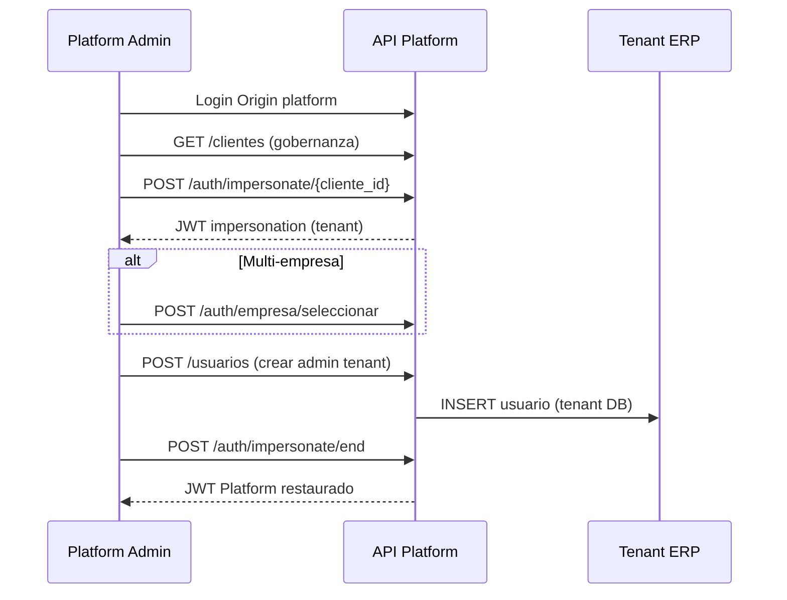

# Fase A — Auditoría técnica y plan de ejecución (Backend Platform Ready)

**Fecha:** 2026-06-02  
**Referencias:** `PLATFORM_BACKEND_FINAL_CLOSURE_AUDIT.md` (F-001, F-002, F-004, F-006, F-020), código actual en `base_multi_tenant_fastapi`.  
**Alcance:** Re-verificación en código **antes** de implementar. Sin cambios de código, sin commits, sin reparaciones.

---

## 1. Objetivo de la Fase A

Cerrar los **4 hallazgos obligatorios de implementación** acordados:

| Orden | ID | Título | Severidad |
|-------|-----|--------|-----------|
| 1 | F-001 | Reactivación de cliente | P0 |
| 2 | F-002 | Unificación `UUID` `cliente_id` en Superadmin | P0 |
| 3 | F-004 | Paginación módulos (`total` incorrecto) | P1 |
| 4 | F-006 | Auth Config alineado a `platform_admin` | P1 |

Además: **propuesta documental F-020** (impersonación oficial Platform → Tenant).

---

## 2. Metodología de re-auditoría

Para cada hallazgo:

1. Lectura del código fuente actual (servicio → endpoint → schema).
2. Confirmación de que el defecto **sigue presente** (sí/no + evidencia).
3. Inventario de archivos y contratos afectados.
4. Riesgos de regresión.
5. Plan de implementación paso a paso y criterios de aceptación.
6. Pruebas recomendadas (sin implementar aún).

---

## 3. F-001 — Reactivación de cliente (P0)

### 3.1 Confirmación: el problema **sigue existiendo**

**Evidencia en código (2026-06-02):**

**Desactivación lógica** — `ClienteService.eliminar_cliente`:

```445:450:app/modules/tenant/application/services/cliente_service.py
        UPDATE cliente
        SET es_activo = 0,
            estado_suscripcion = 'cancelado',
            fecha_actualizacion = GETDATE()
        WHERE cliente_id = ?
```

**Activación vía endpoint dedicado** — `ClienteService.activar_cliente`:

```232:235:app/modules/tenant/application/services/cliente_service.py
        UPDATE cliente
        SET estado_suscripcion = 'activo',
            fecha_actualizacion = GETDATE()
```

No actualiza `es_activo`. El `OUTPUT` incluye `INSERTED.es_activo`, que permanece en `0` tras un DELETE lógico.

**Listado por defecto** — `ClienteService.listar_clientes`:

```484:485:app/modules/tenant/application/services/cliente_service.py
        if solo_activos:
            where_conditions.append("es_activo = 1")
```

**Efecto encadenado:** cliente “reactivado” con `PUT .../activar/` queda con `estado_suscripcion='activo'` pero `es_activo=0` → invisible en listado default y bloqueado en:

- `get_branding_by_cliente` / `get_branding_by_subdomain` (rechazo si `es_activo` false)
- `ImpersonationService.iniciar_impersonacion` (`if not cliente.es_activo` → 404)

**Workaround existente (no documentado como oficial):** `PUT /clientes/{id}/` con `ClienteUpdate.es_activo=true` sí persiste `es_activo` vía `actualizar_cliente`.

### 3.2 Archivos, servicios y endpoints afectados

| Capa | Ruta |
|------|------|
| Servicio | `app/modules/tenant/application/services/cliente_service.py` — `activar_cliente`, `eliminar_cliente`, `listar_clientes`, `get_branding_*` |
| Presentation | `app/modules/tenant/presentation/endpoints_clientes.py` — `activar_cliente`, `eliminar_cliente`, `listar_clientes` |
| Schemas | `app/modules/tenant/presentation/schemas.py` — `ClienteUpdate`, `ClienteRead` |
| Dependiente | `app/modules/auth/application/services/impersonation_service.py` — validación `cliente.es_activo` |
| OpenAPI | Tag `Clientes (Super Admin)` — descripción de `PUT /{cliente_id}/activar/` (“estado de suscripción”) |

### 3.3 Contratos API actuales vs comportamiento real

| Endpoint | Documentación OpenAPI (resumen) | Comportamiento real |
|----------|------------------------------|---------------------|
| `DELETE /api/v1/clientes/{id}/` | Eliminación lógica | `es_activo=0`, `estado_suscripcion=cancelado` |
| `PUT /api/v1/clientes/{id}/activar/` | Reactiva suscripción a `activo` | Solo `estado_suscripcion`; **no** restaura registro activo |
| `PUT /api/v1/clientes/{id}/` | Actualización parcial | Puede setear `es_activo` (reactivación completa manual) |
| `PUT /api/v1/clientes/{id}/suspender/` | Suspende | Solo `estado_suscripcion=suspendido`; `es_activo` sin cambio |

**Inconsistencia semántica:** tres verbos (`suspender`, `activar`, `DELETE`) operan ejes distintos (`estado_suscripcion` vs `es_activo`) sin contrato unificado.

### 3.4 Riesgos de regresión

| Riesgo | Probabilidad | Mitigación en implementación |
|--------|--------------|------------------------------|
| `CLIENT_ALREADY_ACTIVE` dispara al reactivar cancelado si solo se mira `estado_suscripcion` | Media | Redefinir condición: “ya activo” = `es_activo=1` **y** `estado_suscripcion=activo` |
| Conflicto subdominio/código al reactivar (índice `UQ_cliente_subdominio` WHERE `es_activo=1`) | Baja | Mantener validaciones de `actualizar_cliente` si se toca subdominio |
| Reactivar por error un cliente que debía permanecer cancelado | Operativa | Sin cambio de autorización; solo QA |
| Suspender → activar: doble cambio innecesario en `es_activo` | Baja | Si `es_activo` ya es 1, no modificar |

### 3.5 Plan de implementación detallado (sin ejecutar aún)

**Opción recomendada:** extender `activar_cliente` (mínimo diff, mismo endpoint).

| Paso | Acción |
|------|--------|
| A1 | En `activar_cliente`, detectar estado “eliminado lógico”: `es_activo == False` o `estado_suscripcion == 'cancelado'` |
| A2 | `UPDATE` setear `estado_suscripcion = 'activo'` **y** `es_activo = 1`, `fecha_actualizacion = GETDATE()` |
| A3 | Ajustar validación previa: error `CLIENT_ALREADY_ACTIVE` solo si `es_activo and estado_suscripcion == 'activo'` |
| A4 | Mantener `suspender_cliente` sin tocar `es_activo` |
| A5 | Actualizar docstrings + description OpenAPI en `endpoints_clientes.activar_cliente` (reactivación operativa + suscripción) |
| A6 | *(Opcional P2)* Nuevo alias `PUT /clientes/{id}/reactivar/` que delegue a la misma lógica — solo si se quiere claridad contractual |

**Criterios de aceptación Backend:**

1. Tras `DELETE` + `PUT .../activar/`, `GET /clientes/{id}/` devuelve `es_activo=true` y `estado_suscripcion=activo`.
2. Cliente aparece en `GET /clientes/?solo_activos=true`.
3. `POST /auth/impersonate/{id}/` acepta el cliente reactivado (si resto de precondiciones OK).
4. Tras `suspender` + `activar`, `es_activo` sigue en `1`.
5. Sin regresión en `eliminar_cliente` (SYSTEM bloqueado).

**Pruebas a crear (post-implementación):**

- `tests/unit/test_cliente_activar_restores_es_activo_after_soft_delete.py` (mock DB o integración según patrón del repo).

---

## 4. F-002 — Unificación UUID `cliente_id` en Superadmin (P0)

### 4.1 Confirmación: el problema **sigue existiendo** (parcialmente runtime / plenamente contractual)

**Hallazgo dual:**

| Aspecto | Estado |
|---------|--------|
| **Runtime** en auditoría | Endpoint pasa `UUID` → servicio anotado `Optional[int]` → Python **no valida tipos** → suele funcionar con UUID en SQL Server |
| **Runtime** en listado usuarios global | Endpoint declara `cliente_id: Optional[int]` → FastAPI puede devolver **422** si el cliente envía UUID en query |
| **Contrato / OpenAPI / tipos** | Inconsistente y frágil |

**Evidencia — firmas servicio:**

| Archivo | Línea aprox. | Firma incorrecta |
|---------|--------------|------------------|
| `superadmin_auditoria_service.py` | 68, 919 | `cliente_id: Optional[int]` |
| `superadmin_auditoria_service.py` | 69, 648 | `usuario_id: Optional[int]` |
| `superadmin_usuario_service.py` | 61 | `cliente_id: Optional[int]` |

**Evidencia — endpoint con tipo incorrecto (crítico):**

```75:75:app/modules/superadmin/presentation/endpoints_usuarios.py
    cliente_id: Optional[int] = Query(None, description="Filtrar por cliente específico (opcional)"),
```

**Evidencia — endpoints correctos (UUID):**

| Archivo | Parámetro |
|---------|-----------|
| `endpoints_auditoria.py` | `cliente_id: Optional[UUID]`, `usuario_id: Optional[UUID]` |
| `endpoints_usuarios.py` (otros métodos) | `cliente_id: Optional[UUID]` en path/query de detalle |

**Evidencia — servicio detalle log ya correcto:**

```292:292:app/modules/superadmin/application/services/superadmin_auditoria_service.py
    async def obtener_log_autenticacion(log_id: UUID, cliente_id: Optional[UUID] = None)
```

### 4.2 Archivos afectados (lista exacta)

| Archivo | Cambio esperado |
|---------|-----------------|
| `app/modules/superadmin/application/services/superadmin_auditoria_service.py` | `cliente_id`, `usuario_id` → `Optional[UUID]` en todos los métodos públicos |
| `app/modules/superadmin/application/services/superadmin_usuario_service.py` | `cliente_id` → `Optional[UUID]`; revisar `obtener_usuario_completo`, `obtener_actividad_usuario`, `obtener_sesiones_usuario` |
| `app/modules/superadmin/presentation/endpoints_usuarios.py` | `list_usuarios_global`: `cliente_id: Optional[UUID]` |
| `app/modules/superadmin/presentation/schemas.py` | Verificar que `ClienteInfo.cliente_id`, `AuthAuditLogRead.cliente_id` ya son `UUID` (sí) |
| OpenAPI generado | Regeneración automática al corregir tipos FastAPI |

**No requiere cambio** (ya UUID): `endpoints_auditoria.py` (salvo passthrough), `ClienteService.obtener_cliente_por_id(cliente_id: UUID)`.

### 4.3 Riesgos de regresión

| Riesgo | Mitigación |
|--------|------------|
| Clientes de API que enviaban `cliente_id` como entero legacy | Verificar que no existan IDs enteros en producción (migración UUID completada); si hay scripts con int, actualizar |
| `execute_query(..., client_id=cliente_id)` con UUID | Ya usado en otras rutas; validar dedicated vs shared |
| Tests que mockean `cliente_id=1` | Actualizar fixtures a UUID |

### 4.4 Plan de implementación detallado

| Paso | Acción |
|------|--------|
| B1 | Buscar en `app/modules/superadmin` todas las anotaciones `Optional[int]` para `cliente_id` / `usuario_id` (`rg` o revisión manual) |
| B2 | Reemplazar por `Optional[UUID]`; import `UUID` desde `uuid` |
| B3 | Corregir `endpoints_usuarios.list_usuarios_global` query param a `Optional[UUID]` |
| B4 | Verificar que `params.append(cliente_id)` en SQL sigue siendo compatible (pyodbc/SQLAlchemy con UNIQUEIDENTIFIER) |
| B5 | Ejecutar generación OpenAPI / smoke: `GET /superadmin/usuarios/?cliente_id=<uuid>` y `GET /superadmin/auditoria/autenticacion/?cliente_id=<uuid>` |
| B6 | Añadir tests unitarios con UUID explícito |

**Criterios de aceptación:**

1. OpenAPI muestra `cliente_id` como `string(uuid)` en todos los endpoints superadmin.
2. Query `cliente_id` UUID en listado global usuarios devuelve 200 (no 422).
3. Filtro por `cliente_id` reduce resultados correctamente vs sin filtro.
4. Sin cambio de comportamiento para `cliente_id=None` (listado global).

---

## 5. F-004 — Paginación módulos (P1)

### 5.1 Confirmación: el problema **sigue existiendo**

**Evidencia:**

```75:76:app/modules/modulos/presentation/endpoints_modulos.py
        # Contar total (simplificado - en producción debería ser una query separada)
        total = len(modulos)  # TODO: Implementar contar_modulos en el servicio
```

`ModuloService.obtener_modulos` aplica `offset`/`limit` y devuelve **solo la página**. `total` = tamaño de la página → `has_next`, `total_pages` incorrectos.

**Servicio** — no existe `contar_modulos`:

```47:79:app/modules/modulos/application/services/modulo_service.py
    async def obtener_modulos(..., solo_activos: bool = True, categoria: Optional[str] = None) -> List[ModuloRead]:
        ...
        query = query.offset(skip).limit(limit)
```

**Nota:** el endpoint usa `solo_activos: bool = Query(False)` por defecto; el servicio tiene default `solo_activos=True` pero el endpoint pasa el query explícitamente — sin impacto en F-004.

### 5.2 Archivos afectados

| Capa | Ruta |
|------|------|
| Servicio | `app/modules/modulos/application/services/modulo_service.py` — nuevo `contar_modulos` |
| Presentation | `app/modules/modulos/presentation/endpoints_modulos.py` — `listar_modulos` |
| Schemas | `app/modules/modulos/presentation/schemas.py` — `PaginatedModuloResponse` / estructura `pagination` en dict response |

### 5.3 Contrato afectado

Respuesta actual `GET /api/v1/modulos-v2/`:

```json
"pagination": {
  "total": <incorrecto>,
  "skip", "limit", "total_pages", "current_page", "has_next", "has_prev"
}
```

### 5.4 Riesgos de regresión

| Riesgo | Mitigación |
|--------|------------|
| COUNT con filtros distintos al listado | Reutilizar misma función de condiciones `solo_activos` + `categoria` |
| Performance en catálogos grandes | COUNT indexado en `modulo`; volumen Platform usualmente bajo |
| Tests que asumían `total == len(data)` | Actualizar assertions |

### 5.5 Plan de implementación detallado

| Paso | Acción |
|------|--------|
| D1 | En `ModuloService`, extraer helper `_build_modulo_filters(solo_activos, categoria)` → condiciones SQLAlchemy |
| D2 | Implementar `contar_modulos(solo_activos, categoria) -> int` con `select(func.count()).select_from(ModuloTable).where(...)` |
| D3 | En `listar_modulos`, `total = await ModuloService.contar_modulos(...)` |
| D4 | Recalcular `has_next = skip + limit < total`, `total_pages = ceil(total/limit)` |
| D5 | Test: seed N módulos, `limit=10`, verificar `total >= N` y `has_next` coherente |

**Criterios de aceptación:**

1. Con 25 módulos en BD y `limit=10`, `pagination.total == 25`, `total_pages == 3`, página 1 `has_next == true`.
2. Filtro `solo_activos=true` reduce `total` acorde a BD.
3. Filtro `categoria=X` alinea `total` con ítems filtrados.

---

## 6. F-006 — Auth Config vs `platform_admin` (P1)

### 6.1 Confirmación: el problema **sigue existiendo**

**Evidencia — guard distinto al resto de Platform:**

```27:28:app/modules/auth/presentation/endpoints_auth_config.py
# Dependencia para requerir rol SUPER_ADMIN
require_super_admin = RoleChecker(["SUPER_ADMIN"])
```

Usado en `dependencies=[Depends(require_super_admin)]` en GET/PUT `/auth-config/clientes/{id}` y GET `/global`.

**Resto de Platform (ej. clientes):**

```293:334:app/modules/tenant/presentation/endpoints_clientes.py
@require_super_admin()  # lbac — is_super_admin | access_level>=5 | rol SuperAdministrador
...
dependencies=[Depends(require_permission("tenant.cliente.actualizar"))]
```

**Mecanismo `RoleChecker`** (`app/api/deps.py`):

- Llama `RolService.get_min_required_access_level(role_names=["SUPER_ADMIN"], cliente_id=current_user.cliente_id)`.
- Query: `WHERE nombre IN ('SUPER_ADMIN')` — busca por **columna `nombre`**, no `codigo_rol`.

**Seed rol plataforma** (`D010__seed_bd_central.sql`):

- `codigo_rol = 'ADMIN_PLATFORM'`
- `nombre = 'Administrador'` (no `SUPER_ADMIN` ni `SuperAdministrador`)

**Resultado:** operador con rol `ADMIN_PLATFORM`, `access_level=5`, `is_super_admin=True` en JWT:

- Pasa `@require_super_admin()` de **lbac** en `/clientes` (por `access_level >= 5`).
- **Falla** `RoleChecker` en `/auth-config` si `get_min_required_access_level` devuelve **999** (rol no encontrado por nombre) y `5 < 999` → **403**.

**`RoleChecker` no tiene bypass** por `is_super_admin` (a diferencia de `lbac.require_super_admin`).

**Servicio Auth Config:** `AuthConfigService` en `app/modules/auth/application/services/auth_config_service.py` — lógica de negocio OK; tabla `cliente_auth_config` vía `DatabaseConnection.ADMIN`.

### 6.2 Archivos afectados

| Capa | Ruta |
|------|------|
| Presentation | `app/modules/auth/presentation/endpoints_auth_config.py` |
| Deps (alternativa) | `app/core/authorization/lbac.py` — `require_super_admin` |
| Deps (actual) | `app/api/deps.py` — `RoleChecker` |
| Servicio | `app/modules/auth/application/services/auth_config_service.py` — sin cambio funcional esperado |
| Schemas | `app/modules/auth/presentation/schemas.py` — `AuthConfigRead`, `AuthConfigUpdate` |

### 6.3 Riesgos de regresión

| Riesgo | Mitigación |
|--------|------------|
| Endpoints auth-config abiertos a más usuarios | Sustituir por `lbac.require_super_admin` (mismo umbral que clientes) |
| Romper flujos que usaban solo rol nombre `SUPER_ADMIN` | `lbac` ya acepta `access_level>=5` y `SuperAdministrador` |
| Impersonación accediendo auth-config | Evaluar si debe bloquearse; hoy `RoleChecker` tiene bypass impersonation tenant admin — revisar si aplica a auth-config |

### 6.4 Plan de implementación detallado

**Opción recomendada (alineación con clientes):**

| Paso | Acción |
|------|--------|
| F6-1 | Eliminar `require_super_admin = RoleChecker(["SUPER_ADMIN"])` local |
| F6-2 | Importar `require_super_admin` desde `app.core.authorization.lbac` |
| F6-3 | Aplicar decorador `@require_super_admin()` en handlers (mismo patrón que `endpoints_clientes`) |
| F6-4 | Quitar `dependencies=[Depends(require_super_admin)]` del RoleChecker o reemplazar por decorador en función |
| F6-5 | *(Opcional)* Añadir `Depends(require_permission("..."))` si existe permiso tenant para auth-config en registry; si no existe, solo lbac es suficiente para MVP |
| F6-6 | Actualizar descriptions OpenAPI: “Super Administrador / platform_admin (nivel 5)” |
| F6-7 | Test: usuario con `ADMIN_PLATFORM`, `access_level=5`, `is_super_admin=True` → GET/PUT auth-config → 200 |

**Opción alternativa (no recomendada):** extender `RoleChecker` para buscar `codigo_rol IN (...)` y bypass `is_super_admin` — duplica lógica de `lbac`.

**Criterios de aceptación:**

1. Operador smoke RC1 (`platform_admin`, nivel 5) accede a `GET/PUT /api/v1/auth-config/clientes/{tenant_uuid}`.
2. Usuario tenant normal sin nivel 5 recibe 403.
3. Paridad de autorización con `GET /api/v1/clientes/{id}/`.

---

## 7. Propuesta documental F-020 — Impersonación como mecanismo oficial Platform → Tenant

> Entregable acordado en esta fase: **propuesta** para documento normativo (p. ej. `app/docs/platform/PLATFORM_IMPERSONATION_CONTRACT.md`). **No implementar código** en F-020.

### 7.1 Principio

La sesión **Platform** (Origin plataforma, `cliente_id` = SYSTEM, `user_type=platform_admin`) está optimizada para **gobernanza global**. La mutación de datos **scoped al tenant** (ERP, usuarios operativos, empresas adicionales) usa el mecanismo Backend ya implementado:

| Elemento | Valor |
|----------|-------|
| Inicio | `POST /api/v1/auth/impersonate/{cliente_id}/` |
| Fin | `POST /api/v1/auth/impersonate/end/` |
| TTL | ~120 min (access token; ver `impersonation_service`) |
| Auditoría | `auth_audit_log` eventos `impersonation_started`, `impersonation_ended`, `impersonation_empresa_seleccionada` |
| Precondición | Cliente destino `es_activo=1` (refuerza cerrar F-001) |

### 7.2 Matriz de operaciones

#### A. Contexto Platform (sesión plataforma — **sin** impersonación)

| Operación | API principal | Tablas centrales |
|-----------|---------------|------------------|
| CRUD cliente (crear, editar, desactivar, suspender, activar/reactivar) | `/api/v1/clientes/*` | `cliente` |
| Branding tenant | `PUT/GET /clientes/*` | `cliente` |
| Conexiones BD | `/api/v1/conexiones/*` | `cliente_conexion` |
| Activar/desactivar módulos por cliente | `/api/v1/cliente-modulo/*` | `cliente_modulo`, `modulo` |
| Catálogo módulos, secciones, menús, plantillas | `/modulos-v2`, `/secciones`, `/modulos-menus`, `/plantillas-roles` | `modulo`, `modulo_seccion`, `modulo_menu`, `modulo_rol_plantilla` |
| Catálogos globales | `/api/v1/catalogos-globales/*` | `cat_*` (vía `client_id` SYSTEM — ver doc F-013) |
| Políticas auth por cliente | `/api/v1/auth-config/clientes/{id}` | `cliente_auth_config` |
| Auditoría global (lectura) | `/api/v1/superadmin/auditoria/*` | `auth_audit_log`, `log_sincronizacion_usuario` |
| Usuarios globales (lectura, actividad, sesiones) | `/api/v1/superadmin/usuarios/*` | `usuario`, `refresh_tokens` |
| Estadísticas por cliente | `GET /clientes/{id}/estadisticas/` | agregaciones |
| Operadores Platform (CRUD) | `/api/v1/usuarios/*` en sesión SYSTEM | `usuario`, `usuario_rol` (cliente SYSTEM) |
| Iniciar soporte tenant | `POST /auth/impersonate/{cliente_id}/` | N/A (emite JWT) |

#### B. Contexto Tenant (sesión impersonación — **obligatorio** para mutación ERP/usuarios)

| Operación | API principal | Tablas tenant |
|-----------|---------------|---------------|
| Crear/editar/desactivar **empresas** (más allá de EMP001 onboarding) | `/api/v1/org/empresas` | `org_empresa` |
| Crear/editar/desactivar **usuarios** del tenant | `/api/v1/usuarios/*` | `usuario`, `usuario_rol` |
| Asignar roles / permisos tenant | `/api/v1/usuarios/{id}/roles/*`, `/roles`, `/permisos` | `rol`, `rol_menu_permiso` |
| Parámetros ORG (sucursales, centros, etc.) | `/api/v1/org/*` | ORG ERP |
| Módulos ERP operativos (INV, FIN, …) | Módulos ERP respectivos | ERP |

**Regla normativa:** cualquier `POST`/`PUT`/`DELETE` en `/usuarios` o `/org/*` con efecto en el tenant **debe** ejecutarse con JWT de impersonación (`is_impersonation=true`, `cliente_id` = tenant destino). Ejecutar bajo sesión SYSTEM **crea o modifica datos en el cliente SYSTEM** — prohibido para administración de tenants.

#### C. Lectura cross-tenant sin impersonación (excepciones permitidas)

| Operación | API | Notas |
|-----------|-----|-------|
| Listar/ver usuarios de un tenant | `GET /superadmin/usuarios/?cliente_id=` | Solo lectura |
| Logs auth/sync filtrados | `GET /superadmin/auditoria/*?cliente_id=` | Solo lectura |
| Detalle cliente | `GET /clientes/{id}/` | |

#### D. Explícitamente fuera de alcance MVP (Platform)

| Operación | Estado Backend |
|-----------|----------------|
| SSO / federación CRUD | 501 — no usar; ver F-005 |
| Dashboard BFF único | Composición de APIs — ver F-010 |
| Facturación / MRR | Sin tablas |

### 7.3 Flujo operativo recomendado (documentar para soporte L2)



### 7.4 Contenido mínimo del documento F-020 a publicar

1. Definiciones: sesión Platform vs sesión impersonación.
2. Matriz §7.2 (tablas A/B/C/D).
3. Precondiciones (`es_activo`, no impersonación anidada).
4. Headers: Origin plataforma vs subdominio tenant post-impersonación.
5. Eventos de auditoría esperados.
6. Anti-patrones (crear usuario “desde plataforma” sin impersonar).
7. Relación con F-001 (cliente inactivo no impersonable).

**Acción F-020:** **Documentar** (no código en Fase A de código).

---

## 8. Orden de ejecución recomendado (implementación futura)

| Sprint paso | ID | Dependencias | Esfuerzo estimado |
|-------------|-----|--------------|------------------|
| 1 | F-001 | Ninguna | S (1–2 h) |
| 2 | F-002 | Ninguna | S (1–2 h) |
| 3 | F-004 | Ninguna | S (1–2 h) |
| 4 | F-006 | Ninguna | S (1 h) |
| 5 | F-020 doc | Tras F-001 (impersonación depende de `es_activo`) | S (doc, 1–2 h) |

F-001 y F-002 son independientes y pueden ir en paralelo en ramas distintas.

**Gate QA post-Fase A código:**

1. Smoke: DELETE cliente → activar → listado `solo_activos=true` visible.
2. Smoke: `GET /superadmin/usuarios?cliente_id=<uuid>` 200.
3. Smoke: paginación módulos `total` correcto.
4. Smoke: `GET /auth-config/clientes/<uuid>` con usuario `ADMIN_PLATFORM`.
5. Publicar doc F-020.

---

## 9. Resumen de confirmación

| ID | ¿Problema vigente? | Severidad | Listo para implementar |
|----|-------------------|-----------|------------------------|
| F-001 | **Sí** — confirmado en `cliente_service.py` | P0 | Sí |
| F-002 | **Sí** — contractual + `endpoints_usuarios` int | P0 | Sí |
| F-004 | **Sí** — TODO línea 76 `endpoints_modulos.py` | P1 | Sí |
| F-006 | **Sí** — `RoleChecker(["SUPER_ADMIN"])` vs `ADMIN_PLATFORM` | P1 | Sí |
| F-020 | N/A (documentación) | P1 doc | Propuesta §7 lista |

---

## 10. Documentos relacionados

| Documento | Uso |
|-----------|-----|
| `PLATFORM_BACKEND_FINAL_CLOSURE_AUDIT.md` | Backlog obligatorio global |
| `PLATFORM_ADMIN_USE_CASE_AUDIT.md` | UC-C04, UC-AU01, UC-AU04 |
| `PLATFORM_BACKEND_CAPABILITY_AUDIT.md` | Contexto H-001–H-006 |

---

## 11. Conclusión

La re-auditoría en código actual **confirma los cuatro hallazgos** de la Fase A sin excepción. No hay indicios de que F-001, F-002, F-004 o F-006 hayan sido corregidos en paralelo. La implementación puede proceder con bajo riesgo técnico si se respetan los criterios de aceptación y el orden §8.

La propuesta F-020 cierra el vacío normativo **sin nuevas APIs**: impersonación queda como **mecanismo oficial** para mutación tenant; Platform nativo para gobernanza global.

**No se ha modificado código en esta entrega.**
